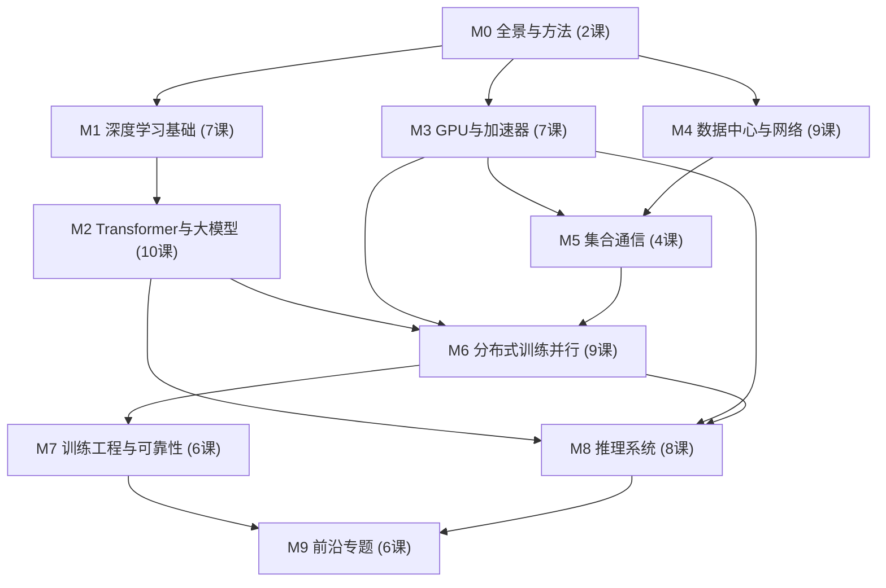

# 《分布式 AI 系统基础》课程总览

> **Foundations of Distributed AI Systems** —— 面向网络与系统方向研究生的 AI Infra 入门课。
> 一句话目标：**把论文里那些看不懂的名词，变成你可以拿来做研究的工具。**

## 一、课程定位

### 为谁设计

本课程为「分布式训练 / 分布式推理的网络与系统优化」方向（MLSys × 计算机网络交叉）的**入门研究生**设计。假设你：

- 有计算机本科基础：会写程序（Python 即可），学过操作系统、计算机网络、计算机组成的基本概念；
- **没有系统学过人工智能**：不要求会推导反向传播，不要求用过 PyTorch；
- 正在或即将读 NSDI / SIGCOMM / OSDI / SOSP / MLSys / EuroSys / ATC / INFOCOM 等会议上关于 AI 基础设施的论文，但被大量术语挡在门外。

### 学完你能做到什么

1. **读得懂**：拿到一篇 AI Infra 论文，Abstract 和 Introduction 里的每个术语都认识，Design 部分能跟上作者的推理；
2. **算得出**：能做本领域最常用的封底估算（back-of-the-envelope）——一个 70B 模型训练要多少显存和算力、一次 all-reduce 要传多少数据、decode 阶段的吞吐上限是多少；
3. **接得上**：知道自己课题组的研究方向（性能 / 资源效率 / 生存性 × 多机 / 多集群 / 多地域 / 边云）在整个领域版图中的位置，能顺着课程给的论文清单开始自己的研究。

### 本课程不是什么

- 不是 AI 算法课：不教你设计新模型、刷精度、调参；数学推导只保留到「能看懂系统论文」的最低必要深度。
- 不是编程训练营：实践课只为建立手感，不追求工程完整性。

## 二、设计原则

1. **术语优先**：每课开头给一段「论文里你读不懂的话」，结尾逐句回读；每课维护「必收术语」清单并汇总进 [[02 术语总表]]。术语一律**英文原文为主、中文注解为辅**，因为论文是英文的。
2. **定量优先**：每课至少一个「算一算」环节。系统研究的直觉来自数量级，不来自形容词。所有课共用 [[03 约定与符号]] 里统一的硬件参数和记账口径，保证跨课数字对得上。
3. **论文导向**：内容取舍的唯一标准是「读顶会论文需不需要」。每课给出延伸阅读（经典论文 / 优质公开教材），指明读到什么深度即可。
4. **系统视角**：始终回答三个问题——数据在哪里？要搬到哪里去？瓶颈是算、是存、还是网？

## 三、模块地图

全课程共 **68 节**：62 节理论课 + 5 节实践课（L09 / L19 / L39 / L48 / L62）+ 1 节选修（L68）。每节课是一篇独立的 Obsidian 笔记，正文约 3000–6000 字，30–60 分钟读完。

## 四、全课程表

> 每节课的详细设计稿（内容要点、必收术语、定量环节、延伸阅读）见 `_课程设计/` 目录下对应模块文件。实现进度见 [[01 进度看板]]。

### M0 全景与方法（打地图）

| # | 课程 | 一句话 | 代表性术语 |
|---|------|--------|-----------|
| L01 | [[L01 全景图]] | 从一句 prompt 到一个 token，穿越模型、GPU、服务器、网络、数据中心的完整旅程，建立全课程的分层地图 | training / inference, scale-up / scale-out, AI Infra 技术栈 |
| L02 | [[L02 如何读系统论文]] | 系统论文的解剖结构、主要会议版图，以及贯穿全领域的性能指标语言 | throughput, latency, p99, speedup, strong/weak scaling, Amdahl's Law |

### M1 深度学习基础（零基础补课）

| # | 课程 | 一句话 | 代表性术语 |
|---|------|--------|-----------|
| L03 | [[L03 机器学习速成]] | 机器学习到底在「学」什么：数据、模型、损失、泛化 | supervised learning, loss, train/val/test, overfitting |
| L04 | [[L04 神经网络与前向传播]] | 神经网络就是一摞矩阵乘法：从神经元到 MLP，学会追踪张量形状 | MLP, activation, logits, softmax, tensor shape, GEMM |
| L05 | [[L05 反向传播与梯度]] | 训练的本质：用链式法则算梯度，以及为什么必须保存 activation | backpropagation, gradient, computational graph, autograd, forward/backward pass |
| L06 | [[L06 优化器]] | 从 SGD 到 AdamW：为什么优化器状态是参数量的 2 倍 | SGD, momentum, Adam, optimizer states, learning rate schedule, warmup |
| L07 | [[L07 训练循环解剖]] | 一个标准 PyTorch 训练循环逐行讲解：batch、step、epoch、梯度累积 | mini-batch, global batch size, gradient accumulation, dataloader, checkpoint |
| L08 | [[L08 CNN与RNN简史]] | Transformer 之前的世界：CNN、RNN 为什么被淘汰，以及老论文里的 ResNet/BERT 基准 | CNN, ResNet, RNN/LSTM, seq2seq, encoder-decoder |
| L09 | [[L09 实践-训练第一个模型]] | 【实践】亲手训练一个小模型，把 L03–L07 的每个名词映射到代码行 | —— |

### M2 Transformer 与大模型（现代 LLM 的解剖学）

| # | 课程 | 一句话 | 代表性术语 |
|---|------|--------|-----------|
| L10 | [[L10 Token与嵌入]] | 语言如何变成张量：tokenizer、词表、嵌入，以及为什么全世界都用 token 计价 | token, BPE, vocabulary, embedding, context window |
| L11 | [[L11 注意力机制]] | Transformer 的心脏：QKV、多头注意力，以及 O(n²) 的代价 | attention, QKV, multi-head, causal mask, softmax |
| L12 | [[L12 Transformer全解剖]] | 一层 Transformer 里到底有什么，手算 Llama-3-8B 的 80 亿参数 | FFN, RMSNorm, residual, RoPE, pre-norm, config.json |
| L13 | [[L13 自回归生成与KV缓存]] | 生成的两阶段：prefill 与 decode，以及 KV cache 为什么是推理系统的主角 | autoregressive, prefill/decode, KV cache, sampling, temperature, top-p |
| L14 | [[L14 预训练]] | 万亿 token 的炼丹全程：数据管线、loss 曲线、训练日志里的黑话 | pretraining, corpus, dedup, loss spike, benchmark, MMLU |
| L15 | [[L15 后训练与对齐]] | 从 base model 到 ChatGPT：SFT、RLHF、DPO、推理模型 | SFT, RLHF, reward model, PPO/DPO/GRPO, LoRA, reasoning model, CoT |
| L16 | [[L16 Scaling Law与算力账]] | 6ND 公式与 Chinchilla 定律：如何估算任何一次训练要烧多少 GPU | scaling law, compute-optimal, FLOPs, 6ND, token budget |
| L17 | [[L17 MoE混合专家]] | 稀疏激活：6710 亿参数为什么只算 370 亿，代价是网络里的 all-to-all | MoE, expert, router, top-k gating, load balancing, capacity factor |
| L18 | [[L18 注意力变体与长上下文]] | MHA→MQA→GQA→MLA 的省显存之路，FlashAttention 与线性注意力扫盲 | GQA, MLA, sliding window, FlashAttention, Mamba/SSM |
| L19 | [[L19 实践-解剖迷你GPT]] | 【实践】跑通一个 nanoGPT：数参数、测 prefill/decode 速度 | —— |

### M3 GPU 与加速器（算力的物理学）

| # | 课程 | 一句话 | 代表性术语 |
|---|------|--------|-----------|
| L20 | [[L20 GPU体系结构入门]] | GPU 为什么快：SIMT、SM、warp，与 CPU 的哲学分歧 | SIMT, SM, warp, kernel, thread block, occupancy |
| L21 | [[L21 GPU内存体系]] | 从寄存器到 HBM：容量、带宽与「搬数据比算数据贵」 | HBM, SRAM, memory bandwidth, PCIe, pinned memory, OOM |
| L22 | [[L22 算力度量与MFU]] | TFLOPS 规格表怎么读（小心稀疏算力陷阱），MFU 才是真实利用率 | GEMM, Tensor Core, TFLOPS, MFU/HFU, GPU utilization |
| L23 | [[L23 Roofline模型]] | 一张图判断计算受限还是访存受限：arithmetic intensity 与 roofline | arithmetic intensity, roofline, compute-bound, memory-bound |
| L24 | [[L24 数值格式]] | FP32 到 FP4：指数位、尾数位，以及 BF16 为什么赢了 | FP16/BF16/FP8, dynamic range, INT8/INT4, overflow |
| L25 | [[L25 节点内互联]] | 一台 8 卡服务器的内部：PCIe、NVLink、NVSwitch，scale-up 与 scale-out 的分界线 | NVLink, NVSwitch, PCIe, DGX/HGX, NVL72, NUMA, GPUDirect |
| L26 | [[L26 加速器生态与软件栈]] | GPU 之外：TPU、国产芯片、出口管制型号，以及从 PyTorch 到 kernel 的软件栈 | TPU, systolic array, H800/H20, CUDA, cuBLAS, Triton, torch.compile |

### M4 数据中心与网络（AI 集群的骨架）

| # | 课程 | 一句话 | 代表性术语 |
|---|------|--------|-----------|
| L27 | [[L27 走进AI数据中心]] | 万卡集群长什么样：机柜、供电、散热、前端网 / 后端网 | rack, pod, front-end/back-end network, PUE, liquid cooling |
| L28 | [[L28 数据中心网络基础]] | 把本科计算机网络对接到 AI 集群：Clos、收敛比、对分带宽 | Clos, leaf-spine, oversubscription, bisection bandwidth, east-west traffic |
| L29 | [[L29 RDMA原理]] | 绕过内核的网络：verbs、QP、InfiniBand 与 RoCEv2 | RDMA, verbs, QP, InfiniBand, RoCEv2, GPUDirect RDMA |
| L30 | [[L30 无损网络与拥塞控制]] | PFC、ECN、DCQCN：无损以太网的代价与「有损 RDMA」的反叛 | lossless, PFC, ECN, DCQCN, incast, PFC storm, UEC |
| L31 | [[L31 AI集群网络拓扑]] | 为 AI 定制的拓扑动物园：胖树、rail-optimized、dragonfly、torus、光交换 | fat-tree, rail-optimized, dragonfly, torus, OCS, NVLink domain |
| L32 | [[L32 路由与负载均衡]] | AI 流量为什么会撞车：ECMP 哈希冲突、包喷洒、自适应路由 | ECMP, elephant flow, packet spraying, adaptive routing, out-of-order |
| L33 | [[L33 在网计算与智能网卡]] | 让交换机帮你做 all-reduce：SHARP、可编程交换机、DPU | in-network computing, SHARP, P4, SwitchML, DPU/SmartNIC |
| L34 | [[L34 存储与数据供给]] | 被忽视的第三条腿：数据集供给、并行文件系统、checkpoint 洪峰 | parallel filesystem, object storage, checkpoint I/O, data pipeline |
| L35 | [[L35 GPU集群调度]] | 为什么你的任务一直在排队：gang scheduling、碎片、配额与公平性 | Slurm, gang scheduling, topology-aware placement, fragmentation, preemption |

### M5 集合通信（分布式的语言）

| # | 课程 | 一句话 | 代表性术语 |
|---|------|--------|-----------|
| L36 | [[L36 集合通信原语]] | all-reduce、all-gather、all-to-all……八大原语图解，以及谁在用它们 | all-reduce, all-gather, reduce-scatter, all-to-all, broadcast, rank |
| L37 | [[L37 通信算法与代价模型]] | ring 还是 tree：用 α-β 模型算清每种集合通信要花多久 | ring all-reduce, α-β model, algorithm/bus bandwidth, latency-bound |
| L38 | [[L38 NCCL解剖]] | 事实标准 NCCL 的内部：channel、protocol、环境变量与看懂 nccl-tests | NCCL, channel, LL/LL128/Simple, PXN, NVLS, busbw |
| L39 | [[L39 实践-动手集合通信]] | 【实践】用 torch.distributed 在笔记本上跑通全部原语并测量 α 和 β | —— |

### M6 分布式训练并行（核心中的核心）

| # | 课程 | 一句话 | 代表性术语 |
|---|------|--------|-----------|
| L40 | [[L40 训练显存全解剖]] | 16 字节 / 参数：算清参数、梯度、优化器状态、activation 各占多少 | memory footprint, optimizer states, activation memory, recomputation |
| L41 | [[L41 数据并行与DDP]] | 最朴素的并行：复制模型、切分数据、all-reduce 梯度 | data parallelism, DDP, gradient bucketing, parameter server, overlap |
| L42 | [[L42 ZeRO与FSDP]] | 把冗余状态切碎：ZeRO 三阶段与 FSDP | ZeRO-1/2/3, sharding, FSDP, HSDP, offload |
| L43 | [[L43 张量并行]] | 把矩阵切开算：Megatron 列切 / 行切，以及为什么 TP 出不了机箱 | tensor parallelism, column/row parallel, sequence parallelism |
| L44 | [[L44 流水线并行]] | 把层切成流水段：micro-batch、1F1B、气泡率与 DualPipe | pipeline parallelism, micro-batch, bubble, 1F1B, interleaved, zero-bubble |
| L45 | [[L45 序列与上下文并行]] | 百万 token 怎么训：Ring Attention 与 Ulysses | context parallelism, Ring Attention, Ulysses, sequence parallelism 辨析 |
| L46 | [[L46 专家并行与MoE训练]] | MoE 训练的网络风暴：all-to-all dispatch/combine 与负载不均 | expert parallelism, all-to-all, dispatch/combine, EPLB, DualPipe |
| L47 | [[L47 混合并行组装]] | 把拼图拼起来：DP×TP×PP×CP×EP 如何映射到集群拓扑 | 3D/4D parallelism, device mesh, TP-intra-node, parallel plan |
| L48 | [[L48 实践-并行策略推演]] | 【实践】纸上推演：给定集群和模型，设计并行方案并核对显存 / 通信量 / 气泡 | —— |

### M7 训练工程与可靠性（万卡训练的现实）

| # | 课程 | 一句话 | 代表性术语 |
|---|------|--------|-----------|
| L49 | [[L49 混合精度与FP8训练]] | BF16 训练配方与 DeepSeek 的 FP8 激进实验 | mixed precision, master weights, loss scaling, Transformer Engine, FP8 |
| L50 | [[L50 显存优化技术]] | 显存不够的三板斧：重计算、offload、内存池 | activation recomputation, gradient checkpointing, offloading, fragmentation |
| L51 | [[L51 算子优化与FlashAttention]] | 为什么快 2 倍不用改模型：kernel fusion、FlashAttention、torch.compile | kernel fusion, FlashAttention, tiling, CUDA graph, Triton |
| L52 | [[L52 性能剖析与MFU核算]] | 拿到一条 timeline 怎么看：profiler、找 gap、算 MFU | torch.profiler, Nsight Systems, timeline, exposed communication, goodput |
| L53 | [[L53 大规模训练可靠性]] | 万卡训练每 3 小时坏一次：故障分类、checkpoint 工程、弹性恢复 | MTBF, NCCL timeout, checkpointing, elastic training, SDC, straggler |
| L54 | [[L54 RL后训练系统]] | 2025 年后最热的系统问题：RLHF 的训练-推理混合引擎 | rollout, actor/critic, hybrid engine, weight sync, veRL, async RL |

### M8 推理系统（Serving 的科学）

| # | 课程 | 一句话 | 代表性术语 |
|---|------|--------|-----------|
| L55 | [[L55 推理性能模型]] | prefill 算力受限、decode 带宽受限：推理性能的第一性原理与 SLO 语言 | TTFT, TPOT/ITL, goodput, SLO, memory-bound decode |
| L56 | [[L56 KV缓存与PagedAttention]] | vLLM 凭什么统治 serving：分页显存管理与前缀缓存 | PagedAttention, block table, prefix caching, RadixAttention, KV offload |
| L57 | [[L57 连续批处理与调度]] | 请求级到迭代级：continuous batching、chunked prefill 与抢占 | continuous batching, chunked prefill, preemption, admission control |
| L58 | [[L58 量化推理]] | 用 4 bit 跑 16 bit 的模型：GPTQ/AWQ、W8A8 与量化税 | quantization, PTQ, GPTQ/AWQ, W4A16/W8A8, calibration |
| L59 | [[L59 投机解码]] | 让小模型打草稿：draft-verify、接受率与 MTP | speculative decoding, draft model, acceptance rate, EAGLE, Medusa, MTP |
| L60 | [[L60 分布式推理与PD分离]] | 推理也要多机：TP/EP 推理、prefill-decode 分离与 KV 传输 | disaggregation, PD 分离, KV transfer, wide-EP, DistServe, Mooncake |
| L61 | [[L61 推理服务框架与集群]] | 从 vLLM 到集群级 serving：路由、自动扩缩、多模型与成本核算 | router, cache-aware routing, autoscaling, multi-LoRA, $/M tokens |
| L62 | [[L62 实践-跑起来一个推理服务]] | 【实践】部署一个小模型服务，测 TTFT/TPOT，对照 roofline 验证 | —— |

### M9 前沿专题（通向你的研究）

| # | 课程 | 一句话 | 代表性术语 |
|---|------|--------|-----------|
| L63 | [[L63 跨域与跨集群训练]] | 单集群装不下之后：多数据中心训练、WAN 通信与 DiLoCo | multi-datacenter training, local SGD, DiLoCo, gradient compression, federated learning |
| L64 | [[L64 边缘与端云协同]] | 把推理搬到用户旁边：端侧 LLM、split inference 与端云投机 | edge inference, on-device LLM, split inference, model cascade, offloading |
| L65 | [[L65 弹性算力与资源效率]] | 用不稳定的算力做稳定的事：spot 训练、弹性伸缩、GPU 共享 | spot instance, elastic training, MIG/MPS, serverless inference, carbon-aware |
| L66 | [[L66 测量仿真与评测]] | 没有万卡怎么做研究：测量论文、trace、ASTRA-sim 与 ns-3 | measurement, trace, ASTRA-sim, ns-3, SimAI, MLPerf, fidelity |
| L67 | [[L67 研究地图与论文清单]] | 领域版图、20 篇必读论文与从课程到研究的路线 | —— |
| L68 | [[L68 选修-多模态与新负载]] | 【选修】VLM、扩散模型、Agent 与 RAG：新负载如何改变系统需求 | ViT, diffusion/DiT, agentic workload, RAG, vector database |

## 五、学习路线

**默认路线**：按编号顺序 L01→L67（L68 选修）。建议每周 3–4 课 + 每周一次 1 小时讨论班（轮流讲「算一算」和自测题），一个学期完成。

**速通路线**（急着读某一类论文时用，读完再回头补全）：

- **推理 / Serving 方向**（约 26 课）：L01–02 → L10–13, L16–18 → L20–25 → L36–37 → L55–62 → L64, L67
- **训练 Infra 方向**（约 34 课）：L01–02 → L03–07 → L10–13, L16–17 → L20–25 → L36–39 → L40–48 → L49–53 → L67
- **网络方向**（约 28 课）：L01–02 → L10–13, L16–17 → L20, L22–23, L25 → L27–35 → L36–39 → L46–47 → L53, L60, L63, L66–67

**只想查一个名词**：直接搜 [[02 术语总表]]。

## 六、质量标准（每节课的验收线）

1. **术语全覆盖**：设计稿「必收术语」清单里的每个词都被正面解释过，并同步进 [[02 术语总表]]；
2. **开场回读闭环**：开头「论文里的这段话」在结尾被逐句解读，读者能自证「现在读懂了」；
3. **算一算可复算**：定量环节给出完整算式和数据来源（统一用 [[03 约定与符号]] 的口径），读者可独立复算出相同数量级；
4. **自测有答案**：结尾 5–8 道自测题（含至少 1 道计算题），答案折叠在 callout 里；
5. **不造假**：所有论文引用真实存在；拿不准的数字、年份、会议名，宁可定性表述或省略。

## 七、协作模式

- **课程架构与逐课设计稿**：Claude（本文档及 `_课程设计/` 由其完成）；
- **逐课正文实现**：GPT（每次新对话实现一节课，工作手册见 [[AGENTS]]，从 [[01 进度看板]] 领任务）；
- **审校**：导师与同学。发现错误请记入 [[01 进度看板]] 的「勘误与反馈」区。
- 本课程由 AI 协作生成，**对具体数字保持核验习惯**——这本身就是系统研究者的基本功。
