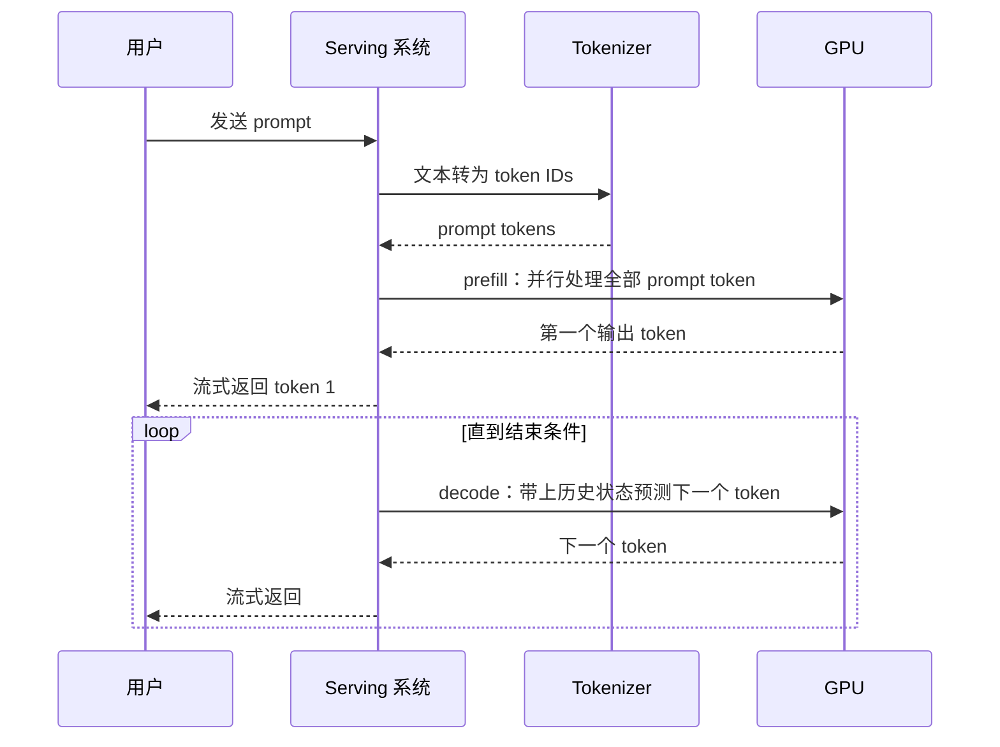
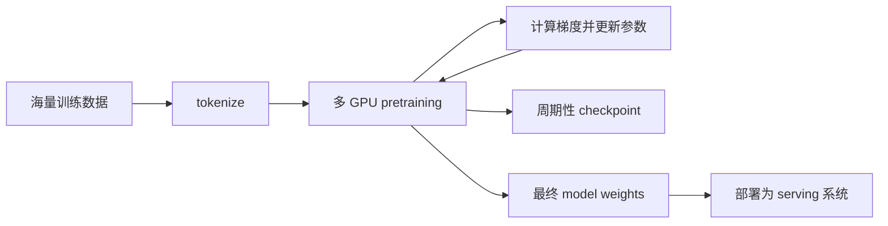
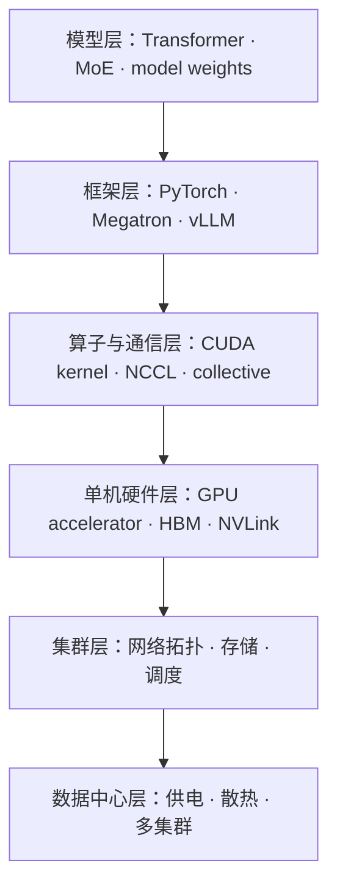
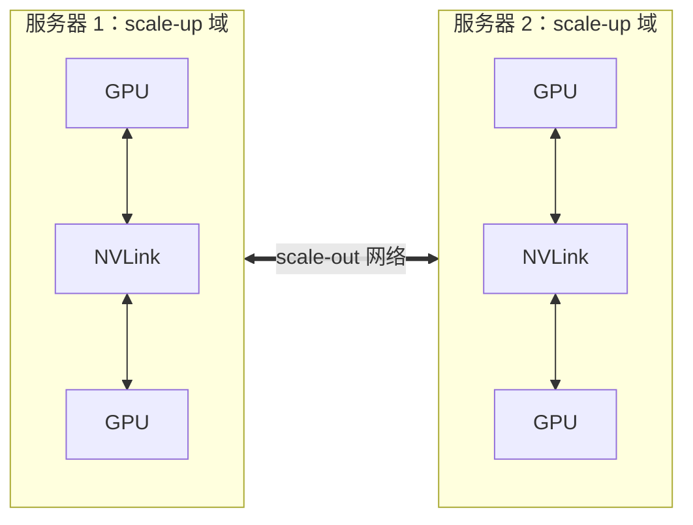

# L01 全景图：从一句 prompt 到一座 AI 数据中心

> [!abstract] 本课速览
> 读完你将能够：
> 1. 沿着物理执行路径，讲清一句 prompt 如何变成连续返回的 token；
> 2. 区分 training 与 inference、scale-up 与 scale-out；
> 3. 把模型、框架、算子、GPU、网络和数据中心放进同一张分层地图；
> 4. 用数量级估算解释为什么 frontier model 离不开大规模并行系统。
>
> 前置：无 · 预计 45 分钟

## 论文里的这段话，你现在可能读不懂

> [!quote]
> We deploy a frontier model on a GPU cluster. Pretraining is a throughput-oriented workload, whereas online serving is latency-oriented. Scale-up accelerators exchange activations over NVLink, while scale-out workers communicate across the network fabric. Model weights and periodic checkpoints are persisted to distributed storage for deployment and recovery.
>
> （改写自 AI 系统论文的典型表述，不对应某一篇论文的原句。）

这四句话没有复杂公式，却横跨了模型、硬件、网络、存储和服务。本课先不深挖任何一层，只给你一张“卫星地图”：以后再遇到一个陌生术语，先知道它在地图的哪一层、沿哪条路径影响系统。

## 一、两条故事线：回答一次，和学会回答

### 1. 推理线：一句 prompt 怎样变成屏幕上的字

你在聊天框里输入一句话后，系统做的不是“查出整段答案”，而是反复预测下一个 **token**（模型处理文本的离散单位）。token 不等同于字或单词；同一句文本会被 tokenizer 切成一串编号，具体切法留到 [[L10 Token与嵌入]]。

使用已经训练好的模型完成预测，叫 **inference**（推理）。把 inference 包装成一个能持续接收请求、排队、批处理、监控并返回结果的在线系统，叫 **serving**（推理服务）。二者就像“发动机工作”和“出租车平台运营”：前者是一次计算，后者还要管乘客、车辆和高峰流量。

这里有两个阶段：**prefill** 一次处理输入 prompt，容易并行；**decode** 每轮只生成下一个 token，必须依赖前面已经生成的结果。为什么两个阶段的资源需求不同，会在 [[L13 自回归生成与KV缓存]] 和 [[L55 推理性能模型]] 展开；多个用户怎样排队和拼成批次，见 [[L57 连续批处理与调度]]。

### 2. 训练线：数据怎样变成权重

模型能回答，是因为它先经历了 **training**（训练）：把数据送入模型，比较预测与目标之间的差异，再反向调整参数。用海量通用语料学习基础能力的阶段叫 **pretraining**（预训练）。在本课程的参考例子中，Llama-3-405B 有 405B 参数，训练数据约 15.6T token，并使用约 16K 张 H100；这些数字来自 [[03 约定与符号]]，这里只用来建立体感。

训练最终得到 **model weights**（模型权重）：也就是决定模型行为的参数数值。训练过程中还会周期性写出 **checkpoint**（检查点），其中除了权重，通常还包含继续训练所需的优化器等状态。权重像完工后的建筑，checkpoint 更像“施工现场存档”：机器故障后可以从存档继续，而不必从地基重来。预训练过程见 [[L14 预训练]]，训练显存与 checkpoint 记账分别见 [[L40 训练显存全解剖]] 和 [[L53 大规模训练可靠性]]。

> [!tip] 一句话心智模型
> training 是“花很长时间把知识写进权重”，inference 是“反复读取权重，及时回答请求”；前者产出模型，后者消费模型能力。

## 二、六层地图：一个 AI 系统到底有哪些层

把刚才两条线叠起来，就得到 **AI Infra**（AI 基础设施）技术栈：支撑模型训练和推理的软硬件整体。研究如何让机器学习 **workload**（工作负载）高效、可靠地运行，通常归入 **MLSys**（Machine Learning Systems，机器学习系统）领域。它关心的不是只把模型精度再提高一点，而是数据在哪里、要搬到哪里、计算和通信为什么等得这么久。

| 层 | 它回答的问题 | 课程中的入口 |
|---|---|---|
| 模型层 | 要算什么，参数和中间状态长什么样？ | [[L12 Transformer全解剖]]、[[L17 MoE混合专家]] |
| 框架层 | 如何表达模型、组织训练循环或接收推理请求？ | [[L07 训练循环解剖]]、[[L61 推理服务框架与集群]] |
| 算子与通信层 | 一次矩阵乘、一次数据搬运或多卡同步怎样执行？ | [[L36 集合通信原语]]、[[L38 NCCL解剖]]、[[L51 算子优化与FlashAttention]] |
| 单机硬件层 | 计算单元、显存和机内互联怎样供给算力与数据？ | [[L20 GPU体系结构入门]]、[[L21 GPU内存体系]]、[[L25 节点内互联]] |
| 集群层 | 多台机器怎样连接、存数据、分配作业和协同运行？ | [[L31 AI集群网络拓扑]]、[[L34 存储与数据供给]]、[[L35 GPU集群调度]] |
| 数据中心层 | 电、冷却、站点与跨集群资源怎样托住上层系统？ | [[L27 走进AI数据中心]]、[[L63 跨域与跨集群训练]] |

GPU 是最常见的 **accelerator**（加速器）：它不是替代 CPU 处理一切，而是把大规模并行的矩阵计算做得特别快。大量 GPU 通过机内互联和网络组成 **GPU cluster**（GPU 集群），再配上 CPU、内存、存储、交换机、供电、散热和调度软件。只盯着 GPU，就像只看发动机而忽略公路、油站和交通规则。

## 三、两种 workload：training 与 inference

**workload**（工作负载）不是单指一段代码，而是系统实际承受的任务形态：输入多大、怎样到达、执行哪些操作、占用哪些资源、用什么指标判定做好了。training 和 inference 使用相似的模型计算，却是两种很不一样的 workload。

| 维度 | Training | Inference / serving |
|---|---|---|
| 目的 | 从数据中学习并更新权重 | 固定权重，为请求生成结果 |
| 时间形态 | 一个持续数天或数月的大作业，最终会结束 | 面向用户持续在线，没有自然终点 |
| 计算路径 | 前向计算 + 反向传播 + 参数更新 | prefill + 逐 token decode |
| 优先指标 | **throughput-oriented**（吞吐导向）：单位时间多处理 token、多完成训练步 | **latency-oriented**（时延导向）：单个请求尽快得到首 token 和后续 token |
| 主要状态 | 权重、梯度、优化器状态、checkpoint | 权重、KV cache、请求队列 |
| 故障后果 | 可从 checkpoint 重启，但会损失检查点后的工作 | 用户正在等待，往往要 failover、重路由或降级服务 |

“吞吐导向”和“时延导向”是主矛盾，不是非黑即白。训练也怕某一步特别慢，因为最慢的 GPU 会拖住其他 GPU；推理也追求整机吞吐，因为批处理能摊薄成本。真正的系统设计总是在吞吐、时延、成本和可靠性之间做权衡。

这也引出贯穿课程的三个目标：

- **性能**：训练多久完成，请求多快返回，尾部请求会不会卡住；
- **资源效率**：买来的 GPU、显存和网络带宽有多少在做有效工作；
- **生存性**：GPU、链路、机架乃至站点出问题时，训练能否恢复，服务能否维持。

> [!warning] 两个常见误区
> 1. “大模型就是算法问题。”算法决定要算什么，系统决定这些计算能否在有限时间、预算和故障条件下完成；frontier model 的可行性本身就是系统问题。
> 2. “一次推理比训练短，所以推理不重要。”单次请求虽短，serving 却持续在线并面对海量、波动的请求；累计资源开销可能非常大，且用户直接感知时延和故障。

## 四、两种扩展：scale-up 与 scale-out

一张 GPU 放不下或算不完，就要扩展资源。**scale-up**（纵向扩展）是在一个高带宽互联域内增加或组合更多 accelerator，典型场景是同一台服务器内的多张 GPU 通过 NVLink 通信。**scale-out**（横向扩展）是增加更多服务器或节点，让它们通过 InfiniBand 或 Ethernet 等集群网络协作。

为什么要分成两套互联？按 [[03 约定与符号]] 的统一口径，H100 SXM 的 NVLink 是 900 GB/s 双向合计，即每方向 450 GB/s；典型 scale-out 配置中，每张 GPU 对应一张 400 Gb/s 网卡，即每方向 50 GB/s。二者单方向相差约 $450/50=9$ 倍。越过服务器边界通常更慢、竞争更多，因此并行策略不能假装所有 GPU 之间都一样近。机内细节留到 [[L25 节点内互联]]，跨节点拓扑留到 [[L31 AI集群网络拓扑]]。

## 五、数量级：为什么需要上万张 GPU

本课程把处于能力和训练规模前沿、需要大规模基础设施支撑的模型称为 **frontier model**（前沿模型）。它不是一个按参数量划出的永久门槛，而是一个会随硬件和算法进步移动的工程概念。

下面只看数量级。表中硬件规格、模型参数和记账公式均取自 [[03 约定与符号]]；FLOPs 表示工作量，FLOPS 表示每秒算力，不能混写。

| 项目 | 课内体感 | 口径 |
|---|---:|---|
| frontier model 参数量 | $10^{11}$–$10^{12}$ 量级 | 参考模型包含 405B、671B |
| 训练数据量 | $10^{13}$ token 量级 | 405B 参考例为 15.6T token |
| 405B 模型训练计算量 | 约 $3.8\times10^{25}$ FLOPs | $6ND$ 估算 |
| 8×H100 节点 BF16 稠密峰值 | 约 $7.9\times10^{15}$ FLOPS | $8\times989$ TFLOPS |
| 万卡集群 IT 功率 | $10$ MW 量级 | 约 1250 个八卡节点 × 10 kW ≈ 12.5 MW；计入 PUE 1.2 后设施输入约 15 MW |

> [!example] 算一算：一张卡要训练 405B 模型多久？
> 取 [[03 约定与符号]] 中 $N=405\text{B}=4.05\times10^{11}$、$D=15.6\text{T}=1.56\times10^{13}$，训练工作量按 $C\approx6ND$：
> $$
> C=6\times(4.05\times10^{11})\times(1.56\times10^{13})
> =3.7908\times10^{25}\ \text{FLOPs}.
> $$
> 再采用本课设计稿指定的情景假设：单张 H100 的**有效**吞吐为 $400\ \text{TFLOPS}=4.00\times10^{14}\ \text{FLOPS}$。它约为表中 $989\ \text{TFLOPS}$ BF16 稠密峰值的 40%，不是新的峰值规格。于是：
> $$
> t=\frac{3.7908\times10^{25}\ \text{FLOPs}}
> {4.00\times10^{14}\ \text{FLOPS}}
> =9.477\times10^{10}\ \text{s}
> \approx3.0\times10^3\ \text{年}.
> $$
> 若希望把约 3000 卡年压到 3 个月，即 $0.25$ 年，即使先假设完美并行，也需要：
> $$
> G\approx\frac{3000}{0.25}=1.2\times10^4\ \text{张 GPU}.
> $$
> 现实中还会有通信、等待、故障和资源未满载，所以这不是工期承诺，而是一笔解释“为什么要万卡并行”的封底估算。卡越多，数据同步越频繁，并行与通信也就自然成为本课程主线。

## 六、系统问题究竟在研究什么

面对任何 AI Infra 论文，先问三个朴素问题：==数据在哪里？要搬到哪里？瓶颈是算、存，还是网？== 绝大多数系统机制都能挂到下面几类问题上。

| 问题 | 可以调整什么 | 想改善什么 | 后续入口 |
|---|---|---|---|
| 模型太大，一张卡放不下 | 模型、数据和状态怎样切分与放置 | 容量、计算效率、通信量 | [[L40 训练显存全解剖]]、[[L47 混合并行组装]] |
| 多卡相互等待 | collective 算法、拓扑映射、通信调度 | 训练完成时间、链路利用率 | [[L37 通信算法与代价模型]]、[[L52 性能剖析与MFU核算]] |
| 在线请求忽高忽低 | 路由、批处理、准入与副本选择 | 吞吐、时延、SLO | [[L57 连续批处理与调度]]、[[L61 推理服务框架与集群]] |
| GPU、链路或站点故障 | checkpoint、重调度、failover、服务降级 | 恢复时间、可用性、生存性 | [[L53 大规模训练可靠性]]、[[L65 推理服务生存性]] |
| 真实集群太贵或难复现 | trace、仿真、故障注入、小规模 testbed | 评估可信度和可复现性 | [[L67 测量仿真与评测]]、[[L68 实践-仿真上手]] |

这张表也是本课程与纯模型算法课的边界：我们当然要懂 Transformer 在算什么，但最终要研究的是 workload 如何在多 GPU、多节点、多集群乃至多地域基础设施上跑得更快、更省、更可靠。

## 七、十个模块怎么走

| 模块 | 它回答的一句话问题 |
|---|---|
| M0 全景与方法 | 领域地图长什么样，系统论文的指标语言怎么读？ |
| M1 深度学习基础 | 前向、反向和优化器到底让 GPU 算什么？ |
| M2 Transformer 与大模型 | token、attention、KV cache、MoE 为什么产生这些系统负载？ |
| M3 GPU 与加速器 | 算力、显存、数值格式和机内互联的物理上限在哪里？ |
| M4 数据中心与网络 | GPU 集群如何联网、供数、调度并维持运行？ |
| M5 集合通信 | 多个 rank 用什么共同语言交换和聚合数据？ |
| M6 分布式训练并行 | 模型、数据和计算怎样切到许多 GPU 上？ |
| M7 训练工程与可靠性 | 怎样把理论并行变成高效、可恢复的长期训练？ |
| M8 推理系统 | 怎样在有限资源下同时守住吞吐、时延与服务目标？ |
| M9 前沿专题 | 多集群、多地域、边云、弹性与仿真怎样连接到研究问题？ |

不知道怎么选时，按 L01→L69 顺序学习最稳。若急着进入论文，可在 [[00 课程总览#五、学习路线|课程总览的学习路线]] 选择三条速通路线：推理 / Serving 路线重点走 M2 和 M8；训练 Infra 路线重点走 M1、M2、M3、M5、M6、M7；网络路线以 M4、M5 为骨架，再追踪通信怎样影响训练、推理和可靠性。精读与速读的具体课号以总览为准。

## 回到开头那段话

现在逐句回读：

1. **“We deploy a frontier model on a GPU cluster.”** —— 把需要大规模基础设施支撑的前沿模型，放到由许多 GPU、网络、存储和调度系统构成的集群上运行；对应第二节和第五节。
2. **“Pretraining is a throughput-oriented workload, whereas online serving is latency-oriented.”** —— 预训练主要追求单位时间多处理 token，在线服务首先要让每个用户及时收到结果；这不是绝对二分，而是两类 workload 的主矛盾；对应第一节和第三节。
3. **“Scale-up accelerators exchange activations over NVLink, while scale-out workers communicate across the network fabric.”** —— 机内 accelerator 借助高带宽 NVLink 协作，跨服务器则要经过更慢且共享的集群网络；对应第四节的两级扩展与 9 倍带宽体感。
4. **“Model weights and periodic checkpoints are persisted to distributed storage for deployment and recovery.”** —— 最终权重用于部署，周期性 checkpoint 用于训练恢复；两者内容和用途不同，都要依靠存储系统；对应第一节的训练线。

如果你现在能指出每个名词在哪一层、影响哪条故事线，这张卫星地图就已经起作用了。

## 术语卡片

| 术语 | 中文 | 一句话解释 |
|---|---|---|
| training | 训练 | 用数据计算误差并更新模型参数的过程。 |
| inference | 推理 | 使用固定权重对输入执行预测或生成的过程。 |
| pretraining | 预训练 | 用大规模通用数据学习基础能力的训练阶段。 |
| serving | 推理服务 | 将 inference 包装成持续接收、调度并响应请求的在线系统。 |
| workload | 工作负载 | 系统实际承受的输入、到达模式、操作序列与资源需求的组合。 |
| GPU cluster | GPU 集群 | 由多台含 GPU 的服务器及网络、存储和调度设施组成的计算集群。 |
| accelerator | 加速器 | 针对特定高并行计算提供高效率的处理器，GPU 是常见代表。 |
| scale-up | 纵向扩展 | 在高带宽互联域内增加或组合更多 accelerator。 |
| scale-out | 横向扩展 | 增加服务器或节点，并通过集群网络协同工作。 |
| AI Infra | AI 基础设施 | 支撑 AI 模型训练、部署与服务的完整软硬件技术栈。 |
| MLSys | 机器学习系统 | 研究机器学习 workload 如何高效、可靠运行的交叉领域。 |
| throughput-oriented | 吞吐导向 | 优先提高单位时间完成的有效工作量。 |
| latency-oriented | 时延导向 | 优先缩短单个请求或操作的完成时间。 |
| token | 词元 | tokenizer 切分出的模型离散处理单位。 |
| model weights | 模型权重 | 训练得到、决定模型计算行为的参数数值。 |
| checkpoint | 检查点 | 为恢复或续训而持久化的权重及相关训练状态快照。 |
| frontier model | 前沿模型 | 处于能力和训练规模前沿、通常需要大规模基础设施支撑的模型。 |

## 自测

1. inference 与 serving 有什么区别？
2. 为什么说 training 偏 throughput-oriented，而 serving 偏 latency-oriented？各举一个不能绝对化的理由。
3. prefill 与 decode 在依赖关系上有什么不同？
4. model weights 与 checkpoint 为什么不能当作同一个概念？
5. 把 NCCL、HBM、vLLM、网络拓扑分别放到本课六层地图中的哪一层？
6. 一张 400 Gb/s 网卡换算成每方向多少 GB/s？与 H100 NVLink 每方向 450 GB/s 相差多少倍？
7. 若一项训练工作需要 3000 卡年，在忽略一切并行损耗时，希望半年完成至少需要多少张 GPU？现实需求通常更高还是更低？

> [!note]- 参考答案
> 1. inference 是使用固定权重完成一次预测或生成的计算过程；serving 是围绕 inference 构建的持续在线系统，还包含排队、批处理、路由、监控和返回结果。
> 2. training 要尽快处理大量 token 和训练步，所以偏吞吐导向；serving 中用户直接等待请求结果，所以偏时延导向。但训练会被最慢一步拖住，也关心步时延；serving 要用批处理控制成本，也关心整机吞吐。
> 3. prefill 可同时处理已有 prompt token；decode 的下一个 token 依赖此前已经生成的 token，因此按轮次推进。
> 4. model weights 是模型参数本身，主要用于部署；checkpoint 是为恢复或续训保存的状态快照，通常还包括优化器等训练状态。
> 5. NCCL 属于算子与通信层，HBM 属于单机硬件层，vLLM 属于框架层，网络拓扑属于集群层。
> 6. $400\ \text{Gb/s}\div8=50\ \text{GB/s}$，网卡端口速率与 NVLink 此处都按每方向比较；$450/50=9$，约相差 9 倍。
> 7. 半年是 $0.5$ 年，因此至少需要 $3000/0.5=6000$ 张 GPU。现实中存在通信、等待、故障和未满载，通常需要更多 GPU 或更长时间。

## 延伸阅读

- Vaswani 等《[Attention Is All You Need](https://papers.nips.cc/paper/7181-attention-is-all-you-need)》（NeurIPS 2017）：本课只看 Figure 1，先感受 Transformer 由哪些模块组成，不必推导 attention。
- NVIDIA [DGX Platform](https://www.nvidia.com/en-us/data-center/dgx-platform/) 与 [HGX Platform](https://www.nvidia.com/en-us/data-center/hgx/) 产品页：只看整机、GPU、机内互联和网络接口的层级关系，建立“一台 AI 服务器”的外观与组成概念。
- 任选一篇课程组正在读的 AI Infra 论文，只读 Abstract：圈出暂时不懂的术语，并尝试把每个词放回本课六层地图；学完相关模块后再回来复读。

---
上一课：无 ← · → 下一课：[[L02 如何读系统论文]]
