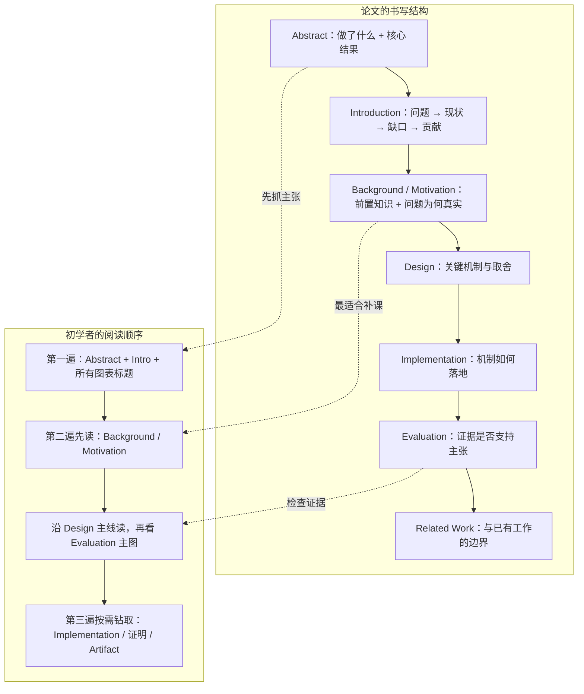
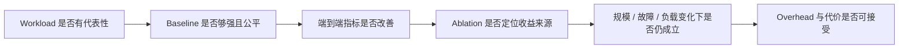
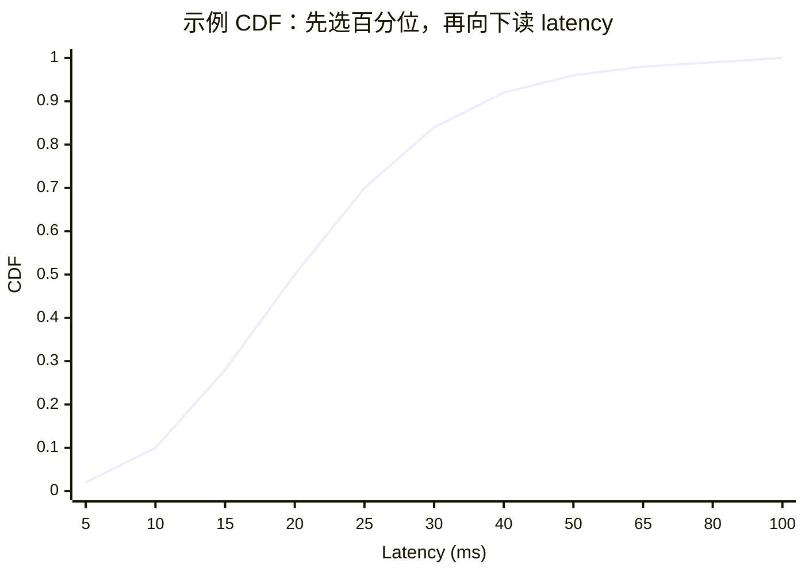
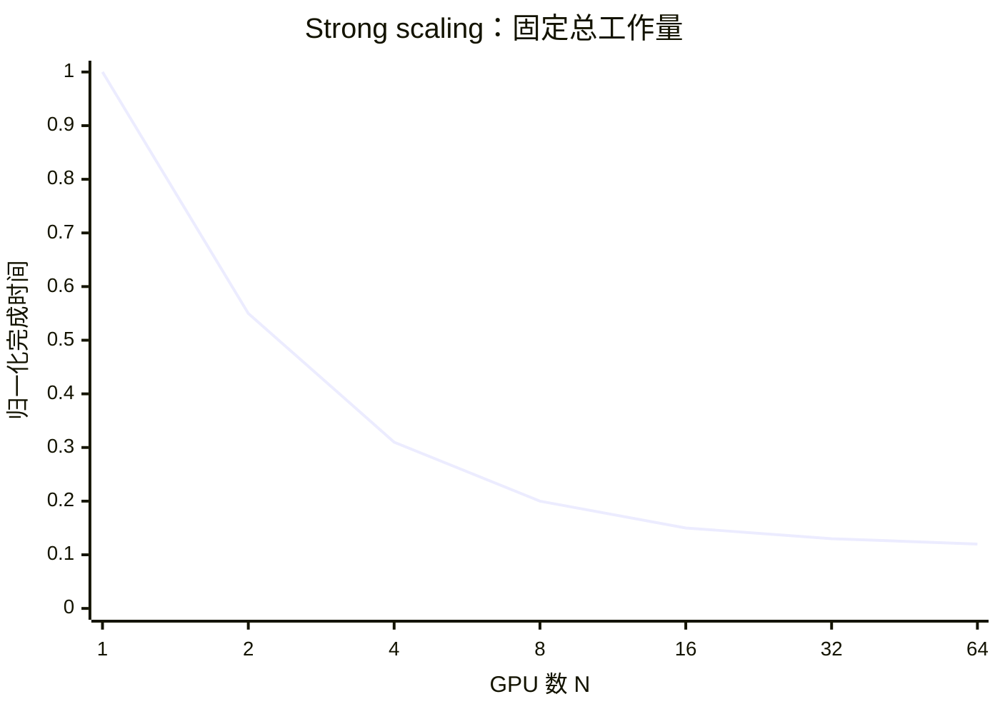
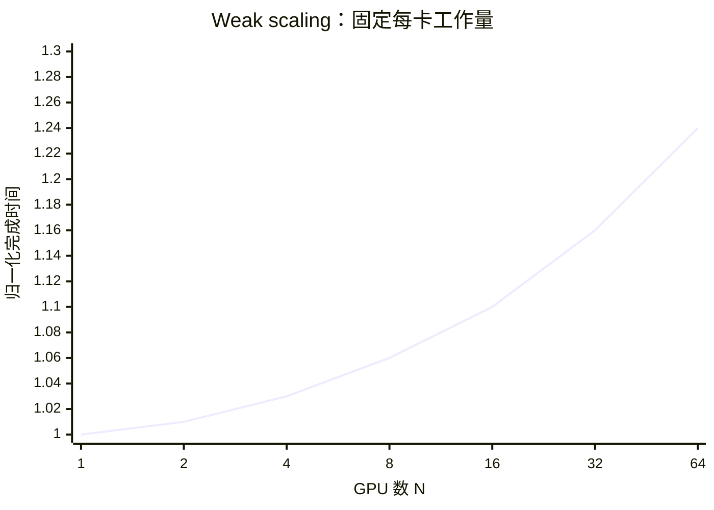

# L02 如何读系统论文：从论文结构到评测语言

> [!abstract] 本课速览
> 读完你将能够：
> 1. 用三遍读法拆解一篇系统论文，并在第一遍后说清它的研究问题与核心结论；
> 2. 用“研究对象—workload—瓶颈—优化变量—目标函数—baseline”六问检查自己是否真正读懂；
> 3. 正确解释 latency、throughput、p99、CDF、goodput 与 speedup，不被平均值和归一化图误导；
> 4. 区分 strong scaling 与 weak scaling，并用 Amdahl's Law 估算并行加速上限；
> 5. 判断一组 Evaluation 是否形成了从机制到端到端收益的完整证据链。
>
> 前置：[[L01 全景图]] · 预计 55 分钟

## 论文里的这段话，你现在可能读不懂

> [!quote]
> On a production-derived trace and a multi-node testbed, System X delivers higher end-to-end goodput than a state-of-the-art baseline while satisfying the p99 latency SLO. An ablation study shows that its scheduler accounts for most of the gain, with modest overhead. It exhibits near-linear weak scaling, but strong-scaling speedup tapers as the non-parallel fraction begins to dominate.
>
> （为教学改写的系统论文典型表述，不对应某篇论文或真实实验。）

这段话压缩了一条证据链：在什么 workload 和环境上，跟谁比，用什么指标，收益来自哪里，扩大规模后是否仍成立。阅读的目标就是把它重新展开。

## 一、先认地图：这篇论文在和谁对话

论文首先是一项研究，其次才是文档。先看它出现在哪个 **venue**（发表场所）：这能提示审稿人期待什么，但不能替你判断对错。

### 1. 主要会议版图

下面的定位只是快速索引。NSDI 同时属于系统与网络，正说明领域本来就互相交叉。

| 方向 | Venue | 一句话定位 |
|---|---|---|
| 系统 | OSDI | 看重有清晰问题、完整设计实现和大规模实证的操作系统与分布式系统工作。 |
| 系统 | SOSP | 偏爱能改变系统设计方式、具有长期影响力的基础机制与系统抽象。 |
| 系统 / 网络 | NSDI | 关注网络化系统，通常要求协议或机制最终落到端到端系统效果。 |
| 系统 | EuroSys | 覆盖操作系统、分布式系统与云系统，重视新颖性和工程实证的平衡。 |
| 系统 | USENIX ATC | 历史上强调可落地、实现完整的操作系统、网络与分布式系统工作。 |
| 云系统 | SoCC | 聚焦云计算平台、资源管理、数据系统和大规模在线服务。 |
| 网络 | SIGCOMM | 关注重要网络问题上的新协议、体系结构、测量发现与系统验证。 |
| 网络 | INFOCOM | 覆盖面较广，常见网络算法、协议、建模与实验评估工作。 |
| 网络 | CoNEXT | 鼓励面向新兴网络问题的机制、系统和测量研究。 |
| MLSys | MLSys | 直接研究机器学习 workload 与系统、硬件之间的效率和可靠性问题。 |
| 体系结构 | ISCA | 关注处理器、存储和互联等计算机体系结构的新设计及跨栈评估。 |
| 体系结构 / 系统 | ASPLOS | 强调体系结构、编程语言和操作系统之间的跨层协同。 |
| 体系结构 | HPCA | 聚焦高性能计算机体系结构的设计、分析与实验。 |
| HPC | SC | 关注超算应用、系统、网络与大规模 HPC 基础设施。 |
| 并行计算 | PPoPP | 聚焦并行编程模型、运行时、编译和性能优化。 |
| HPC / 分布式 | HPDC | 关注高性能分布式、云和数据密集型计算系统。 |

期刊周期通常更长，适合完整论证：ToN 以网络为主，TPDS 覆盖并行与分布式系统，JSAC 常组织通信与网络专题。它们是不同于会议的发表与审稿形态。

AI Infra 论文常先公开在 arXiv，再投稿或发表；“已经上传”不等于“已经同行评审”。正式发表版的题名、实验和结论都可能变化，引用时要分清版本。

录用后按审稿意见和出版格式提交的最终版本叫 **camera-ready**（出版终稿）。配套的代码、配置、数据、脚本和复现说明统称 **artifact**（研究制品）。artifact 未必能一键复现，但能帮助检查实验过程。

> [!tip] 直觉
> Venue 提示讨论主题，却不替论文背书。

## 二、拆开论文：作者按章节写，你按问题读

系统论文的章节顺序很稳定，阅读却不必从第一页直线走到最后一页。

### 1. 每一节究竟在回答什么

- **Abstract**：研究了什么问题，用了什么方法，最重要的结果是什么。先记数字口径，不要只记“提升了多少倍”。
- **Introduction**：通常是“问题重要—现有方法不够—本文补上缺口—贡献列表”的四段论。读完应能复述作者声称的 novelty。
- **Background / Motivation**：解释领域背景，并用测量或案例证明问题真实存在。对初学者来说，这往往是整篇最好的教材；Design 看不懂时，优先回来补这一节。
- **Design**：把观察转成机制。重点追踪输入、状态、决策、执行动作和异常路径，而不是记模块名。
- **Implementation**：交代原型基于什么软硬件、改了哪些层、哪些部分只是模拟，决定机制离部署还有多远。
- **Evaluation**：用实验回答“确实更好吗、为什么更好、换规模还好吗、代价是什么”。第三节会专门拆。
- **Related Work**：说明相邻方案做过什么，以及本文边界在哪里。它很适合在已经懂主线后整理研究谱系。

### 2. 三遍读法

| 遍次 | 建议时间 | 读什么 | 停下来时应有的产物 |
|---|---:|---|---|
| 第一遍 | 约 5 分钟 | 标题、Abstract、Introduction、全部章节名和图表标题 | 一句话问题、一句话方法、一句话结果；决定是否值得继续 |
| 第二遍 | 约 40 分钟 | Background/Motivation、Design 主线、Evaluation 主图 | 一张机制草图、六问答案、两处仍不可信或没看懂的点 |
| 第三遍 | 按需 | 公式、伪代码、Implementation、附录、artifact、引用链 | 复现计划、审稿意见，或能向别人完整讲清的笔记 |

时间不是硬限制。第一遍先建立索引，避免被一个陌生缩写卡住；准备复现、写 related work 或审稿时，再进入第三遍。

### 3. 读完必须能回答的六个问题

| 问题 | 你要写下什么 | AI 系统例子 |
|---|---|---|
| 研究对象是什么？ | 被优化的系统、路径或阶段 | 分布式训练的梯度同步；在线推理的请求调度 |
| **workload**（工作负载）是什么？ | 输入规模、到达模式、操作序列、并行策略与资源需求 | 训练 collective；不同序列长度的推理请求流 |
| 瓶颈是什么？ | 哪种资源或等待主导目标指标 | 网络拥塞、GPU 空转、KV cache 容量、straggler |
| 优化变量是什么？ | 系统真正可以改变的决策 | 路由、batching、带宽份额、模型放置、checkpoint 周期 |
| 目标函数是什么？ | 要最小化或最大化的量，以及约束 | 最小化训练完成时间；在 SLO 下最大化 goodput |
| **baseline**（基线）是谁？ | 用来比较的已有方案、默认配置或消融版本 | 当前主流系统、作者系统关闭某机制后的版本 |

六问应能连成一句话：“某 workload 的瓶颈使目标变差；作者调整一个变量，并相对可信 baseline 改善它。”连不起来，就还没抓住研究问题。

## 三、读 Evaluation：一张图不是结论，是证据的一环

Evaluation 不是展示“跑了很多实验”，而是排除其他解释。完整证据链如下：

### 1. 环境和输入是否像真实问题

**trace**（轨迹）是按时间记录的真实或生成 workload，例如请求到达、序列长度和链路负载。真实 trace 能保留峰谷与相关性，但要核对来源、时间范围与缩放方式；synthetic trace 易于控制变量，却可能漏掉现实长尾。

**testbed**（试验床）是用于可控实验的真实软硬件。它比模拟更接近真实执行，但小规模结果不能自动外推。先核对计算设备、网络、软件版本和节点数，再判断是否覆盖论文主张。

### 2. 比较是否公平

**state-of-the-art（SOTA）**（当前先进水平）是有时间和适用条件的比较标签，不是永久头衔。可信 baseline 应解决同一问题、使用相同资源预算、接受相同输入与约束，并经过合理调优。

归一化柱状图尤其要先找分母。若纵轴写“normalized throughput”，必须确认是“本系统 / baseline”还是“baseline / 本系统”；若横轴使用对数刻度，相邻两点可能是 2 倍或 10 倍，而不是增加一个固定单位。==先读坐标轴、单位、图例和 caption，再看柱子高低。==

### 3. 收益究竟来自哪里

**end-to-end**（端到端）结果覆盖用户经历的完整路径。例如推理 latency 应从请求进入到结果返回，而非只报 GPU kernel 时间。端到端图回答“整体有用吗”，微基准解释“部件为何如此”，两者不能替代。

**ablation study**（消融实验）保持其余条件不变，逐个移除或替换机制，观察收益如何变化。若完整系统快 30%，关闭调度器后只快 5%，这支持“调度器贡献了主要收益”；但多个机制相互作用时，单项差值不能简单相加。

**overhead**（额外开销）是为收益新付出的计算、通信、内存、存储、控制时间或工程复杂度。只报吞吐提升却不报这些代价，证据链仍不完整。

> [!warning] 两个高频陷阱
> - “提升倍数高”不等于系统好：先看 baseline 是否够强、资源是否相同、比较是否 apples-to-apples。
> - “有真实 trace”不等于评估真实：trace 可能只提供输入，实验环境、缩放方式和未建模的依赖仍会改变结论。

## 四、指标语言：先问“统计了什么”，再问“数值多大”

### 1. Latency、throughput 与 goodput

**latency**（时延）是一个请求或操作从开始到完成经过的时间；**throughput**（吞吐）是单位时间完成的工作量。一个像“每位顾客等多久”，一个像“餐厅每小时服务多少人”。增加 batch 往往能让 GPU 更饱满、提高吞吐，却可能让请求等待更久，所以论文常用负载扫描画出 latency-throughput tradeoff，而不是只给一个孤立点。

**goodput**（有效吞吐）只统计满足正确性或服务约束的工作。例如每秒完成 1000 个请求，其中 850 个满足时延目标，则 goodput 是 850 requests/s，原始 throughput 仍是 1000 requests/s。论文必须明确“有效”的判据。

**SLO**（Service Level Objective，服务级别目标）是系统承诺追求的可测目标，例如“某类请求的 p99 latency 不超过阈值”。它通常包含指标、阈值、统计窗口和适用流量；本课只学会读它，[[L55 推理性能模型]] 会继续讨论推理时延指标与服务约束。

### 2. 平均值为何会骗人：percentile 与 tail latency

把 $n$ 个 latency 从小到大排序，位于累计比例 $q$ 附近的值就是第 $q$ **percentile**（百分位数）。**p50** 是中位数，代表一半样本不超过它；**p99** 表示约 99% 的样本不超过它，剩余约 1% 更慢。靠近分布高端的慢请求时延叫 **tail latency**（尾时延）。

假设 99 个请求都是 10 ms，另 1 个请求是 1000 ms。平均值是

$$
\bar L=\frac{99\times 10+1\times 1000}{100}=19.9\ \text{ms}.
$$

“平均 19.9 ms”掩盖了那个等 1 秒的用户。在线服务里，请求还可能扇出到许多子服务，整体完成时间被最慢分支拖住。若 100 个子请求相互独立，且每个都有 1% 概率落入最慢的 1%，那么至少一个落入该尾部的概率为

$$
1-(1-0.01)^{100}=1-0.99^{100}\approx 63.4\%.
$$

也就是说，不是“1% 可以忽略”，而是一次扇出请求很容易遇到至少一个慢分支；现实中的共享拥塞还会让子请求相关，不能机械套用独立假设。

### 3. CDF 图怎么读

**CDF**（Cumulative Distribution Function，累积分布函数）写成

$$
F(x)=P(L\le x),
$$

意思是“latency 不超过 $x$ 的样本占多少”。下面是教学示意，不是真实系统数据：横轴是 latency，纵轴是累计比例。曲线在 20 ms 左右越过 0.50，所以 p50 约为 20 ms；在 80 ms 左右越过 0.99，所以 p99 约为 80 ms。

读 CDF 固定用四步：确认“越小越好”还是“越大越好”；选一个纵轴百分位；水平找到曲线；再垂直落到横轴读数。比较两条 latency CDF 时，在同一百分位上更靠左通常更好。还要检查横轴是否为对数：从 10 到 100 的视觉距离，可能和从 100 到 1000 一样宽。

> [!tip] 直觉
> 平均值把所有人压成一个“平均用户”；percentile 保留了“有多少用户至少这么慢”。服务系统通常不能只照顾平均用户。

## 五、扩展与加速：卡更多，不代表快同样多

### 1. Speedup 先写分母

**speedup**（加速比）定义为 baseline 完成时间与新方案完成时间之比：

$$
S=\frac{T_{\text{baseline}}}{T_{\text{new}}}.
$$

如果同一任务 baseline 用 100 秒，新系统用 25 秒，则 speedup 为 $100/25=4\times$。如果一方用了更多 GPU、更低精度或更小输入，这个数字就混合了机制收益与资源差异。看到“$x\times$ faster”，立刻在旁边写下：相对谁、同样多少资源、同样精度和 workload 吗？

**scalability**（可扩展性）描述系统增加资源或负载后，性能能否以可接受的效率继续变化。它至少有两种不同实验口径。

| 口径 | 保持不变 | 随 GPU 数 $N$ 改变 | 理想现象 | 常回答的问题 |
|---|---|---|---|---|
| **strong scaling**（强扩展） | 总工作量 | 每张卡分到的工作越来越少 | 总完成时间约按 $1/N$ 下降 | 同一个任务加卡能快多少？ |
| **weak scaling**（弱扩展） | 每张卡的工作量 | 总工作量与 $N$ 同比增加 | 完成时间近似不变，或总吞吐与 $N$ 同比增加 | 问题和机器一起变大时能否撑住？ |

下面两条曲线也是示意数据，不代表某款 GPU。strong scaling 中，总工作量固定，完成时间先下降、后因通信和串行部分趋平；weak scaling 中，每卡工作量固定，理想完成时间应保持为 1，实际常随规模缓慢上升。

论文若只写“scales to 1024 GPUs”仍不够：是 strong 还是 weak scaling？batch、模型或数据是否变化？纵轴是总吞吐、每卡吞吐还是完成时间？

### 2. Amdahl's Law：串行尾巴决定天花板

设单卡总时间归一化为 1，其中比例 $f$ 可以被 $N$ 个处理单元理想并行，比例 $1-f$ 必须串行或等待。并行后的时间为

$$
T(N)=(1-f)+\frac{f}{N}.
$$

因此 **Amdahl's Law**（阿姆达尔定律）给出的加速比是

$$
S(N)=\frac{T(1)}{T(N)}
=\frac{1}{(1-f)+f/N}.
$$

当 $N\to\infty$ 时，并行部分趋近于 0，但串行部分不会消失：

$$
S(\infty)=\frac{1}{1-f}.
$$

> [!example] 算一算：95% 和 99% 可并行，差别有多大？
> **例 1：$f=95\%$，无限卡。** 数据来自本课设计稿；这里只使用无量纲比例，不涉及硬件规格。
> $$
> S(\infty)=\frac{1}{1-0.95}=\frac{1}{0.05}=20\times.
> $$
> 即使并行部分有无限资源，剩余 5% 也把上限锁在 20 倍。
>
> **例 2：$f=99\%$，$N=1024$。**
> $$
> \begin{aligned}
> S(1024)
> &=\frac{1}{(1-0.99)+0.99/1024}\\
> &=\frac{1}{0.01+0.0009668}\\
> &\approx 91.2\times.
> \end{aligned}
> $$
> 1024 张卡只得到约 91 倍加速，并行效率约为 $91.2/1024\approx 8.9\%$。这就是大规模训练里 1% 的串行、通信和等待为何致命：卡数越多，每卡计算越短，那 1% 越像一堵不动的墙。

Amdahl 模型不是对真实系统的完整预测：它假设并行部分能理想均分，也没单独建模通信随规模增加的代价。它最有用的地方，是强迫你寻找“不能随加卡缩短的那一部分”。后续 [[L37 通信算法与代价模型]] 会把通信量和参与 rank 数纳入分析。

## 六、把读论文变成可重复的研究动作

读一篇 AI Infra 论文时，可以直接复制下面这张最小卡片：

| 项目 | 你的笔记 |
|---|---|
| 一句话问题 | 没有这项机制时，谁在等什么？ |
| 六问 | 研究对象 / workload / 瓶颈 / 优化变量 / 目标函数 / baseline |
| 核心机制图 | 输入 → 状态 → 决策 → 动作 → 反馈 |
| 主结果 | 指标、单位、percentile、资源数、相对哪个 baseline |
| 证据缺口 | 哪个结论只由单一 workload、模拟或弱 baseline 支撑？ |
| 对自己研究的连接 | 网络、调度、资源分配、故障恢复或仿真中的哪个变量可继续追？ |

遇到陌生词，先查 [[02 术语总表]]；没有就记录英文原词、上下文和暂定解释，读完再校正。术语表要让同一个词保持同一口径。

AI 适合解释术语、展开公式、追踪变量和检查六问；不适合替你做最终学术判断。它可能把作者自述当成真实贡献，也可能补出不存在的 baseline 或数字。要求它引用页码、段落或图号，再回原文核对。

> [!warning] 使用 AI 的边界
> 可以问“这句话里的 goodput 怎么定义”；不要只问“这篇论文贡献大不大”就接受答案。贡献判断依赖真实 related work、baseline 公平性和证据强度，责任仍在读者。

## 回到开头那段话

现在逐句回读：

1. **“On a production-derived trace and a multi-node testbed, System X delivers higher end-to-end goodput than a state-of-the-art baseline while satisfying the p99 latency SLO.”** —— 输入来自生产 workload，环境是真实多节点 testbed；系统相对当前先进 baseline 提高完整路径的有效吞吐，同时守住 p99 目标。还要追问 trace 来源、比较公平性和 SLO 口径。
2. **“An ablation study shows that its scheduler accounts for most of the gain, with modest overhead.”** —— 移除或替换调度器后收益下降，支持该机制是主要来源；同时新增代价有限。还要检查消融是否只改一个变量、overhead 是否完整。
3. **“It exhibits near-linear weak scaling, but strong-scaling speedup tapers as the non-parallel fraction begins to dominate.”** —— 每卡工作量不变时，总处理能力接近随资源增长；固定总任务继续加资源时，串行、通信或等待开始主导，speedup 趋平。这就是 Amdahl's Law 的上限。

现在你不只是在“翻译术语”，而是在检查一句评测结论是否把 workload、环境、baseline、指标、归因、代价和扩展口径交代完整。

## 术语卡片

| 术语 | 中文 | 一句话解释 |
|---|---|---|
| venue | 发表场所 | 论文投稿或发表的会议、期刊等学术场所，其关注点能提示论文所处对话。 |
| camera-ready | 出版终稿 | 论文录用后按审稿意见和出版格式提交的最终版本。 |
| artifact | 研究制品 | 与论文配套的代码、数据、配置、脚本和复现说明等材料。 |
| baseline | 基线 | 用于判断新方案收益的已有方法、默认配置或对照版本。 |
| ablation study | 消融实验 | 保持其他条件尽量不变，移除或替换一个机制以定位收益来源。 |
| workload | 工作负载 | 系统承受的输入、到达模式、操作序列和资源需求的组合。 |
| trace | 轨迹 | 按时间记录的请求、作业或资源事件序列，可来自真实系统或合成生成。 |
| testbed | 试验床 | 为可控、可重复实验搭建的一组真实软硬件环境。 |
| end-to-end | 端到端 | 覆盖用户或任务经历的完整处理路径，而非只测某个局部组件。 |
| latency | 时延 | 单个请求或操作从开始到完成所经历的时间。 |
| throughput | 吞吐 | 单位时间完成的总工作量。 |
| goodput | 有效吞吐 | 单位时间内满足正确性或服务约束的有效工作量。 |
| tail latency | 尾时延 | latency 分布高端少量慢请求所经历的时延。 |
| percentile (p50/p99) | 百分位数（p50/p99） | p50 表示约 50% 样本不超过该值，p99 表示约 99% 样本不超过该值。 |
| CDF | 累积分布函数 | 给出随机变量不超过某个横轴值的累计概率。 |
| speedup | 加速比 | baseline 完成时间除以新方案完成时间，必须同时交代比较口径。 |
| scalability | 可扩展性 | 资源或负载增加时，系统性能继续以可接受效率变化的能力。 |
| strong scaling | 强扩展 | 固定总工作量增加资源，观察完成时间能缩短多少。 |
| weak scaling | 弱扩展 | 固定每个处理单元的工作量增加资源，观察总规模能否同比增长。 |
| Amdahl's Law | 阿姆达尔定律 | 用串行比例限制并行加速上限的定律。 |
| overhead | 额外开销 | 为获得新机制收益而新增的计算、通信、存储、时间或工程代价。 |
| SLO | 服务级别目标 | 针对服务指标、阈值、统计窗口和适用流量设定的可测目标。 |
| state-of-the-art (SOTA) | 当前先进水平 | 在特定时间、任务和约束下被认为具有最强竞争力的方法或结果。 |

## 自测

1. 为什么初学者在第二遍阅读时，通常应优先读 Background/Motivation，而不是直接扎进 Implementation？
2. 用六问框架描述一篇“通过请求路由降低多地域推理尾时延”的论文；至少写出 workload、优化变量、目标函数和 baseline。
3. 一套服务 throughput 为 2400 requests/s，其中 90% 的请求满足既定 latency SLO。按此定义，它的 goodput 是多少？
4. 某 latency CDF 在 30 ms 处的纵轴值为 0.95，在 80 ms 处为 0.99。如何用一句话解释这两个点？
5. 同一任务单卡用时 120 秒，16 卡用时 12 秒。speedup 与并行效率各是多少？这是 strong scaling 还是 weak scaling，还缺什么信息才能判断？
6. 若可并行比例 $f=0.98$，根据 Amdahl's Law，无限资源下的最大加速比是多少？
7. 为什么“在 1024 张 GPU 上运行成功”不足以证明一个系统具有良好 scalability？列出至少三个还需核对的评测口径。

> [!note]- 参考答案
> 1. Background/Motivation 会补齐问题背景、术语和瓶颈证据，是理解 Design 的前提；Implementation 主要回答如何落地，过早进入容易被接口和工程细节淹没。
> 2. 示例：workload 是带到达时间、输入/输出长度和地域来源的推理请求 trace；优化变量是请求应路由到哪个地域或副本；目标是在成本或容量约束下最小化 p99 end-to-end latency 或 SLO 违约率；baseline 可用就近路由、轮询或经过合理调优的现有路由策略。还应继续说明研究对象是多地域推理服务，瓶颈可能是排队、跨地域 RTT 或缓存未命中。
> 3. $2400\times 90\%=2160$ requests/s。throughput 仍为 2400 requests/s，goodput 是满足约束的 2160 requests/s。
> 4. 约 95% 的请求 latency 不超过 30 ms，约 99% 不超过 80 ms；因此 p95 约为 30 ms，p99 约为 80 ms。
> 5. speedup 为 $120/12=10\times$；并行效率为 $10/16=62.5\%$。只有确认总任务、输入和工作量固定，才能称为 strong scaling；若每卡工作量固定、总工作量随卡数增加，则是 weak scaling。
> 6. $S(\infty)=1/(1-0.98)=50\times$。
> 7. 至少要核对：strong 还是 weak scaling；workload 是否随 GPU 数变化；纵轴是总吞吐、每卡吞吐还是完成时间；与多少卡的结果相比；baseline 和硬件是否一致；通信、等待与故障是否计入 end-to-end 指标。

## 延伸阅读

- S. Keshav《How to Read a Paper》：三遍读法的经典出处；第一次只需读方法框架，再拿一篇正在读的论文实操，不必背每条检查项。
- 《MegaScale: Scaling Large Language Model Training to More Than 10,000 GPUs》（NSDI 2024）：只读 Introduction 和 Evaluation 图表标题，用六问框架识别大规模训练的 workload、瓶颈、目标指标与 baseline。
- 《Efficient Memory Management for Large Language Model Serving with PagedAttention》（SOSP 2023，vLLM）：只读 Introduction，圈出“问题证据—设计洞见—贡献”三段，再检查端到端指标与消融分别回答什么。

---
上一课：[[L01 全景图]] ← · → 下一课：[[L03 机器学习速成]]
