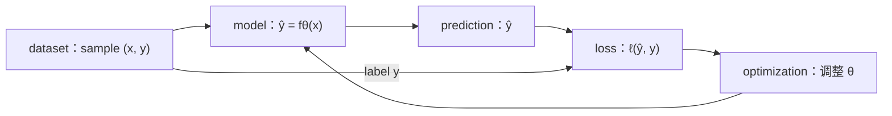
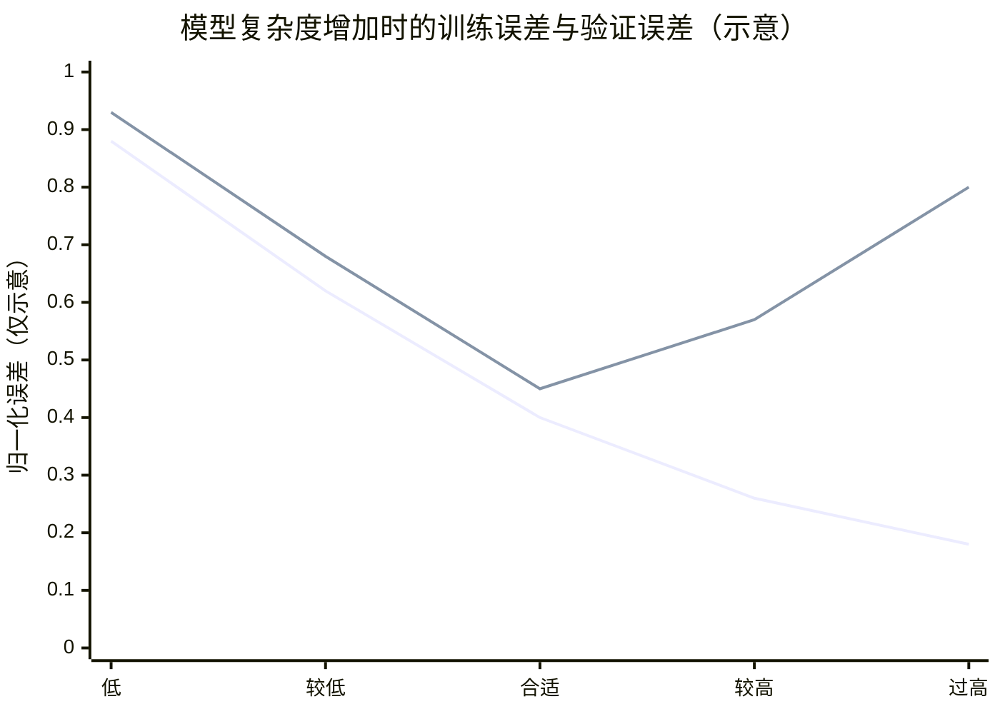

# L03 机器学习速成：从数据、模型、损失到泛化

> [!abstract] 本课速览
> 读完你将能够：
> 1. 用“数据—模型—损失—优化”四件套解释机器学习到底在学什么；
> 2. 区分 sample、feature、label、parameter、loss 与 objective；
> 3. 说明 training、validation、test 三份数据各自能做什么，识别 overfitting 与 underfitting；
> 4. 区分 classification、regression、生成式任务，以及 supervised、self-supervised 与 reinforcement learning；
> 5. 用数量级估算解释为什么训练数据供给会变成存储、I/O 和网络问题。
>
> 前置：[[L01 全景图]] · 预计 50 分钟

## 论文里的这段话，你现在可能读不懂

> [!quote]
> We formulate the task as supervised learning: a parameterized model maps input features to labels, and optimization minimizes an objective computed from the training-set loss. After each epoch, we monitor validation loss; a widening train–validation gap indicates overfitting, whereas high loss on both splits suggests underfitting. Self-supervised learning instead constructs labels from the data itself, as in next-token classification. We select the model on the validation set, report performance on a held-out test set, and then use the fixed weights for inference on unseen samples.
>
> （为教学改写的机器学习论文典型表述，不对应某篇论文或真实实验。）

这四句把“如何学习、如何判断学会、标签从哪里来、训练完怎样使用”全压在了一起。本课要做的，就是把它还原成一条能画出来、能计算、也能映射到系统资源的流水线。

## 一、从写规则到学规则：机器学习究竟在“学”什么

假设你要识别垃圾邮件。传统规则法可能写成：“正文出现 free 就拦截”“陌生发件人且含三个链接就拦截”。问题是，垃圾邮件会换词，正常邮件也可能讨论 free software；规则越补越多，例外也越补越多。

**machine learning**（机器学习）换了一个思路：不给程序写完每条判断规则，而是给它许多过去的例子，让它从数据中拟合一个函数。最小的数学表达是

$$
\hat y=f_\theta(x).
$$

$x$ 是输入，$\hat y$ 是预测；$f$ 描述计算结构，$\theta$ 是可以调整的数值。所谓“学习”，就是找到一组 $\theta$，让这个函数不仅能回答练习题，还能回答没见过的新题。

### 1. 一条数据里有什么

一组用于学习的数据叫 **dataset**（数据集），其中一条记录叫 **sample**（样本）。在垃圾邮件例子里，一封邮件就是一个 sample：

- **feature**（特征）是提供给模型的输入信息，例如词语、链接数量和发件人信息，合起来记作 $x$；
- **label**（标签）是希望模型给出的目标答案，例如“垃圾邮件”或“正常邮件”，记作 $y$。

已有输入—标签配对，并用这些标签指导学习，叫 **supervised learning**（监督学习）。数据集可写成

$$
\mathcal D=\{(x_i,y_i)\}_{i=1}^{n}.
$$

这里的“监督”不是有人盯着 GPU，而是每道练习题都附有标准答案。

### 2. Model、parameter 与 weight

**model**（模型）是把输入映射为输出的带参数函数 $f_\theta$。**parameter**（参数）是训练过程能够调整的数值；在神经网络里，参与加权计算的参数常叫 **weight**（权重）。日常讨论里 parameter 和 weight 经常混用，但严格说，bias（偏置）也是 parameter，却不一定被叫作 weight。

> [!warning] 模型不等于代码文件
> 代码定义“怎样执行 $f_\theta$”，训练得到的参数决定“这个 $f_\theta$ 具体做出什么预测”。同一份模型代码装入随机参数和训练后参数，行为会完全不同。实际部署一个训练好的模型，通常至少需要计算结构、配置和权重；不能把代码与权重混为一物。

这也接上了 [[L01 全景图]]：训练的产物主要是能被保存、复制和部署的 model weights，而不是训练脚本本身。

## 二、监督学习四件套：数据、模型、损失、优化

把一次训练压缩到最小，只需要四类东西：

| 四件套 | 它回答的问题 | 垃圾邮件例子 |
|---|---|---|
| dataset | 从哪些例子学习？ | 邮件及其“垃圾/正常”标签 |
| model | 用什么带参数函数作预测？ | 输入邮件特征，输出垃圾邮件分数 |
| loss function | 这次预测错得有多离谱？ | 预测与标签之间的差距 |
| optimization | 怎样调整参数让总体差距变小？ | 沿着让 loss 下降的方向改权重 |

### 1. Loss 是“错得多远”的尺子

**loss function**（损失函数）把“预测得怎样”变成一个可比较的数。先用回归中常见的均方误差建立直觉：

$$
\ell(\hat y,y)=(\hat y-y)^2.
$$

若标签 $y=1$，预测 $\hat y=0.8$ 时，loss 是 $(0.8-1)^2=0.04$；预测 $\hat y=0.2$ 时，loss 是 $(0.2-1)^2=0.64$。后者离答案更远，惩罚也更大。分类常用的交叉熵会在 [[L05 反向传播与梯度]] 接入训练机制；这里先记住：loss 必须把预测质量变成优化过程能追踪的标量。

单个 sample 有一个 loss；一批或整个训练集上的平均损失，常被写成

$$
J(\theta)=\frac{1}{n}\sum_{i=1}^{n}\ell(f_\theta(x_i),y_i).
$$

这个希望被最小化的整体表达式叫 **objective**（目标函数）。论文和训练日志常把 loss 与 objective 口语化地混用；严谨阅读时要问一句：作者指的是单样本损失、一个 batch 的平均值，还是加上正则项后的完整训练目标？

训练日志总盯着 loss，是因为它几乎每个 batch 都能计算，而且 optimization 直接以它为反馈；相比之下，accuracy 等任务指标可能很久才跳一次，也未必可导。但 training loss 下降只说明训练目标正在改善，是否能够泛化仍要看 validation 数据。

### 2. Optimization 是“找下山方向”

**optimization**（优化）就是调整 $\theta$，让 $J(\theta)$ 逐步变小：

$$
\theta^\star=\arg\min_\theta J(\theta).
$$

可以把 $\theta$ 想成你在山上的位置，把 objective 想成海拔。训练不是一步传送到谷底，而是反复观察局部坡度、向下走一点。坡度怎样由反向传播算出，见 [[L05 反向传播与梯度]]；一步具体怎么走，见 [[L06 优化器]]。

> [!tip] 一句话心智模型
> dataset 出题，model 答题，loss 判卷，optimization 根据错题改参数；然后再来一轮。

## 三、真正的考题在题库外：泛化、数据划分与拟合

把训练集答案全部背下来，并不等于会做新题。模型在没参与训练的新样本上仍表现良好的能力，叫 **generalization**（泛化）。机器学习真正要优化的是泛化表现，而不是把训练集分数刷到最好看。

### 1. Training、validation、test 各司其职

通常先把数据划成互不重叠的三份：

| 划分 | 作用 | 考试类比 | 可以反复看吗？ |
|---|---|---|---|
| **training set**（训练集） | 计算 loss、更新参数 | 练习题 | 可以 |
| **validation set**（验证集） | 选择模型版本和训练配置、决定何时停止 | 模拟考试 | 可以评估，但不能拿来直接更新参数 |
| **test set**（测试集） | 最后一次估计对未见数据的泛化表现 | 密封的正式考试 | 不应反复据此调模型 |

如果你看了 test 结果又回头改训练配置，test 就参与了决策，已经不再是“未见数据”。这叫信息泄漏：不是模型偷偷读了文件才算泄漏，人根据 test 分数做选择同样会污染评估。

模型完整扫描一次 training set，叫一个 **epoch**（轮次）。训练 10 个 epoch，就是每个训练样本原则上被使用了 10 次；至于每次按什么顺序、分成多少 batch，留到 [[L07 训练循环解剖]]。

### 2. Underfitting 与 overfitting

**underfitting**（欠拟合）表示模型连训练数据中的主要规律都没学好：training loss 高，validation loss 通常也高。可能是模型表达能力不足、训练时间不够，或优化没有奏效。

**overfitting**（过拟合）表示模型对 training set 越来越熟，连偶然噪声都记住了，但 validation 表现反而变差。典型信号是 training loss 继续下降，而 validation loss 先下降、后上升，两者差距扩大。

图中第一条线表示 training error，它随模型复杂度增加而下降；第二条线表示 validation error，形成经典 U 形。曲线数值只是帮助看形状的示意，不是实验数据。左侧两边都差，是 underfitting；中间 validation error 最低，是合适区域；右侧训练更好、验证更差，是 overfitting。

> [!warning] 两个高频误区
> - “training accuracy 很高”只说明练习题做得好；模型好不好，要看 validation/test 上的 generalization。
> - test set 不是更大的 validation set。反复用 test 选版本，相当于对正式考试答案调参。

## 四、任务与学习信号：分类、回归、生成

前面的四件套不只属于一种任务。先用“模型输出什么”分三类：

- **classification**（分类）从有限类别中选择，例如“垃圾/正常”，或者在词表中选择下一个 token；
- **regression**（回归）预测连续数值，例如估计一个训练 step 要花多少毫秒；
- **generative modeling**（生成式建模）学习数据分布并生成新内容。LLM 的整体行为是生成文本，但每一步都可看成一次“下一个 token 属于词表中哪个类别”的 classification。

再用“学习信号从哪里来”区分：

- supervised learning 的标签由数据标注直接给出；
- **self-supervised learning**（自监督学习）从数据本身构造标签。例如遮住一个词让模型猜，或用前面的 token 预测下一个 token。它仍然有目标答案，只是不用人工逐条标注；LLM pretraining 主要属于这一类；
- **reinforcement learning**（强化学习）让系统采取动作，再用 reward（奖励）评价长期结果，不要求每一步都有唯一标准标签。它在 LLM 后训练中的位置见 [[L15 后训练与对齐]]。

训练结束后固定参数，把新输入送入模型得到预测或生成结果，叫 **inference**（推理，ML 语义）。这里强调“固定参数做预测”；[[L01 全景图]] 中的 inference/serving 还会继续追问：请求怎样排队、批处理、占用 GPU 并返回用户。

## 五、与系统的接口：dataset 一大，问题就不只在模型里

小数据集可以一次装进内存；到了大模型，训练更像一条持续供料的工业流水线。下面只比较 token-id 或图像文件本身，不把索引、元数据、副本、shuffle buffer、解码中间结果和容灾备份算进去。

> [!example] 算一算：从 47 MB 到 60 TB 量级
> 样本数量与图像磁盘量级采用本课设计稿的教学口径；Byte 按 SI 制，模型 token 数采用 [[03 约定与符号]] 的参考例子 $D=15.6\text{T}$。
>
> **第一阶：MNIST。** 训练集有 60,000 张 $28\times28$ 灰度图。若每个像素按 1 B 原始存储：
> $$
> 60{,}000\times28\times28\times1\ \text{B}
> =47{,}040{,}000\ \text{B}
> \approx47\ \text{MB}.
> $$
> 这还小到一台普通机器可以轻松放下。
>
> **第二阶：ImageNet。** 约 1.3M 张 JPEG 图像的训练集磁盘量级约 150 GB；具体体积会随版本和编码变化。与前面的原始 MNIST 估算相比：
> $$
> \frac{150\times10^9}{47.04\times10^6}\approx3.2\times10^3.
> $$
> 也就是约三千倍，读取、JPEG 解码和随机打乱开始成为可见的系统工作。
>
> **第三阶：LLM 预训练 token。** 若只保存 15.6T 个 token ID，2 B/ID 时：
> $$
> 15.6\times10^{12}\times2\ \text{B}
> =31.2\times10^{12}\ \text{B}
> =31.2\ \text{TB}\approx32\ \text{TB}.
> $$
> 4 B/ID 时则为
> $$
> 15.6\times10^{12}\times4\ \text{B}=62.4\ \text{TB}\approx60\ \text{TB}.
> $$
> 2 B 只适用于 ID 空间能装进 16 bit 的情况；[[03 约定与符号]] 中 Llama-3 的词表 $V=128{,}256$，普通无符号 16 bit 已装不下，工程上常需 4 B 或专门打包。这个 32–60 TB 区间只是 token-id 数组，不等于完整训练数据仓库。
>
> 若把 62.4 TB 理想化地连续送过一条 400 Gb/s（即 50 GB/s）链路，理论下限仍是
> $$
> \frac{62.4\times10^{12}\ \text{B}}{50\times10^9\ \text{B/s}}
> =1248\ \text{s}\approx20.8\ \text{min}.
> $$
> 现实还要受存储吞吐、协议开销、并发竞争、解码和小文件访问影响，因此这只是乐观下限，不是训练实测。

“一个 epoch 是扫描一次训练集”这个定义，现在有了系统含义：数据要从存储读出，经过网络、CPU 解码和预处理，再及时送到 GPU；任何一环慢下来，昂贵的计算资源就会等数据。后续 [[L34 存储与数据供给]] 会把数据格式、并行读取、缓存和 checkpoint I/O 展开。

这也是本课程的研究视角：模型研究可能问“换一个结构能否提高精度”，系统研究则问“给定 workload，数据放在哪里、怎样分片和预取、网络是否拥塞、GPU 是否因供料不足而空转”。前者改变模型本身，后者让训练和推理在真实分布式基础设施上跑得更高效、更稳定。

## 回到开头那段话

现在逐句拆回开场：

1. **“We formulate the task as supervised learning...”**：数据以 $(x,y)$ sample 出题，parameterized model 用 features 预测 label；loss 衡量每次误差，objective 汇总整体目标，optimization 调整参数使它下降。这就是第二节的四件套。
2. **“After each epoch...”**：每扫完一次 training set 就得到一个 epoch；training loss 与 validation loss 的差距扩大是 overfitting 信号，两边都高更像 underfitting。这对应第三节的 U 形曲线。
3. **“Self-supervised learning instead...”**：自监督不是“没有 label”，而是 label 来自数据本身；next-token prediction 把序列中的下一个 token 当作 classification 目标。这对应第四节。
4. **“We select the model...”**：validation set 用于选择，held-out test set 用于最后估计 generalization；之后固定 weights，在 unseen samples 上执行 inference。三份数据的职责不能互换。

开场的每个词现在都能落到一个对象、一条数据流或一次决策上，而不是一串需要死记的英文。

## 术语卡片

| 术语 | 中文 | 一句话解释 |
|---|---|---|
| machine learning | 机器学习 | 用数据拟合带参数函数，使其能对新输入作出预测或生成。 |
| supervised learning | 监督学习 | 用输入与标签配对的数据指导模型学习。 |
| self-supervised learning | 自监督学习 | 从数据本身构造标签，而非依赖人工逐条标注。 |
| dataset | 数据集 | 用于训练或评估的一组样本。 |
| sample | 样本 | 数据集中的一条记录，监督学习中通常写成 $(x,y)$。 |
| feature | 特征 | 提供给模型、用于作出预测的输入信息。 |
| label | 标签 | 监督学习希望模型预测的目标答案。 |
| model | 模型 | 把输入映射为输出的带参数函数。 |
| parameter | 参数 | 训练过程能够调整、并决定模型行为的数值。 |
| weight | 权重 | 神经网络中参与加权计算的参数，口语中常泛指模型参数。 |
| loss function | 损失函数 | 把一次或一批预测的错误程度变成标量的函数。 |
| objective | 目标函数 | 优化过程要最小化或最大化的整体数学表达式。 |
| optimization | 优化 | 反复调整参数以改进 objective 的过程。 |
| training set | 训练集 | 用来计算训练损失并更新参数的数据。 |
| validation set | 验证集 | 用来选择模型版本、训练配置和停止时机的数据。 |
| test set | 测试集 | 留到最后估计模型泛化表现的独立数据。 |
| overfitting | 过拟合 | 训练表现继续改善，但未见数据上的表现变差。 |
| underfitting | 欠拟合 | 模型连训练数据中的主要规律也没有学好。 |
| generalization | 泛化 | 模型在未参与训练的新样本上仍然有效的能力。 |
| epoch | 轮次 | 模型原则上完整使用一次 training set 的过程。 |
| classification | 分类 | 从有限类别集合中预测一个或多个类别。 |
| regression | 回归 | 预测连续数值的任务。 |
| generative modeling | 生成式建模 | 学习数据分布并生成新样本或序列的任务。 |
| reinforcement learning | 强化学习 | 通过动作、环境反馈和 reward 学习决策的范式。 |
| inference | 推理 | 固定已训练参数，对新输入执行预测或生成。 |

## 自测

1. 用一句话解释 machine learning 中的“学习”在数学上做了什么。
2. 以垃圾邮件识别为例，分别给出一个 sample、两个 feature 和一个 label。
3. loss function 与 objective 有什么区别？为什么论文里又常把它们混着说？
4. training、validation、test 三份数据分别负责什么？为什么不能反复根据 test 结果改模型？
5. 只看见“training accuracy 达到 99.9%”，能否判断模型很好？还需要什么证据？
6. 一个 15.6T-token 数据集用 4 B/token 的 ID 数组存储，需要多少 TB？若理想化地经过单条 400 Gb/s 链路，至少要多久？
7. 如果 GPU 每个 epoch 都频繁等数据，应该优先从哪些系统环节排查？这属于模型算法问题还是系统问题？

> [!note]- 参考答案
> 1. 在给定数据和模型结构下，调整参数 $\theta$，使训练 objective 变小，并希望得到能泛化到新数据的函数 $f_\theta$。
> 2. 一封具体邮件是 sample；正文词语和链接数量可作为两个 feature；“垃圾邮件/正常邮件”是 label。
> 3. loss 常指单样本或一个 batch 的误差度量，objective 是优化的完整目标，可能是许多 loss 的平均再加其他项。工程日志常把 batch objective 简称为 loss，所以阅读时要核对定义。
> 4. training set 更新参数，validation set 选择版本和训练配置，test set 最后估计泛化。根据 test 调整会让它参与决策，破坏“未见数据”的独立性。
> 5. 不能。高 training accuracy 可能来自 overfitting；至少还要看独立 validation/test set 上的表现，以及训练—验证差距。
> 6. $15.6\times10^{12}\times4=62.4\times10^{12}$ B，即 62.4 TB。400 Gb/s $=50$ GB/s，所以理想下限为 $62.4\times10^{12}/(50\times10^9)=1248$ s，约 20.8 分钟。
> 7. 排查存储吞吐、小文件访问、网络带宽与拥塞、CPU 解码/预处理、缓存、预取和数据加载并发度。这是在给定 workload 下优化数据供给，主要属于系统问题。

## 延伸阅读

- [《动手学深度学习》](https://zh.d2l.ai/)第 1–3 章：把本课四件套接到线性模型、多层感知机和可运行代码；先读懂概念与图，不必一次吃透推导。
- [3Blue1Brown：But what is a neural network?](https://www.3blue1brown.com/lessons/neural-networks)：用可视化建立“权重怎样把输入变成输出”的直觉，为 [[L04 神经网络与前向传播]] 热身。

---
上一课：[[L02 如何读系统论文]] ← · → 下一课：[[L04 神经网络与前向传播]]
