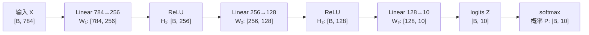
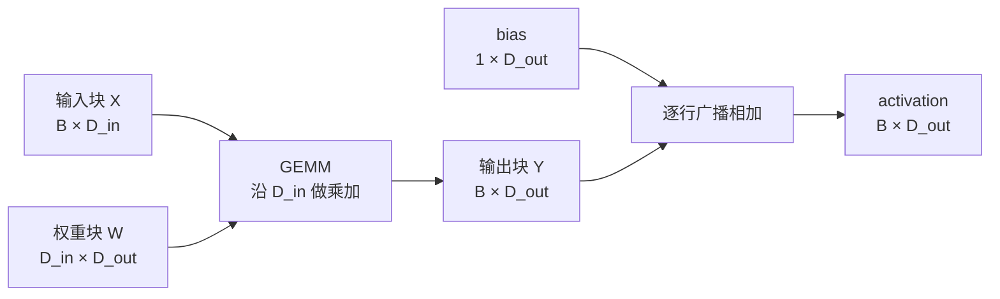

# L04 神经网络与前向传播：一摞矩阵乘法如何变成预测

> [!abstract] 本课速览
> 读完你将能够：
> 1. 把一个神经元拆成“加权和 + activation”，解释没有非线性时深层网络为什么会塌缩；
> 2. 用矩阵乘法写出 linear layer 和 MLP，并区分 hidden layer、hidden size、depth 与 width；
> 3. 沿 batch 维追踪 `784 → 256 → 128 → 10` MLP 中每个 tensor 的 shape；
> 4. 解释 logits 如何经 softmax 变成 probability distribution；
> 5. 手算模型参数量、FP32 权重体积和一次 forward pass 的 FLOPs，说明 GEMM 为什么是 AI 系统的计算主角。
>
> 前置：[[L03 机器学习速成]] · 预计 50 分钟

## 论文里的这段话，你现在可能读不懂

> [!quote]
> Given a batch of inputs, the MLP applies a sequence of linear layers and nonlinear activations during the forward pass. Each layer is dominated by a GEMM whose tensor shapes are determined by the batch dimension and hidden size. The output logits are normalized by softmax into a probability distribution over classes.
>
> （改写自典型论文与框架文档表述）

这三句把 **MLP**、**linear layer**、**activation**、**forward pass**、**GEMM**、**tensor shape**、**batch dimension**、**hidden size**、**logits** 和 **softmax** 挤在了一起。它们听着像十个概念，其实描述的是同一条数据流水线：一批输入怎样经过几次矩阵乘法，最后变成一组类别概率。

## 一、从一个神经元开始：乘加之后为什么还要“掰一下”

在 [[L03 机器学习速成]] 中，模型被写成一个尚未拆开的函数 $f_\theta(x)$。神经网络做的第一件事，是把这个黑盒拆成许多很简单的小计算单元。

一个 **neuron**（神经元）接收若干输入 $x_1,\ldots,x_n$，先分别乘上 weight，再加上 bias：

$$
z=w_1x_1+w_2x_2+\cdots+w_nx_n+b.
$$

这一步叫加权和。接着把 $z$ 送入 **activation function**（激活函数）$\phi$：

$$
y=\phi(z).
$$

你可以把它想成一位“先汇总、再表态”的评审：前半段把各项证据加权打分，后半段根据总分给出响应。今天最重要的激活函数是 **ReLU**（Rectified Linear Unit，修正线性单元）：

$$
\operatorname{ReLU}(z)=\max(0,z).
$$

输入为负就输出 0，输入为正就原样通过。它不神秘，只是给直线加了一个折点，但这个折点非常关键。

### 为什么不能只堆线性层

假设两层都没有 activation：

$$
h=W_1x+b_1,
$$

$$
y=W_2h+b_2.
$$

代入第一式：

$$
y=W_2(W_1x+b_1)+b_2
=(W_2W_1)x+(W_2b_1+b_2).
$$

令 $W'=W_2W_1$、$b'=W_2b_1+b_2$，两层就变回了 $y=W'x+b'$。堆十层也一样，最终仍只是一个线性映射；网络看起来很深，表达能力却没有真正增加。activation 在层与层之间插入非线性，使这种合并不再成立，网络才能表示弯曲、分段且复杂的决策边界。

现代 LLM 中还常见 **GELU**（Gaussian Error Linear Unit）以及后续会遇到的 SwiGLU。现在不必背公式，只要先记住：它们与 ReLU 扮演同一类角色——在线性变换之间加入非线性。它们在 Transformer 中怎样出现，留到 [[L12 Transformer全解剖]]。

> [!tip] 直觉
> 线性层负责“重新配比信息”，activation 负责“把直尺掰出折点”。只有重新配比、没有折点，堆再多层仍能压成一把直尺。

## 二、从神经元到 MLP：一层就是一批神经元一起算

逐个写神经元太慢，也看不出硬件怎样执行。把一层中所有神经元的 weight 排成矩阵，就得到 **fully-connected layer**（全连接层）：上一层的每个输入都连接到下一层的每个输出。框架和论文也常把它叫 **linear layer**（线性层）。

对单个列向量，常见数学写法是

$$
y=Wx+b,
$$

其中 $x\in\mathbb{R}^{D_{in}}$，$W\in\mathbb{R}^{D_{out}\times D_{in}}$，$y\in\mathbb{R}^{D_{out}}$。但训练代码通常把一批样本按“每行一个样本”排成矩阵，于是写成

$$
Y=XW+b,
$$

形状是

$$
[B,D_{in}]\times[D_{in},D_{out}]\rightarrow[B,D_{out}].
$$

这两种写法没有矛盾，只是向量横放还是竖放、weight 是否转置的约定不同。读代码时不要只盯字母顺序，要盯 shape。

把多个 linear layer 与 activation function 交替堆叠，就得到 **MLP**（Multi-Layer Perceptron，多层感知机）：

$$
H_1=\operatorname{ReLU}(XW_1+b_1),
$$

$$
H_2=\operatorname{ReLU}(H_1W_2+b_2),
$$

$$
Z=H_2W_3+b_3.
$$

夹在输入与输出之间、外部看不到直接答案的层叫 **hidden layer**（隐藏层）；隐藏表示的特征维数叫 **hidden size**（隐藏维度）。网络的 **depth**（深度）描述层数，**width**（宽度）描述一层有多少个神经元。不同资料对“depth 是否包含输出层”可能采用不同口径，所以论文写“a 3-layer MLP”时，要结合公式或代码确认它究竟指三个 linear layer，还是三个 hidden layer。

### tensor、shape 与 batch dimension

神经网络中的数据统一装在 **tensor**（张量）里。张量不是一种神秘的新数字，而是对不同维数数组的统称：

| 对象 | 示例 | shape |
|---|---|---|
| 标量 | 一个 loss | `[]` |
| 向量 | 一张展平后的 $28\times28$ 灰度图 | `[784]` |
| 矩阵 | 64 张展平图像 | `[64, 784]` |
| 高维张量 | 一批 RGB 图像 | `[B, 3, H, W]` |

**shape**（形状）记录每个维度有多长。`[64, 784]` 不只是“有很多数字”，而是明确表示 64 个样本、每个样本 784 个 feature。

最前面的 $B$ 常是 **batch dimension**（批次维）：一次不只处理一个样本，而是同时处理一批。原因不只是少写循环；更重要的是，许多向量—矩阵运算能合并成一次更大的矩阵乘法，让 GPU 的大量计算单元同时有活干。batch 越大不保证越快，但太小通常难以把高吞吐硬件喂饱。

> [!warning] 追 shape 时先问三个问题
> 1. 哪一维是 batch？
> 2. 当前最后一维是否等于下一层 weight 的输入维？
> 3. 论文、数学公式和框架的 weight 是否采用了转置约定？

## 三、完整走一遍 forward pass：784 → 256 → 128 → 10

下面的主角 MLP 做十分类。输入可以想成一张展平的 $28\times28$ 灰度图，所以每个样本有 $784$ 个数；$B$ 表示本次一起处理的样本数。

数据从输入到输出、按当前参数依次执行各层运算的过程，叫 **forward pass**（前向传播）。这一遍只回答“当前模型会输出什么”，还没有计算怎样修改 weight；后者是 [[L05 反向传播与梯度]] 的任务。

逐层追踪 shape：

| 步骤 | 运算 | 输入 shape | weight shape | 输出 shape |
|---|---|---:|---:|---:|
| 第一层 | $H_1=\operatorname{ReLU}(XW_1+b_1)$ | `[B, 784]` | `[784, 256]` | `[B, 256]` |
| 第二层 | $H_2=\operatorname{ReLU}(H_1W_2+b_2)$ | `[B, 256]` | `[256, 128]` | `[B, 128]` |
| 输出层 | $Z=H_2W_3+b_3$ | `[B, 128]` | `[128, 10]` | `[B, 10]` |

每一行都遵守同一条规则：左边 tensor 的最后一维，必须等于 weight 的第一维；这两个维度在矩阵乘法中被“消掉”，weight 的第二维成为输出的最后一维。batch 维 $B$ 从头保留到尾。

### logits、softmax 与 probability distribution

输出层的 $Z$ 还不是概率。它的每个原始分数叫 **logits**（未归一化分数），可以为负，也不要求总和为 1。对一个样本的十个 logits $z_1,\ldots,z_{10}$，**softmax** 定义为

$$
p_i=\frac{e^{z_i}}{\sum_{j=1}^{10}e^{z_j}}.
$$

每个 $p_i\in(0,1)$，并且 $\sum_i p_i=1$，于是得到一个 **probability distribution**（概率分布）。例如 logits 最大的类别通常也有最大的 softmax 概率，但 softmax 还告诉我们其他类别分走了多少概率质量。

分类时，**argmax** 直接选择概率最大的类别；生成模型则常按分布 **sampling**（采样），因此同一输入可能产生不同输出。这里只建立区别，温度、top-k、top-p 等细节留到 [[L13 自回归生成与KV缓存]]。

## 四、一层为什么等于一次 GEMM：把模型翻译成硬件工作量

当 $B>1$ 时，linear layer 的主体 $XW$ 是矩阵乘矩阵。系统论文与 GPU 库把这种通用矩阵乘称为 **GEMM**（General Matrix Multiply）。人们常用“深度学习 90% 的计算是 GEMM”强调它的主角地位；这个 90% 是帮助建立直觉的概括，不是适用于所有模型和输入 shape 的固定统计。bias 加法、ReLU 和 softmax 也需要计算，但在宽度较大的 linear layer 中，通常是 GEMM 占据主要 FLOPs。

对 $[B,M]\times[M,N]$ 的矩阵乘，输出有 $B\times N$ 个元素，每个元素大约要做 $M$ 次乘法和 $M$ 次加法。本课程统一把一次乘加记作 2 次 **FLOPs**（floating-point operations，浮点运算次数），所以 GEMM 工作量近似为

$$
2BMN\ \text{FLOPs}.
$$

注意复数 `s`：FLOPs 是“总共做多少次浮点运算”，而 [[03 约定与符号]] 中的 FLOPS 是“每秒能做多少次”，两者分别是工作量和速率。

> [!example] 算一算：参数量 ↔ 体积 ↔ 计算量三连算
> **第一连：参数量。** linear layer 的参数包括 weight 和 bias。主角 MLP 的参数量为
> $$
> \begin{aligned}
> N={}&(784\times256+256)\\
> &+(256\times128+128)\\
> &+(128\times10+10)\\
> ={}&200{,}960+32{,}896+1{,}290\\
> ={}&235{,}146.
> \end{aligned}
> $$
> ReLU 和 softmax 没有可训练参数，所以不增加 $N$。
>
> **第二连：FP32 权重体积。** [[03 约定与符号]] 规定 FP32 为 4 B/参数，因此只存模型参数需要
> $$
> 235{,}146\times4\ \text{B}
> =940{,}584\ \text{B}
> \approx0.94\ \text{MB}.
> $$
> 这是 SI 口径下的权重体积，不包含 activation、梯度和优化器状态。训练时的显存账会在 [[L40 训练显存全解剖]] 展开。
>
> **第三连：一次 forward 的 GEMM FLOPs。** 忽略较小的 bias、activation 和 softmax 开销，batch size 为 $B$ 时：
> $$
> \begin{aligned}
> C_{fwd}
> &\approx2\times(784\times256+256\times128+128\times10)\times B\\
> &=2\times234{,}752\times B\\
> &=469{,}504B\ \text{FLOPs}.
> \end{aligned}
> $$
> 若 $B=64$：
> $$
> C_{fwd}\approx469{,}504\times64
> =30{,}048{,}256\ \text{FLOPs}
> \approx30.0\ \text{MFLOPs}.
> $$
> 同一份参数被 batch 中 64 个样本各使用一次，所以参数体积仍约 0.94 MB，计算量却随 $B$ 放大 64 倍。这正是“参数量相关但不等于计算量”。

> [!warning] 常见误区
> - **“参数量就是计算量。”** 参数量描述要存多少 weight；计算量还取决于这些 weight 被使用多少次。这里一次 forward 的 GEMM 工作量随 $B$ 线性增加，但参数量不变。
> - **“一层只有 GEMM。”** 更准确地说，linear layer 的主体是 GEMM，之后还有 bias、activation；输出端还可能有 softmax。
> - **“神经网络的前向传播很神秘。”** 每个输出最终仍由乘法、加法和简单逐元素函数组成；难点来自规模、并行执行和数据搬运，而不是单次运算本身。

## 五、与系统的接口：模型结构怎样变成 GPU 与网络问题

到这里，神经网络已经可以翻译成系统工程师熟悉的三类对象：

| 模型语言 | 系统语言 | 本课例子 |
|---|---|---|
| parameter | 要存储、搬运的数据 | 235,146 个参数，FP32 约 0.94 MB |
| tensor shape | 算子的输入输出规格 | `[B, 784] → [B, 256] → [B, 128] → [B, 10]` |
| layer / forward pass | 要调度的计算图 | 三次主要 GEMM，加上逐元素运算 |

为什么 GPU 特别适合深度学习？先给一个不涉及硬件细节的答案：GEMM 中有大量结构相同、彼此可以并行的乘加，batch 又把许多样本合并成更大的矩阵，正适合高吞吐加速器。[[L20 GPU体系结构入门]] 会解释这些乘加怎样落到线程、warp 和 Tensor Core；[[L23 Roofline模型]] 会继续问瓶颈究竟是计算还是数据搬运。

当模型大到一张 GPU 放不下，shape 还会决定怎样切分。例如把 weight 的 $D_{out}$ 维切到多张卡上，会让每张卡计算一部分输出，随后可能需要跨卡拼接或规约。于是“一个 linear layer”开始同时产生计算、显存与 collective communication 问题，这正是后续 [[L43 张量并行]] 的入口。

对分布式训练与推理研究来说，追 shape 不是代码洁癖，而是判断通信量和资源占用的基本功：不知道 tensor 有多大，就无法估算它通过 NVLink、PCIe 或集群网络要传多少字节；不知道 GEMM 的输入 shape，也无法解释 batch、并行切分和调度为什么改变吞吐与时延。

## 回到开头那段话

现在逐句拆回开场：

1. **“Given a batch of inputs, the MLP applies a sequence of linear layers and nonlinear activations during the forward pass.”**：输入首先带有 batch dimension；MLP 是 linear layer 与 activation function 的交替堆叠；按当前参数从输入一路算到输出，就是 forward pass。对应第一至第三节。
2. **“Each layer is dominated by a GEMM whose tensor shapes are determined by the batch dimension and hidden size.”**：对 batch 形式的 $Y=XW+b$，主体运算是 `[B, D_in] × [D_in, D_out] → [B, D_out]` 的 GEMM；$B$ 来自 batch dimension，$D_{in}$ 和 $D_{out}$ 来自相邻层的 width / hidden size。对应第二、四节。
3. **“The output logits are normalized by softmax into a probability distribution over classes.”**：输出层先给出任意实数 logits，再由 softmax 变成每项非负、总和为 1 的 probability distribution。对应第三节。

原来的术语密集句，现在可以直接翻成一张 shape 表、三次 GEMM 和一个 softmax。以后读模型代码时，也请养成同一个动作：==每经过一层，先在纸上写下输入 shape、weight shape、输出 shape==。

## 术语卡片

| 术语 | 中文 | 一句话解释 |
|---|---|---|
| neuron | 神经元 | 对输入做加权和与 bias，再通过 activation function 的基本计算单元。 |
| activation function | 激活函数 | 在线性变换之间加入非线性，使多层网络不能被合并成一个线性层。 |
| ReLU | 修正线性单元 | $\max(0,z)$，把负输入截为 0、正输入原样保留的激活函数。 |
| GELU | 高斯误差线性单元 | Transformer 中常见的平滑激活函数，本课只作提名。 |
| fully-connected layer | 全连接层 | 每个输入都连接到每个输出、主体可写成矩阵乘的网络层。 |
| linear layer | 线性层 | 框架中通常指带 weight 和 bias 的 affine 变换，常与 fully-connected layer 同义。 |
| MLP | 多层感知机 | 由多个 linear layer 与 nonlinear activation 交替堆叠的前馈网络。 |
| hidden layer | 隐藏层 | 位于输入层和输出层之间、产生中间表示的网络层。 |
| hidden size | 隐藏维度 | 隐藏表示最后一维的大小，也就是该层的宽度。 |
| depth | 深度 | 网络沿数据流方向堆叠的层数，具体计数口径需结合上下文。 |
| width | 宽度 | 某一层包含的神经元数或输出特征维数。 |
| tensor | 张量 | 对标量、向量、矩阵和更高维数组的统一称呼。 |
| shape | 形状 | tensor 每个维度的长度，例如 `[B, D]`。 |
| batch dimension | 批次维 | 标记一次并行处理多少个样本的维度，通常记为 $B$。 |
| logits | 未归一化分数 | 输出层给各候选类别的原始分数，不要求在 0 到 1 之间或总和为 1。 |
| softmax | softmax | 把一组 logits 归一化为总和为 1 的概率分布。 |
| probability distribution | 概率分布 | 对候选结果分配非负概率且总和为 1 的数值集合。 |
| forward pass | 前向传播 | 按当前参数从输入依次执行各层运算并得到输出的过程。 |
| GEMM | 通用矩阵乘 | General Matrix Multiply，linear layer 的主体计算。 |
| FLOPs | 浮点运算次数 | 衡量计算工作量的单位；本课程把一次乘加记为 2 FLOPs。 |

## 自测

1. 一个 neuron 的两步计算分别是什么？bias 属于哪一步？
2. 为什么连续堆叠多个没有 activation 的 linear layer，表达能力仍等价于一个 linear layer？
3. 单样本公式 $y=Wx+b$ 与 batch 公式 $Y=XW+b$ 为什么都可能正确？读代码时应该用什么判断？
4. 对 `[32, 784] × [784, 256]`，输出 shape 是什么？如果误用 `[128, 256]` 的 weight，会在哪里报 shape 不匹配？
5. logits 是否必须为正、总和为 1？softmax 后的结果具有什么性质？argmax 与 sampling 有何区别？
6. 主角 MLP 若只把 batch size 从 64 增加到 128，参数量、FP32 权重体积和一次 forward 的 GEMM FLOPs 分别怎样变化？算出 FLOPs。
7. 一篇系统论文把某 linear layer 的输出维切到 4 张 GPU 上。为了估算后续通信量，你至少需要知道哪些 tensor shape 和 dtype 信息？

> [!note]- 参考答案
> 1. 先计算加权和 $z=\sum_iw_ix_i+b$，再计算 $y=\phi(z)$；bias 属于前面的 affine 变换。
> 2. 线性/affine 变换的复合仍是 affine 变换，例如 $W_2(W_1x+b_1)+b_2=(W_2W_1)x+(W_2b_1+b_2)$。没有非线性时，多层可以合并。
> 3. 前者常把样本写成列向量，$W$ 为 `[D_out, D_in]`；后者把 batch 中样本写成行，$W$ 为 `[D_in, D_out]`。应以实际 tensor shape 和框架 API 约定判断，而不是死记字母顺序。
> 4. 输出是 `[32, 256]`。矩阵乘要求左矩阵最后一维等于右矩阵第一维；`[32, 784] × [128, 256]` 中 784 与 128 不相等，因此无法相乘。
> 5. logits 可以是任意实数，也不要求和为 1；softmax 后每项在 0 与 1 之间且总和为 1。argmax 取最大概率类别，sampling 按概率随机抽取结果。
> 6. 参数量仍为 235,146，FP32 权重体积仍约 0.94 MB；FLOPs 随 $B$ 翻倍：$469{,}504\times128=60{,}096{,}512$ FLOPs，约 60.1 MFLOPs。
> 7. 至少要知道输入、weight 和输出的完整 shape，切分发生在哪一维，每张卡持有的局部 shape，batch size，以及通信 tensor 的 dtype 字节数。若还要估算通信模式，需知道后续算子需要局部结果还是完整结果。

## 延伸阅读

- [《动手学深度学习》第 4 章：多层感知机](https://zh.d2l.ai/chapter_multilayer-perceptrons/index.html)：把本课的线性层、activation 与 MLP 接到公式和代码；重点跟踪每一层的输入输出 shape。
- [3Blue1Brown：But what is a neural network?](https://www.3blue1brown.com/lessons/neural-networks)：用手写数字识别建立 neuron、weight、bias 和 layer 的视觉直觉；先看第 1 集即可。

---
上一课：[[L03 机器学习速成]] ← · → 下一课：[[L05 反向传播与梯度]]
