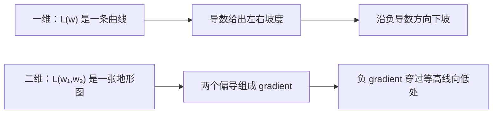
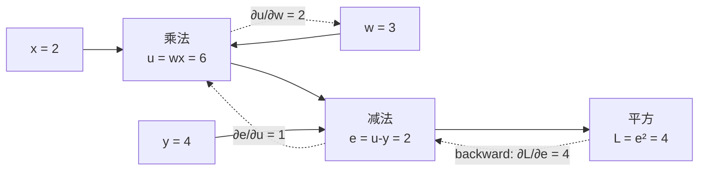
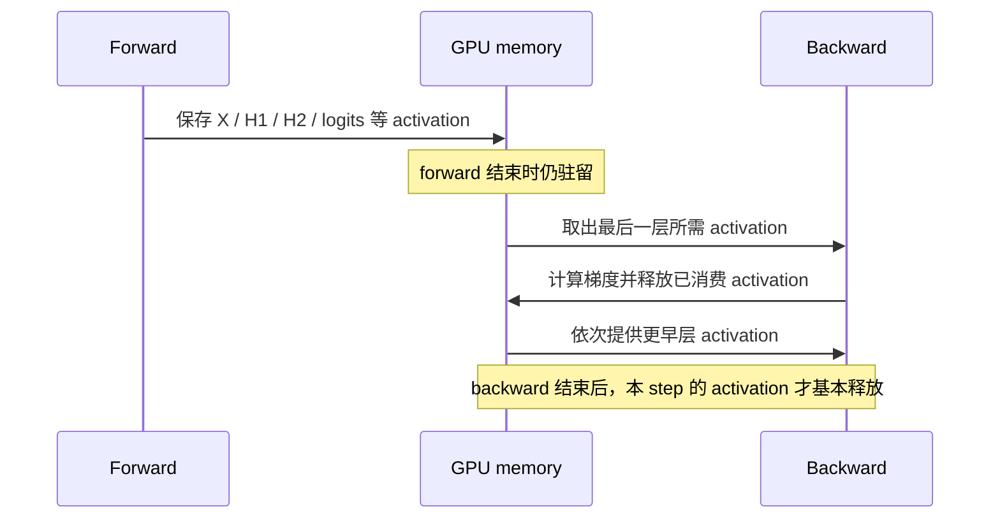

# L05 反向传播与梯度：训练为什么要记住前向过程

> [!abstract] 本课速览
> 读完你将能够：
> 1. 用“多维坡度”解释 gradient，并说明为什么沿负梯度方向能让 loss 局部下降；
> 2. 解释 cross-entropy loss 为什么会重罚“对正确答案很没信心”的分类结果；
> 3. 沿 computational graph 用 chain rule 手算一个参数梯度，并说清 autograd 自动化了什么；
> 4. 区分 backward pass 中对 weights 和 inputs 的两类梯度，解释为什么必须保存 activation；
> 5. 手算主角 MLP 在 batch=256 时的训练显存下界与 forward/backward FLOPs；
> 6. 识别 vanishing/exploding gradient、NaN 与 Inf 的基本症状。
>
> 前置：[[L04 神经网络与前向传播]] · 预计 55 分钟

## 论文里的这段话，你现在可能读不懂

> [!quote]
> During the forward pass, autograd records a computational graph and saves activations required for gradient computation. The backward pass applies the chain rule to compute gradients with respect to both weights and inputs. Its compute cost is roughly twice that of the forward pass, while saved activations make training substantially more memory-intensive than inference.
>
> （改写自典型论文与框架文档表述）

这三句把 **autograd**（自动微分机制）、**computational graph**（计算图）、**activation**（中间激活值）、**gradient**（梯度）、**backward pass**（反向传播）和 **chain rule**（链式法则）压在了一起。它真正想说的是：训练不能只算出答案，还得沿来路追查“每个参数对错误负了多少责任”。为了能原路追查，系统必须记住前向传播留下的中间结果。

## 一、没有梯度，参数就不知道往哪边改

[[L04 神经网络与前向传播]] 已经把模型拆成 linear layer、activation function 和 softmax。forward pass 能得到预测，loss function 能给预测打一个错误分数。但假设模型有数十亿个 parameter，只知道“这次 loss 是 2.3”仍然不够：究竟该改哪个参数、往上还是往下改、改多少？逐个参数试错，代价完全不可接受。

### gradient 是多维空间里的坡度

对只有一个参数 $w$ 的 loss $L(w)$，导数 $\frac{\partial L}{\partial w}$ 是当前位置的斜率。若斜率为正，稍微增大 $w$ 会使 loss 上升；若斜率为负，增大 $w$ 会使 loss 下降。

模型有许多参数时，把每个偏导数排在一起，就得到 **gradient**（梯度）：

$$
\nabla_\theta L=
\left[
\frac{\partial L}{\partial \theta_1},
\frac{\partial L}{\partial \theta_2},
\ldots,
\frac{\partial L}{\partial \theta_n}
\right].
$$

gradient 指向 loss 在当前点上升最快的方向，所以它的反方向 $-\nabla_\theta L$ 是局部下降最快的方向。注意“局部”二字：它像站在山坡上只看脚下的坡度，不保证一步就到全局最低点。具体怎样选步长、怎样结合历史梯度更新参数，是 [[L06 优化器]] 的内容。

举个可算的例子：若 $L(w)=(w-3)^2$，则

$$
\frac{\mathrm dL}{\mathrm dw}=2(w-3).
$$

站在 $w=5$ 时，gradient 为 $4$，说明向右走会升高，应该向左走；站在 $w=1$ 时，gradient 为 $-4$，应该向右走。gradient 的正负给方向，绝对值给当前位置对参数变化的敏感程度。

> [!tip] 直觉
> loss 是海拔，parameter 是地图坐标，gradient 是脚下最陡的上坡箭头。训练先把箭头反过来，再由 optimizer 决定迈多大一步。

### 分类任务为什么常用 cross-entropy loss

主角 MLP 最后用 softmax 输出十个类别的概率。对单个样本，若正确类别的预测概率是 $p_{\text{正确}}$，**cross-entropy loss**（交叉熵损失）可写成

$$
L=-\log p_{\text{正确}}.
$$

它像一张“对正确答案信心不足”的罚单：

| $p_{\text{正确}}$ | $-\log p_{\text{正确}}$ | 直观含义 |
|---:|---:|---|
| 0.9 | 约 0.105 | 正确且有信心，罚得很轻 |
| 0.5 | 约 0.693 | 犹豫不决 |
| 0.1 | 约 2.303 | 对正确答案很没信心，重罚 |

分类并非数学上“不能”用 MSE，但 softmax + cross-entropy 与类别的概率解释直接匹配；当模型自信地答错时，$-\log p_{\text{正确}}$ 还会给出强烈惩罚和有用的梯度。因此它是分类与语言模型训练的标准选择。LLM 的“预测下一个 token”本质上也是在词表上做分类，训练日志中的 loss 仍来自同一思路，[[L14 预训练]] 会继续回收它。

## 二、chain rule：沿计算图逐段追责

神经网络不是一个不可拆的巨型公式，而是许多小运算首尾相接。**computational graph**（计算图）把 tensor 或标量画成节点，把运算依赖画成边。forward pass 沿图从输入走到 loss；求梯度时则从 loss 反向走回来。

### 三个运算节点的完整手算

考虑一个最小例子。输入 $x=2$，参数 $w=3$，目标 $y=4$：

$$
u=wx,
\qquad
e=u-y,
\qquad
L=e^2.
$$

forward pass 得到 $u=6$、$e=2$、$L=4$：

现在问：$w$ 变化一点，最终的 $L$ 会变化多少？**chain rule**（链式法则）把沿途的局部导数相乘：

$$
\frac{\partial L}{\partial w}
=\frac{\partial L}{\partial e}
\frac{\partial e}{\partial u}
\frac{\partial u}{\partial w}
=(2e)\times1\times x
=4\times1\times2
=8.
$$

这就是 $w$ 对 loss 的“责任分数”。同理，输入也能收到梯度：

$$
\frac{\partial L}{\partial x}
=\frac{\partial L}{\partial e}
\frac{\partial e}{\partial u}
\frac{\partial u}{\partial x}
=4\times1\times w
=12.
$$

手算神经网络会很繁琐，但每一步仍只是“接收上游梯度 × 当前运算的局部导数”。分支汇合时，把来自不同路径的贡献相加即可。所谓反向传播，不是一套脱离微积分的新魔法，而是 chain rule 在 computational graph 上的系统执行。

### autograd 自动做了什么

**automatic differentiation**（自动微分）让框架根据实际运算自动构造导数计算。PyTorch 等框架通常把这套机制简称为 **autograd**。它在 forward pass 中记录：

1. 哪个运算产生了当前 tensor；
2. 这个运算依赖哪些输入；
3. backward 时计算局部导数所需保存的值。

从标量 loss 发起 backward 后，autograd 按依赖关系的反方向遍历图，调用每个算子的 backward 规则，并把梯度累积到需要它的 tensor 上。它省掉的是机械记账和手写导数代码，不是 chain rule 本身。

> [!warning] 常见误区
> - **“autograd 是数值差分。”** 主流深度学习框架通常对已知算子应用解析的局部导数并组合它们，不需要给每个参数做一次扰动试验。
> - **“backward 会自动更新参数。”** backward 只计算并存放 gradient；怎样根据 gradient 更新参数由 optimizer 决定。
> - **“有计算图就必须永久保存全部 tensor。”** 图描述依赖；实际只需保存 backward 规则需要且尚未消费的值。编译、算子融合和重计算会改变具体保存集合。

## 三、backward pass 的两笔梯度账

**backward pass**（反向传播）从 loss 出发，按计算依赖的逆序计算梯度。以 batch 形式的 linear layer 为例：

$$
Y=XW+b.
$$

假设上游已经传来 $G=\frac{\partial L}{\partial Y}$，这一层至少要算两类结果：

$$
\underbrace{\frac{\partial L}{\partial W}=X^\mathsf{T}G}_{\text{gradient with respect to weights}},
\qquad
\underbrace{\frac{\partial L}{\partial X}=GW^\mathsf{T}}_{\text{gradient with respect to inputs}}.
$$

- **gradient with respect to weights**（对 weights 的梯度）最终交给 optimizer，用来更新 $W$；
- **gradient with respect to inputs**（对 inputs 的梯度）不是为了修改训练样本，而是继续传给前一层，让更早的 weights 也能收到责任分数。

如果一层只算 $\frac{\partial L}{\partial W}$ 而不算 $\frac{\partial L}{\partial X}$，梯度到这里就断了，前面的层无法训练。这就是 backward 中“两笔账”都不能少的原因。

### activation function 不等于 activation

这里最容易混淆两个长得很像的词：

- **activation function** 是 ReLU、GELU 这样的函数规则；
- **activation**（中间激活值）是 forward pass 中各层实际产生的 tensor，例如主角 MLP 的 $H_1$、$H_2$。

论文写 **activation memory** 时，指后者占用的显存，不是把函数公式存在显存里。为什么 backward 需要 activation？上面的 $\frac{\partial L}{\partial W}=X^\mathsf{T}G$ 必须重新拿到 forward 时的输入 $X$；ReLU 的 backward 也要知道哪些 forward 输入大于 0，才能决定梯度在哪些位置通过。没有这些中间值，就缺少 chain rule 中的局部信息。

这条生命周期解释了训练和推理的根本差异：推理只向前走，中间 tensor 用完即可尽快复用内存；训练还要回来，所以 forward 必须“沿路留收据”。[[L40 训练显存全解剖]] 会把 activation、parameter、gradient 和 optimizer states 放进同一张完整显存账；[[L50 显存优化技术]] 会讨论“不存、需要时重算”的 activation recomputation。

> [!example] 算一算：batch=256 时，训练到底多存了什么
> 沿用 [[L04 神经网络与前向传播]] 的 `784→256→128→10` MLP。它有 235,146 个 parameter；本例所有 tensor 都按 [[03 约定与符号]] 的 FP32 = 4 B 计算，不计 allocator、算子 workspace、softmax 的额外临时量，也暂不计 [[L06 优化器]] 才引入的 optimizer states。
>
> **1. parameter。** 训练和推理都要保存：
> $$
> M_{param}=235{,}146\times4\ \text{B}
> =940{,}584\ \text{B}
> \approx0.941\ \text{MB}.
> $$
>
> **2. gradient。** 每个 parameter 对应一个 FP32 gradient：
> $$
> M_{grad}=235{,}146\times4\ \text{B}
> \approx0.941\ \text{MB}.
> $$
>
> **3. saved activation。** 为了给每层 backward 提供输入，简化地保存 $X$、$H_1$、$H_2$ 和 logits $Z$ 各一份：
>
> | tensor | shape | 元素数 | FP32 体积 |
> |---|---:|---:|---:|
> | $X$ | `[256, 784]` | 200,704 | 0.803 MB |
> | $H_1$ | `[256, 256]` | 65,536 | 0.262 MB |
> | $H_2$ | `[256, 128]` | 32,768 | 0.131 MB |
> | $Z$ | `[256, 10]` | 2,560 | 0.010 MB |
>
> 所以
> $$
> M_{act}=(200{,}704+65{,}536+32{,}768+2{,}560)\times4
> =1{,}206{,}272\ \text{B}
> \approx1.206\ \text{MB}.
> $$
>
> 为建立一笔可复算的容量账，按 parameter、gradient buffer 和 saved activation 都预留空间，训练的简化预算为
> $$
> M_{train}\approx M_{param}+M_{grad}+M_{act}
> =3.087\ \text{MB}.
> $$
>
> 这相当于仅权重体积的
> $$
> \frac{3.087}{0.941}\approx3.28\times.
> $$
>
> **口径提醒：3.28× 的分母是“推理仅权重基线”，不是完整推理峰值。** 推理还需要当前层 activation，但可以随层推进释放。若理想化地只计最大当前 tensor $X$，推理小计约 $0.941+0.803=1.744$ MB；若保守地计最大一对相邻输入/输出 $X+H_1$，则约 $0.941+0.803+0.262=2.006$ MB。对应训练/推理比约为 1.54–1.77×。真实框架还受 tensor 生命周期、融合、workspace 和内存分配器影响。本例要建立的可靠结论不是一个固定倍数，而是：==训练要额外常驻 gradient，并跨越整个 forward 保存 backward 需要的 activation；batch 增大时 activation 还会随之增长。==

## 四、为什么 backward 约是 forward 的两倍计算

对 $Y=XW$，forward 的主要 GEMM 计算量约为

$$
C_{fwd}\approx2BMN\ \text{FLOPs}.
$$

backward 中，计算 $\frac{\partial L}{\partial W}=X^\mathsf{T}G$ 是一次同量级 GEMM；计算 $\frac{\partial L}{\partial X}=GW^\mathsf{T}$ 又是一次。因此忽略 bias、activation 等较小算子时：

$$
C_{bwd}\approx2C_{fwd},
\qquad
C_{train}=C_{fwd}+C_{bwd}\approx3C_{fwd}.
$$

继续用主角 MLP。[[L04 神经网络与前向传播]] 已算出它一次 forward 的主要 GEMM 工作量为 $469{,}504B$ FLOPs。取 $B=256$：

$$
C_{fwd}=469{,}504\times256
=120{,}193{,}024\ \text{FLOPs}
\approx120.2\ \text{MFLOPs},
$$

$$
C_{bwd}\approx240.4\ \text{MFLOPs},
\qquad
C_{train}\approx360.6\ \text{MFLOPs}.
$$

这正是 [[03 约定与符号]] 中大模型经验式的来源：每个 parameter 对每个 token，forward 约 2 次 FLOPs，backward 约 4 次 FLOPs，所以训练约 $6N$ FLOPs/token，而只做一次 forward 的推理约 $2N$ FLOPs/token。这里先记住量级；[[L16 Scaling Law与算力账]] 会正式推导 $6ND$，并讨论长序列 attention 的修正项。

> [!warning] “训练约为推理 3 倍计算”不是所有场景的精确常数
> $2N$ 与 $6N$ 是以 parameter 参与的主要矩阵乘为核心的经验账。不同算子、是否需要输入梯度、长序列 attention、重计算和通信都会改变实测比例。论文用它做估算时，要先看作者的工作量口径。

## 五、梯度也会生病：消失、爆炸与 NaN

chain rule 会沿路径连乘许多局部导数。深层网络里，这个乘积可能走向两个极端：

- **vanishing gradient**（梯度消失）：许多绝对值小于 1 的因子连乘，使前层梯度接近 0，前面的 weights 几乎收不到学习信号；
- **exploding gradient**（梯度爆炸）：许多绝对值大于 1 的因子连乘，使梯度急剧增大，参数更新不稳定。

例如把 0.5 连乘 20 次约为 $9.54\times10^{-7}$，信号几乎消失；把 1.5 连乘 20 次约为 $3.33\times10^3$，则会被放大三千多倍。真实网络不是每层都乘同一个数，但这个小例子说明了深度为何会放大数值问题。[[L12 Transformer全解剖]] 中的 residual connection 为梯度提供一条更直接的路径，是缓解问题的重要机制之一。

日志里还常看到 **NaN**（Not a Number，非数）和 **Inf**（Infinity，无穷大）。Inf 常由数值溢出或除以过小的数产生；Inf 再参与诸如减法等运算，可能传播成 NaN。loss 一旦成为 NaN，后续 gradient 和 parameter 往往也会被污染。遇到它们要沿计算图检查最早出现异常的 tensor，而不是只盯最终 loss。

低精度训练的数值范围更窄，更容易放大这类风险。[[L49 混合精度与FP8训练]] 会讲 loss scaling 等应对办法；这里只需记住：NaN/Inf 是症状，根因可能来自数据、公式、步长或数值格式，不能把所有 NaN 都归咎于硬件。

## 六、与分布式 AI 系统的接口

到这里，backpropagation 已经可以翻译成三个系统问题：

| 数学依赖 | 系统代价 | 后续课程 |
|---|---|---|
| 每个 weight 都产生 gradient | gradient 要占显存；数据并行副本之间还要同步 | [[L40 训练显存全解剖]]、[[L41 数据并行与DDP]] |
| backward 依赖 forward activation | activation 跨阶段驻留，成为显存峰值的重要来源 | [[L40 训练显存全解剖]]、[[L50 显存优化技术]] |
| backward 按计算图逆序逐层产出 gradient | 通信可以随着梯度就绪逐层启动，并尝试和剩余计算重叠 | [[L41 数据并行与DDP]] |

这与“分布式训练的网络与系统优化”直接相连。以数据并行为例，每张 GPU 独立 forward/backward 后，会得到一份 weight gradients；要让各副本保持一致，就需要用 all-reduce 等 collective communication 同步它们。于是 backward 不只是数学过程，还决定了消息何时就绪、消息多大、能否与计算重叠。

activation 的生命周期同样会限制并行策略。流水线中某个 micro-batch 越早完成 forward、越晚轮到 backward，它的 activation 就要驻留越久；显存压力和调度次序因此绑在一起。你以后在系统论文里看到 recomputation、gradient bucketing、communication overlap，背后的依赖关系都可以追溯到本课这张 forward/backward 图。

## 回到开头那段话

现在逐句拆回开场：

1. **“During the forward pass, autograd records a computational graph and saves activations required for gradient computation.”**：forward 不只产生预测；autograd 还记录 tensor 的运算依赖，并保存各算子 backward 需要的中间 activation。这里的 activation 是中间 tensor，不是 activation function。对应第二、三节。
2. **“The backward pass applies the chain rule to compute gradients with respect to both weights and inputs.”**：backward 从 loss 反向遍历 computational graph，把局部导数按 chain rule 组合起来；对 weights 的 gradient 用来更新参数，对 inputs 的 gradient 用来把责任继续传给前一层。对应第二、三节。
3. **“Its compute cost is roughly twice that of the forward pass, while saved activations make training substantially more memory-intensive than inference.”**：linear layer 的 backward 通常有 weight-gradient 和 input-gradient 两次同量级 GEMM，所以约为 forward 的 2 倍；训练还必须跨越 forward 保存 activation，而推理可以逐层释放。对应第三、四节。这里的“roughly”和“substantially”都是量级判断，不能脱离算子和内存口径硬套固定倍数。

原来那段话现在可以还原成一条完整因果链：==chain rule 要沿图反传 → 每层要算两类 gradient → backward 需要 forward 的 activation → 训练同时增加计算量与显存驻留。==

## 术语卡片

| 术语 | 中文 | 一句话解释 |
|---|---|---|
| gradient | 梯度 | 由 loss 对各变量的偏导数组成、指向局部最快上升方向的向量。 |
| cross-entropy loss | 交叉熵损失 | 分类中以 $-\log p_{\text{正确}}$ 惩罚对正确类别信心不足的 loss。 |
| chain rule | 链式法则 | 复合函数求导时，把计算路径上的局部导数组合起来。 |
| computational graph | 计算图 | 用节点和依赖边表示 tensor 如何经一系列运算得到 loss。 |
| autograd | 自动微分机制 | 深度学习框架记录运算并自动反向计算梯度的功能。 |
| automatic differentiation | 自动微分 | 由基本算子的导数规则和计算依赖自动构造整体导数计算。 |
| backward pass | 反向传播 | 从 loss 沿计算图逆序应用 chain rule、计算各变量 gradient 的过程。 |
| activation | 中间激活值 | forward pass 产生且可能被 backward 使用的中间 tensor；不同于 activation function。 |
| gradient with respect to weights | 对 weights 的梯度 | loss 对 layer weights 的偏导数，供 optimizer 更新参数。 |
| gradient with respect to inputs | 对 inputs 的梯度 | loss 对 layer inputs 的偏导数，用于把梯度继续传向前一层。 |
| vanishing gradient | 梯度消失 | 深层反传中梯度因连续相乘而缩到接近 0，早期层难以学习。 |
| exploding gradient | 梯度爆炸 | 深层反传中梯度被连续放大，导致更新和数值不稳定。 |
| NaN | 非数 | 无效浮点结果；一旦进入 loss 或 gradient，往往会继续传播。 |
| Inf | 无穷大 | 超出有限浮点范围或某些非法数值运算产生的无穷值。 |

## 自测

1. gradient 指向 loss 上升还是下降最快的方向？为什么训练通常使用它的反方向？
2. 正确类别概率分别为 0.9 和 0.1 时，哪一个 cross-entropy loss 更大？各是多少？
3. 在 $u=wx$、$e=u-y$、$L=e^2$ 中，写出 $\frac{\partial L}{\partial w}$ 的 chain rule 展开式。若 $x=2,w=3,y=4$，结果是多少？
4. linear layer backward 为什么既要计算 gradient with respect to weights，又要计算 gradient with respect to inputs？
5. activation function 与 activation 有什么区别？为什么后者会成为训练显存问题？
6. 主角 MLP 在 batch=256、FP32 下，简化的 parameter、gradient、saved activation 各约多少 MB？训练小计是仅权重推理基线的多少倍？
7. 对主要由 linear layer 构成的模型，为什么 backward FLOPs 约为 forward 的 2 倍？若 forward 是 120.2 MFLOPs，一次训练计算约是多少？
8. 在分布式训练中，backward 的梯度就绪顺序为什么会影响 collective communication 的调度与重叠？

> [!note]- 参考答案
> 1. gradient 指向当前位置 loss 上升最快的方向；取反得到局部下降最快方向。具体迈多大一步由 optimizer 决定。
> 2. $p=0.1$ 的 loss 更大。$-\log0.9\approx0.105$，$-\log0.1\approx2.303$；模型对正确答案越没信心，罚得越重。
> 3. $\frac{\partial L}{\partial w}=\frac{\partial L}{\partial e}\frac{\partial e}{\partial u}\frac{\partial u}{\partial w}=(2e)\times1\times x$。给定数值时 $u=6,e=2$，所以结果为 $4\times1\times2=8$。
> 4. weight gradient 用于更新当前层参数；input gradient 用于继续向前一层传播责任。没有后者，计算图更早部分收不到梯度。
> 5. activation function 是 ReLU 等函数规则；activation 是 forward 中产生的中间 tensor。backward 的局部导数常依赖这些 tensor，所以训练必须保存它们直到被反向消费。
> 6. parameter 约 0.941 MB，gradient 约 0.941 MB，saved activation 约 1.206 MB，训练小计约 3.087 MB，是仅权重基线的约 3.28 倍。若比较完整推理峰值，还必须把推理当前 activation 纳入分母。
> 7. linear layer backward 要做 $X^\mathsf{T}G$ 和 $GW^\mathsf{T}$ 两次同量级 GEMM，因此约为 forward 的 2 倍；一次训练约为 $120.2+2\times120.2=360.6$ MFLOPs。
> 8. backward 按逆序逐层产生 gradient，后层 gradient 更早就绪。系统可以在前层仍计算时启动已就绪 gradient 的同步；桶大小、依赖顺序和网络带宽会决定能隐藏多少通信时间。

## 延伸阅读

- [3Blue1Brown：What is backpropagation really doing?](https://www.youtube.com/watch?v=Ilg3gGewQ5U)：用可视化直觉理解“一个参数如何影响最终 loss”；先看懂方向和责任分配，不必跟完所有手算。
- [Andrej Karpathy：The spelled-out intro to neural networks and backpropagation: building micrograd](https://www.youtube.com/watch?v=VMj-3S1tku0)：从标量运算搭出一个微型 autograd，最适合把 computational graph 与代码对应起来；[[L09 实践-训练第一个模型]] 会沿用这一思路。
- [《动手学深度学习》第 5 章：深度学习计算](https://zh.d2l.ai/chapter_deep-learning-computation/index.html)：把 parameter、计算图和框架实现接起来；重点看参数管理与延后初始化附近的框架行为，微积分基础薄弱时可同时回看预备知识中的自动微分章节。

---
上一课：[[L04 神经网络与前向传播]] ← · → 下一课：[[L06 优化器]]
