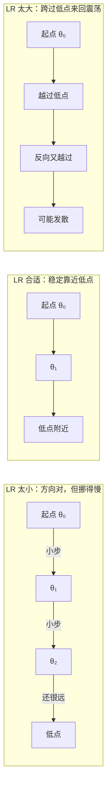
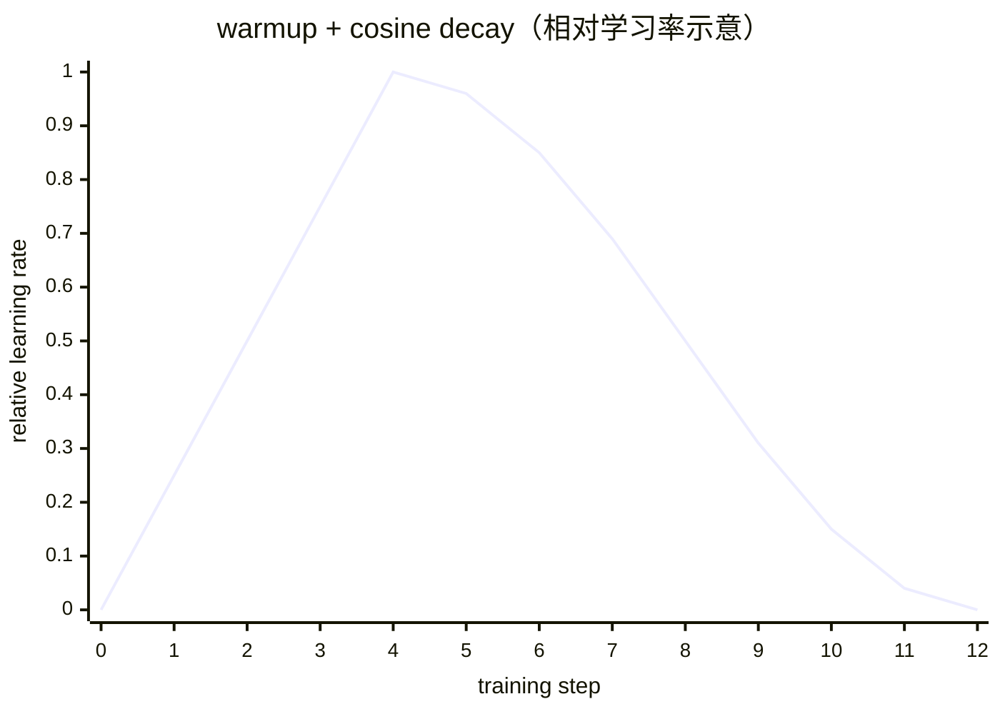
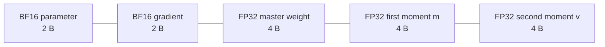

# L06 优化器：从梯度到参数更新

> [!abstract] 本课速览
> 读完你将能够：
> 1. 区分 gradient descent、SGD 与 mini-batch SGD，并解释 batch size 怎样影响梯度噪声；
> 2. 读懂 learning rate、warmup 与 cosine decay 组成的学习率曲线；
> 3. 用“历史方向”和“历史尺度”解释 momentum、Adam 与 AdamW；
> 4. 区分 optimizer states 与 FP32 master weights 的记账口径，复算 7B 模型的显存需求；
> 5. 从 grad norm 和 loss curve 识别梯度爆炸、loss spike 与不收敛的基本症状；
> 6. 说明 batch size 为什么会约束数据并行规模。
>
> 前置：[[L05 反向传播与梯度]] · 预计 50 分钟

## 论文里的这段话，你现在可能读不懂

> [!quote]
> We optimized the model with AdamW over mini-batches. The learning rate was linearly warmed up and then decayed with a cosine schedule, while gradients were clipped by their global norm. Adam's FP32 first- and second-moment states accounted for half of our 16-byte per-parameter training-memory ledger, and overly aggressive peak learning rates produced loss spikes instead of stable convergence.
>
> （改写自典型训练论文与技术报告表述）

这三句把 **optimizer**（优化器）、**mini-batch**（小批量）、**learning rate schedule**（学习率调度）、**warmup**（预热）、**cosine decay**（余弦衰减）、**gradient clipping**（梯度裁剪）和 Adam 的两份状态压在了一起。它不只在交代“用了哪个算法”，也在交代训练是否稳定，以及每张 GPU 为此要多背多少显存。读完本课，我们会逐句拆回去。

## 一、有了 gradient，为什么还需要 optimizer

[[L05 反向传播与梯度]] 已经说明，gradient $\nabla_\theta L$ 给出了 loss 在当前位置上升最快的方向。因此参数大体应向反方向走。但 gradient 只回答“脚下哪边更陡”，没有回答三个工程问题：一步迈多大、要不要相信这一个 batch 的方向、过去几步的信息要不要保留。

负责把 gradient 变成参数更新规则的组件叫 **optimizer**（优化器）。最朴素的规则是 **gradient descent**（梯度下降，GD）：在全部训练数据上求平均 loss 和精确 gradient，再更新一次参数：

$$
\theta_{t+1}=\theta_t-\eta g_t,
\qquad
g_t=\nabla_\theta L(\theta_t).
$$

这里 $t$ 是更新步，$\eta$ 是稍后要讲的 learning rate。问题在于，大模型的数据集可能大到无法先完整扫一遍再迈一步；即使算得动，这种更新频率也低得无法接受。

**stochastic gradient descent**（随机梯度下降，**SGD**）在最严格的定义中，每次随机抽一个 sample 估计 gradient。它更新快，但单个样本带来的方向非常嘈杂。实践中通常取两者之间的折中：每次抽一个 **mini-batch**，对其中样本的 gradient 求平均，再更新一次。论文口语里的 “SGD” 经常实际指 mini-batch SGD，要看作者怎样定义 batch。

| 方法 | 每步看多少数据 | gradient 特点 | 主要问题 |
|---|---|---|---|
| GD | 全部 training set | 最稳定、最接近全数据方向 | 每步太贵，更新太慢 |
| 严格意义的 SGD | 1 个 sample | 噪声最大、更新频繁 | 轨迹抖动，硬件并行度低 |
| mini-batch SGD | 一小批 sample | 在稳定性与成本间折中 | 需要选择 batch size |

**batch size**（批大小）就是一次更新用多少个 sample（语言模型里常按 token 记账）。batch 越大，样本平均会抵消更多偶然噪声，gradient 通常越接近全数据 gradient；但每一步处理的数据更多、需要的 activation 显存也更多。batch 越小，方向更抖，却能更频繁更新；适量噪声还有机会帮助轨迹越过狭窄或尖锐区域。

> [!tip] 直觉
> GD 像召集全班同学投票后才走一步，单样本 SGD 像只问路边一个人，mini-batch SGD 则每次问一小组人。问得越多，方向通常越稳，但收集意见也越贵。

## 二、learning rate 决定每一步敢走多远

**learning rate**（学习率，LR）就是上式中的 $\eta$。若某个参数当前为 $\theta=5$、gradient 为 $g=4$，取 $\eta=0.1$ 时，新参数是 $5-0.1\times4=4.6$。同一个 gradient 配上不同 LR，会产生完全不同的训练轨迹：

- LR 太小：loss 可能下降，但单位时间进展很慢；训练预算结束时还没学好。
- LR 合适：开始下降较快，后期能在低 loss 区域细调。
- LR 太大：一步跨过低谷，在两侧震荡；更严重时参数越走越远，loss 上升乃至出现 NaN。

训练不是从头到尾使用一个固定 LR。**learning rate schedule**（学习率调度）规定 LR 怎样随 training step 变化。大模型训练中常见的组合是先 warmup，再 cosine decay：

1. **warmup**（预热）：最初若干步从很小的 LR 平滑升到峰值。训练刚开始时参数、梯度统计和 optimizer states 都还没有稳定，先小步走能降低突然更新过大的风险；在大模型训练配置中，它几乎已是必备的稳定性措施。
2. **cosine decay**（余弦衰减）：warmup 后沿余弦曲线逐渐减小 LR。前期大步寻找方向，后期小步精修，末尾接近预设的最小 LR。

这张图只表达形状，不规定 warmup 占总步数的固定比例，也不规定末尾必须降到 0；这些都是实验配置。读训练日志时，先找横轴是 optimizer step、sample 还是 token，再看纵轴是当前 LR 还是峰值 LR。否则两条看似不同的曲线可能只是记账单位不同。

当 training loss 持续下降并趋于稳定，我们说优化过程正在 **convergence**（收敛）。收敛不等于泛化：training loss 下降而 validation loss 变差仍可能是 [[L03 机器学习速成|过拟合]]。LR schedule 控制的是优化轨迹，不会自动解决数据质量、模型容量或泛化问题。

## 三、momentum、Adam 与 AdamW：别只看脚下这一箭头

mini-batch gradient 带噪声。若每一步只听当前 batch，轨迹可能在狭长谷底左右摆动。**momentum**（动量）为每个参数维护一份历史更新趋势：同一方向连续出现的 gradient 会累积，正负来回变化的分量会互相抵消。它像一个有惯性的球，下坡方向越滚越稳，横向震荡被平滑。

Adam 在 momentum 的基础上同时保存两类历史统计：

| 状态 | 观察什么 | 直觉作用 |
|---|---|---|
| **first moment**（一阶矩）$m$ | gradient 的指数移动平均，保留正负号 | 估计近期应往哪个方向走 |
| **second moment**（二阶矩）$v$ | gradient 平方的指数移动平均，只看量级 | 估计该参数近期的 gradient 有多大、多不稳定 |

**Adam**（Adaptive Moment Estimation）大致用 $m$ 决定方向，再用 $\sqrt{v}$ 对不同参数的步长做归一化：近期 gradient 一直很大的参数会走得相对谨慎，gradient 较小的参数也不至于完全停住。实际算法还包含偏差修正和防止除零的小常数；本课只要求记住“方向统计 $m$ + 尺度统计 $v$”。

训练还常希望参数不要无限变大。**weight decay**（权重衰减）会在优化时把 weights 轻微拉向 0，可视为一种正则化手段。**AdamW** 把 weight decay 从 Adam 的自适应 gradient 更新中解耦，让“按 loss gradient 学习”和“把参数往 0 拉”成为两项清楚的更新。因此现代大模型训练配置里经常看到 AdamW，而不是原始 Adam。

> [!warning] AdamW 不是“Adam 换了个名字”
> 两者都维护 $m$ 和 $v$；关键差别是 AdamW 对 weight decay 的处理方式。读配置时还要看哪些参数被排除在 decay 之外，不能只看 optimizer 名称。

## 四、系统重点：一个参数在训练中要带多少东西

SGD 可以几乎不保存额外历史，而 momentum 多一份状态。Adam/AdamW 则为每个 parameter 保存 $m$ 和 $v$ 两个 tensor，它们统称 **optimizer states**（优化器状态）。参数有多少个元素，每份状态就有多少个元素；这不是一个几十字节的配置表，而是与模型同规模的数组。

按 [[03 约定与符号]] 的 Adam 混合精度统一口径，一个参数的驻留显存账是：

| 每个参数随身携带的内容 | dtype | B/参数 | 属于 optimizer states？ |
|---|---:|---:|---|
| 计算用 parameter | BF16 | 2 | 否 |
| gradient | BF16 | 2 | 否 |
| master weight | FP32 | 4 | 通常单列；属于“优化器相关”内存 |
| first moment $m$ | FP32 | 4 | 是 |
| second moment $v$ | FP32 | 4 | 是 |
| **合计** |  | **16** |  |

FP32 master weight 是参数的高精度副本。低精度 parameter 用于计算，而 optimizer 在高精度副本上累积细小更新，避免更新量因为精度不足被舍入掉；[[L49 混合精度与FP8训练]] 会展开这个机制。现在先把三个容易混淆的口径分开：

- 严格说 optimizer states 是 $m+v$，合计 **8 B/参数**；
- 若论文把 master weight 也算作 optimizer-related memory，则是 $4+4+4=12$ B/参数；
- 再加 BF16 parameter 与 BF16 gradient，训练驻留账合计 **16 B/参数**，activation 另算。

> [!example] 算一算：7B 模型的 optimizer 为什么塞不进一张 H100
> 取一个恰有 $N=7\times10^9$ 个参数的教学模型。容量按 [[03 约定与符号]] 的 SI 口径计算：FP32 = 4 B，Adam 的 $m$、$v$ 各一份 FP32；H100 SXM 显存为 80 GB。
>
> **1. 两份严格意义的 optimizer states：**
> $$
> M_{m+v}
> =7\times10^9\ \text{parameter}\times(4+4)\ \text{B/parameter}
> =56\times10^9\ \text{B}
> =56\ \text{GB}.
> $$
>
> **2. 一份 FP32 master weights：**
> $$
> M_{master}
> =7\times10^9\times4\ \text{B}
> =28\ \text{GB}.
> $$
>
> **3. optimizer-related memory 小计：**
> $$
> M_{opt-related}=56+28=84\ \text{GB}>80\ \text{GB}.
> $$
>
> ==只放 $m$、$v$ 和 master weights 就已超过一张 80 GB H100，模型的 BF16 parameter、BF16 gradient、activation 和临时 workspace 还一个都没算。== 若把 parameter 和 gradient 也按各 2 B/参数加入，参数相关驻留账是
> $$
> 7\times10^9\times16\ \text{B}=112\ \text{GB},
> $$
> activation 仍另算。这个 84 GB 数字就是后续分片 optimizer states 的直接动机：[[L42 ZeRO与FSDP]] 不只是省一点边角料，而是在解决单卡根本装不下的同规模状态数组。

> [!warning] “optimizer states 是模型权重的几倍”必须带口径
> $m+v$ 相对一份 FP32 weight 是 2 倍，相对一份 BF16 weight 是 4 倍；若再计入 FP32 master weight，optimizer-related memory 相对 BF16 weight 是 6 倍。只说“3 倍”而不交代 dtype 和是否包含 master weight，无法复算。

## 五、gradient clipping 与 loss curve：先学会看病历

训练日志常记录 **grad norm**（梯度范数）。把所有参数的 gradient 视为一个长向量 $g$，常用的全局 L2 norm 是

$$
\lVert g\rVert_2=\sqrt{\sum_i g_i^2}.
$$

若这个值突然极大，一次更新就可能把参数推离稳定区域。**gradient clipping**（梯度裁剪）会在 norm 超过阈值 $c$ 时，把整条 gradient 按同一比例缩小：

$$
g_{clipped}=g\times\min\left(1,\frac{c}{\lVert g\rVert_2}\right).
$$

方向不变，长度被限制在 $c$ 以内。这像给每一步装上“最大步幅保险”。它能缓解 gradient 爆炸造成的破坏，但不会修复错误数据、错误 loss、数值溢出或过大的长期 LR；频繁触发 clipping 本身就是需要排查的信号。

**loss curve**（损失曲线）把 loss 随 step、sample 或 token 的变化画出来，是训练最基本的病历：

| 曲线症状 | 可能含义 | 第一批检查项 |
|---|---|---|
| 平稳下降后逐渐变缓 | 常见的 convergence 过程 | 同时检查 validation loss |
| 持续震荡、不再下降 | LR 偏大或 batch 噪声过强 | 当前 LR、batch size、grad norm |
| 持续上升直至 NaN/Inf | 训练发散或数值不稳定 | 峰值 LR、数据、精度、最早异常 tensor |
| 单点或短区间突然上冲 | **loss spike**（损失尖峰） | 对应数据 batch、grad norm、系统与数值异常 |

loss spike 可能短暂恢复，也可能污染 optimizer states 后继续恶化。工程上会结合训练进度、数据位置和 checkpoint 决定跳过异常数据、降低 LR 或回滚；[[L14 预训练]] 会讲训练日程中的 loss，[[L49 混合精度与FP8训练]] 与 [[L53 大规模训练可靠性]] 会继续处理数值异常和恢复问题。

> [!warning] 常见误区
> - **“LR 越大，训练越快。”** LR 只在稳定范围内加快前进；超出范围会震荡或发散。warmup 的存在正说明训练初期不能贸然大步走。
> - **“clipping 后 grad norm 就没有诊断价值。”** 恰恰相反，应区分 clipping 前后的 norm，并记录触发频率。
> - **“training loss 收敛就代表模型训练成功。”** 还要看 validation 指标、任务目标与是否过拟合。

## 六、大 batch 是并行机会，也是约束

mini-batch 中不同 sample 的 forward/backward 可以并行，这是 GPU 高吞吐和数据并行的入口。增加 data-parallel rank 时，每个 rank 处理一部分样本，随后同步 gradient；各 rank 的有效样本数合起来形成 global batch。[[L07 训练循环解剖]] 会严格区分 micro-batch、gradient accumulation 与 global batch size。

这里先抓住一个系统结论：==在纯数据并行维度上，global batch size 会限制可用并行度。== 若每个 rank 每步至少处理 1 个样本，那么 global batch 为 256 时，不能无限增加 data-parallel rank；超过 256 后，有些 rank 将没有样本可算。模型并行可以让同一个样本占用多张 GPU，所以“总 GPU 数不超过 batch size”并不成立，受限的是数据并行这一维。

更大的 global batch 可以喂饱更多 data-parallel workers、降低 gradient 方差，却也改变了优化行为：相同训练数据量下，batch 越大，optimizer step 越少。不能只为了扩更多 GPU 就不断增大 batch，还要相应调整 LR 和 schedule，并确认最终质量不受损。[[L41 数据并行与DDP]] 会讨论 linear scaling rule，[[L47 混合并行组装]] 会把 batch 约束与 DP/TP/PP 等并行维度一起计算。

这正是优化算法和系统设计的接口：optimizer 决定每步需要哪些状态、何时更新；batch 决定能暴露多少样本级并行；网络则决定多个 rank 能否及时把 gradient 汇总。训练论文里的 LR、batch 和 optimizer 配置，不是与系统无关的“模型超参数附录”。

## 回到开头那段话

现在逐句拆回开场：

1. **“We optimized the model with AdamW over mini-batches.”**：训练没有用全部数据才更新一次，而是每个 mini-batch 估计一次 gradient；optimizer 采用 AdamW，为每个参数保留 $m$、$v$，并把 weight decay 与自适应 gradient 更新解耦。对应第一、三节。
2. **“The learning rate was linearly warmed up and then decayed with a cosine schedule, while gradients were clipped by their global norm.”**：LR 先从小值线性升到峰值，降低初期不稳定；随后按 cosine decay 逐渐缩小，后期细调。若全局 grad norm 超过阈值，就等比例缩短整条 gradient，避免单步过大。对应第二、五节。
3. **“Adam's FP32 first- and second-moment states accounted for half of our 16-byte per-parameter training-memory ledger, and overly aggressive peak learning rates produced loss spikes instead of stable convergence.”**：Adam 的 $m$ 与 $v$ 是两份与 parameter 等元素数的 FP32 optimizer states，共 8 B/参数，恰好占 16 B/参数训练驻留账的一半；7B 模型仅它们就占 56 GB。峰值 LR 过大时，loss curve 可能突然上冲甚至发散，而不是稳定收敛。对应第四、五节。

原文可以压缩成一条因果链：==mini-batch 提供带噪声的 gradient → AdamW 用历史矩估计更新方向与尺度 → LR schedule 控制不同阶段的步幅 → clipping 限制异常单步 → 这些稳定性机制同时引入与模型同规模的状态显存。==

## 术语卡片

| 术语 | 中文 | 一句话解释 |
|---|---|---|
| optimizer | 优化器 | 把 gradient、学习率和历史状态组合成参数更新的组件。 |
| gradient descent | 梯度下降 | 使用全部训练数据的 gradient，沿负梯度方向更新参数的方法。 |
| SGD | 随机梯度下降 | 用随机样本估计 gradient 并更新参数；实践中常泛指 mini-batch SGD。 |
| mini-batch | 小批量 | 一次参数更新中共同用于估计 gradient 的一小批样本。 |
| batch size | 批大小 | 一个 batch 包含的样本数或 token 数，必须说明局部或全局口径。 |
| learning rate | 学习率 | 把 gradient 转成参数更新幅度的步长系数。 |
| learning rate schedule | 学习率调度 | 规定 learning rate 怎样随训练进度变化的策略。 |
| warmup | 预热 | 训练初期把 learning rate 从小值逐步升到峰值的阶段。 |
| cosine decay | 余弦衰减 | warmup 后按余弦形状逐渐降低 learning rate 的调度。 |
| momentum | 动量 | 累积历史更新趋势，以加速一致方向并平滑来回震荡。 |
| Adam | 自适应矩估计优化器 | 用 gradient 的一阶矩估计方向、二阶矩估计尺度并自适应更新参数。 |
| AdamW | 解耦权重衰减的 Adam | 把 weight decay 与 Adam 的自适应 gradient 更新分开处理。 |
| weight decay | 权重衰减 | 更新时把 weights 轻微拉向 0 的正则化机制。 |
| optimizer states | 优化器状态 | optimizer 跨 step 保存的同规模历史 tensor；Adam 中主要是 $m$ 和 $v$。 |
| first moment | 一阶矩 | Adam 中 gradient 的指数移动平均 $m$，用于估计近期方向。 |
| second moment | 二阶矩 | Adam 中 gradient 平方的指数移动平均 $v$，用于估计近期尺度。 |
| gradient clipping | 梯度裁剪 | gradient 过大时按阈值限制其 norm，降低异常单步的破坏。 |
| grad norm | 梯度范数 | 把全部或一组 gradient 汇总成长度的统计量，常用于监控和 clipping。 |
| convergence | 收敛 | 优化过程逐步进入 loss 变化较小、参数更新趋稳的状态。 |
| loss curve | 损失曲线 | loss 随 step、sample 或 token 变化的训练轨迹。 |
| loss spike | 损失尖峰 | loss curve 中突然显著上冲的异常点或短区间。 |

## 自测

1. gradient 已经给出下降方向，为什么训练还需要 optimizer？
2. GD、严格意义的 SGD 与 mini-batch SGD 每步分别使用多少数据？batch size 增大通常怎样影响 gradient 噪声？
3. warmup 与 cosine decay 各解决训练哪个阶段的步长问题？
4. momentum、Adam 的 first moment 与 second moment 分别保存什么信息？AdamW 相比 Adam 的关键变化是什么？
5. 对恰有 7B 参数的模型，按本课口径复算 $m+v$、master weights 和 optimizer-related memory 各是多少；为何一张 80 GB H100 放不下？
6. gradient clipping 如何改变一条 norm 超过阈值的 gradient？它为什么不能治愈所有 loss spike？
7. 为什么 global batch size 约束纯数据并行规模，却不一定约束包含模型并行时的总 GPU 数？

> [!note]- 参考答案
> 1. gradient 只描述当前位置的局部方向和尺度；optimizer 还要选择步长、处理 mini-batch 噪声，并决定是否利用历史 gradient 与如何施加 weight decay。
> 2. GD 每步使用全部 training set；严格 SGD 使用 1 个随机 sample；mini-batch SGD 使用一小批 sample。batch 增大后，样本平均通常会减小 gradient 方差、让方向更稳定，但每步计算和 activation 显存增加。
> 3. warmup 在训练初期从小 LR 升到峰值，避免参数与 optimizer states 尚未稳定时猛冲；cosine decay 在中后期逐渐减小 LR，让更新从探索转向细调。
> 4. momentum 保存历史更新趋势；Adam 的 first moment $m$ 是带符号 gradient 的移动平均，second moment $v$ 是 gradient 平方的移动平均。AdamW 把 weight decay 与 Adam 的自适应 gradient 更新解耦。
> 5. $m+v=7\times10^9\times8\ \text{B}=56$ GB；master weights $=7\times10^9\times4\ \text{B}=28$ GB；合计 84 GB。84 GB 已大于 H100 SXM 的 80 GB，且还没计 BF16 parameter、gradient、activation 与 workspace。
> 6. 若 $\lVert g\rVert>c$，将整条 gradient 乘以 $c/\lVert g\rVert$，方向不变、norm 缩到 $c$。数据错误、长期 LR 过大、数值溢出或已污染的 optimizer states 并不会因一次 clipping 自动修复。
> 7. 纯数据并行中每个 rank 至少需要分到样本，因而 global batch 限制有实际工作的 data-parallel ranks。模型并行能让多张 GPU 协作处理同一个样本，所以总 GPU 数可以大于 batch size。

## 延伸阅读

- [《动手学深度学习》第 12 章：优化算法](https://zh.d2l.ai/chapter_optimization/index.html)：系统梳理 SGD、momentum、Adam 与学习率调度；重点看算法直觉和状态变量，不必在第一遍追完收敛证明。
- [《Adam: A Method for Stochastic Optimization》](https://arxiv.org/abs/1412.6980)（ICLR 2015）：只读第 2 节算法框，确认 $m$、$v$、偏差修正和每步更新分别出现在哪里。

---
上一课：[[L05 反向传播与梯度]] ← · → 下一课：[[L07 训练循环解剖]]
