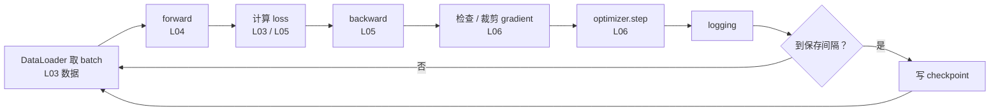
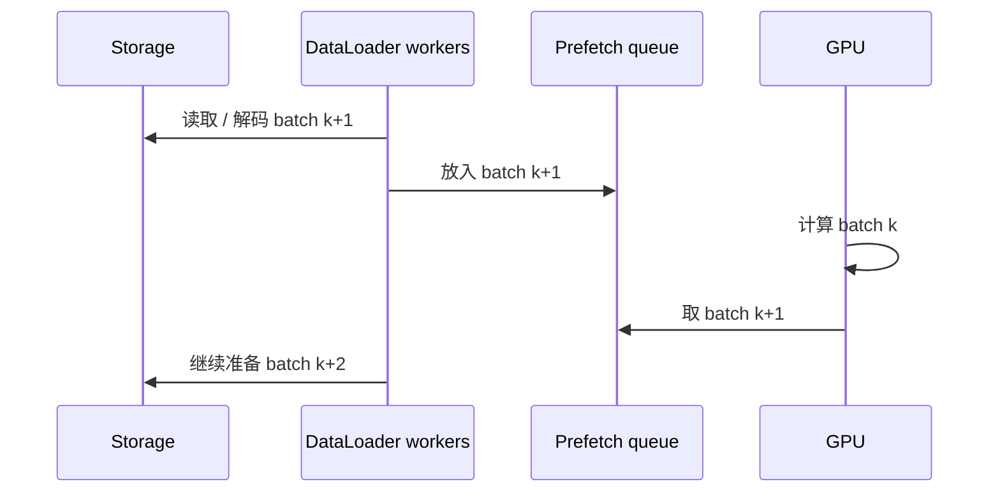
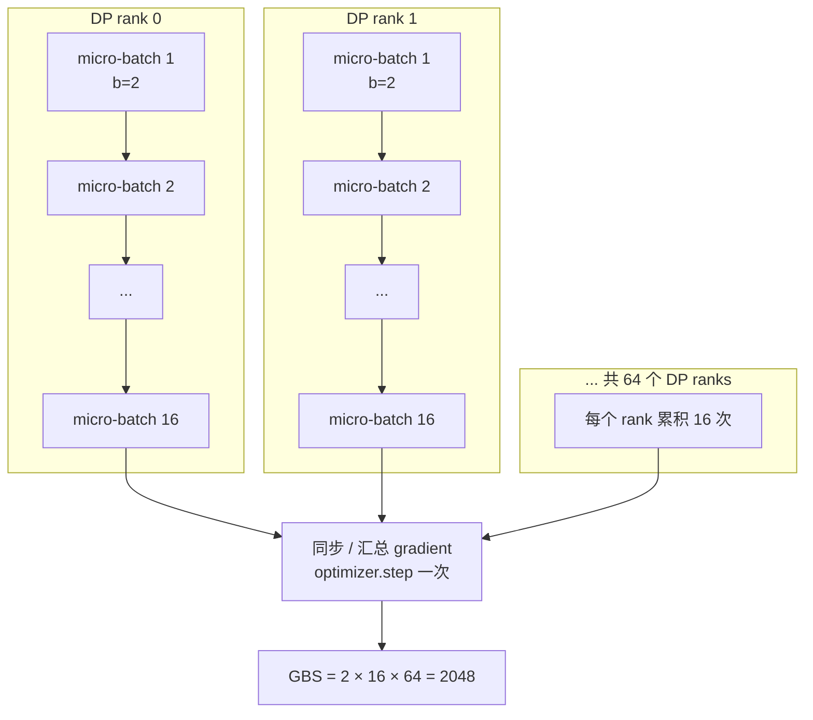

# L07 训练循环解剖：从 DataLoader 到 checkpoint

> [!abstract] 本课速览
> 读完你将能够：
> 1. 逐行解释标准 PyTorch training loop 中取数据、forward、backward 和参数更新的职责；
> 2. 区分 step、iteration、epoch 与 token 四种训练进度口径，并在它们之间换算；
> 3. 用 micro-batch、gradient accumulation 和数据并行度复算 global batch size；
> 4. 说明 DataLoader 的 shuffle、worker 与 prefetch 为什么会影响 GPU 利用率；
> 5. 判断一个可 resume 的 checkpoint 应保存哪些训练状态；
> 6. 读懂训练日志中的 loss、learning rate 与 grad norm。
>
> 前置：[[L06 优化器]] · 预计 50 分钟

## 论文里的这段话，你现在可能读不懂

> [!quote]
> Training used a per-device micro-batch size of 2 with 16 gradient-accumulation iterations and 64 data-parallel workers, yielding a global batch size of 2,048 sequences. The DataLoader shuffled samples and prefetched batches with multiple workers. We logged the loss, learning rate, and gradient norm at every optimizer step, and periodically saved model and optimizer state_dicts so that training could resume from a checkpoint.
>
> （改写自典型训练论文与技术报告表述）

这段话看起来只是在罗列配置，实际同时描述了三条流水线：数据怎样送到设备、多少次 forward/backward 才触发一次参数更新、故障后怎样从持久化状态继续。尤其是 “iteration” 和 “batch size”，不同作者可能指 micro-batch，也可能指 optimizer step 或 global batch；不先找定义，后面的吞吐和训练时长都会算错。

## 一、training loop 是把四件事按顺序接起来

[[L03 机器学习速成]] 到 [[L06 优化器]] 分别讲了数据、模型与 loss、forward/backward、optimizer。**training loop**（训练循环）做的事，就是反复把它们按正确的因果顺序接起来：先取数据，再得到预测和 loss，再求 gradient，最后更新 parameter。

下面是一段刻意保持短小的标准 PyTorch 训练循环。它假设 `model`、`train_loader`、`criterion`、`optimizer` 和 `device` 已经创建好；每个编号都是随后要拆的一步。

```python
model.train()                                      # 01 进入训练模式
for epoch in range(num_epochs):                    # 02 数据集轮次
    for batch_idx, (inputs, labels) in enumerate(train_loader):  # 03 取 batch
        inputs = inputs.to(device)                  # 04 输入搬到计算设备
        labels = labels.to(device)                  # 05 标签搬到计算设备

        optimizer.zero_grad(set_to_none=True)       # 06 清除旧 gradient
        logits = model(inputs)                      # 07 forward pass（L04）
        loss = criterion(logits, labels)            # 08 loss（L03/L05）
        loss.backward()                             # 09 backward pass（L05）
        grad_norm = torch.nn.utils.clip_grad_norm_( # 10 clipping（L06）
            model.parameters(), max_norm=1.0        # 11 返回裁剪前 norm
        )
        optimizer.step()                            # 12 更新参数（L06）

        global_step += 1                            # 13 记一次参数更新
        current_lr = optimizer.param_groups[0]["lr"]  # 14 读取当前 LR
        metrics = {                                 # 15 组装日志
            "loss": loss.item(),                   # 16 当前 batch loss
            "lr": current_lr,                      # 17 当前 learning rate
            "grad_norm": grad_norm.item(),         # 18 gradient norm
        }
        logger.log(metrics, step=global_step)        # 19 写出日志
        scheduler.step()                            # 20 推进一次 step-based schedule
```

这 20 行可分成五组：

| 行 | 发生了什么 | 为什么顺序不能乱 |
|---|---|---|
| 01–05 | 设置训练模式，从 DataLoader 取一批数据并搬到设备 | 数据不在同一设备时，模型无法计算；训练模式还会影响 dropout 等层的行为 |
| 06 | 清除上一次更新留下的 gradient | PyTorch 默认把新 gradient **累加**到 `.grad`，不清会把不同 step 混在一起 |
| 07–08 | 执行 forward，得到 logits 和标量 loss | backward 必须从一个可求导的标量目标出发 |
| 09–12 | backward 产生 gradient，必要时 clipping，再由 optimizer 更新参数 | `backward()` 只算 gradient；真正改 parameter 的是 `optimizer.step()` |
| 13–20 | 记录进度和训练健康指标，推进 schedule | 没有日志，训练即使在慢、发散或卡住，也很难定位 |

代码里的 `max_norm=1.0` 只是为了展示 clipping API 的教学配置，不是全课程规定的通用阈值。`scheduler.step()` 究竟按 epoch 还是按 optimizer step 调用，取决于 scheduler 的定义。大模型常按 step 或 token 推进，示例采用的就是 step-based schedule；照抄到具体项目之前必须先看配置。另一个常见写法是把 `zero_grad()` 放到 `optimizer.step()` 之后；只要它发生在下一轮 backward 之前，语义相同。



> [!warning] `backward()` 不会更新参数
> `loss.backward()` 把 gradient 写入每个 parameter 的 `.grad`；`optimizer.step()` 才读取这些 gradient 和 optimizer states 来更新 parameter；`zero_grad()` 则清理 `.grad`。把三者混成一句“反向传播更新参数”，读系统代码时很容易漏掉真正的同步、累积和更新边界。

## 二、DataLoader：GPU 开饭之前，厨房不能断菜

PyTorch 的 **DataLoader**（数据加载器）把 dataset 组织成一个个 batch，并协调采样、读取、解码、变换和组批。它不是“训练外面的杂务”：若准备下一批数据用时 80 ms，而 GPU 计算一批只需 40 ms，那么 GPU 每算 40 ms 就要等 40 ms，理论上最多只有一半时间在工作。

**shuffle**（随机打乱）让每个 epoch 的样本顺序重新排列。mini-batch gradient 是用一小批样本估计全数据 gradient；若磁盘上的数据恰好按类别、长度或来源排好，而训练又不 shuffle，连续多个 batch 就会严重偏向某一类数据。shuffle 不是“让数据更随机看起来更科学”，而是在降低读取顺序对优化轨迹的系统性偏置。

`num_workers` 允许多个 CPU worker 并行准备 batch。**prefetch**（预取）则让 worker 在 GPU 计算当前 batch 时，提前准备后续 batch：像餐馆前台把下一桌菜先摆到传菜口，而不是等客人吃完才开始洗菜。worker 太少会供不上，太多又可能争抢 CPU、内存和存储带宽；最佳值依赖数据格式、变换成本、机器配置和共享文件系统负载，不存在一个全局正确的数字。



当训练日志里 GPU 利用率周期性掉到低点，而计算 kernel 本身没有变慢，优先检查取下一个 batch 的等待时间。这类 **DataLoader stall** 会在 [[L52 性能剖析与MFU核算]] 里用 profiler 正式定位；到那时要区分“GPU 算得慢”和“GPU 根本没拿到活”。

## 三、step、iteration、epoch 和 token：先问计数器在数什么

**epoch**（轮次）原则上表示训练集被完整使用一遍。若 dataset 有 $M$ 个 sample，单卡每次更新处理 $B$ 个 sample，且忽略末尾不足一批的情况，那么每个 epoch 约有 $M/B$ 次更新。

**step**（步）在训练配置中通常指一次参数更新，也就是一次 `optimizer.step()`；**iteration**（迭代）却没有统一含义：有些代码把一次取 batch、forward/backward 和更新叫 iteration，有些采用 gradient accumulation 后仍把每个 micro-batch 叫 iteration。因此看到 “100k iterations” 时，必须查看它到底数的是 dataloader iteration、forward/backward 次数，还是 optimizer step。

LLM 预训练更常用已处理 **token** 数表示进度。原因很直接：数据规模大、样本是一段段不同来源的序列，所谓“一整个 dataset”可能持续去重、混合和更新；epoch 不再是稳定、好比较的单位。若训练 token 总量为 $D$，每条序列长度为 $S$，每个 optimizer step 的 **global batch size**（全局批大小，GBS）为 $B$ 条序列，则

$$
\text{tokens per step}=B\times S,
\qquad
\text{total optimizer steps}=\frac{D}{B\times S}.
$$

若 GBS 已按 token 给出，就不应再乘 $S$。论文写 “batch size = 4M tokens” 和 “batch size = 2,048 sequences at length 8,192” 是两种不同口径，必须先统一单位。

> [!example] 算一算：从 15.6T token 反推训练日程
> 采用 [[03 约定与符号]] 中 Llama-3-405B 的训练数据口径 $D\approx15.6\times10^{12}$ token，并取题设 $S=8192$ token/序列、$B=2048$ 序列/step。
>
> 每个 optimizer step 消耗：
> $$
> B\times S
> =2048\times8192
> =16{,}777{,}216
> \approx1.68\times10^7\ \text{token/step}.
> $$
>
> 总 optimizer step 数：
> $$
> \frac{15.6\times10^{12}}{16{,}777{,}216}
> \approx929{,}832
> \approx9.3\times10^5\ \text{step}.
> $$
>
> 若把 15.6T 粗写成 15T，会得到约 $8.9\times10^5$ step；两者都是“约 90 万步”的数量级，但复算论文训练日程时应使用作者报告的精确口径。这里的 step 是 optimizer step，不是下面要讲的 micro-batch 次数。

## 四、gradient accumulation：小盘子多端几趟，再一起结账

单张 GPU 一次 forward/backward 能容纳的那批样本叫 **micro-batch**（微批次）。它受 activation 显存直接约束。想获得更大的 GBS，却无法把更多样本同时塞进显存时，可以使用 **gradient accumulation**（梯度累积）：连续处理多个 micro-batch，每次都执行 backward，把 gradient 加到 `.grad` 中；积累到规定次数后才执行一次 `optimizer.step()`，然后清空 gradient。

设每个 data-parallel rank 的 micro-batch size 为 $b$，累积次数为 $\mathrm{GA}$，数据并行度为 $\mathrm{DP}$。按 [[03 约定与符号]] 的统一记号：

$$
B=b\times\mathrm{GA}\times\mathrm{DP}.
$$

开场配置中 $b=2$、$\mathrm{GA}=16$、$\mathrm{DP}=64$，因此

$$
B=2\times16\times64=2048\ \text{sequences}.
$$

在单卡教学场景 $\mathrm{DP}=1$ 时，就是 $B=b\times\mathrm{GA}$。下图每个小方块代表一个 rank 上的一份 micro-batch；同一列的 16 份依次经过 forward/backward 后，所有 64 个 rank 合起来只产生一次全局参数更新。



代码上的关键变化有两个：不要在每个 micro-batch 前 `zero_grad()`，并把 loss 按累积组大小缩放，避免累加后 gradient 平白放大。下面写法也正确处理 epoch 末尾不足一个完整累积组的情况：

```python
optimizer.zero_grad(set_to_none=True)
num_micro_batches = len(train_loader)

for micro_step, (inputs, labels) in enumerate(train_loader):
    group_start = (micro_step // grad_accum) * grad_accum
    group_size = min(grad_accum, num_micro_batches - group_start)

    logits = model(inputs.to(device))
    loss = criterion(logits, labels.to(device)) / group_size
    loss.backward()

    end_of_group = (micro_step + 1) % grad_accum == 0
    end_of_epoch = micro_step + 1 == num_micro_batches
    if end_of_group or end_of_epoch:
        optimizer.step()
        optimizer.zero_grad(set_to_none=True)
        global_step += 1
```

gradient accumulation 主要节省 activation 峰值显存，并不会让总计算凭空消失：同样的 GBS 仍要处理同样多样本，而且串行执行更多 micro-batch 会拉长一次 optimizer step 的墙钟时间。进入分布式训练后，还要避免每个 micro-batch 都做不必要的 gradient 同步；[[L41 数据并行与DDP]] 和 [[L47 混合并行组装]] 会补齐通信与完整 batch 约束。

> [!warning] “batch size = 2048”信息不完整
> 它可能是每卡 micro-batch、每卡累积后的 local batch、全局序列数，甚至全局 token 数。系统论文若不同时报告 $b$、GA、DP 和 $S$，你就无法可靠复算显存压力、通信频率和 tokens/step。

## 五、checkpoint：能加载，不等于能原样续训

PyTorch 的 **state_dict**（状态字典）是把模块状态映射到名称的字典。`model.state_dict()` 主要包含 parameter 和持久化 buffer；`optimizer.state_dict()` 则包含 Adam 的一阶矩、二阶矩等 per-parameter 状态，以及 learning rate、weight decay 等参数组配置。

**checkpoint**（检查点）是持久化到存储、用于恢复或分析的训练状态快照。一个真正支持 **resume**（续训）的 checkpoint 通常不只保存 model weights，还应包括：

| 状态 | 不保存会怎样 |
|---|---|
| model state_dict | 没有已学到的 parameter，无法恢复模型 |
| optimizer state_dict | Adam 的 $m$、$v$ 丢失，更新轨迹发生突变 |
| LR scheduler 状态 | 恢复后可能从错误的 learning rate 继续 |
| global step / 已处理 token | 日志、保存周期和训练终点全部错位 |
| 混合精度 scaler（若使用） | 数值稳定性状态无法连续 |
| random number generator 状态 | dropout、shuffle 等随机序列无法延续 |
| 数据位置或 sampler 状态 | 可能重复或跳过训练数据 |

只保存 model state_dict 足以做 inference 或 fine-tuning，却不等于“从中断点原样继续”。checkpoint 是容器，state_dict 是常见的容器内容；二者不是同义词。

按 [[03 约定与符号]] 的统一 checkpoint 口径，Adam 混合精度训练约为 **14 B/参数**：BF16 parameter 2 B + FP32 master parameter 4 B + FP32 一阶矩 4 B + FP32 二阶矩 4 B，不保存 gradient。一个恰有 7B 参数的教学模型，其单份 checkpoint 约为

$$
7\times10^9\ \text{parameter}\times14\ \text{B/parameter}
=98\times10^9\ \text{B}
=98\ \text{GB}.
$$

其中 BF16 parameter 约 14 GB，master parameter 加两份 optimizer states 约 84 GB。若只存推理权重，文件会小得多；若实现额外保存 RNG、scheduler、metadata 或多份权重，实际体积会略增。保存频率、并行写入、远端存储带宽和故障后回滚距离，随后会在 [[L34 存储与数据供给]] 与 [[L53 大规模训练可靠性]] 变成核心系统问题。

## 六、logging 与可复现：给训练留一份可诊断记录

**logging**（日志记录）不是每隔几步打印一句 “still alive”。最小健康三件套是：

| 指标 | 回答的问题 |
|---|---|
| loss | 模型是否在学习，是否出现 loss spike 或发散？ |
| learning rate | 当前更新步幅是否与 schedule 对齐？ |
| grad norm | backward 得到的 gradient 是否异常，clipping 是否频繁触发？ |

工程上还会记录 tokens/s、数据等待时间、GPU 利用率、显存、checkpoint 耗时和通信耗时。**TensorBoard**（训练日志可视化工具）常用于本地查看曲线；**wandb**（Weights & Biases 实验跟踪工具）常用于集中记录曲线、配置和实验对比。工具可以替换，关键是每个指标带上明确的横轴：optimizer step、micro-step、sample 还是 token。

**random seed**（随机种子）为伪随机数生成器指定起点。固定 Python、NumPy、PyTorch 和各设备的 seed，可以让初始化、shuffle、dropout 等随机过程更可控；在使用 cuDNN 的路径上设置 `torch.backends.cudnn.deterministic = True`，或采用框架提供的确定性算法模式，还可能进一步减少运行差异。但“相同 seed”不自动保证跨硬件、跨框架版本、跨并行规模逐 bit 一致：某些 GPU 算子本身非确定，并行规约顺序改变也会带来浮点舍入差异；确定性实现还可能牺牲性能。

> [!tip] 直觉
> random seed 像规定洗牌机从哪个内部状态开始，不代表换一台结构不同的洗牌机后，牌序仍然逐张相同。可复现还需要代码、依赖、数据顺序、硬件与并行配置共同受控。

## 回到开头那段话

现在逐句拆回开场：

1. **“Training used a per-device micro-batch size of 2 with 16 gradient-accumulation iterations and 64 data-parallel workers, yielding a global batch size of 2,048 sequences.”** 每个 rank 一次只能放 2 条序列，于是连续做 16 次 forward/backward 才更新；64 个 rank 的有效样本合并后，$B=2\times16\times64=2048$ 条序列。这里的 accumulation iteration 是 micro-step，不是 optimizer step。对应第四节。
2. **“The DataLoader shuffled samples and prefetched batches with multiple workers.”** DataLoader 每轮打乱数据，并让多个 CPU worker 提前准备后续 batch，尽量让 GPU 不因等数据而空转。对应第二节。
3. **“We logged the loss, learning rate, and gradient norm at every optimizer step, and periodically saved model and optimizer state_dicts so that training could resume from a checkpoint.”** 日志的横轴是参数更新次数；三项指标分别监控学习进展、步幅和 gradient 健康。checkpoint 同时保存模型与 optimizer 的状态，才能尽量连续地 resume，而不只是加载一份可推理权重。对应第五、六节。

整段话因此可以还原成一条完整时间线：==多个 worker 预取并打乱数据 → 每卡逐个执行 micro-batch 的 forward/backward → 累积 16 次后跨 64 个 data-parallel workers 形成 GBS → optimizer 更新一次并记录 step 日志 → 定期保存足以续训的 checkpoint。==

## 术语卡片

| 术语 | 中文 | 一句话解释 |
|---|---|---|
| training loop | 训练循环 | 反复执行取数据、forward、计算 loss、backward、参数更新与记录的控制流程。 |
| DataLoader | 数据加载器 | 把 dataset 的采样、读取、变换和组批组织成可迭代 batch 的组件。 |
| shuffle | 随机打乱 | 在训练轮次中改变样本读取顺序，减少有序数据对 mini-batch gradient 的偏置。 |
| prefetch | 预取 | 在当前 batch 计算期间提前准备后续 batch，以隐藏数据准备时延。 |
| step | 步 | 本课默认指一次 optimizer 参数更新；阅读论文时必须核对作者定义。 |
| iteration | 迭代 | 一次循环迭代的泛称，可能指 micro-step 或 optimizer step，语义依实现而定。 |
| epoch | 轮次 | 模型原则上完整使用一次 training set 的过程。 |
| global batch size | 全局批大小 | 一次参数更新在全部 data-parallel ranks 上共同贡献 gradient 的样本或 token 总量。 |
| micro-batch | 微批次 | 单个 rank 一次 forward/backward 实际处理、受显存约束的一小批数据。 |
| gradient accumulation | 梯度累积 | 连续处理多个 micro-batch 并累加 gradient，达到规定次数后才更新一次参数。 |
| state_dict | 状态字典 | PyTorch 中以名称到 tensor 或配置的映射表示模块可保存状态的字典。 |
| checkpoint | 检查点 | 为故障恢复、续训或分析而持久化的训练状态快照。 |
| resume | 续训 | 从 checkpoint 恢复模型、优化器和进度等状态后继续训练。 |
| random seed | 随机种子 | 指定伪随机数生成器的起始状态，以提高实验可复现性。 |
| logging | 日志记录 | 按明确进度轴保存训练指标、配置和系统状态，供监控与诊断。 |
| wandb | Weights & Biases 实验跟踪工具 | 集中记录训练指标、配置和实验对比的常用平台。 |
| TensorBoard | TensorBoard 可视化工具 | 展示标量曲线、直方图等训练日志的常用工具。 |

## 自测

1. `loss.backward()`、`optimizer.step()` 和 `optimizer.zero_grad()` 分别做什么？为什么顺序重要？
2. DataLoader 已经能读数据，为什么还需要多个 worker 和 prefetch？
3. 某训练使用 $b=4$、$\mathrm{GA}=8$、$\mathrm{DP}=32$，global batch size 是多少条序列？若 $S=4096$，每个 optimizer step 处理多少 token？
4. 一个 epoch 含 12,000 个 micro-batch，GA=12。忽略数据并行细节，每个 epoch 有多少个 optimizer step？论文说“12,000 iterations”时为什么仍不能直接断定训练更新了 12,000 次？
5. 为什么 gradient accumulation 能降低 activation 峰值显存，却通常不能减少完成同一 global batch 所需的总计算？
6. 按本课口径，一个 7B 参数 Adam 混合精度 checkpoint 约多大？它与 16 B/参数的训练驻留显存口径差在哪里？
7. 只保存 `model.state_dict()` 后可以加载模型，为什么这仍不算完整 resume？

> [!note]- 参考答案
> 1. `backward()` 计算并累加 gradient；`step()` 使用 gradient 和 optimizer states 更新 parameter；`zero_grad()` 清除旧 gradient。下一轮 backward 前若未清除，就会无意累加；做 gradient accumulation 时则正是刻意延后清除。
> 2. 读取、解码和变换可能比 GPU 计算更慢。多个 worker 并行准备数据，prefetch 把准备工作与 GPU 计算重叠，减少设备等待；worker 数仍受 CPU、内存和存储带宽约束。
> 3. $B=4\times8\times32=1024$ 条序列；每 step 处理 $1024\times4096=4{,}194{,}304\approx4.19\times10^6$ token。
> 4. optimizer step 数为 $12{,}000/12=1000$。iteration 可能指每个 micro-batch，也可能指一次参数更新，必须查看代码或定义。
> 5. 它把一个大 batch 拆成多个较小 micro-batch 顺序执行，因此同时驻留的 activation 变少；但所有样本仍要完成 forward/backward，计算量没有消失，串行次数还会增加墙钟时延。
> 6. $7\times10^9\times14$ B = 98 GB。checkpoint 的 14 B/参数不保存 2 B/参数的 gradient；训练驻留账为 16 B/参数，activation 另算。
> 7. optimizer 的 $m$、$v$、LR scheduler、global step、随机状态和数据位置等都可能丢失；可以从该权重开始一段新训练，但无法连续恢复原训练轨迹。

## 延伸阅读

- [PyTorch 官方教程《Training a Classifier》](https://pytorch.org/tutorials/beginner/blitz/cifar10_tutorial.html)：对照 “Train the network” 部分，把 `zero_grad → forward → loss → backward → step` 五步逐行认出来。
- [《动手学深度学习》“深度学习计算”章节](https://zh.d2l.ai/chapter_deep-learning-computation/index.html)：补齐参数管理、延后初始化与读写文件；第一遍重点看参数和文件 I/O。

---
上一课：[[L06 优化器]] ← · → 下一课：[[L08 CNN与RNN简史]]
