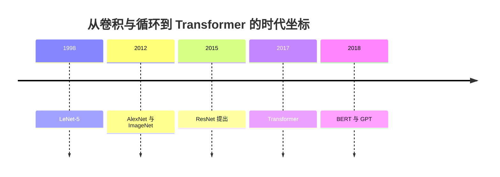
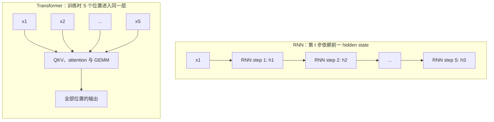

# L08 CNN与RNN简史：Transformer 为什么接班

> [!abstract] 本课速览
> 读完你将能够：
> 1. 解释 CNN 用卷积、参数共享和 pooling 利用了图像的哪些结构；
> 2. 读懂 ResNet 的 residual connection，以及它为何仍会出现在系统论文的基准中；
> 3. 用 hidden state 和关键路径说明 RNN/LSTM 的序列串行瓶颈；
> 4. 说清 seq2seq、encoder-decoder 与 attention 如何通向 Transformer；
> 5. 在看到 ResNet-50、BERT 或 GPT-2 的实验配置时，快速判断它们的时代与系统含义。
>
> 前置：[[L04 神经网络与前向传播]] · 预计 40 分钟

## 论文里的这段话，你现在可能读不懂

> [!quote]
> We evaluate the system with a **ResNet** model that uses a **residual connection**, an **LSTM** whose **hidden state** creates a **sequential dependency**, and **BERT**, pretrained with a **masked language model** objective. The recurrent workload exposes much less sequence parallelism than the Transformer workload.
>
> （改写自典型系统论文的 benchmark 与模型描述）

这两句没有报告任何网络协议，却已经暗示了系统行为：ResNet 是规整的视觉卷积工作负载；LSTM 的时间步必须一个接一个完成；BERT 则属于 Transformer 时代、训练时能把一整段序列同时送进大矩阵乘。本课不是要你背模型发展史，而是让你以后看到这些名字时，知道它们的计算图有什么不同。

## 一、CNN：让同一双眼睛扫过整张图

把图像摊平成一长串数字后交给 MLP，当然也能算，但模型得重新学会“左上角的边缘”和“右下角的边缘其实是同一种局部图案”。**CNN**（convolutional neural network，卷积神经网络）的归纳偏置是：图像中的有用模式通常是局部的，而且同一种模式可能出现在任意位置。

**convolution**（卷积）做的事，就是拿一个很小的、可学习的窗口在输入上滑动；这个窗口叫 **kernel/filter**（卷积核/滤波器）。同一组权重在所有位置复用，因而不需要为每个像素位置各存一套参数。用单通道、无 padding 的简化记号，输出某个位置可以写为：

$$
y_{i,j} = \sum_{u,v} x_{i+u,j+v}k_{u,v}.
$$

这里 $k$ 就是卷积核。若它学成“左暗右亮”的模式，它就会在图像的每个位置检查是否出现竖直边缘。实际 CNN 还会有多个输入/输出通道、stride 和 padding；对系统读者来说，眼下抓住“局部连接 + 参数共享”就够了。

严格按数学定义，上式是不翻转卷积核的互相关；深度学习框架通常也把这类滑窗操作惯称为 convolution。读系统论文时不必为这点停下来，它不改变这里的参数共享、张量形状和计算访存含义。

**pooling**（池化）则把一个小区域压缩为一个值，例如 max pooling 取其中最大响应。它会降低后续张量的空间尺寸，也让模型对局部小位移不那么敏感。pooling 通常没有可训练参数；它是在“保留显著信号”和“少搬一些后续数据”之间做固定规则的选择，不是又一层 MLP。

> [!tip] 直觉
> 卷积核像拿着同一枚印章在整张图上逐格盖印：印章只学一次，但每个位置都能用。MLP 则像为每个格子雇一位不同的检查员，能做事，代价却大得多。

2012 年，AlexNet 在 ImageNet 图像分类挑战中的成功让“GPU 上训练深层 CNN”成为主流路线。这里的 **ImageNet** 是大规模图像数据集；具体竞赛是基于它组织的 ILSVRC，二者在论文里常连着出现但不是同一个名词。随后，**ResNet**（残差网络）把网络做得更深：一个残差块不直接学习完整映射，而是学习增量 $F(x)$，再把输入直接加回去：

$$
y = F(x) + x.
$$

这条直达的 **residual connection**（残差连接），也叫 **skip connection**（跳跃连接），给信息和 gradient 留出一条更短的路。它不能保证训练永远稳定，却缓解了深层网络“每层都必须把已有表示原封不动再造一遍”的困难，并与 [[L05 反向传播与梯度]] 中的梯度消失问题相连。这个结构会原样进入 [[L12 Transformer全解剖]]。

> [!warning] `kernel` 不是一个意思
> 在本节，kernel/filter 指可学习的卷积核；GPU kernel 指一次在 GPU 上启动的设备程序，会在 [[L20 GPU体系结构入门]] 细讲；OS kernel 则是操作系统内核。读系统论文时，先看它周围是在谈张量、GPU 还是操作系统，不能把三个词自动等同。

时间线中的“2015 ResNet”指最初提出时间；正式论文《Deep Residual Learning for Image Recognition》发表于 CVPR 2016。它提醒我们：论文里的年份有时是预印本、提出、会议发表三种口径中的一种，读 benchmark 时先抓模型结构与配置，别把年份当作唯一身份。

## 二、RNN：把过去压进一个状态，代价是排队

图像是二维空间，文本、语音和时间序列则有先后顺序。**RNN**（recurrent neural network，循环神经网络）把“到目前为止读到的内容”压进一个不断更新的 **hidden state**（隐状态）。第 $t$ 个位置的抽象写法是：

$$
h_t=f_\theta(x_t,h_{t-1}).
$$

因此，要得到 $h_t$，必须先有 $h_{t-1}$。这就是 **sequential dependency**（顺序依赖）：一个位置的计算结果是下一个位置的前置条件。模型可以在 batch 维、hidden size 维并行，却不能把同一条序列的全部时间步一起算完。

早期 RNN 在长序列上还容易把很早的信息遗忘。**LSTM**（long short-term memory，长短期记忆网络）增加了一个专门传递的记忆状态和门控机制，分别决定写入、保留和读取哪些信息，从而缓解长程依赖与梯度消失。注意两个限定：LSTM 是“缓解”遗忘，不是保证记住一切；它的门控仍依赖上一个时间步，所以没有消除序列串行。

> [!example] 算一算：$S=2048$ 时，关键路径差多少层排队？
> 本课设计稿给定序列长度 $S=2048$；$S$ 的统一含义见 [[03 约定与符号]]。先只比较一层模型中“位置之间必须先后完成多少个阶段”，不把单个算子的实际耗时混进来。
>
> 对 RNN，依赖链是
> $$
> h_1 \rightarrow h_2 \rightarrow \cdots \rightarrow h_{2048}.
> $$
> 所以序列维的关键路径有 $2048$ 个串行 recurrent step：
> $$
> \text{critical path}_{\mathrm{RNN}} = S = 2048.
> $$
> 对 Transformer 的训练，整段输入已知，所有位置可同时形成 Q、K、V 并参与同一层 attention 与后续 GEMM。就“随 $S$ 增长的串行阶段数”而言，它是常数个阶段：
> $$
> \text{critical path}_{\mathrm{Transformer,\ per\ layer}} = O(1)\quad\text{with respect to }S.
> $$
> 因而固定层数 $L$ 时，关键差别是 RNN 对序列长度有 $S$ 级依赖，而 Transformer 训练是 $L$ 级层间依赖，不会再乘上 $S$。这不等于真实训练必有 $2048$ 倍加速：attention 有 $O(S^2)$ 的计算和存储压力，单个 RNN step 也可能更便宜。它说明的是 GPU 能在同一时刻接到多少独立工作，正是系统调度和算力利用率最在乎的结构差异。

> [!warning] Transformer 也不是在任何时候都“全序列并行”
> 这里说的是训练，或已知整段输入的 prefill。自回归生成下一个 token 时，后一个 token 仍依赖前一个生成结果；[[L13 自回归生成与KV缓存]] 会专门解释这条 decode 串行链。不要把“Transformer 训练的序列并行”误读成“所有推理都不串行”。

## 三、seq2seq：先编码，再带着注意力生成

机器翻译曾是 RNN 的主战场。**seq2seq**（sequence-to-sequence，序列到序列）把一段输入序列映射成另一段输出序列，例如把源语言句子变成目标语言句子。经典 **encoder-decoder**（编码器-解码器）结构中，encoder RNN 从左到右读入源句；decoder RNN 再逐个生成目标词。

最朴素的版本把整句源文本压进最后一个 hidden state，像让 encoder 把整本书塞进一张便签，再让 decoder 只靠这张便签翻译。句子一长，这会成为信息瓶颈。后来加入 **attention**（注意力）后，decoder 每生成一步都能按需查看 encoder 在各个源位置留下的 hidden states，而不只盯着最后一个状态。

这一步很关键：attention 最初不是替代 encoder-decoder，而是给 RNN seq2seq 加的“外接记忆”。Transformer 的方向则更激进：去掉跨时间步循环，把位置之间的交互主要交给 attention，再配合前馈层和残差连接。到 [[L11 注意力机制]] 时会推导 QKV；现在只要记住这条演化线：==seq2seq 提出“输入序列如何变成输出序列”，attention 打破单一上下文瓶颈，Transformer 再把循环依赖拿掉。==

## 四、为什么 Transformer 更适合 GPU，也为什么旧模型仍要认识

**hardware lottery**（硬件彩票）是 Sara Hooker 提出的观察：一种算法能否成为主流，不只由它在纸面上的能力决定，也受当时最容易获得、最成熟的硬件和软件栈偏好影响。它不是“Transformer 只是抽到了硬件彩票”的贬义结论，而是提醒我们把模型结构和计算载体一起看。

Transformer 训练把形状大致为 `[B, S, d]` 的张量组织成大规模 GEMM，正好符合 GPU 擅长高吞吐并行乘加的方式，参见 [[L04 神经网络与前向传播]]。RNN 的序列链则把同一序列拆成许多必须等前一步结束的阶段，较难持续喂饱 GPU。Transformer 的效果、数据规模、优化方法和硬件适配共同推动了它胜出；不能把复杂的模型演化归结为单一原因。

这也解释了为什么老基准不该跳过。读 2018 到 2021 年前后的训练系统论文时，ResNet、LSTM、BERT 经常一起出现，因为它们分别代表不同的计算图和通信/内存压力。下表采用本课设计稿指定的量级，作为时代坐标，不是精确性能比较：

| 模型 | 结构与典型任务 | 参数量级 | 读系统论文时先想到什么 |
|------|----------------|----------|------------------------|
| ResNet-50 | CNN，视觉分类 | 约 25M | 局部卷积堆叠、规则的图像 batch，是经典视觉训练 benchmark。 |
| BERT-base / BERT-large | Transformer encoder，语言理解 | 约 110M / 340M | 一整段文本可并行编码；不同大小配置会明显改变显存与吞吐。 |
| GPT-2 | Transformer decoder，文本生成 | 约 1.5B | 自回归结构，训练与逐 token 生成的系统行为不同。 |

**BERT** 是 Transformer encoder 预训练模型家族。它的 **masked language model**（掩码语言模型）目标是：遮住输入中的一部分 token，让模型利用左右文预测原 token；这与 GPT 类模型“只根据左侧上下文预测下一个 token”不同。此处只要会认名字和目标即可，token、attention、Transformer 结构会在 [[L10 Token与嵌入]]、[[L11 注意力机制]] 和 [[L12 Transformer全解剖]] 逐层展开。

对系统研究更实际的结论是：模型名和参数量只是起点。看到 “ResNet-50 baseline” 或 “BERT-large workload” 后，还要继续问 sequence length、batch size、dtype、并行策略以及训练还是推理。它们决定了计算是否规整、activation 有多大、通信何时发生，最终才决定调度器、网络和 GPU 看到的负载。

## 回到开头那段话

现在逐句拆回去：

1. **“a ResNet model that uses a residual connection”**：ResNet 是 CNN 的代表；卷积核在空间位置复用，残差连接写成 $y=F(x)+x$，给深层网络保留直达路径。对应第一节。
2. **“an LSTM whose hidden state creates a sequential dependency”**：LSTM 用门控改善长程信息保存，但 $h_t$ 仍依赖 $h_{t-1}$。因此同一条长度为 $S$ 的序列有 $S$ 个必须排队的 recurrent step，不能像 Transformer 训练那样把全部位置一起送进一层计算。对应第二节。
3. **“BERT, pretrained with a masked language model objective”**：BERT 用遮住部分 token、从上下文复原它们的目标预训练；它代表了 Transformer encoder 工作负载。Transformer 的训练图更适合大 GEMM，这正是 hardware lottery 所说的“算法与可用硬件彼此塑形”的系统视角。对应第三、四节。

所以遇到这类 benchmark 描述时，不该只把 ResNet、LSTM、BERT 当成三个模型名。你现在可以把它们翻译成三种不同的依赖图：==空间局部且可复用的卷积图、沿时间排队的循环图、训练时可跨位置并行的 Transformer 图。==

## 术语卡片

| 术语 | 中文 | 一句话解释 |
|------|------|-----------|
| CNN | 卷积神经网络 | 用局部连接与参数共享处理网格状数据、尤其是图像的神经网络。 |
| convolution | 卷积 | 用同一组小窗口权重滑过输入、在各位置计算局部特征的操作。 |
| kernel/filter | 卷积核/滤波器 | 卷积中在输入局部窗口上复用的一小组可学习权重。 |
| pooling | 池化 | 用固定规则压缩局部区域、降低空间尺寸的操作，如 max pooling。 |
| ResNet | 残差网络 | 以残差块和残差连接为核心的深层 CNN 家族。 |
| residual connection | 残差连接 | 将块输入直接加到变换结果上的连接，常写作 $y=F(x)+x$。 |
| skip connection | 跳跃连接 | 跨过一个或多个计算层直接连接输入与后续输出的路径；残差连接是常见形式。 |
| ImageNet | 图像数据集 | 大规模图像数据集；其分类挑战推动了深层 CNN 的发展与评测。 |
| RNN | 循环神经网络 | 通过重复更新 hidden state 来处理序列的神经网络。 |
| LSTM | 长短期记忆网络 | 带门控记忆状态的 RNN 变体，用于缓解长程依赖遗忘。 |
| hidden state | 隐状态 | 序列模型在当前时间步保存、供下一时间步使用的中间表示。 |
| sequential dependency | 顺序依赖 | 后一个位置必须等待前一个位置结果的计算依赖。 |
| seq2seq | 序列到序列 | 将一个输入序列映射为另一个输出序列的任务或建模框架。 |
| encoder-decoder | 编码器-解码器 | encoder 表示输入序列、decoder 基于该表示生成输出序列的结构。 |
| BERT | BERT 预训练模型 | 以 Transformer encoder 为主体、使用 masked language model 目标预训练的模型家族。 |
| masked language model | 掩码语言模型 | 遮住输入中的部分 token，再让模型从上下文预测原 token 的预训练目标。 |
| hardware lottery | 硬件彩票 | 算法的流行与效果会受可获得硬件和软件生态偏好的影响这一观察。 |

## 自测

1. CNN 的参数共享具体解决了什么重复工作？pooling 与 convolution 的职责有什么不同？
2. 在一段 GPU 性能报告里看到 “kernel launch”，为什么不能把这里的 kernel 当作本课的卷积核？
3. LSTM 相比普通 RNN 主要缓解什么问题？它为什么仍不能让同一条序列的时间步并行？
4. 仍按本课“关键路径阶段数”的口径，一层 RNN 处理 $S=512$ 的序列要经过多少个串行 recurrent step？同层 Transformer 训练时，该数量对 $S$ 的渐近关系是什么？
5. 经典 RNN encoder-decoder 为什么在长句翻译中会遇到信息瓶颈？attention 怎样改变它？
6. BERT 的 masked language model 与 GPT 式下一个 token 预测在可见上下文上有什么直观区别？
7. 用 hardware lottery 解释 Transformer 与 GPU 的关系时，为什么不能简单说“GPU 让 Transformer 一定更好”？

> [!note]- 参考答案
> 1. 同一个卷积核在所有空间位置复用，模型不必为同一类局部图案的每个位置单独学习一套权重。convolution 提取局部特征；pooling 按固定规则汇聚局部特征并常常缩小空间尺寸。
> 2. GPU kernel 是在设备上执行的一段程序，kernel launch 是启动它的开销；卷积 kernel/filter 是一小块可学习张量。二者只共享英文单词，不共享对象或单位。
> 3. LSTM 通过门控和记忆状态缓解长程信息遗忘、也有助于梯度传递；但 $h_t$ 仍需要 $h_{t-1}$，所以时间维度仍有串行依赖。
> 4. RNN 的关键路径是 $512$ 个 recurrent step。Transformer 训练时同层可同时处理全部位置，关键路径阶段数相对 $S$ 是 $O(1)$；这不是说实际耗时必定只有一次操作，也不是速度必定快 512 倍。
> 5. 最朴素结构把整句源文本压进最后一个 hidden state，长句时这一个向量容易成为瓶颈。attention 让 decoder 每一步都能按需读取全部 encoder states。
> 6. BERT 遮住部分 token 并从左右文复原它；GPT 式目标通常只用左侧已出现 token 预测下一个 token。两者的结构、训练 mask 与推理方式因此不同。
> 7. hardware lottery 说的是硬件生态会偏好某些计算结构，不是硬件单独决定模型质量。Transformer 的结果还依赖数据、优化、架构设计和任务；同时它也付出 attention 的 $O(S^2)$ 代价。

## 延伸阅读

- 《Deep Residual Learning for Image Recognition》（CVPR 2016）：只看图 2 的残差块，核对 $F(x)+x$ 和 identity shortcut 分别在哪里。
- Sara Hooker，《The Hardware Lottery》（Communications of the ACM，2021）：理解为什么“算法史”也应包含硬件与软件生态这条线。
- 《Attention Is All You Need》（NeurIPS 2017）：先读图 1 和摘要，带着“它去掉了 RNN 的哪条依赖链”进入下一模块。

---
上一课：[[L07 训练循环解剖]] ← · → 下一课：[[L09 实践-训练第一个模型]]
