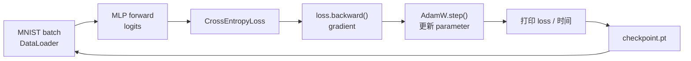

# L09 实践：训练第一个模型，从 loss 到 checkpoint

> [!abstract] 本课速览
> 这不是再背一遍 [[L03 机器学习速成]] 到 [[L07 训练循环解剖]]，而是把它们压进一个能在 CPU 或 Apple Silicon 上跑的脚本。读完并亲手运行后，你将能够：
> 1. 运行一个 `784 -> 256 -> 128 -> 10` 的 MLP，看到 loss 从约 $2.3$ 下降；
> 2. 改 learning rate 和 batch size，并从输出中判断训练是稳定、发散还是受 step 数影响；
> 3. 手算并核对模型的 parameter 数量；
> 4. 保存 checkpoint、加载 checkpoint，并解释这不是“把一个文件存起来”那么简单；
> 5. 把终端的每一行输出对应回 model、forward/backward、optimizer 和 training loop。
>
> 前置：[[L07 训练循环解剖]] · 预计 60–90 分钟

## 本次实践你要亲眼看到什么

1. 第一个 epoch 刚开始时，10 类随机分类的 **loss function**（损失函数）接近 $-\log(1/10)\approx2.30$；训练后，`train_loss` 会明显下降，常见 CPU 跑法在若干 epoch 后可低于 $0.1$。
2. 默认 `learning rate=0.001` 能稳定学习；把它改成 `10` 后，loss 往往剧烈上冲，部分环境会出现 `NaN` 或 `Inf`，脚本会主动停下。
3. `batch_size` 从 32 改成 256 时，每个 epoch 的 optimizer step 数从约 1875 变成约 235；速度和收敛曲线不能只看其中一个数字。
4. 脚本打印的 235,146 个 **parameter**（参数）与手算完全一致。
5. 训练结束后生成 `checkpoint.pt`；用 `--resume` 再次启动时，模型与 AdamW 的状态都会被加载，而不是从随机初始化重新开始。

这五个现象就是一条微缩的训练系统时间线：数据被 `DataLoader` 送进模型，模型做 forward，loss 触发 backward，optimizer 更新参数，最后 checkpoint 留下可恢复的状态。

## 〇、环境准备

本课只要求一台普通笔记本。没有 GPU 时明确指定 `--device cpu`；Apple Silicon 可指定 `--device mps`，也可让默认的 `--device auto` 自动选择。不要为了本课配置 CUDA。

建议使用 Python 3.9–3.12。以下版本是一组已配对的 CPU / macOS 路径依赖：

```bash
python3 -m venv .venv
source .venv/bin/activate
python -m pip install --upgrade pip
python -m pip install "torch==2.5.1" "torchvision==0.20.1"
# 可选：让脚本打印当前进程 RSS 内存；没装也不影响训练。
python -m pip install "psutil==5.9.8"
```

完整单文件脚本在 [[L09_train_mnist.py]]。它第一次运行会自动下载 MNIST 到当前目录下的 `data/`，并把检查点写到 `outputs/l09/checkpoint.pt`。在仓库根目录运行：

```bash
python "M1 深度学习基础/实践代码/L09_train_mnist.py" --device cpu
```

> [!tip] 先让默认实验完整跑完
> CPU 上一次完整 MNIST 训练可能需要数分钟，取决于机器。第一次不要急着改参数；先确认你看到了 epoch、loss、accuracy、每 epoch 时间和 checkpoint 路径。若只想核对环境和代码路径，可临时加 `--limit-train 2048 --limit-test 512 --epochs 1`，但这个小数据集实验不应拿来判断最终 loss。

## 一、逐步任务

### 1. 跑通默认训练：从随机猜到会分类

脚本中的 `MnistMlp` 是一个 **model**（模型）：输入图像形状为 `[batch, 1, 28, 28]`，先被 `Flatten` 成 `[batch, 784]`，再经过三个 linear layer。输出是 10 个 logits，交给 `CrossEntropyLoss` 计算 loss。

运行默认命令。终端会输出类似下面的字段，具体数值随 CPU、设备和 PyTorch 版本略有变化：

```text
device=cpu dataset=mnist parameters=235,146
epoch=01/08 train_loss=... test_loss=... test_accuracy=... time=... samples_per_second=...
checkpoint=outputs/l09/checkpoint.pt
```

`train_loss` 是本 epoch 所有 batch loss 按样本数加权后的平均值；不是最后一个 batch 的偶然数。每个 epoch 里，**training loop**（训练循环）重复执行：取一个 batch → `optimizer.zero_grad()` → **forward pass**（前向传播）→ 算 loss → **backward pass**（反向传播）→ `optimizer.step()`。

预期现象是 loss 总体下降，测试准确率上升。曲线不会保证每一行严格单调，因为 mini-batch 带有随机性；要看趋势，不要把某一步的小反弹立刻当作训练失败。

> [!example] 算一算：这个 MLP 为什么正好有 235,146 个参数？
> 脚本固定了三层线性变换 `784 -> 256 -> 128 -> 10`。每层参数数为 weight 加 bias：
>
> $$
> (784\times256+256)+(256\times128+128)+(128\times10+10)
> $$
>
> $$
> =200{,}960+32{,}896+1{,}290
> =235{,}146.
> $$
>
> 这个数字来自脚本的层形状，不需要任何硬件经验值。脚本启动时会用 `sum(parameter.numel() ...)` 复算并断言相等。此处的 parameter 正是 [[L03 机器学习速成]] 中由训练调整的数；不要把它和一个 batch 的图像像素数混为一谈。

### 2. 改 learning rate：故意把车开得太快

先保留其余参数不变，运行：

```bash
python "M1 深度学习基础/实践代码/L09_train_mnist.py" --device cpu --lr 10
```

默认的 **optimizer**（优化器）是 AdamW。`--lr 10` 把 **learning rate**（学习率）从 $10^{-3}$ 提高到 $10^{1}$，也就是放大了 $10^4$ 倍。通常你会看到 loss 远大于默认运行、来回震荡或逐渐失控；某些版本、设备或随机种子下会进入 `NaN` / `Inf`，脚本将报错退出，而不是继续产生一条误导性的“正常”曲线。

这里最重要的不是收集一次必然的 NaN。数值是否在某一 epoch 变成 NaN 会受实现和随机性影响；==只要相同模型在其他条件不变时因过大学习率而稳定性显著恶化，实验就已经验证了 learning rate 是更新步幅，不是越大越快。==

把 `--lr 10` 改为 `--lr 0.01`、`--lr 0.0001`，各跑 2–3 个 epoch，记录 loss 下降速度。这就是最小的 ablation：只动一个变量，再解释差异。

### 3. 改 batch size：少装几次还是多装几次？

分别运行下面两条命令，固定 `--epochs 2`，比较每个 epoch 的 `time`、`samples_per_second` 与 `train_loss`：

```bash
python "M1 深度学习基础/实践代码/L09_train_mnist.py" --device cpu --batch-size 32 --epochs 2
python "M1 深度学习基础/实践代码/L09_train_mnist.py" --device cpu --batch-size 256 --epochs 2
```

MNIST 训练集有 60,000 个样本。忽略最后一批不足整批的情况，batch size 为 32 时一个 epoch 有

$$
60{,}000/32=1875
$$

个 optimizer step；batch size 为 256 时约有

$$
60{,}000/256\approx234.4,
$$

即 235 个 step。较大的 batch 往往减少 Python 循环和 optimizer 调用次数，但它同时改变了“一轮数据经历多少次参数更新”。所以不能看到 256 更快就断言“batch 越大越好”，也不能用同样的 epoch 数直接断言谁收敛更好。[[L06 优化器]] 和 [[L07 训练循环解剖]] 中的 batch size、step 与 global batch size 在这里变成了真正能看到的计数器。

### 4. 看一眼内存：训练不只是在算

若安装了可选的 `psutil`，脚本会在训练前后打印进程 RSS；未安装时，它会提示你使用 macOS 的活动监视器或系统任务管理器。记录一次训练结束后的进程内存，再把命令改为只做评估并不在本课脚本里实现，这是有意保留的观察任务：训练路径需要保存 activation 并保存 optimizer state，推理通常不需要这些状态。

不要把 RSS 直接当作“模型显存”。它包含 Python 解释器、数据加载、PyTorch allocator 和缓存；本课只让你建立“训练通常比只做 forward 占用更多内存”的观察。精确的训练显存记账留到 [[L40 训练显存全解剖]]。

### 5. 保存并续训 checkpoint：不要重新从起点出发

默认每个 epoch 都写一次 `outputs/l09/checkpoint.pt`。先用较短运行生成它：

```bash
python "M1 深度学习基础/实践代码/L09_train_mnist.py" --device cpu --epochs 2
python "M1 深度学习基础/实践代码/L09_train_mnist.py" \
  --device cpu --epochs 4 --resume outputs/l09/checkpoint.pt
```

第二条命令应提示“从 epoch 3 开始”。脚本保存 `model_state_dict`、`optimizer_state_dict`、epoch、随机状态和运行参数；加载时恢复 model 和 AdamW 的状态。这样你不是拿一组 weight 开始一段新实验，而是在原有优化轨迹上继续。

> [!warning] checkpoint 路径会被覆盖
> 默认输出路径每个 epoch 都是同一个 `outputs/l09/checkpoint.pt`，这是为了让首次实践简单。做 learning rate 或 batch size 对比时，请加不同的 `--output-dir`，例如 `--output-dir outputs/l09-lr-001`；否则后一组实验会覆盖前一组 checkpoint，日志也失去可比性。

## 二、观察与解释：把终端输出接回理论课

| 你看到的现象 | 它对应的概念 | 应该怎么解释 |
|---|---|---|
| 初始 loss 接近 2.3，随后下降 | [[L03 机器学习速成]] 的 loss 与训练集 | 10 类均匀随机猜测正确类别概率约为 $0.1$，交叉熵约为 $-\log(0.1)$；下降说明参数更新让正确类的概率变大。 |
| `parameters=235,146` | [[L04 神经网络与前向传播]] 的 layer、shape 与 parameter | MLP 本质是一组矩阵乘和 bias；只要层形状确定，参数数可以独立手算。 |
| 每个 batch 都有 forward、loss、backward、step | [[L05 反向传播与梯度]] | forward 产生 logits，loss 给出标量目标，backward 根据 computational graph 计算 gradient，step 才真正改 parameter。 |
| 改大 `--lr` 后失稳 | [[L06 优化器]] 的 learning rate、AdamW 和 loss curve | optimizer 不是魔法；学习率把 gradient 转成实际更新幅度，过大更新能反复越过较低 loss 的区域。 |
| batch size 改变 epoch 时间和 loss 轨迹 | [[L07 训练循环解剖]] 的 DataLoader、step 和 batch size | 资源利用率、每 epoch 的更新次数和梯度噪声都变了；比较时必须说明相同的是 epoch、step 还是样本数。 |
| checkpoint 被加载后从后续 epoch 开始 | [[L07 训练循环解剖]] 的 state_dict、optimizer states 与 resume | 续训需要的不只是模型权重，还包括优化器历史和进度；大规模训练中这会进一步牵出存储、网络和故障恢复。 |



## 三、挑战题

1. 把 `AdamW` 换成 `torch.optim.SGD`，先只改 optimizer，不改 learning rate。比较默认 `0.001` 下的曲线，再寻找一个更合适的 SGD learning rate。结论必须附上命令、epoch 数和至少两项输出，而不是只说“SGD 比较慢”。
2. 安装可选依赖 `torchinfo==1.8.0`，在创建 model 后调用 `torchinfo.summary(model, input_size=(1, 1, 28, 28))`。核对每层输出 shape 与前面的手算参数量。
3. 固定 `--seed 42`，用 `--lr 10` 跑到脚本停止或 8 个 epoch 结束。记录最早异常的 epoch；再用 `--lr 0.01` 重跑。什么证据能支持“不是数据下载或 DataLoader 出错，而是更新步幅过大”？
4. 把 `--dataset fashionmnist` 跑一遍。模型形状没有变，为什么 loss 和 accuracy 曲线可能明显不同？把这个问题连回 [[L03 机器学习速成]] 中 dataset、feature、label 和 generalization 的区分。

## 回到本次实践

现在逐项回看开头的目标：

1. 你不再把 `$2.3` 当作神秘的初始 loss。它来自十分类均匀猜测的交叉熵；下降来自训练循环持续调整 parameter。
2. 你可以用同一条脚本隔离 learning rate 与 batch size 的影响，知道“快”至少要说明是每 step、每 epoch 还是每个样本的速度。
3. 235,146 不是框架随手打印的黑箱数字：三个 linear layer 的 weight 和 bias 可逐项手算。
4. 你已经看到 checkpoint 是可加载的训练状态，而不只是权重文件；后续的系统问题会问“这么大的状态放在哪里、多久能写完、坏了怎么恢复”。
5. 因而以后读到训练脚本或论文日志中的 `loss`、`batch size`、`lr`、`checkpoint`，你可以先问：它对应训练循环的哪一步，单位和计数口径是什么？

## 术语卡片

本课不引入新术语；以下十个概念均已在前课收录，这里只把它们指回实际代码行。

| 术语 | 中文 | 在本课中看到什么 |
|---|---|---|
| model | 模型 | `MnistMlp` 把一批图像映射成 10 个 logits。 |
| parameter | 参数 | 三层 linear layer 的 weight 和 bias，共 235,146 个可训练数。 |
| DataLoader | 数据加载器 | 每次产出 `(images, labels)` batch，并在训练集上 shuffle。 |
| training loop | 训练循环 | 对每个 batch 重复取数据、求导、更新、记录。 |
| forward pass | 前向传播 | `logits = model(images)`。 |
| backward pass | 反向传播 | `loss.backward()` 计算并写入 gradient。 |
| loss function | 损失函数 | `CrossEntropyLoss()` 把 logits 与真实 label 变成标量 loss。 |
| optimizer | 优化器 | `AdamW` 读取 gradient 和历史状态来更新参数。 |
| learning rate | 学习率 | `--lr` 控制每次更新的尺度，默认是 $10^{-3}$。 |
| checkpoint | 检查点 | `checkpoint.pt` 保存 model、optimizer、epoch 和随机状态。 |

## 自测

1. 为什么十分类随机猜测的交叉熵约为 $2.3$？它为什么不表示模型“已经学会了 23%”？
2. `optimizer.zero_grad()`、`loss.backward()`、`optimizer.step()` 在脚本中各做什么？
3. MNIST 有 60,000 个训练样本，batch size 为 128 时，一个 epoch 约有多少个 optimizer step？
4. 将 batch size 从 32 改为 256，并保持 epoch 数不变，为什么不能只比较最终 loss 就断言某组优化器更好？
5. 为什么只加载 `model_state_dict` 不等于完整 resume？本脚本另外保存了哪两类关键状态？
6. 已知 MLP 三层分别是 `784 -> 256`、`256 -> 128`、`128 -> 10`，手算总 parameter 数。

> [!note]- 参考答案
> 1. 均匀猜测时正确类概率为 $0.1$，交叉熵是 $-\log(0.1)\approx2.3026$。它是概率分布的负对数损失，不是百分比。
> 2. `zero_grad()` 清除上一 batch 留下的 gradient；`backward()` 从 loss 反向计算 gradient；`step()` 用 gradient 和 AdamW states 更新 parameter。
> 3. $60{,}000/128=468.75$，DataLoader 不丢最后一批时实际约为 469 个 step。
> 4. batch size 还改变每 epoch 的更新次数、每步计算量和 gradient 的统计特性。应至少说明比较的是相同步数、相同样本数还是相同墙钟时间。
> 5. 只有模型权重时可以做 inference 或开始新训练，但 AdamW 的历史状态和训练进度丢失。本脚本还保存 optimizer state、epoch、随机状态和参数配置。
> 6. $(784\times256+256)+(256\times128+128)+(128\times10+10)=235{,}146$。

## 延伸阅读

- [PyTorch Quickstart](https://pytorch.org/tutorials/beginner/basics/quickstart_tutorial.html)：核对 Dataset、DataLoader、模型、优化器和训练循环在官方最小示例中的位置。
- [PyTorch Saving and Loading Models](https://pytorch.org/tutorials/beginner/saving_loading_models.html)：只读 `state_dict` 与 checkpoint 的部分，确认为什么恢复 optimizer 不是可选细节。
- [Andrej Karpathy：The spelled-out intro to neural networks and backpropagation: building micrograd](https://www.youtube.com/watch?v=VMj-3S1tku0)：若 `loss.backward()` 仍像黑箱，跟着标量版本看一次 computational graph 如何积累 gradient。

---
上一课：[[L08 CNN与RNN简史]] ← · → 下一课：[[L10 Token与嵌入]]
