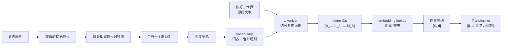
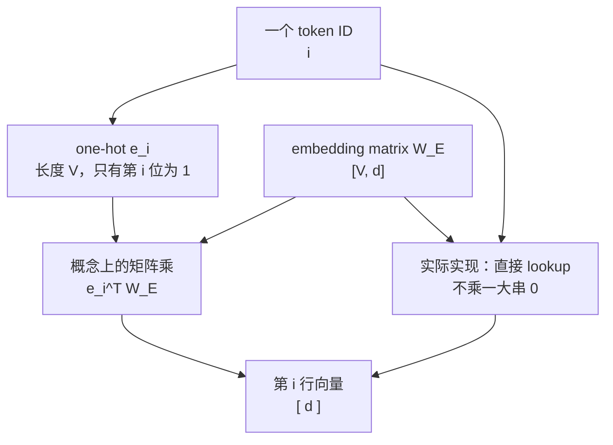

# L10 Token与嵌入：语言怎样变成可计算的向量

> [!abstract] 本课速览
> 读完你将能够：
> 1. 沿着“文本 -> token ids -> 向量序列”的路径，解释语言怎样进入 Transformer；
> 2. 说明 BPE 为什么比按字符或按单词切分更实用，并知道 token 数会随语言和 tokenizer 改变；
> 3. 写出 embedding matrix 的形状 $V\times d$，并手算 Llama-3-8B 的输入 embedding 参数量；
> 4. 区分 context window 的模型属性与显存能容纳多少 KV cache 的工程约束；
> 5. 在训练日志或推理服务指标中正确追问 `tokens/s` 的统计口径。
>
> 前置：[[L04 神经网络与前向传播]] · 预计 45 分钟

## 论文里的这段话，你现在可能读不懂

> [!quote]
> A BPE tokenizer converts a chat request into token IDs from a vocabulary. Each ID indexes an embedding matrix before the model processes the resulting vector sequence. Usage, throughput, and the maximum context window are all measured in tokens.
>
> （改写自典型 LLM API 与技术报告表述）

这三句把文字处理、参数表和系统计量塞在了一起。这里的 **token**（词元）不是单词的同义词，数字 ID 也不是“语义分数”；它们只是让模型能稳定查表、计算和计账的共同接口。读完本课，你应能把这段话画成一条数据流水线，并指出其中每一个计数器的口径。

## 一、为什么不能直接把一句话交给神经网络

[[L04 神经网络与前向传播]] 里的线性层只接受 tensor。人看到“你好世界”时直接理解含义，GPU 看到的却必须是一串可索引的整数和浮点数。把原始文本切成离散单位的动作叫 **tokenize**（词元化），完成这件事的规则和程序叫 **tokenizer**（词元切分器）。

最朴素的想法有两种：按字符切，或按单词切。

| 切分办法 | 好处 | 卡在哪里 |
|---|---|---|
| 字符级 | 词表很小，任何新词都能拼出来 | 序列很长；一个常见词被拆成许多步，模型要跨更多位置建立关系 |
| 词级 | 一个常见词可用一个 ID，序列短 | 新词、拼写变体、专名会落入未知词；词表很容易膨胀 |
| 子词级 | 常见片段可合并，不常见词仍能拆开 | 具体边界由 tokenizer 决定，不能凭肉眼或字典猜 |

现代 LLM 常采用 **subword**（子词）方案：它不承诺“一个 token 恰好是一词”，而是在可复用片段和序列长度之间折中。最常见的入门心智模型是 **BPE**（Byte Pair Encoding，字节对编码）：先从较细的符号开始，在训练语料里反复找高频相邻对并合并，最后得到一套词表和合并规则。

例如，在一个玩具 BPE 词表里，`unhappiness` 可以被表示为 `un` 加 `happiness` 这样的两个片段；这样 `un-` 又能复用于 `unhappy`、`unfair` 等词。==这只是合并直觉，不是对任何具体模型的实际切分承诺。==真实 tokenizer 还可能从 byte 或其他基本单位开始，并带有规范化等规则；要知道某段文本究竟被切成什么，必须用目标模型的 tokenizer 实测。

### 词表就是 ID 的字典

**vocabulary**（词表）保存“token 片段 <-> 整数 ID”的映射，词表中条目的总数叫 **vocab size**（词表大小），记为 $V$。一套 tokenizer 在训练后通常固定：同一个 token ID 总指向同一条词表记录，但 ID 的大小本身没有语义顺序。

LLM 的词表大小常在约 32K 到 256K 的量级。词表太小，文本会被切得很碎，序列变长；词表太大，embedding 和输出端的表也会变大，罕见条目还可能学得不充分。[[03 约定与符号]] 中的课程参考例子 Llama-3-8B 取 $V=128256$，正好落在这个量级内。

> [!tip] 直觉
> 把 vocabulary 想成仓库货架编号：ID `42` 的意义只是“去第 42 格取指定货物”，不是“它比 ID `7` 更接近某个概念”。语义要等查出向量、经过训练后才出现。

### 一种语言并不对应固定的 token 比率

“一个英文单词就是一个 token”是读 LLM 论文时最常见的误会之一。根据 [[03 约定与符号]] 的统一教学口径，1 个英文单词约为 1.3 token，1 个汉字约为 0.5–1 token；两者都会随 tokenizer 和文本内容改变。标点、空格、代码、罕见人名、emoji 都可能让直觉失效。

这也是 API 常按 input 和 output 的 token 数计量的原因：token 是模型实际读取和生成的离散步数，能同时连接产品用量、context 长度和计算吞吐。不过“按 token 计费”不等于所有 token 的价格或系统代价相同；看一个具体服务时，仍要核对输入、输出、缓存命中和模型档位各自的规则。

## 二、ID 怎样变成向量：embedding 是一次查表

tokenizer 的输出是整数序列，例如 `[id_1, id_2, ..., id_S]`，其中 $S$ 是序列长度。整数无法直接表达“相近”或“可组合”的语义，模型需要把每个 ID 映射为一个长度为 $d$ 的浮点向量。这个可学习映射叫 **embedding**（嵌入）。

把全部 token 的向量按行堆起来，就是 **embedding matrix**（嵌入矩阵）：

$$
W_E\in\mathbb{R}^{V\times d}.
$$

第 $i$ 个 ID 直接取第 $i$ 行：

$$
\operatorname{embedding}(i)=W_E[i,:]\in\mathbb{R}^{d}.
$$

为理解这个查表动作，可以引入 **one-hot**（独热向量）。若 $e_i\in\mathbb{R}^{V}$ 只有第 $i$ 个位置为 1，其余位置全为 0，那么 $e_i^T W_E$ 恰好选出 $W_E$ 的第 $i$ 行。真正的框架不会傻乎乎地乘完一串 0，而是实现为一次 lookup；one-hot 只是解释它为何等价于矩阵乘。

对整段长度为 $S$ 的输入，查表后得到 `[S, d]` 的向量序列，才交给后续 Transformer。位置顺序怎样补进去、不同 token 怎样互相看见，分别留给 [[L12 Transformer全解剖]] 和 [[L11 注意力机制]]。

### “语义即几何”到底是什么意思

embedding 的参数和其他模型参数一样，从训练目标中学出来。经常在相似上下文出现的 token，其向量往往会在某种距离度量下更接近；因此人们说“语义即几何”。这是一条有用的直觉，不是一部完美词典：多义词、不同语境和训练数据偏差都会让“距离近”不能直接等于“意思相同”。

后续做 RAG 时会遇到 embedding model：它把一个 query 或文本块整体映射成便于检索的向量。它和这里“每个 token 查一行”的 embedding 共享向量直觉，但输入粒度、训练目标和服务接口不同；把两者混为一谈，会很难读懂 [[L70 选修-多模态与新负载]] 中的检索流程。

> [!example] 算一算：Llama-3-8B 的输入 embedding 占多少参数？
> [[03 约定与符号]] 的参考模型表给出 Llama-3-8B 的词表大小 $V=128256$、hidden size $d=4096$、模型标称参数量约 $8.0\text{B}$。因此输入 embedding matrix 的参数数为
>
> $$
> N_E=V\times d
> =128256\times4096
> =525{,}336{,}576
> \approx0.525\text{B}.
> $$
>
> 占标称 8.0B 的比例为
>
> $$
> \frac{0.525336576\text{B}}{8.0\text{B}}
> \times100\%\approx6.6\%.
> $$
>
> 也就是设计稿所说的约 6.5%。若只按 [[03 约定与符号]] 的 BF16 权重口径存这张输入表，它还需 $0.525336576\times10^9\times2\ \text{B}\approx1.05\ \text{GB}$。这还没有计算输出端的词表投影；完整参数账留到 [[L12 Transformer全解剖]]。

## 三、context window：一次能摆上桌多少 token

**context window**（上下文窗口）是模型一次可处理的 token 上限；**context length**（上下文长度）通常就是用 token 数表达这个窗口的长度。模型文档中常见 8K、128K、1M 这样的量级标签：它们分别意味着几千、十几万和百万 token 级别的单次上下文容量，准确数字仍应以具体 model config 或服务文档为准。

窗口首先是模型训练和位置处理方式塑造的属性，而不是“显存有多少 GB”这一条硬件规格。固定模型在部署时当然还会受显存、KV cache、并发请求和服务限额约束，实际可接受的请求可能比模型标称窗口更短；但不能把“这张卡放不下更多请求”误说成“模型的 context window 天生更小”。位置编码、长上下文外推和 KV cache 的细节会在 [[L18 注意力变体与长上下文]]、[[L13 自回归生成与KV缓存]] 展开。

> [!example] 算一算：一部 50 万字中文小说能否塞进 128K？
> 这里把“50 万字”按 500,000 个汉字近似。根据 [[03 约定与符号]] 的统一口径，每汉字约为 $0.5$–$1$ token，所以文本长度估算为
>
> $$
> S\approx500{,}000\times(0.5\text{--}1)
> =250{,}000\text{--}500{,}000\ \text{tokens}.
> $$
>
> 若把 128K 按 128,000 token 的量级比较：
>
> $$
> \frac{250{,}000}{128{,}000}\approx1.95,
> \qquad
> \frac{500{,}000}{128{,}000}\approx3.91.
> $$
>
> 所以它约是 128K window 的 2–4 倍，不能原样一次放入；system prompt、chat template 和预留输出 token 还会进一步吃掉预算。实际项目必须用目标 tokenizer 实测，不应把本估算当作某本书的精确 token 数。

> [!warning] 常见误区
> - **“token = 单词。”** token 是 tokenizer 定义的离散片段；一个单词、一个汉字或一个标点都可能对应不同数量的 token。
> - **“ID 相近，意思就相近。”** ID 只是词表索引。向量空间里的关系来自训练后的 embedding，不来自编号大小。
> - **“context window 由显存决定。”** 窗口是模型能力和配置；显存决定的是某次部署在给定并发下能否承受对应的 KV cache。两者相关，但不是同一个量。

## 四、特殊 token 与聊天接口：看不见的文本也会占位

除了普通文本片段，词表还会保留 **special token**（特殊 token）来标记结构。常见的 **BOS**（beginning-of-sequence，序列起始 token）表示一段序列从哪里开始，**EOS**（end-of-sequence，序列结束 token）可作为生成停止信号，**PAD**（padding，填充 token）用于把一批不同长度的序列补到相同形状。不同模型未必使用完全相同的记号或流程，读实现时要看该模型的 tokenizer 配置。

聊天产品还会用 **chat template**（聊天模板）把 `system`、`user`、`assistant` 等角色和消息边界编码成模型认可的序列格式。它不是纯 UI 装饰：同一段人类可见文字，换一个 template 可能变成不同的 token 序列，继而改变模型行为和 token 计数。排查“本地与线上回答不同”时，除了比较模型权重，也要比较 tokenizer 和 chat template。

## 五、token 是训练与推理的共同计量接口

**tokens per second**（每秒 token 数，常写作 `tokens/s`）把模型、硬件和服务系统接到了同一个单位上，但这个指标离开上下文就没有意义。[[03 约定与符号]] 规定：训练吞吐应写全局 `tokens/s`；推理则必须说明是单请求还是整机/整服务的 `tokens/s`。同一个“1000 tokens/s”可能代表一条请求生成得很快，也可能代表许多请求合在一起的总产出。

| 场景 | tokenizer 在哪里 | 要说清的 token 口径 |
|---|---|---|
| 训练 | 通常先在离线数据预处理阶段把语料转成 token IDs，再写入数据分片 | 全部 ranks 合计的全局 tokens/s、序列长度和 global batch size |
| 在线推理 | 收到请求后先套 chat template、tokenize prompt；输出 IDs 再 detokenize 成文字 | prompt 还是生成 token、单请求还是整机、统计时间窗口 |

训练侧的离线预处理和数据供给会在 [[L34 存储与数据供给]] 细讲；推理侧为什么 prompt 和逐 token 生成的性能形状不同，会在 [[L13 自回归生成与KV缓存]] 与 [[L55 推理性能模型]] 回收。现在先记住一件事：token 是最方便的通用货币，但不是完整的成本模型。相同 token 数在不同 sequence length、batch 和阶段下，对 GPU、显存与网络的压力可以截然不同。

## 回到开头那段话

现在逐句回读开场：

1. **“A BPE tokenizer converts a chat request into token IDs from a vocabulary.”**：tokenizer 执行 tokenization；BPE 用高频片段的合并直觉构成 subword 词表。token ID 只是 vocabulary 中的索引，对应第一节。
2. **“Each ID indexes an embedding matrix before the model processes the resulting vector sequence.”**：形状为 $V\times d$ 的 embedding matrix 为每个 ID 提供一行 $d$ 维向量；one-hot 乘矩阵能解释查表，实际实现直接 lookup。对应第二节。
3. **“Usage, throughput, and the maximum context window are all measured in tokens.”**：token 数同时决定 API 的输入/输出计量、context length 和 tokens/s 的分母或分子；但上下文窗口、显存容量与吞吐仍是不同层次的约束。对应第三至五节。

以后看到“128K context”“500 tokens/s”或“embedding 参数”时，先问三个问题：它用的哪套 tokenizer？计的是 input、output 还是总 token？它说的是模型能力、单请求表现还是整机吞吐？这三个问题能避免很多论文和产品文档里的口径误读。

## 术语卡片

| 术语 | 中文 | 一句话解释 |
|---|---|---|
| token | 词元 | tokenizer 切分出的模型离散处理单位，不等同于单词或字符。 |
| tokenize | 词元化 | 把原始文本按既定规则切成 token 序列的动作。 |
| tokenizer | 词元切分器 | 定义并执行文本到 token IDs 映射的规则和程序。 |
| BPE | 字节对编码 | 通过反复合并语料中高频相邻片段来构造子词词表的常见方法。 |
| subword | 子词 | 介于字符和完整单词之间、可在多个词中复用的 token 片段。 |
| vocabulary | 词表 | token 片段与整数 ID 的固定映射集合。 |
| vocab size | 词表大小 | vocabulary 中 token 条目的总数，通常记为 $V$。 |
| embedding | 嵌入 | 将离散 ID 映射为可学习的连续向量的表示。 |
| embedding matrix | 嵌入矩阵 | 形状为 $V\times d$、每行对应一个 token 向量的参数表。 |
| one-hot | 独热向量 | 仅一个位置为 1、其他位置均为 0 的向量，可概念性地表示一次查表。 |
| context window | 上下文窗口 | 模型一次可处理的 token 上限。 |
| context length | 上下文长度 | 用 token 数描述的上下文窗口长度，常与 context window 近义。 |
| special token | 特殊 token | 表示序列边界、填充或角色结构等控制用途的保留 token。 |
| BOS | 序列起始 token | beginning-of-sequence 的缩写，标记一段序列的开始。 |
| EOS | 序列结束 token | end-of-sequence 的缩写，常可作为生成停止信号。 |
| PAD | 填充 token | 为把同一 batch 的序列补齐到相同长度而使用的 token。 |
| chat template | 聊天模板 | 将角色、消息边界和正文转换为模型期望 token 序列的格式规则。 |
| tokens per second | 每秒 token 数 | 每单位时间处理或生成的 token 数；必须说明训练/推理及聚合口径。 |

## 自测

1. 为什么“一个 token 就是一个单词”在英文、中文和代码中都不可靠？
2. BPE 的合并直觉解决了字符级和词级切分各自的什么问题？为什么玩具切分示例不能当作实际 API 的计费结果？
3. 词表大小 $V=50{,}000$、hidden size $d=2048$ 时，embedding matrix 有多少参数？若按 BF16 存储，权重约占多少 GB？
4. 一段 300,000 个汉字的文本按本课统一口径大约是多少 token？它能否完整放进 128K context window？
5. BOS、EOS、PAD 和 chat template 分别在序列或聊天接口中解决什么问题？
6. 训练报告写“吞吐 200K tokens/s”，推理服务写“吞吐 200K tokens/s”。在比较它们之前，你至少还要问哪两项口径？

> [!note]- 参考答案
> 1. token 的边界由 tokenizer 的词表和规则决定。一个英文词可被拆成多个片段，一个汉字可单独或与邻字合并，代码和标点的切分也常与人眼的“词”不同。
> 2. BPE 让高频片段合并以缩短常见文本，又保留把罕见词拆开的能力，避免固定词级词表的大量未知词。真实 tokenizer 的基本单位、合并表和规范化规则可能不同，必须用目标 tokenizer 实测。
> 3. $50{,}000\times2048=102{,}400{,}000$ 个参数，即 $0.1024\text{B}$。按 [[03 约定与符号]] 的 BF16 口径，每参数 2 B，所以约为 $204{,}800{,}000\ \text{B}\approx0.205\ \text{GB}$。
> 4. $300{,}000\times(0.5\text{--}1)=150{,}000\text{--}300{,}000$ token，已经超过 128K 的量级，因此不能原样完整放入；还应预留模板和输出空间。
> 5. BOS 标记开始，EOS 可标记结束并触发停止，PAD 让同一 batch 的序列长度对齐；chat template 把角色和消息边界编码成模型理解的 token 序列。
> 6. 至少要问：训练是全局总 tokens/s 还是局部值；推理是单请求还是整机/整服务聚合值。还应问计的是 prompt、生成 token 还是两者之和，以及对应的 sequence length、batch 和时间窗口。

## 延伸阅读

- [OpenAI Tokenizer](https://platform.openai.com/tokenizer)：输入同一句中英文、代码和 emoji，亲眼比较 token 边界；只把它当作特定 tokenizer 的实测，不外推到所有模型。
- [tiktoken](https://github.com/openai/tiktoken)：阅读 OpenAI 的快速 tokenizer 实现与示例，理解“同一段文本先 encode 成 IDs、再 decode 回文本”的接口。
- [Andrej Karpathy: Let's build the GPT Tokenizer](https://www.youtube.com/watch?v=zduSFxRajkE)：跟着实现一个最小 BPE tokenizer；重点看合并规则怎样从训练语料产生。

---
上一课：[[L09 实践-训练第一个模型]] ← · → 下一课：[[L11 注意力机制]]
