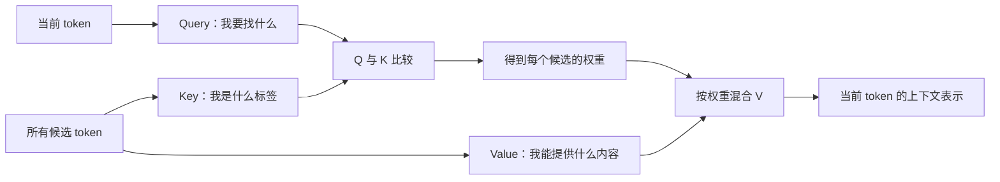
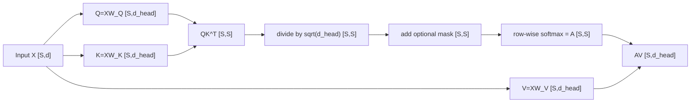
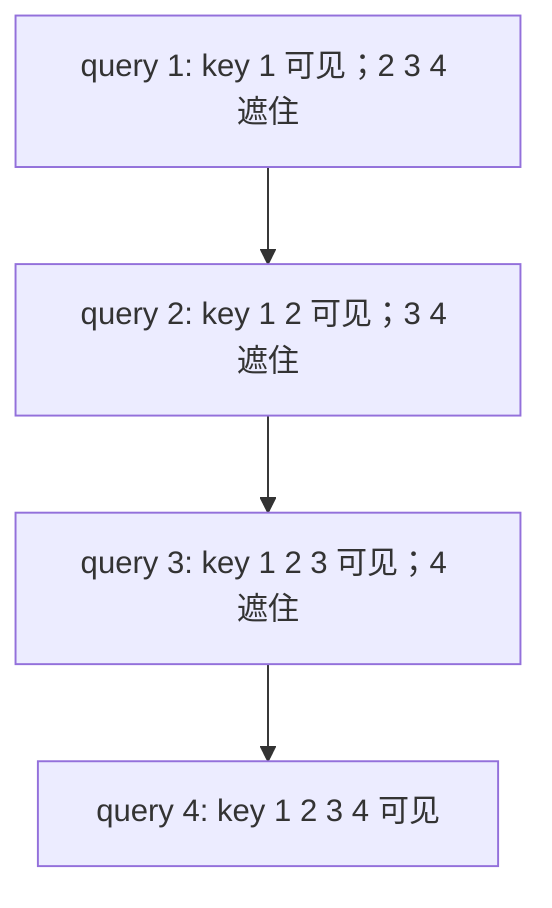

# L11 注意力机制：QKV 怎样让 token 看见上下文

> [!abstract] 本课速览
> 读完你将能够：
> 1. 用“检索后加权取值”的直觉解释 attention 到底在做什么；
> 2. 从输入 $X$ 推出 $Q$、$K$、$V$，默写 scaled dot-product attention 公式并追踪每个矩阵的形状；
> 3. 区分 self-attention、cross-attention、bidirectional attention 和 causal attention；
> 4. 说明 multi-head attention 如何分头、拼接并经过输出投影；
> 5. 独立复算 $S=8192$ 时 attention 的 FLOPs 和朴素中间矩阵显存，说出 $O(S^2)$ 为何会变成系统瓶颈。
>
> 前置：[[L10 Token与嵌入]] · 预计 50 分钟

## 论文里的这段话，你现在可能读不懂

> [!quote]
> Each token forms a query that is compared with keys by scaled dot-product attention, and the resulting attention weights mix the values. Multi-head self-attention applies a causal mask so that a token cannot attend to future positions. Because the attention scores form an $S\times S$ matrix, vanilla attention has quadratic compute and memory growth with sequence length.
>
> （改写自典型 Transformer 与 LLM 系统论文表述）

这三句话把 QKV、scaled dot-product、multi-head、causal mask 和 quadratic growth 挤在了一起。它想说的其实是一个很朴素的动作：==每个 token 先问“谁对我现在最有用”，再按答案的权重收集信息。==本课会把这个动作拆到每一次矩阵乘；结尾再回来逐句翻译。

## 一、同一个 bank，为什么要看上下文

[[L10 Token与嵌入]] 把长度为 $S$ 的 token 序列变成 $X\in\mathbb{R}^{S\times d}$。但 embedding 查表时，同一 token ID 取出的还是同一行向量。英语里的 `bank` 可以是银行，也可以是河岸：

- `I deposited cash at the bank.` 中，`cash` 和 `deposited` 应该让 `bank` 偏向“银行”；
- `We sat on the bank of the river.` 中，`river` 应该让它偏向“河岸”。

如果每个位置只看自己的 embedding，两个 `bank` 就无法分家。**attention**（注意力）的作用，就是让一个位置根据当前上下文，动态地从其他位置聚合信息。这个动作不会删掉原 token，而是为它产生一个已经带上下文的新表示。

### QKV 就是一次可学习的检索

把一排 token 想成图书馆中的一排书：

- **query**（查询）表示当前位置“我想找什么”，简写为 $Q$；
- **key**（键）表示每个候选位置“我是什么标签”，简写为 $K$；
- **value**（值）表示候选位置真正要被取走的“内容”，简写为 $V$。

三者合称 **QKV**。系统先用 query 与所有 key 比较，再根据比较结果混合 value。搜索引擎也是“查询匹配索引，索引指向内容”；只不过 attention 里的查询、标签和内容都是训练学出来的向量。

> [!tip] 直觉
> Key 用来“匹配”，Value 用来“取走”。查到哪本书靠索引标签，真正读到的是书里的内容；所以 $K$ 和 $V$ 分工不同。

## 二、从 $X$ 到 $\operatorname{Attention}(Q,K,V)$

一套独立的 Q、K、V 投影，加上随后“打分 → softmax → 加权取值”的完整计算，称为一个 **attention head**（注意力头）。先只看一个 head，并省略 batch 维：输入是 $X\in\mathbb{R}^{S\times d}$，这个 head 处理的特征宽度记作 **$d_{head}$**（单头维度）。模型要学三个不同的投影矩阵：

$$
W_Q,W_K,W_V\in\mathbb{R}^{d\times d_{head}},
$$

并得到

$$
Q=XW_Q,\qquad K=XW_K,\qquad V=XW_V,
$$

因此 $Q,K,V\in\mathbb{R}^{S\times d_{head}}$。这里已经可以排除一个常见误解：$Q$、$K$、$V$ 都由同一个 $X$ 生成，但它们乘的是三组不同参数，==所以绝不是 $Q=K=V$==。

### 第一步：打分

用每个 query 和每个 key 做点积：

$$
R=QK^T,
$$

形状变化是

$$
[S,d_{head}]\times[d_{head},S]\rightarrow[S,S].
$$

$R_{ij}$ 表示第 $i$ 个位置的 query 与第 $j$ 个位置的 key 有多匹配。这个 softmax 之前的数叫 **attention score**（注意力分数）。一行对应一个 query 对全部 key 的 $S$ 个打分。

### 第二步：缩放并归一化

如果 $Q$ 和 $K$ 每一维的尺度相似，$d_{head}$ 个乘积相加后，点积的典型幅度会随 $\sqrt{d_{head}}$ 增长。太大的 score 容易让 softmax 接近“一个位置为 1，其余为 0”的饱和状态，梯度会变小。因此先除以 $\sqrt{d_{head}}$，再对每一行做 **softmax**（将一组分数归一化为和为 1 的非负权重）：

$$
A=\operatorname{softmax}\left(\frac{QK^T}{\sqrt{d_{head}}}\right).
$$

$A_{ij}$ 是 **attention weight**（注意力权重），表示位置 $i$ 从位置 $j$ 取多少信息。每一行都是一个概率分布，形状仍是 $[S,S]$。例如三个经缩放的 score 是 $[2,1,0]$，softmax 后约为 $[0.665,0.245,0.090]$：不是只选一个位置，而是进行软加权。

### 第三步：取内容

用权重矩阵 $A$ 混合 value：

$$
O=AV.
$$

形状变化是

$$
[S,S]\times[S,d_{head}]\rightarrow[S,d_{head}].
$$

把三步合在一起，就得到必须能默写的 **scaled dot-product attention**（缩放点积注意力）：

$$
\boxed{
\operatorname{Attention}(Q,K,V)
=\operatorname{softmax}\left(\frac{QK^T}{\sqrt{d_{head}}}\right)V
}
$$

> [!warning] 常见误区：score 不是 weight
> $QK^T$ 得到的 score 可以为负，每行也不必和为 1；缩放、加 mask 并经过 softmax 后才是 weight。论文可能宽泛地把两者都叫 attention matrix，读公式或代码时要看它处在 softmax 的哪一边。

## 三、谁能看谁：self、cross 与 causal mask

上一节中 $Q$、$K$、$V$ 都来自同一个输入 $X$，这叫 **self-attention**（自注意力）：一段序列内部的位置互相聚合信息。如果 query 来自一段序列，key 和 value 来自另一段序列，就是 **cross-attention**（交叉注意力）。例如 encoder-decoder 架构中，decoder 用自己的 query 去取 encoder 输出中的 key/value；此时 score 的形状是 $[S_q,S_{kv}]$，不一定是方阵。

“来源是否相同”和“允许看哪些位置”是两个不同问题：

| 机制 | 可见范围 | 常见用途 |
|---|---|---|
| **bidirectional attention**（双向注意力） | 每个位置可看左右两边的位置 | 需要理解完整输入的 encoder |
| **causal attention**（因果注意力） | 第 $i$ 个位置只能看它自己与左边 | 从左到右预测下一 token 的 decoder-only LLM |

语言模型训练时，位置 $i$ 不能偷看它要预测的未来 token。**causal mask**（因果掩码）会在 softmax 之前向未来位置加上 $-\infty$：

$$
M_{ij}=
\begin{cases}
0,&j\le i,\\
-\infty,&j>i.
\end{cases}
$$

完整公式变为

$$
\operatorname{Attention}(Q,K,V)
=\operatorname{softmax}\left(
\frac{QK^T}{\sqrt{d_{head}}}+M
\right)V.
$$

因为 $\exp(-\infty)=0$，被遮住的位置在 softmax 后权重就是 0。从上到下看，可见区域是一个下三角：

> [!tip] 先分清两条轴
> self vs cross 问“QKV 来自哪里”；bidirectional vs causal 问“可以看哪里”。decoder-only LLM 通常使用 causal self-attention，这是两个形容词的组合。

## 四、multi-head：同时问几组不同的问题

第二节完整走过的“QKV 投影 → 打分 → softmax → 加权取值”，就是一个 attention head：它用一组 QKV 产生一张权重图和一组输出。**multi-head attention (MHA)**（多头注意力）把这套计算并行做 $h$ 组，相当于把 hidden size $d$ 分给 $h$ 个子空间；每个 head 有自己的 QKV 投影，因而能学到不同的匹配方式。入门时可以想成“一个头关注语法关系，一个头关注代词指代”；但这只是直觉，训练并不会为每个头颁发固定的人类语义标签。

头数为 $h$ 时，课程统一记号为

$$
d_{head}=\frac{d}{h}.
$$

在实现中，通常用大投影一次算出完整 QKV，再把它们从 $[S,d]$ reshape 为 $[h,S,d_{head}]$。每个头独立做 scaled dot-product attention，得到 $[S,d_{head}]$；然后按特征维拼接回 $[S,d]$，最后乘输出投影 $W_O\in\mathbb{R}^{d\times d}$：

$$
\operatorname{MHA}(X)
=\operatorname{Concat}(head_1,\ldots,head_h)W_O.
$$

以 [[03 约定与符号]] 的 Llama-2-7B 教学参数为例，$d=4096$、$h=32$，因此 $d_{head}=4096/32=128$。32 个头各做宽度 128 的 attention，拼接后仍是宽度 4096，不会变成 $32\times4096$。

> [!warning] 常见误区：多头不是把完整 attention 重复 $h$ 遍
> 每个头只处理 $d_{head}=d/h$ 维，所以 $h\times d_{head}=d$。与一个宽度为 $d$ 的大头相比，MHA 的主体计算量不会因头数变成 $h$ 倍；多头的价值是多组关系子空间，而不是白得 $h$ 倍算力。

## 五、平方代价：序列一长，账单为什么爆炸

对 self-attention 来说，每个位置都与 $S$ 个位置打分，因此每个 head 有 $S^2$ 个 score。这就是 **quadratic complexity**（平方复杂度）：序列长度翻倍，score 数量和相关计算翻四倍。

### 先算 FLOPs：线性投影 vs 两次二次型矩阵乘

按 [[03 约定与符号]] 与 [[L04 神经网络与前向传播]] 的口径，一次乘加记 2 FLOPs。下面只计 batch size 1、单层、一次前向，忽略 bias、softmax 和 mask 的较小项。

把 $h$ 个 heads 合并起来记账时，Q、K、V 三个大投影都是 $[S,d]\times[d,d]$，共需

$$
F_{QKV}=3\times2Sd^2=6Sd^2.
$$

所有 head 的 $QK^T$ 共需 $2S^2d$ FLOPs，$AV$ 也需 $2S^2d$ FLOPs，因此

$$
F_{QK^T+AV}=4S^2d.
$$

两者之比为

$$
\frac{F_{QK^T+AV}}{F_{QKV}}
=\frac{4S^2d}{6Sd^2}
=\frac{2}{3}\frac{S}{d}.
$$

关键不在前面的 $2/3$，而在比值随 $S/d$ 线性增长：$S\ll d$ 时 QKV 投影主导；$S$ 增长到与 $d$ 同一量级后，二次项开始不能忽略。精确地说，与三个 QKV 投影相等的位置是 $S=1.5d$；若把 $W_O$ 的 $2Sd^2$ 也计入全部线性投影，分水岭是 $S=2d$。所以论文常把它概括为 $S\approx d$ 量级的分水岭，但比较实验数字时要说清是否计 $W_O$。

> [!example] 算一算：$S=8192$ 时一层 MHA 的前向账
> 按 [[03 约定与符号]] 的参考参数取 $S=8192$、$d=4096$、$h=32$，因此 $d_{head}=4096/32=128$。本例的 FLOPs 是工作量，不是 FLOPS 速率。
>
> 三个 QKV 投影：
>
> $$
> \begin{aligned}
> F_{QKV}
> &=6\times8192\times4096^2\\
> &=824{,}633{,}720{,}832\ \text{FLOPs}\\
> &\approx0.825\ \text{TFLOPs}.
> \end{aligned}
> $$
>
> $QK^T$ 与 $AV$ 两次矩阵乘：
>
> $$
> \begin{aligned}
> F_{QK^T+AV}
> &=4\times8192^2\times4096\\
> &=1{,}099{,}511{,}627{,}776\ \text{FLOPs}\\
> &\approx1.10\ \text{TFLOPs}.
> \end{aligned}
> $$
>
> 二次项已经是 QKV 投影的
>
> $$
> \frac{1.0995}{0.8246}\approx1.33
> $$
>
> 倍。若再加上输出投影 $W_O$，全部投影共为 $8Sd^2\approx1.10\ \text{TFLOPs}$，恰好与此处二次项相等，因为本例 $S=2d$。
>
> 再算朴素实现中一份 $[h,S,S]$ attention matrix 的存储。按 [[03 约定与符号]] 的 BF16 = 2 B 口径：
>
> $$
> \begin{aligned}
> M_A
> &=hS^2\times2\ \text{B}\\
> &=32\times8192^2\times2\ \text{B}\\
> &=4{,}294{,}967{,}296\ \text{B}\\
> &\approx4.29\ \text{GB}.
> \end{aligned}
> $$
>
> 这只是单层、单样本的一份矩阵，还没有加上 raw scores、反向传播需要的其他 activation、多层和 batch。具体 kernel 内部精度可能不同，但这个统一记账已足以说明：把整张 attention matrix 实体化到显存里不可接受。

### 长上下文为什么会催生一整条系统研究线

当 $S=128{,}000$ 时，单个 head 的 score 矩阵就有

$$
S^2=128{,}000^2=16{,}384{,}000{,}000
$$

个元素，也就是约 164 亿个；序列再翻倍，该数量翻四倍。这个 $S\times S$ 平方项是三条研究线的共同起点：

1. [[L51 算子优化与FlashAttention]] 通过分块和精心安排数据移动，避免把完整 $S\times S$ 矩阵往返写入 HBM。它能大幅降低朴素实现的显存和 I/O 开销，但精确 attention 的算术量仍是 $O(S^2)$。
2. [[L45 序列与上下文并行]] 把过长序列与 attention 计算分到多个设备，用额外通信换取单卡容量和计算的可扩展性。
3. [[L18 注意力变体与长上下文]] 通过局部窗口、稀疏或其他结构减少位置间交互，目标是从算法层面避开完整平方项。

这也是本课与分布式 AI 系统的第一个硬连接：序列长度表面上是模型输入参数，实际上会同时改变计算量、activation 显存、kernel 的数据移动，以及跨 GPU 切分后的通信量。

## 回到开头那段话

现在逐句回读：

1. **“Each token forms a query that is compared with keys by scaled dot-product attention, and the resulting attention weights mix the values.”** 每个位置的 $Q$ 与所有 $K$ 做 $QK^T$，除以 $\sqrt{d_{head}}$ 并经 softmax 得到权重 $A$，再用 $AV$ 加权取内容。这就是第二节的完整公式。
2. **“Multi-head self-attention applies a causal mask so that a token cannot attend to future positions.”** self-attention 说 QKV 同源，multi-head 说过程在 $h$ 个 $d_{head}$ 子空间并行，causal mask 则把未来位置的 score 变成 $-\infty$。三者是可组合的不同属性，对应第三、四节。
3. **“Because the attention scores form an $S\times S$ matrix, vanilla attention has quadratic compute and memory growth with sequence length.”** 每个 query 对全部 key 打分，产生 $S^2$ 个元素；$QK^T+AV$ 的前向工作量为 $4S^2d$，朴素实现还要存下 $[h,S,S]$ 中间量。这就是第五节的 quadratic compute 和 memory growth。

现在再看开场引文，你不仅能翻译每个词，还能把其中的每个动词对应到一次矩阵运算或 mask。这就是读懂后续 Transformer、长上下文与系统优化论文的最小基础。

## 术语卡片

| 术语 | 中文 | 一句话解释 |
|---|---|---|
| attention | 注意力 | 让一个位置按与其他位置的匹配程度，动态聚合上下文信息的机制。 |
| self-attention | 自注意力 | Q、K、V 来自同一输入序列的 attention。 |
| cross-attention | 交叉注意力 | Q 来自一段序列，K、V 来自另一段序列的 attention。 |
| query | 查询 | 表示当前位置想匹配什么信息的向量。 |
| key | 键 | 表示候选位置用什么标签接受匹配的向量。 |
| value | 值 | 候选位置在获得权重后真正贡献给输出的内容向量。 |
| QKV | 查询、键、值 | Query、Key、Value 的合称；同源输入通常经三组不同投影生成它们。 |
| attention score | 注意力分数 | softmax 前由 query 与 key 的点积得到的匹配分数。 |
| attention weight | 注意力权重 | score 经缩放、mask 和 softmax 后得到的非负归一化权重。 |
| scaled dot-product attention | 缩放点积注意力 | 用 $\operatorname{softmax}(QK^T/\sqrt{d_{head}})V$ 完成匹配与加权取值的 attention。 |
| softmax | softmax | 把一组分数变为非负且总和为 1 的分布，在 attention 中用于产生 weight。 |
| multi-head attention (MHA) | 多头注意力 | 在 $h$ 个宽度为 $d_{head}$ 的子空间并行执行 attention，拼接后再做输出投影。 |
| attention head | 注意力头 | MHA 中有自己 QKV 投影与权重图的一个子空间。 |
| d_head | 单头维度 | 单个 attention head 的特征宽度，MHA 中通常有 $d_{head}=d/h$。 |
| causal mask | 因果掩码 | 在 softmax 前将未来位置的 score 设为 $-\infty$，使其权重变为 0。 |
| bidirectional attention | 双向注意力 | 允许每个位置同时聚合左右两边上下文的 attention。 |
| causal attention | 因果注意力 | 每个位置只能看自己和更早位置的 attention。 |
| quadratic complexity | 平方复杂度 | 工作量或存储量随序列长度 $S$ 按 $S^2$ 增长的性质。 |

## 自测

1. 为什么两句话里的同一个 `bank` 需要 attention 才能得到不同的上下文表示？
2. Query、Key、Value 在检索类比中分别负责什么？为什么“它们来自同一 $X$”不等于 $Q=K=V$？
3. 已知 $Q,K,V\in\mathbb{R}^{S\times d_{head}}$，写出 scaled dot-product attention 公式，并标出 $QK^T$、softmax 结果和最终输出的形状。
4. self-attention vs cross-attention 和 bidirectional vs causal 分别在回答什么问题？
5. 若 $d=6144$、$h=48$，$d_{head}$ 是多少？一个头的 $QK^T$ 形状会因此变成 $[S,128]$ 吗？
6. 对 $S=4096$、$d=4096$ 的单层、batch size 1 前向，计算 QKV 投影与 $QK^T+AV$ 的 FLOPs，并求后者与前者的比值。
7. FlashAttention 若不改变精确 attention 的 $O(S^2)$ 算术量，它为什么仍能对长上下文有很大价值？

> [!note]- 参考答案
> 1. embedding 查表本身不随句子改变；attention 会让 `bank` 依据其他位置的 key 分配权重，再混合相关 value，所以 `cash`/`deposited` 与 `river` 会产生不同的上下文表示。
> 2. Query 是“我要找什么”，Key 是“我用什么标签被匹配”，Value 是“我真正贡献什么内容”。它们由 $X$ 分别乘 $W_Q$、$W_K$、$W_V$ 生成，投影参数不同，因此数值不同。
> 3. $\operatorname{Attention}(Q,K,V)=\operatorname{softmax}(QK^T/\sqrt{d_{head}})V$。$QK^T$ 与 softmax 结果都是 $[S,S]$，最终输出是 $[S,d_{head}]$。若有 mask，它在 softmax 前加到缩放后的 score 上。
> 4. self vs cross 问 QKV 是否来自同一序列；bidirectional vs causal 问每个 query 允许看哪些 key。它们是两条独立的分类轴。
> 5. $d_{head}=6144/48=128$。不会；单头的 $Q$ 形状是 $[S,128]$，但 $QK^T$ 依然是 $[S,S]$。
> 6. $F_{QKV}=6Sd^2=6\times4096^3=412{,}316{,}860{,}416\ \text{FLOPs}\approx0.412\ \text{TFLOPs}$。$F_{QK^T+AV}=4S^2d=4\times4096^3=274{,}877{,}906{,}944\ \text{FLOPs}\approx0.275\ \text{TFLOPs}$。比值是 $2/3$。
> 7. 它通过分块避免将完整 $S\times S$ 中间矩阵实体化并反复写入 HBM，显著降低 activation 显存与数据移动开销；算术复杂度仍是平方量级。

## 延伸阅读

- [The Illustrated Transformer](https://jalammar.github.io/illustrated-transformer/)：用图把 self-attention 和 multi-head attention 走一遍；读到能对着图口述 QKV 数据流即可。
- [Attention in transformers, visually explained](https://www.3blue1brown.com/lessons/attention)：用动画建立点积匹配与加权求和的几何直觉，重点看 query 与 key 怎样影响权重。
- [LLM Visualization](https://bbycroft.net/llm)：在 3D 交互界面里跟踪一个 Transformer 的张量形状，优先对照本课的 $[S,d]$、$[h,S,d_{head}]$ 和 $[S,S]$。

---
上一课：[[L10 Token与嵌入]] ← · → 下一课：[[L12 Transformer全解剖]]
