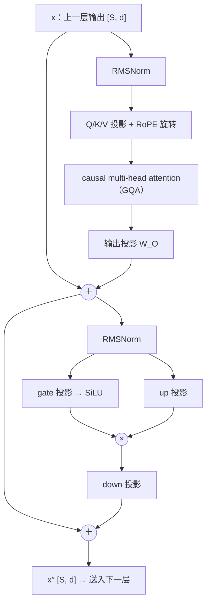
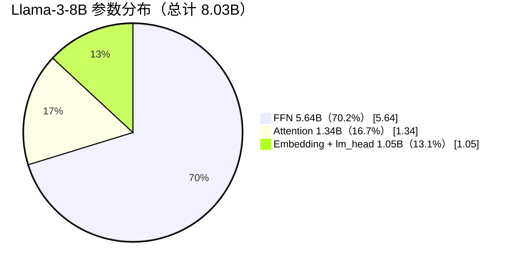

# L12 Transformer全解剖：从 config.json 手算 Llama-3-8B 的 80 亿参数

> [!abstract] 本课速览
> 读完你将能够：
> 1. 默画一层 decoder block 的完整数据流，说出 RMSNorm、残差、FFN 各自的作用；
> 2. 解释 SwiGLU、RoPE、pre-norm、weight tying 各自解决什么问题；
> 3. 拿到 Llama / Qwen2 一类现代 decoder-only 架构的 config.json，逐字段读懂，并据此手算模型参数量；
> 4. 独立复算 Llama-3-8B 的 8.03B 参数，说出 FFN / attention / embedding 各占多少。
>
> 前置：[[L11 注意力机制]] · 预计 45 分钟

## 论文里的这段话，你现在可能读不懂

> [!quote]
> We train a standard decoder-only Transformer with 32 layers and a hidden size of 4096. Each block uses pre-normalization with RMSNorm, grouped-query attention with rotary positional embeddings (RoPE), and a SwiGLU feed-forward network with intermediate size 14336. We do not share weights between the embedding layer and the lm_head, for a total of 8.03B trainable parameters.
>
> （改写自典型表述，参照[《The Llama 3 Herd of Models》](https://arxiv.org/abs/2407.21783)（arXiv，2024）的结构描述风格）

这段话几乎不含数学，却把一整个模型的结构说完了：**decoder-only**、**RMSNorm**、**pre-norm**、**SwiGLU**、**RoPE**、**lm_head**、weight sharing……每个词都是本课要拆的零件。读完本课，你回头看这段话，应该能把它直接翻译成一张参数表。

## 一、一层里除了 attention 还有什么

[[L11 注意力机制]] 把 Transformer 的心脏——attention——拆到了每一次矩阵乘。但 attention 只做一件事：==按权重把别处的信息搬过来==。它没有任何「逐位置深加工」的能力，也没有稳定数值范围的机制。光把 32 层 attention 裸叠起来，训练会发散，效果也不行。

真实的一层 **Transformer block**（Transformer 块，也叫一层 layer）是一条标准流水线，数据流如下：



两个子层（attention、FFN）共用同一个模式：

$$
x \leftarrow x + \operatorname{Sublayer}\big(\operatorname{Norm}(x)\big)
$$

注意 Norm 在子层**之前**，残差相加用的是 Norm 之前的 $x$。这个顺序叫 **pre-norm**（前置归一化）；最早的 Transformer 论文把 Norm 放在子层之后（post-norm）。==多数现代 decoder-only LLM 采用 pre-norm==（Llama、Qwen 等开源实现均如此）——残差主干保持「干净」，深层堆叠时梯度更稳。但「更稳」不等于「免调」：warmup 仍是标准训练配方（见 [[L06 优化器]]），pre-norm 替代不了它。

这条贯穿 32 层、被各子层反复「读取—加工—写回」的主干，有个专门的名字：**residual stream**（残差流）。residual connection 本身是 [[L08 CNN与RNN简史]] 里 ResNet 的老发明——梯度高速公路；在 Transformer 里它升级成了一种世界观：

> [!tip] 直觉
> residual stream 是一条传送带主干道。RMSNorm 是进厂前的安检，attention 和 FFN 是路边的两个加工厂：从主干道上取料，加工完把成品**加回**主干道。32 层就是 32 对加工厂，原料从头到尾没有被替换过，只是被不断累加精修。

## 二、RMSNorm：被删繁就简的归一化

先说「没有它会怎样」：32 层矩阵乘连下来，activation 的数值范围会随层数漂移，时大时小，训练极不稳定（梯度消失/爆炸的温床，见 [[L05 反向传播与梯度]]）。归一化的作用就是把每个 token 的 $d$ 维向量重新「校准」到稳定的尺度。

经典的 **LayerNorm**（层归一化）对一个 token 的 $d$ 维向量 $x$ 做四件事：减均值、除标准差、乘可学习增益 $\gamma$、加可学习偏置 $\beta$：

$$
\operatorname{LayerNorm}(x)=\frac{x-\mu}{\sqrt{\sigma^2+\epsilon}}\odot\gamma+\beta
$$

**RMSNorm**（均方根归一化）是它的精简版：==去掉均值中心化，只除以均方根==：

$$
\operatorname{RMSNorm}(x)=\frac{x}{\sqrt{\frac{1}{d}\sum_{i=1}^{d}x_i^2+\epsilon}}\odot\gamma
$$

少了「减均值」一步计算和一个 $\beta$ 参数，实测效果与 LayerNorm 基本打平——于是 RMSNorm 成了 Llama 系及现代 LLM 的标配。每层两个 RMSNorm，参数只有 $2d$ 个 $\gamma$：对 $d=4096$ 就是每层 8192 个参数。记住这个数，第七节算账时它是「零头」。

## 三、FFN：参数的大头藏在这里

attention 把信息搬运、混合完之后，每个 token 还需要一次「独立思考」。这就是 **FFN**（feed-forward network，前馈网络，也叫 MLP block）：==对序列中每个位置独立地、用同一组参数地做一个小型 MLP==——注意力管「交流」，FFN 管「消化」。

老式 FFN 是两个矩阵（升到 $d_{ff}$、过 ReLU/GELU、降回 $d$）。现代 LLM 标配 **SwiGLU**（Swish 门控线性单元），用**三个**矩阵：

$$
\operatorname{FFN}(x)=\big(\underbrace{\operatorname{SiLU}(xW_{gate})}_{\text{门控信号}}\odot\underbrace{(xW_{up})}_{\text{内容}}\big)\,W_{down}
$$

- **up projection**（升维投影）$W_{up}$：$d \to d_{ff}$，把表示拉到更宽的空间；
- **gate projection**（门控投影）$W_{gate}$：$d \to d_{ff}$，过 SiLU（$x\cdot\operatorname{sigmoid}(x)$，一种平滑开关）后与 up 的结果**逐元素相乘**——门控决定「哪些维度放行、放多少」；
- **down projection**（降维投影）$W_{down}$：$d_{ff} \to d$，压回原宽度，准备加回残差流。

FFN 的中间维度叫 **intermediate size**，记 $d_{ff}$。因为 SwiGLU 有三个矩阵而非两个，同样的参数预算下 $d_{ff}$ 要比老式 FFN 取得小一些；Llama 系惯例 $d_{ff}\approx 3.5d$——Llama-3-8B 里 $14336 = 3.5\times 4096$，正好。

为什么强调这个？因为==全模型约 2/3 的参数在 FFN 里==，不在 attention。对 Llama-3-8B 的每一层：FFN 三个矩阵共 $3\times4096\times14336\approx176$ M 参数，attention 全部投影约 42 M——FFN 是 attention 的 4 倍多。第七节的饼图会让你亲眼看到这个比例。

> [!warning] 常见误区
> 「Transformer 参数主要在 attention」——错。attention 决定计算的**形状**（$O(S^2)$，见 L11），FFN 决定参数的**体积**。读系统论文时，「省参数/FLOPs」的优化大多打在 FFN 身上（MoE 就是把 FFN 复制成多份，见 [[L17 MoE混合专家]]），「省显存/访存」的优化大多打在 attention 身上（KV cache 变体，见 [[L18 注意力变体与长上下文]]）。

## 四、RoPE：把「顺序」旋进向量里

还有一个隐蔽的问题：attention 本身没有位置坐标。若暂不考虑 causal mask，也不加入位置编码，把输入 token 按置换矩阵 $P$ 重排，score matrix 会从 $QK^T$ 变成 $P(QK^T)P^T$，输出也只会跟着同样重排——这叫 **permutation equivariance**（置换等变性）。换句话说，机制能匹配「谁和谁相关」，却辨认不出它们原本是第几个位置。decoder 中的 causal mask 只规定「当前位置不能看未来」，仍不能表达精确的相对距离。因此还必须显式注入位置信息，这类方法统称 **positional encoding**（位置编码）。

最早的方案是**绝对位置编码**：给每个位置学一个 $d$ 维向量，直接加到 embedding 上——相当于给每个 token 盖一个「我在第 3 位」的水印。现代 LLM 的标配是 **RoPE**（rotary positional embedding，旋转位置编码），思路完全不同：不加水印，改**旋转**。

把 Q/K 的 $d_{head}$ 维两两配对，每对看成一个二维小向量；位置 $p$ 的 token，它的第 $i$ 对小向量被旋转角度 $p\cdot\theta_i$（不同维度对转速不同）。妙处在于：两个位置 $p$、$k$ 的 Q、K 做点积时，结果只依赖**相对距离** $p-k$——「相对位置」是免费得到的。

> [!tip] 直觉
> 像钟表：绝对位置编码是报时「现在三点」，RoPE 是看两根指针的**夹角**——attention 关心的本来就是「这个词在我前面多远」，而不是「它绝对在第几位」。

数学细节本课不展开（够用即止）；你只需记住三点：① RoPE 作用在 Q/K 上、在算 score 之前；② 它**一个参数都不加**（纯几何操作）；③ config.json 里的 `rope_theta` 是旋转速度的基数，把窗口从 8K 拉到 128K 靠的就是调整它再做继续训练——这是 [[L18 注意力变体与长上下文]] 的故事。

## 五、输出端：从残差流回到词表

32 层 block 走完，最后还有两步：

1. **最终 RMSNorm**：出厂前最后一次校准；
2. **lm_head**：一个 $d\times V$ 的线性投影，把每个位置的 $d$ 维向量映射成词表上 $V$ 个 **logits**（未归一化分数，见 [[L04 神经网络与前向传播]]），再过 softmax 得到下一个 token 的概率分布。

注意 lm_head 的形状 $d\times V$ 与输入端 embedding matrix 的 $V\times d$ 恰好互为转置。有些模型干脆让两处**共享同一张参数表**，这叫 **weight tying**（权重绑定）：省 $V\times d$ 参数，还顺带把「输入语义」与「输出语义」绑在同一几何里。但 Llama-3-8B **不绑定**（config 里 `tie_word_embeddings=false`），词表这条边要付两份钱：输入 0.525B + 输出 0.525B ≈ 1.05B，占全模型 13%——[[L10 Token与嵌入]] 算过输入那一半，现在把另一半补上。

## 六、读懂 config.json：模型的体检表

多数关键结构超参数会写进模型仓库里的 **config.json**。模型仓库的 README.md 及其元数据才是 **model card**（模型卡），负责说明用途、训练与评测信息；它与 config.json 是两个文件。你在 HuggingFace 上点开模型页时，两者都应先读：config 给出尺寸，model card 交代口径与限制。读 config.json 是系统方向的基本功，但字段只给出线索；==参数量、显存和并行切分方式还要结合 `model_type`、`architectures` 及具体实现判断==。

下面是 Llama-3-8B 的 config.json（节选关键字段，与 [[03 约定与符号]] 参考模型表口径一致）：

```json
{
  "architectures": ["LlamaForCausalLM"],
  "hidden_size": 4096,
  "num_hidden_layers": 32,
  "num_attention_heads": 32,
  "num_key_value_heads": 8,
  "intermediate_size": 14336,
  "vocab_size": 128256,
  "max_position_embeddings": 8192,
  "rope_theta": 500000.0,
  "rms_norm_eps": 1e-05,
  "hidden_act": "silu",
  "tie_word_embeddings": false,
  "torch_dtype": "bfloat16"
}
```

逐字段翻译：

| 字段 | 值 | 含义 |
|------|-----|------|
| `hidden_size` | 4096 | **hidden size** $d$，残差流的宽度 |
| `num_hidden_layers` | 32 | 层数 $L$，即堆叠多少个 Transformer block（俗称 **num_layers**） |
| `num_attention_heads` | 32 | Q 的头数 $h$，$d_{head}=4096/32=128$ |
| `num_key_value_heads` | 8 | KV 头数 $h_{kv}$：每 4 个 Q 头共享 1 组 K/V（GQA，这里只需知道「KV 头更少」，细节见 [[L18 注意力变体与长上下文]]） |
| `intermediate_size` | 14336 | FFN 中间维度 $d_{ff}=3.5d$ |
| `vocab_size` | 128256 | 词表大小 $V$（[[L10 Token与嵌入]]） |
| `max_position_embeddings` | 8192 | 配置允许的位置索引上限，即名义上的 8K context window；不等于训练数据中实际见过的最长序列，后者需查 model card 或技术报告 |
| `rope_theta` | 500000 | RoPE 的旋转基数 |
| `rms_norm_eps` | 1e-05 | RMSNorm 公式里的 $\epsilon$ |
| `hidden_act` | silu | 激活函数为 SiLU；本例结合 `LlamaForCausalLM` 的 gate/up/down 实现构成 SwiGLU，不能只凭这个字段判断 FFN 是否带门控 |
| `tie_word_embeddings` | false | embedding 与 lm_head 不做 weight tying |
| `torch_dtype` | bfloat16 | 权重以 BF16 存储（2 B/参数，[[03 约定与符号]]） |

`LlamaForCausalLM` 这个类名本身也在说话：causal LM + decoder-only，就是 [[L11 注意力机制]] 里 causal mask 那套东西。

## 七、算一算：手算 Llama-3-8B 的 8.03B 参数

这是本课的灵魂环节。只用第六节的字段，不用任何外部资料，把 8B 这个营销数字算出来。

> [!example] 算一算：Llama-3-8B 参数全账
> 口径：符号取自 [[03 约定与符号]]（$V$、$d$、$L$、$h$、$h_{kv}$、$d_{ff}$），字段值取自上一节的 config.json。忽略 bias（Llama 的线性层不带 bias）。
>
> **输入 embedding**（[[L10 Token与嵌入]] 已算）：
>
> $$
> N_{emb}=V\times d=128256\times4096=525{,}336{,}576\approx0.525\text{B}
> $$
>
> **每层 attention**（GQA：$W_K$、$W_V$ 的输出宽度只有 $h_{kv}\times d_{head}=8\times128=1024$）：
>
> $$
> \begin{aligned}
> W_Q&:\ d\times d=4096^2=16{,}777{,}216\\
> W_K,\ W_V&:\ 2\times(4096\times1024)=8{,}388{,}608\\
> W_O&:\ d\times d=4096^2=16{,}777{,}216
> \end{aligned}
> $$
>
> 合计每层 $41{,}943{,}040\approx41.9$ M。
>
> **每层 FFN**（SwiGLU 三个矩阵）：
>
> $$
> N_{FFN}^{layer}=3\times d\times d_{ff}=3\times4096\times14336=176{,}160{,}768\approx176.2\text{ M}
> $$
>
> **每层 RMSNorm ×2**：$2\times4096=8192$ 个 $\gamma$——零头。
>
> **单层合计**：
>
> $$
> 41{,}943{,}040+176{,}160{,}768+8192=218{,}112{,}000\approx218.1\text{ M}
> $$
>
> **×32 层**：$218{,}112{,}000\times32=6{,}979{,}584{,}000\approx6.98\text{ B}$
>
> **收尾**：最终 RMSNorm $4096$ 个；lm_head 不与 embedding 共享，又是 $V\times d\approx0.525\text{ B}$。
>
> **总计**：
>
> $$
> \underbrace{525{,}336{,}576}_{emb}
> +\underbrace{6{,}979{,}584{,}000}_{32\text{ 层，已含层内 Norm}}
> +\underbrace{525{,}336{,}576}_{lm\_head}
> +\underbrace{4{,}096}_{\text{最终 RMSNorm}}
> =8{,}030{,}261{,}248\approx\boxed{8.03\text{ B}}
> $$
>
> 与官方标称的「8B」对上——==7B/8B/70B 都是四舍五入后的营销数，手算出的才是精确值==。

把总量按部件切开，画成饼图：



- FFN：$176.2\text{ M}\times32\approx5.64\text{ B}$，占 70.2%；
- attention：$41.9\text{ M}\times32\approx1.34\text{ B}$，占 16.7%；
- embedding + lm_head：$1.05\text{ B}$，占 13.1%；
- 全部 norm 加起来 $266{,}240$ 个参数，四舍五入后不可见。

这笔账立刻变成系统数字：按 [[03 约定与符号]] 的口径，BF16 权重 2 B/参数 → $8.03\times2\approx16.1$ GB，一张 H100（80 GB）放得下；但训练状态 ≈16 B/参数 → $8.03\times16\approx128$ GB，单卡放不下——==「参数藏在哪、有多少」直接决定了你要不要分布式==，这就是 M6 整个模块存在的理由。

> [!warning] 常见误区
> 1. 「参数大头在 attention」——在 FFN（约 2/3），饼图是证据；
> 2. 「8B 是精确值」——是营销四舍五入；不同实现是否带 bias、是否 tying，都会让零头不同；
> 3. 「层数越深越强」——同样的参数预算，加深（大 $L$）还是加宽（大 $d$）是权衡，怎么花算力由 Scaling Law 回答（[[L16 Scaling Law与算力账]]）。

## 八、模型家族与前方预告

本课解剖的 Llama 属于 **decoder-only**（仅解码器）家族：只堆带 causal mask 的 block，从左到右生成。Transformer 还有另外两大家族：**encoder-only**（如 BERT，bidirectional，擅长理解不擅长生成，见 [[L08 CNN与RNN简史]]）和 **encoder-decoder**（如 T5，输入走 encoder、输出走 decoder，中间用 cross-attention 连接）。2023 年以后的开源与闭源主流 LLM 几乎全是 decoder-only——原因一句话：next-token prediction 目标简单、好 scale。

Llama-3-8B 还是一个 **dense model**（稠密模型）：每个 token 进来，全部 8.03B 参数都要参与计算。它的对立面是稀疏激活的 MoE——DeepSeek-V3 总参数 671B 但每个 token 只激活 37B——结构、代价与网络风暴，留到 [[L17 MoE混合专家]]。

## 回到开头那段话

现在逐句回读：

1. **“We train a standard decoder-only Transformer with 32 layers and a hidden size of 4096.”** decoder-only = 只堆带 causal mask 的 block（第八节）；32 层 = `num_hidden_layers`，4096 = `hidden_size`，残差流的宽度（第一、六节）。
2. **“Each block uses pre-normalization with RMSNorm, grouped-query attention with rotary positional embeddings (RoPE), and a SwiGLU feed-forward network with intermediate size 14336.”** pre-norm = Norm 在子层前（第一节）；RMSNorm = 去掉均值中心化的 LayerNorm（第二节）；RoPE = 把相对位置旋进 Q/K（第四节）；SwiGLU FFN = gate/up/down 三个矩阵，$d_{ff}=14336=3.5d$（第三节）。
3. **“We do not share weights between the embedding layer and the lm_head, for a total of 8.03B trainable parameters.”** 不做 weight tying，所以词表付两份钱（第五节）；8.03B 不是宣传数字，是你在第七节亲手算出来的。

以后在论文里看到 Llama / Qwen2 一类结构表或 config，你都能重复同样的动作：先用 `model_type` 确认架构，再读字段 → 推形状 → 算参数 → 换显存。遇到其他架构，也沿用这套审计方法，但矩阵数量、bias、位置 embedding 和权重共享方式必须按实现调整。

## 术语卡片

| 术语 | 中文 | 一句话解释 |
|------|------|-----------|
| Transformer block | Transformer 块/层 | Norm → attention → 残差 → Norm → FFN → 残差 的完整堆叠单元。 |
| decoder-only | 仅解码器架构 | 只堆叠带 causal mask 的 block、从左到右生成的架构，现代 LLM 主流。 |
| FFN | 前馈网络 | block 中对每个位置独立作用的小型 MLP，参数量约占全模型 2/3。 |
| up projection | 升维投影 | FFN 中 $d\to d_{ff}$ 的输入矩阵。 |
| gate projection | 门控投影 | SwiGLU 中过 SiLU 后充当门控的投影矩阵。 |
| down projection | 降维投影 | FFN 中 $d_{ff}\to d$ 的输出矩阵。 |
| SwiGLU | Swish 门控线性单元 | $\operatorname{SiLU}(xW_{gate})\odot(xW_{up})$ 再过 $W_{down}$ 的 FFN 变体，Llama 系标配。 |
| LayerNorm | 层归一化 | 减均值、除标准差、再缩放平移的归一化。 |
| RMSNorm | 均方根归一化 | 去掉均值中心化、只按均方根缩放的轻量 LayerNorm，现代 LLM 标配。 |
| pre-norm | 前置归一化 | Norm 放在子层之前、残差主干保持干净的结构；与之相对是 post-norm。 |
| residual stream | 残差流 | 贯穿全部层、被各子层读取并累加写回的主干表示。 |
| positional encoding | 位置编码 | 向模型注入 token 顺序信息的方法统称。 |
| RoPE | 旋转位置编码 | 按位置旋转 Q/K 的维度对，使点积只依赖相对距离；不增加参数。 |
| lm_head | 输出词表投影 | 把最终 hidden state 映射为词表 logits 的 $d\times V$ 线性层。 |
| weight tying | 权重绑定 | 输入 embedding 与 lm_head 共享同一张参数表的做法。 |
| config.json | 模型配置文件 | 记录 hidden size、层数、头数、词表等结构超参数的 JSON 文件。 |
| hidden size | 隐层宽度 | 残差流/隐表示的维度 $d$（Llama-3-8B 为 4096）。 |
| intermediate size | FFN 中间维度 | FFN 内部扩展维度 $d_{ff}$（Llama-3-8B 为 14336 = 3.5$d$）。 |
| num_layers | 层数 | Transformer block 的堆叠数 $L$，config 中常写作 num_hidden_layers。 |
| model card | 模型卡 | 模型仓库的 README.md 及其元数据，记录用途、训练与评测信息；与 config.json 是两个文件。 |
| dense model | 稠密模型 | 每个 token 激活全部参数的模型；与 MoE 相对。 |

## 自测

1. 默画一层 pre-norm decoder block 的数据流，并指出残差相加时用的是哪个 $x$。
2. RMSNorm 相比 LayerNorm 省了什么？为什么「省一点」在 70B 模型上也值得做？
3. 为什么说 attention 本身不知道 token 的顺序？RoPE 用什么办法把相对位置送进去，它增加多少参数？
4. 写出 SwiGLU FFN 的三个矩阵名与各自的形状（用 $d$ 和 $d_{ff}$ 表示）。
5. Llama-3-8B 若改为 weight tying，参数量大约变化多少？占原参数的百分之几？
6. （计算题）Qwen2.5-7B 的 config.json 给出：hidden_size=3584、num_hidden_layers=28、num_attention_heads=28、num_key_value_heads=4、intermediate_size=18944、vocab_size=152064、tie_word_embeddings=false。忽略 bias 与 norm 零头，手算其参数量（字段值可到 HuggingFace 的 Qwen/Qwen2.5-7B 仓库自行核对）。
7. （开放题）为什么本课公式只可直接套用于 Llama / Qwen2 一类架构？遇到其他 dense LLM，应先从 config 和实现中核对哪些结构差异？找一个你关心的模型，验证它标称的参数量。

> [!note]- 参考答案
> 1. $x\to$ RMSNorm $\to$ attention $\to$ 与**未归一化的** $x$ 相加；再 RMSNorm $\to$ FFN $\to$ 再与上一次残差相加的结果相加。残差用的是 Norm 之前的输入，这就是 pre-norm 的定义。
> 2. 省了均值中心化这一步计算和 $\beta$ 参数；单看每层省得极少（$d$ 量级），但归一化在每个 token、每层、每次前向反向都要跑，乘上万亿 token 就是实打实的 kernel 时间；且实测效果不降，何乐而不为。
> 3. 不带位置编码、暂不考虑 causal mask 时，重排输入会让 score matrix 的行列和 attention 输出同步重排，这叫置换等变；机制本身没有位置坐标。causal mask 只限制能否看未来，不能给出精确相对距离。RoPE 把 Q/K 的维度对按位置旋转不同角度，使点积显式依赖相对距离；纯几何操作，增加 0 个可训练参数。
> 4. $W_{gate}\in\mathbb{R}^{d\times d_{ff}}$、$W_{up}\in\mathbb{R}^{d\times d_{ff}}$、$W_{down}\in\mathbb{R}^{d_{ff}\times d}$。
> 5. 省掉一份 $V\times d=128256\times4096\approx0.525$ B，参数从 8.03B 降到约 7.50B，减少约 6.5%。
> 6. $d_{head}=3584/28=128$，KV 宽 $=4\times128=512$。每层 attention $=2\times3584^2+2\times3584\times512=29{,}360{,}128$；每层 FFN $=3\times3584\times18944=203{,}685{,}888$；单层 $\approx233.0$ M，×28 层 $\approx6.525$ B。embedding 与 lm_head 不共享：$2\times152064\times3584\approx1.090$ B。合计 $\approx7.62$ B，与官方标称口径一致。
> 7. 本课公式假设 GQA/MHA 投影、SwiGLU 三矩阵 FFN、RMSNorm 和 Llama 式输出端，因此可直接用于 Llama / Qwen2 一类架构。其他 dense LLM 可能使用两矩阵 FFN、learned position embedding、额外 bias、不同 Norm 数量或共享权重；应先根据 `model_type`、`architectures` 和实现列出实际矩阵，再代入 config 字段。方法可以迁移，公式不能不加检查地照搬。

## 延伸阅读

- [《The Llama 3 Herd of Models》](https://arxiv.org/abs/2407.21783)（arXiv，2024）第 3 节：官方结构表与训练设置，对照本课第六节的 config.json 逐字段读，确认每个数字你都认识。
- HuggingFace 上与本课结构相同的模型 config.json（如 Qwen/Qwen2.5-7B）：先确认 `model_type` 与 FFN 实现，再用本课公式手算参数量并与 model card 标称值对比。

---
上一课：[[L11 注意力机制]] ← · → 下一课：[[L13 自回归生成与KV缓存]]
