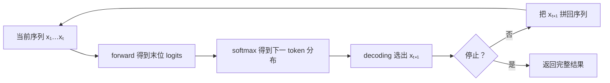
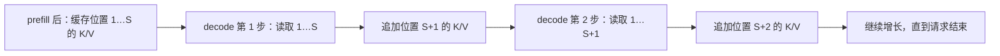
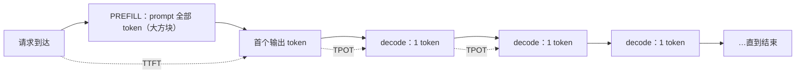

# L13 自回归生成与KV缓存：从一个 token 到推理系统瓶颈

> [!abstract] 本课速览
> 读完你将能够：
> 1. 把「下一个 token 的概率分布」展开成完整的自回归生成循环，并解释常见采样策略为什么会改变答案；
> 2. 从 causal mask 推出历史 K/V 不变，说明 KV cache 缓存什么、为什么不缓存历史 Q；
> 3. 对比 prefill 与 decode 的计算形状、硬件瓶颈和 TTFT/TPOT 指标；
> 4. 独立复算 Llama-3-70B 在不同 attention 结构、序列长度与 batch 下的 KV cache 容量。
>
> 前置：[[L12 Transformer全解剖]] · 预计 45 分钟

## 论文里的这段话，你现在可能读不懂

> [!quote]
> Autoregressive serving begins with a compute-intensive prefill that builds the KV cache for the prompt, followed by a memory-bound decode phase that emits one token at a time. Each decode step performs next-token prediction, applies a sampling policy such as temperature or top-p sampling, and appends the selected token to the sequence. TTFT captures the work before the first token, whereas TPOT characterizes subsequent streaming generation; the request stops at EOS or the max-new-token limit.
>
> （改写自推理系统论文的典型表述）

这段话把「模型怎样写下一字」和「服务为什么会卡」揉在了一起：**autoregressive**、**prefill**、**decode phase**、**KV cache**、**sampling**、**TTFT**、**TPOT**……读完本课，我们会逐句把它翻回计算过程。

## 一、模型不是一次写完，而是循环预测下一个 token

[[L12 Transformer全解剖]] 已经把 decoder-only Transformer 拆成了一层层 block，但一次用于生成的 forward 到底拿什么作为结果？模型会输出各位置的词表 logits；decoding 只取最后一个位置，经 softmax 变成「下一个 token 是谁」的概率分布，而不是一次得到整段文字。这项训练与推理共同使用的任务叫 **next-token prediction**（下一 token 预测）：

$$
p(x_{t+1}\mid x_{1:t})
$$

模型把整段序列的联合概率拆成从左到右的条件概率乘积：

$$
p(x_{1:T})=\prod_{t=1}^{T}p(x_t\mid x_{<t})
$$

这种「只根据已经出现的 token 预测下一个 token」的方式叫 **autoregressive**（自回归）。这里的 auto 不是「自动」，而是「用序列自己先前的输出继续预测自己」。若 prompt 是「网络拥塞会导致」，模型先给第一个新 token 的分布；选出一个 token 拼到句尾，再用变长后的序列预测下一个，如此循环。

从概率分布里选出 token、拼回输入并反复执行的整个推理过程叫 **decoding**（解码）。它不是 [[L08 CNN与RNN简史]] 里的「decoder 模块」本身，而是把模型分布变成输出序列的过程。

停止通常有两条硬条件：

- 模型选出了 **EOS**（end-of-sequence，序列结束 token），相当于自己写下句号并交卷；
- 已生成数量达到调用方设置的 **max new tokens**（最大新生成 token 数），相当于监考老师到点收卷。它限制的是新生成 token，不包含 prompt。

服务还可以采用 **streaming**（流式返回）：每生成一小段可显示文本就立即发给用户，而不是等整段生成完再一次返回。streaming 没有减少模型要做的 forward 次数，但让用户更早看见首个输出，后续也能看到文字持续出现。

> [!tip] 直觉
> 自回归生成像接龙：每轮只写一个词，再把整句话交回模型。它的优点是生成长度不必预先固定；代价是第 $t+1$ 个 token 必须等第 $t$ 个 token 选定，时间维度上无法把所有输出 token 一次并行算完。

## 二、采样：同一分布可以走出不同答案

softmax 给的是概率分布，不是唯一答案。**sampling**（采样）是按某种规则从分布中选 token。规则不同，即使模型参数和 prompt 完全相同，也可能走向不同的后续序列。

### 2.1 从确定到随机的四种常见策略

| 策略 | 怎么选 | 主要效果 | 要小心什么 |
|------|--------|----------|------------|
| **greedy decoding**（贪心解码） | 每步取概率最大的 token | 简单、确定、无需随机采样 | 每一步的局部最优不保证整段最好，容易走进单调路径 |
| **temperature**（温度） | 用 $T$ 缩放 logits 后重新 softmax | $T<1$ 更集中，$T>1$ 更平坦 | 它改变分布形状，不负责删除低概率候选 |
| **top-k sampling**（top-k 采样） | 只保留概率最高的 $k$ 个 token，再归一化采样 | 候选数量固定 | 分布很尖或很平时，固定 $k$ 未必合适 |
| **top-p (nucleus) sampling**（top-p（核）采样） | 按概率降序取累计概率首次达到 $p$ 的最小集合，再归一化采样 | 候选数量随当前分布自适应变化 | $p$ 不是「保留前 $p$ 个」，也不是单个 token 的最低概率 |

temperature 的公式最能说明它在做什么。设原始 logits 为 $z_i$：

$$
p_i(T)=\frac{\exp(z_i/T)}{\sum_j\exp(z_j/T)}
$$

- $T=1$：分布不变；
- $0<T<1$：logit 差距被放大，强者更强，答案更保守；
- $T>1$：logit 差距被压平，弱候选也更可能被抽到，答案更多样；
- $T\to0^+$：分布趋近于只选最大 logit，可把它理解为接近 greedy，但实现通常直接走 argmax，避免除以极小数。

top-k 和 top-p 常接在 temperature 后面：先改分布形状，再裁掉尾部，最后在剩余候选中重新归一化并采样。假设某一步排序后的概率为 $[0.50,0.25,0.15,0.06,0.04]$：top-2 固定保留前两个；top-p 若 $p=0.9$，则要保留前三个，因为累计概率到第三个才达到 $0.90$。下一步若分布变成 $[0.92,0.03,\ldots]$，同样的 top-p 只需保留第一个——这就是「核」大小会自适应。

**beam search**（束搜索）会同时保留若干条累计得分较高的候选序列。它在机器翻译等目标较受约束的任务中很常见；开放式 LLM 对话更常用 sampling，因为 beam search 需要同时维护多条路径，计算与 KV cache 都随 beam 数增加，而且输出往往偏保守。

所以，「为什么同一问题问两次，回答不完全一样？」最直接的答案是：temperature/top-p 后执行了随机 sampling，第一个不同 token 又会改变此后每一步的条件分布，差异像岔路一样逐步放大。固定随机种子和完全相同的执行设置有助于复现，但不要把 sampling 的随机性误当成模型又训练了一次——推理时权重没有更新。

### 2.2 perplexity：衡量分布，不是选择策略

**perplexity**（困惑度，PPL）是语言模型的传统质量度量。若评测序列共有 $T$ 个 token，平均负对数似然为：

$$
\operatorname{NLL}=-\frac{1}{T}\sum_{t=1}^{T}\log p(x_t\mid x_{<t})
$$

则：

$$
\operatorname{PPL}=\exp(\operatorname{NLL})
$$

例如平均 NLL 恰为 $\ln 10$，PPL 就是 10，可以粗略理解为模型每一步像在约 10 个同等可能的候选间犹豫。PPL 越低，表示模型给评测文本中的真实下一个 token 分配的概率越高；但只有在相同数据、tokenizer 和计算口径下比较才有意义。它不直接衡量回答是否有用，也不是 greedy、top-p 这类 decoding 策略。

## 三、从 causal mask 推出 KV cache

现在来看最大的浪费。假设 prompt 已有 $S$ 个 token，刚生成 1 个新 token。最朴素的实现会把 $S+1$ 个 token 全部再送进模型：每层重新投影所有 Q/K/V，也重新计算历史位置之间早已算过的 attention。下一步长度变成 $S+2$，又从头来一遍。

对长度为 $t$ 的完整序列，单层 attention score 是 $t\times t$ 矩阵，因此这部分每个生成步骤要做 $O(t^2)$ 工作。问题不只是「下一个 token 必须串行」，而是每轮还反复抄写历史作业。

但 causal mask 带来一个关键不变量。以历史位置 $j\le t$ 为例：

1. 位置 $j$ 在任一层只能看见 $1\ldots j$，看不见后来追加的 $t+1$；
2. 因此追加新 token 后，旧位置 $j$ 的层内输入和输出都不变；
3. 旧位置在每一层投影得到的 Key 和 Value 也不变。

既然不变，就不必重算。把每一层、每个历史位置的 K 和 V 保存下来，这块运行时状态就是 **KV cache**（KV 缓存）。下一步只让新 token 通过整套 Transformer：它产生新的 Q/K/V，用新 Q 查询「历史缓存 + 当前 K」，得到输出后，再把当前 K/V 追加到缓存。

为什么缓存 K/V，却不缓存历史 Q？Q 表示某个位置「现在要找什么」。历史位置的 attention 输出早已算完，不会再发起查询；未来每个新位置需要匹配的对象，恰好是所有历史 K，并聚合对应的 V。因此历史 K/V 会被反复读取，历史 Q 没有复用价值。

用了 KV cache 后，第 $t$ 步不再生成 $t$ 个 query，只生成 1 个新 query 与 $t$ 个 K 做 attention，attention 工作从每步 $O(t^2)$ 降为 $O(t)$；旧 token 的投影和 FFN 也不再重算。缓存并没有消除「新 token 必须逐个生成」的顺序依赖，而是消除了顺序循环里的重复计算。

> [!warning] 常见误区：KV cache 只是可选优化
> 在教学用的短序列上，关闭 cache 也能得到同样的 token；但生产 LLM 若每步都全量重算历史，attention 每步承担 $O(t^2)$ 工作，生成越长浪费越严重。KV cache 几乎是实用自回归推理的必需品，真正的选择是「怎样存、放哪里、何时淘汰」，而不是「要不要缓存」。

## 四、同一次请求，其实是两种完全不同的计算

有了 cache，自回归请求自然分成两段：

1. **prefill**（预填充阶段）：一次并行处理 prompt 的全部 $S$ 个 token，算出首个新 token 所需 logits，同时写入这 $S$ 个位置在所有层的 KV cache；
2. **decode phase**（解码阶段）：每轮只处理 1 个新 token，读取历史 KV cache 和模型权重，再追加一格缓存，直到停止。

| 对比维度 | prefill | decode phase |
|----------|---------|--------------|
| 单次 forward 新处理的 token | prompt 的 $S$ 个 token | 每个活跃序列 1 个 token |
| 典型主张量形状 | $[B,S,d]$ | $[B,1,d]$ |
| 并行性 | 同一 prompt 内的 token 可并行处理 | 同一序列的下一步必须等上一步选完 |
| 主要矩阵乘形态 | 较大的 GEMM | 大量「瘦」矩阵乘/矩阵向量乘 |
| KV cache 动作 | 批量创建 prompt 的 K/V | 每步全量读取历史 K/V，再追加一格 |
| 典型硬件瓶颈 | **compute-bound**（算力受限） | **memory-bound**（访存/带宽受限） |
| 用户侧指标 | **TTFT** | **TPOT** |

这里的 compute-bound 与 memory-bound 是典型工作区间，不是无条件定律：batch、序列长度、量化方式、并行策略和硬件都会改变瓶颈。关键直觉是：prefill 有足够多 token 把矩阵乘「铺大」，GPU 更容易吃满计算单元；decode 每步算得少，却要把模型权重和不断增长的 KV cache 搬到计算单元，常常等数据比等乘法更久。[[L23 Roofline模型]] 和 [[L55 推理性能模型]] 会把这句话定量化。

两项时延指标分别看两段：

- **TTFT**（time to first token，首 token 时延）：从请求到达服务到用户收到首个输出 token 的时间，包含排队、调度、prefill 以及首 token 返回等路径；
- **TPOT**（time per output token，每输出 token 时间）：首 token 之后生成后续 token 的平均节奏，常近似理解为相邻输出 token 的平均间隔。

若输出共 $N_{out}$ 个 token，可用下面的近似式建立直觉：

$$
T_{request}\approx \operatorname{TTFT}+(N_{out}-1)\times\operatorname{TPOT}
$$

streaming 让用户在 TTFT 结束时就看到首 token，之后按 TPOT 的节奏接收内容；它改善的是交互方式，不会凭空缩短 prefill 或 decode 的实际计算。

> [!warning] 常见误区：decode 慢是因为「算得多」
> 恰恰相反：单个 decode 步骤只处理一个新 token，算术工作不够大，反而难以摊薄读取权重与 KV cache 的代价。==它常常是算得少、搬得多==。把 FLOPs 数得很少就断言「一定很快」，正是推理论文里最常见的初学者误判。

## 五、算一算：Llama-3-70B 的 KV cache 有多大

先从张量形状推公式，而不是背答案。对一个请求、一个 token、某一层：

- K 有 $h_{kv}$ 个头，每头 $d_{head}$ 个元素；
- V 的形状相同，所以乘 2；
- 每个元素占 `bytes` 字节。

再乘层数 $L$、序列长度 $S$ 和 batch，就得到 [[03 约定与符号]] 的统一公式：

$$
\boxed{\operatorname{KV\ bytes}=2\times L\times S\times h_{kv}\times d_{head}\times \mathrm{bytes}\times \mathrm{batch}}
$$

这里的 $S$ 是当前已占用缓存的总 token 数：prompt 与已经生成的 token 都算。它不会随参数量 $N$ 直接增长，而由层数、KV 头数、单头维度、序列长度、精度与并发共同决定。

> [!example] 算一算：GQA、MHA 与 batch 的三连账
> 数据全部取自 [[03 约定与符号]]：Llama-3-70B 有 $L=80$、$d=8192$、$h/h_{kv}=64/8$；因此 $d_{head}=d/h=8192/64=128$。BF16 每元素 2 B，序列长度 $S=8192$，先取 batch=1。容量按 SI 的 GB（$1\text{ GB}=10^9\text{ B}$）估算。
>
> **① GQA（8 个 KV 头）**
>
> $$
> \begin{aligned}
> C_{GQA}
> &=2\times80\times8192\times8\times128\times2\text{ B}\\
> &=2{,}684{,}354{,}560\text{ B}\\
> &\approx\boxed{2.7\text{ GB/请求}}
> \end{aligned}
> $$
>
> **② 假如改成 MHA（64 个 KV 头）**
>
> $$
> \begin{aligned}
> C_{MHA}
> &=2\times80\times8192\times64\times128\times2\text{ B}\\
> &=21{,}474{,}836{,}480\text{ B}\\
> &\approx\boxed{21.5\text{ GB/请求}}
> \end{aligned}
> $$
>
> 其他项完全相同，只有 $h_{kv}$ 从 64 减到 8，因此 GQA 把 KV cache 恰好缩小 $64/8=\boxed{8\times}$。这也是 [[L18 注意力变体与长上下文]] 要继续追的主线。
>
> **③ GQA 下 batch=32**
>
> $$
> C_{B=32}=2{,}684{,}354{,}560\times32
> =85{,}899{,}345{,}920\text{ B}
> \approx\boxed{85.9\text{ GB}}
> $$
>
> 只看 32 个请求的 KV cache 总量，就已经超过一张 H100 的 80 GB 显存；而且它随 batch 与 $S$ 都是线性增长。注意这是容量量级对照，不是说 70B-BF16 能单卡部署：仅权重就约 $70\text{B}\times2\text{ B}=140\text{ GB}$，同样需要多卡切分。实际每卡承担多少权重和 KV cache 取决于 TP 等并行策略；但无论怎样切，总容量账不会消失。

这笔账揭示了两种不同的「KV cache 是瓶颈」：容量上，它决定同一实例能容纳多少活跃序列；带宽上，decode 每步又要反复读取已缓存的历史。prompt 变长、输出变长、并发变高，都会同时挤压这两头。

## 六、从一个缓存，走进整个推理系统

到这里，M8 推理模块的大半问题已经露出轮廓：

- KV cache 随请求到达而分配、随序列逐 token 增长、随请求结束而释放。若直接为每个请求预留最大连续空间，会产生严重浪费；[[L56 KV缓存与PagedAttention]] 会讲怎样像操作系统分页一样管理它。
- 减少 $h_{kv}$ 或压缩 K/V，能直接换取更长上下文或更高并发。GQA、MLA 等结构路径见 [[L18 注意力变体与长上下文]]。
- prefill 要算力，decode 要带宽，两者混在同一批次会相互干扰；多 GPU、多节点系统还要决定请求去哪、KV cache 放哪、何时迁移。[[L60 分布式推理与PD分离]] 会把它扩展为调度与网络问题。
- TTFT 与 TPOT 代表不同用户体验，优化一个可能伤害另一个。系统论文最终不能只报 tokens/s，还要在明确 SLO 下比较有效吞吐，见 [[L55 推理性能模型]]。

这正好落到本课程的研究主线：模型架构给出了 K/V 的形状，自回归依赖给出了执行顺序；系统研究者要解决的是，怎样用显存管理、批处理、调度、路由、并行与网络传输，让这些不可改变的工作负载更高效、更稳定地运行。

## 回到开头那段话

现在逐句回读：

1. **“Autoregressive serving begins with a compute-intensive prefill that builds the KV cache for the prompt, followed by a memory-bound decode phase that emits one token at a time.”** 自回归意味着输出 token 间有顺序依赖（第一节）；prefill 并行处理整个 prompt 并批量建立 KV cache，典型是大 GEMM、算力受限；decode 每步只处理一个新 token，却反复读取权重和历史 K/V，典型是访存受限（第三、四节）。
2. **“Each decode step performs next-token prediction, applies a sampling policy such as temperature or top-p sampling, and appends the selected token to the sequence.”** 模型给出 $p(x_{t+1}\mid x_{1:t})$，temperature 改变分布尖锐程度，top-p 动态裁出概率核，再采样一个 token 拼回输入，形成循环（第一、二节）。
3. **“TTFT captures the work before the first token, whereas TPOT characterizes subsequent streaming generation; the request stops at EOS or the max-new-token limit.”** TTFT 管首 token 之前的完整路径，TPOT 管首 token 之后的生成节奏；streaming 按这个节奏持续返回，直到模型生成 EOS 或调用方的 max new tokens 用尽（第一、四节）。

开头那段话现在不再是一串黑话，而是一张执行图：==先用大方块 prefill 建缓存，再用一串小方块 decode 读缓存；每个小方块选一个 token，缓存也随之长一格==。

## 术语卡片

| 术语 | 中文 | 一句话解释 |
|------|------|-----------|
| autoregressive | 自回归 | 用序列已有 token 预测下一个 token，再把输出拼回输入继续预测。 |
| next-token prediction | 下一 token 预测 | 估计条件分布 $p(x_{t+1}\mid x_{1:t})$ 的语言模型任务。 |
| decoding | 解码 | 把模型的 next-token 分布反复转成 token 序列的完整推理过程。 |
| sampling | 采样 | 按指定规则从 next-token 概率分布中选择 token。 |
| greedy decoding | 贪心解码 | 每一步都选择当前概率最大的 token。 |
| temperature | 温度 | 通过用 $T$ 缩放 logits 来调节概率分布的尖锐或平坦程度。 |
| top-k sampling | top-k 采样 | 只保留概率最高的 $k$ 个候选，重新归一化后采样。 |
| top-p (nucleus) sampling | top-p（核）采样 | 保留累计概率首次达到 $p$ 的最小候选集合，再归一化采样。 |
| EOS | 序列结束 token | end-of-sequence，模型可用它发出生成结束信号。 |
| max new tokens | 最大新生成 token 数 | 调用方允许模型在 prompt 之后最多生成的 token 数。 |
| KV cache | KV 缓存 | 按层保存历史 token 的 K/V，供后续 decode 复用，避免全量重算。 |
| prefill | 预填充阶段 | 并行处理完整 prompt、创建初始 KV cache 并产出首 token 所需 logits 的阶段。 |
| decode phase | 解码阶段 | 逐步处理新 token、读取并追加 KV cache 的阶段。 |
| TTFT | 首 token 时延 | 从请求到达到用户收到第一个输出 token 的时间。 |
| TPOT | 每输出 token 时间 | 首 token 之后生成一个输出 token 的平均用时。 |
| perplexity | 困惑度 | 平均负对数似然的指数，衡量模型对评测文本 next token 的不确定程度。 |
| streaming | 流式返回 | 不等待整段完成，随生成进度逐步把输出返回给用户。 |

## 自测

1. 用不超过四步写出 autoregressive decoding 循环；EOS 和 max new tokens 分别由谁决定？
2. temperature、top-k、top-p 分别改变分布的哪一部分？为什么 top-p 的候选数不是固定的？
3. 为什么追加一个新 token 后，历史 token 的 K/V 不会变化？为什么历史 Q 不值得缓存？
4. 不使用 KV cache 时，长度为 $t$ 的完整 attention 每个生成步骤为何是 $O(t^2)$？使用后为何降为 $O(t)$？它仍然没有消除什么依赖？
5. prefill 与 decode 的计算形状和典型瓶颈分别是什么？TTFT 与 TPOT 各自对应哪一段？
6. （计算题）仍用 Llama-3-70B、BF16、GQA、batch=1。若已占用缓存长度从 8192 token 增到 16384 token，KV cache 多大？若同时 batch=4 呢？
7. （研究题）某调度器让 TPOT 降低 20%，却因等待凑 batch 让 TTFT 增加一倍。能否直接断言用户体验更好？还需要哪些 workload 与 SLO 信息？

> [!note]- 参考答案
> 1. 当前序列 forward 得到 next-token 分布 → decoding 规则选 token → 拼回序列 → 若未停止则重复。EOS 是模型词表中的特殊 token，由模型在分布中选出；max new tokens 是调用方给生成过程设置的硬上限。
> 2. temperature 缩放 logits、改变整个分布的尖锐程度；top-k 固定保留概率最高的 $k$ 个；top-p 保留累计概率达到 $p$ 的最小集合。每一步分布形状不同，达到同一累计概率所需的 token 数自然不同。
> 3. causal mask 保证历史位置 $j$ 看不见后来追加的位置，所以它在各层的 hidden state 以及投影出的 K/V 不变。未来新 token 会反复用历史 K 做匹配、用历史 V 做聚合；历史 Q 对应的 attention 输出已经算完，不会再次查询。
> 4. 无 cache 时，每步为 $t$ 个 query 与 $t$ 个 key 构造 $t\times t$ score matrix，所以 attention 是 $O(t^2)$；有 cache 时只有 1 个新 query 查询 $t$ 个历史 key，是 $O(t)$，且旧 token 的其他层计算也不再重做。它仍未消除输出 token 之间「后一步等待前一步选定」的顺序依赖。
> 5. prefill 一次处理 $[B,S,d]$，以较大 GEMM 为主，典型 compute-bound，对应 TTFT；decode 每步处理 $[B,1,d]$，反复读取权重和 KV cache，典型 memory-bound，对应 TPOT。排队与调度等服务开销也会进入实际 TTFT/TPOT。
> 6. 公式对 $S$ 和 batch 都线性。$S$ 从 8192 翻倍到 16384，单请求从约 2.7 GB 变为约 $5.4$ GB（精确按本课 SI 口径为 $5.369$ GB）；batch=4 时再乘 4，约 $21.5$ GB。这里是 KV cache 总量，不含权重与其他运行时显存。
> 7. 不能。短输出、交互式请求可能更看重 TTFT，长输出可能更受 TPOT 支配；还需知道 prompt/output 长度分布、到达率、并发、用户可接受的 TTFT/TPOT 阈值、尾时延与 SLO 违约率，才能判断这项权衡是否值得。

## 延伸阅读

- [《Transformer Inference Arithmetic》](https://kipp.ly/p/transformer-inference-arithmetic)（kipply）：继续把本课的 KV cache、算力与显存带宽直觉写成推理计账，先读 memory bandwidth 与 arithmetic intensity 相关部分。
- [《Unlocking Longer Generation with Key-Value Cache Quantization》](https://huggingface.co/blog/kv-cache-quantization)（Hugging Face）：用图示回顾 KV cache 怎样增长，再看降低 K/V 精度如何用质量代价换取更长上下文；量化细节留到 [[L58 量化推理]]。

---
上一课：[[L12 Transformer全解剖]] ← · → 下一课：[[L14 预训练]]
