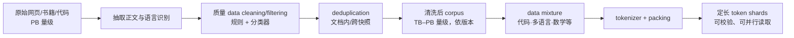
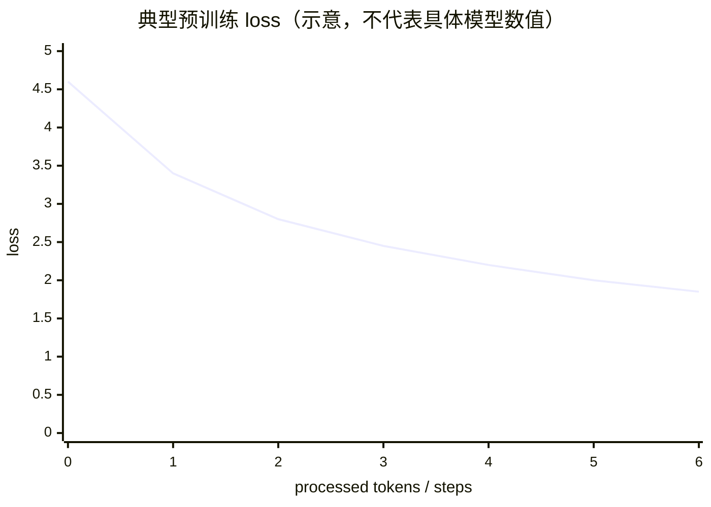
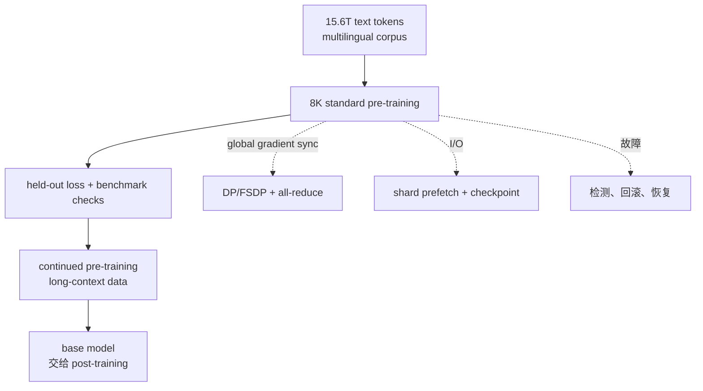

# L14 预训练：从语料到万亿 token 的训练现场

> [!abstract] 本课速览
> 读完你将能够：
> 1. 把网页、代码和书籍等原始数据追踪成清洗、去重、混配、分词后的训练 shards；
> 2. 看懂 pretraining 的 next-token loss 曲线，区分 held-out loss、benchmark 与 loss spike；
> 3. 用 token budget、有效 FLOPS 和卡数估算一次训练需要的存储、吞吐和天数；
> 4. 解释为什么预训练是一个计算、网络、数据供给和故障恢复共同参与的系统 workload。
>
> 前置：[[L13 自回归生成与KV缓存]] · [[L07 训练循环解剖]] · 预计 50 分钟

## 论文里的这段话，你现在可能读不懂

> [!quote]
> We pre-train a dense decoder-only Transformer on a multilingual **corpus** of 15T tokens. The data pipeline applies quality **filtering**, **deduplication**, and a carefully tuned **data mixture** before producing tokenized **shards**. During the **training run**, we monitor training and **held-out loss**, recover from any **loss spike**, and periodically report downstream **benchmarks** such as MMLU. The resulting **base model** is later adapted by post-training.
>
> （改写自大模型技术报告的典型表述；数字仅作语境示例）

这段话把「数据从哪里来」「模型学什么」「训练现场看什么」压缩成了几行。**pretraining**（预训练）、**corpus**（语料库）、**deduplication**（去重）、**loss spike**（损失尖峰）和 **benchmark**（基准评测）并不是互相独立的名词：数据管线决定模型看到什么，训练日志告诉我们是否在稳定学习，benchmark 才是把学习结果翻译成能力指标的接口。读完后再回来看，你应该能逐句说出每个词对应哪一个实际环节。

## 一、预训练学的不是答案，而是下一个 token 的分布

### 1.1 self-supervised：标签藏在文本的下一格

[[L13 自回归生成与KV缓存]] 已经介绍了 **next-token prediction**（下一 token 预测）：给定前缀 $x_{<t}$，模型估计

$$
p_\theta(x_t\mid x_{<t}) .
$$

预训练把这个任务扩大到互联网规模。对一串已经 tokenize 的文本，位置 $t$ 的输入是前面的 token，标签就是原文中紧接着的那个 token。标签不是人工逐条写的，而是从数据本身移位得到，所以叫 **self-supervised learning**（自监督学习）。这和「没有监督」不是一回事：它仍然有明确的目标，只是标注成本由文本结构承担。

最常见的目标是平均负对数似然（也就是 token 级 cross-entropy）：

$$
\mathcal{L}(\theta)=-\frac{1}{T}\sum_{t=1}^{T}\log p_\theta(x_t\mid x_{<t}).
$$

每一个 token 都像一次选择题。模型把正确选项的概率从 0.01 提到 0.1，loss 会下降；但这只表示它更会预测这类文本，不等于它已经会遵循指令或在开放问题上可靠作答。预训练结束得到的是 **base model**（基础模型）：擅长续写和建模语言分布，却还没有经过 [[L15 后训练与对齐]] 的聊天行为训练。

> [!tip] 直觉：把预训练想成读完一座没有答案册的图书馆
> 每个句子都同时提供「上下文」和「下一个词」这道自带答案的题。模型反复做题，先学会语言的统计结构，再在这些结构里吸收代码、事实和推理模式；但「读得懂」与「按用户要求回答」仍是两种不同的训练目标。

### 1.2 三个规模数字：参数、token budget 和 training run

- **token budget**（token 预算）是这次训练计划要消费的 token 总量，记作 $D$。15T 或 15.6T 表示 $1.5\times10^{13}$ 或 $1.56\times10^{13}$ 个 token，不是网页数量，也不是参数量。
- **training run**（训练运行）是从初始化或某个 checkpoint 开始，到目标 token 数、指标或故障终止的一次完整实验。报告里的“训了几天”必须先问：是否包含重启、评测、checkpoint 和 continued pretraining。
- 训练中一次参数更新可能由许多 GPU 上的 micro-batch 合成 global batch。每步完成反向传播后，全局同步 gradient，才能进入下一步；这正是 [[L07 训练循环解剖]] 的训练循环在集群上的放大版。

因此，预训练的主单位不是「跑了多少 epoch」。网页数据通常没有一个干净、固定的 epoch 边界，系统更常按已处理 token 数、step 和 tokens/s 记账。对系统研究者来说，$D$、global batch、序列长度和并行度共同定义 workload。

## 二、数据管线：从网页噪声到可复现的 token shards

没有数据管线，模型会把重复页面、导航栏、乱码、个人信息和恶意提示一起当成教材。数据质量不是训练前的化妆，而是在消耗昂贵 GPU 之前决定「每一个 token 值不值得读」。

### 2.1 来源与清洗：CommonCrawl 只是原料，不是训练集

**CommonCrawl** 是持续抓取公开网页的开放档案，常被用作 web-scale 预训练的原始来源。它包含有价值的文章，也包含重复镜像、模板页、广告、乱码和只对爬虫有意义的页面。**data cleaning/filtering**（数据清洗/过滤）通常包括：

1. 把 HTML、脚本和导航内容抽取为正文，修复编码并做语言识别；
2. 用长度、字符比例、重复行、语言和安全规则去掉明显坏样本；
3. 用质量分类器或小模型识别教育性、代码质量和文档结构；
4. 对个人信息、恶意内容和评测集近似副本设置更严格的策略。

清洗不是越狠越好。过滤过松会浪费 token budget，过滤过紧会丢掉少数语言、代码边界情况和长尾知识。工程上应把规则、版本和保留率写进 manifest，否则同一份“15T 数据”无法复现。

### 2.2 去重：减少记忆捷径，也减少无效 I/O

**deduplication**（去重）要识别同一页面的重抓、镜像站和模板化段落。exact dedup 可以直接比较规范化后的全文；fuzzy dedup 则用 n-gram、hash 或 MinHash 找近似文本。粒度可以是文档、段落、行或 token span：

- 文档级去重让样本分布更均匀；
- 段落级去重能处理“同一页只换了标题”的镜像；
- 训练集与验证/测试集之间也要去重，否则 benchmark 分数可能只是记住了答案。

去重比例没有一个适用于所有语料的常数。FineWeb 的公开处理报告展示过：不同快照和去重策略会留下完全不同的数据量，较旧快照在某些跨快照实验中甚至移除了 90% 以上的过滤后 token；这说明“删了多少”必须带上数据版本与算法口径，而不能写成普遍定律。

### 2.3 混配与课程：不是把所有 token 随机撒进一个桶

清洗后的子集要组成 **data mixture**（数据混配）：代码、多语言、数学、书籍、百科和网页等类别按目标用途分配曝光量。配比会影响模型的语言覆盖、代码能力和数学能力，也会改变 loss 的数值尺度；因此看训练曲线时要知道当前阶段喂的是什么数据。

很多训练会安排 **data curriculum**（数据课程）：前期用广泛、容易获得的语料建立通用表示，后期逐步提高高质量数据、代码或长文本的比例。收尾阶段的 **annealing**（退火）不是把温度真的加热，而是降低学习率、缩短数据范围或专门重复一小段高质量数据，让模型在大规模预训练后做一次温和的质量收束。它与随机重跑一遍全语料不同，具体配方应以技术报告为准。

最后把 token 按长度打包成可校验的 **shard**（数据分片）。每个 shard 通常包含 token IDs、边界/长度信息和版本 manifest，能被不同 data-loader worker 并行读取；训练进程不需要等待一台机器把整座数据集读完。shard 的大小和布局是系统接口：太小会带来元数据与打开文件开销，太大则不利于并行、重试和故障隔离。

> [!warning] 常见误区：数据越多，模型就一定越好
> 重复网页不会线性增加知识，反而会让模型学会模板和记忆捷径；清洗过度又会损失长尾覆盖。正确的问题是「在固定 token budget 和算力下，哪些 token 提供更高的有效学习信号」，而不是只比较原始网页的 TB 数。

## 三、训练日程与日志：读懂一条 loss 曲线

### 3.1 从快降到缓降：曲线的形状和坐标轴同样重要

典型的预训练 loss 曲线会经历：初始化后的快速下降、随后逐渐变缓的长尾阶段。把横轴换成已处理 token 数，常能看到近似幂律的改善；把横轴换成 step，则会受到 global batch、序列长度和数据混配的影响。报告截图里若只写 step，不写每步 token 数，跨实验比较就很危险。

训练集上的 loss 只回答“模型是否在适应它反复看到的文本”。因此会留出一份不参与更新的 **held-out loss**（留出集损失），也常称 **validation loss**（验证损失）。它用固定的、未参与参数更新的数据测量 next-token 预测，适合监控泛化趋势、比较 checkpoint 和发现数据管线回归。

图形只是心智模型：真实曲线会有 batch 噪声、评测间隔和数据阶段切换。学习率 schedule、warmup 与 cosine decay 的概念回收自 [[L06 优化器]]；预训练规模变大后，最重要的是同时记录 token 进度、学习率、gradient norm、吞吐、显存、通信等待和 checkpoint 版本。

### 3.2 loss spike：一次尖峰先当故障信号排查

**loss spike**（损失尖峰）是 loss 在短时间内突然上冲，可能随后自行恢复，也可能把权重推向 NaN 或完全错误的区域。常见排查顺序是：

1. 定位尖峰对应的 step、shard 和 batch，检查是否出现乱码、极端长样本或数据格式错误；
2. 检查 BF16/FP8 等数值路径、gradient norm、Inf/NaN、通信校验和及 GPU/链路错误；
3. 若有稳定 checkpoint，先回滚或从尖峰前重启，再考虑跳过问题 batch、降低 learning rate 或调整精度策略；
4. 在 held-out loss 和小型 benchmark 上确认恢复后的轨迹没有悄悄变坏。

“跳过数据”不是永远正确：如果尖峰来自真正有价值但罕见的样本，简单丢弃会改变 data mixture；如果来自硬件静默错误，继续读下一个 shard 只会掩盖问题。大规模训练要把数据、数值和硬件日志放在同一条可关联的时间线上，这也是 [[L49 混合精度与FP8训练]] 与 [[L53 大规模训练可靠性]] 的入口。

### 3.3 训练中评测：loss 与能力指标是两种仪表

**benchmark**（基准评测）是固定数据、提示格式、样本划分和评分规则的测量协议。它把“模型好像更聪明了”变成可复核的数字，但不同报告的 shot 数、CoT、工具权限和版本稍有不同，数字就不能直接横比。

- **MMLU**（Massive Multitask Language Understanding）：多学科选择题集合，用来观察通识与专业知识覆盖；读者先认名字和评测协议即可。
- **GSM8K**：小学数学文字题集合，常看答案是否算对；提示方式和是否允许 chain-of-thought 会影响结果。
- **HumanEval**：给定函数描述后生成代码，并用单元测试检查是否通过；它更接近“能否写出可执行程序”，不是单纯语言流畅度。

训练报告通常把 held-out loss、下游 benchmark 和人工检查一起呈现。loss 下降而 MMLU 不动，可能是数据混配、评测噪声或能力尚未迁移；benchmark 上升也不代表所有真实请求都更可靠。尤其要警惕 **contamination**（评测污染）：训练语料若含测试题、答案或高度相似的改写，模型可能是在记忆评测集。跑分是接口，不是产品质量的全部定义。

## 四、案例：把 Llama 3 405B 的报告读成一个 workload

官方《The Llama 3 Herd of Models》报告给出的核心口径是：旗舰模型为 405B dense Transformer，在 15.6T text tokens 上预训练，估计训练量约 $3.8\times10^{25}$ FLOPs；标准阶段使用 8K context，之后 continued pretraining 扩展到 128K。报告的并行配置表还列出 16,384 GPU、8K 序列、每 GPU 约 400 TFLOPs 的阶段，并同时报告约 41% BF16 MFU（见[报告原文](https://arxiv.org/abs/2407.21783)）。这几个数字应该被看成一个有明确口径的 workload，而不是新闻标题里的“用了很多卡”。

### 4.1 算一算：15T token 的 token-id 存储账

下面用课程统一口径复算，不把原始网页压缩包和 token IDs 混成一个数字。Llama-3 的词表按 [[03 约定与符号]] 取 $V=128256$，因为 $2^{16}=65536<128256\le 2^{17}=131072$，定长位打包至少需要 17 bit/token。

> [!example] 算一算：同一批 token 的三种存储口径
> 以约 $15\times10^{12}$ token 为例：
>
> 1. 位打包理论下限：
>    $$15\times10^{12}\times17/8\ \mathrm{B}\approx31.9\ \mathrm{TB}.$$
> 2. 常见 `uint32` token-id 存法：
>    $$15\times10^{12}\times4\ \mathrm{B}=60\ \mathrm{TB}.$$
> 3. 只有词表不超过 65536 时，2 B/token 才能无溢出地表达每个 ID；对 128256 词表，2 B/token 不是安全的定长表示。
>
> 所以“15T token 数据集约 32 TB”通常是在说理想位打包下限；“约 60 TB”是在说 32-bit ID 数组。原始 HTML、正文、质量标签、去重索引、manifest 和多个 shard 副本还会占用 PB 量级的上游存储。读到任何存储数字，先问它是在算压缩后的网页、token IDs，还是训练集副本。

### 4.2 算一算：从有效 TFLOPS 反推每天处理多少 token

这里沿用报告表 4 的 16,384 卡、约 400 TFLOPs/GPU 阶段数据。它是该训练配置的模型有效计算吞吐，不是 [[03 约定与符号]] 硬件表里的 H100 峰值 BF16 989 TFLOPS；报告同时给出了 41% MFU，二者不能混作一个分母。

> [!example] 算一算：训练吞吐与 wall-clock 数量级
> 采用课程统一的 dense 训练账：每个参数、每个 token 约 $6$ FLOPs。
>
> 1. 集群有效计算吞吐：
>    $$16384\times400\times10^{12}=6.5536\times10^{18}\ \mathrm{FLOPS}.$$
> 2. 405B 模型每 token 的训练工作量：
>    $$6\times405\times10^9=2.43\times10^{12}\ \mathrm{FLOPs/token}.$$
> 3. 理想 token 吞吐：
>    $$6.5536\times10^{18}/2.43\times10^{12}\approx2.7\times10^6\ \mathrm{tokens/s}.$$
> 4. 换算到一天：
>    $$2.7\times10^6\times86400\approx2.3\times10^{11}\ \mathrm{tokens/day}.$$
> 5. 对 15.6T token：
>    $$15.6\times10^{12}/2.3\times10^{11}\approx68\ \mathrm{天}.$$
>
> 这是理想的主计算估算。真实 wall-clock 还要扣掉通信、输入 I/O、评测、checkpoint、重启和长上下文阶段；公开材料把 Llama 3 405B 的主训练概括为约 54 天量级，差异正好提醒我们：报告中的“有效 TFLOPS”“主训练时长”和“完整项目日历”不是同一个指标。这里应报告假设和数量级，而不是倒推出一个虚假的精确天数。

这笔账把系统接口串起来了：GPU 需要持续拿到新 shard，DP/FSDP 每一步要同步 gradient，checkpoint 要在故障前后提供可恢复状态；任何一个环节让 GPU 空转，tokens/s 就会下降。训练的目标不是把某个 GEMM 跑到峰值，而是在全局 token budget 内稳定、可复现地推进 optimizer step。

## 五、与分布式训练/网络系统的连接

预训练是后续 M5–M7 的共同 workload：

- **同步通信**：data parallel rank 在每个 optimizer step 后交换 gradient。global batch 越大，单步计算越重，但同步消息与拓扑、带宽和拥塞仍会影响 step time；见 [[L36 集合通信原语]]、[[L41 数据并行与DDP]]。
- **数据供给**：shard 读取、解压、token packing 和 prefetch 必须跟上 GPU。存储带宽不足时，监控里会看到 data wait，而不是 MFU 真正变差。
- **故障与恢复**：一次 loss spike 可能来自数据、数值或硬件；checkpoint 间隔决定回滚损失多少 token，也决定恢复时需要多久重建 optimizer 状态。后续 [[L53 大规模训练可靠性]] 会把它变成可测的恢复时间和任务完成率。
- **评测与可复现**：固定 validation shard、tokenizer 版本、data mixture manifest 和 benchmark 协议，才能把“模型能力变化”与“数据或评测变化”分开。

这也是本课程的研究视角：我们不只问“模型最后考了多少分”，还要问在给定 token budget、故障率和网络拓扑下，系统能否持续交付有效 tokens/s，能否在异常发生时恢复并保持可比的训练轨迹。

## 回到开头那段话

现在逐句回读：

1. **“We pre-train a dense decoder-only Transformer on a multilingual corpus of 15T tokens.”** 这不是“把网页塞进 GPU”：corpus 先经过清洗、混配和 tokenize；15T 是 token budget，dense decoder-only Transformer 通过 next-token prediction 得到 base model。
2. **“The data pipeline applies quality filtering, deduplication, and a carefully tuned data mixture before producing tokenized shards.”** filtering 去掉明显坏数据，deduplication 减少重复与评测泄漏，data mixture 控制代码/多语言/数学等类别的曝光；最后以带 manifest 的 shard 供并行 data loader 读取。
3. **“During the training run, we monitor training and held-out loss, recover from any loss spike, and periodically report downstream benchmarks such as MMLU.”** training run 是一段可恢复的系统运行；held-out/validation loss 监控泛化趋势，loss spike 触发数据、数值和硬件排查，MMLU 等 benchmark 则从另一条轴检查能力。
4. **“The resulting base model is later adapted by post-training.”** 预训练给模型语言和世界知识的底座，但“会按指令工作”属于后训练；下一课 [[L15 后训练与对齐]] 会接上这条流水线。

所以开头的黑话可以还原成一张工程图：==先把可追溯的数据变成 shards，再用全局同步的训练循环消费 token budget；loss、benchmark 和故障日志共同告诉我们这次 training run 是否值得继续==。

## 术语卡片

| 术语 | 中文 | 一句话解释 |
|------|------|-----------|
| pretraining | 预训练 | 用大规模通用数据做 next-token prediction，学习基础语言能力的阶段。 |
| corpus | 语料库 | 供模型训练或评测的一批文本、代码及其元数据的集合。 |
| CommonCrawl | Common Crawl 网页档案 | 持续抓取公开网页的开放档案，常作为 web-scale 语料原料。 |
| data cleaning/filtering | 数据清洗/过滤 | 抽取正文、识别语言并按质量、安全和格式规则筛除样本。 |
| deduplication | 去重 | 识别并删除重复或高度相似的文档、段落或 token 片段。 |
| data mixture | 数据混配 | 按类别和阶段配置代码、多语言、数学等子集的训练曝光比例。 |
| data curriculum | 数据课程 | 随训练进度改变数据组成或难度的安排。 |
| annealing | 退火 | 预训练收尾阶段用更温和的学习率/高质量数据做质量收束。 |
| shard | 数据分片 | 可独立校验、读取和重试的一块 tokenized 训练数据。 |
| held-out loss | 留出集损失 | 在不参与参数更新的固定数据上测得的 loss，用于监控泛化趋势。 |
| validation loss | 验证损失 | 在 validation set 上测量的 loss，常用于比较 checkpoint 和配置。 |
| benchmark | 基准评测 | 固定数据、提示与评分协议的能力测量。 |
| MMLU | 大规模多任务语言理解 | 多学科选择题 benchmark，常用来观察知识覆盖。 |
| contamination | 评测污染 | 训练语料含有评测题、答案或近似副本，导致分数虚高。 |
| base model | 基础模型 | 完成预训练、主要会续写，尚未经过指令对齐的模型。 |
| training run | 训练运行 | 从初始化或 checkpoint 到目标进度/终止的一次完整训练实验。 |
| loss spike | 损失尖峰 | loss 曲线短时间异常上冲，需排查数据、数值和硬件原因。 |
| token budget | token 预算 | 计划在一次训练中消费的 token 总量，记作 $D$。 |

## 自测

1. 为什么 next-token prediction 可以称为 self-supervised learning？它和人工标注的 supervised learning 差在哪里？
2. 请按顺序写出从 CommonCrawl 原料到 token shard 的至少五个数据管线阶段，并说明 deduplication 解决什么问题。
3. data mixture、data curriculum 和 annealing 分别控制什么？为什么不能只看一个总 loss 就判断数据质量？
4. held-out/validation loss 与 MMLU、GSM8K、HumanEval 这类 benchmark 各自测量什么？为什么 benchmark 分数可能受到 contamination 影响？
5. loss spike 出现时，为什么不能只把 learning rate 调小？至少列出三项需要关联检查的证据。
6. 词表 $V=128256$、数据量 $15\times10^{12}$ token 时，17 bit/token 的位打包下限和 uint32 存法各需要多少 TB？
7. 采用 $N=405\times10^9$、16384 张卡、每卡有效 400 TFLOPs、训练账 $6N$ FLOPs/token，理想吞吐约多少 tokens/s？15.6T token 约需多少天？请说明为什么这不是完整 wall-clock。

> [!note]- 参考答案
> 1. 标签是从原文右移一格自动得到的下一个 token，数据自身提供监督信号；人工标注则由人显式提供 label。
> 2. 例如：网页抓取 → 正文抽取/语言识别 → data cleaning/filtering → deduplication → data mixture → tokenize/packing → shard。去重减少镜像、重复抓取和记忆捷径，也降低无效 I/O。
> 3. mixture 决定类别配比，curriculum 决定配比随阶段如何变化，annealing 是收尾时用较温和学习率/高质量数据做质量收束。总 loss 还会被数据分布、tokenizer 和阶段切换影响，必须结合分桶 loss 与 held-out loss。
> 4. held-out loss 测 next-token 泛化；MMLU/GSM8K/HumanEval 测知识、数学和可执行代码等下游行为。若训练集含测试题或近似改写，模型可以记忆而非泛化，分数会虚高。
> 5. 检查尖峰对应的 shard/batch 是否损坏或异常长；检查 Inf/NaN、gradient norm 和混合精度路径；检查 GPU、链路、通信校验与 checkpoint；确认恢复后 held-out loss 和小型 benchmark 没有退化。学习率只是可能的处置项之一。
> 6. 位打包：$15\times10^{12}\times17/8\approx31.9$ TB；uint32：$15\times10^{12}\times4=60$ TB。两者都不包含原始网页、索引和副本。
> 7. 集群有效 FLOPS 为 $16384\times400\times10^{12}=6.5536\times10^{18}$；每 token 为 $6\times405\times10^9=2.43\times10^{12}$ FLOPs，因此约 $2.7\times10^6$ tokens/s。每天约 $2.3\times10^{11}$ token，$15.6\times10^{12}/2.3\times10^{11}\approx68$ 天。真实时间还要扣除通信、I/O、评测、checkpoint、重启和阶段切换。

## 延伸阅读

- [《The Llama 3 Herd of Models》](https://arxiv.org/abs/2407.21783)：重点读第 2–3 节的数据、训练阶段、并行配置和 MFU 表，把“15.6T tokens”放回完整 workload。
- [FineWeb: decanting the web for the finest text data at scale](https://huggingface.co/spaces/HuggingFaceFW/blogpost-fineweb-v1)：看 CommonCrawl 的清洗、质量过滤和 MinHash 去重实验，理解为什么数据量必须带处理口径。
- [FineWeb 数据集卡](https://huggingface.co/datasets/HuggingFaceFW/fineweb)：对照公开数据集的版本、规模和复现元数据，练习检查一个 corpus 是否真的可用。

---
上一课：[[L13 自回归生成与KV缓存]] ← · → 下一课：[[L15 后训练与对齐]]
