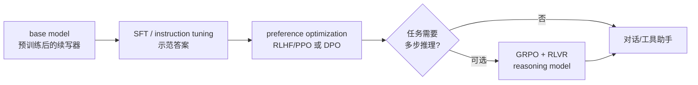
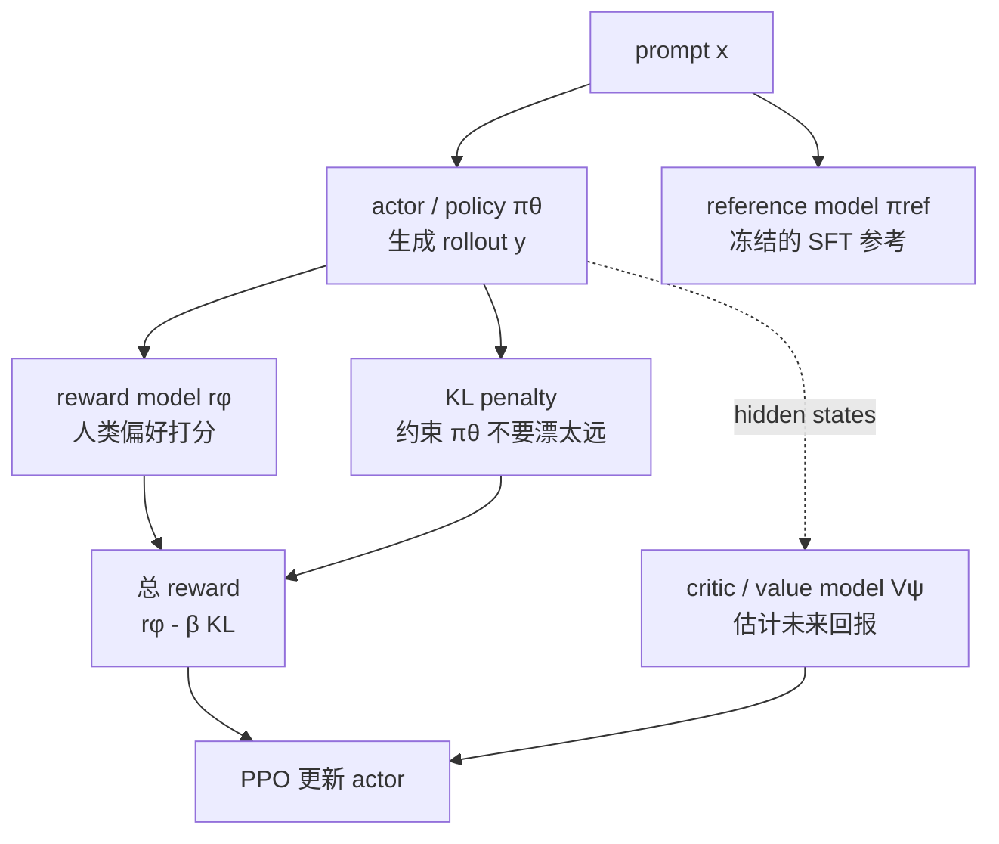
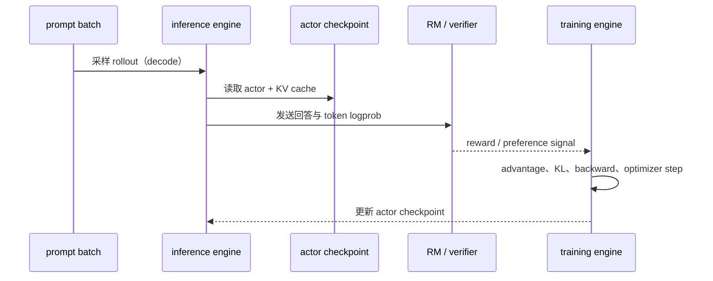

# L15 后训练与对齐：从 Base Model 到会做事的助手

> [!abstract] 本课速览
> 读完你将能够：
> 1. 画出从 base model 到助手的 SFT → 偏好优化 → reasoning RL 三段式流程；
> 2. 解释 RLHF 中 actor、critic、reward model、reference model 和 KL penalty 各自做什么，并知道 DPO/GRPO 省掉了哪一环；
> 3. 判断 reasoning model 为什么会用更多推理 token，以及这会怎样改变 serving 的吞吐和时延；
> 4. 用 Llama-3-8B 的参数口径算清 LoRA rank=16 的训练状态为什么能从百 GB 降到 GB 以下。
>
> 前置：[[L14 预训练]] · 预计 50 分钟

## 论文里的这段话，你现在可能读不懂

> [!quote]
> Starting from a pretrained **base model**, we conduct **SFT** on instruction-response demonstrations. We then collect **preference data** and train a **reward model** to provide feedback for **RLHF** with **PPO**, while a **reference model** and **KL penalty** keep the policy close to the supervised checkpoint. As an alternative, **DPO** directly optimizes preference pairs. For mathematical and coding tasks, **GRPO** with **RLVR** can encourage a **reasoning model** to produce longer **chain-of-thought (CoT)**, trading more **test-time compute** for accuracy.
>
> （改写自后训练论文的典型表述；术语密集段落用于练习，不是某篇论文的逐字引文）

这段话把四类不同的事情挤在了一起：让模型听懂指令、让它符合人的偏好、让它在可验证任务上多想几步，以及让这一切在有限显存和推理集群上跑得动。**post-training**（后训练）不是把预训练推倒重来，而是在已经学会语言分布的 **base model** 上，改变它“面对一个请求时如何行动”的策略。读完本课再回来看，你应该能指出每个模型、每个数据集和每个 token 在流水线里的位置。

## 一、为什么 base model 还不像助手

[[L14 预训练]] 中的 base model 通过 next-token prediction 学会了“给定前缀，什么文本最像训练语料的续写”。因此它可能续写小说、补全代码，却不一定会把“请列出三点”当成任务，也不一定拒绝危险请求或遵循系统消息。预训练主要塑造知识和语言能力，**alignment**（对齐）则把这些能力接到人类意图、偏好和安全边界上。

一个直观比喻是：base model 像读完巨大图书馆、很会接着写的人；助手还需要学会听清楚“问题是什么”、按格式交付、在不确定时承认不知道。后训练就是给这个“会续写的人”补上工作规程。它不能凭空创造全部知识：如果预训练没有学过某个领域，SFT 也只能在有限数据上补救；但它会显著改变输出的形状、语气和行为边界。



这里的箭头不是“越往后越聪明”的排行榜，而是目标函数在变：SFT 学“示范怎么答”，偏好优化学“多个可答方案里哪个更好”，reasoning RL 学“在有可验证反馈时，是否值得多花 token 搜索”。

## 二、第一段：SFT 把续写器变成指令跟随器

### 2.1 **instruction tuning** 的训练对象

**SFT**（supervised fine-tuning，监督微调），在 LLM 语境里常被称为 **instruction tuning**（指令微调）：拿高质量的「指令/输入 → 理想回答」示范，在 base model 上继续做语言模型训练。数据可以是人类撰写的问答、领域专家编写的解题步骤，也可以是强模型生成后经过筛选的示范；后者是 **distillation**（蒸馏）的一种常见形态——把教师模型的行为迁移给较小或较便宜的学生模型，而不是把“教师很强”当作无需检查的标签。

一条训练样本可能长这样：

```text
<system> 你是严谨的网络系统助教。
<user>    解释 all-reduce 的通信代价。
<assistant> 在 p 个 rank 上……
```

实际 token 序列要遵循模型的 **chat template**（见 [[L10 Token与嵌入]]）。常见做法是只对 assistant 回复部分计算 loss，把 system/user 文字当作条件；也有数据集对整段序列计算 loss。读论文时要看清 mask、模板和每条样本的 token 数，否则“训练了多少条指令”不能直接换算成有效监督量。

### 2.2 SFT 的收益和代价

SFT 通常能快速改善格式遵循、拒答风格和工具调用协议，但它有三个边界：

1. **示范不等于偏好**：一条答案可以是“合格”的，不代表它优于另一条更短、更安全或更有证据的答案；
2. **分布变窄**：示范数据常比互联网文本规整，过度训练可能让模型在开放域续写和长尾知识上退化；
3. **灾难性遗忘**：**catastrophic forgetting**（灾难性遗忘）指新任务训练让旧能力明显丢失。混入少量通用数据、控制学习率和训练轮数，或采用参数高效微调，都是缓解手段。

SFT 后的 checkpoint 仍可能答错事实。它首先解决“愿不愿意按这个格式做事”，不是“每件事都是真的”。这一区分对于后面的 reward 设计非常关键：如果奖励只看语气，模型就可能学会讨好而不是正确。

## 三、第二段：从人类偏好到 **RLHF**、**DPO**

### 3.1 **preference data** 与 **reward model**

**preference data**（偏好数据）通常固定一个 prompt，给出两个或多个候选回答，再由人类标注“哪个更好”、或者标注排序与理由。它比单条示范多了一层相对信息：同一个问题上，简洁正确的答案应排在冗长胡编之前。

**reward model**（奖励模型，RM）把这种偏好数据拟合成一个标量打分器 $r_\phi(x,y)$：给定 prompt $x$ 和回答 $y$，输出越大表示越符合标注者偏好。RM 不是事实裁判；它只学到标注协议覆盖的代理目标，可能被模型钻空子（reward hacking）。

### 3.2 **RLHF/PPO** 的四模型地图

**RLHF**（reinforcement learning from human feedback，人类反馈强化学习）把生成模型当作 **policy**（策略）：输入 prompt 后逐 token 生成回答，回答得到 RM 分数，再用强化学习更新策略。典型 PPO 版本同时出现四个角色：



- **actor** 是真正生成回答、被更新的 policy；一条 rollout 是它对 prompt 采样出的完整 token 序列。
- **critic**（价值模型）估计当前状态之后还能拿到多少回报，帮助 PPO 计算 advantage（“这一步比预期好多少”）。它不是另一个聊天机器人，而是训练时的辅助估计器。
- RM 给出偏好分；同时用 **reference model**（参考模型）保存 SFT checkpoint 的行为作为锚点。对 actor 与 reference 的 token-level 分布差异加 **KL penalty**（KL 惩罚），常写成 $r=r_{\text{RM}}-\beta\,D_{\mathrm{KL}}(\pi_\theta\Vert\pi_{\mathrm{ref}})$。$\beta$ 越大，越不鼓励策略远离原有能力；太小则可能出现模式漂移或 reward hacking。
- **PPO**（Proximal Policy Optimization，近端策略优化）通过限制一次更新不要过猛，利用 reward 和 critic 的估计更新 actor。此处记住“采样 → 打分 → 算 advantage → 受约束地更新”即可，反向传播、batch 组织和并行实现留到 [[L54 RL后训练系统]]。

RLHF 的系统代价很高：每轮更新前，actor 要跑推理生成 rollout，RM/critic 要再前向，随后训练引擎做 backward。也就是说，同一个作业里既有 decode 型推理，又有训练型大 GEMM 和梯度同步。

### 3.3 **DPO**：不显式训练 RM 的偏好优化

**DPO**（Direct Preference Optimization，直接偏好优化）直接使用「chosen（偏好回答）/rejected（非偏好回答）」对和一个冻结的 reference model，构造分类式目标，让当前 policy 提高 chosen 相对 rejected 的概率，同时保留 reference 作为锚点。它不需要单独部署 reward model，也不需要像 PPO 那样反复 rollout；训练流程更像离线 SFT，因此工程栈更简单、稳定性通常更好。

但“跳过 RM”不等于“没有奖励”：偏好目标隐式定义了一个 reward。DPO 的上限受 preference data 覆盖范围影响，无法自动探索标注数据之外的新解法；PPO 则能在 rollout 和奖励反馈之间迭代，但付出更多推理和调度成本。

| 方法 | 训练数据 | 显式 RM | 是否需要在线 rollout | 记忆点 |
|---|---|---:|---:|---|
| SFT | 单条示范 | 否 | 否 | 学会按指令格式答 |
| RLHF + PPO | 偏好数据 + rollout | 是 | 是 | reward 驱动 policy 更新 |
| DPO | chosen/rejected 对 | 否（隐式） | 否（离线） | 直接拉开偏好答案概率 |

> [!warning] 常见误区
> RLHF 的“人类反馈”通常先被压缩成标注数据和 reward model，不是每个 token 都由人实时打分；DPO 也不是“没有 reference model”，冻结参考策略仍是目标的一部分。

## 四、第三段：**GRPO**、**RLVR** 与 **reasoning model**

### 4.1 从“答得像”到“答案能验”

开放式回答很难给出稳定的自动奖励，但数学题可以检查最终数值，代码可以运行单元测试。这类 **RLVR**（reinforcement learning with verifiable rewards，可验证奖励）把“是否通过 verifier”变成奖励信号：答案正确得高分，格式合法但结果错误得低分。verifier 可以是精确算术、编译器、测试集或规则检查器，不必假装一个语言 RM 能判断所有事实。

**GRPO**（Group Relative Policy Optimization，组相对策略优化）是面向这类场景的一种 policy optimization：对同一个 prompt 采样一组回答，用组内奖励的相对高低估计哪些回答值得提高概率。它不依赖 PPO 那种独立的大 critic（具体实现仍有 reference/KL、裁剪和工程变体），因此在大模型 RL 中更容易把显存和采样预算集中到 rollout。读论文时要核对作者的 GRPO 版本，不要把名称当成完全相同的代码。

### 4.2 CoT 是行为，test-time compute 是资源

**chain-of-thought (CoT)**（思维链）是模型在最终答案前生成的中间推理步骤。**long CoT**（长思维链）把更多 token 用于分解问题、尝试候选路径、检查和修正。经过 RLVR 训练后，模型可能学会“遇到难题先多想一会儿”，这就是 **reasoning model**（推理模型）与普通 chat model 的主要行为差异之一。

这里的“推理”不是神秘的新模块：它仍是自回归 decode，只是输出更长、采样/搜索更多。**test-time compute**（测试时计算）指把额外算力放到请求处理阶段，例如生成更长 CoT、采样多个候选再选择，或增加 verifier 检查次数。训练时省下的某些参数量，不会自动抵消服务时的 token、KV cache、排队和带宽成本。

因此 reasoning model 会改变 serving 的账：同一问题可能多生成一个数量级的 token，TPOT、KV cache 占用和每请求能容纳的 batch 都受影响；若采用多候选搜索，推理吞吐还要乘上候选数。后续 [[L55 推理性能模型]]、[[L57 连续批处理与调度]] 会把这些影响写成可测的时延和吞吐模型。o1 和 DeepSeek-R1 是这一训练叙事的代表性公开案例：重点不是背模型名，而是看到“RL 让模型把更多 compute 花在回答时”。

> [!tip] 一句话心智模型
> 普通 chat model 学的是“怎样快速给一个像样的答案”；reasoning model 还学了“什么时候值得多花 token 搜索，并把可验证的结果留下来”。

## 五、参数高效后训练：**PEFT** 与 **LoRA**

### 5.1 为什么不总是全量微调

**PEFT**（parameter-efficient fine-tuning，参数高效微调）冻结大部分 base model，只训练小规模附加参数。最常见的 **LoRA**（Low-Rank Adaptation，低秩适配）把原权重更新写成低秩旁路：

$$
W' = W + \Delta W,\qquad \Delta W = BA,
$$

其中 $A\in\mathbb{R}^{r\times d_{in}}$、$B\in\mathbb{R}^{d_{out}\times r}$，秩 $r$ 远小于两个原始维度。训练时冻结 $W$，只更新 $A,B$；训练完成保存的 **adapter**（适配器）就是这组小矩阵，加载时可以合并进权重，也可以按请求动态挂载。

LoRA 省下的不只是磁盘：Adam 需要为可训练参数保存 gradient、FP32 master weight 和一阶/二阶矩。若每个客户、每个领域一份 adapter，serving 还能共享同一份 base weight，在请求间切换小 adapter（multi-LoRA），避免复制整套 8B 权重；代价是额外的矩阵乘、缓存管理和批处理分组，不能把“参数少”直接等同于“端到端免费”。

### 5.2 算一算：Llama-3-8B 的 LoRA 参数账

下面严格声明口径：模型参数量取 [[03 约定与符号]] 的 Llama-3-8B 约 8.0B；训练显存按 Adam 混合精度 **16 B/参数**；LoRA rank $r=16$，只挂在每层 attention 的 $Q/K/V/O$ 四个投影上。这是教学例子，不代表所有 PEFT 配置。

> [!example] 算一算：全量微调 vs rank=16 LoRA
> **全量微调的训练状态**：
>
> $$8.0\times10^9\ \text{params}\times16\ \text{B/param}=128\ \text{GB}.$$
>
> 这 16 B 来自 BF16 参数 2 B + BF16 gradient 2 B + FP32 master 参数 4 B + Adam 动量和二阶矩各 4 B。还没有算 activation、临时 buffer 和通信 workspace，所以 128 GB 不是“买一张 128 GB 卡就一定能跑”。
>
> **四个 attention 投影的 LoRA 参数**：一个形状为 $d_{out}\times d_{in}$ 的矩阵需要 $r(d_{in}+d_{out})$ 个 adapter 参数。Llama-3-8B 的 $d=4096$、$d_{kv}=1024$、层数 $L=32$：
>
> $$
> \begin{aligned}
> P_{\text{layer}}&=r(4096+4096)\times2 + r(4096+1024)\times2\\
> &=16\times8192\times2 + 16\times5120\times2\\
> &=425{,}984,\\
> P_{\text{LoRA}}&=425{,}984\times32=13{,}631{,}488\approx13.6\text{M}.
> \end{aligned}
> $$
>
> 相对 8.0B 是 $13.6\text{M}/8.0\text{B}\approx0.17\%$，可说“约 0.2%”。adapter 本身按 BF16 只需 $13.6\text{M}\times2\approx27$ MB；若给这些可训练参数也配齐 16 B/参数的 Adam 状态，则约 $13.6\text{M}\times16\approx218$ MB，仍明显低于 1 GB。冻结的 8B base weight 若用 BF16 另占约 $8.0\text{B}\times2\text{B}=16$ GB，activation 和序列长度仍需另外预算。

结论是：全量微调的 optimizer/gradient 状态先跨过百 GB 门槛，而这个示例的 LoRA 更新状态约 0.22 GB；在有约 16 GB 以上权重空间、并合理控制 batch/sequence 的单卡上更容易运行。若再使用量化或 offload，显存门槛还能降低，但那是额外的系统设计，不应从“0.2%”这一个比例推断出来。

> [!warning] 常见误区
> LoRA 不是把 8B 模型压缩成 13.6M 参数：推理仍需要 base weight；它只把“需要梯度和 optimizer state 的可训练部分”缩小。rank、target modules、量化方式不同，参数比例会随配置变化。

## 六、把后训练看成一个分布式系统接口

后训练方法的差异最终都会落到数据流和资源流上：

| 环节 | 主要计算 | 系统瓶颈问题 |
|---|---|---|
| SFT / DPO | 大 batch forward/backward | 训练显存、梯度同步、数据读取 |
| RLHF/PPO | actor/critic/RM 多次前向 + actor 更新 | rollout 推理与训练抢 GPU，模型切换和网络同步 |
| GRPO + RLVR | 每个 prompt 多候选生成 + verifier | decode 吞吐、候选缓存、奖励返回和长序列 |
| LoRA/PEFT | 冻结 base + 小 adapter 更新 | adapter 加载、multi-LoRA 批处理、权重驻留 |

RLHF 的闭环可以写成一条系统时间线：



这解释了为什么后训练不能只看单卡 FLOPS：训练 engine 要做大 GEMM 和 all-reduce，inference engine 要做逐 token decode 和 KV cache 读写，二者还要交换 rollout、logprob、reward 与 checkpoint。调度不当时，GPU 可能在“等另一种模型加载”，网络可能在传输大 batch 的 token 和状态；[[L54 RL后训练系统]] 会进一步讨论 colocate、分离部署和故障恢复。

## 回到开头那段话

现在逐句回读：

1. **“Starting from a pretrained base model, we conduct SFT on instruction-response demonstrations.”** 起点是 [[L14 预训练]] 得到的 base model；SFT/instruction tuning 用人写或蒸馏后的示范，把“续写”变成遵循指令的回答。
2. **“We then collect preference data and train a reward model to provide feedback for RLHF with PPO…”** preference data 比较同一 prompt 的候选答案；RM 把偏好压成分数，PPO 用这些分数更新 actor policy。critic 帮忙估计 advantage，但不负责生成最终回复。
3. **“…while a reference model and KL penalty keep the policy close to the supervised checkpoint.”** reference model 是冻结的 SFT 快照，KL penalty 惩罚 actor 分布漂移过远，避免为了刷 RM 分数而忘掉原有能力。
4. **“As an alternative, DPO directly optimizes preference pairs.”** DPO 用 chosen/rejected 离线对直接训练 policy，省掉显式 RM 和在线 rollout，但仍受偏好数据覆盖限制。
5. **“For mathematical and coding tasks, GRPO with RLVR can encourage a reasoning model to produce longer CoT, trading more test-time compute for accuracy.”** 在数学/代码这类答案可验证任务上，GRPO 用组内相对奖励，RLVR 用 verifier 给反馈；训练出的 reasoning model 可能产生 long CoT，服务时则用更多 test-time compute 换正确率。

开头的黑话现在可以翻译成一句工程话：==预训练负责“会说”，SFT 负责“听指令”，偏好优化负责“按人喜欢的方式说”，reasoning RL 负责“在可验证难题上愿意多算几步”；每一步都把新的计算、显存、通信和数据接口带进系统==。

## 术语卡片

| 术语 | 中文 | 一句话解释 |
|---|---|---|
| post-training | 后训练 | 在预训练 base model 上继续训练，以改变指令遵循、偏好或推理行为。 |
| alignment | 对齐 | 让模型输出更符合人类意图、偏好和安全边界的过程。 |
| SFT/instruction tuning | 监督微调 / 指令微调 | 在高质量指令-回答示范上继续做语言模型训练。 |
| preference data | 偏好数据 | 同一 prompt 下带有 chosen/rejected 或排序标注的候选回答。 |
| reward model | 奖励模型 | 从偏好数据学习、为回答输出标量分数的模型。 |
| RLHF | 人类反馈强化学习 | 用人类偏好构造反馈，再以强化学习更新生成策略。 |
| PPO | 近端策略优化 | 通过限制策略单步变化来稳定利用 reward 更新 actor 的算法。 |
| reference model | 参考模型 | 冻结的 SFT 或旧策略副本，用作 KL 约束的行为锚点。 |
| KL penalty | KL 惩罚 | 对当前 policy 与 reference policy 的分布差异加惩罚。 |
| DPO | 直接偏好优化 | 用偏好对和 reference 直接训练 policy，不显式训练 RM。 |
| GRPO | 组相对策略优化 | 对同一 prompt 的多条回答比较组内 reward，再更新 policy。 |
| RLVR/verifiable reward | 可验证奖励强化学习 / 可验证奖励 | 用数学检查器、编译器或测试等 verifier 产生奖励。 |
| reasoning model | 推理模型 | 经过训练、倾向于在回答前投入更多推理 token 的模型。 |
| chain-of-thought (CoT) | 思维链 | 最终答案前的中间推理步骤序列。 |
| long CoT | 长思维链 | 包含更多分解、尝试和自检 token 的 CoT 行为。 |
| test-time compute | 测试时计算 | 请求处理阶段额外用于生成、搜索或验证的计算预算。 |
| distillation | 蒸馏 | 用教师模型产生的行为或分布训练学生模型。 |
| PEFT | 参数高效微调 | 冻结大部分 base 参数、只训练少量附加参数的微调范式。 |
| LoRA | 低秩适配 | 用低秩矩阵 $BA$ 表示权重更新、只训练旁路参数的方法。 |
| adapter | 适配器 | 可独立保存、加载或切换的小规模任务特定参数模块。 |
| catastrophic forgetting | 灾难性遗忘 | 新任务训练导致模型旧能力明显退化的现象。 |

## 自测

1. base model 与 assistant model 的训练目标有什么不同？为什么 SFT 不等于“把模型知识补全”？
2. preference data、reward model、actor 和 critic 分别接收什么输入、产出什么结果？
3. PPO 中 reference model 和 KL penalty 解决什么风险？DPO 为什么可以不显式训练 reward model？
4. RLVR 为什么更适合数学和代码任务？GRPO 的“组相对”在直觉上比较什么？
5. CoT、long CoT 和 test-time compute 分别是行为、长度和资源预算的哪一面？它们对 KV cache 和 serving 吞吐有什么影响？
6. 对 Llama-3-8B，按 16 B/参数估算全量微调的训练状态；再按本课 rank=16、Q/K/V/O 目标模块估算 LoRA adapter 参数约占多少、其 Adam 状态多少 GB？
7. 为什么“LoRA 只训练 0.2% 参数”不能推出“推理只需要 0.2% 的显存”？请指出至少两个仍需保留的对象。

> [!note]- 参考答案
> 1. base model 优化 next-token prediction，主要学语言和知识分布；assistant 还要遵循指令、偏好和安全约束。SFT 只在示范分布上改变行为，不能自动补齐预训练没有的知识。
> 2. preference data 是候选回答及偏好标签；RM 读 prompt/回答并输出 reward；actor 生成 rollout 并被更新；critic 估计状态价值或未来回报，帮助计算 advantage。
> 3. reference model 提供 SFT 行为锚点，KL penalty 抑制 policy 漂移和 reward hacking。DPO 直接用 chosen/rejected 对与 reference 构造偏好目标，把 reward 的作用隐式放进损失，因而不需显式 RM/在线 rollout。
> 4. 数学答案和代码测试可以由 verifier 精确检查，奖励不必依赖模糊的语言偏好。GRPO 对同一 prompt 采样多条回答，按组内 reward 的相对高低判断哪些回答更值得提高概率。
> 5. CoT 是中间推理步骤，long CoT 是更长的步骤序列，test-time compute 是生成/搜索/验证时允许花的额外预算。输出变长会增加 decode 时间、KV cache 和排队压力；多候选还会按候选数放大推理工作量。
> 6. 全量：$8.0\times10^9\times16=128$ GB。LoRA：每层 $16(4096+4096)\times2+16(4096+1024)\times2=425{,}984$，32 层共 $13.63$M，约 $0.17\%\approx0.2\%$；按 16 B/参数的 adapter 训练状态为 $13.63$M×16≈218 MB≈0.22 GB。
> 7. BF16 base weight 仍约 16 GB；还要有 activation、临时 buffer、KV cache（推理时）和通信 workspace。LoRA 只缩小可训练更新及其 optimizer state，并没有删除 base model 的前向计算。

## 延伸阅读

- 《Training language models to follow instructions with human feedback》（InstructGPT，NeurIPS 2022）：重点看图 2，理解示范数据、偏好数据和 PPO 如何串成三阶段流程。
- DeepSeek-R1 技术报告：关注 RLVR、GRPO 与长 CoT 的叙事，区分训练出的推理行为和普通 prompt 技巧。
- Hugging Face 的 RLHF 图解：用较轻的工程视角复习 actor、critic、RM、reference 与 rollout 的数据流，再回到 [[L54 RL后训练系统]] 看分布式实现。

---
上一课：[[L14 预训练]] ← · → 下一课：[[L16 Scaling Law与算力账]]
