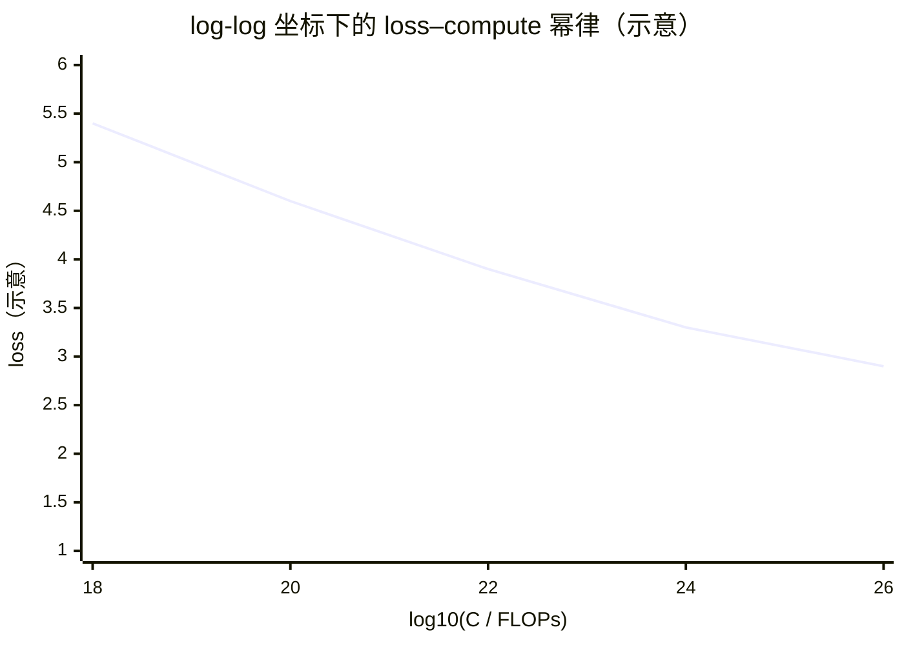
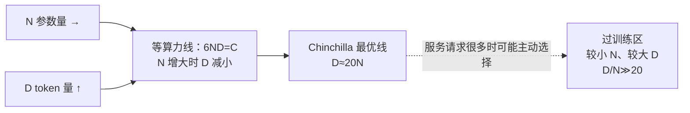

# L16 Scaling Law与算力账：从 6ND 到训练-推理权衡

> [!abstract] 本课速览
> 读完你将能够：
> 1. 从一次乘加、**forward** 和 **backward** 推出训练计算量的 $6ND$ 近似；
> 2. 用 scaling law、compute-optimal 和 Chinchilla 的视角解释模型参数量与 token budget 的配比；
> 3. 把 FLOPs 换算成 GPU-hours、墙钟时间、成本和能源，并审计“多少卡训多少天”的新闻；
> 4. 识别 attention 的长序列修正、MoE 的 active parameters，以及 effective FLOPS 与 MFU 的口径差异。
>
> 前置：[[L12 Transformer全解剖]] · [[L05 反向传播与梯度]] · 预计 50 分钟

## 论文里的这段话，你现在可能读不懂

> [!quote]
> We fit a **power law** for loss as a function of model size, data, and **compute budget**. Under the dense-Transformer approximation, training compute is $C\approx6ND$, so a **compute-optimal** run keeps the **tokens-per-parameter** ratio near the **Chinchilla** prescription. To audit a training report, we compare the implied **effective FLOPS** with the accelerator peak and its **MFU**; for a sparse model, $N$ must be the parameters **active** for each token.
>
> （改写自 Kaplan et al. 与 Hoffmann et al. 的典型表述；不是逐字引文）

这段话把一整套“训练账本”压进了几行。**scaling law**（规模定律）回答“规模变大时 loss 怎么变”，**6ND** 回答“一共做了多少浮点运算”，而 **GPU-hours** 和 **MFU** 才把纸面上的 FLOPs 接到真实集群。读完后再回来看，你应该能判断一条训练新闻是在报参数、报 token，还是在报真正消耗的计算。

## 一、为什么系统研究者必须会算这本账

假设两篇论文分别说“我们用了 400B 参数”和“我们训练了 10T token”。单独看任何一个数字，都不能回答“谁更贵、谁更划算”。参数量 $N$ 决定每个 token 经过多少矩阵乘；token 总量 $D$ 决定这条路径被重复多少次；二者的乘积才接近训练工作量。少算一个维度，就像只说“工厂有多少台机器”而不说“生产了多少件产品”。

这也是为什么本课会把三个量固定下来：

- **$N$**：模型参数量，按 [[03 约定与符号]] 记；稠密模型每个 token 都会用到这批参数。
- **$D$**：这次训练实际消费的 token 总量，也叫 **token budget**（token 预算）。15.6T 是 $1.56\times10^{13}$ 个 token，不是 15.6T 个样本。
- **$C$**：训练 **FLOPs**（浮点运算次数）总量。本文默认一次乘加算 2 FLOPs，和全课程口径一致。

**scaling law** 不是物理定律，而是对多组训练实验拟合出来的经验关系。常见写法是：

$$
L(N,D)=E+\frac{A}{N^{\alpha}}+\frac{B}{D^{\beta}},
$$

其中 $L$ 是 held-out loss，$E$ 是不可约的损失底，$A,B,\alpha,\beta$ 需要用实验数据拟合。说它是 **power law**（幂律），是因为把 $N$ 或 $D$ 放到对数坐标后，损失曲线在一段范围内近似直线。它能帮助我们做预算分配，但不能保证换 tokenizer、数据分布、架构或训练阶段后仍有相同系数。

> [!tip] 直觉
> 把 $N$ 想成工厂的工具数量，把 $D$ 想成要加工的工件数量，把 $C$ 想成总的“工具-工件接触次数”。只增加工具而没有工件，或者只堆工件而工具太少，都会进入边际收益递减。

## 二、6ND：从一次乘加数到整次训练

### 2.1 **forward**：每参数每 token 约 2 FLOPs

先看一个线性层。一个输出元素通常由“乘法 + 加法”组成；按本课程口径，一次 multiply-accumulate（MAC）记作 **2 FLOPs**。如果一个 token 的 forward pass 让大约 $N$ 个参数参与计算，那么：

$$
C_{\text{forward/token}}\approx 2N\ \text{FLOPs}.
$$

这不是说每一个参数都只被读一次的硬件计数，而是把 Transformer 的主导 GEMM 统一折算成“每参数一次乘加”。embedding、归一化、激活函数、bias 和 logits 投影是低阶项或需要单独核对的项；在大模型上，主项通常足够做 back-of-the-envelope 估算。

### 2.2 **backward**：为什么约等于 **forward** 的两倍

[[L05 反向传播与梯度]] 已经说明，反向传播要沿计算图返回梯度。对矩阵乘 $Y=XW$，至少要计算对 $X$ 的梯度和对 $W$ 的梯度；它们各自是一次形状相近的矩阵乘。因此在粗粒度账本里，**backward pass**（反向传播）的 FLOPs 约为 forward 的 2 倍：

$$
C_{\text{backward/token}}\approx 2\times(2N)=4N.
$$

一次训练 token 的 forward + backward 合计就是：

$$
C_{\text{train/token}}\approx 2N+4N=6N.
$$

处理 $D$ 个 token 后得到本课的主公式：

$$
\boxed{C\approx6ND\ \text{FLOPs}}.
$$

这就是 **6ND**。Hoffmann 等人在 Chinchilla 的附录中也采用 backward 约为 forward 两倍的假设，并把更细的 attention、embedding 和 logits 逐项算了一遍；他们的 Table A4 显示，在一组 73M–6.8B 的模型上，精确计数与 $6ND$ 的比值约为 0.99–1.10。换句话说，6ND 是一个有明确误差边界的第一层账本，不是魔法常数。

### 2.3 长序列时，把 attention 的二次项加回来

FFN 和 QKV 投影的工作量随序列长度 $S$ 近似线性；self-attention 的 $QK^T$ 与 attention-weighted $V$ 则会形成 $S\times S$ 的矩阵。按 token 平均后，二次项仍会留下一个随 $S$ 增长的修正。

Kaplan 的逐 token 计数给出一个清晰的结构：forward 主项约为 $2N$，context-dependent attention 项约为 $2L S d$（$L$ 为层数、$d$ 为 hidden size）；反向再按约 2 倍估算。不同实现是否计入 softmax、SwiGLU、embedding、GQA 等，会改变前面的系数，因此工程上更稳妥的判断是：

1. **$S$ 远小于 $d$ 的量级**：6ND 往往足够；
2. **$S$ 接近 $d$ 的同一量级**：attention 二次项不可再忽略；不同 FLOPs 约定给出的交叉提示约在 $6d$–$12d$，不是跨架构硬阈值；
3. **超长上下文**：直接使用模型 config 和论文附录的逐项 FLOPs，不能只乘 6ND。

例如，若把 $d=16{,}384$ 的宽模型放到 $S=128\text{K}$ 的长上下文，$S$ 已经和 $d$ 同一个数量级；把它当成普通 2K/4K 序列会低估 prefill 计算和内存流量。注意这条修正讨论的是训练或 prefill 的序列级 attention；decode 每次只追加一个 token，主导瓶颈会转向权重与 KV cache 的带宽，见 [[L13 自回归生成与KV缓存]]。

> [!warning] 常见误区：6ND 不是所有 FLOPs 的逐指令计数
> 它忽略或平均了 embedding、logits、归一化、通信等待、重计算以及长序列 attention。写论文时应说明“按 6ND 近似”还是“按 kernel/profiler 统计”，不要把两者混成一个精确数字。

## 三、Scaling law 与 Chinchilla：算力该买模型还是买数据

### 3.1 从 Kaplan 的幂律到 compute-optimal

Kaplan et al.（2020）观察到，在实验覆盖的范围内，loss 随参数量、数据量和训练计算量呈平滑的幂律下降；他们的早期结论偏向“在固定预算下使用更大的模型、较少的数据”。重要的不是背某个指数，而是学会把它当作**拟合范围内的趋势**：如果数据不够，继续增大模型并不会无限带来收益；如果模型太小，继续喂数据也会遇到容量瓶颈。

给定 $C$，**compute-optimal**（算力最优）就是在约束 $C\approx6ND$ 下，选择能得到最低训练 loss 的 $N$ 与 $D$。它是一个分配问题：

$$
(N^*,D^*)=\arg\min_{N,D}\ L(N,D)\quad\text{s.t.}\quad 6ND=C.
$$

### 3.2 Chinchilla 的核心修正：D≈20N

Chinchilla（Hoffmann et al., 2022）用 400 多个不同规模的模型重新做 IsoFLOP 实验，结论是：在他们研究的训练设置里，最优模型大小和训练 token 数应随算力近似**等比例**增长。工程上常把结果记成：

$$
\boxed{D\approx20N},\qquad \text{即 tokens-per-parameter}\approx20.
$$

这里的 **tokens-per-parameter**（每参数 token 数）就是 $D/N$。70B 模型训练约 1.4T token，正好是约 20 token/parameter；这也是 Chinchilla 相比 280B、只用约 300B token 的 Gopher 更小却更强的直觉来源。具体最优比例会随数据质量、重复次数、学习率计划、架构和目标（只看预训练 loss，还是要看下游/推理）变化，所以“20”应当作为起点，不是验收模型的硬规则。

### 3.3 over-training 与训练-推理算力权衡

固定 $N$ 后，把 $D/N$ 做得明显高于约 20，常被称为 **over-training**（过训练/过度训练）。它不一定意味着模型在训练集上过拟合；这里更准确的含义是：相对于“只为这一次预训练 loss 最优”的配比，给一个较小模型喂了更多 token。

为什么有人愿意这样做？因为训练和服务是两笔不同的账。大模型每个请求的前向计算约为 $2N$ FLOPs/token，权重和 KV cache 也更大；一个较小模型即使训练阶段多花一些 token，部署时却能用更少的 GPU、更低的 decode 带宽和更小的尾延迟。这就是 **training-inference tradeoff**（训练-推理算力权衡）：

| 策略 | 训练阶段 | 推理阶段 | 适合场景 |
|---|---|---|---|
| 大 $N$、少 $D$ | 较少 token，单步更贵 | 单请求更贵 | 一次性训练、推理量不大 |
| 小 $N$、多 $D$（over-training） | token budget 更大 | 每 token 更便宜 | 长期在线 serving、请求量大 |
| MoE | 总参数大，active 参数小 | FLOPs 按 active 计，但权重仍需放置 | 能接受 all-to-all 与复杂并行的集群 |

> [!tip] 系统视角
> “compute-optimal”只回答预训练 loss 的最优，不自动回答“总拥有成本（TCO）最优”。当模型要服务数十亿个请求时，训练多花的那部分算力可能通过更便宜的 inference 很快摊薄。

## 四、从 FLOPs 到 GPU-hours、美元和兆瓦

### 4.1 先分清 FLOPs、FLOPS、effective FLOPS

[[03 约定与符号]] 规定：**FLOPs** 是工作量，**FLOPS** 是速率；TFLOPS 是每秒 $10^{12}$ 次浮点运算。硬件规格是峰值，不等于训练实际速度。

我们把一次训练的模型计算量 $C$ 除以墙钟秒数，得到 **effective FLOPS**（有效 FLOPS）：

$$
\text{effective FLOPS}=\frac{C}{T_{\text{wall}}}.
$$

再用它除以所有卡的峰值稠密 FLOPS，得到复习过的 **MFU**（Model FLOPs Utilization，模型算力利用率）：

$$
\text{MFU}=\frac{\text{tokens/s}\times6N}{\text{GPU 数}\times\text{单卡峰值 dense FLOPS}}.
$$

MFU 分母必须用稠密峰值，不能把 2:4 sparse marketing 值塞进来；通信、访存、kernel gap 和 pipeline bubble 都会让 effective FLOPS 低于峰值。

### 4.2 算一算：Llama-3-405B 的一条完整换算链

下面严格使用 [[03 约定与符号]] 的统一口径：$N=405\text{B}=4.05\times10^{11}$，$D=15.6\text{T}=1.56\times10^{13}$；H100 SXM 的 BF16 稠密峰值约 989 TFLOPS，假设 16,384 张卡、MFU 取 40%。这是审计练习的假设组合，不把结果冒充项目官方墙钟时间。

> [!example] 算一算：从 FLOPs 到电费量级
> **① 训练工作量**
>
> $$
> C=6ND=6\times4.05\times10^{11}\times1.56\times10^{13}
> =3.7908\times10^{25}\ \text{FLOPs}\approx3.8\times10^{25}.
> $$
>
> **② 集群有效速率与墙钟时间**
>
> $$
> P_{\text{eff}}=16{,}384\times989\times10^{12}\times0.40
> =6.48\times10^{18}\ \text{FLOPS},
> $$
>
> $$
> T=\frac{3.7908\times10^{25}}{6.48\times10^{18}}
> \approx5.85\times10^6\ \text{s}
> \approx67.7\ \text{天}\approx68\ \text{天}.
> $$
>
> **③ GPU-hours 与美元（教学租价）**
>
> $$
> H=16{,}384\times67.7\times24\approx2.66\times10^7\ \text{GPU·h}.
> $$
>
> 按统一表中的 $2/\text{GPU·h}$ 教学取值，约为 $5.3\times10^7$ 美元。它是“等价租用账”，不包含网络、存储、研发、人力和折旧，也不代表实际云报价。
>
> **④ 兆瓦与能源**
>
> H100 SXM 功耗约 700 W，16,384 张卡的 GPU 部分约 $11.5$ MW。按 PUE=1.2，设施输入功率约 $13.8$ MW；运行 68 天约消耗 $13.8\times(68\times24)\approx2.25\times10^4$ MWh，即 **22.5 GWh** 的量级。服务器 CPU、网络和冷却结构的真实功率还要以测量为准。

**反算一次 Chinchilla 配比。** 如果把上面的 $C=3.7908\times10^{25}$ 也交给 compute-optimal 近似，并暂取 $D=20N$，则：

$$
C=6N(20N)=120N^2,
$$

$$
N^*=\sqrt{\frac{3.7908\times10^{25}}{120}}
\approx5.62\times10^{11}=562\text{B},
\qquad
D^*=20N^*\approx1.12\times10^{13}=11.2\text{T tokens}.
$$

这是把经验比例外推到旗舰规模的教学估算；它没有重新拟合数据质量、架构和长序列修正，所以只能回答“同一粗略预算下，配比大概在哪里”，不能宣称这是某个项目应该采用的唯一方案。

这条链把“3.8×10²⁵ FLOPs”翻译成系统语言：约 2,600 万 GPU·h、约千万美元到亿美元之间的租用量级、以及几十 GWh 的设施能源。任何一环的口径没写清，读者都无法复算。

## 五、三份公开训练报告怎么审计

| 案例 | $N$ 与 $D$ | 6ND 粗算 | 审计时要问什么 |
|---|---|---:|---|
| Llama-3-405B（官方论文常写 Llama 3，后续产品名为 Llama 3.1） | 405B；约 15.6T token | $3.79\times10^{25}$ FLOPs | 15.6T 是预训练 token 还是含后训练？报告的 40% MFU 是哪个阶段、哪种峰值？ |
| GPT-3 | 175B；300B token | $6\times175\text{B}\times300\text{B}=3.15\times10^{23}$ FLOPs | 原论文给出模型与数据规模，但不能从 6ND 反推出真实 GPU 型号、重算和故障开销。 |
| DeepSeek-V3 | 671B 总参数；每 token 约 37B active；14.8T token | 用 active 参数约 $6\times37\text{B}\times14.8\text{T}=3.29\times10^{24}$ FLOPs | 2.788M H800 GPU·h 包含预训练、长上下文扩展和后训练；active 参数是粗算口径，不能当作精确 profiler 总量。 |

**DeepSeek-V3 的剪刀差尤其值得记住。** 如果错误地把总参数 671B 塞进 6ND，会得到 $5.96\times10^{25}$ FLOPs，约是 active-parameter 估算的 18.1 倍。反过来，active 参数只说明每个 token 的算力路径，不代表显存只需放 37B：总专家权重仍要分布在设备上，且每层可能产生跨 GPU 的 all-to-all。MoE 的完整系统账留到 [[L17 MoE混合专家]] 和 [[L46 专家并行与MoE训练]]。

用报告给出的 2.788M H800 GPU·h 粗略相除：

$$
\frac{3.29\times10^{24}}{2.788\times10^6\times3600}
\approx3.27\times10^{14}\ \text{FLOPS}=327\ \text{TFLOPS/GPU}.
$$

这是把全训练阶段摊平后的 effective FLOPS；若和 H800 的 FP8 峰值（统一表约 1979 TFLOPS）比较约为 16.5%，和 BF16 稠密峰值约 989 TFLOPS 比较则约为 33%。两种分母都必须标明精度，且不能把这个“全阶段平均”误读成某个单独 kernel 的 MFU。报告还明确说明 2.788M 小时包含 119K 小时的上下文扩展和 5K 小时的后训练，所以它和只对 14.8T 预训练 token 做的 6ND 并非完全同一边界。

### 5.1 两张图：幂律与 $N\times D$ 平面

下面的曲线只表达形状，不是某个 benchmark 的数据点。真正读论文时，要看作者的 loss、数据和 compute 范围。

在固定 $C=6ND$ 时，$N$ 增大意味着 $D$ 必须减小；**compute-optimal** 线则告诉我们哪一个点的 loss 最低。若固定一个较小的 $N$，沿着“更多 token”的方向走，就是 over-training 区：训练账可能增加，但推理账变小。

## 六、emergent abilities：曲线突然跳，还是尺子换了

**emergent abilities**（涌现能力）通常指模型规模变大到某个区间后，某个任务分数看起来突然从“不会”跳到“会”。这和本课的平滑 power law 似乎矛盾，所以必须把“能力本身”和“测量方式”分开：

1. 训练 loss、困惑度等连续指标往往随 $N,D,C$ 平滑改善；
2. exact-match、pass@1、选择题准确率等离散指标会把小幅概率变化放大成 0/1 的跳变；
3. prompt 格式、few-shot 示例、采样方差、评测集大小和数据污染也可能制造“阈值”。

《Are Emergent Abilities of Large Language Models a Mirage?》（NeurIPS 2023）给出的重要提醒是：换成连续指标或更好的统计处理后，许多所谓“突然出现”会变得平滑。这个争议并不意味着大模型没有新能力，而是说我们不能仅凭一条离散 benchmark 曲线断言存在神秘临界点。对系统研究者而言，结论更实用：如果能力指标的跳变对应请求长度、候选数或 verifier 次数的跳变，serving 的资源预算也会随之出现尾部风险，必须同时测量 token、时延和成本。

## 回到开头那段话

现在逐句回读：

1. **“We fit a power law for loss as a function of model size, data, and compute budget.”** 这不是说任何模型都服从永恒定律，而是用实验拟合 $L(N,D)$，在适用范围内预测扩大模型、数据或计算后的收益。
2. **“Under the dense-Transformer approximation, training compute is $C\approx6ND$.”** 每参数每 token 的 forward 约 2 FLOPs，backward 约 4 FLOPs，合起来 6N，再乘 token budget $D$；长序列 attention、embedding 和 logits 是要单独检查的修正。
3. **“A compute-optimal run keeps tokens-per-parameter near the Chinchilla prescription.”** Chinchilla 的经验起点是 $D/N\approx20$，并不意味着所有模型、数据和下游目标都必须精确等于 20；超过它就是在考虑 over-training 与推理成本的权衡。
4. **“Compare effective FLOPS with peak and MFU.”** 用 $C/T$ 得到有效速率，再除以卡数乘单卡**稠密**峰值；GPU-hours 是卡数乘墙钟小时，二者不是同一个单位。
5. **“For a sparse model, use active parameters per token.”** MoE 的每 token FLOPs 应以 active 参数为起点，但总参数决定放置显存和通信规模；把 671B 总参数直接当成每 token 计算量会严重高估，反过来只报 37B 又会漏掉系统代价。

一句话总结：==先用 $6ND$ 把训练报告换成 FLOPs，再用有效 FLOPS、MFU、GPU-hours 和 active/total 参数的口径把它还原成可核验的系统账本==。

## 术语卡片

| 术语 | 中文 | 一句话解释 |
|---|---|---|
| scaling law | 规模定律 | 用经验拟合描述 loss 随模型、数据或计算规模变化的关系。 |
| power law | 幂律 | 形如 $x^{-\alpha}$ 的尺度关系，在对数坐标上近似直线。 |
| compute budget | 算力预算 | 一次训练允许消费的总计算量，本文记作 $C$。 |
| token budget | token 预算 | 一次训练计划消费的 token 总量，记作 $D$。 |
| 6ND | 训练计算量估算式 | 按一次乘加 2 FLOPs、backward≈2×forward，估算 $C\approx6ND$。 |
| compute-optimal | 算力最优 | 在固定 $C$ 下选择使目标 loss 最低的 $N,D$ 配比。 |
| Chinchilla | Chinchilla 配比 | Hoffmann 等给出的经验结论：最优 $D/N$ 在其设置中约为 20。 |
| over-training | 过训练 / 过度训练 | 固定模型后使用明显多于 compute-optimal 配比的 token，以换取更便宜的推理。 |
| tokens-per-parameter | 每参数 token 数 | $D/N$，用来描述模型容量与训练数据的比例。 |
| GPU-hours | GPU 小时 | GPU 数量乘墙钟小时，记录集群资源消耗，不等于墙钟时间。 |
| effective FLOPS | 有效 FLOPS | 训练工作量除以墙钟时间得到的平均实际速率。 |
| MFU | 模型算力利用率 | effective model FLOPS 除以卡数与单卡峰值稠密 FLOPS。 |
| training-inference tradeoff | 训练-推理算力权衡 | 训练阶段多花 token/算力，换取部署阶段更小模型、更低每请求成本的取舍。 |
| emergent abilities | 涌现能力 | 随规模增大看似突然出现的能力现象，需警惕离散指标与统计测量造成的假象。 |
| FLOPs | 浮点运算次数 | 计算工作量单位；本课把一次乘加记作 2 FLOPs。 |

## 自测

1. 为什么单看参数量 $N$ 不能判断一次训练的成本？$D$ 和 $C$ 分别代表什么？
2. 从一次乘加的口径出发，写出 forward、backward 和训练每 token 的 FLOPs。
3. 什么时候 6ND 会低估 attention 的开销？为什么长上下文不能只看参数量？
4. 什么是 compute-optimal？Chinchilla 的 $D\approx20N$ 具体在账本中表达了什么？
5. **计算题**：一个 70B dense 模型训练 1.4T token，按 6ND 估算总 FLOPs；若 1,024 张峰值 989 TFLOPS、MFU=40% 的 H100 运行，墙钟时间约多少天？
6. 一个 MoE 模型总参数 671B、每 token active 参数 37B。用哪个参数量估算 6ND？为什么仍不能据此说它只需放 37B 参数的显存？
7. 一条新闻只说“用了 2.8M GPU-hours”。审计时至少还要追问哪四个口径？

> [!note]- 参考答案
> 1. $N$ 只决定每 token 的计算规模；$D$ 是消费的 token 总数，训练总量近似 $C=6ND$。同一个 $N$ 训练 0.3T 或 15T token，账单相差两个数量级。
> 2. forward≈$2N$ FLOPs/token；backward≈forward 的两倍≈$4N$；合计≈$6N$ FLOPs/token，乘 $D$ 得 $6ND$。
> 3. 当序列长度 $S$ 接近 hidden size 的同一量级时，$QK^T$ 和加权 $V$ 的 $S^2$ 项不可忽略；不同计数约定的交叉提示约在 $6d$–$12d$，长序列还会放大 activation、显存读写和通信压力。
> 4. 在固定 $C$ 下让 loss 最低的 $N,D$ 配置叫 compute-optimal；$D\approx20N$ 表示每个参数训练约 20 个 token，是 Chinchilla 论文在其设置中的经验起点。
> 5. $C=6\times70\times10^9\times1.4\times10^{12}=5.88\times10^{23}$ FLOPs。有效速率=$1024\times989\times10^{12}\times0.4\approx4.05\times10^{17}$ FLOPS；时间≈$1.45\times10^6$ s≈16.8 天。
> 6. 6ND 的每 token 粗算应使用 37B active 参数；671B 总参数仍决定专家权重的驻留显存，router、shared 部分和跨 GPU all-to-all 也会带来额外系统代价。
> 7. 至少问：GPU 型号与精度峰值、GPU-hours 是预训练还是含后训练/重启、用总参数还是 active 参数、有效吞吐/MFU 如何定义；还要确认 token 数、序列长度、租价和是否包含网络/存储成本。

## 延伸阅读

- [《Training Compute-Optimal Large Language Models》](https://papers.nips.cc/paper/2022/file/c1e2faff6f588870935f114ebe04a3e5-Paper-Conference.pdf)（Chinchilla，NeurIPS 2022）：重点看 Figure 1、Figure 3 和 Appendix F，理解 IsoFLOP 与 6ND 近似的误差。
- [《Scaling Laws for Neural Language Models》](https://arxiv.org/abs/2001.08361)（Kaplan et al., 2020）：选读摘要、Table 1 和第 2.1 节，关注 power law 与 attention context 项，不必背全部拟合系数。
- [《The Llama 3 Herd of Models》](https://arxiv.org/abs/2407.21783)：看 405B 的训练规模、MFU 和集群配置，练习把报告字段映射到本课账本。
- [《DeepSeek-V3 Technical Report》](https://arxiv.org/abs/2412.19437)：看摘要、Table 1 和基础设施章节，重点区分 total/active parameters 与 GPU-hours 的边界。
- [《Are Emergent Abilities of Large Language Models a Mirage?》](https://proceedings.neurips.cc/paper_files/paper/2023/hash/adc98a266f45005c403b8311ca7e8bd7-Abstract-Conference.html)（NeurIPS 2023）：只读摘要和 metric-choice 分析，保持对“突然涌现”叙事的统计警惕。
- [Epoch AI 模型与算力数据库](https://epoch.ai/data/ai-models)：把它当作新闻数字的交叉核查工具，先看字段定义，再比较不同报告的计算边界。

---
上一课：[[L15 后训练与对齐]] ← · → 下一课：[[L17 MoE混合专家]]
