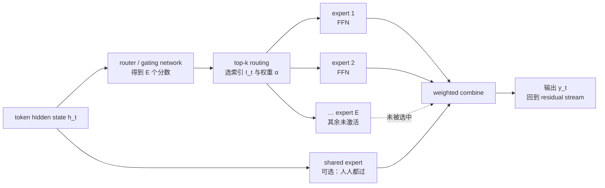
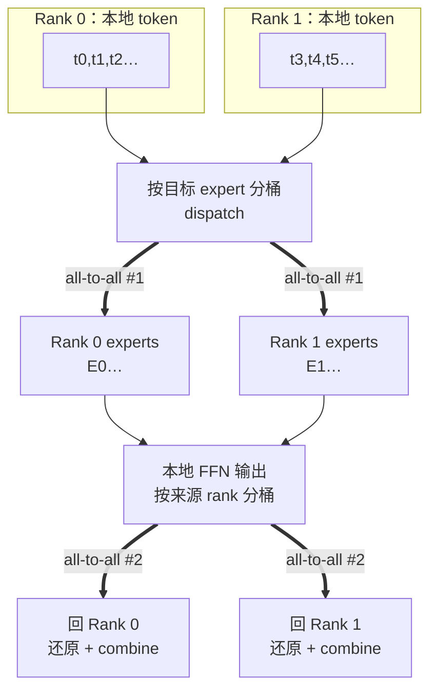

# L17 MoE混合专家：稀疏激活与 all-to-all 代价

> [!abstract] 本课速览
> 读完你将能够：
> 1. 解释 **Mixture-of-Experts (MoE)** 如何把一个 dense FFN 变成许多只被部分调用的 expert；
> 2. 顺着 router → top-k → expert → combine 的数据流，区分 active parameters 与 total parameters；
> 3. 说明 load balancing、capacity factor、token dropping/dropless 解决的是什么训练问题；
> 4. 预测 expert parallelism 为什么需要每层两次 all-to-all，并把它和显存、FLOPs、网络带宽的账对上。
>
> 前置：[[L12 Transformer全解剖]] · [[L16 Scaling Law与算力账]] · 预计 45 分钟

## 论文里的这段话，你现在可能读不懂

> [!quote]
> A **Mixture-of-Experts (MoE)** layer replaces the dense FFN with $E$ **experts**. For every token, a **router/gating network** selects the **top-k** experts and combines their outputs, so only a sparse subset of the model is activated. The system must maintain **load balancing** and an expert **capacity factor**; otherwise **token dropping** or communication hotspots appear when experts are placed with **expert parallelism** and connected by **all-to-all**.
>
> （改写自 Switch Transformers、Mixtral of Experts 与 DeepSeek-V3 Technical Report 的典型表述；不是逐字引文）

这段话把 MoE 论文最常见的一串词压在了一起。这里的 “only a sparse subset of the model is activated” 不是说参数被删掉，而是说==同一个 token 只走一小部分参数==，这就是 **sparse activation**（稀疏激活）；“capacity” 也不是显存容量，而是某个 expert 在一个 batch 里最多接收多少 token。读完本课再回来看，你应该能解释每个词，也能看见它们为什么最终变成网络里的 all-to-all。

## 一、从 dense FFN 到稀疏激活：先把容量和每步算力拆开

[[L12 Transformer全解剖]] 里的一层 Transformer block 可以粗略写成：attention 保持全体 token 的交互，FFN 对每个位置独立做升维、激活、降维。**dense model**（稠密模型）就是每个 token 都经过同一套 FFN 参数；参数量和每 token 的计算量一起增长。

这在 scaling law 时代有一个现实矛盾。我们希望模型拥有更多参数来提高表示容量，但服务端又不希望每生成一个 token 都把所有参数算一遍。MoE 的办法像把一家大工厂拆成很多车间：把 FFN 复制成 $E$ 份，每个车间都是一个 **expert**（专家）；每件工件先由一个小调度员判断该去哪几个车间。车间总数增加了，某一件工件实际经过的车间数却可以固定为 $k$。

因此 MoE 是 **sparse model**（稀疏模型）的一种：它的稀疏性发生在“专家选择”这一维，而不是把矩阵里的零直接跳过。主流 decoder-only 模型通常只把 FFN 替换成 MoE，attention、残差流和归一化仍然是 dense 的；这样既保留 Transformer 的上下文交互，也把参数容量和 FFN 计算分成两笔账。

> [!tip] 直觉：车间多，不等于每件工件都要经过所有车间
> 671B 是整座工厂所有车间的设备总量，37B 是一件工件实际经过的设备量。前者决定工厂规模和需要保存的权重总量；后者主要决定处理这件工件需要多少计算。

### 1.1 路由器到底在做什么

对于某一层，设输入 token 的 hidden state 为 $h_t\in\mathbb{R}^{d}$。**router/gating network**（路由器/门控网络）通常是一个很小的线性层，它为 $E$ 个 expert 产生分数：

$$
r_t=W_r h_t+b_r\in\mathbb{R}^{E}.
$$

将分数变成可比较的权重（常见做法是 softmax），再取分数最高的 $k$ 个 expert 的索引：

$$
\mathcal{I}_t=\operatorname{TopK}(r_t,k),
\qquad
\alpha_{t,i}=\operatorname{softmax}(r_t)_{i}, i\in\mathcal{I}_t.
$$

这一步叫 **top-k routing**（top-k 路由）。它不是一个“数学专家/代码专家”的人工分类器：router 只根据当前表示学习出分数，expert 的分工通常是在训练中涌现的，事后未必能用人类标签解释。

### 1.2 每个 token 的输出

第 $i$ 个 expert $f_i$ 本质上是一份 FFN。被选中的 $k$ 个 expert 并行计算，再按 router 权重加权组合：

$$
y_t=\sum_{i\in\mathcal{I}_t}\alpha_{t,i}f_i(h_t).
$$

若采用 shared expert（共享专家），还会有一条所有 token 都经过的公共 FFN：

$$
y_t=f_{\text{shared}}(h_t)+\sum_{i\in\mathcal{I}_t}\alpha_{t,i}f_i(h_t).
$$

**shared expert**（共享专家）提供不会被路由策略漏掉的通用能力；路由 expert 则负责更细的容量分配。DeepSeekMoE/DeepSeek-V3 采用了这类设计。注意：上式是帮助读结构的抽象式，具体实现还可能有归一化、缩放或多组 shared expert。

## 二、MoE 的两类麻烦：负载均衡与容量上限

理想情况是每个 expert 接收数量大致相同的 token，所有 GPU 都在忙。现实里 router 可能偏爱某几个 expert：它们的队列爆满，其他 expert 却空闲。于是 MoE 的“只算 $k$ 个 expert”并不自动等于“吞吐提升”。

### 2.1 load balancing：不要让热门车间堵死

**load balancing**（负载均衡）要让以下两个分布都尽量均匀：

1. 实际分到每个 expert 的 token 数；
2. router 给每个 expert 的概率质量。

经典方法给训练目标加一个 **auxiliary loss**（负载均衡辅助损失），惩罚“token 分配比例”和“router 概率质量”偏离均匀分布的程度。它通常不是主任务 loss，而是一个带系数的正则项：主任务仍然决定“答案对不对”，辅助项提醒 router “别把所有 token 都送到同一个车间”。辅助项太强会牺牲专家选择质量，太弱则会出现热点，这是一个实际的权衡。

DeepSeek-V3 报告介绍了 **auxiliary-loss-free** 的平衡策略：不把辅助损失直接加到主 loss，而是根据专家近期负载调整 router 的 expert bias，再进行 top-k 选择。这里只需记住接口：==用分数偏置纠正拥堵==，而不是把一个新的 loss 项反传回去；细节留到训练系统课再展开。

### 2.2 capacity factor：每个 expert 的“接待上限”

设一个 batch 里有 $T$ 个 token，$E$ 个 expert，每个 token 选 $k$ 个 expert。平均每个 expert 需要接收 $kT/E$ 个 token。实现通常设置 **capacity factor**（容量因子）$c$，把缓冲上限设为：

$$
\text{capacity per expert}
=\left\lceil c\cdot\frac{kT}{E}\right\rceil.
$$

$c>1$ 是给路由波动留的余量：余量大，溢出概率低，但每个 expert 的临时 buffer 更大；$c$ 太小则频繁溢出。这个容量是==本 batch 的 token 接待名额==，不是模型参数容量，也不是 H100 显存大小。

当 token 被选中但目标 expert 已达到上限，常见处理是 **token dropping**（token 丢弃）：该 token 跳过这次 expert 计算。视具体实现而定，它可能只保留 residual 或采用其他降级路径。它能让张量形状规整、通信可控，但会损失部分信息，尤其在训练早期或负载严重倾斜时明显。

另一条路线是 **dropless**（不丢 token）：无论分布多偏，都把每个 token 送到选中的 expert。代价是需要动态容量、稀疏算子或更大的临时 buffer；最坏 batch 的内存和通信峰值会上升。论文里看到 dropless，不要翻译成“没有稀疏”，它仍然是 sparse activation，只是不用“溢出就丢”的兜底策略。

> [!warning] 常见误区
> - **MoE 省显存**：通常是省每 token 的 FLOPs，不省总权重显存；所有 expert 权重仍要驻留或可被访问。
> - **top-k 就是 top-k sampling**：这里的 k 是路由到几个 expert，不是生成阶段从概率分布采样 token。
> - **capacity factor 越大越好**：它减少 token dropping，却增加 buffer、通信和尾部内存压力。

## 三、专家放在不同 GPU：为什么会出现 all-to-all

如果所有 expert 都在同一张 GPU 上，router 只需做本地索引；但 $E$ 很大时，一张卡放不下所有 FFN。**expert parallelism (EP)**（专家并行）把 expert 集合切片：每个 rank 只保存其中一部分。token 的 hidden state 先在原 rank 上完成路由，再被发送到“拥有目标 expert 的 rank”。

一层 MoE 的抽象流程是：

1. **dispatch**：按 router 结果把 token 重排、分桶并发送到各 expert owner；
2. **local expert compute**：每个 rank 对自己收到的 token 执行本地 FFN；
3. **combine**：把 expert 输出发回 token 的来源 rank，再按 token 的原始位置和 router 权重还原、合并。

因此通常有两次 **all-to-all**（全对全通信）：第一次“去专家”，第二次“回来源”。它和 [[L36 集合通信原语]] 里的 all-reduce 很不一样：后者通常交换形状一致的数据并执行规约，而 all-to-all 的消息目的地由 router 的数据依赖决定，热门 expert 还会制造不均匀消息和队列。

网络视角下，通信量主要跟“这一层有多少 token、每个 token 的 hidden size、数据精度和 top-k”有关，而不是只跟总参数量有关。top-2 会让一个 token 最多产生两份 dispatch；跨节点时还要付消息启动、重排和拥塞代价。按 [[03 约定与符号]] 的课内口径，NDR 端口带宽为 400 Gb/s，即每方向 50 GB/s；H100 SXM 的 NVLink 双向合计带宽为 900 GB/s，每方向约 450 GB/s。约 9 倍的单向带宽差距解释了为什么 TP 常尽量留在机箱内，而 EP 的跨节点流量必须精心规划。真正的 EP 调度、通信拓扑和 overlap 见 [[L46 专家并行与MoE训练]]。

> [!tip] 网络直觉
> all-reduce 像每个人把同一张成绩单求平均；all-to-all 像每个人先看分拣标签，把不同包裹投递到不同城市，再把处理结果寄回。后者的目的地随 token 改变，最怕热点和小包过多。

## 四、从 Mixtral 到 DeepSeek：同一个词谱系里的不同取舍

| 模型/路线 | 专家结构 | 每 token 路由 | 读论文时先看什么 |
|---|---|---:|---|
| **Switch Transformer** | 用稀疏 FFN 替换 dense FFN | top-1 | 路由更简单、通信更轻，但单个 token 只有一个 expert；它奠定了大规模稀疏 Transformer 的历史基线。 |
| **Mixtral-8x7B** | 每层 8 个 FFN expert | top-2 | 总参数约 46.7B、激活约 12.9B（课内统一表）；每个 token 的两个 expert 输出做加权和。 |
| **DeepSeek-V3** | 256 路由 expert + 1 个 shared expert；细粒度专家 | top-8（另经过 shared expert） | 总参数 671B、每 token 激活 37B；同时使用 auxiliary-loss-free 负载均衡。 |

这里的 **fine-grained experts**（细粒度专家）指把 FFN 容量拆成更多、更小的 expert 单元，再用 top-k 组合所需容量。相同激活预算下，粒度更细，组合选择更丰富；但 expert 数增大也会让路由表、负载管理和 EP 通信更复杂。不要把这些 expert 想成预先标注好的学科部门：它们可能形成某些统计分工，但不能仅凭名字断言“这个 expert 专门数学”。

### 算一算：DeepSeek-V3 的 FLOPs 与显存剪刀差

下面只做一阶账本，所有字节和硬件规格均来自 [[03 约定与符号]]：BF16 = 2 B/参数，H100 SXM = 80 GB 显存；DeepSeek-V3 课内统一例子为总参数 671B、激活参数 37B。

> [!example] 算一算：同一个 671B 模型，为什么算力像 37B、显存却像 671B
> **① 先算权重显存（只算 BF16 权重）**
>
> $$
> M_{\text{weights}}=671\times10^9\ \text{参数}\times2\ \text{B/参数}
> =1.342\times10^{12}\ \text{B}\approx1.34\ \text{TB}.
> $$
>
> 仅用权重总量除以单卡 80 GB 显存：
>
> $$
> \left\lceil\frac{1.342\times10^{12}}{80\times10^9}\right\rceil
> =\lceil16.775\rceil=17\ \text{张 H100}.
> $$
>
> 这是==理论下限==：17 张卡几乎没有空间留给 activation、KV cache、通信 buffer、运行时和碎片，实际部署要更多卡或采用量化/卸载等手段。
>
> **② 再算每 token 的主计算量**
>
> 按 [[L16 Scaling Law与算力账]] 的“一次乘加 = 2 FLOPs”近似，active 路径为：
>
> $$
> C_{\text{active/token}}\approx2\times37\times10^9
> =7.4\times10^{10}\ \text{FLOPs}=74\ \text{GFLOPs}.
> $$
>
> 若把同样规模当作每 token 都经过的 dense 模型，则：
>
> $$
> C_{\text{dense/token}}\approx2\times671\times10^9
> =1.342\times10^{12}\ \text{FLOPs}=1.342\ \text{TFLOPs}.
> $$
>
> 两个主项的比值为：
>
> $$
> \frac{C_{\text{dense/token}}}{C_{\text{active/token}}}
> \approx\frac{671}{37}\approx18.1.
> $$
>
> 所以可以说“active 路径的每 token 主计算量约降至 dense 路径的 $1/18$”，但不能说真实端到端 decode 一定快 18×：attention、router、通信、内存读取和 kernel 利用率都还在账上。反过来，active=37B 也绝不等于只需存 37B 权重。

## 五、把结构读成系统问题：从“少算”到“怎么放”

MoE 的收益和代价可以放在一张表里：

| 账本 | dense model | sparse MoE | 系统含义 |
|---|---|---|---|
| 参数容量 | 一套 FFN | $E$ 套 expert FFN（加 shared 可选） | 总容量提升，但权重都要放置/分片 |
| 每 token 计算 | 经过整套 FFN | 只算 top-k（及 shared） | active parameters 决定主 FLOPs |
| 权重显存 | 随 $N$ 增长 | 随 total parameters 增长 | MoE 不是“显存免费” |
| 通信 | 通常是规则的 TP/DP 集合通信 | EP 需要 dispatch/combine 的 all-to-all | 路由热点和跨节点带宽成为瓶颈 |
| 负载风险 | 每个 rank 工作较均匀 | router 可能让少数 expert 过载 | auxiliary loss/bias、capacity、dropless 都是控制旋钮 |

这也是 [[L16 Scaling Law与算力账]] 中“active 参数和 total 参数必须分开报”的原因。训练 FLOPs、推理每 token FLOPs 主要看 active 路径；权重放置所需显存、checkpoint 体积、专家并行规模则要看 total 参数。读到“671B model”时，先问作者报的是哪一个；如果只给一个数字，往往还不够做系统比较。

从网络与系统优化角度，MoE 还引出三个可测问题：

1. **路由均匀吗？** 看每个 expert 的 token histogram、最大/平均负载比和跨节点流量；平均吞吐好看不代表没有热点。
2. **通信能隐藏吗？** dispatch/combine 能否与本地 expert GEMM overlap，取决于消息粒度、拓扑和 kernel；all-to-all 阻塞时，GPU 会等网络。
3. **容量策略伤害质量吗？** 对比 token dropping 与 dropless 时，既要看 loss/下游准确率，也要看峰值显存、尾延迟和网络重试。

## 回到开头那段话

现在逐句回读：

1. **“An MoE layer replaces the dense FFN with $E$ experts.”** 不是复制整层 Transformer，而是通常只把 L12 的 FFN 复制成 $E$ 个 expert；attention 仍保持 dense。
2. **“A router selects the top-k experts and combines their outputs.”** router 用小线性层给 expert 打分，top-k 选索引和权重，再按权重把选中 FFN 的输出相加；这对应前文的数据流图。
3. **“Only a sparse subset of the model is activated.”** 每个 token 只激活少数 expert，因此 active parameters 小于 total parameters；DeepSeek-V3 的课内数字是 37B 对 671B。
4. **“Maintain load balancing and capacity factor.”** 如果热门 expert 接收太多 token，就会发生队列热点或溢出；辅助损失/偏置调节负责均衡，capacity factor 规定每个 batch 的接待上限。
5. **“Otherwise token dropping or communication hotspots appear.”** 容量不够可能丢 token；专家跨 GPU 时，偏斜的 token 分布会变成 all-to-all 的拥塞和空转。
6. **“Expert parallelism and all-to-all.”** EP 把 expert 分布在不同 rank，先 dispatch 到 owner、做本地 FFN，再 combine 回来源，所以每层通常出现两次 all-to-all；L46 会继续讲如何把这条路径做快。

一句话收束：==MoE 用 total parameters 买容量，用 active parameters 付每 token 的算力，但把“去哪儿算”变成了网络问题==。

## 术语卡片

| 术语 | 中文 | 一句话解释 |
|---|---|---|
| Mixture-of-Experts (MoE) | 混合专家 | 用 router 为每个 token 选择少数 FFN expert 的稀疏模型结构。 |
| expert | 专家 | MoE 中的一份独立 FFN 参数块，接收被路由过来的 token。 |
| router/gating network | 路由器/门控网络 | 为每个 token 对所有 expert 打分并产生选择权重的小网络。 |
| top-k routing | top-k 路由 | 只把 token 发给分数最高的 $k$ 个 expert，并加权合并输出。 |
| sparse activation | 稀疏激活 | 模型总参数很多，但每个 token 只执行其中一小部分。 |
| active parameters | 激活参数 | 某个 token 的前向路径实际使用的参数量，决定主计算量。 |
| total parameters | 总参数 | 模型所有权重的总量，决定模型容量和权重显存占用。 |
| load balancing | 负载均衡 | 让 token 数量和 router 概率质量在各 expert 之间尽量均匀。 |
| auxiliary loss | 辅助损失 | 促使 router 均衡分配 token 的额外训练目标。 |
| auxiliary-loss-free | 无辅助损失 | 通过调整 router bias 平衡负载而不直接加入辅助 loss 的策略。 |
| capacity factor | 容量因子 | 以平均 token 分配量为基准设置 expert 接待上限的倍率 $c$。 |
| token dropping | token 丢弃 | expert 缓冲区满时跳过该 token 的 expert 计算的处理策略。 |
| dropless | 不丢 token | 即使路由不均也处理每个 token，以更高的峰值资源开销换取不丢 token。 |
| shared expert | 共享专家 | 所有 token 都经过的公共 FFN，补充路由 expert 的通用能力。 |
| fine-grained experts | 细粒度专家 | 把 FFN 拆成更多、更小的 expert 单元以提供更细的组合容量。 |
| expert parallelism | 专家并行 | 将不同 expert 分片到不同 GPU/rank 上的并行方式。 |
| all-to-all | 全对全通信 | 每个 rank 都可能向所有 rank 发送不同数据；MoE 中用于 dispatch/combine。 |
| dense model | 稠密模型 | 每个 token 都经过同一套稠密参数的模型。 |
| sparse model | 稀疏模型 | 每个 token 只激活部分参数或计算路径的模型，MoE 是其中一种。 |

## 自测

1. MoE 为什么通常只替换 FFN，而不把 attention 一起稀疏化？
2. router 的分数、top-k 索引和 expert 输出权重分别扮演什么角色？
3. **计算题**：一个 batch 有 $T=4096$ 个 token，$E=8$ 个 expert，top-2 路由，capacity factor $c=1.25$。按 $\lceil c\cdot kT/E\rceil$，每个 expert 的容量上限是多少？
4. capacity factor 太小与太大各有什么后果？token dropping 和 dropless 的核心差别是什么？
5. 为什么 expert parallelism 一层通常需要两次 all-to-all？它和 all-reduce 的数据依赖有什么不同？
6. DeepSeek-V3 的 671B total / 37B active 各自应该用于什么账本？
7. “专家是数学专家、代码专家”这个说法为什么不能直接当作结构事实？

> [!note]- 参考答案
> 1. FFN 对每个位置独立、参数占比大，复制和选择的收益明确；attention 的序列交互若再稀疏化会引入另一套近似与质量/并行问题，主流 MoE 先保持它 dense。
> 2. 分数是 token 与 expert 的匹配信号；top-k 索引决定实际发送到哪些 expert；权重决定各 expert 输出在 combine 时的贡献大小。
> 3. $\lceil1.25\times2\times4096/8\rceil=\lceil1280\rceil=1280$ 个 token/expert。总的 expert 接收槽位为 $8\times1280=10240$，比 $kT=8192$ 多出的部分是容量余量。
> 4. 太小会溢出、增加 token dropping 或阻塞；太大会造成 buffer 浪费，并提高峰值内存占用和通信量。token dropping 允许溢出 token 降级处理，dropless 则动态扩容/调度以保证每个 token 都经过选定 expert。
> 5. 第一次 all-to-all 把 token dispatch 到拥有目标 expert 的 rank；本地 FFN 后，第二次 all-to-all 把结果送回来源并按原位置 combine。all-reduce 的参与者通常交换同形状数据并做规约，而 MoE 的目的地由 router 的 token 数据决定。
> 6. 37B active 用来估算每 token 主 FLOPs；671B total 用来估算权重显存、模型容量和专家放置规模。只报 active 会漏掉存储和通信代价，只报 total 会高估每 token 计算。
> 7. expert 的分工是训练中涌现的统计分工，router 并没有被提供“学科标签”；需要可解释性实验才能提出假设，不能从 expert 编号或直觉命名推出结论。

## 延伸阅读

- [Mixtral of Experts](https://arxiv.org/abs/2401.04088)：看摘要、架构表和 MoE layer 图，重点观察 8 experts/top-2 与 active/total 的报法。
- [Switch Transformers: Scaling to Trillion Parameter Models with Simple and Efficient Sparsity](https://www.jmlr.org/papers/volume23/21-0998/21-0998.html)：选读 routing 与 capacity 的章节，理解 top-1 路由的历史取舍。
- [DeepSeek-V3 Technical Report](https://arxiv.org/abs/2412.19437)：读第 2 节架构和第 3 节基础设施，重点看 DeepSeekMoE、shared expert 与 auxiliary-loss-free load balancing；EP 通信细节留给 [[L46 专家并行与MoE训练]]。

---
上一课：[[L16 Scaling Law与算力账]] ← · → 下一课：[[L18 注意力变体与长上下文]]
