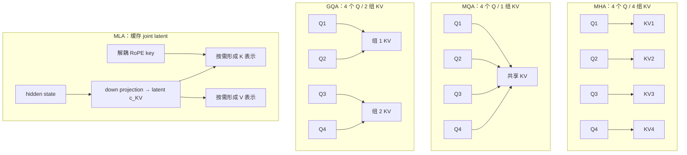
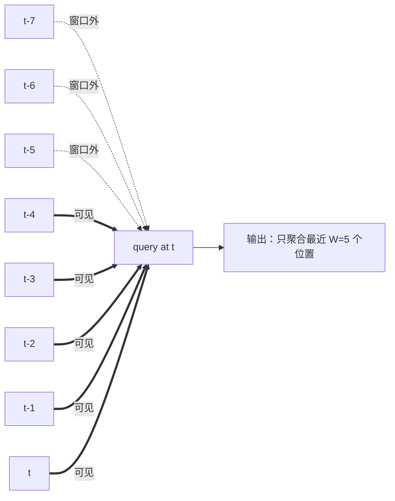

# L18 注意力变体与长上下文：省 KV、少搬运与换掉二次复杂度

> [!abstract] 本课速览
> 读完你将能够：
> 1. 从 KV cache 形状解释 MHA、MQA、GQA、MLA 各自省了什么，并读懂 `num_key_value_heads`；
> 2. 区分“改模型结构”的 GQA/MLA、“限制可见范围”的 sliding window 与“不改数学结果”的 FlashAttention；
> 3. 说明 RoPE scaling、YaRN 和继续训练怎样共同扩展 long context，以及标称窗口为什么不等于真实可用能力；
> 4. 用“完整历史 vs 固定状态”的视角理解 linear attention、SSM、Mamba 与 hybrid architecture。
>
> 前置：[[L13 自回归生成与KV缓存]] · 预计 50 分钟

## 论文里的这段话，你现在可能读不懂

> [!quote]
> During autoregressive inference, replacing **MHA** with **GQA** or **MLA** reduces **KV cache** capacity and bandwidth, while **sliding window attention** bounds the visible history. **FlashAttention** is an exact, IO-aware implementation rather than an approximate attention variant. **RoPE scaling** and continued training extend Transformer models to much longer contexts. **Mamba** and hybrid attention-**SSM** architectures instead compress history into recurrent state.
>
> （改写自本课延伸阅读中的典型表述；不是逐字引文）

这段话把三类常被混在一起的优化写到了一段里：有的少存 K/V，有的少看历史，有的只改变 GPU 上的执行顺序，还有的干脆换掉 attention。读完本课后，你应该先问“它改的是哪本账”，再判断它们能不能叠加。

## 一、问题源头：长上下文同时拉爆三本账

[[L13 自回归生成与KV缓存]] 已经算过：有 KV cache 后，decode 不再重算旧 token，但每个新 token 仍要逐层读取权重和历史 K/V。单步计算形状很“瘦”，因此典型 decode 是 **memory-bound**（访存受限）的；历史越长、并发越高，显存容量和带宽压力越大。

设序列长度为 $S$。标准 dense attention 还带来另一笔账：训练或 prefill 时，$S$ 个 query 与 $S$ 个 key 形成 $S\times S$ score matrix，计算量随 $S^2$ 增长。于是“把窗口从 8K 拉到 128K”不是只改一个配置字段，而是同时面对：

| 账本 | 随什么增长 | 典型问题 | 本课路线 |
|---|---|---|---|
| KV cache 容量 | $O(S\cdot h_{kv})$，再乘层数与 batch | 活跃请求放不下 | MQA / GQA / MLA / KV cache compression |
| decode 访存 | 每步读取不断增长的历史 K/V | TPOT 上升、吞吐下降 | 减少 KV 头、压缩 latent、局部窗口 |
| prefill/训练 attention | dense attention 为 $O(S^2)$ | 长序列算不起、临时张量大 | sliding/sparse attention、FlashAttention、linear attention/SSM |

> [!tip] 先问它动了哪本账
> GQA 像“少带几本档案”，sliding window 像“只翻最近几页”，FlashAttention 像“仍查同样的档案，但把搬运顺序排好”，SSM 则像“把读过的档案压成一份持续更新的摘要”。

## 二、KV 头缩减谱系：MHA → MQA → GQA → MLA

先统一形状。每层每个 token，K 和 V 各有 $h_{kv}$ 个头，每头宽度为 $d_{head}$；元素字节数记为 `bytes`，并发请求数记为 batch。常规 KV cache 公式是：

$$
\boxed{C_{KV}=2\times L\times S\times h_{kv}\times d_{head}\times\mathrm{bytes}\times\mathrm{batch}}
$$

式中的 2 是 K 与 V。只要其他条件不变，缓存大小就正比于 $h_{kv}$。这正是前三种结构的共同旋钮。

### 2.1 MHA：每个 Q 头都有独立 K/V

**multi-head attention (MHA)**（多头注意力）让 $h$ 个 query 头分别匹配自己的 K/V 头，因此 $h_{kv}=h$。它保留最完整的每头表示，但缓存元素数也是 $2h d_{head}$ / 层 / token。

### 2.2 MQA：所有 Q 头共享一组 K/V

**multi-query attention (MQA)**（多查询注意力）保留 $h$ 个 Q 头，却让它们共享唯一一组 K/V，即 $h_{kv}=1$。Shazeer 的《[Fast Transformer Decoding: One Write-Head is All You Need](https://arxiv.org/abs/1911.02150)》（2019）直接从 incremental decoding 的内存带宽出发提出这条路线。

若原来是 64 头 MHA，MQA 的 KV cache 只剩 $1/64$。代价也很直观：所有 query 头看到的是同一套 K/V 表示，表达自由度比 MHA 小，质量是否受影响要靠训练和任务验证。

### 2.3 GQA：把 Q 头分组，共享组内 K/V

**grouped-query attention (GQA)**（分组查询注意力）在两端之间折中：把 $h$ 个 Q 头分成 $h_{kv}$ 组，每组共享一组 K/V。$h_{kv}=h$ 时退化成 MHA，$h_{kv}=1$ 时退化成 MQA。

模型配置里的 **`num_key_value_heads`**（KV 头数字段）就是 $h_{kv}$。例如 [[03 约定与符号]] 中的 Llama-3-70B 有 64 个 Q 头、8 个 KV 头，因此每 8 个 Q 头共享一组 K/V，KV cache 是同宽 MHA 的 $8/64=1/8$。《[GQA: Training Generalized Multi-Query Transformer Models from Multi-Head Checkpoints](https://aclanthology.org/2023.emnlp-main.298/)》（EMNLP 2023）报告，恰当 uptraining 的 GQA 可在接近 MQA 速度的同时保持接近 MHA 的质量；所以“GQA 必然掉很多精度”不是可靠结论。

### 2.4 MLA：缓存低秩 latent，用时恢复所需表示

**multi-head latent attention (MLA)**（多头潜在注意力）不再只问“保留几个 KV 头”，而是对 K/V 做联合 **latent/low-rank compression**（潜在表示/低秩压缩）。直觉上，MHA 是把每层每个 token 的完整 K/V 档案都装进仓库；MLA 先用 down projection 压成较窄的 latent $c_t^{KV}$，缓存 latent，需要计算 attention 时再形成所需表示。这里的“解压”只是读结构的直觉：DeepSeek-V2 的优化推导会把部分 up projection 吸收到 Q 与输出投影中，不必真的物化一份完整 K/V 再计算。

DeepSeek-V2 还把携带 RoPE 位置信息的 key 分量单独保存。因此每层每 token 的缓存不是 $2h_{kv}d_{head}$，而是：

$$
\boxed{C_{MLA}=L\times S\times(d_c+d_h^R)\times\mathrm{bytes}\times\mathrm{batch}}
$$

其中 $d_c$ 是 KV latent 宽度，$d_h^R$ 是解耦 RoPE key 的宽度。DeepSeek-V2 技术报告给出的配置为 $d_c=4d_{head}$、$d_h^R=d_{head}/2$，合计 $4.5d_{head}$ 个元素，相当于只有 2.25 组的 GQA。报告还给出相对 DeepSeek 67B 的 KV cache 减少 93.3%；这个百分比依赖两边的具体架构，不能直接套到任意模型。详见《[DeepSeek-V2: A Strong, Economical, and Efficient Mixture-of-Experts Language Model](https://arxiv.org/abs/2405.04434)》（技术报告 2024）第 2.1 节与表 1。

这四种共享关系可以压成一张图。为了看清连线，图中用 4 个 Q 头代替真实模型的几十个头：

这里把减少头数与 latent 压缩统称为 **KV cache compression**（KV 缓存压缩）。它们的共同系统收益是：缓存占用更小、decode 每步搬运的 K/V 更少，于是同样显存可容纳更长序列或更多请求。但它们会改变模型结构，需要训练阶段配合；不是部署时随手切一个 kernel 就能把现成 MHA 模型无损变成 MLA。

> [!example] 算一算：128K 单请求的四种 KV cache
> 数据口径来自 [[03 约定与符号]]：借用 Llama-3-70B 的 $L=80$、$h=64$、$d_{head}=8192/64=128$；BF16 为 2 B/元素。取 $S=128\text{K}=131{,}072$ token、batch=1，容量按 SI 的 GB（$10^9$ B）换算。
>
> **MHA：$h_{kv}=64$**
>
> $$
> C_{MHA}=2\times80\times131072\times64\times128\times2
> =343{,}597{,}383{,}680\text{ B}\approx\boxed{343.6\text{ GB}}
> $$
>
> **GQA：$h_{kv}=8$**
>
> $$
> C_{GQA}=2\times80\times131072\times8\times128\times2
> =42{,}949{,}672{,}960\text{ B}\approx\boxed{42.9\text{ GB}}
> $$
>
> **MQA：$h_{kv}=1$**
>
> $$
> C_{MQA}=2\times80\times131072\times1\times128\times2
> =5{,}368{,}709{,}120\text{ B}\approx\boxed{5.37\text{ GB}}
> $$
>
> **MLA：移植 DeepSeek-V2 的 $d_c+d_h^R=4.5d_{head}=576$ 元素口径**
>
> $$
> C_{MLA}=80\times131072\times576\times2
> =12{,}079{,}595{,}520\text{ B}\approx\boxed{12.1\text{ GB}}
> $$
>
> | 结构 | batch=1 | 相对 MHA | batch=8（全部 ×8） |
> |---|---:|---:|---:|
> | MHA | 343.6 GB | $1$ | 2.75 TB |
> | GQA（8 组） | 42.9 GB | $1/8$ | 343.6 GB |
> | MQA | 5.37 GB | $1/64$ | 42.9 GB |
> | MLA（$4.5d_{head}$ 口径） | 12.1 GB | 约 $1/28.4$ | 96.6 GB |
>
> MLA 这一行是“把 DeepSeek-V2 的缓存维度代入同一层数、头宽和序列长度”的结构比较，不代表存在一个官方 Llama-3-70B-MLA。它也说明这不是按缓存大小严格单调的谱系：MQA 共享最激进，缓存可比此处 MLA 更小；MLA 的目标是在强表达能力与显著压缩之间换一种折中。

## 三、少看历史与少搬数据：sliding window 不等于 FlashAttention

### 3.1 sliding window：把每个 query 的可见历史限制为 $W$

**sliding window attention**（滑动窗口注意力）让位置 $t$ 只关注最近 $W$ 个位置，而不是全部 $1\ldots t$。当 $S\gg W$ 时，每层 attention 的连接数从 $O(S^2)$ 降到 $O(SW)$；decode 若只保留窗口内 K/V，缓存也可被 $W$ 限住。Mistral 7B 同时采用 GQA 与 sliding window，说明“少 KV 头”和“少看位置”可以叠加。

代价是窗口外信息不能被这一层直接访问。多层堆叠可让信息逐层传播得更远，但这不等于任意远处细节都能像 full attention 一样被直接检索。

StreamingLLM 还观察到 **attention sink**（注意力汇聚点）现象：一些模型会给最初几个 token 很高 attention，即使它们语义并不重要。仅保留“最近窗口”可能让质量崩掉，而额外保留开头少数 sink token 的 K/V 可以显著稳定流式生成。它不是“开头永远最重要”的语言学定律，而是模型 attention 分配与缓存裁剪交互出的现象。

截至 2025 年，《[Native Sparse Attention: Hardware-Aligned and Natively Trainable Sparse Attention](https://arxiv.org/abs/2502.11089)》的 **NSA** 和《[MoBA: Mixture of Block Attention for Long-Context LLMs](https://arxiv.org/abs/2502.13189)》的 **MoBA** 等工作又让模型动态选择压缩块、局部 token 或候选块。这里只认名：这是快速演化区，读具体论文时必须重查其稀疏模式、训练方式、硬件实现和质量基线，不能把所有 sparse attention 当成同一种算法。

### 3.2 FlashAttention：数学不变，执行顺序重排

**FlashAttention** 是 IO-aware 的 exact attention：它仍计算与标准 dense attention 相同的结果，不删 token、不共享 KV 头，也不把 softmax 换成近似。核心直觉是把 Q/K/V 分块搬进片上 SRAM，用 **tiling**（分块）和 online softmax 边扫块边维护归一化统计量，避免把完整 $S\times S$ score matrix 反复写回、读出 HBM。

所以 FlashAttention 与 GQA/MLA 是正交的：前者优化“同一道数学题怎样少搬数据”，后者改变“模型需要存什么”。也正因为如此，支持 GQA 的模型仍可使用 FlashAttention kernel。完整 IO 复杂度与 kernel 细节留到 [[L51 算子优化与FlashAttention]]。

> [!warning] 三个常见误区
> - **“FlashAttention 是近似注意力”**：错。标准 dense 版本是 exact；另行采用 block-sparse 才会改变可见连接。
> - **“sliding window 支持无限上下文”**：它可让运行状态有界，但窗口外原文并不会自动完整保留。
> - **“GQA 减少 $S^2$ 计算复杂度”**：它主要减少 K/V 投影、缓存与 decode 访存；query-key 交互随 $S$ 的 dense 结构仍在。

## 四、窗口写成 128K/1M，不等于模型真的会用

**long context**（长上下文）没有跨论文统一的 token 阈值；它通常指相对模型原始训练窗口显著更长、足以让容量、attention 计算或远程检索成为主要问题的上下文。标称 context window 至少受三层条件共同约束：

1. **位置表示能否外推**：RoPE 在训练长度之外的旋转频率分布会失配；
2. **模型是否见过长序列**：只改位置公式，不代表模型学会利用远距离证据；
3. **系统能否承受**：KV cache、prefill 计算、batch 和并行策略决定部署是否放得下、跑得动。

**RoPE scaling**（RoPE 缩放）泛指调整位置映射、旋转基数或频率插值，让训练窗口之外的位置落入更可处理的范围。**YaRN**（Yet another RoPE extensioN）是其中一种方法名；《[YaRN: Efficient Context Window Extension of Large Language Models](https://arxiv.org/abs/2309.00071)》（预印本 2023）组合频率处理与缩放策略，再配合较少的长上下文 fine-tuning 数据扩展窗口。初学阶段不必背频率公式，只需记住：==它在修位置坐标系，不是在压 KV cache==。

工程上通常还要做长上下文继续训练或 fine-tuning，让模型真正遇到跨长距离依赖。公开技术报告已经把标称窗口从 128K 推到 1M 乃至更长；例如《[Gemini 1.5: Unlocking multimodal understanding across millions of tokens of context](https://arxiv.org/abs/2403.05530)》讨论了百万 token 级上下文。但窗口数字是“允许输入多少”的上限，不是“任意位置的信息都同样会被可靠利用”的保证。

一个常见压力测试是 **needle-in-a-haystack**（大海捞针测试）：把一条可验证事实（needle）插入很长、无关的文本（haystack）的不同位置，再询问模型能否找回。它适合快速发现位置盲区，却主要测“找到并复述一个针”，不能替代多跳推理、长文一致性与真实 workload 评测。

《[Lost in the Middle: How Language Models Use Long Contexts](https://arxiv.org/abs/2307.03172)》展示了另一层风险：相关信息位于上下文中部时，模型表现可能明显弱于信息位于开头或结尾。==能塞进窗口，不等于能稳定用好窗口==。系统论文若只报最大 token 数而不报任务、needle 位置、输入分布、TTFT/TPOT 与显存，就还没把 long-context 能力说完整。

## 五、换掉 attention：linear attention、SSM 与 Mamba

前面的路线仍保留“新 query 显式查询一批历史表示”。另一条更激进的思路是：能否把历史压成固定大小状态，不保存一条随 $S$ 增长的 KV cache？

### 5.1 linear attention：利用结合律先汇总历史

**linear attention**（线性注意力）是一类方法，不是单一公式。常见路线用可分解的 feature map 近似或重写 attention kernel，使：

$$
\frac{\phi(Q)\bigl(\phi(K)^T V\bigr)}
{\phi(Q)\bigl(\phi(K)^T\mathbf{1}\bigr)}
$$

可以先把历史汇总成分子状态 $\phi(K)^TV$ 与归一化状态 $\phi(K)^T\mathbf{1}$，再由新 query 读取，而不是显式形成 $S\times S$ 矩阵。这样序列计算可做到对 $S$ 线性，autoregressive decode 的历史状态大小也可不随 $S$ 增长。代价是它通常不再等同于标准 softmax attention，feature map、数值稳定性与 associative recall 能力都要单独验证。

### 5.2 SSM：把序列看成一个持续更新的动态系统

**state space model (SSM)**（状态空间模型）用固定维度状态 $s_t$ 汇总过去，再用当前输入更新它：

$$
s_t=A_t s_{t-1}+B_t x_t,\qquad y_t=C_t s_t.
$$

从 decode 视角看，旧 token 不再各占一格 KV cache；每层只保留当前状态，所以相对上下文长度 $S$ 的缓存是 $O(1)$。这里的 $O(1)$ 只表示“不随历史长度增长”，不代表整模型显存为常数，也不保证每种实现的墙钟时间相同。

**Mamba** 是 selective SSM 架构：让部分状态更新参数依赖当前输入，模型可以选择哪些信息写入、保留或遗忘；同时用硬件感知的 scan 支持并行训练和 recurrent decode。《[Mamba: Linear-Time Sequence Modeling with Selective State Spaces](https://arxiv.org/abs/2312.00752)》把核心矛盾说得很清楚：attention 不压缩上下文，检索灵活但缓存增长；recurrent model 压成有限状态，效率高但必须学会“摘要时别丢掉以后要问的细节”。

### 5.3 hybrid：用少量 attention 补精确回忆，用 SSM 扛大部分序列

**hybrid architecture**（混合架构）把 attention 层/头与 SSM 层/头组合：SSM 负责高效推进长序列，attention 周期性提供更直接的 token-to-token 检索。它不是“二选一”的妥协，而是在系统预算下分配昂贵但擅长精确回忆的 attention。

截至 2026 年，把“前沿模型全是纯 Transformer”当成定论已经不够准确：attention-centric Transformer 仍是最重要的基线和广泛采用的主干，但公开的 Mamba-Transformer hybrid 已进入实际模型路线。例如《[Falcon-H1: A Family of Hybrid-Head Language Models Redefining Efficiency and Performance](https://arxiv.org/abs/2507.22448)》（技术报告 2025）采用 parallel hybrid，NVIDIA 的 [Nemotron 3 Ultra 技术说明](https://developer.nvidia.com/blog/nvidia-nemotron-3-ultra-powers-faster-more-efficient-reasoning-for-long-running-agents/)（2026）也明确列出 hybrid Mamba-Transformer layers。对本课程而言，更稳妥的判断是：Transformer 仍必须精通，hybrid 已从“候选替代品”变成需要跟踪其吞吐、状态大小、召回质量和硬件映射的系统研究对象。

## 六、把模型变体翻译成系统研究问题

当你在论文中看到一种新 attention，先不要被名字带走，按下面五问拆解：

1. **缓存什么？** 是完整 K/V、共享 KV 头、latent，还是固定 recurrent state？
2. **看多少历史？** full、固定窗口、静态稀疏，还是输入相关的动态稀疏？
3. **数学结果变了吗？** exact kernel、结构重训练，还是近似 attention？
4. **瓶颈移到哪里？** 省 HBM 后，是否转成额外 projection、稀疏索引、kernel launch、跨卡通信或状态更新？
5. **质量怎样验证？** 除 perplexity 外，是否测不同位置的 retrieval、长文推理、真实 prompt 长度分布和端到端 TTFT/TPOT？

这五问直接连接本课程的网络与系统主线。更小 KV cache 会改变单实例可承载的 batch、KV 在多 GPU 间的切分与迁移量；sparse/hybrid 会改变算子形状、负载均衡和通信模式。后续 [[L45 序列与上下文并行]]、[[L55 推理性能模型]]、[[L56 KV缓存与PagedAttention]] 会把这些结构选择继续翻译成跨 GPU 的放置、调度和网络问题。

## 回到开头那段话

现在逐句回读：

1. **“Replacing MHA with GQA or MLA reduces KV cache capacity and bandwidth, while sliding window attention bounds the visible history.”** GQA 通过更少的 `num_key_value_heads` 共享 K/V；MLA 缓存 joint latent 与解耦 RoPE key；sliding window 则限制每个 query 能看到的位置集合。前三者都能少搬数据，但改变的结构维度不同。
2. **“FlashAttention is an exact, IO-aware implementation rather than an approximate attention variant.”** 它用 tiling 与 online softmax 避免完整 score matrix 往返 HBM，标准 dense 结果不变；所以它能和 GQA/MLA 叠加，也不等于 linear/sparse attention。
3. **“RoPE scaling and continued training extend Transformer models to much longer contexts.”** RoPE scaling/YaRN 先修训练窗口外的位置坐标，继续训练再让模型学会使用长距离信息；128K/1M 的标称窗口还必须经过 needle、lost-in-the-middle 与真实 workload 检验。
4. **“Mamba and hybrid attention-SSM architectures instead compress history into recurrent state.”** SSM/Mamba 不保留随 $S$ 增长的逐 token KV，而用固定状态递推；hybrid 留下一部分 attention，换取更强的精确回忆能力。

一句话收束：==注意力变体不是一条“谁最先进”的直线，而是对容量、带宽、二次计算和信息保真度四本账的不同取舍==。

## 术语卡片

| 术语 | 中文 | 一句话解释 |
|---|---|---|
| multi-head attention (MHA) | 多头注意力 | 每个 Q 头拥有独立 K/V 头的标准多头 attention。 |
| multi-query attention (MQA) | 多查询注意力 | 多个 Q 头共享唯一一组 K/V，以最激进的头共享减少缓存与带宽。 |
| grouped-query attention (GQA) | 分组查询注意力 | 把 Q 头分组，组内共享一组 K/V，是 MHA 与 MQA 的折中。 |
| num_key_value_heads | KV 头数字段 | 模型配置中记录 $h_{kv}$、直接决定常规 KV cache 头数系数的字段。 |
| multi-head latent attention (MLA) | 多头潜在注意力 | 联合压缩 K/V 为低秩 latent，推理时缓存 latent 与位置相关分量的 attention。 |
| latent/low-rank compression | 潜在表示/低秩压缩 | 先降维保存窄表示，再通过投影形成所需 K/V 表示的方法。 |
| KV cache compression | KV 缓存压缩 | 通过头共享、低秩、量化等方式减少 KV cache 容量与访存的总称。 |
| sliding window attention | 滑动窗口注意力 | 每个位置只关注最近 $W$ 个 token，使连接数从 $O(S^2)$ 变为 $O(SW)$。 |
| attention sink | 注意力汇聚点 | 模型对最初少数 token 赋予异常高 attention、影响窗口缓存裁剪的现象。 |
| RoPE scaling | RoPE 缩放 | 调整位置映射或频率，使 RoPE 模型能处理训练窗口之外的位置。 |
| YaRN | 一种 RoPE 扩窗方法 | Yet another RoPE extensioN，通过频率与缩放策略配合继续训练扩展窗口。 |
| long context | 长上下文 | 长到位置外推、KV 容量、attention 计算或远程检索成为主要问题的上下文。 |
| needle-in-a-haystack | 大海捞针测试 | 把事实插入长文本不同位置，检查模型能否检索并复述的压力测试。 |
| FlashAttention | IO 感知精确注意力 | 用 tiling 与 online softmax 减少 HBM 读写、但保持 dense attention 数学结果的算法。 |
| linear attention | 线性注意力 | 通过 kernel 分解或递推状态避免显式 $S\times S$ attention 的一类方法。 |
| state space model (SSM) | 状态空间模型 | 用固定维度状态递推汇总历史的序列模型。 |
| Mamba | 选择性状态空间架构 | 让状态更新依赖输入，并用硬件感知 scan 实现线性序列处理的 SSM 架构。 |
| hybrid architecture | 混合架构 | 组合 attention 与 SSM 等序列模块，权衡精确回忆能力与长序列效率。 |

## 自测

1. MHA、MQA、GQA 的 $h_{kv}$ 分别怎样取值？`num_key_value_heads=8`、`num_attention_heads=64` 表示怎样的共享关系？
2. MLA 为什么只缓存 latent 还不够，DeepSeek-V2 还缓存了什么？为什么不能把其“减少 93.3%”套给所有模型？
3. **计算题**：沿用本课 Llama-3-70B、BF16、$S=128$K、batch=1 的设定。若 GQA 从 8 个 KV 头改为 4 个，KV cache 多大？batch=8 时呢？
4. sliding window、GQA 与 FlashAttention 分别改变可见位置、模型结构还是执行顺序？三者能否组合？
5. 为什么标称支持 1M token 仍不能推出模型会稳定利用中间位置的信息？needle-in-a-haystack 又漏测了哪些能力？
6. SSM 的 decode 状态对 $S$ 为 $O(1)$，这句话不代表哪两件事？
7. （研究题）比较一种 sparse attention 与 full attention 时，除模型质量外，至少应报告哪些系统指标和 workload 条件？

> [!note]- 参考答案
> 1. MHA 有 $h_{kv}=h$；MQA 有 $h_{kv}=1$；GQA 满足 $1<h_{kv}<h$。64 个 Q 头和 8 个 KV 头表示每 8 个 Q 头共享一组 K/V。
> 2. 还要缓存携带解耦 RoPE 的 key 分量 $k_t^R$；总维度为 $d_c+d_h^R$。“93.3%”是 DeepSeek-V2 相对 DeepSeek 67B 的整机架构比较，基线头数、层数和维度不同就会改变比例，应代入各自公式。
> 3. KV cache 对 $h_{kv}$ 线性。4 头是本课 8 头 GQA 的一半：batch=1 为 $42.94967296/2\approx\boxed{21.5\text{ GB}}$；batch=8 再乘 8，约 $171.8\text{ GB}$。
> 4. sliding window 改可见位置；GQA 改 KV 头共享结构；FlashAttention 改同一数学运算的访存/执行顺序。只要 kernel 支持对应布局，三者可以组合：在 GQA 张量上对窗口内 attention 使用 FlashAttention。
> 5. 位置编码可能外推失败，模型未必接受过足够的长序列训练，中间位置还可能出现 lost-in-the-middle；系统也可能因容量/时延缩短实际窗口。needle 主要测单事实定位与复述，漏掉多跳推理、跨段整合、长文一致性和真实请求分布。
> 6. 它不代表整个模型显存是常数，也不代表任意 SSM 的每 token 墙钟时间、质量或硬件利用率都相同；常数还会随层数、hidden/state size 和 batch 增长。
> 7. 至少说明序列长度/分布、batch/并发、精度和硬件，报告显存峰值、HBM 流量或带宽、prefill/decode 吞吐、TTFT/TPOT（含尾时延）、kernel 利用率；动态稀疏还应报告索引/路由开销、负载偏斜及跨卡通信，并与质量/召回指标配对。

## 延伸阅读

- [《GQA: Training Generalized Multi-Query Transformer Models from Multi-Head Checkpoints》](https://aclanthology.org/2023.emnlp-main.298/)（EMNLP 2023）：读摘要、图 2 与实验结论，理解 GQA 如何在 MHA 质量和 MQA 速度之间取折中。
- [《DeepSeek-V2: A Strong, Economical, and Efficient Mixture-of-Experts Language Model》](https://arxiv.org/abs/2405.04434)（技术报告 2024）：精读第 2.1 节和表 1，先看 MLA 的 down/up projection 与缓存维度，不必一开始追完整矩阵吸收推导。
- [《Mamba: Linear-Time Sequence Modeling with Selective State Spaces》](https://arxiv.org/abs/2312.00752)（预印本 2023）：先读 abstract、图 1 和第 3.1 节，把“完整历史”与“有限状态”的取舍建立起来。
- [《FlashAttention: Fast and Memory-Efficient Exact Attention with IO-Awareness》](https://arxiv.org/abs/2205.14135)（NeurIPS 2022）：本课只确认 exact/IO-aware；tiling、online softmax 与 IO 复杂度留到 [[L51 算子优化与FlashAttention]]。
- [《Efficient Streaming Language Models with Attention Sinks》](https://proceedings.iclr.cc/paper_files/paper/2024/hash/5e5fd18f863cbe6d8ae392a93fd271c9-Abstract-Conference.html)（ICLR 2024）：看摘要与方法图，理解为什么“最近窗口 + 开头少数 token”比只保留最近窗口稳定。

---
上一课：[[L17 MoE混合专家]] ← · → 下一课：[[L19 实践-解剖迷你GPT]]
