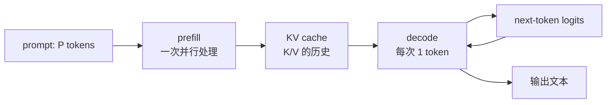
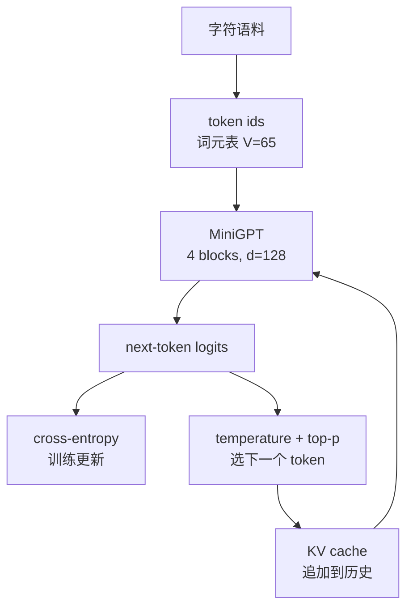

# L19 实践：解剖迷你 GPT，从参数到 KV cache

> [!abstract] 本课速览
> 这次不再只看 [[L12 Transformer全解剖]] 的图纸，而是把图纸压进一个可运行的单文件。完成实验后，你将能够：
> 1. 用公式逐项手算并用 `sum(p.numel())` 核对迷你 GPT 的 **parameter**（参数）；
> 2. 看到字符级语料上的 **loss curve**（损失曲线）从随机猜测变得更像 Shakespeare；
> 3. 分开测量 **prefill**（预填充）与 **decode phase**（解码阶段），并解释两者为什么不是同一种工作；
> 4. 对比朴素重算与 **KV cache**（KV 缓存），看到生成长度增加时两条曲线的差别；
> 5. 改变 **temperature**（温度）与 **top-p (nucleus) sampling**（top-p 核采样），把“多样性”变成可观察的输出差异。
>
> 前置：[[L12 Transformer全解剖]] · [[L13 自回归生成与KV缓存]] · 预计 60–90 分钟

## 本次实践你要亲眼看到什么

1. 刚初始化时，65 个字符类别的均匀猜测使 **cross-entropy loss**（交叉熵损失）在 $\ln 65\approx4.174$ 附近；训练后 loss 总体下降，生成文字从随机字符逐渐出现角色名、换行和英文拼写的节奏。
2. `parameters=1,059,200` 与手算公式一致；这个模型是“能解剖的实验对象”，不是对语言能力的宣称。
3. 对同一个 prompt，**prefill** 一次并行处理一段输入，**decode phase** 每次只输入一个新 token 并读取历史 cache；终端会同时报出两者的耗时。
4. `benchmark` 在 greedy 模式下断言 naive 与 cached 的输出完全相同，后者随生成长度增加时通常耗时增长更慢；这是数学等价、系统工作量不同。
5. 将 temperature 从 0 改为 0.8，或将 top-p 从 1.0 改为 0.9，同一模型也可能产生不同文本；这是采样分布变了，不是权重变了。

这五个现象串起了一条完整链路：字符 $→$ token id $→$ Transformer block $→$ logits $→$ loss 与参数更新 $→$ 自回归生成。

## 〇、环境准备

### 依赖与运行路径

正文与脚本按 Python 3.9–3.12、`torch==2.5.1` 和 `numpy==1.26.4` 配对。脚本本身不调用 NumPy，但它能避免 PyTorch 首次导入时的可选依赖提示。无 GPU 请使用 CPU；Apple Silicon 可使用 MPS；CUDA 只在你已有可用 CUDA 环境时选择。使用 `uv` 时：

```bash
uv venv --python 3.12 .venv
source .venv/bin/activate
uv pip install "torch==2.5.1" "numpy==1.26.4"
```

完整可运行的单文件在 [[L19_mini_gpt.py]]，不依赖 `transformers` 或网络服务。第一次运行会从 tiny Shakespeare 地址下载约 1 MB 文本；无网络时自动切换到脚本内的公版文本后备。数据和输出默认放在 `data/l19/` 与 `outputs/l19/`，可用 `--data` 和 `--output` 指定其他路径。本课后续的 $V=65$、1,059,200 参数以下载成功的 tiny Shakespeare 为准；若使用后备文本，词表和参数会随数据改变，但脚本仍会用同一公式自检。

```bash
# 先用 10 step 确认环境、数据和前向/反向均能跑通
python "M2 Transformer与大模型/实践代码/L19_mini_gpt.py" train \
  --device cpu --steps 10 --batch-size 2 --train-seq-len 64 \
  --eval-interval 5 --eval-iters 2 --output /tmp/l19-smoke.pt \
  --loss-csv /tmp/l19-smoke-loss.csv

# 默认缩小训练：普通 CPU 可先跑完；Mac 可把 cpu 换成 mps
python "M2 Transformer与大模型/实践代码/L19_mini_gpt.py" train --device auto
```

> [!tip] 模型故意比 L12 的 Llama 纸图更朴素
> 为了让 CPU/Mac 也能观察，脚本使用 `LayerNorm` 而不是 RMSNorm、learned positional embedding 而不是 RoPE、GELU 而不是 SwiGLU，并使用 dense MHA。这些是实现差异，不改变我们要观察的 Transformer 主干、causal mask、prefill/decode 和 KV cache 原理。与 nanoGPT 一样，这是教学缩放版，不是生产推理引擎。

## 一、逐步任务

### A. 从字符和参数开始

**Tokenizer** 在这里故意使用字符级映射：字符表中每个字符对应一个 integer id，不需要 BPE 词表或额外包。tiny Shakespeare 的字符表是 $V=65$，所以随机均匀猜测的理论 loss 是：

$$
L_0=-\ln(1/V)=\ln 65\approx4.174.
$$

这就是为什么终端初始 `train_loss` 在 4 左右：它表示对下一个字符的概率分布还接近均匀，不是“正确率 4%”。

脚本默认配置是 $L=4$ 层、$h=4$ 个 Q 头、$d=128$、$h_{kv}=4$、最大位置表 $S_{max}=2048$、FFN 中间宽度 $4d$。线性层不存 bias，LayerNorm 保留 weight/bias，且 token embedding 与 lm_head 做 weight tying。因而参数公式为：

$$
\begin{aligned}
N={}&Vd+S_{max}d \\
&+L\left[\underbrace{2d^2+2d\,h_{kv}\frac{d}{h}}_{Q/K/V/O\ attention}
 +\underbrace{8d^2}_{FFN}+\underbrace{4d}_{2\times LayerNorm}\right]
 +\underbrace{2d}_{final\ LayerNorm}.
\end{aligned}
$$

代入 $V=65,d=128,S_{max}=2048,L=4,h=h_{kv}=4$：

$$
\begin{aligned}
N&=65\times128+2048\times128\\
&\quad+4\times(4\times128^2+8\times128^2+4\times128)+2\times128\\
&=8{,}320+262{,}144+788{,}480+256\\
&=\boxed{1{,}059{,}200\ \text{parameters}}.
\end{aligned}
$$

启动时的 `parameters=1,059,200` 会再用 `sum(p.numel() for p in model.parameters())` 核对，并且脚本会对公式不一致直接报错。注意 weight tying 使输入词元表和 `lm_head` 只计一份；如果把输出层另外存一份，结果会多 $Vd=8{,}320$ 个参数。

> [!example] 算一算：参数量与位置表的关系
> 只把 `--max-seq-len 2048` 改为 1024，其余不变，参数量会减少 $(2048-1024)\times128=131{,}072$。这个差额不来自 attention 计算，而来自 learned position embedding 表；如果换成 RoPE，参数账会不同。

### B. 训练：让 loss 从“猜”变成“有节奏”

`train` 子命令每个 step 做与 [[L07 训练循环解剖]] 相同的事：随机取一段连续字符，将左移一位的字符作为 target，进行 forward、cross-entropy、backward 和 AdamW 更新。脚本在 step 0 与每个 `--eval-interval` 输出 train/validation loss，并保存为 `loss.csv`，因此不要只看最后一个数。

```text
step=0000/1000 train_loss=4.17.. val_loss=4.17.. elapsed=...
step=0100/1000 train_loss=...  val_loss=...  elapsed=...
step=0200/1000 train_loss=...  val_loss=...  elapsed=...
...
checkpoint=outputs/l19/model.pt
loss_csv=outputs/l19/loss.csv
```

`train_loss` 的怶体趋势下降即为学到了角色标记、词法形状等局部规律；`val_loss` 是保留文本上的另一种观察。它们不保证生成文字“通顺”，因为这是字符级小语料；你要把 loss 曲线和周期性样本一起看。

> [!warning] 不要把小语料的低 loss 当成模型通用能力
> 这个训练只是把“数据、目标、参数、检查点”连起来。它可以让输出像 Shakespeare，不能因此说它理解了人类语言。

### C. 分开看 prefill 与 decode phase

[[L13 自回归生成与KV缓存]] 已经区分了两阶段：

- **prefill**：把整段 prompt 一次送进模型，并行算出每个位置的 Q/K/V，同时建立初始 KV cache。它更像一个矩阵计算，可以吃到 batch 和设备并行度。
- **decode phase**：每次只来一个新 token，新 Q 与已存的 K/V 做 attention，并把新 K/V 追加到 cache。它是小 batch、高频率的反复访存，往往更容易受显存带宽和 kernel launch 影响。



脚本的 `benchmark` 还会测一段 512-token 的 prefill 和一次单 token cached decode。两者的毫秒不应直接相比成“谁更快”：前者是长序列的一次性工作，后者是在历史上追加一个 token；它们对应的是不同的运行时路径。

### D. 任务 C：朴素生成 vs KV cache

```bash
python "M2 Transformer与大模型/实践代码/L19_mini_gpt.py" benchmark \
  --checkpoint outputs/l19/model.pt --device auto \
  --lengths 100 500 1000 --prefill-length 512
```

`generate_naive` 每一步把完整序列重新送入 Transformer；`generate_cached` 只把新 token 送入，并传入每层的 `(K,V)` tensor。在 prompt 长度记为 $P$、新生成 $G$ 个 token 时，脚本输出的 `input_positions` 应与下式一致：

$$
\begin{aligned}
\text{naive}&=P+(P+1)+\cdots+(P+G-1)\\
&=GP+\frac{G(G-1)}2=O(G^2),\\
\text{cached}&=P+(G-1)=O(G).
\end{aligned}
$$

`input_positions` 是“重新送入模型的 token 位置数”，不是对所有 attention 乘法的完整 FLOPs 记账。cached decode 的每一步仍要扫描历史 K/V，所以随 $G$ 增长时 attention 交互本身仍会增多；KV cache 节省的是重复计算、作用于读历史的资源，而不是把 decode 变成完全与序列长度无关。这是读推理系统论文时必须先问清的口径。

> [!warning] 本课 cache 优先可读性，不是生产级内存管理
> 脚本用 `torch.cat` 追加每层 K/V，这会复制旧 cache 并带来额外开销，所以实测 speedup 还包含了这笔教学实现成本。真实引擎会使用预分配或分页式缓存管理，细节留到 [[L56 KV缓存与PagedAttention]]。

> [!warning] 500/1000 token 是性能实验，不是长文质量实验
> 默认训练片段只有 128 个位置，因而 learned position embedding 的更高位置没有充分训练。`max_seq_len=2048` 是为了让同一结构能跑长 decode 曲线，不表示模型学会了 2048-token 长上下文。判断文本样本时用较短生成；长曲线只解读时间、重算位置数和 cache 容量。

> [!example] 算一算：默认模型的工作量与 cache 大小
> 默认 prompt `First Citizen:\n` 长度为 $P=15$。生成 $G=1000$ 个 token 时：
>
> $$
> \text{naive}=1000\times15+\frac{1000\times999}{2}=514{,}500,
> \qquad
> \text{cached}=15+999=1{,}014.
> $$
>
> 默认设置是 FP32、$L=4$ 、$h_{kv}=4$ 、$d_{head}=128/4=32$。根据 [[03 约定与符号]] 的 KV cache 公式，生成结束时缓存长度 $S=1{,}014$ 的字节数为：
>
> $$
> 2\times4\times1{,}014\times4\times32\times4
> =4{,}153{,}344\text{ B}\approx4.153\text{ MB}.
> $$
>
> 脚本会直接读取 cache tensor 的 `numel()\times element_size()`，再与公式比较；输出里的 `kv_cache` 就是这个实测值。这里是教学模型的 FP32 账，不要与大模型常用的 BF16 每元 2 B 混在一起。

### E. 任务 D：温度与 top-p

```bash
# 贪心解码：用于和 naive/cached 严格对齐
python "M2 Transformer与大模型/实践代码/L19_mini_gpt.py" generate \
  --checkpoint outputs/l19/model.pt --prompt $'First Citizen:\n' \
  --temperature 0.0 --top-p 1.0 --max-new-tokens 200

# 分别尝试低、中、高温度；同一 seed 只保证起点一致，采样后仍可能分叉
python "M2 Transformer与大模型/实践代码/L19_mini_gpt.py" generate --checkpoint outputs/l19/model.pt --temperature 0.2 --top-p 0.9
python "M2 Transformer与大模型/实践代码/L19_mini_gpt.py" generate --checkpoint outputs/l19/model.pt --temperature 1.0 --top-p 0.9
python "M2 Transformer与大模型/实践代码/L19_mini_gpt.py" generate --checkpoint outputs/l19/model.pt --temperature 0.8 --top-p 0.5
```

对 logits $z_i$，temperature 先改写分布：

$$
p_i=\operatorname{softmax}(z_i/T).
$$

$T<1$ 让分布更尖，更偏向当前最可能的字符；$T>1$ 让分布更平。脚本把 $T=0$ 特殊处理为 greedy argmax，避免除零。`top-p=0.9` 则按概率从高到低累加，保留累积概率第一次超过 0.9 的最小候选集，再重新归一化。请把输出中的重复局部、换行、角色名和异常字符分开记，不要只用“更好/更差”。

## 二、观察与解释：把终端输出接回 M2

| 终端现象 | 你观察到的理论 | 与已学课的衔接 |
|---|---|---|
| `vocabulary=65` 和初始 loss 在 4 附近 | 字符映射、均匀猜测的 cross-entropy | [[L10 Token与嵌入]] 里 token 的概念在这里变成一张可查的 `stoi/itos` 表 |
| `parameters=1,059,200` | embedding、attention、FFN、LayerNorm 参数的组成 | [[L12 Transformer全解剖]] 的图纸可以用一行命令反查 |
| 训练 loss 下降、样本出现稳定格式 | causal language modeling 用左侧序列预测右侧字符 | 与 [[L14 预训练]] 的 next-token loss 是同一类目标，只是数据和模型小很多 |
| prefill 与单 token decode 时间不同 | 并行计算 vs 反复访存 | [[L13 自回归生成与KV缓存]] 的 TTFT/TPOT 在这里可以用秒表读 |
| cached 与 naive 输出相同但更快 | 缓存 K/V 省去重新计算历史 | 这是推理系统里“显存容量→尾时延”的最小实验 |
| temperature/top-p 改变输出风格 | 权重固定，next-token 分布改了 | 与 [[L13 自回归生成与KV缓存]] 的 sampling 概念闭环 |



### 把这个实验放回研究方向

你现在看到的还只是单请求、单设备、FP32 和小批量。但它已经把分布式推理的几个系统变量摆上桌：长 prompt 放大 prefill 的计算，并发请求放大 KV cache 容量，而运行中的 decode 会反复读取历史 K/V。下一步不是再加一个给模型起名的技巧，而是问：缓存放不下时怎么调度？多用户共享时如何控制尾时延？跨 GPU 或跨节点分片时，读 KV 的网络成本如何计入？这些就是 [[L55 推理性能模型]] 、[[L56 KV缓存与PagedAttention]] 和后续分布式推理课的问题。

## 三、挑战题

1. **MHA 改 MQA**：用同一数据和同一随机种子，重新训练一个 `--n-kv-head 1` 的 checkpoint：

   ```bash
   python "M2 Transformer与大模型/实践代码/L19_mini_gpt.py" train \
     --device cpu --n-kv-head 1 --output /tmp/l19-mqa.pt
   ```

   默认 MHA 参数量为 1,059,200；MQA 只改 K/V 投影，公式给出 960,896，每层的 KV cache 头数从 4 降为 1。但两者不能直接共用 checkpoint：改了模型结构，需要重新训练或专门 uptraining。
2. **记录真正曲线**：从 `outputs/l19/loss.csv` 画 step→train/val loss；如果 val loss 开始上升而 train loss 继续下降，说明你开始过拟合，而不是只需要更多步数。
3. **实测时间的公平性**：固定 prompt、seed、device 和 PyTorch 版本，分别测 p50/p90 或多次平均，不要用一次首次运行的时间宣称 speedup。对 GPU 测量前后必须 synchronize；脚本已包含这个同步。
4. **语料换成中文**：提供一个 UTF-8 中文诗词文件作为 `--data`，重新观察 $V$、均匀 loss 基线和字符级样本。不要把英文字符级语料的 loss 和中文 tokenizer 的 token loss 直接比较。

## 回到本次实践

1. **参数量**：你用 `Vd + S_{max}d + L(\cdots) + 2d` 拆开了 1,059,200，并让代码的 `numel()` 做了第二次证明。
2. **loss 与样本**：$\ln65\approx4.174$ 是均匀猜测的起点；训练后的下降曲线和周期性样本一起告诉你模型开始学会局部文本规律。
3. **prefill/decode**：你亲手分开了一次性并行处理和逐 token 状态更新，这就是后续 TTFT/TPOT 性能模型的实验粒度。
4. **KV cache**：你不仅看到 cached 更快，还用 `numel()\times element_size()` 对上了 $2LSh_{kv}d_{head}\times bytes$。但是它依然会随历史长度增长，这为多请求显存管理留下了问题。
5. **sampling**：你区分了权重、logits 与 sampling 策略；以后读到生成参数时，先问它改的是模型还是输出分布。

## 术语卡片

本课是复习课；以下是亲手验证的 8 个公式/现象，与 frontmatter `terms` 一一对应。

| 术语/公式现象 | 中文 | 本课亲手验证了什么 |
|---|---|---|
| parameter | 参数 | 公式与 `sum(p.numel())` 同时得到 1,059,200。 |
| cross-entropy loss | 交叉熵损失 | 均匀 65 类猜测的 $-\ln(1/65)$ 与训练初始值同一个量级。 |
| loss curve | 损失曲线 | `loss.csv` 记录 train/val loss 随 step 的趋势。 |
| prefill | 预填充 | 一次并行处理完整 prompt，建立 cache。 |
| decode phase | 解码阶段 | 每次使用 1 个新 token 追加 K/V。 |
| KV cache | KV 缓存 | 缓存历史 K/V，避免每个生成 step 重算旧 token。 |
| temperature | 温度 | 用 $\operatorname{softmax}(z/T)$ 改变分布的尖锐程度。 |
| top-p (nucleus) sampling | top-p（核）采样 | 保留累积概率达到 $p$ 的最小候选集后采样。 |

## 自测

1. 为什么一个 65 字符表的随机均匀猜测的 cross-entropy 是 $\ln65$，而不是“准确率 1/65”？
2. 默认模型为什么只把 token embedding 计一次，`lm_head` 没有另外的 $Vd$ 参数？
3. prompt 长 $P=15$、生成 $G=100$ 时，naive 和 cached 分别重新送入多少个 token 位置？
4. 为什么 cached decode 仍然要扫描历史 K/V？“$O(G)$”在脚本里具体指什么？
5. 默认 FP32、$L=4$ 、$S=1{,}014$ 、$h_{kv}=4$ 、$d_{head}=32$ 时，KV cache 占多少字节？
6. temperature=0 在脚本中为什么不按 $\operatorname{softmax}(z/0)$ 执行？
7. 把 `--n-kv-head 4` 改为 1 后，为什么需要重新训练，不能只修改配置后加载原 checkpoint？

> [!note]- 参考答案
> 1. 均匀分布中正确字符的概率是 $1/65$，负对数概率是 $-\ln(1/65)=\ln65\approx4.174$；它是损失值，不是百分比。
> 2. `lm_head.weight = token_embedding.weight` 共用一个 Parameter，所以输入和输出的词元表只占 $Vd$ 一份。
> 3. naive $=100\times15+100\times99/2=6{,}450$ 个输入位置；cached $=15+99=114$ 个。
> 4. cache 只省了旧 token 的 Q/K/V 重算；每个新 Q 仍要和历史 K 做 attention。$O(G)$ 是每个 decode step 只把 1 个新 token 送进 Transformer 后，累计输入位置数的长度。
> 5. $2\times4\times1{,}014\times4\times32\times4=4{,}153{,}344$ B，约 $4.153$ MB（SI）。
> 6. $T=0$ 会除零；脚本明确将它定义为 argmax greedy，让对比实验可复现。
> 7. MQA 的 K/V projection shape 从 $d\times d$ 改成 $d\times(d/h)$，参数形状与 checkpoint 不匹配，且共享关系会改变，需要重新训练或特定 uptraining。

## 延伸阅读

- [Andrej Karpathy 的 nanoGPT 仓库](https://github.com/karpathy/nanogpt)：本课的蓝本。读 README 中 character-level Shakespeare 和 CPU/Mac 配置，将脚本与课内版本对照；仓库已明确标注为旧项目，这里只用作教学蓝本。
- [Let's build GPT: from scratch, in code, spelled out.](https://www.youtube.com/watch?v=kCc8FmEb1nY)：按代码行读 token、attention、loss 与生成；适合想把本课脚本再拆一遍的时候。
- [PyTorch `scaled_dot_product_attention`](https://docs.pytorch.org/docs/main/generated/torch.nn.functional.scaled_dot_product_attention.html)：核对 causal mask、GQA 头数约束和不同后端的 kernel 选择；注意它的 `dropout_p` 需要在 eval 时显式设为 0。
- [bbycroft.net/llm](https://bbycroft.net/llm)：互动参观一个 GPT 式 Transformer 的嵌入、attention 和输出流程，用来对照 [[L12 Transformer全解剖]] 中的静态图纸。

---
上一课：[[L18 注意力变体与长上下文]] ← · → 下一课：[[L20 GPU体系结构入门]]
