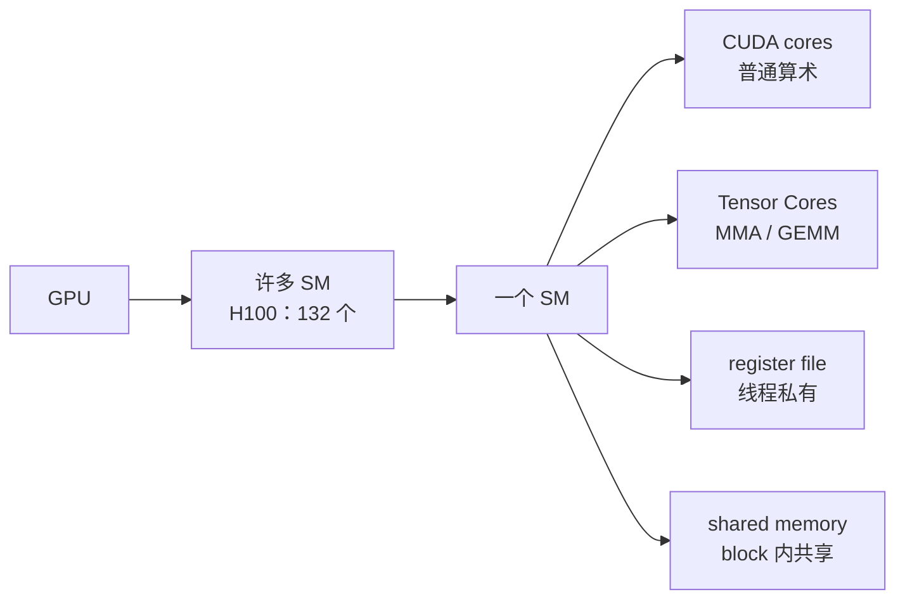
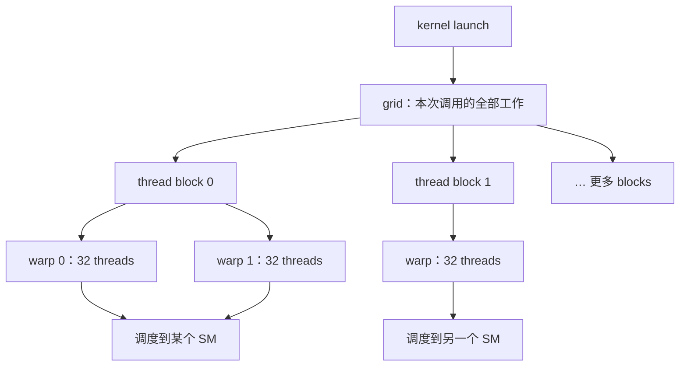
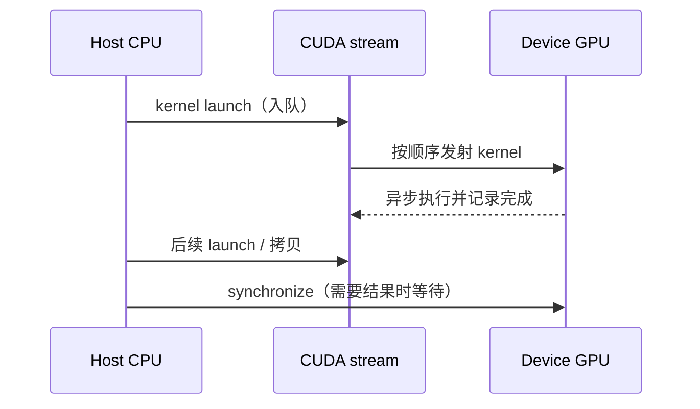

# L20 GPU体系结构入门：从 CPU 到 SIMT

> [!abstract] 本课速览
> 读完你将能够：
> 1. 说清 CPU 的 **latency-oriented**（时延导向）和 GPU 的 **throughput-oriented**（吞吐导向）为何是两套设计哲学；
> 2. 沿着 **kernel** → **grid** → **thread block** → **warp** → **thread** 解释一个 GPU 程序怎样落到 **SM**（streaming multiprocessor，流式多处理器）上；
> 3. 用 **SIMT**、**warp divergence**、**occupancy** 和 **latency hiding** 读懂论文里的 GPU 性能描述；
> 4. 估算一次矩阵乘的并行规模，以及很多小 **kernel launch** 为什么会把 decode 拖慢。
>
> 前置：[[L04 神经网络与前向传播]]（知道 GEMM 是神经网络的主角即可） · 预计 45 分钟

## 论文里的这段话，你现在可能读不懂

> [!quote]
> “A GPU **kernel** is launched as a **grid** of **thread blocks**. Each block is scheduled onto one **SM**, where 32-thread **warps** execute in a **SIMT** fashion. Sufficient **occupancy** lets the SM switch among ready warps to hide memory latency; divergent branches serialize execution within a warp。”（改写自典型 CUDA 论文表述）

这段话没有在讨论某个模型结构，而是在描述模型算子怎样变成硬件上的工作：函数先被 launch，工作被拆成 blocks，blocks 被放到 SM，SM 再以 warp 为单位推进线程。读完本课回来看，`grid`、`warp`、`occupancy` 和 “hide latency” 都会变成可以画出来、算一算的东西。

## 一、为什么 GPU 快：两种“做题组织方式”

先回忆 [[L04 神经网络与前向传播]]：一个线性层的主体是 GEMM，大量输出元素之间几乎互不依赖。假如要批量算一百万道相似的题，最合适的策略通常不是让一个人把一百万道题做完，而是让很多人同时做。

### CPU：少数强核，先把一件事做完

CPU 面向的是 **latency-oriented**（时延导向）：希望一个线程的单次响应尽快完成。它通常把晶体管预算放在少量但复杂的核心、大缓存、分支预测和乱序执行上。网页请求、操作系统控制流、带很多 `if/else` 的程序，都受益于这种“先把这一件事办利索”的组织方式。

### GPU：很多相似的小工作一起完成

GPU 面向的是 **throughput-oriented**（吞吐导向）：希望单位时间完成尽可能多的相似工作。它把更多面积交给算术单元和高带宽数据通路，单个线程未必比 CPU 线程强，但可以同时推进成千上万个线程。可以把它想成：CPU 是一位经验丰富的教授逐题解答，GPU 是一千名训练有素的学生各做一小片，而且题目最好长得相似。

| 维度 | CPU | GPU |
|---|---|---|
| 主要目标 | 单个任务尽快结束（latency-oriented） | 总工作量尽可能大（throughput-oriented） |
| 资源组织 | 少量复杂核心、大缓存、强控制流 | 大量相对简单的执行单元、高带宽 |
| 最擅长的工作 | 分支多、依赖复杂、串行控制 | GEMM、逐元素算子等大量相似并行工作 |
| 代价 | 并行规模有限 | 分支分歧、同步和小任务 launch 可能很昂贵 |

这里的“GPU 快”是有前提的：如果工作本身有严格的顺序依赖，或者每次只做很小的一点事情，GPU 的并行资源可能还没热起来，CPU 反而更合适。

> [!tip] 直觉
> GPU 不是把一个学生变成超级学生，而是让足够多的学生同时做相似的题；AI 系统要做的是把工作切得足够均匀、把学生一直喂饱。

## 二、硬件心智图：SM 是 GPU 的“班级”

一块数据中心 GPU 可以看成许多 **SM (streaming multiprocessor)**（流式多处理器）的集合。按照本课程统一口径，H100 有 132 个 SM。每个 SM 内有几类关键资源：

- **CUDA core**（CUDA 核心）：执行通用的标量/向量浮点和整数运算，是大量普通线程的算术工位；
- **Tensor Core**（张量核心）：专门做小块矩阵乘累加（MMA）的硬件单元，GEMM 和 Transformer 的大部分高吞吐计算会尽量使用它；本课先认出它，按 dtype 的峰值和效率留到 [[L22 算力度量与MFU]]；
- **register file**（寄存器堆）：给线程保存最常用的临时值，速度快但容量有限；
- **shared memory**（共享内存）：同一 block 内线程可协作访问的片上 SRAM。内存层级和带宽差异见下一课 [[L21 GPU内存体系]]。

“SM 是 GPU 的班级”这个类比有两个重要含义。第一，一个 thread block 会整体被放进一个 SM，不会拆成半个 block 分散到多个 SM；第二，同一个 kernel 的不同 blocks 彼此尽量独立，硬件可以把它们动态安排到有空位的 SM 上。因此，程序员通常指定“有多少 blocks”，而不是手工指定“block 7 必须去 SM 3”。

## 三、软件层级：`kernel → grid → block → warp → thread`

### 1. kernel 与 kernel launch

**kernel**（GPU 内核）是一个在 GPU 上执行的函数。它不是 OS kernel，也不是卷积里的 kernel/filter；在论文和 profiler 中，kernel 通常指一次具体的 GPU 计算任务，例如一个矩阵乘、一个 softmax 或一个 fused operation。CPU 端发出执行请求的动作叫 **kernel launch**（内核发射）。

一次 launch 会告诉 GPU：使用哪个函数、处理哪些输入、开多少 blocks，以及每个 block 有多少 threads。GPU 接到请求后异步执行；CPU 不一定要等它完成才能继续准备下一项工作。

### 2. grid、thread block、thread

一次 kernel launch 的全部 blocks 叫 **grid**（网格）。grid 是这次函数调用的完整工作范围，例如“把输出矩阵的所有元素都算一遍”。grid 被切成若干 **thread block**（线程块），每个 block 是一组可以协作、可以使用 shared memory、也可以在 `__syncthreads()` 处同步的 threads。

最小的逻辑执行单位是 **thread**（线程）。在“每个输出元素由一个线程负责”的教学映射里，一个 $4096\times4096$ 输出矩阵就对应约 $1.68\times10^7$ 个逻辑线程；真实高性能 GEMM 会让线程以 tile 为单位搬运和复用数据，不是简单地一线程一元素，但这个映射足以建立并行度直觉。

### 3. warp 与 SIMT

GPU 不会把每个 thread 当作完全独立的 CPU 线程来调度，而是把 32 个 threads 组成一个 **warp**（线程束），以 warp 为粒度发射指令。**SIMT**（Single Instruction, Multiple Threads，单指令多线程）表示：一条指令通常由一个 warp 的多条线程同时执行，每条线程仍保留自己的寄存器和数据索引。

这里的映射关系要反过来记：**block 是 SM 的调度单位，warp 是 SM 内的发射单位，thread 是程序逻辑单位**。一个 block 可能包含多个 warps；一个 SM 同时驻留多个 blocks/warps，具体数量受寄存器、shared memory 和硬件上限共同限制。

### 4. warp divergence：同一班学生分成两队

如果一个 warp 内的 threads 走相同分支，SIMT 很高效；如果一半线程进入 `if`、另一半进入 `else`，就发生 **warp divergence**（warp 分歧）。硬件通常先执行满足 `if` 的线程、屏蔽另一半，再执行 `else` 的线程，结果是两条路径被串行化。线程数没有减少，但有效并行度下降了。

因此“GPU 有很多线程”不等于“任意代码都能线性加速”。规则很简单：让相邻线程尽量做相似的事、访问相近的数据，把不可避免的分支放到 warp 之间而不是 warp 内部。

## 四、GPU 不怕慢内存：latency hiding 与 occupancy

一次从较慢内存读取数据，可能要等一段时间。CPU 常用大缓存和乱序执行减少这种等待；GPU 的典型办法是准备很多可运行的 warps。当 warp A 等内存时，SM 切去执行 warp B、C、D。等 A 的数据回来，再切回 A。

这叫 **latency hiding**（时延隐藏）：它没有让某一次内存读取变短，而是用别的 ready work 填充等待空档。对于分布式训练/推理来说，这正是“计算和数据搬运重叠”的硬件起点。

**occupancy**（占用率）是“SM 当前驻留的 active warps，相对于硬件允许的最大驻留 warps 有多少”的直观比例。occupancy 高，通常意味着有更多候选 warp 可以轮换，更容易隐藏访存时延；occupancy 低，某个 warp 一停，SM 可能就没有足够工作可做。

但 occupancy 不是越高越好，也不是性能本身：一个 kernel 可能因为每线程使用很多寄存器或 shared memory 而降低 occupancy，却通过数据复用得到更高速度；反过来，occupancy 100% 也可能只是“很多线程在等同一条慢链路”。读论文时把它当诊断信号，不要当最终成绩。

> [!warning] 常见误区
> - `nvidia-smi` 里的 GPU utilization 高，只说明某段时间有 kernel 在运行；它不等于 occupancy，更不等于 Tensor Core 的有效利用率。
> - occupancy 高不保证快。还要看访存是否合并、指令依赖、分支分歧、通信是否暴露，以及 kernel 本身是否足够大。
> - 一个 thread block 不会被拆到多个 SM；多个 blocks 才能在多个 SM 间展开并行。

## 五、从 CPU 发射到 GPU 完成：stream 与同步

GPU 计算不是“CPU 调函数、CPU 原地等待”的同步模型。典型路径如下：

这里 **host/device**（主机/设备）分别指 CPU 侧和 GPU 侧；**CUDA stream**（CUDA 流）是一个有序的命令队列。同一 stream 中的操作保持顺序，不同 streams 在资源允许时可能重叠。只有在读取结果、计时或显式同步时，host 才必须确认 device 已完成。GPU 计时如果忘记同步，就可能只量到“把任务放进队列”的时间；在 profiler 的 timeline 中，这类空档和同步点会在 [[L52 性能剖析与MFU核算]] 里正式练习。

每次 kernel launch 本身也有固定成本。按 [[03 约定与符号]] 的统一量级，kernel launch 约为 $3$–$10\ \mu s$。假设一个 decode step 机械地发射 1000 个很小的 kernels，仅发射成本就是：

> [!example] 算一算：小 kernel 的 launch 账
> 
> $$
> 1000\times(3\text{–}10\ \mu s)=3000\text{–}10000\ \mu s=3\text{–}10\ ms.
> $$
> 
> 这还没有算 kernel 真正执行和同步的时间。也就是说，单步 decode 可能被 launch 固定成本吃掉数毫秒。把多个操作融合成一个 kernel、使用 CUDA Graph，或减少不必要的同步，都是系统论文里常见的优化方向；CUDA Graph 的完整工程动机留到 [[L51 算子优化与FlashAttention]]。

## 六、算一算：一次 GEMM 到底有多“并行”

先只看 $4096\times4096$ 输出矩阵，不计 bias 和激活：

$$
4096\times4096=16{,}777{,}216\approx1.68\times10^7
$$

个输出元素。哪怕把它粗略看成“每个输出元素有一个逻辑线程”，也意味着千万级的独立工作。真实 GEMM 会把这些工作组织成 blocks 和 tiles，让线程复用输入数据，再交给 CUDA cores/Tensor Cores 做矩阵乘累加。

H100 有 132 个 SM（见 [[03 约定与符号]]）。常用教学估算按每个 SM 约 2,048 个 resident threads 计算：

$$
132\times2048=270{,}336\approx2.7\times10^5
$$

个线程可以同时处于“在飞”状态。这里的“在飞”不是说 27 万个线程每个都在同一纳秒执行一条指令，而是说它们的寄存器状态和调度资格可以驻留在 SM 上，等待轮换执行。真实上限还会被每线程寄存器用量、block 大小和 shared memory 占用压低；因此这个数是体感估算，不是性能保证。

这个数量级解释了 GPU 的哲学：它并非只有几个更快的核，而是有大量并行工作槽位。接下来 [[L21 GPU内存体系]] 会补上另一半故事：如果这些线程拿不到数据，再多的槽位也只能等待。

## 七、世代变化：算力涨得比带宽快，悬念留给 Roofline

把同一 dtype、同一 dense 口径放在一起，才能比较 GPU 世代。按 [[03 约定与符号]] 的教学速查值：

| GPU | BF16 稠密算力 | 显存带宽 | NVLink（双向合计） | 读表提示 |
|---|---:|---:|---:|---|
| A100 SXM 80GB | 312 TFLOPS | 约 2.0 TB/s | 600 GB/s | BF16/大规模训练成为常规目标 |
| H100 SXM | 约 989 TFLOPS | 3.35 TB/s | 900 GB/s | 增加 FP8 Tensor Core，132 SM |
| B200 | 约 2.25 PFLOPS | 约 8 TB/s | 1.8 TB/s | 更高算力、带宽和 scale-up 能力 |

V100 → A100 → H100 → B200 的主线不是“每一代所有东西同比变快”，而是算力、显存带宽和互联同时演进，但算力常常涨得比带宽更激进。于是越来越多算子会从“算不动”变成“数据喂不饱”：这正是 [[L23 Roofline模型]] 要用一张图回答的问题。

> [!tip] 读规格表的第一条规则
> 先固定 dtype，再确认 dense 还是 2:4 structured sparsity；最后注明带宽是单向还是双向。否则同一张卡可以被读成几台完全不同的“机器”。

## 八、把 GPU 结构接回分布式系统

在训练和推理系统里，GPU 体系结构不是孤立的硬件知识：

1. **kernel 边界就是性能分析边界**：profiler 看到的是一串 kernel、拷贝、同步和通信事件。一个看起来“只有一次矩阵乘”的模型层，实际可能被拆成多个 kernels。
2. **occupancy 与通信重叠**：当通信或访存正在等待时，SM 是否还有足够 ready warps，会影响计算能否填满空档；CUDA streams 是实现计算/通信重叠的控制入口之一。
3. **并行策略必须尊重硬件层级**：一个 block 内的合作适合 shared memory，一个 SM 内的 warp 调度适合细粒度算子优化，跨 GPU 的数据交换则进入 NVLink 或网络，不能靠“多开线程”解决。
4. **对研究方向的启发**：读 collective communication、拓扑感知调度或推理 serving 论文时，先问它优化的是哪一级——是 kernel 内的指令/访存、GPU 间的链路，还是跨节点的网络和调度。把这些层级混在一起，容易把“GPU utilization 高”误读成“系统已经高效”。

## 回到开头那段话

现在逐句回读：

1. “A GPU **kernel** is launched as a **grid** of **thread blocks**。”——CPU 发起一次 GPU 函数调用；这次调用的全部 blocks 组成 grid。
2. “Each block is scheduled onto one **SM**。”——一个 block 整体放进一个 SM，SM 用自己的 CUDA cores、Tensor Cores、寄存器和 shared memory 执行它。
3. “32-thread **warps** execute in a **SIMT** fashion。”——SM 以 32 个线程为 warp 发射指令；线程有各自数据，但尽量沿同一控制流前进。
4. “Sufficient **occupancy** lets the SM switch among ready warps to hide memory latency。”——驻留的 active warps 足够多时，某个 warp 等数据，SM 可以轮换到另一个 warp，这就是 latency hiding。
5. “Divergent branches serialize execution within a warp。”——warp 内分支不一致会被掩码分段执行，导致有效并行度下降。

所以这段话的核心不是背缩写，而是建立一条可追踪的路径：**CPU 发射 → grid 切 block → block 落 SM → warp 按 SIMT 执行 → 用更多 ready warps 隐藏等待**。

## 术语卡片

| 术语 | 中文 | 一句话解释 |
|---|---|---|
| SIMT | 单指令多线程 | 一个 warp 的多条线程通常共同执行一条指令，各线程仍有自己的寄存器和数据。 |
| SM (streaming multiprocessor) | 流式多处理器 | GPU 内负责驻留 blocks、调度 warps 并提供算术/片上存储资源的基本处理单元。 |
| CUDA core | CUDA 核心 | 执行通用标量/向量算术的 GPU 执行单元。 |
| Tensor Core | 张量核心 | 面向小块矩阵乘累加（MMA）的专用单元，Transformer GEMM 常用它。 |
| kernel | GPU 内核 | 在 GPU 上运行的一次函数/计算任务；不要与 OS kernel 或卷积核混淆。 |
| kernel launch | 内核发射 | CPU 把一次 GPU kernel 调用入队的动作，存在微秒级固定开销。 |
| grid | 网格 | 一次 kernel launch 中全部 thread blocks 的集合。 |
| thread block | 线程块 | 可被整体调度到一个 SM、可用 shared memory 协作的一组 threads。 |
| warp | 线程束 | 32 个 threads 组成的硬件发射与调度单位。 |
| thread | 线程 | kernel 中处理一个逻辑索引/数据片段的最小程序抽象。 |
| warp divergence | warp 分歧 | 同一 warp 的线程走不同分支，导致分支路径分段串行执行。 |
| occupancy | 占用率 | SM 上 active warps 相对可驻留上限的比例，是隐藏时延的诊断信号。 |
| latency hiding | 时延隐藏 | 一个 warp 等待内存时切换到其他 ready warps，用并行工作填补空档。 |
| CUDA stream | CUDA 流 | 保持操作顺序的 GPU 命令队列；不同 stream 可能在资源允许时重叠。 |
| host/device | 主机/设备 | 分别指 CPU 侧和 GPU 侧的执行与内存语境。 |
| latency-oriented | 时延导向 | 以尽快完成单个任务或请求为首要目标的设计取向。 |
| throughput-oriented | 吞吐导向 | 以单位时间完成更多总工作为首要目标的设计取向。 |

## 自测

1. CPU 的 latency-oriented 与 GPU 的 throughput-oriented 分别优先优化什么？各举一个适合的工作负载。
2. 一次 kernel launch 的 `grid`、`thread block`、`warp`、`thread` 与 SM 的关系是什么？
3. 为什么一个 thread block 不能被拆到两个 SM？这条规则给 shared memory 和同步带来什么好处？
4. 一个 warp 内 16 个线程走 `if`，另 16 个走 `else`，会发生什么？
5. occupancy 高为什么通常有帮助，但不能直接等同于高性能？
6. 按 [[03 约定与符号]] 的 kernel launch 量级，1000 个小 kernel 的固定发射成本是多少？
7. 读一篇训练或推理系统论文时，为什么要把 kernel、GPU 间通信和跨节点网络分开看？

> [!note]- 参考答案
> 1. CPU 优先缩短单任务时延，适合分支多、依赖复杂的控制流；GPU 优先提高总吞吐，适合大规模 GEMM 或逐元素并行。
> 2. kernel launch 产生一个 grid；grid 由 blocks 组成；每个 block 由 threads 组成，threads 以 32 个为一组形成 warps；blocks 被整体调度到 SM，warps 在 SM 内发射。
> 3. block 内线程需要共享 shared memory 并在同步点协作；拆开后无法用一个 SM 的片上资源保证这些语义。整体调度也让 blocks 之间保持简单、可扩展的独立性。
> 4. 发生 warp divergence。硬件通常先执行一条分支并屏蔽另一半，再执行另一条，路径被串行化，有效并行度下降。
> 5. 更多 active warps 给 SM 更多可轮换的 ready work，有助于 latency hiding；但寄存器/shared memory 压力、数据复用、访存和依赖链也决定性能，occupancy 只是诊断信号。
> 6. $1000\times(3\text{–}10\ \mu s)=3\text{–}10\ ms$，还不包括 kernel 真正执行和同步时间。
> 7. 它们处在不同层级：kernel 关注单 GPU 内的执行与访存，GPU 间通信受 NVLink/PCIe 影响，跨节点通信还受 NIC、交换机和拥塞影响。只有拆开测量，才能知道瓶颈在哪里。

## 延伸阅读

- 《Programming Massively Parallel Processors》第 1–3 章：用更完整的 CUDA 心智模型练习 grid/block/warp，先读执行模型，不必马上写复杂优化。
- NVIDIA H100 白皮书：看架构图和参数表，练习区分 SM、Tensor Core、显存带宽与互联带宽；数字以本课程 [[03 约定与符号]] 的统一教学口径为准。
- CUDA C++ Programming Guide 的 execution model 节：核对 kernel、thread hierarchy、warp divergence 和 stream 的正式定义。
- [[L21 GPU内存体系]]：下一课把本课的“线程在等数据”展开成寄存器、shared memory、L2、HBM 和 host memory 的层级账。

---
上一课：[[L19 实践-解剖迷你GPT]] ← · → 下一课：[[L21 GPU内存体系]]
