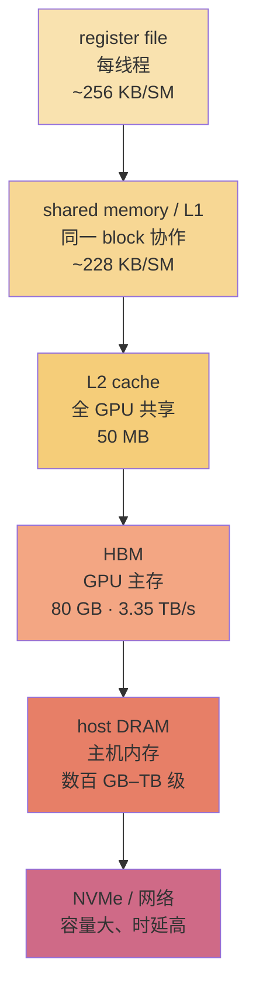
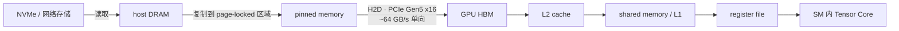

# L21 GPU内存体系：从寄存器到 HBM

> [!abstract] 本课速览
> 读完你将能够：
> 1. 按速度、容量和可见范围画出 GPU 的 **memory hierarchy**（内存层级），知道一个 tensor 离 Tensor Core 还有几道“搬运关”；
> 2. 用 H100 的统一口径估算一次显存扫描和一个 8B 模型 decode 的带宽上限；
> 3. 区分 **reserved** 与 **allocated**，读懂 PyTorch 的 CUDA OOM 信息，并判断什么时候是碎片而不是模型真的太大。
>
> 前置：[[L20 GPU体系结构入门]] · 预计 45 分钟

## 论文里的这段话，你现在可能读不懂

> [!quote]
> “The kernel keeps hot values in the **register file** and tiles operands through **shared memory**/L1. Reuse is caught by the chip-wide **L2 cache** before a request reaches HBM. If the tensor is not resident on the device, a **host-to-device copy** moves it from pinned **DRAM** over **PCIe**. A PyTorch **caching allocator** can report **OOM** even though `nvidia-smi` shows more memory **reserved** than tensors actually **allocated**。”（改写自典型 CUDA/PyTorch 表述）

这段话讲的不是“模型有多少参数”，而是同一批数据在不同存储位置之间旅行的成本。读完本课回来看，你能指出每一级的容量和带宽，也能解释为什么“明明还有 free，申请仍然失败”。

## 一、先建立世界观：搬数据比算数据贵

在 [[L20 GPU体系结构入门]] 中，我们把 SM 想成一间有很多学生的教室。本课要补上一个问题：学生的题目放在哪里？如果每道题都要跑到仓库取一次，教室再大也会空等；如果把常用题目放在桌面附近，计算单元才能持续工作。

这就是 **memory hierarchy**（内存层级）：越靠近计算单元，容量越小、延迟越低、带宽越高；越靠近存储介质，容量越大、但每次取数更慢。GPU 性能优化常常不是“再加几条乘法器”，而是让同一份数据在快层级里多用几次，少走几趟远路。

### 存储金字塔（H100 教学口径）

| 层级（从近到远） | 谁能看见 | 容量数量级 | 带宽/速度直觉 | 典型用途 |
|---|---|---:|---|---|
| **register file**（寄存器堆） | 单个 thread | 每 SM 约 256 KB | 片上、最快；线程直接读写 | 累加器、地址和临时值 |
| **shared memory (SRAM)**（共享内存） | 同一 thread block | 每 SM 约 228 KB（与 L1 共享片上资源，依配置而变） | TB/s 级片上带宽 | block 内 tile、线程协作 |
| **L1 cache**（一级缓存） | 一个 SM 附近的线程 | 与 shared memory 共用片上容量 | 自动缓存，访问模式决定命中 | 隐式复用近期数据 |
| **L2 cache**（二级缓存） | GPU 上多个 SM 共享 | 50 MB | TB/s 量级，低于片上层但高于 HBM 的单次远端访问 | 跨 SM 的缓存与数据复用 |
| **HBM**（高带宽内存） | GPU device | 80 GB | 3.35 TB/s | 模型权重、激活、KV cache 的主存 |
| 主机 **DRAM** | CPU/主机 | 数百 GB 到 TB 级 | 经过 I/O 通道，不能当作 HBM 用 | 数据集、offload 的暂存 |
| NVMe / 网络存储 | 主机和集群 | 更大 | 带宽较低、延迟更高 | checkpoint、数据供给、远端加载 |

相邻层级的峰值带宽通常相差接近一个数量级，但不要把表格读成“每次访问必然慢十倍”：缓存命中、访问是否连续、请求是否并发，都会改变实际结果。**容量**回答“能放多少”，**带宽**回答“每秒能搬多少”；延迟则回答“一次请求多久才有第一批数据”。三者不是同一个指标。



### 三个容易混淆的片上名词

1. **register file** 是线程私有的“草稿纸”。它不是一个可以随意扩容的数组；一个线程用太多寄存器，会减少同一 SM 能同时驻留的线程数，进而影响 [[L20 GPU体系结构入门]] 的 occupancy。
2. **shared memory** 是程序显式管理的 **SRAM**（静态随机存取存储器）。一个 block 的线程可以把 HBM 读来的 tile 放在这里，反复使用，避免每次都访问更远的层级。
3. **L1 cache** 自动猜测近期会再用的数据；**L2 cache** 是多个 SM 共享的更大缓存。它们不是“保证命中”的魔法：访问一次就丢、地址跳跃很大，缓存也救不了。

> [!tip] 一个实用类比
> register file 是手里正在算的数字，shared memory/L1 是小组桌面，L2 是教室公共书架，HBM 是楼下仓库，DRAM 是另一栋楼，NVMe/网络则像校外物流。优化的第一问永远是：这本书能不能留在桌面上多看几遍？

## 二、HBM 与带宽：每个 FLOP 能分到多少字节

**HBM**（High Bandwidth Memory，高带宽内存）把多层 DRAM die 垂直堆叠，并用很宽的接口贴近 GPU 封装。它比普通显存贵，原因不只是容量，还包括先进封装、堆叠良率和供应链产能；因此 HBM 往往是高端加速器的瓶颈资源。它仍然是“内存”，不是 Tensor Core 里的计算单元。

**memory bandwidth**（内存带宽）是单位时间可传输的数据量。按 [[03 约定与符号]] 的约定，H100 HBM 为 3.35 TB/s，BF16 稠密算力为约 989 TFLOPS。把两者放在一起：

$$
\frac{3.35\times10^{12}\ \text{Byte/s}}{989\times10^{12}\ \text{FLOP/s}}
\approx 3.39\times10^{-3}\ \text{Byte/FLOP}。
$$

这不是说每个 FLOP 真的只需要 0.003 字节，而是说：若每次计算都要从 HBM 取新数据，HBM 只能按这个“字节预算”喂计算单元。要接近 989 TFLOPS，必须让一字节数据支持许多次 FLOP，也就是 **data reuse**（数据复用）。正式的 arithmetic intensity/roofline 会在 [[L23 Roofline模型]] 定义；这里先留下直觉：**算力涨得快，喂数不够时，新增乘法器也只能等**。

### 算一算 1：整张 HBM 读一遍

把 80 GB 显存中的数据连续读一遍，使用理想峰值带宽估算：

$$
t=\frac{80\ \text{GB}}{3350\ \text{GB/s}}
\approx 0.0239\ \text{s}=23.9\ \text{ms}\approx24\ \text{ms}。
$$

在这 24 ms 内，H100 的 BF16 峰值计算预算约为：

$$
989\times10^{12}\ \text{FLOP/s}\times0.0239\ \text{s}
\approx2.36\times10^{13}\ \text{FLOPs}。
$$

> [!example] 算一算结果
> $80/3350\approx24$ ms；在相同时间里，989 TFLOPS 的 H100 理想上可执行约 $2.36\times10^{13}$ FLOPs。两者的差距提醒我们：如果数据不能复用，计算单元很容易在等 HBM。

所以“读完整张卡”与“做两万多亿次浮点运算”是同一段时间的两个侧面。实际 kernel 还会受到读写方向、缓存、指令、同步和访问模式影响；这个结果是上限量级，不是应用实测。

## 三、数据怎样到达 Tensor Core：host/device 通道

**host/device**（主机/设备）是两个内存语境：host 通常指 CPU 和主机 DRAM，device 指 GPU 和 HBM。一个 batch 从磁盘到计算单元，典型路径如下：



**PCIe**（Peripheral Component Interconnect Express）是 CPU、GPU、NIC 和其他设备之间的通用 I/O 总线。按本课程统一口径，PCIe Gen5 x16 约 64 GB/s，且这里写的是**单向**；它比 H100 HBM 的 3.35 TB/s 低约两个数量级。因此把权重频繁从 host DRAM 经 PCIe 拉进来，不能假装“扩展了显存”：容量变大了，带宽和时延却变成新的瓶颈。

### pinned memory 与异步拷贝

普通 host 内存允许操作系统换页。**pinned/page-locked memory**（固定/页锁定内存）则暂时保证物理页不被换走，GPU DMA 可以直接读写，因而适合高吞吐、可与计算重叠的传输。代价是它占用不可换出的主机资源；大量 pin 住内存会伤害整个系统，不能把所有数据都标成 pinned。

**host-to-device copy (H2D/D2H)** 是 host→device 和 device→host 拷贝的统称。H2D 把 batch 或权重送到 HBM，D2H 把结果、日志或 checkpoint 状态拉回 DRAM。使用 pinned memory、非阻塞拷贝和不同 **CUDA stream**，可以让“下一批数据的 H2D”与“当前批次的 kernel”重叠；但只有在依赖关系满足、并且 PCIe 没被其他设备争用时，重叠才会真的发生。

**GPUDirect** 是一组减少绕路的技术家族：P2P 让 GPU 之间直接访问对方显存，RDMA 让 NIC 与 GPU 内存协作，Storage 则探索存储设备直接把数据送入 GPU。它们的共同目标是少一次 host staging；具体拓扑、权限和协议留到 [[L25 节点内互联]]、[[L29 RDMA原理]] 和 [[L34 存储与数据供给]]。

**CXL**（Compute Express Link）是建立在 PCIe 物理层之上的高速互联协议族，强调 CPU、内存和加速器之间的缓存/内存语义协作。本课只记住它的定位：它可能让“扩展内存”更像共享内存，但并不自动把远端内存变成和 HBM 一样快，具体产品与软件支持仍在快速演化。

## 四、PyTorch 显存：`reserved` 不等于模型大小

GPU OOM 排查的第一步不是盯着一个数字，而是分清三种账：

- **allocated**：PyTorch 当前活跃 tensor 实际占用的字节，常由 `torch.cuda.memory_allocated()` 观察；
- **reserved**：PyTorch **caching allocator**（缓存分配器）向 CUDA 驱动申请后保留在池里的总量，包含当前 allocated 和可复用的空闲块，常由 `torch.cuda.memory_reserved()` 观察；
- `nvidia-smi`：按驱动视角看进程占用的 GPU 内存，通常包含 allocator 保留的缓存块，因此更接近 reserved，而不是“模型参数大小”。还可能包含 CUDA context、通信库和其他非 PyTorch 开销。

缓存分配器保留空闲块，是为了下一个 tensor 到来时直接复用，避免每一步都向驱动申请/释放。于是 `reserved - allocated` 很大并不一定是泄漏；它可能只是“已经向驱动要了、暂时闲着、以后能复用”的空间。

### 一个 OOM 报错的逐字段读法

下面是**示意**信息，数值只为说明字段，不代表某次真实运行：

```text
CUDA out of memory. Tried to allocate 1.00 GiB
(GPU 0; 80.00 GiB total capacity; 75.50 GiB already allocated;
2.00 GiB free; 78.00 GiB reserved in total by PyTorch)
```

1. `Tried to allocate 1.00 GiB`：这一次申请的连续块需要 1 GiB；
2. `total capacity`：设备总显存（本课 H100 口径为 80 GB；报错可能以 GiB 显示）；
3. `already allocated`：当前活跃 tensor 的已分配量，不含 allocator 的空闲缓存；
4. `free`：驱动当前能立即提供的空闲量；
5. `reserved in total by PyTorch`：缓存分配器向驱动保留的总量。

如果 `allocated` 已接近总容量，问题多半是模型、activation、KV cache 或 batch 真放不下；如果 `reserved` 明显大于 `allocated`，还要怀疑缓存和 **fragmentation**（内存碎片）。碎片的典型情形是：空闲空间加起来足够，但被切成许多不连续的小块，没有一块能满足这次大申请。`torch.cuda.memory_summary()` 能给出更细的块分布和峰值信息。

> [!warning] 三个常见误区
> - **误区 1：** `nvidia-smi` 的数字就是模型大小。它更接近进程/驱动已占用的 reserved 视角；模型参数、梯度、activation、KV cache 和上下文都可能在里面。
> - **误区 2：** `reserved` 大就一定泄漏。缓存本来就是为了复用；要结合 `allocated`、峰值和时间序列判断。
> - **误区 3：** 给 GPU 加 swap 就能解决 OOM。GPU 没有透明的、和 HBM 同语义的 swap；offload 必须由框架显式安排，并承担 PCIe 或网络的带宽/时延代价。

### 访存效率的一句话：memory coalescing

**memory coalescing**（合并访存）指一个 warp 的相邻线程尽量访问相邻地址，使硬件把请求合并成更少的内存事务。比如线程 0、1、2 读取连续元素通常比它们跳着读快；同一个 tensor，转置后的 layout 可能让“相邻线程访问相邻地址”变成相反情况。这里只建立诊断意识，不展开 CUDA tile 优化。

## 五、这套层级怎样影响训练与推理系统

对分布式训练和推理来说，内存位置就是系统设计的一部分，而不是 GPU 的内部细节：

1. **训练**：activation 是否留在 HBM，决定 checkpoint、activation recomputation 和 micro-batch 能否放大；下一模块会把这笔账展开为 [[L40 训练显存全解剖]]。
2. **推理**：8B 模型的 BF16 权重约 16 GB，decode 每生成一个 token 都要反复读取权重。若工作集主要落在 HBM，瓶颈首先是 bandwidth，而不是“还有多少 CUDA core”。[[L55 推理性能模型]] 会把这个下限与 KV cache、batch 联系起来。
3. **数据供给**：H2D 传输若没有与计算重叠，GPU 会在 kernel 之间空转；多卡系统还会进一步遇到 NVLink、NIC 和跨节点网络的层级差异。
4. **研究视角**：读系统论文时，先标注优化变量把数据放在哪一级、搬运经过哪条链路、复用发生几次，再看作者报告的是容量、带宽、延迟还是利用率。这样才能分辨“显存省了”与“端到端变快”不是一回事。

### 算一算 2：8B 模型 decode 的带宽上限

按 [[03 约定与符号]]，BF16 每参数 2 B。一个 8B dense 模型的权重体积为：

$$
8\times10^9\ \text{parameters}\times2\ \text{B/parameter}=16\times10^9\ \text{B}=16\ \text{GB}。
$$

先做一个偏理想但很有用的下限：每生成一个 token 至少把这 16 GB 权重从 HBM 读过一遍，不考虑 KV cache、输出写回、kernel 低效率和其他竞争。于是：

$$
t_{\text{weight}}=\frac{16\ \text{GB}}{3350\ \text{GB/s}}
\approx4.78\ \text{ms/token},
$$

$$
\text{tokens/s}\leq\frac{1}{0.00478}\approx209\ \text{tokens/s}。
$$

> [!example] 算一算结果
> 16 GB 权重 ÷ 3.35 TB/s ≈ 4.78 ms/token，所以理想带宽上限约 $1/0.00478\approx209$ tokens/s；KV cache、计算和调度都会把实际值压低。

这个 209 tokens/s 是**单卡、理想 HBM-only 权重流式读取上限**，不是服务承诺。真实 decode 还要读写 KV cache、执行 attention 和其他算子，并受到 batch、缓存命中、调度与同步影响，因此通常更慢。结论却很稳：当每个 token 的主要工作是“把大权重再读一遍”，量化、权重驻留和批处理会直接改变速度；只换更强的计算单元未必有帮助。

## 回到开头那段话

现在逐句回读：

1. “The kernel keeps hot values in the **register file** and tiles operands through **shared memory**/L1。”——最热的临时值留在线程寄存器；同一 block 反复使用的 tile 放到 shared memory，L1 则尝试自动缓存近期访问。
2. “Reuse is caught by the chip-wide **L2 cache** before a request reaches HBM。”——如果跨 SM 的数据复用能命中 L2，就少一次 HBM 往返；命不中才触及 80 GB 的 HBM 主存。
3. “If the tensor is not resident on the device, a **host-to-device copy** moves it from pinned **DRAM** over **PCIe**。”——host 的 DRAM 不是 GPU 显存；先用 page-locked/pinned 区域让 DMA 稳定搬运，再通过 PCIe 做 H2D。传输可以和计算重叠，但 PCIe 的约 64 GB/s 单向远低于 HBM。
4. “A PyTorch **caching allocator** can report **OOM** even though `nvidia-smi` shows more memory **reserved** than tensors actually **allocated**。”——PyTorch 为复用而保留缓存块；reserved 包含 allocated 和空闲块，碎片或一次大块申请都可能触发 OOM。`nvidia-smi` 的总量不能直接当作活跃 tensor 大小。

整段话的心智模型是：**数据离 SM 越远，搬运越贵；容量越大不代表带宽越高；OOM 先对账，再改模型。**

## 术语卡片

| 术语 | 中文 | 一句话解释 |
|---|---|---|
| memory hierarchy | 内存层级 | 从寄存器、片上 SRAM、缓存到 HBM、主机 DRAM 和存储介质的分层组织。 |
| register file | 寄存器堆 | 每个 thread 私有的最快片上存储，容量受限。 |
| shared memory (SRAM) | 共享内存（静态随机存取存储器） | 同一 block 的线程显式协作使用的片上存储。 |
| L1 cache | 一级缓存 | 靠近 SM、由硬件自动管理的缓存，常与 shared memory 共享片上资源。 |
| L2 cache | 二级缓存 | 多个 SM 共享的 GPU 缓存，位于 HBM 之前。 |
| HBM | 高带宽内存 | 通过堆叠和宽接口提供高显存带宽的 GPU 主存。 |
| memory bandwidth | 内存带宽 | 单位时间可传输的数据量，常用 GB/s 或 TB/s。 |
| DRAM | 动态随机存取存储器 | 主机内存和 HBM 的底层存储技术；主机 DRAM 容量大但离 GPU 更远。 |
| PCIe | 外设组件互连高速总线 | 连接 CPU、GPU、NIC 等设备的通用 I/O 通道。 |
| pinned/page-locked memory | 固定/页锁定内存 | 不被操作系统换页的 host 内存，适合 DMA 和异步拷贝。 |
| host-to-device copy (H2D/D2H) | 主机到设备/设备到主机拷贝 | 在 host DRAM 与 GPU HBM 之间搬运 tensor 的操作。 |
| GPUDirect | GPU 直连技术家族 | 通过 P2P、RDMA 或 Storage 等路径减少 host staging。 |
| CXL | Compute Express Link | 面向 CPU、内存和加速器协作的高速互联协议族。 |
| caching allocator | 缓存分配器 | 保留已申请的 GPU 内存块供后续 tensor 复用的分配器。 |
| reserved vs allocated | 保留量与活跃分配量 | reserved 是缓存池总量；allocated 是当前活跃 tensor 的量。 |
| fragmentation | 内存碎片 | 空闲总量足够但不连续，无法满足一次大块分配的状态。 |
| OOM | Out of Memory，内存不足 | 设备无法满足当前分配请求时抛出的错误。 |
| memory coalescing | 合并访存 | 让 warp 相邻线程访问相邻地址，以合并底层内存事务。 |

## 自测

1. 为什么 memory hierarchy 越靠近 SM 通常越快，却不能把所有数据都放在 register file？
2. shared memory、L1 cache 和 L2 cache 分别由谁共享或管理？
3. H100 的 HBM 带宽是 3.35 TB/s、BF16 稠密算力约 989 TFLOPS。每个 FLOP 对应的 HBM 字节预算约是多少？这说明了什么？
4. 用 H100 3.35 TB/s 带宽，完整读 80 GB HBM 需要多长时间？
5. `allocated=60 GiB`、`reserved=78 GiB`、报错显示 `free=2 GiB` 时，为什么仍可能申请失败？
6. pinned memory 为什么有利于异步 H2D，但不能无限使用？
7. 一个 8B 模型用 BF16 权重，理想情况下每 token 读 16 GB。按 3.35 TB/s，带宽上限约是多少 tokens/s？实际系统为什么更低？
8. 在分布式训练/推理论文中，看到“GPU memory usage 降低”时，还应追问哪两个端到端问题？

> [!note]- 参考答案
> 1. 越近容量越小，无法容纳完整模型或数据集；register file 还是线程私有资源，用太多会降低同一 SM 的并发。
> 2. shared memory 由程序显式管理、同一 block 共享；L1 由硬件自动管理、靠近单个 SM；L2 由多个 SM 共享。
> 3. $3.35/989\approx0.00339$ Byte/FLOP。若想接近算力峰值，必须让数据在片上或寄存器中复用，而不是每个 FLOP 都去 HBM 取数。
> 4. $80/3350\approx0.0239$ s，约 24 ms；这是连续读取且达到峰值带宽的理想估算。
> 5. reserved 中包含缓存空闲块；free 可能没有足够大的连续块，或申请还受碎片、CUDA context/通信库等额外开销影响。
> 6. page-locked 页可被 DMA 稳定访问并支持异步拷贝；但它占用不可换出的 host 资源，过量会挤压操作系统和其他进程。
> 7. $t=16/3350\approx4.78$ ms/token，$1/t\approx209$ tokens/s。真实 decode 还要处理 KV cache、其他算子、写回、调度、缓存命中和竞争。
> 8. 数据是否真的从 HBM/PCIe 搬运减少了、带宽/延迟和计算是否重叠；以及端到端吞吐、时延或 SLO 是否因此改善，而非只看 allocator 数字。

## 延伸阅读

- NVIDIA *CUDA C++ Programming Guide* 的 Memory Hierarchy 节：核对 register、shared memory、L1/L2、global memory 的正式语义；读到层级图即可。
- PyTorch *CUDA memory management* 文档：练习 `memory_allocated`、`memory_reserved`、`memory_summary` 的对账方法。
- [[L23 Roofline模型]]：把本课的“每 FLOP 只有多少字节”正式化为 arithmetic intensity 与带宽/算力上限。
- [[L25 节点内互联]] 与 [[L29 RDMA原理]]：继续追踪 GPU 间、GPU-NIC 间和跨节点的数据路径。

---
上一课：[[L20 GPU体系结构入门]] ← · → 下一课：[[L22 算力度量与MFU]]
