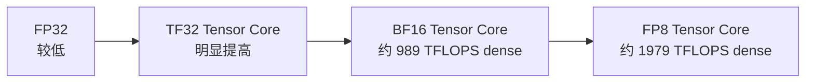
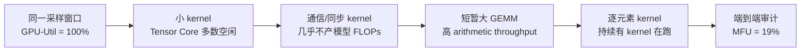

# L22 算力度量与MFU：从规格峰值到有效产出

> [!abstract] 本课速览
> 读完你将能够：
> 1. 按 dtype 与 dense/sparse 口径读 GPU 规格表，不再被“1979 TFLOPS”这样的裸数字带偏；
> 2. 解释大 GEMM 为什么能接近峰值，而小而瘦的 GEMM 为什么可能让 Tensor Core 吃不饱；
> 3. 区分 GPU utilization、HFU、MFU 与 SOL，并用吞吐报告独立复算 MFU。
>
> 前置：[[L20 GPU体系结构入门]] · [[L16 Scaling Law与算力账]] · 预计 45 分钟

## 论文里的这段话，你现在可能读不懂

> [!quote]
> “At BF16 precision, **peak FLOPS** should use the **dense Tensor Core** rate rather than the **2:4 structured-sparsity** rate. Large **GEMMs** can reach high **SOL**, while small **MMA** kernels may deliver low **arithmetic throughput** even when `nvidia-smi` reports 100% **GPU utilization**. We therefore report **MFU**, excluding rematerialized work that can inflate **HFU**。”（改写自典型训练系统与 profiler 表述）

这三句话故意把“硬件能做多少”“kernel 实际做了多少”“模型真正推进了多少”挤在一起。没有一套统一账本，你很容易把规格表峰值、`nvidia-smi` 的忙碌比例和模型有效产出都叫作“利用率”，最后得到一个无法比较的百分数。

## 一、峰值不是实测值：先分清 FLOPs 与 FLOPS

在 [[L16 Scaling Law与算力账]] 里，**FLOPs** 是工作量，例如训练一个 $N$ 参数 dense Transformer 处理一个 token 约需 $6N$ FLOPs；**FLOPS** 是速率，即每秒能完成多少次浮点运算。前者像“要搬多少箱货”，后者像“传送带每秒最多过多少箱”。TFLOPS 等于 $10^{12}$ FLOPS。

**peak FLOPS**（峰值浮点吞吐）是硬件在指定条件下的理论上限。完整条件至少包含：

1. GPU 型号与形态，例如 H100 SXM，而不是只写“H100”；
2. 运算格式，例如 FP32、TF32、BF16 或 FP8；
3. 执行单元与运算种类，例如普通 FP32 pipeline 还是 Tensor Core matrix multiply；
4. dense 还是启用了 2:4 structured sparsity；
5. 是否按厂商规定把一次乘加记作 2 FLOPs。

少写一项，数字就可能差两倍甚至一个数量级。**arithmetic throughput**（算术吞吐）则是程序实际交付的算术速率，例如某次 GEMM benchmark 报出的实测 TFLOPS。二者的比值才是某种“效率”，不能把实测速率也叫 peak。

### Tensor Core 到底专门做什么

[[L20 GPU体系结构入门]] 已经见过 **Tensor Core**（张量核心）：它不是一颗更快的通用 CPU core，而是面向小块矩阵乘累加的专用单元。其基本动作常写作 **MMA**（Matrix Multiply-Accumulate，矩阵乘累加）：

$$
D=A\times B+C。
$$

硬件一次接收几个小 tile，完成许多乘法与加法，再把结果累加到更高精度的 accumulator。大矩阵不会“一口吞下”，而是由库把它切成 tile，在线程、warp、shared memory 和 Tensor Core 之间流水执行。CUDA core 继续承担地址计算、控制逻辑、逐元素运算和部分通用浮点/整数运算；两类单元是分工，不是二选一。

Tensor Core 的 dtype 支持随代际扩展：V100 让 FP16 matrix math 成为主角，A100 加入 BF16 与 TF32，H100 加入 FP8，Blackwell/B200 又把 FP4 带进 Tensor Core 路线。这里先认“每换一种 dtype，峰值阶梯就变了”；指数位、尾数位和数值风险留到 [[L24 数值格式]]。Blackwell 的 FP4 支持可在 [NVIDIA NVFP4 技术说明](https://developer.nvidia.com/blog/introducing-nvfp4-for-efficient-and-accurate-low-precision-inference/) 中核对。

> [!tip] 一句话心智模型
> peak FLOPS 不是 GPU 的身份证号码，而是一道带五个限定词的条件题：**哪张卡、什么格式、哪类单元、dense 还是 sparse、怎样数 FLOP**。

## 二、读规格表：先找行，再看星号

### 同一张 H100，精度不同就是“不同的机器”

下图按 [[03 约定与符号]] 的教学口径画 H100 SXM 的峰值阶梯。统一表没有给出 FP32、TF32 的精确 dense 数字，因此这里仅标相对层级；BF16 与 FP8 才写入课内统一数值。

**TF32**（TensorFloat-32）是 Tensor Core 的计算模式，不是一个把 tensor 存成 3 字节的新 dtype；按本课程统一口径，存储仍按 FP32 的 4 B 记账。它让 FP32 工作流在 matrix multiply 上使用较低精度的乘法路径并以 FP32 累加，目标是少改代码就获得更高吞吐。精度更低通常意味着同面积能并行更多乘法，但这不保证模型数值稳定，也不保证程序真的跑到峰值。

### “1979 TFLOPS”到底要不要除以 2

**dense vs structured sparsity (2:4)**（稠密与 2:4 结构化稀疏）的区别在于：dense 路径处理全部权重；2:4 路径要求每组四个权重值中有两个为零，硬件只处理保留下来的两个非零值。在模型、权重布局、kernel 和硬件都支持时，它可以把标称 matrix throughput 提高约一倍。它不是“任何 dense 模型自动快两倍”，也不同于 [[L17 MoE混合专家]] 中每个 token 只激活部分 expert 的模型级稀疏。

[NVIDIA H100 产品规格页](https://www.nvidia.com/en-us/data-center/h100/) 当前把带星号的 Tensor Core 数字列为“with sparsity”。因此不能看到 1979 就机械地除以 2：

| 看到的规格项 | 它在说什么 | 本课程 MFU 分母 |
|---|---|---:|
| H100 BF16 `1979 TFLOPS*` | 2:4 sparse BF16 营销峰值 | 约 989 TFLOPS（BF16 dense） |
| H100 FP8 2:4 sparse（约为 dense 的 $2\times$） | 2:4 sparse FP8 营销峰值 | 约 1979 TFLOPS（FP8 dense） |
| 只看到裸数字 `1979 TFLOPS` | dtype 与星号都丢了，语义不完整 | ==不能直接作分母，先回原表== |

这也解释了开课问题中“1979 为什么打对折”的准确版本：==只有当它指 H100 的 BF16 sparse 一栏时，才应打对折得到 BF16 dense 约 989 TFLOPS；同一个 1979 也可能是 FP8 dense 值，此时不能再除以 2==。论文和本课程计算 MFU 一律使用与实际训练 dtype 匹配的 **dense**（稠密）峰值。

> [!warning] 三种规格表误读
> 1. 只抄最大数字，不抄 dtype 与星号；
> 2. 模型没有满足 2:4 约束，却把 sparse 峰值放进 MFU 分母；
> 3. 训练实际用 BF16，比较时却换成 FP8 峰值。分母变了，百分比当然也变了。

## 三、为什么 GEMM 最有机会接近峰值

**GEMM**（General Matrix Multiply，通用矩阵乘）通常写成：

$$
C=\alpha AB+\beta C,
$$

其中 $A$、$B$、$C$ 是矩阵。Transformer 的 linear layer、attention 投影和 FFN 都会落成大量 GEMM。它适合 Tensor Core，不只因为“乘法多”，更因为一个 tile 读入后能被反复复用：$A$ 的一块会和 $B$ 的多块配对，部分和能留在 register/shared memory 中累加，减少对 HBM 的往返。这接上了 [[L21 GPU内存体系]] 的核心直觉：数据越能在近处多用几次，计算单元越不容易饿。

**GEMM efficiency**（GEMM 效率）可写成：

$$
\eta_{\text{GEMM}}=
\frac{\text{实测 GEMM arithmetic throughput}}
{\text{同 dtype、同 dense/sparse 口径的 peak FLOPS}}。
$$

经过良好调优、维度足够大且形状较方的 GEMM，工程上常把约 80%–95% 峰值视为可达的高效区间，而不是每个 shape 的保证值；NVIDIA 的 [CUTLASS 文档](https://docs.nvidia.com/cutlass/latest/overview.html) 也用“接近理论峰值”描述高性能 device-wide GEMM。矩阵一旦变小或变“瘦”，效率会明显下降：

- tile 数太少，铺不满全部 SM；
- 边界与 padding 占比变大，做了不能转化为模型产出的工作；
- 数据复用变差，HBM 搬运先到上限；
- 单个 kernel 太短，约 3–10 µs 的 launch 固定开销变得显眼；
- dtype、维度对齐或 layout 不合适，库不能选到最理想的 Tensor Core kernel。

最典型的反例是低 batch decode：batch=1 的投影常是 matrix-vector 或很瘦的 GEMM。Tensor Core 的理论峰值没有变，但问题里没有足够并行工作，像给一条八车道高速只来一辆车。为什么“瘦”会落到访存一侧，[[L23 Roofline模型]] 会用 arithmetic intensity 正式回答。

> [!tip] 不要跨层比较
> GEMM efficiency 是一个 kernel/算子局部指标；MFU 是训练 step 的端到端模型指标。一个 GEMM 跑到 90%，不代表通信、数据加载和流水线气泡消失了。

## 四、别把几种“利用率”混成一个数

### GPU utilization：只问采样窗口里有没有 kernel

`nvidia-smi` 的 **GPU utilization**（GPU 忙碌时间占比）不是 Tensor Core 使用率。NVIDIA 的 [`nvidia-smi` 文档](https://docs.nvidia.com/deploy/nvidia-smi/index.html) 将它定义为：采样周期内，有一个或多个 kernel 正在执行的时间比例。它没有回答 kernel 占了多少 SM、发出了多少 MMA、做的是有用 GEMM 还是低吞吐逐元素操作。

因此 `GPU-Util=100%` 只说明采样窗口几乎始终有 kernel 在跑。一个持续运行、只用少量执行资源的 kernel 也能把它顶到 100%；此时 MFU 完全可能很低。它适合发现“GPU 明显空转”，不适合证明“GPU 已经高效”。

这是一张概念 timeline，不是某次 profiler 实测：小 kernel 把时间轴填满，所以 `nvidia-smi` 看见 100% busy；真正按模型账本计入的有效 FLOPs 只有 dense 峰值的 19%。[[L52 性能剖析与MFU核算]] 会用真实 timeline 找这些缝。

### MFU 与 HFU：有用工作和实际执行工作

**MFU**（Model FLOPs Utilization，模型算力利用率）回答：“硬件峰值中，有多少最终转化成模型 forward/backward 所需的有效 FLOPs？”按 [[03 约定与符号]]：

$$
\text{MFU}=
\frac{\text{实测全局 tokens/s}\times\text{每 token 模型 FLOPs}}
{\text{GPU 数}\times\text{单卡匹配 dtype 的 dense peak FLOPS}}。
$$

**HFU**（Hardware FLOPs Utilization，硬件算力利用率）则把硬件实际执行的 FLOPs 放进分子，其中可能包含 activation rematerialization/recomputation。重算确实让 Tensor Core 忙了，却没有让同一批 token 的“必要模型工作”变多，所以 HFU 会被抬高而 MFU 不会。PaLM 论文附录给出了一个清楚案例：同一次训练的 MFU 不计重算成本，而其 HFU 计入重算，因此后者更高；定义与算式见 [《PaLM: Scaling Language Modeling with Pathways》附录 B](https://jmlr.org/papers/volume24/22-1144/22-1144.pdf)。

> [!warning] “MFU 更诚实”不等于“重算一定坏”
> 重算用计算换显存，可能允许更大 batch，最终反而提高 tokens/s。正确判断是看端到端 MFU、吞吐和显存是否共同改善；错误做法是只用被额外重算灌高的 HFU 宣称系统更有效。

### SOL：某项资源离自己的上限还有多远

**SOL (speed-of-light)**（速度上限占比）是 profiler 常用语言。NVIDIA [Nsight Compute Profiling Guide](https://docs.nvidia.com/nsight-compute/ProfilingGuide/index.html) 的 SpeedOfLight section 会分别报告 compute、memory 等资源相对各自理论最大吞吐的 achieved percentage。于是可能出现 memory SOL 很高、compute SOL 很低：这不是矛盾，而是在说 kernel 已把 HBM 跑满，算术单元还在等数据。

| 指标 | 分子在数什么 | 适合回答 | 不能单独证明 |
|---|---|---|---|
| GPU utilization | 有 kernel 执行的采样时间 | GPU 是否明显空转 | Tensor Core 是否高效 |
| GEMM efficiency | 单个 GEMM 的实测 FLOPS | 这个矩阵形状跑得是否接近峰值 | 整个训练是否高效 |
| SOL | 某项资源的 achieved throughput | compute 或 memory 谁更接近上限 | 模型有效产出有多少 |
| HFU | 硬件实际执行的 FLOPs | 执行单元总体有多忙 | 其中多少是必要模型工作 |
| MFU | 模型有效 FLOPs | 训练吞吐转化成了多少有效算力 | 单个瓶颈具体在哪里 |

经验上，约 35%–45% 可作为优秀大规模训练的粗略阅读参照，MoE 往往更低；它不是跨模型通用的及格线。比较前仍要对齐 GPU、dtype、dense 峰值、序列长度、模型 FLOPs 公式、规模和吞吐统计边界。

## 五、算一算：三步审计一条训练报告

某报告称：一个 8B dense 模型在 1024 张 H100 SXM 上训练，全局吞吐为 $4\times10^6$ tokens/s。按题目使用 BF16，并采用 [[03 约定与符号]] 的 $6N$ 与 H100 BF16 dense 约 989 TFLOPS 口径。

> [!example] 第一步：把 token 吞吐换成有效模型 FLOPS
> 对 $N=8\times10^9$，每 token 训练工作量近似为：
> $$
> 6N=6\times8\times10^9=4.8\times10^{10}\ \text{FLOPs/token}。
> $$
> 全局有效算术速率为：
> $$
> P_{\text{model}}
> =4\times10^6\times4.8\times10^{10}
> =1.92\times10^{17}\ \text{FLOPS}
> =192\ \text{PFLOPS}。
> $$

> [!example] 第二步：算集群 BF16 dense 峰值
> $$
> P_{\text{peak}}
> =1024\times989\times10^{12}
> =1.012736\times10^{18}\ \text{FLOPS}
> \approx1013\ \text{PFLOPS}。
> $$

> [!example] 第三步：相除得到 MFU
> $$
> \text{MFU}
> =\frac{1.92\times10^{17}}{1.012736\times10^{18}}
> \approx0.1896
> \approx19\%。
> $$
> 结论：这套系统把约 19% 的 BF16 dense 理论峰值转成了模型有效工作，和约 35%–45% 的优秀大规模训练参考区间相比还有明显优化空间。若误用 BF16 sparse 的 1979 TFLOPS 作分母，会算成约 9.5%，把同一系统凭空贬低一半。

把这三步记成审计模板：==tokens/s × 每 token FLOPs → 有效 FLOPS；卡数 × 匹配 dtype 的 dense 峰值 → 集群峰值；两者相除 → MFU==。如果报告没有给全局还是单卡吞吐、训练 dtype、active parameter 口径或是否含 attention 修正，就先标“无法复算”，不要替作者猜。

### 峰值去哪了：把损失项交给后续课程

| 现象 | 为什么压低 MFU | 去哪里继续查 |
|---|---|---|
| 访存受限 | Tensor Core 等 HBM，peak arithmetic throughput 用不上 | [[L23 Roofline模型]] |
| 通信暴露 | collective 没有被计算覆盖，GPU 等待其他 rank | [[L52 性能剖析与MFU核算]] |
| kernel 太碎、launch 过多 | 固定发射开销与中间读写吞掉短 kernel 收益 | [[L51 算子优化与FlashAttention]] |
| pipeline bubble | 某些 stage 没有 micro-batch 可算 | [[L44 流水线并行]] |

对 MLSys×网络研究，MFU 的价值在于它把网络优化接回模型产出：一项 collective 调度工作即便链路利用率提高，只有当暴露通信减少并让 tokens/s 上升时，MFU 才会上升。反过来，MFU 只告诉你“总体还差多少”，不能定位是 HBM、kernel、网络还是流水线；定位仍需要 profiler、通信 trace 与消融实验。

## 回到开头那段话

现在逐句回读：

1. “At BF16 precision, peak FLOPS should use the dense Tensor Core rate rather than the 2:4 structured-sparsity rate。”——先锁定 BF16，再读星号；H100 的 BF16 sparse 1979 TFLOPS 不能直接作 MFU 分母，本课程取 BF16 dense 约 989 TFLOPS。
2. “Large GEMMs can reach high SOL, while small MMA kernels may deliver low arithmetic throughput even when `nvidia-smi` reports 100% GPU utilization。”——大而规整的 GEMM 能铺满 Tensor Core 并复用数据；小/瘦 kernel 即使把采样时间轴占满，也可能只动用少量算术资源。GPU utilization 说“有 kernel”，SOL 与 arithmetic throughput 才说“资源跑了多少”。
3. “We therefore report MFU, excluding rematerialized work that can inflate HFU。”——MFU 只把模型必要的 forward/backward FLOPs 当有效产出；HFU 会把重计算也算入硬件执行量，因此可以更高，却不代表每秒推进了更多 token。

整段话的审计次序是：==先把 peak 的条件写完整，再看 kernel 的局部效率，最后用 MFU 检查端到端有效产出==。

## 术语卡片

| 术语 | 中文 | 一句话解释 |
|---|---|---|
| Tensor Core | 张量核心 | 面向小块矩阵乘累加的 GPU 专用执行单元。 |
| MMA | 矩阵乘累加 | 以 $D=A\times B+C$ 为核心的小块 matrix 指令/运算。 |
| GEMM | 通用矩阵乘 | 形如 $C=\alpha AB+\beta C$ 的矩阵乘，是 Transformer 主要算术工作。 |
| peak FLOPS | 峰值浮点吞吐 | 指定 GPU、dtype、执行单元与 dense/sparse 条件下的理论最高 FLOPS。 |
| dense vs structured sparsity (2:4) | 稠密与 2:4 结构化稀疏 | dense 处理全部值；2:4 要求每四个权重中两个为零，可使用专门稀疏路径。 |
| TF32 | TensorFloat-32 计算模式 | FP32 工作流使用 Tensor Core matrix math 的计算模式，课内存储仍按 4 B。 |
| GEMM efficiency | GEMM 效率 | 单个 GEMM 实测 arithmetic throughput 与匹配口径 peak FLOPS 的比值。 |
| MFU | 模型算力利用率 | 模型有效 FLOPs 除以卡数乘单卡匹配 dtype 的 dense 峰值。 |
| HFU | 硬件算力利用率 | 硬件实际执行 FLOPs 相对峰值的比例，可能包含 activation 重计算。 |
| GPU utilization | GPU 忙碌时间占比 | `nvidia-smi` 采样周期内至少一个 kernel 在执行的时间比例。 |
| SOL (speed-of-light) | 速度上限占比 | profiler 中某项 compute/memory throughput 相对其理论最大值的比例。 |
| arithmetic throughput | 算术吞吐 | 程序实际每秒完成的算术操作速率，常以 FLOPS 表示。 |

## 自测

1. 为什么“这张 H100 有 1979 TFLOPS”是一句信息不完整的话？
2. Tensor Core、MMA 与 GEMM 三者分别处在哪个抽象层次？
3. 为什么大而方的 GEMM 通常比 batch=1 decode 的瘦 GEMM 更接近 peak FLOPS？
4. `nvidia-smi` 显示 `GPU-Util=100%` 时，为什么 MFU 仍可能只有 5%？
5. MFU 与 HFU 的分子有什么差异？activation recomputation 会怎样影响二者？
6. **计算题**：一个 8B dense 模型在 512 张 H100 上以 BF16 训练，全局吞吐 $2\times10^6$ tokens/s。按 $6N$ 与 989 TFLOPS dense 峰值，MFU 是多少？
7. 一个 kernel 的 memory SOL 很高、compute SOL 很低，最可能说明什么？
8. 一篇网络优化论文报告链路利用率提高，却没有报告 tokens/s。你还不能据此判断什么？应补哪项指标？

> [!note]- 参考答案
> 1. 缺 GPU 形态、dtype、Tensor Core/普通 pipeline、dense/sparse 与 FLOP 计数口径；1979 既可能指 H100 BF16 sparse，也可能指 FP8 dense。
> 2. Tensor Core 是硬件单元；MMA 是小块矩阵乘累加动作/指令；GEMM 是库与模型层面的大矩阵运算，由许多 tile/MMA 共同完成。
> 3. 大而方的矩阵能提供更多 tiles 铺满 SM，并让数据在 register/shared memory 中复用；瘦 GEMM 并行度和复用不足，launch/访存占比更高。
> 4. GPU-Util 只统计有 kernel 执行的时间，不看占用了多少算术资源或是否在做模型有效工作；持续运行的低吞吐 kernel 也能得到 100%。5% 是合法的构造例，不等于某次特定实测。
> 5. MFU 分子只含模型必要 FLOPs；HFU 分子可含硬件实际做掉的重计算。重计算会抬高 HFU，但不会直接增加 MFU 分子；它若改善 batch 与 tokens/s，才会间接提高 MFU。
> 6. 有效速率 $=2\times10^6\times6\times8\times10^9=9.6\times10^{16}$ FLOPS；峰值 $=512\times989\times10^{12}=5.06368\times10^{17}$ FLOPS；MFU $\approx18.96\%\approx19\%$。
> 7. 该 kernel 很可能是 memory-bound：数据搬运已接近上限，算术单元因等数据而未跑满；用 [[L23 Roofline模型]] 进一步验证。
> 8. 还不能判断模型端到端有效产出是否提高；应补全局 tokens/s，并在对齐 dtype、模型 FLOPs 与 dense 峰值后报告 MFU，同时检查尾延迟或 goodput 等任务目标。

## 延伸阅读

- [《PaLM: Scaling Language Modeling with Pathways》附录 B](https://jmlr.org/papers/volume24/22-1144/22-1144.pdf)：精读 MFU 算式以及 MFU/HFU 因 rematerialization 产生差异的例子。
- [NVIDIA H100 产品规格页](https://www.nvidia.com/en-us/data-center/h100/)：练习逐行找 dtype、星号和“With sparsity”脚注，再还原 dense 数值。
- [NVIDIA `nvidia-smi` 文档的 Utilization 节](https://docs.nvidia.com/deploy/nvidia-smi/index.html)：核对 GPU utilization 的采样时间语义，避免把它当 Tensor Core 百分比。
- [NVIDIA Nsight Compute Profiling Guide](https://docs.nvidia.com/nsight-compute/ProfilingGuide/index.html)：先读 SpeedOfLight section 的 compute/memory 定义；roofline 图留给下一课。
- [[L23 Roofline模型]]：把“为什么瘦 GEMM 喂不满 Tensor Core”正式写成 arithmetic intensity 与两条性能上限。

---
上一课：[[L21 GPU内存体系]] ← · → 下一课：[[L23 Roofline模型]]
