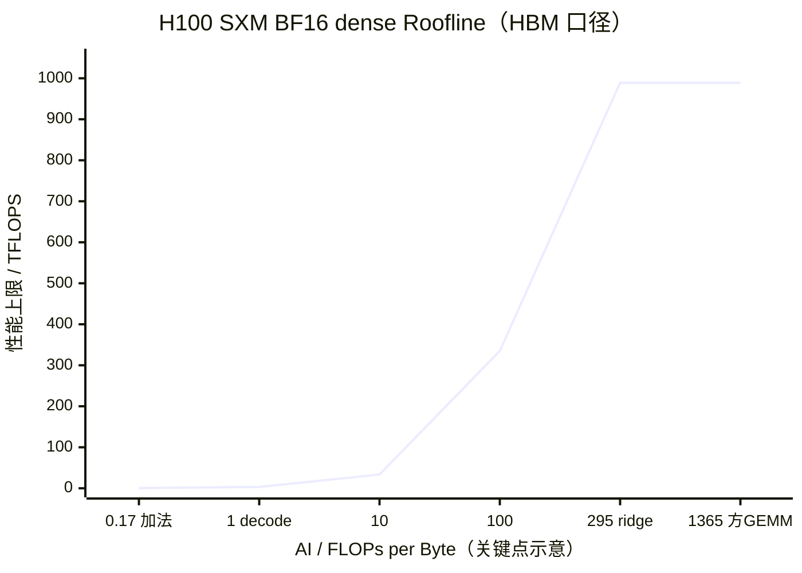
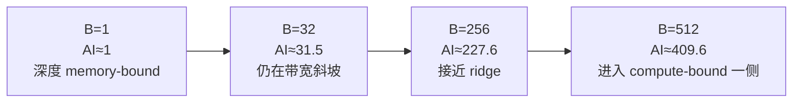

# L23 Roofline模型：用一张图找对优化方向

> [!abstract] 本课速览
> 读完你将能够：
> 1. 从 FLOPs 与 HBM 字节数算出 arithmetic intensity，并画出硬件 Roofline；
> 2. 用 ridge point 判断一个算子首先该优化计算还是访存；
> 3. 定量解释 decode、batching、kernel fusion、量化与投机解码为何有效；
> 4. 说清 Roofline 是性能上限模型，知道何时还必须打开 profiler。
>
> 前置：[[L21 GPU内存体系]] · [[L22 算力度量与MFU]] · 预计 50 分钟

## 论文里的这段话，你现在可能读不懂

> [!quote]
> “An **operator's** attainable throughput is bounded by the lower of peak compute and memory bandwidth times **operational intensity**. The **ridge point** separates the **memory-bound** region from the **compute-bound** region; increasing **data reuse** or using a **fused kernel** can move an **op** to the right. For **bandwidth-bound** decode, batching and lower-bit weights raise **arithmetic intensity**, whereas more peak FLOPS alone may not help.”（改写自典型 Roofline 论文与 profiler 表述）

这段话真正想说的不是“又多了一个性能指标”，而是：==先判断短板在哪，再决定把工程时间花在哪==。如果算术单元本来就在等 HBM，单纯增加 Tensor Core 峰值就像给缺原料的工厂再添生产线；机器更多，货车没变，产量不会跟着涨。

## 一、两个上限，取更低的那个

先把分析对象说清。**operator (op)**（算子）是计算图里的一个语义操作，例如 elementwise add、GEMM、softmax；GPU **kernel** 是实现这个操作、被发射到设备上执行的程序。一个 op 可以由多个 kernels 实现，多个 ops 也可以被合成一个 kernel，两者并不总是一一对应。

对一个 op，**roofline model**（屋顶线模型）只保留两条最硬的性能上限：

1. 算力屋顶：硬件最多提供 $P_{\text{peak}}$ FLOPS；
2. 带宽斜坡：HBM 每秒最多搬 $BW$ Byte，而每搬 1 Byte 能做 $I$ FLOPs，因此最多提供 $BW\times I$ FLOPS。

于是可达性能上限为：

$$
P_{\text{attainable}}
\leq
\min\left(P_{\text{peak}},\ BW\times I\right)。
$$

这里的 $I$ 是 **arithmetic intensity (operational intensity)**（算术强度 / 操作强度）：

$$
I=\frac{\text{完成该 op 的 FLOPs}}{\text{在选定内存边界上搬运的 Byte 数}},
\qquad [I]=\text{FLOPs/Byte}。
$$

本课默认分母是 HBM 与片上 cache/SRAM 之间的流量。原始 Roofline 论文特意用 operational intensity 指“每个 DRAM Byte 对应多少操作”，以区别早期按处理器—cache 流量定义的 arithmetic intensity；现代 GPU 文档常把 HBM 流量口径也称为 arithmetic intensity。读论文时不必争名字，但一定要问：==字节数算的是 HBM、L2、shared memory，还是网络？== 分母边界一换，点的位置就会变。

两条线交点的横坐标叫 **ridge point**（屋脊点）：

$$
I_{\text{ridge}}=\frac{P_{\text{peak}}}{BW}。
$$

按 [[03 约定与符号]]，H100 SXM 的 BF16 dense 峰值约为 $989\ \text{TFLOPS}$，HBM 带宽为 $3.35\ \text{TB/s}$。两者都按 SI 口径换成每秒：

> [!example] 算一算：H100 BF16 的 ridge point
> $$
> I_{\text{ridge}}
> =\frac{989\times10^{12}\ \text{FLOPS}}
> {3.35\times10^{12}\ \text{Byte/s}}
> \approx295.2\ \text{FLOPs/Byte}。
> $$
> 这意味着：一个 BF16 op 每从 HBM 搬 1 Byte，至少要做约 295 FLOPs，才有机会碰到 989 TFLOPS 的算力屋顶。低于这个数，先碰带宽斜坡；高于这个数，先碰算力屋顶。==295 FLOPs/Byte 是本课要记住的 H100 BF16 分界数==。

**memory-bound**（访存受限）表示性能主要被数据供给限制；若已经接近某条内存通路的可持续带宽上限，可更严格地叫 **bandwidth-bound**（带宽受限）。两者常被混用，但“访存慢”也可能来自访问不合并、依赖造成的 memory latency 或并行度不足，不一定真的把带宽跑满。**compute-bound**（计算受限）则表示算术吞吐先成为上限。

> [!tip] 一句话读图
> 从某个 AI 横坐标向上撞屋顶：撞到斜坡，就是“货运不够”；撞到平台，就是“生产线不够”。

## 二、把 Roofline 画出来

Roofline 的横轴是 AI，纵轴是可达 FLOPS，正规图中两轴通常都取对数。下面用 H100 BF16 dense 的课内统一口径画主图；受 Mermaid 分类轴限制，横向几何间距只是关键点示意，数字本身才是判断依据。纵轴是在对应 AI 处能碰到的理论屋顶，不是某次实测吞吐。

| 标本 | AI（FLOPs/Byte） | $BW\times I$ | 最先碰到 | 首要方向 |
|---|---:|---:|---|---|
| BF16 elementwise add | $≈0.17$ | $≈0.56$ TFLOPS | 带宽斜坡 | 少搬字节、fusion |
| batch=1 decode 瘦 GEMM | $≈1$ | $≈3.35$ TFLOPS | 带宽斜坡 | 复用权重、攒 batch、量化 |
| ridge point | $≈295$ | $≈989$ TFLOPS | 斜坡与屋顶相交 | 分界 |
| $4096^3$ 方 GEMM | $≈1365$ | $≈4574$ TFLOPS，超过算力屋顶 | 算力屋顶 | 提高 Tensor Core 效率或少算 |

图上“memory-bound 区”和“compute-bound 区”说的是==哪条理论上限更低==，不是说实测点一定贴在线上。若方 GEMM 的实测吞吐远低于屋顶，还可能是 shape、occupancy、依赖或 kernel 实现有问题；这时“compute-bound”不能翻译成“已经高效”。

## 三、三个标本：AI 到底怎么算

### 标本一：逐元素加法，算得少、搬得多

**elementwise operation**（逐元素操作）对每个元素独立执行同样的计算。以 $C=A+B$ 为例，每个元素做 1 次浮点加法，即 1 FLOP。

BF16 口径下，每个元素要从 HBM 读 $A$、读 $B$、写 $C$，共 $2+2+2=6$ Byte：

$$
I_{\text{add,BF16}}=\frac{1}{6}\approx0.167\ \text{FLOPs/Byte}。
$$

FP32 则是 $4+4+4=12$ Byte：

$$
I_{\text{add,FP32}}=\frac{1}{12}\approx0.083\ \text{FLOPs/Byte}。
$$

别被“只有 1 FLOP”骗成“肯定快”。对大 tensor，时间主要花在 HBM 往返，算术几乎像免费赠送。也正因为如此，把两个逐元素 op 分开发射，会把中间 tensor 写回 HBM再读出；合并后就有机会省掉这次往返。

### 标本二：方 GEMM，复用把点推到右边

考虑 BF16 的 $C=A\times B$，三个矩阵都是 $n\times n$。矩阵乘有约 $2n^3$ FLOPs；若 tiling 做得好，$A$、$B$ 各从 HBM 读一次，$C$ 写一次，最低数据量约为：

$$
2n^2+2n^2+2n^2=6n^2\ \text{Byte}。
$$

因此：

$$
I_{\text{square GEMM}}
\approx\frac{2n^3}{6n^2}=\frac{n}{3}。
$$

当 $n=4096$：

$$
I\approx\frac{4096}{3}\approx1365\ \text{FLOPs/Byte}>295。
$$

关键不是 GEMM “天生神奇”，而是 **data reuse**（数据复用）：同一块 $A$ 会与 $B$ 的多块相乘，同一块 $B$ 也服务于许多输出；数据进入 register/shared memory 后做很多次 MMA，才回到 HBM。像一车原料进厂后被加工上千次，而不是每拧一颗螺丝都重新去仓库取货。

这里算的是理想 HBM 流量。cache miss、边界 tile、layout 和中间结果读写都会增加实际字节数，把 operational intensity 向左拉；最终应由 profiler 的 DRAM bytes 复核。

### 标本三：decode 的瘦 GEMM，权重只用一次

单 token decode 的 linear projection 可抽象为：

$$
[1,d]\times[d,d]\rightarrow[1,d]。
$$

它做 $2d^2$ FLOPs。BF16 下，读输入向量 $2d$ Byte、读权重 $2d^2$ Byte、写输出 $2d$ Byte，总计 $2d^2+4d$ Byte：

$$
I_{B=1}
=\frac{2d^2}{2d^2+4d}
=\frac{d}{d+2}
\approx1\ \text{FLOP/Byte}。
$$

当 $d=4096$，$I\approx0.9995$。整个 $d\times d$ 权重矩阵从 HBM 搬来，只为一个 token 使用一次；3.35 TB/s 的带宽斜坡只允许约 $3.35$ TFLOPS，离 989 TFLOPS 的算力屋顶很远。这就是“decode 慢不是因为每步算太多，而是每步为很少的计算搬了很多权重”的定量版本。

> [!warning] AI 是“实现 + 数据流”的属性
> 不能只看数学表达式就给 op 贴永久标签。同一个 attention，是否物化 $S\times S$ score、是否 fusion、tile 多大，都会改变 HBM 字节数；同一个 GEMM，矩阵 shape 和 batch 也会改变 AI。

## 四、batch 是权重 AI 的放大器

把 $B$ 个请求的 token 一起做 projection：

$$
[B,d]\times[d,d]\rightarrow[B,d]。
$$

FLOPs 变为 $2Bd^2$，BF16 HBM 最低流量为权重 $2d^2$ 加输入/输出 $4Bd$：

$$
I(B)=\frac{2Bd^2}{2d^2+4Bd}
=\frac{Bd}{d+2B}
\approx B\quad(B\ll d)。
$$

原因很朴素：权重仍只需搬一遍，却同时服务 $B$ 行输入。对 $d=4096$：

令 $I(B)=295.2$，可解得理想分界约 $B\approx345$。这不是“batch 到 345 就一定满算力”的服务配置建议：真实请求有不同长度，kernel 形状、KV cache、调度等待和 SLO 都会改变结果。它只证明了一条非常重要的方向：==在权重占主导的 projection 中，攒 batch 能把同一份权重摊给更多 token，把点向右推==。

注意边界：多个请求各有自己的 KV cache，batch 不会让不同请求共享 KV 内容。因此 batching 对 weight GEMM 的复用最直接，对 decode attention 的 KV 流量不一定有同样的倍率收益。[[L57 连续批处理与调度]] 会把性能收益与排队时延放到同一张账里。

## 五、算一算：$S=8192$ 的 prefill 与单 token decode

现在只看一个 query head 及其对应的 K/V slice，取 [[03 约定与符号]] 中 Llama-3-8B 的 $d_{head}=d/h=4096/32=128$，序列长度 $S=8192$，BF16 每元素 2 Byte。为了让口径可复算，先忽略 softmax 的少量算术，并按“每个 Q head 独立拥有 K/V”的 MHA 等价基线记账，再明确区分“IO-aware fusion 的理想 compulsory traffic”和“物化 score 矩阵”的实现。

真实 Llama-3-8B 使用 GQA，4 个 Q heads 共享 1 个 KV head；若 kernel 兑现这份共享，decode attention 的 K/V 字节可由 4 个 Q heads 摊薄，下面的 AI 会从约 1 提高到接近 4。它仍远低于 295，因此不改变瓶颈判断；GQA 的结构细节见 [[L18 注意力变体与长上下文]]。

### Prefill：同一批 Q/K/V 参与大量配对

causal attention 只计算下三角，共 $S(S+1)/2$ 对。$QK^T$ 与 $PV$ 对每个有效位置对各做约 $2d_{head}$ FLOPs，总计算量为：

$$
F_{\text{prefill}}
\approx2S(S+1)d_{head}
=2\times8192\times8193\times128
\approx1.718\times10^{10}\ \text{FLOPs}。
$$

若 IO-aware 的 **fused kernel**（融合 kernel）通过 tiling 让 $Q,K,V$ 的块在片上复用，并避免把完整 score/probability 矩阵落回 HBM，那么仅按 $Q,K,V$ 各读一次、输出 $O$ 写一次的 compulsory traffic 下界为：

$$
M_{\text{prefill,min}}
=4\times S\times d_{head}\times2
=8\times8192\times128
=8{,}388{,}608\ \text{Byte}。
$$

> [!example] 算一算：prefill 的理想 AI
> $$
> I_{\text{prefill,ideal}}
> =\frac{2S(S+1)d_{head}}{8Sd_{head}}
> =\frac{S+1}{4}
> \approx2048\ \text{FLOPs/Byte}。
> $$
> 它显著高于 H100 BF16 的 ridge point 295，因此长序列 prefill attention ==有足够的数据复用潜力进入 compute-bound 一侧==。但 2048 是 compulsory-traffic 上界，不是对真实 kernel 的测量；片上 SRAM 放不下全部 Q/K/V，实际 tiling 会重读部分块，profiler 中的 AI 会更低。

为什么 fusion 是结论的一部分？若朴素实现把完整 $S\times S$ BF16 score 写到 HBM，之后 softmax 至少再读一次，仅这一次写和一次读就增加：

$$
2\times S^2\times2
=4S^2
=268{,}435{,}456\ \text{Byte}。
$$

即使只加这笔最保守的中间流量，AI 也降为：

$$
I_{\text{prefill,materialized}}
\lesssim
\frac{1.718\times10^{10}}
{268{,}435{,}456+8{,}388{,}608}
\approx62\ \text{FLOPs/Byte}，
$$

会落回 memory-bound 区。FlashAttention 的核心价值正是用 tiling 与 online softmax 减少 HBM 读写；所以严谨说法不是“prefill 天生 compute-bound”，而是“长 prefill 提供很高复用潜力，IO-aware 实现能把它兑现”。

### Decode：读完整 KV，只算当前一行

单 token decode 时，当前 query 要与已有 $S$ 个 key 做点积，再用权重汇总 $S$ 个 value。计算量约为：

$$
F_{\text{decode}}
\approx4Sd_{head}
=4\times8192\times128
=4{,}194{,}304\ \text{FLOPs}。
$$

在上述 MHA 等价基线中，只算 K/V 的 BF16 读取就有 $4Sd_{head}=4{,}194{,}304$ Byte；再加 query 读取与输出写回 $4d_{head}=512$ Byte：

> [!example] 算一算：decode attention 的 AI
> $$
> I_{\text{decode}}
> \approx\frac{4Sd_{head}}{4Sd_{head}+4d_{head}}
> =\frac{S}{S+1}
> =\frac{8192}{8193}
> \approx1.00\ \text{FLOP/Byte}。
> $$
> 它远低于 295，属于深度 memory-bound：读完整 KV cache，只为当前 token 算一行输出。序列变长时，FLOPs 和 K/V 字节数一起线性增长，AI 仍接近 1；所以“少算”不自动等于“快”。

这个对照提前给出 [[L55 推理性能模型]] 的第一性原理：prefill 把许多 token 放在大矩阵里并行处理，存在高复用；decode 每步只有少量 query，却反复流过权重与 KV cache。服务系统的 batching、KV 管理和量化，都是在和这条数据流作战。

## 六、用 Roofline 秒答四个系统问题

### 1. 为什么 decode 慢？

batch=1 projection 的 AI 约为 1；单 token attention 读取整段 KV 后，在 MHA 基线下 AI 也约为 1，Llama-3-8B 的 4:1 GQA 共享可将后者提高到接近 4。它们仍远低于 H100 BF16 的 295，Tensor Core 大部分时间等数据。优化重点应先看权重/KV 字节数、batch 与内存访问，而不是只看总 FLOPs。

### 2. kernel fusion 为什么有效？

**fused kernel** 把多个 ops 合进一次 kernel，让中间值留在 register/shared memory，而不是每一步都写回 HBM再读出。FLOPs 可能几乎不变，分母的 HBM Byte 减少，AI 向右移动；[[L51 算子优化与FlashAttention]] 会把这个思路用于 attention。

### 3. 权重量化为什么能加速 decode？

若 decode 主要在搬权重，把 BF16 的 2 B/参数换成 INT8 的 1 B/参数，计算工作量近似不变而权重字节数约减半，AI 与带宽侧性能上限都可接近翻倍。这里的“接近”很重要：反量化、scale、kernel 支持和 KV 流量都会吃掉收益，详见 [[L58 量化推理]]。

### 4. 投机解码为什么有利可图？

普通 decode 每次让大模型验证一个 token，权重复用很差；投机解码先提出多个候选，再让大模型并行 verify 多个位置，相当于把瘦矩阵的行数做大。验证通过率足够高时，同一遍权重搬运推进多个 token，AI 上升；代价与失败路径留给 [[L59 投机解码]]。

对 MLSys × 网络研究，还可以把同一思路迁移到通信：若 collective 暴露在关键路径上，端到端上限可能由网络带宽/时延而不是 HBM 决定。经典单层 Roofline 不会自动画出这条“网络屋顶”，但 hierarchical Roofline 或扩展性能模型可以加入 HBM、NVLink、scale-out network 等多级 ceiling。

## 七、Roofline 不会替你做完性能分析

Roofline 是 upper-bound/bottleneck model，不是运行时间预测器。它没有自动计入：

- 约 3–10 µs 的 kernel launch 固定开销；
- 小 grid 铺不满 SM、occupancy 或指令吞吐不足；
- 数据依赖、同步、分支与 load latency；
- 多 kernel 串并行关系、CPU 调度与框架 overhead；
- NVLink、RDMA collective、pipeline bubble 与 straggler。

所以正确工作流是：先用 AI 和 ridge point 提出“访存还是计算”的假设，再用 profiler 测 achieved FLOPS、DRAM bytes、memory/compute SOL 和 timeline，最后看端到端 tokens/s、时延或 MFU 是否改善。[[L52 性能剖析与MFU核算]] 会完成这条证据链。

> [!warning] 三个常见误区
> 1. **“优化就是换算力更强的卡。”** 若只提高 peak FLOPS、带宽不变，memory-bound op 的 Roofline 上限不变；换卡是否有益要同时看带宽与 ridge point。
> 2. **“FLOPs 少就一定快。”** 省掉的计算若同时破坏 data reuse，AI 可能下降，wall-clock 反而不理想。
> 3. **“AI 就是 MFU。”** AI 是某个 op 在特定实现与内存边界下的 FLOPs/Byte；MFU 是整个训练系统的模型有效 FLOPS 占硬件 dense 峰值比例，见 [[L22 算力度量与MFU]]。

## 回到开头那段话

现在逐句回读：

1. “An operator's attainable throughput is bounded by the lower of peak compute and memory bandwidth times operational intensity。”——op 是计算图语义操作，kernel 是实现；Roofline 取算力屋顶 $P_{\text{peak}}$ 与带宽斜坡 $BW\times I$ 中更低者。operational intensity 在本课默认按 HBM Byte 计。
2. “The ridge point separates the memory-bound region from the compute-bound region; increasing data reuse or using a fused kernel can move an op to the right。”——H100 BF16 的分界约为 295 FLOPs/Byte。GEMM 通过 tile 复用数据，fusion 通过少写少读中间量，二者都能提高 AI；但落在哪一侧不等于已经贴近屋顶。
3. “For bandwidth-bound decode, batching and lower-bit weights raise arithmetic intensity, whereas more peak FLOPS alone may not help。”——batch 让一份权重服务多行输入，量化减少每个权重的 Byte；它们都针对 decode 的低 AI。若带宽不变，只抬高算力屋顶不会抬高斜坡上的性能上限。

你现在应该能把整段压成一句自己的话：==先数 FLOPs 和跨边界 Byte，用 ridge point 找到较低的屋顶，再优化真正卡住的资源==。

## 术语卡片

| 术语 | 中文 | 一句话解释 |
|---|---|---|
| roofline model | 屋顶线模型 | 用算力屋顶与带宽斜坡的较低者给出性能上限的瓶颈模型。 |
| arithmetic intensity (operational intensity) | 算术强度 / 操作强度 | 每跨选定内存边界搬 1 Byte 所完成的 FLOPs；本课默认 HBM 口径。 |
| ridge point | 屋脊点 | $P_{\text{peak}}/BW$，带宽斜坡与算力屋顶的交点。 |
| compute-bound | 计算受限 | 算力屋顶比带宽上限更低，性能首先受算术吞吐限制。 |
| memory-bound | 访存受限 | 数据访问而非算术工作成为主要性能限制。 |
| bandwidth-bound | 带宽受限 | 性能已主要受某条数据通路的可持续带宽限制。 |
| data reuse | 数据复用 | 数据搬到近端存储后参与多次计算，以摊薄 HBM 字节成本。 |
| operator (op) | 算子 | 计算图中的语义操作；它与 GPU kernel 不保证一一对应。 |
| elementwise operation | 逐元素操作 | 对 tensor 每个元素独立执行相同计算的 op。 |
| fused kernel | 融合 kernel | 在一次 kernel 中完成多个 ops，减少中间结果的 HBM 读写与 launch。 |

## 自测

1. 写出 Roofline 上限公式，并解释两项各自的单位。
2. 为什么 arithmetic intensity 的分母必须注明 HBM、L2、shared memory 或网络边界？
3. H100 BF16 dense 的峰值约 989 TFLOPS、HBM 带宽 3.35 TB/s。ridge point 是多少？AI=100 的 op 理论上先受什么限制？
4. BF16 的 $C=A+B$ 为什么 AI 约为 $1/6$，而不是 $1/4$？
5. 推导 BF16 方 GEMM 的 $I\approx n/3$。当 $n=1024$ 时，它在本课 H100 Roofline 的哪一侧？
6. 对 $d=4096$ 的 projection，分别计算 $B=1$ 与 $B=256$ 的理想 AI，并解释 batch 为什么能提高它。
7. 为什么“$S=8192$ 的 prefill attention 是 compute-bound”必须附带 IO-aware/fusion 的实现条件？
8. 一项优化让某 kernel 的 AI 从 1 提高到 2，但端到端 tokens/s 不变。列出两个 Roofline 未覆盖、值得继续检查的原因。

> [!note]- 参考答案
> 1. $P_{\text{attainable}}\le\min(P_{\text{peak}},BW\times I)$。前者单位是 FLOPS；后者为 Byte/s × FLOPs/Byte，约分后也是 FLOPS。
> 2. 不同层级实际搬运的 Byte 数不同，因而 AI 与对应带宽斜坡都不同；只报一个无边界的 AI 无法复算，也可能把 cache reuse 的收益藏掉。
> 3. $989/3.35\approx295.2$ FLOPs/Byte。AI=100 时带宽上限为 $3.35\times100=335$ TFLOPS，低于 989 TFLOPS，因此在 HBM Roofline 上 memory-/bandwidth-bound。
> 4. 每个元素读两个 BF16 输入共 4 B，还要写一个 BF16 输出 2 B，总计 6 B；1 FLOP/6 B=$1/6$。
> 5. FLOPs 约 $2n^3$，A/B 各读 $2n^2$ B、C 写 $2n^2$ B，共 $6n^2$ B，所以 $I\approx n/3$。$n=1024$ 时 AI 约 341，高于 295，理想口径下在 compute-bound 一侧，但实测仍可能低于屋顶。
> 6. $I(B)=Bd/(d+2B)$。$B=1$ 时 $4096/4098\approx0.9995$；$B=256$ 时 $256\times4096/(4096+512)\approx227.6$。权重矩阵只搬一遍却服务更多输入行，权重字节被多个 token 摊薄。
> 7. 若物化并反复读写 $S\times S$ score/probability，中间 HBM 流量会把 AI 从理想约 2048 拉到约 62 或更低；只有 IO-aware tiling/fusion 减少这笔流量，长 prefill 的复用潜力才可能兑现为 compute-bound 行为。
> 8. 例如 kernel launch/框架 overhead 占主导；小 grid、occupancy 或指令依赖限制算术吞吐；也可能瓶颈已经移到通信、其他 kernels、CPU 或排队。应结合 profiler timeline 与端到端指标定位。

## 延伸阅读

- [《Roofline: An Insightful Visual Performance Model for Multicore Architectures》](https://people.eecs.berkeley.edu/~kubitron/courses/cs252/handouts/papers/RooflineVyNoYellow.pdf)（Communications of the ACM，2009）：只需精读主图、上限公式与 ridge point；同时留意原文为什么采用 operational intensity 这个名字。
- [NVIDIA Nsight Compute Profiling Guide：Roofline Charts](https://docs.nvidia.com/nsight-compute/ProfilingGuide/index.html#roofline-charts)：看 profiler 如何定义横纵轴、achieved value 与 memory/compute 区域，把纸面估算接到实测。
- [Horace He《Making Deep Learning Go Brrrr From First Principles》](https://horace.io/brrr_intro.html)：用 factory/warehouse 直觉串起 compute、memory bandwidth、operator fusion 与 launch overhead，建议通读。
- [《FlashAttention: Fast and Memory-Efficient Exact Attention with IO-Awareness》](https://proceedings.neurips.cc/paper_files/paper/2022/hash/67d57c32e20fd0a7a302cb81d36e40d5-Abstract-Conference.html)（NeurIPS 2022）：先读摘要与 Figure 1，观察“FLOPs 不变、HBM IO 减少”如何把本课原则变成 attention kernel。

---
上一课：[[L22 算力度量与MFU]] ← · → 下一课：[[L24 数值格式]]
