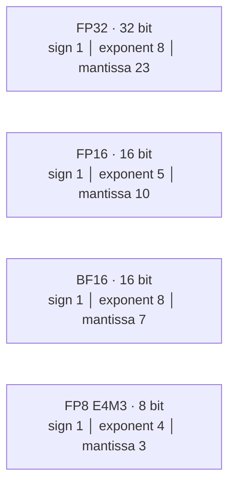
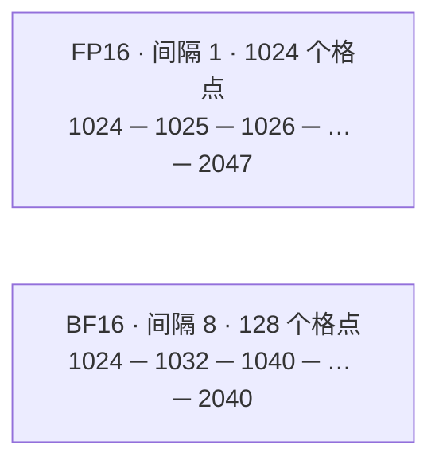

# L24 数值格式：精度是可以花的预算

> [!abstract] 本课速览
> 读完你将能够：
> 1. 从 sign、exponent、mantissa 的位数判断一个浮点格式的范围与精度；
> 2. 定量解释 BF16 为什么比 FP16 更粗，却通常更适合训练；
> 3. 区分 FP8 E4M3/E5M2、INT8/INT4、FP4 与 MXFP，知道 scale 放在哪一层；
> 4. 用权重字节数和 HBM 带宽估算低精度对 decode 的理想加速上限；
> 5. 识别 overflow、underflow、舍入累积，并解释为什么乘法输入很低精度、累加却常用 FP32。
>
> 前置：[[L22 算力度量与MFU]] · [[L23 Roofline模型]] · 预计 50 分钟

## 论文里的这段话，你现在可能读不懂

> [!quote]
> “Training uses **BF16** rather than **FP16** to retain FP32-like **dynamic range**, while Tensor Core products use FP32 **accumulation precision**. An FP8 recipe assigns **E4M3** to precision-sensitive forward tensors and **E5M2** to gradients that need more range, with **scale factors** keeping values representable. For inference, **per-group INT4 quantization** reduces weight traffic, but activation **outliers** can dominate the error.”（改写自典型 mixed-precision 与 quantization 表述）

这段话把格式、训练稳定性和系统性能挤在了一起。若只把 dtype 当成“保存文件时选 16 位还是 32 位”，就会看不懂三个问题：为什么同为 2 B 的 BF16 与 FP16 性格相反，为什么 FP8 有两种写法，以及为什么少几个 bit 能让 memory-bound decode 更快。本课先建立 dtype 字典；训练配方留到 [[L49 混合精度与FP8训练]]，推理量化算法留到 [[L58 量化推理]]。

## 一、浮点数就是二进制科学计数法

十进制科学计数法把 $-1234.5$ 写成 $-1.2345\times10^3$。二进制 **floating point**（浮点数）做同一件事，只是底数换成 2：

$$
x=(-1)^s\times 2^{E-\mathrm{bias}}\times\left(1+\frac{M}{2^m}\right)。
$$

- **sign**（符号位）$s$ 决定正负；
- **exponent**（指数位）$E$ 决定 $2$ 的幂，主要购买 **dynamic range**（动态范围），也就是多小到多大的量级能放下；
- **mantissa**（尾数位，也常叫 fraction/significand bits）$M$ 决定同一量级内能切多细，主要购买 **precision**（精度）。

这里的 bias 是把可正可负的指数平移成无符号编码。零、subnormal、Inf 和 NaN 使用特殊编码，不能直接套上式；但判断格式性格时，“指数管范围、尾数管格子密度”已经够用了。

> [!tip] 把 bit 当预算
> 指数位像地图能覆盖多少个数量级，尾数位像地图在一个街区里画得多细。固定总位数下，多给指数通常就要少给尾数：覆盖更广，但局部更糙。

### 位域分解：同样是“浮点”，预算花法不同

## 二、主表：从 FP32 到 FP4

下表的存储字节数遵循 [[03 约定与符号]]；浮点范围按 CUDA、OCP 规范取量级。最大值不是格式的全部动态范围，但足以先看出性格。硬件峰值必须绑定“哪张卡、哪种运算、dense 还是 sparse”；因此最后一列只抄 03 已登记的 H100/B200 dense 口径，“—”表示 03 尚未统一登记，不表示硬件不支持。[^cuda-float][^ofp8]

| 格式 | 位域或编码 | 存储 | 最大有限值 / 可用范围 | 典型角色 | 03 中的 dense 峰值示例 |
|---|---:|---:|---:|---|---:|
| **FP32** | 1s + 8e + 23m | 4 B | 约 $3.4\times10^{38}$ | 基准精度、参数主副本与累加 | — |
| **TF32** | 计算时约 1s + 8e + 10m | 存储仍 4 B | FP32 量级 | A100 起面向 FP32 工作流的 Tensor Core 计算模式 | — |
| **FP16** | 1s + 5e + 10m | 2 B | 约 $6.55\times10^4$ | 低精度训练/推理；范围较窄 | — |
| **BF16** | 1s + 8e + 7m | 2 B | 约 $3.4\times10^{38}$ | 训练常用；范围接近 FP32 | H100 约 989 TFLOPS；B200 约 2.25 PFLOPS |
| **FP8 E4M3** | 1s + 4e + 3m | 1 B | 约 $4.5\times10^2$ | 较重精度，常放 forward 权重/激活 | H100 约 1979 TFLOPS；B200 约 4.5 PFLOPS |
| **FP8 E5M2** | 1s + 5e + 2m | 1 B | 约 $5.7\times10^4$ | 较重范围，常放 backward gradient | 同上，03 以“FP8”合并登记 |
| **INT8** | 8-bit signed integer | 1 B | 256 个整数码；实数范围由 scale 决定 | 权重/激活量化 |
| **INT4** | 4-bit signed integer | 0.5 B | 16 个整数码；实数范围由 scale 决定 | 常见于 weight-only 量化 |
| **FP4 E2M1** | 1s + 2e + 1m | 0.5 B | 裸元素最大幅值约 6 | 通常必须配合细粒度 scale | — |
| **MXFP4** | 32 个 E2M1 元素共享 E8M0 scale | 约 0.5 B/元素，另有 scale 开销 | block scale 扩展局部范围 | Blackwell/B200 时代的原生 block-scaled GEMM 格式 | — |

**TF32**（TensorFloat-32）尤其容易误读：它不是“把模型存成 19 bit”的 dtype，而是 FP32 输入进入 Tensor Core matrix math 时采用 8 位指数、10 位尾数的计算模式，输出仍按 FP32 路径处理；所以显存记账仍是 4 B。它由 A100 世代引入，作用是让原有 FP32 工作流更容易用上 Tensor Core。[^tf32]

> [!warning] 位数不能单独推出速度
> dtype 只给出“有机会走哪条硬件路径”。真实峰值还取决于 GPU 世代、矩阵 shape、输入/输出与 accumulation dtype、dense/sparse 口径和 kernel 实现。表里的 H100 FP8 1979 TFLOPS 是 dense；不要把它和 H100 BF16 1979 TFLOPS 的 2:4 sparse 营销值混在一起，参见 [[L22 算力度量与MFU]]。

## 三、BF16 为什么比 FP16 更糙，却更适合训练

FP16 和 BF16 都占 2 B，但 15 个数值位的分法相反：

- FP16 用 5 位 exponent、10 位 mantissa：同一量级内切得细，但最大有限值只有约 $6.55\times10^4$；
- BF16 用 8 位 exponent、7 位 mantissa：范围与 FP32 同量级，但相邻可表示数离得更远。

FP16 训练里，大值可能 **overflow**（上溢）：结果超出格式上界，在支持 Inf 的 IEEE 格式和默认舍入下变成 $\pm\mathrm{Inf}$，继而污染 loss 或 gradient；很小的 gradient 可能 **underflow**（下溢），先进入 subnormal，继续变小后舍入为 0。经典 FP16 mixed-precision recipe 因而要用 loss scaling，把反向传播的数临时搬进可表示区间。BF16 保留 8 位指数后，通常不需要仅为了 FP16 狭窄范围而加这层补丁；这就是工程上“宁可局部糙一点，也不要动不动爆表”的选择。完整训练状态与 loss scaling 见 [[L49 混合精度与FP8训练]]。[^mixed-precision]

### 算一算一：在 $[1024, 2048)$ 里数格子

对任意有 $m$ 个 mantissa bits 的 normal 二进制浮点数，在区间 $[2^k,2^{k+1})$ 内，相邻可表示数的间隔是：

$$
\Delta=2^{k-m}。
$$

这里 $1024=2^{10}$，所以 $k=10$。

> [!example] FP16 与 BF16 的格子有多密
> FP16 有 $m=10$：
> $$
> \Delta_{\mathrm{FP16}}=2^{10-10}=1，
> $$
> 因而能表示 $1024,1025,1026,\ldots$，半开区间内共有 $1024/1=1024$ 个格点。
>
> BF16 有 $m=7$：
> $$
> \Delta_{\mathrm{BF16}}=2^{10-7}=8，
> $$
> 因而只能表示 $1024,1032,1040,\ldots$，半开区间内共有 $1024/8=128$ 个格点。
>
> 两者存储都为 2 B，BF16 在这里的间隔是 FP16 的 8 倍。==BF16 更糙，但靠 8 位 exponent 换来了 FP32 量级的范围。==

这也提醒你：**precision** 不是“小数点后固定几位”。浮点格子随 exponent 一起变大；数值翻到下一个 $2$ 的幂区间，绝对间隔也会翻倍。

## 四、FP8 不是一种格式，FP4 也不只是“再砍一半”

**FP8** 有两个常见变体：

- **E4M3** 用 4 位 exponent、3 位 mantissa，最大有限幅值约 448；格子较细，常用于 forward 的 weight 和 activation；
- **E5M2** 用 5 位 exponent、2 位 mantissa，最大有限幅值约 57344；格子更粗但范围更宽，常用于范围波动更大的 gradient。

Transformer Engine 的 hybrid recipe 就是 forward 用 E4M3、backward 用 E5M2。注意“常用于”不是数学定律：tensor 的分布、scale 策略和硬件 recipe 才决定最终选择。FP8 的裸范围仍不够覆盖所有 tensor，所以实际系统会给 tensor 乘上 **scale factor**（缩放因子），让它的最大幅值落进 FP8 格子，再在计算时恢复尺度。[^te-fp8]

继续缩到 **FP4** 时，单个 E2M1 元素只有 1 个 sign、2 个 exponent、1 个 mantissa bit，裸元素能表达的信息太少，scale 不再是可有可无的附件。**microscaling**（微缩放）/ **MXFP**（Microscaling Floating Point）把相邻的一小块元素绑在一起，共享一个 block scale；OCP 的 MXFP4 规定每 32 个 E2M1 元素共享一个 E8M0 scale。这样既保留约 4 bit/元素的主体，又允许不同 block 使用不同数量级。Blackwell/B200 时代的 Tensor Core 与软件栈开始原生支持这类 block-scaled GEMM。[^mx-spec][^blackwell-mx]

> [!warning] MXFP4 不等于 NVFP4
> 两者都使用 4-bit E2M1 元素，但 scale 层级和 block 大小不同。MXFP4 是 OCP microscaling 格式；NVIDIA 的 NVFP4 使用每 16 个元素一个 E4M3 block scale，并另配全局 FP32 scale。读论文或 kernel API 时必须写全名，不能只说“FP4”。

## 五、整数没有 exponent：scale 替它找回实数世界

**quantization**（量化）把连续浮点值映射到有限整数码。通用 affine 形式可以写成：

$$
q=\operatorname{clamp}\left(\operatorname{round}\left(\frac{x}{s}\right)+z, q_{\min},q_{\max}\right)，
$$

$$
\hat{x}=s(q-z)。
$$

其中 $s$ 是 scale factor，**zero point**（零点）$z$ 指定实数 0 对应哪个整数码；对称量化常取 $z=0$。**INT8** 有 256 个码，**INT4** 只有 16 个码；scale 决定这些码覆盖哪段实数轴，rounding 和 clipping 决定误差。[^tensorrt-quant]

同样重要的是“一把尺子管多大范围”，即 granularity（粒度）：

| 粒度 | scale 的数量 | 直觉 | 代价 |
|---|---:|---|---|
| **per-tensor** | 整个 tensor 1 个 | 全班共用一把尺 | 元数据少、实现简单；最怕分布差异 |
| **per-channel** | 每个 channel 1 个 | 每列/每输出通道一把尺 | 更贴合各通道范围；scale 与 kernel 更复杂 |
| **per-group** | 每组若干元素 1 个 | 每小组一把尺 | 常用于 LLM 权重；精度与元数据/解码开销折中 |

LLM 的 activation 或 weight 中常有少量 **outlier**（离群值）：大多数值挤在原点附近，少数值却很大。若 per-tensor scale 为了罩住最大 outlier 而拉宽，绝大多数普通值只能挤进少数几个整数格，舍入误差就会变大；若直接 clipping，outlier 本身又被截断。这是量化研究反复优化 granularity、校准、outlier 分流和 kernel 的原因。

“INT8 一定掉精度”因此不成立：恰当的校准、粒度与 kernel 可以让某些权重量化基本保持任务质量；但它也绝不是保证。格式只规定格子，数据分布与算法决定多少信息掉进格缝里。

## 六、格式即性能：同一份模型少搬多少字节

低精度常带来三笔收益：

1. **容量**：每参数字节数下降，同样显存能放更大的权重或更多 KV cache；
2. **带宽**：memory-bound 算子搬运字节减少；按 [[L23 Roofline模型]]，若其他流量可忽略，带宽侧上限随之提高；
3. **算力路径**：在支持的硬件上，Tensor Core 的低精度 dense 峰值更高。例如 [[03 约定与符号]] 中 H100 从 BF16 约 989 TFLOPS 到 FP8 约 1979 TFLOPS，接近 2 倍。

第三条不是所有 GPU、所有 shape 的普遍承诺，前两条也会被 scale 元数据、dequantization、KV 流量和 kernel overhead 打折。下面先算最干净的 roofline 上限。

### 算一算二：8B 模型的权重体积与 decode 上限

取 [[03 约定与符号]] 的 Llama-3-8B 统一例子，参数量 $N=8.0\times10^9$；dtype 字节数也全部取自 03。沿用 [[L23 Roofline模型]] 的 batch=1、weight-streaming 理想化模型：每生成 1 个 token，权重恰好从 HBM 读一遍；使用 H100 SXM 的 HBM 带宽 $BW=3.35\times10^{12}$ B/s。忽略 KV cache、activation、scale、kernel 和调度开销，则：

$$
M_{\mathrm{weight}}=N\times b_{\mathrm{dtype}},
\qquad
T_{\max}=\frac{BW}{M_{\mathrm{weight}}}。
$$

> [!example] 四种格式逐项复算
> | 格式 | 权重体积 | 理想 decode 上限 |
> |---|---:|---:|
> | FP32 | $8\times10^9\times4=32\times10^9$ B = 32 GB | $3.35\times10^{12}/(32\times10^9)\approx105$ tokens/s |
> | BF16 | $8\times10^9\times2=16\times10^9$ B = 16 GB | $3.35\times10^{12}/(16\times10^9)\approx209$ tokens/s |
> | FP8 | $8\times10^9\times1=8\times10^9$ B = 8 GB | $3.35\times10^{12}/(8\times10^9)\approx419$ tokens/s |
> | INT4 | $8\times10^9\times0.5=4\times10^9$ B = 4 GB | $3.35\times10^{12}/(4\times10^9)\approx838$ tokens/s |
>
> 从 FP32 到 INT4，理想上限提高 8 倍，因为权重字节恰好缩到 $1/8$。这不是“量化免费送 8 倍实测性能”，而是证明：==当权重带宽真是唯一瓶颈时，减少每参数字节数会按比例抬高 roofline==。真实系统还要为 scale 读取、unpack/dequantize、KV cache、非量化层和不理想 kernel 付“量化税”。

## 七、数值事故谱系：存得下，还要加得对

低精度的事故不只 overflow：

- overflow：结果超过最大有限值；IEEE FP16/FP32 可产生 Inf，后续运算可能继续变成 NaN；OFP8 E4M3 没有 Inf 编码，行为不能照搬这句话；
- underflow：结果小于 normal 范围，经过 subnormal 后可能舍入成 0，微小 gradient 因而消失；
- rounding error：每次运算把真实结果吸附到最近格点，长链条中误差可能累积；浮点加法也不满足严格结合律。

这解释了 **accumulation precision**（累加精度）为何常高于乘法输入精度。GEMM 的一个输出元素是很多乘积的和：

$$
C_{ij}=\sum_k A_{ik}B_{kj}。
$$

若 $A,B$ 用 BF16/FP16 提高吞吐和降低流量，每个乘积已经带有输入舍入误差；再把成千上万项直接累加到短 mantissa，较小项可能不断被大部分和“吃掉”。因此常见 Tensor Core 路径让低精度输入相乘、在 FP32 accumulator 中求和。高 accumulation precision 不能恢复输入量化时已经丢失的信息，但能减少求和阶段继续丢信息。Google 的 BF16 说明也明确以 BF16 乘法、FP32 累加为典型路径。[^bf16]

> [!warning] 三个常见误区
> 1. **“BF16 和 FP16 一样，反正都是 2 B。”** 容量相同；BF16 买范围，FP16 买局部精度，数值行为完全不同。
> 2. **“精度越高越好。”** 高精度会花更多容量、带宽和可能的算力时间；若任务质量不受影响，多出来的 bit 只是未产生收益的预算。
> 3. **“换成低 bit 就按字节数线性加速。”** 只有瓶颈确实是相应数据流、且硬件/kernel 能高效消费该格式时才接近；否则 scale、反量化或其他流量会接管瓶颈。

## 八、把 dtype 读成系统设计变量

以后在论文里看到“BF16 training”“FP8 communication”或“INT4 weight-only”，不要只记一个位数。按下面五问拆开：

1. 低精度放在哪里：存储、网络传输、乘法输入，还是 accumulator？
2. 格式是什么：E4M3/E5M2、signed INT4，还是带 block scale 的 MXFP4？
3. scale 的 granularity 是 per-tensor、per-channel 还是 per-group？scale 本身占多少流量？
4. 省下的是 HBM、NVLink/网络字节，还是 Tensor Core 周期？原瓶颈是否真的在这里？
5. 正确性证据是什么：训练 loss、收敛、任务质量、overflow 统计，还是只有 microbenchmark 吞吐？

这五问把数值格式接回 MLSys × 网络：低精度不仅压显存，也可以压 collective 或跨节点传输量；但通信前后的 cast/scale、不同 rank 的 amax 同步以及误差对收敛的影响都要进端到端账。==格式不是孤立的数学细节，而是容量、带宽、算力与正确性之间的一份预算合同。==

## 回到开头那段话

现在逐句回读：

1. “Training uses BF16 rather than FP16 to retain FP32-like dynamic range, while Tensor Core products use FP32 accumulation precision。”——BF16 与 FP32 都有 8 位 exponent，范围同数量级；它牺牲 mantissa 精度换训练稳定性。低精度输入负责省字节、走快路径，FP32 accumulator 减少长求和的额外舍入损失。
2. “An FP8 recipe assigns E4M3 to precision-sensitive forward tensors and E5M2 to gradients that need more range, with scale factors keeping values representable。”——E4M3 多 1 位 mantissa，格子较细；E5M2 多 1 位 exponent，范围较宽。scale 先把 tensor 搬进有限的 FP8 数轴，二者不是无需配方就能直接替换 BF16。
3. “For inference, per-group INT4 quantization reduces weight traffic, but activation outliers can dominate the error。”——INT4 把每参数主体降到 0.5 B，weight-bound decode 的理想带宽上限相对 BF16 可达 4 倍；per-group 给不同小组不同尺子，减少被 outlier 拉坏的格子分配，但仍要付 scale、反量化和质量误差的代价。

你现在应该能把整段压成一句自己的话：==exponent 决定能装多广，mantissa 决定能切多细，scale 决定低 bit 格子放在哪里，而系统设计决定省下的 bit 能否变成真实性能。==

## 术语卡片

| 术语 | 中文 | 一句话解释 |
|---|---|---|
| floating point | 浮点数 | 用 sign、exponent 与 mantissa 表示跨数量级实数的二进制科学计数法。 |
| sign | 符号位 | 决定数值正负的位域。 |
| exponent | 指数位 | 决定 2 的幂，主要控制 dynamic range。 |
| mantissa | 尾数位 | 描述同一指数区间内的细分位置，主要控制 precision。 |
| dynamic range | 动态范围 | 一个格式从很小到很大能覆盖的数值量级范围。 |
| precision | 精度 | 可表示格点的细密程度；浮点的绝对间隔随指数变化。 |
| FP32 | 32 位浮点 | 1s+8e+23m 的单精度格式，存储 4 B。 |
| TF32 | TensorFloat-32 计算模式 | FP32 存储工作流使用 8e+10m 的 Tensor Core matrix math 模式，存储仍为 4 B。 |
| FP16 | 16 位浮点 | 1s+5e+10m，局部较细但范围窄，存储 2 B。 |
| BF16 | Brain Floating Point 16 | 1s+8e+7m，以较粗精度换取 FP32 量级范围，存储 2 B。 |
| FP8 | 8 位浮点家族 | 常指 E4M3 与 E5M2 两种 8-bit 格式，通常要配 scale。 |
| E4M3 | 4 指数位 3 尾数位 FP8 | 范围较小、精度较高，常用于 forward tensor。 |
| E5M2 | 5 指数位 2 尾数位 FP8 | 范围较大、精度较低，常用于 gradient。 |
| INT8 | 8 位整数 | 用 256 个整数码配合 scale 表示实数，存储 1 B。 |
| INT4 | 4 位整数 | 用 16 个整数码配合 scale 表示实数，主体存储 0.5 B/元素。 |
| FP4 | 4 位浮点 | 常见 E2M1 元素格式；通常依赖细粒度缩放才能实用。 |
| MXFP | 微缩放浮点 | OCP 定义的 block-scaled 浮点格式家族。 |
| microscaling | 微缩放 | 让一个小 block 的低精度元素共享 scale 的表示方式。 |
| quantization | 量化 | 把连续浮点值映射到有限离散码、计算时再近似还原的过程。 |
| scale factor | 缩放因子 | 决定低精度码格对应多大实数间隔和范围的系数。 |
| zero point | 零点 | affine 量化中与实数 0 对应的整数码。 |
| per-tensor | 每 tensor 粒度 | 整个 tensor 共用一个 scale。 |
| per-channel | 每通道粒度 | 每个 channel 独立使用一个 scale。 |
| per-group | 每组粒度 | 每组若干元素共享一个 scale，是精度与元数据开销的折中。 |
| outlier | 离群值 | 相对主体分布幅值异常大的少量值，会拉坏共享 scale 的格子利用。 |
| overflow | 上溢 | 结果超过格式最大有限范围。 |
| underflow | 下溢 | 结果小到进入 subnormal、甚至舍入为 0。 |
| accumulation precision | 累加精度 | 乘加中保存部分和的格式，常高于乘法输入精度。 |

## 自测

1. 用科学计数法类比解释 exponent 与 mantissa 各自购买什么能力。
2. 为什么 FP16 与 BF16 都是 2 B，训练时却可能需要不同的 loss scaling 策略？
3. 推导 $[1024,2048)$ 内 FP16 与 BF16 的相邻间隔，并分别数出格点数。
4. E4M3 与 E5M2 的位宽交换带来了什么取舍？为什么 hybrid FP8 recipe 常把它们放在不同阶段？
5. 写出 affine quantization 与 dequantization 公式，并解释 per-tensor 改成 per-group 为什么可能减小 outlier 造成的误差。
6. 一个 8B 模型用 INT8 存权重时是多少 GB？若理想 HBM 带宽为 3.35 TB/s、每 token 恰好读一遍权重，decode 上限是多少 tokens/s？
7. 为什么低精度乘法常配 FP32 accumulation？它能不能恢复输入量化已经丢掉的信息？
8. 某论文宣称“BF16 换 INT4，decode 加速 4 倍”。列出至少三个必须核对的系统条件。

> [!note]- 参考答案
> 1. exponent 像科学计数法中的 $10^k$，决定覆盖多少数量级；mantissa 像有效数字，决定同一量级内格点多密。
> 2. FP16 只有 5 位 exponent，最大有限值约 $6.55\times10^4$，大值易 overflow、小 gradient 易 underflow，经典 recipe 要用 loss scaling；BF16 有 8 位 exponent，范围与 FP32 同量级，通常不需要仅为 FP16 狭窄范围使用该补丁，但 mantissa 更短。
> 3. $\Delta=2^{k-m}$，这里 $k=10$。FP16：$2^{10-10}=1$，格点数 $1024/1=1024$；BF16：$2^{10-7}=8$，格点数 $1024/8=128$。
> 4. E4M3 多一位 mantissa，范围约到 448、精度较好，适合较敏感的 forward tensor；E5M2 多一位 exponent，范围约到 57344、精度较粗，适合范围波动更大的 gradient。具体选择仍依赖 scale recipe 与数据分布。
> 5. $q=\operatorname{clamp}(\operatorname{round}(x/s)+z)$，$\hat{x}=s(q-z)$。per-group 让不同小组使用不同 $s$，普通值不用和远处 outlier 共用一把过宽的尺，代价是更多 scale 与更复杂 kernel。
> 6. INT8 为 $8\times10^9\times1=8\times10^9$ B = 8 GB；理想上限为 $3.35\times10^{12}/(8\times10^9)\approx419$ tokens/s。
> 7. 长点积若用短 mantissa 保存部分和，小项会不断被舍入掉；FP32 accumulator 减少求和阶段的误差。它不能恢复输入 cast/quantization 时已经丢失的信息。
> 8. 至少核对：原瓶颈是否真是权重 HBM 带宽；INT4 kernel 是否原生高效；scale 元数据与 dequantization 成本；KV cache/activation/非量化层占比；batch 与 shape；质量下降是否可接受。4 倍只是 BF16 2 B 到 INT4 0.5 B 的理想 weight-only roofline 比例。

## 延伸阅读

- [《Mixed Precision Training》](https://openreview.net/pdf?id=r1gs9JgRZ)（ICLR 2018）：精读 FP16 的 master weights、FP32 accumulation 与 loss scaling，作为 [[L49 混合精度与FP8训练]] 的前置。
- [NVIDIA Transformer Engine：Using FP8 and FP4](https://docs.nvidia.com/deeplearning/transformer-engine/user-guide/examples/fp8_primer.html)：读 E4M3/E5M2 的结构、hybrid recipe 与 scale，不必在本课追 API 细节。
- [OCP 8-bit Floating Point Specification](https://www.opencompute.org/documents/ocp-8-bit-floating-point-specification-ofp8-revision-1-0-2023-06-20-pdf)：查 E4M3/E5M2 的正式编码、特殊值与范围。
- [OCP Microscaling Formats Specification](https://www.opencompute.org/documents/ocp-microscaling-formats-mx-v1-0-spec-final-pdf)：读 Table 1 与 block scale 定义，区分 MXFP4、MXFP8 与单元素 FP4/FP8。
- [NVIDIA TensorRT：Quantization Schemes](https://docs.nvidia.com/deeplearning/tensorrt/latest/inference-library/quantized-types-schemes.html)：核对 INT8/INT4/FP8 的 Q/DQ 公式、scale granularity 与 kernel 支持边界。

[^cuda-float]: [CUDA Programming Guide：Floating-Point Computation](https://docs.nvidia.com/cuda/cuda-programming-guide/05-appendices/mathematical-functions.html#floating-point-computation) 给出 FP16、BF16、FP32 的位域、最大值、最小 normal/subnormal 与 epsilon。设计稿给出的 FP16 最大有限值 65504 已据此核实；正文按课程规则写作“约 $6.55\times10^4$”。
[^ofp8]: [OCP 8-bit Floating Point Specification](https://www.opencompute.org/documents/ocp-8-bit-floating-point-specification-ofp8-revision-1-0-2023-06-20-pdf) 定义 E4M3/E5M2 位域，最大有限幅值分别为 448 与 57344，并说明 E4M3 不表示 infinity。
[^tf32]: [NVIDIA DGX A100 System Architecture White Paper](https://www.nvidia.com/content/dam/en-zz/Solutions/Data-Center/dgx-a100/dgxa100-system-architecture-white-paper.pdf) 说明 A100 引入 TF32，计算采用 8-bit exponent、10-bit mantissa，并产生标准 FP32 输出。
[^mixed-precision]: [《Mixed Precision Training》](https://openreview.net/pdf?id=r1gs9JgRZ)（ICLR 2018）提出用 FP16 存储权重、激活和梯度，并以 FP32 master weights、FP32 accumulation 与 loss scaling 处理精度和范围问题。
[^te-fp8]: [NVIDIA Transformer Engine FP8 Primer](https://docs.nvidia.com/deeplearning/transformer-engine/user-guide/examples/fp8_primer.html) 说明 E4M3/E5M2 的范围取舍、hybrid forward/backward 用法与 scaling recipe。
[^mx-spec]: [OCP Microscaling Formats (MX) Specification](https://www.opencompute.org/documents/ocp-microscaling-formats-mx-v1-0-spec-final-pdf) 规定 MXFP4 使用 E2M1 元素、32 元素 block 与 E8M0 scale。
[^blackwell-mx]: [NVIDIA《OpenAI Triton on NVIDIA Blackwell Boosts AI Performance and Programmability》](https://developer.nvidia.com/blog/openai-triton-on-nvidia-blackwell-boosts-ai-performance-and-programmability/) 说明 Blackwell 对 MXFP8/MXFP4 block-scaled 运算的硬件加速；本文据此写“Blackwell/B200 时代”，不额外引入未登记峰值。
[^tensorrt-quant]: [NVIDIA TensorRT Quantize Operator](https://docs.nvidia.com/deeplearning/tensorrt-rtx/latest/_static/operators/Quantize.html) 给出含 scale 与 zero point 的量化公式及 per-tensor/per-channel/block scale 形状；不同后端对 zero point 的支持边界可能不同。
[^bf16]: [Google Cloud《BFloat16: The secret to high performance on Cloud TPUs》](https://cloud.google.com/blog/products/ai-machine-learning/bfloat16-the-secret-to-high-performance-on-cloud-tpus) 说明 BF16 的 1s+8e+7m 结构、与 FP32 相同量级的动态范围，以及 BF16 乘法配 FP32 累加的典型路径。

---
上一课：[[L23 Roofline模型]] ← · → 下一课：[[L25 节点内互联]]
