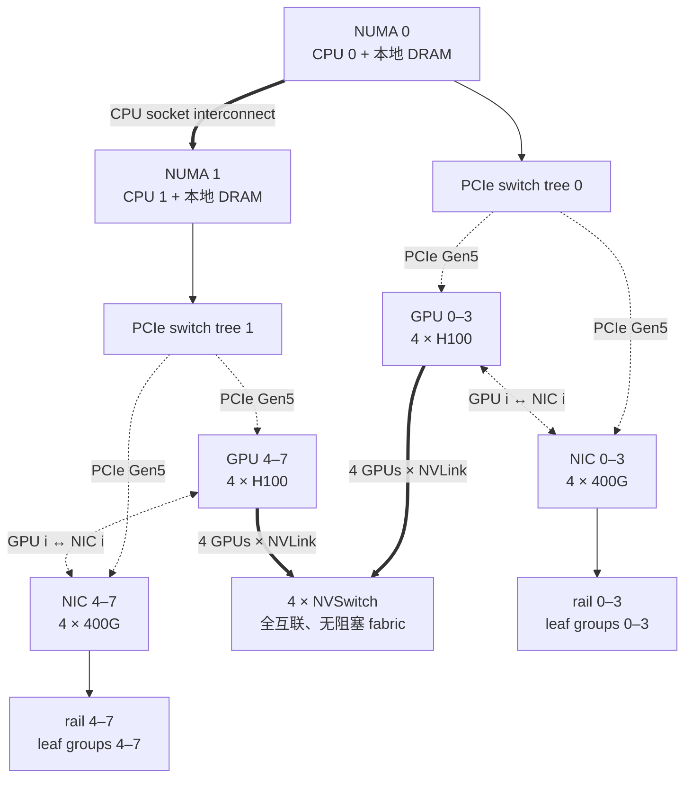
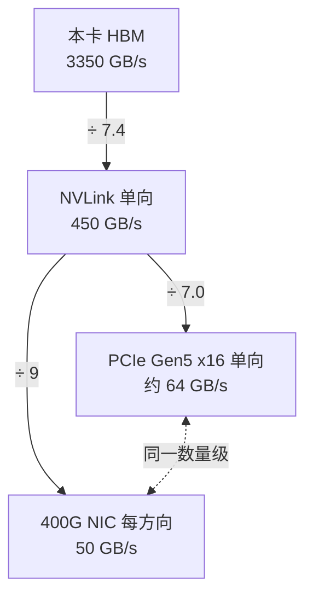

# L25 节点内互联：数据离开 HBM 后有多远

> [!abstract] 本课速览
> 读完你将能够：
> 1. 沿着 2×CPU、8×GPU、4×NVSwitch 和 8×400G NIC 画出一台典型 H100 节点的数据路径；
> 2. 区分 PCIe、NVLink、NVSwitch 和 GPUDirect P2P，解释“绕过主机内存”不等于“没有拓扑代价”；
> 3. 严格区分单向与双向带宽，并复算 16 GB 数据经过 HBM、NVLink、PCIe Gen5 和 400G NIC 的理想耗时；
> 4. 正式定义 scale-up、scale-out 与 NVLink domain，说明为什么通信密集的 TP 通常留在 NVLink 域内；
> 5. 从 NUMA、CPU/GPU/NIC affinity 和 rail 读懂多卡服务器的性能排障线索；
> 6. 计算 8×H100 与 GB200 NVL72 的理想单向对分带宽，理解“机柜即节点”的系统含义。
>
> 前置：[[L21 GPU内存体系]] · 预计 50 分钟

## 论文里的这段话，你现在可能读不懂

> [!quote]
> “Tensor-parallel groups are kept within one **NVLink domain**, where the **NVSwitch** fabric provides non-blocking GPU connectivity. Inter-node traffic follows a **rail-optimized** layout and uses the NIC closest to each GPU's **NUMA** domain. **GPUDirect P2P** avoids host-memory staging, but performance still depends on the PCIe path and **CPU affinity**. Extending the **scale-up** fabric from an eight-GPU HGX system to an **NVL72** rack changes the placement boundary between tensor/expert parallelism and **scale-out** networking.”（改写自典型系统论文与架构说明）

这四句其实在回答同一个问题：==一份 tensor 离开本卡 HBM 后，要穿过哪一级边界？== NVLink domain、NVSwitch、rail、NUMA、GPUDirect P2P 和 scale-up/scale-out 都是在给“边界”命名。若边界判断错了，8 张卡不会自动变成 8 倍算力；程序可能只是在让 8 张卡一起等通信。

## 一、先打开机箱：8 张 GPU 并不只连成一种网

先建立两个产品名的心智模型：**DGX** 是 NVIDIA 交付的完整服务器系统；**HGX** 是供整机厂商集成的多 GPU 加速平台。两者不是互斥的两种互联协议：一台 DGX H100 的 GPU 核心就是 8-GPU HGX H100 平台。官方资料显示，DGX H100 包含 2 颗 CPU、8 张 H100、4 颗 NVSwitch；用于 compute fabric 的 8 个 ConnectX-7 端口最高各 400 Gb/s。[^dgx-h100]

下面是本课反复使用的简化主图。它保留决定数据路径的结构，省略管理网、存储网、NVMe 和每条物理 lane。PCIe 树也按 NUMA 亲和关系简化，不应拿来替代某台具体机器的 `nvidia-smi topo -m` 输出。

图上至少有三套“路”：

1. GPU 访问 CPU、NIC、NVMe 等 I/O 设备，主要看 PCIe 树与 NUMA；
2. 8 张 GPU 之间的大带宽显存访问，主要看 NVLink/NVSwitch fabric；
3. 数据要离开服务器，最终要从 NIC 进入 scale-out 网络。

**NUMA**（Non-Uniform Memory Access，非一致内存访问）指双路 CPU 机器中，CPU core 访问本地 DRAM/本地 I/O 的代价通常低于跨 socket 访问。拓扑工具因此会给每张 GPU 和 NIC 标出更近的 CPU socket、core 集与内存节点。**CPU affinity**（CPU 亲和性）是把通信代理线程、数据加载线程等绑定到合适 CPU cores 的策略。若 GPU 在 NUMA 0、进程线程和 NIC 却偏到 NUMA 1，控制与数据路径就可能多跨一次 socket interconnect。

**rail**（轨道）在这里先记一个预告版定义：多节点中，把相同位置或编号的 NIC 接到同一组 leaf switch，形成一条并行网络轨道。例如每台机器的 NIC 0 都接 rail 0，NIC 1 都接 rail 1。它不是服务器内的一根新总线，而是“GPU—本地 NIC—leaf”在多节点间重复铺开的拓扑组织方式；[[L38 NCCL解剖]] 会用 PXN 回收这个伏笔。NVIDIA 对 rail-optimized topology 的说明也强调，GPU 会优先使用本地 NIC，必要时可先经 NVLink 把数据交给同 rail 的中间 GPU。[^rail-pxn]

> [!tip] 一台机器里有三张地图
> 看 GPU—GPU 通信，先看 NVLink；看 GPU—NIC/CPU，先看 PCIe 与 NUMA；看服务器—服务器，再看 NIC 接到哪条 rail。只说“同一台机器”还不够精确。

## 二、PCIe：通用 I/O 树，不是免费直达通道

**PCIe**（Peripheral Component Interconnect Express，外设组件互连高速总线）把 CPU root complex、GPU、NIC、NVMe 等设备组织成树。中间的 **PCIe switch**（PCIe 交换芯片）负责扩展端口并转发事务；树根通常在 CPU 的 PCIe root complex。

按照 [[03 约定与符号]] 的统一口径：

| 链路 | 本课采用的单向带宽 | 读法 |
|---|---:|---|
| PCIe Gen4 x16 | 约 32 GB/s | 官方常报单向；另一方向可同时传输 |
| PCIe Gen5 x16 | 约 64 GB/s | 是 Gen4 x16 的约 2 倍 |
| 400G NIC 端口 | 400 Gb/s = 50 GB/s | `G` 是 bit/s，必须除以 8 |

两张 GPU “都插在 PCIe 上”不代表路径一样短：它们可能共享一个 switch，也可能要经过多个 switches、CPU root complex，甚至跨 CPU socket。载荷不一定被复制进 CPU DRAM，但每多过一级共享链路或桥，带宽竞争和时延风险都会增加；若平台不支持 GPU P2P，才可能退化为“GPU A → host memory → GPU B”的 staging 路径。

**GPUDirect P2P**（GPU 直接点对点访问）允许一张 GPU 直接访问另一张 GPU 的显存，或执行 peer copy，绕过 host-memory staging；底层路径可以是 PCIe，也可以是 NVLink。它是 [[L21 GPU内存体系]] 里 GPUDirect 技术家族的节点内成员，不要与跨节点的 GPUDirect RDMA 混为一谈。CUDA 官方文档明确指出，启用 P2P 后，peer copy 不再需要经过 host staging。[^cuda-p2p]

这里有一个很常见的逻辑跳跃：

> `GPUDirect P2P` ⇒ 不经过主机内存；
>
> 但不推出 ⇒ 没有 PCIe/NVLink 路径、没有交换争用、带宽无限。

## 三、NVLink + NVSwitch：把远端 HBM 放进“可访问内存”视野

**NVLink** 是 GPU/加速器之间的高带宽点对点互联；一条 NVLink 连接两个端点。**NVSwitch** 则把多条 NVLink 接成交换式 fabric，让多个 GPU 通过交换芯片互达。HGX H100 8-GPU 中，每张 H100 都连接到全部 4 颗第三代 NVSwitch；官方将其描述为 8 张 GPU 的 fully connected、non-blocking topology。[^hgx-h100]

二者的关系可以类比：NVLink 是高速公路路段，NVSwitch 是立交枢纽。只铺点对点路段，GPU 数一多就很难让任意两点都有充足直达连接；加入交换 fabric 后，8 张 GPU 才得到统一的全互联域。

按 [[03 约定与符号]]，H100 SXM 的 NVLink 规格为 900 GB/s **双向合计**，也就是每个方向约 450 GB/s。**bidirectional bandwidth**（双向合计带宽）把同时发送与接收的两个方向相加；它不能直接代入单向搬运的 $t=n/BW$。同一张规格表里，PCIe Gen5 x16 的约 64 GB/s 与 400G NIC 的 50 GB/s 都是每方向数字。若拿 900 直接除以 64，比较口径就已经错了。

NVLink 上暴露给 GPU 软件的核心是远端显存的 load/store/copy/atomic 等内存访问语义，而不是让应用构造 Ethernet/IP 数据包再交给 NIC。说它“更像内存总线”是在描述这个可见语义；NVLink/NVSwitch 硬件内部当然仍有自己的链路层事务与路由。==“NVLink 是更快的以太网”错在协议栈与内存语义，不只错在速度。==

由 NVLink/NVSwitch 形成、GPU 可以高带宽互访显存的一组加速器，称为 **NVLink domain**（NVLink 域）。H100 的 8-GPU HGX 是一个典型 NVLink domain。这个域是并行策略最先看的物理边界，而“服务器机箱”只是当代产品里常与它重合。

### 带宽悬崖：每离本卡 HBM 远一级，都要重新做预算

这张图全部取 [[03 约定与符号]] 的 H100 教学口径：HBM 3350 GB/s $\gg$ NVLink 单向 450 GB/s $\gg$ PCIe Gen5 单向约 64 GB/s $\approx$ 400G NIC 50 GB/s。严格说，从 HBM 到 NVLink 约掉 7.4 倍，从 NVLink 到 PCIe 约掉 7 倍；“每级掉约一个量级”是帮助记忆的数量级说法，不是精确的 10 倍定律。

> [!example] 算一算一：16 GB 权重搬过不同边界要多久
> 取 [[03 约定与符号]] 的 Llama-3-8B 例子：$N=8.0\times10^9$，BF16 为 2 B/参数，所以权重体积
> $$
> n=8.0\times10^9\times2\ \mathrm{B}=16\times10^9\ \mathrm{B}=16\ \mathrm{GB}。
> $$
> 先用理想带宽下界
> $$
> t_{\min}=\frac{n}{BW}。
> $$
>
> | 边界 | 代入的带宽口径 | 完整算式 | 理想耗时 |
> |---|---:|---:|---:|
> | 本卡 HBM | $3350$ GB/s | $16/3350$ s | $\approx 4.8$ ms |
> | H100 NVLink | $900/2=450$ GB/s，单向 | $16/450$ s | $\approx 35.6$ ms，约 36 ms |
> | PCIe Gen5 x16 | $64$ GB/s，单向 | $16/64$ s | $0.25$ s = 250 ms |
> | 400G NIC | $400/8=50$ GB/s，每方向 | $16/50$ s | $0.32$ s = 320 ms |
>
> 这张表是统一按“一份 16 GB 逻辑数据穿过一个带宽边界”的 $n/BW$ 教学下界。若真做 HBM-to-HBM copy，内存接口还要读源、写目的，HBM 总流量可能接近 $2n$；PCIe/NIC 还会有协议、拓扑争用与软件开销，实测通常更慢。表的作用是建立数据住在哪里的成本直觉，不是替代 benchmark。

现在可以给“TP 不出机箱”一个物理解释。**tensor parallelism (TP)** 每层都可能在关键路径上交换 activation，通信频繁，无法容忍链路从 450 GB/s 直接跌到 50–64 GB/s；因此在 H100 时代，TP 通常优先放在 8-GPU NVLink domain 内。这里说“通常”而不是“数学上绝不可能”：消息大小、并行算法、overlap 和硬件都会改变边界，[[L43 张量并行]] 会把这笔账算完整。

> [!warning] 三个带宽误区
> 1. **“H100 NVLink 是 900 GB/s 单向。”** 错。课内口径是 900 GB/s 双向合计，单向搬运用 450 GB/s。
> 2. **“GPUDirect P2P 让 GPU 通信不再经过任何互联。”** 错。它绕过 host-memory staging，数据仍经 PCIe 或 NVLink。
> 3. **“8 卡就有 8 倍性能。”** 只有可并行工作占比、通信、显存容量和负载均衡都配合时才可能接近；加卡不会抹掉带宽悬崖。

## 四、正式划线：scale-up 与 scale-out

现在给两个高频词下正式定义：

- **scale-up**（纵向扩展）是在一个低时延、高带宽、通常支持 accelerator memory semantics 的互联域内增加或组合更多加速器，使它们更像一台更大的并行机器；
- **scale-out**（横向扩展）是增加服务器、机柜或 pod，通过 InfiniBand/Ethernet 等网络把多个 scale-up domain 连接起来。

二者的分界不等于“机箱铁皮”。在 HGX H100 中，8 张 GPU 组成一个 scale-up domain，服务器之间走 scale-out 网络；到了机柜级 NVLink，scale-up domain 可以跨越多个 compute tray。真正的判据是互联语义、带宽/时延和故障/管理边界，而不是设备离得有几厘米。

### NVL72：把 NVLink domain 从 8 张 GPU 扩到 72 张

GB200 **NVL72** 是一个机柜级系统：36 颗 Grace CPU 与 72 张 Blackwell GPU 组成一个 72-GPU NVLink domain，GPU compute trays 与 NVLink switch trays 在机柜内拼成统一 fabric。NVIDIA 官方页将它描述为 single massive GPU，并给出第五代 NVLink 每 GPU 1.8 TB/s GPU-to-GPU interconnect、整个 NVLink Switch System 130 TB/s 聚合 GPU communication bandwidth。[^gb200-nvl72]

按 [[03 约定与符号]] 的统一规则，B200 的 1.8 TB/s 是双向合计，所以单向按 0.9 TB/s 记账。接下来不拿“130 TB/s”直接与 H100 的“900 GB/s/卡”混比，而是统一计算对分截面。

> [!example] 算一算二：8×H100 与 NVL72 的理想对分带宽
> **bisection bandwidth**（对分带宽）问的是：把互联域尽量等分成左右两半，跨越这个切面的总带宽是多少。假设 NVSwitch fabric 无阻塞、all-to-all 流量均匀、每张 GPU 都能打满其 NVLink 单向注入带宽。
>
> 8×H100 分成 4 + 4；每张 H100 单向为 $900/2=450$ GB/s：
> $$
> BW_{\mathrm{bisect,H100}}
> =4\times450\ \mathrm{GB/s}
> =1800\ \mathrm{GB/s}
> =1.8\ \mathrm{TB/s}\quad\text{（单向截面）}。
> $$
>
> NVL72 分成 36 + 36；每张 B200 单向为 $1.8/2=0.9$ TB/s：
> $$
> BW_{\mathrm{bisect,NVL72}}
> =36\times0.9\ \mathrm{TB/s}
> =32.4\ \mathrm{TB/s}\quad\text{（单向截面）}。
> $$
>
> 比值为
> $$
> \frac{32.4}{1.8}=18。
> $$
> 若写成两个方向同时工作的双向合计，则分别是 3.6 TB/s 与 64.8 TB/s，比值仍为 18。==NVL72 不只是 GPU 数从 8 变 72：单卡 NVLink 单向带宽还从 0.45 升到 0.9 TB/s，所以理想对分带宽是 $9\times2=18$ 倍。== 这是基于规格的上界，不是某个 all-to-all 实测结果。

“机柜即节点”的意义是：模型切分不必在 8 卡处立刻跨入 400G scale-out 网络。TP 或 **expert parallelism (EP)** 的高通信组有机会扩到 72-GPU NVLink domain 内，尤其有利于需要 all-to-all 的 MoE；但“可以放进 72 卡域”不等于“TP=72 一定最优”，collective 时延、矩阵 shape、负载均衡和软件实现仍要共同决定。

### 快速演化区：UALink、NVLink Fusion 与 D2D

截至 2026 年 8 月，scale-up 互联仍是快速演化区：

- **UALink**（Ultra Accelerator Link）是开放的 accelerator scale-up 标准。UALink Consortium 的 1.0 资料把目标写成 pod 内低时延、高带宽的 load/store、atomic 与 DMA，并支持把大量 accelerator 连接成 scale-up fabric。它说明“内存语义 scale-up”正在从单一厂商产品变成开放标准竞争点。[^ualink]
- NVIDIA 在 2025 年发布 NVLink Fusion，让定制 CPU/XPU 可以接入 NVLink scale-up fabric；这是一条生态开放路线，但不等于 NVLink 已经变成厂商中立标准。[^nvlink-fusion]
- **D2D (die-to-die)**（裸片到裸片互联）工作在封装内或紧耦合芯粒之间，尺度比机柜内 scale-up 更小。GB200 Superchip 用 NVLink-C2C 连接 1 颗 Grace CPU 与 2 张 Blackwell GPU，就是“package 内 D2D → rack 内 NVLink → rack 间 scale-out 网络”的层级例子。

这一层级很重要：系统论文写“interconnect”时，可能指 die-to-die、GPU-to-GPU scale-up，也可能指跨节点 network。三者的带宽、时延、寻址语义和故障域差别很大，不能用一个笼统的“通信开销”带过。

## 五、从拓扑图落到性能排障

研究和工程中最实用的一句话是：==先确认进程、GPU、NIC 和 CPU core 的亲和关系，再怪通信库。== NVIDIA 的 `nvidia-smi topo -m` 会同时显示 GPU—GPU、GPU—NIC 路径以及 CPU/NUMA affinity；常见路径标签中，PIX/PXB 表示经过一个/多个 PCIe switch，PHB 表示经过 PCIe host bridge，SYS 还跨 CPU socket interconnect，NV# 表示 NVLink 路径。[^nvidia-smi-topo]

以后在 [[L38 NCCL解剖]] 或 [[L52 性能剖析与MFU核算]] 看到某个 rank 慢，可以按三步问：

1. rank 绑定的是哪张 GPU，通信代理线程运行在哪个 CPU/NUMA 节点？
2. 这张 GPU 到所用 NIC 是 PIX/PXB/PHB/NODE/SYS 中哪一种路径，是否用了更近的 rail？
3. GPU—GPU 走 NVLink 还是 PCIe，P2P 是否启用，collective 是否跨出了 NVLink domain？

这三问不会直接给出答案，但能把“通信慢”拆成可观测、可复现实验变量。对于 MLSys × 网络研究，这正是拓扑感知的任务映射、collective 调度、请求路由与故障恢复共同依赖的底图。

## 回到开头那段话

现在逐句回读：

1. “Tensor-parallel groups are kept within one NVLink domain, where the NVSwitch fabric provides non-blocking GPU connectivity。”——TP 每层通信频繁，所以优先放在 NVLink/NVSwitch 构成的高带宽域内；在 HGX H100 里，4 颗 NVSwitch 把 8 张 GPU 组成全互联、无阻塞 fabric。
2. “Inter-node traffic follows a rail-optimized layout and uses the NIC closest to each GPU's NUMA domain。”——跨节点前先选本地 GPU—NIC 路径；相同编号 NIC 在多节点间组成 rail，NUMA/PCIe 拓扑决定“最近”到底是哪一张。
3. “GPUDirect P2P avoids host-memory staging, but performance still depends on the PCIe path and CPU affinity。”——P2P 去掉的是 host-memory 中转，不是底层互联；若路径跨多个 switch/socket，或 CPU proxy 绑错 core，仍会付拓扑代价。
4. “Extending the scale-up fabric from an eight-GPU HGX system to an NVL72 rack changes the placement boundary between tensor/expert parallelism and scale-out networking。”——NVL72 把 NVLink domain 扩到 72 张 GPU，TP/EP 通信组可以在更大 scale-up 域里布局，更晚才跨到 NIC 与 scale-out 网络；具体最优并行度仍需定量评估。

你现在应该能把整段压成一句话：==并行策略先是一个拓扑放置问题——把最频繁、最关键路径上的通信留在最近、最宽的互联域里。==

## 术语卡片

| 术语 | 中文 | 一句话解释 |
|---|---|---|
| PCIe | 外设组件互连高速总线 | 以 CPU root complex 为常见根、连接 GPU/NIC/NVMe 等设备的通用 I/O 树。 |
| PCIe switch | PCIe 交换芯片 | 在 PCIe 树中扩展端口并转发事务，路径与共享上行会影响设备间性能。 |
| NVLink | NVIDIA 高速点对点互联 | 在 GPU/加速器之间提供高带宽内存访问与 copy 通道的 scale-up 链路。 |
| NVSwitch | NVLink 交换芯片 | 把多条 NVLink 接成交换式 fabric，使多 GPU 获得高带宽全互联。 |
| bidirectional bandwidth | 双向合计带宽 | 把两个相反方向可同时传输的带宽相加；不能直接当单向搬运带宽。 |
| GPUDirect P2P | GPU 直接点对点访问 | 允许 GPU 直接访问或复制另一张 GPU 的显存，避免 host-memory staging。 |
| NUMA | 非一致内存访问 | CPU core 访问不同内存/I/O 节点的代价不相同的多 socket 体系结构。 |
| CPU affinity | CPU 亲和性 | 把进程或线程绑定到指定 CPU cores，以匹配 GPU/NIC/内存拓扑。 |
| DGX | NVIDIA 完整 AI 服务器系统 | NVIDIA 交付的整机平台，集成 GPU、CPU、互联、网络、存储与软件。 |
| HGX | NVIDIA 多 GPU 加速平台 | 供服务器厂商集成的 GPU baseboard/平台，核心包含 GPU 与 NVLink/NVSwitch。 |
| scale-up | 纵向扩展 | 在低时延、高带宽、通常具内存语义的域内组合更多 accelerator。 |
| scale-out | 横向扩展 | 通过 InfiniBand/Ethernet 等网络增加服务器、机柜或 pod。 |
| NVLink domain | NVLink 域 | 经 NVLink/NVSwitch 形成、可高带宽互访显存的一组 GPU。 |
| NVL72 | 72-GPU 机柜级 NVLink 系统 | 由 36 Grace CPU 与 72 Blackwell GPU 组成的机柜级 NVLink domain。 |
| rail | 网络轨道 | 多节点中把相同位置 NIC 接到同组 leaf，形成重复的并行网络路径。 |
| UALink | Ultra Accelerator Link | 面向 pod 内 accelerator 的开放 scale-up 互联标准。 |
| D2D (die-to-die) | 裸片到裸片互联 | 在封装内或紧耦合芯粒间连接 dies 的短距离互联层级。 |

## 自测

1. 在一台双路 8-GPU 服务器里，GPU—GPU、GPU—NIC、服务器—服务器分别优先看哪张拓扑图？
2. NVLink 与 NVSwitch 的角色有什么不同？为什么说 NVLink 更像内存互联而不是更快的 Ethernet？
3. GPUDirect P2P 绕过了什么？它为什么不能消除 PCIe/NVLink 拓扑差异？
4. 用 [[03 约定与符号]] 的口径，计算 16 GB 数据经 H100 NVLink 单向、PCIe Gen5 x16 单向、400G NIC 每方向的理想耗时。
5. 一条规格写“NVLink 900 GB/s bidirectional”，另一条写“PCIe Gen5 x16 64 GB/s”。正确的单向带宽比是多少？
6. 正式区分 scale-up 与 scale-out，并解释 NVL72 为什么让“机柜”不再等于传统 scale-out 边界。
7. 复算 8×H100 与 NVL72 的理想单向对分带宽及比值；列出至少两个实际 all-to-all 达不到该上界的原因。
8. 你发现某 GPU 的 NIC 通信明显慢于同节点其他 GPU。列出一个最小排障顺序，并说明 rail、NUMA、CPU affinity 各看什么。

> [!note]- 参考答案
> 1. GPU—GPU 先看 NVLink/NVSwitch；GPU—NIC/CPU 先看 PCIe tree 与 NUMA；服务器—服务器再看 NIC、rail 和 scale-out 网络。
> 2. NVLink 是点对点链路，NVSwitch 把多条链路组成交换式 fabric。GPU 软件看到的是远端显存 load/store/copy/atomic 等语义，不是 Ethernet/IP NIC 的数据包接口；硬件内部仍有自己的链路事务。
> 3. P2P 绕过 GPU→host memory→GPU 的 staging，数据仍要沿 PCIe 或 NVLink 传输；switch 数、root complex、跨 socket 路径和共享带宽仍会影响性能。
> 4. H100 NVLink：$16/(900/2)\approx0.0356$ s = 35.6 ms；PCIe Gen5：$16/64=0.25$ s = 250 ms；400G NIC：先换成 $400/8=50$ GB/s，再算 $16/50=0.32$ s = 320 ms。
> 5. 单向 NVLink 是 $900/2=450$ GB/s，所以正确比值为 $450/64\approx7.0$，不是 $900/64\approx14.1$。
> 6. scale-up 在高带宽、低时延、通常具内存语义的 accelerator 域内扩展；scale-out 用网络连接更多节点/域。NVL72 的 72 张 GPU 跨多个 tray 仍属于同一 NVLink domain，所以物理机柜内部可以仍是 scale-up。
> 7. 8×H100：$4\times0.45=1.8$ TB/s；NVL72：$36\times0.9=32.4$ TB/s；比值 18。实测会受 collective 算法、消息大小、协议效率、交换/链路争用、同步与负载不均等影响。
> 8. 先用 `nvidia-smi topo -m` 核对 GPU—NIC 路径与 CPU/NUMA affinity，再确认进程/通信线程 CPU 绑定，最后检查 NCCL 选的 NIC/rail 和 P2P/NVLink 状态。rail 看 NIC 接入哪组 leaf，NUMA 看本地/跨 socket，CPU affinity 看线程是否运行在匹配 cores。

## 延伸阅读

- [NVIDIA DGX H100/H200 User Guide](https://docs.nvidia.com/dgx/dgxh100-user-guide/introduction-to-dgxh100.html)：对照真实 GPU、CPU、ConnectX-7 与端口映射；读到能把本课简图换成具体机器的拓扑即可。
- [NVIDIA HGX H100 架构说明](https://developer.nvidia.com/blog/introducing-nvidia-hgx-h100-an-accelerated-server-platform-for-ai-and-high-performance-computing/)：重点看 8 GPU 如何连接 4 颗 NVSwitch，以及 fully connected/non-blocking 的含义。
- [NVIDIA GB200 NVL72 官方架构页](https://www.nvidia.com/en-us/data-center/gb200-nvl72/)：核对 36 Grace、72 Blackwell、72-GPU NVLink domain 与 130 TB/s 聚合口径。
- [UALink 1.0 Specification Overview](https://ualinkconsortium.org/blog/ualink-200g-1-0-specification-overview-802/)：只需读 scale-up memory fabric 的 load/store、atomic、DMA 语义，建立开放标准对照。
- [《How to Scale Your Model》：How to Think About GPUs](https://jax-ml.github.io/scaling-book/gpus/)：用 TPU/GPU 对照视角继续看 HBM、互联与并行切分，不必在本课追 JAX API。

[^dgx-h100]: [NVIDIA DGX BasePOD Reference Architecture：DGX H100 core components](https://docs.nvidia.com/dgx-basepod/reference-architecture-infrastructure-foundation-enterprise-ai/latest/core-components.html) 列出 8×H100、4×NVSwitch、双路 CPU 与 8 个 compute-fabric ConnectX-7 端口；[DGX H100/H200 User Guide](https://docs.nvidia.com/dgx/dgxh100-user-guide/introduction-to-dgxh100.html) 给出 GPU—NIC 映射。DGX 另有 storage/management 端口，本课主图只画 8 个 compute-fabric NIC。
[^rail-pxn]: [NVIDIA《Doubling all2all Performance with NCCL 2.12》](https://developer.nvidia.com/blog/doubling-all2all-performance-with-nvidia-collective-communication-library-2-12/) 定义 rail-optimized topology，并说明 PXN 如何先经 NVLink 到达与目标同 rail 的中间 GPU/NIC；本课只埋概念，机制留到 [[L38 NCCL解剖]]。
[^cuda-p2p]: [CUDA Programming Guide：Programming Systems with Multiple GPUs](https://docs.nvidia.com/cuda/cuda-programming-guide/03-advanced/multi-gpu-systems.html) 说明启用 peer access 后，peer copy 无需经 host staging；支持性与具体路径仍取决于系统拓扑。
[^hgx-h100]: [NVIDIA《Introducing NVIDIA HGX H100》](https://developer.nvidia.com/blog/introducing-nvidia-hgx-h100-an-accelerated-server-platform-for-ai-and-high-performance-computing/) 说明 8 张 H100 各自连接全部 4 颗第三代 NVSwitch，并将拓扑描述为 fully connected、fully non-blocking；带宽数字在正文中仍按 [[03 约定与符号]] 的统一口径使用。
[^gb200-nvl72]: [NVIDIA GB200 NVL72](https://www.nvidia.com/en-us/data-center/gb200-nvl72/) 列出 36 Grace CPU、72 Blackwell GPU、72-GPU NVLink domain、每 GPU 1.8 TB/s NVLink 与全系统 130 TB/s 聚合 NVLink bandwidth。正文按 [[03 约定与符号]] 将 1.8 TB/s 作为双向合计，再推导单向对分带宽。
[^ualink]: [UALink Consortium：About UALink](https://ualinkconsortium.org/about-ualink/) 与 [UALink 200G 1.0 Specification Overview](https://ualinkconsortium.org/blog/ualink-200g-1-0-specification-overview-802/) 将其定位为开放 scale-up standard，并描述 load/store、atomic、DMA 与软件一致性语义；快速演化事实以 2026 年 8 月为时间截面。
[^nvlink-fusion]: [NVIDIA 2025 年 NVLink Fusion 官方发布](https://nvidianews.nvidia.com/news/nvidia-nvlink-fusion-semi-custom-ai-infrastructure-partner-ecosystem) 将其定位为让定制 CPU/XPU 接入 NVLink scale-up ecosystem 的 semi-custom infrastructure 路线。
[^nvidia-smi-topo]: [NVIDIA System Management Interface 文档：Topology](https://docs.nvidia.com/deploy/nvidia-smi/index.html#topology) 给出 `nvidia-smi topo` 的 GPU/NIC、CPU/MEM affinity、NUMA 信息与 PIX/PXB/PHB/NODE/SYS/NV# 路径标签定义。

---
上一课：[[L24 数值格式]] ← · → 下一课：[[L26 加速器生态与软件栈]]
