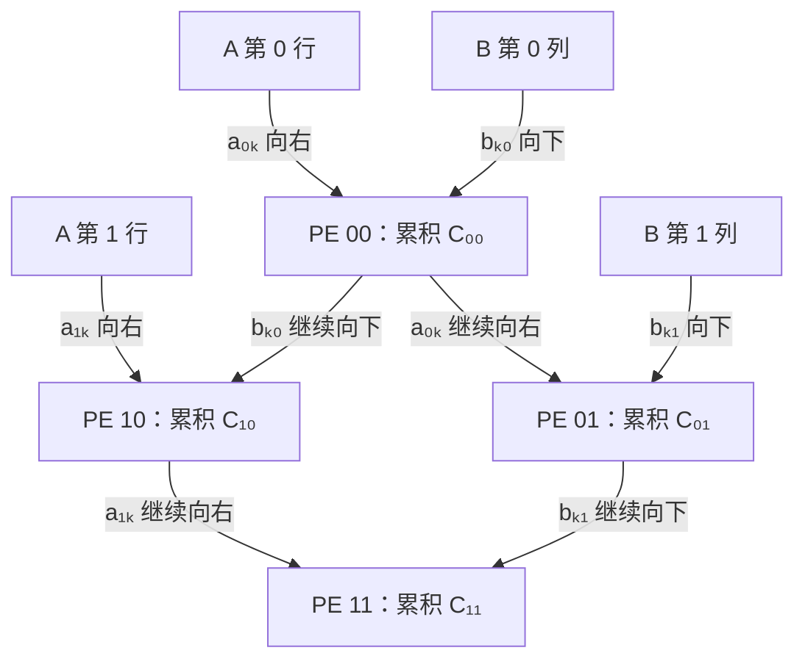
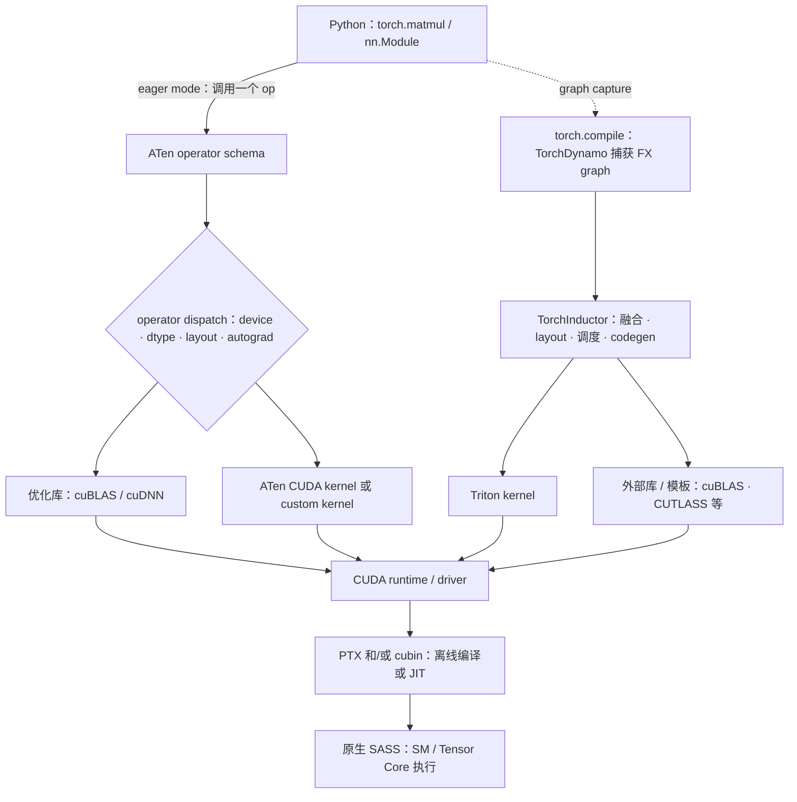

# L26 加速器生态与软件栈：从 PyTorch 一行代码到硬件指令

> [!abstract] 本课速览
> 读完你将能够：
> 1. 用 systolic array 的数据流解释 TPU 与 GPU 的架构侧重差异，而不是把 TPU 只记成“另一种 GPU”；
> 2. 区分 ICI、3D torus、TPU Pod 与 XLA，说明 TPU 的芯片、互联和编译器为何必须一起看；
> 3. 给 Trainium、AMD ROCm、Ascend/CANN、寒武纪、Cerebras 和 Groq 画出不带宣传色彩的一句话画像；
> 4. 从 H100/H800/H20 的算力、NVLink 与 HBM 带宽读出训练通信和 decode 推理的不同瓶颈；
> 5. 沿 eager 与 `torch.compile` 两条路径，把 `torch.matmul` 一直追到 cuBLAS/Triton、PTX、SASS 与 Tensor Core；
> 6. 区分编译器优化、CUDA Graph 与分布式策略优化，知道性能问题该去软件栈哪一层找。
>
> 前置：[[L25 节点内互联]] · 预计 55 分钟

## 论文里的这段话，你现在可能读不懂

> [!quote]
> “The model was compiled by **XLA** for a **TPU Pod** whose chips communicate over **ICI** in a 3D-torus topology; its MXUs use a **systolic array** rather than a GPU-style SIMT core organization. On the **H800** cluster, communication was overlapped with computation, whereas the **H20**'s lower compute-to-memory ratio made it a plausible target for memory-bound decode. In PyTorch **eager mode**, an **ATen** operator reaches a **CUDA** implementation through **operator dispatch**, often calling **cuBLAS** or **cuDNN**. With **torch.compile**, **TorchInductor** may instead fuse a graph into **Triton** kernels, which ultimately execute as native **SASS**; a **CUDA Graph** can separately reduce repeated launch overhead.”（改写自典型系统论文与官方软件文档表述）

这段话故意把三张地图叠在了一起：芯片内部的数据怎么流、芯片之间怎么连、一个框架算子怎么变成硬件指令。没有这三张地图，读加速器论文很容易只盯峰值 TFLOPS，或者把“换一张卡”误以为只是改一个 PyTorch `device` 字符串。

## 一、为什么加速器不能只看芯片

**accelerator**（加速器）不是“比 CPU 更快的处理器”的同义词，而是把晶体管、存储层级、互联和编程模型偏向某类工作负载的硬件。GPU 偏向大量并行线程与可编程 kernel；TPU 把更多设计重心放在规则张量计算和整图编译；其他厂商又会在显存、互联、执行确定性、部署形态或云服务绑定上做不同取舍。

真正决定一个模型能否高效运行的，至少有六层：

1. 芯片有没有匹配 dtype 和 shape 的计算单元；
2. HBM 与片上存储能否持续喂饱计算单元；
3. 芯片间互联和 collective library 能否扩到多卡；
4. kernel library 是否覆盖模型所需算子；
5. 编译器、runtime、profiler 和 debugger 是否可用；
6. PyTorch/JAX、训练框架与推理引擎是否稳定接入。

所以“这张卡峰值更高”和“这个模型跑得更快”之间，隔着整个软件与系统栈。上一课 [[L25 节点内互联]] 画的是数据离开本卡 HBM 后的路；本课继续向上，画出程序从 Python 离开后要经过的路。

> [!tip] 心智模型
> 芯片像发动机，kernel library 像变速箱，编译器和 runtime 像控制系统，框架像驾驶接口。只比较发动机转速，推不出整车在山路上的速度。

## 二、TPU：让数据在阵列里流，而不是反复回存储器

**TPU**（Tensor Processing Unit，张量处理单元）是 Google 面向机器学习工作负载设计的专用加速器。它不是只有矩阵单元：现代 TPU 还包含向量、标量等单元；但理解 TPU 的第一把钥匙仍是矩阵乘单元里的 **systolic array**（脉动阵列）。Google Cloud 的架构文档把 TPU 的矩阵乘单元描述为由大量 multiply-accumulate 单元组成的 systolic array。[^tpu-arch]

### 2.1 systolic array：A 向右走，B 向下走，部分和留在 PE 里

考虑 $C=A\times B$。脉动阵列把许多 **processing element (PE)** 排成网格：矩阵 $A$ 的元素沿行向右传播，$B$ 的元素沿列向下传播；每个 PE 对自己负责的 $C_{ij}$ 做乘加累积。数据像心脏泵出的血液一样一拍一拍穿过阵列，因此叫 systolic。



对 $2\times2$ 矩阵，先把两路输入适当错开，就能得到下面这个“逐拍动画”。同一个 $a_{ik}$ 会被同一行的 PE 复用，同一个 $b_{kj}$ 会被同一列的 PE 复用，部分和尽量留在 PE 内部。

| 时钟拍 | 本拍发生的乘加 |
|---|---|
| $t=0$ | PE00：$C_{00}\mathrel{+}=a_{00}b_{00}$ |
| $t=1$ | PE00：$a_{01}b_{10}$；PE01：$a_{00}b_{01}$；PE10：$a_{10}b_{00}$ |
| $t=2$ | PE01：$a_{01}b_{11}$；PE10：$a_{11}b_{10}$；PE11：$a_{10}b_{01}$ |
| $t=3$ | PE11：$a_{11}b_{11}$；四个 $C_{ij}$ 均完成 |

流水线填满以后，不同 PE 可以同时工作。它的价值不是改变 GEMM 的 FLOPs，而是让输入和部分和就近复用，少在寄存器、片上 SRAM 与外部 HBM 之间往返。这和 [[L23 Roofline模型]] 的核心完全一致：==数据搬得少，同样的数学运算就可能有更高的 operational intensity。==

代价也很直观：规则、足够大的矩阵最适合铺满阵列；shape 太小、维度不齐或控制流不规则时，空洞和 padding 会降低利用率。GPU 的 SIMT 编程模型通常给 kernel 作者更多细粒度控制，TPU 则更依赖编译器把整段计算排成硬件喜欢的数据流。两者都有矩阵单元、编译器和优化库，不能粗暴地说成“TPU 只能矩阵乘，GPU 什么都能做”。

### 2.2 XLA：先看到图，再决定怎么切和怎么排

**XLA**（Accelerated Linear Algebra，加速线性代数编译器）接收框架产生的计算图，做算子融合、layout 选择、buffer 规划与设备代码生成。Google Cloud 文档明确要求 TPU 工作负载经 XLA 编译；编译器还会根据 MXU 和内存系统偏好的 tile 形状处理维度。[^tpu-xla]

常见的“TPU 是编译器优先，GPU 是库优先”只能当作侧重：

| 侧重 | 典型路径 | 优势 | 常见代价 |
|---|---|---|---|
| 编译器优先 | JAX/PyTorch 图 → XLA → TPU 程序 | 能跨多个 ops 看融合、layout 与通信 | 编译时间、shape 约束、graph break 可能暴露出来 |
| 库优先 | PyTorch op → dispatcher → cuBLAS/cuDNN/自定义 CUDA kernel | 成熟库覆盖广，eager 调试直接，kernel 可精细控制 | 多个短 op 之间的全局优化机会可能丢失 |

现代 CUDA 栈同样有 `torch.compile`，XLA 也会调用高度优化的底层实现，所以这不是两堵墙。更准确的说法是：TPU 从一开始就把“编译一段图”放在核心路径上；CUDA 生态长期把“高性能库 + 可编程 kernel”做得极深，后来又叠加图编译路线。

### 2.3 ICI、3D torus 与 TPU Pod：芯片阵列之外还有系统阵列

单颗 TPU 不够训练大模型时，芯片通过 **ICI**（Inter-Chip Interconnect，芯片间互联）连接。**TPU Pod** 是由专用网络连在一起的一组连续 TPU；用户实际申请的 slice 是 Pod 中的一部分。不同代 TPU 的拓扑不同，不能把“TPU = 3D torus”写成永恒定义；从 TPU v4 开始，较大 slice 可使用三维拓扑，`4×4×4` cube 就含 64 颗芯片。[^tpu-arch]

**3D torus**（三维环面）可以想象成三维网格的每个方向都首尾相接。与没有回环的 mesh 相比，它给边界节点补上另一侧邻居，减少“地图边缘”；但 collective 怎么映射、链路是否故障、作业拿到什么 slice，仍会改变有效带宽。TPU v4 进一步用 optical circuit switch 重构 Pod 内连接；《TPU v4: An Optically Reconfigurable Supercomputer for Machine Learning with Hardware Support for Embeddings》（ISCA 2023）就是 [[L31 AI集群网络拓扑]] 会继续展开的入口。[^tpu-v4]

> [!warning] 三个容易混的层级
> - systolic array 是一颗芯片内部的计算数据流，不是芯片间网络；
> - ICI 是芯片间互联，3D torus 是互联形成的拓扑；
> - Pod 是系统资源域，用户拿到的 slice 不一定等于完整 Pod。

## 三、GPU 之外不只有 TPU：先认生态，再谈快慢

加速器版图变化很快。下面是截至 2026 年 8 月“读论文够用”的快照，不用一张未经统一登记的峰值表制造虚假精确性。

| 阵营 | 一句话硬件画像 | 软件入口 | 读系统论文时先问什么 |
|---|---|---|---|
| AWS **Trainium** | AWS 自研训练加速器，配套 NeuronCore、NeuronLink 与 EC2 集群 | Neuron SDK、Neuron Compiler、NKI | 编译覆盖、EFA/NeuronLink collective、云实例绑定 |
| AMD MI300 系 | GPU/APU 路线，强调 HBM 容量/带宽与开放 GPU 计算栈 | **ROCm**、HIP、rocBLAS/MIOpen、RCCL | 目标 GPU/OS/框架版本是否在 support matrix，关键 op 与 collective 是否有高效实现 |
| 华为 **Ascend**（昇腾） | 面向训练和推理的 NPU/集群产品族 | **CANN**、Ascend C、HCCL 等 | 框架适配、算子覆盖、编译/runtime、集合通信与运维工具是否形成闭环 |
| 寒武纪 | MLU 加速卡与云边端产品族 | NeuWare、BANG、CNNL、CNCL 等 | 模型与 dtype 覆盖、集群规模、工具链版本和部署边界 |
| Cerebras | Wafer-Scale Engine 把大量 PE 和片上互联铺在晶圆尺度 | 自有编译器与系统软件 | wafer-scale 数据流怎样改变模型切分和外部存储路径 |
| Groq | LPU/Tensor Streaming 路线强调静态调度与确定性流式执行 | 自有 compiler/runtime | 编译器能否静态排好计算与数据到达，模型/算子覆盖到哪 |

**Trainium** 不能只记成“AWS 的 TPU”。它有自己的 Neuron 软件栈，AWS 文档还给出 Neuron compiler、kernel interface 和芯片间 NeuronLink；因此迁移工作既包含图编译，也可能包含自定义 kernel 与 collective 调优。[^trainium]

**ROCm**（Radeon Open Compute platform）是 AMD 的 GPU 计算软件栈。HIP 提供接近 CUDA 风格的编程接口，rocBLAS/MIOpen/RCCL 分别覆盖线性代数、深度学习 primitives 和集合通信。PyTorch 对 ROCm 的支持已进入上游，AMD 也发布明确的 PyTorch compatibility matrix；“生态成熟度”因此不该只用一个形容词判断，而要逐项核对硬件、OS、PyTorch/ROCm 版本、算子和 profiler。[^rocm]

**Ascend** 是华为昇腾加速器生态；**CANN**（Compute Architecture for Neural Networks）是承接框架、编译器、算子库、runtime 和通信能力的软件层。寒武纪则有 MLU 与 NeuWare/BANG 等软件工具。两类平台都能运行训练或推理负载；是否适合某个大模型，要用模型覆盖、kernel 性能、collective、稳定性与运维成本作答，不能用“国产卡跑不了”一句话替代测试。华为和寒武纪的官方资料都公开了框架/算子开发与软件栈入口。[^ascend-cann] [^cambricon]

Cerebras 和 Groq 先认名字即可：前者把计算和片上存储推向 wafer scale，后者强调 compiler-scheduled streaming。它们提醒我们，GPU 的 SM/HBM/cache/warp 组合不是 AI 加速器唯一可能的组织方式。[^alt-arch]

> [!tip] 迁移检查表
> 遇到“兼容 PyTorch”时继续追问：是模型能跑通，还是关键 op 有高性能 kernel？训练反向是否齐全？多卡 collective 是否稳定？profiler 能否定位慢点？推理引擎是否支持 continuous batching、量化和 KV cache？“能运行”与“能在规模上高效运行”是两道题。

## 四、出口管制型号：从规格差异读出系统问题

**export control**（出口管制）是政府对特定物项、软件、技术、目的地、最终用户或用途设置许可与限制的制度。对系统研究者而言，重点不是在本课评价政策，而是认识一个事实：可获得的芯片规格本身会改变优化目标，且规则会继续变化。

一段足够用的时间线是：2022 年 10 月，美国商务部 BIS 对面向中国的部分先进计算芯片和超级计算用途建立新限制；2023 年 10 月又更新门槛，NVIDIA 向 SEC 披露 H800 等型号进入许可要求；2025 年 4 月，H20 对华出口也被要求许可。NVIDIA 2026 财年 10-K 进一步披露，2025 年 8 月美国政府曾为部分 H20 对部分中国客户发放许可，并强调规则涉及总处理性能、性能密度、互联和内存带宽等多种参数。[^bis-2022] [^bis-2023] [^nvidia-controls]

这条时间线有两个阅读原则：

1. “出口版”不是永久稳定的产品分类，今天满足门槛不代表明天仍可无许可销售；
2. 限制不只看一个 TFLOPS 数字，芯片间 I/O 与内存带宽同样可能进入规则，因此系统规格和政策规则会互相塑形。

### 4.1 算一算：H100、H800、H20 把瓶颈推向哪里

下面所有硬件数字只取自 [[03 约定与符号]]，峰值均为 BF16 **dense** 口径；NVLink 是双向合计，不能当作单向搬运速度。

| GPU | BF16 dense | NVLink（双向合计） | HBM 带宽 | 相对 H100 的第一眼 |
|---|---:|---:|---:|---|
| H100 SXM | 989 TFLOPS | 900 GB/s | 3.35 TB/s | 基准 |
| **H800** SXM | 989 TFLOPS | 400 GB/s | 3.35 TB/s | 计算/HBM 不变，scale-up 互联变窄 |
| **H20** | 148 TFLOPS | 900 GB/s | 4.0 TB/s | 计算显著降低，互联与 HBM 保留较多 |

> [!example] 算一算一：从三列规格读出研究议程
> **第一步：算力比。**
> $$
> 989:989:148=1:1:0.150
> $$
> H20 的 BF16 dense 峰值约为 H100 的 15.0%，H800 与 H100 相同。
>
> **第二步：NVLink 比。**
> $$
> 900:400:900=1:0.444:1
> $$
> H800 的双向合计 NVLink 约为 H100 的 44.4%。若算单向，三者都除以 2，比值不变；绝不能只把 H100 除以 2 再比较。
>
> **第三步：HBM 带宽比。**
> $$
> 3.35:3.35:4.0=1:1:1.194
> $$
> H20 的 HBM 带宽约为 H100 的 1.19 倍。
>
> **第四步：算机器平衡点 $P_{peak}/BW_{HBM}$。**
> $$
> I^*_{H100}=I^*_{H800}=\frac{989\ \text{TFLOPS}}{3.35\ \text{TB/s}}\approx295\ \text{FLOP/B}
> $$
> $$
> I^*_{H20}=\frac{148\ \text{TFLOPS}}{4.0\ \text{TB/s}}=37\ \text{FLOP/B}
> $$
> arithmetic intensity 低于 $I^*$ 时，Roofline 判为 memory-bound。H800 保留单卡计算/HBM，却压低 scale-up 通信能力，因此通信密集训练更值得研究 overlap、并行组放置与通信 kernel；H20 的平衡点低得多，低 batch decode 即使喂不满算力，也可能先撞 HBM roof，而不是按“只剩 15% 算力”线性变慢。

再用课内参考模型复算一次。Llama-3-8B 的 BF16 权重约为

$$
W=8\times10^9\times2\ \text{B}=16\ \text{GB}.
$$

batch 约为 1 的理想化 decode 每生成一个 token，若权重只流过一次，工作量约 $2N=16\times10^9$ FLOPs，arithmetic intensity 约为 $1$ FLOP/B。于是：

| 下界 | H100/H800 | H20 |
|---|---:|---:|
| 只算权重读取 | $16/3350\approx4.78$ ms | $16/4000=4.00$ ms |
| 只算矩阵计算 | $16\times10^9/(989\times10^{12})\approx0.016$ ms | $16\times10^9/(148\times10^{12})\approx0.108$ ms |

两种卡上，理想化 HBM 时间都远大于计算时间。这不预测真实 tokens/s——还没算 KV cache、attention、kernel 效率、并行通信和 batching——但足以解释：==对 memory-bound decode，H20 的规格匹配度可能比“148 TFLOPS”给人的第一印象更好。== 由于 [[03 约定与符号]] 没有 H20 价格，本课不进一步声称其“性价比”一定更高。

### 4.2 H800 与 DeepSeek：约束是线索，不是单因果故事

《DeepSeek-V3 Technical Report》明确写明训练集群由 2,048 张 H800 组成，并把 DualPipe、计算—通信重叠以及跨节点 all-to-all kernel 列为基础设施核心设计。[^deepseek-v3] 把这与上表放在一起，系统研究议程很自然：

- 怎样让 MoE all-to-all 与 GEMM 重叠；
- 怎样把高频通信组留在较快互联域；
- 怎样减少跨节点流量，或让 IB 与 NVLink 同时工作；
- 怎样让编译器/runtime 感知通信，而不是只融合单卡 ops。

但不要倒置因果：报告没有说所有工程设计都“只因 H800 的 400 GB/s NVLink 而生”。MoE 本身就有跨节点 all-to-all，集群网络、并行策略和成本目标也共同施加约束。正确读法是：H800 规格让通信预算更显眼，因此这篇报告是硬件—软件协同设计的好案例。

## 五、软件栈纵剖：`torch.matmul` 到底去了哪里

现在回到 NVIDIA 路线。**CUDA**（Compute Unified Device Architecture）不是一门语言，也不只是一套 driver；它是 NVIDIA GPU 的编程平台，包含编程模型、compiler toolchain、runtime/driver API、libraries 与工具。PyTorch 只是站在这套平台之上的一层。

下面这张图是本课主图。实线是常见 eager 路径，虚线是 `torch.compile` 旁路；真实实现会因 op、dtype、shape、版本和后端而变化，所以把它当排障地图，不要当唯一调用栈。



### 5.1 eager 路：ATen 与 operator dispatch

**eager mode**（即时执行模式）指 Python 运行到一个 PyTorch op，就立即构造并派发这次调用。`torch.matmul` 首先对应到 **ATen**：它是 PyTorch 张量算子的核心 C++ API 与 operator schema 层。这里的 operator 是“矩阵乘”这样的语义，不等于一颗 GPU kernel；一个 op 可能启动多个 kernels，多个 ops 也可能被融合成一个 kernel。

**operator dispatch**（算子派发）根据 tensor 的 device、dtype、layout，以及 Autograd、Autocast 等 dispatch keys，选择具体实现。选中 CUDA backend 后：

- GEMM 常进入 **cuBLAS**（CUDA Basic Linear Algebra Subprograms）或 cuBLASLt；
- convolution、attention、normalization 等深度学习 primitives 可能进入 **cuDNN**（CUDA Deep Neural Network library）；
- 简单逐元素、reduction 或特殊 op 可能调用 ATen 自带 CUDA kernel；
- 扩展算子还可能进入 FlashAttention 一类 custom kernel。

PyTorch 的 dispatcher 文档强调，Python API、operator schema 与不同 backend kernel 是通过派发层连接的。[^pytorch-dispatch] NVIDIA 文档则把 cuBLAS 定义为 CUDA 上的 BLAS 实现，把 cuDNN 定义为深度学习 primitives 库。[^cuda-libraries]

**CUTLASS** 是 NVIDIA 面向高性能 GEMM 及相关计算的 CUDA C++ template/DSL 集合。它和 cuBLAS 的区别可以粗略记成：cuBLAS 给应用调用已经封装好的库接口，CUTLASS 给 kernel/library 作者拼装、特化与调优矩阵计算积木。认名即可，不必为了调用 `torch.matmul` 先学模板元编程。[^cutlass]

### 5.2 PTX 与 SASS：虚拟 ISA 不是最终机器指令

自定义 CUDA C++、Triton 或其他 DSL 生成的 device code，常会经过 **PTX**（Parallel Thread Execution，虚拟指令集）和目标 GPU 的 binary。NVIDIA compiler 文档给出的基本链路是：高层 device code 编译到 PTX，`ptxas` 再为指定 SM 生成 cubin；程序也可以携带 PTX，在未来或不同目标上由 driver JIT 编译。[^cuda-compiler]

**SASS**（目标 GPU 原生机器指令的汇编表示）是最终面向具体 SM 架构执行的指令层。可以用 `cuobjdump`/`nvdisasm` 查看 cubin 的 SASS。这里有一个重要细节：cuBLAS/cuDNN 之类的库通常已经携带面向若干架构编译好的 kernels，因此每次 `torch.matmul` 并不会在用户眼前现场走一遍“源码 → PTX → SASS”；图中表示的是代码最终要落到原生指令，不是每次调用都发生完整编译。

### 5.3 graph 路：`torch.compile`、TorchInductor 与 Triton

**graph mode**（图执行模式）先收集一段 op graph，再跨 op 优化并执行。PyTorch 2 没有抛弃 eager 的 Python 体验，而是用 **`torch.compile`** 给它增加可选编译路径：TorchDynamo 从 Python bytecode 中捕获可编译区域形成 FX graph；训练时还可能经 AOTAutograd 得到前向/反向图；默认 backend **TorchInductor**（常简称 **Inductor**）再做融合、调度与代码生成。PyTorch 2 论文和官方说明把 TorchDynamo 定位为 graph capture，把 TorchInductor 定位为默认 backend compiler。[^pytorch2]

在 GPU 上，Inductor 常用 **Triton** 生成 fused kernel，也可能保留 ATen/custom op 或调用外部高性能库。Triton 是写并行 GPU kernel 的 Python DSL 与 compiler，不是“另一张显卡”；它把 tile、load/store、program instance 等抽象交给作者/编译器，再向下生成目标代码。

图编译的典型收益是把

```text
bias add → activation → dropout → residual add
```

这样的多个短 ops 融合，少写回几次 HBM，也少做几次 kernel launch。但动态 Python、副作用、数据依赖控制流或不支持的 op 可能造成 **graph break**：一张大图被切成多段，段间回到 eager。编译器不是“自动解决一切”的按钮；第一次编译还有额外成本，shape 变化也可能触发重新编译或新的 specialization。

### 5.4 CUDA Graph：录下发射序列，不等于编译计算图

**CUDA Graph**（CUDA 图）把一串 kernel launch、memcpy 及其依赖捕获下来，实例化后重复 replay。它主要减少 CPU 每次准备和提交工作的开销；PyTorch 文档明确说明，replay 会复用同一组 kernels、参数结构和内存地址，因此静态 shape、静态控制流和稳定地址最容易使用。[^cuda-graph]

`torch.compile` 与 CUDA Graph 可以组合，但解决的问题不同：

| 机制 | 主要看见什么 | 主要优化什么 | 常见限制 |
|---|---|---|---|
| `torch.compile` / Inductor | ATen/FX op graph | 融合、layout、调度、codegen | graph break、编译时间、动态 shape |
| CUDA Graph | 已确定的 CUDA 工作序列 | 重复提交时的 CPU/driver launch 开销 | 地址、shape、控制流与同步约束 |

> [!example] 算一算二：短 kernel 的 launch 开销能积多少
> [[03 约定与符号]] 统一取 kernel launch 开销约 $3$–$10\ \mu s$/次。若一步 decode/训练迭代发射 200 个很短的 kernels，且暂不考虑 CPU/GPU overlap，则仅固定 launch 开销量级为：
> $$
> 200\times(3\text{--}10)\ \mu s=0.6\text{--}2.0\ \text{ms/step}.
> $$
> 重复 1,000 步就是 $0.6$–$2.0$ s 的累计量级。fusion 可以减少 kernel 数，CUDA Graph 可以减少重复提交开销；两者都不能消除 kernel 本身的计算、HBM 或网络时间。

## 六、性能问题该去软件栈哪一层找

“多数性能问题不需要先写 CUDA”是一条很实用的工程心法。先按症状定位层级：

| 症状 | 第一站 | 先检查什么 |
|---|---|---|
| 一个大 GEMM 慢 | library / shape 层 | dtype、layout、维度对齐、是否命中 Tensor Core、cuBLASLt 算法 |
| profiler 里全是短 kernel 与空隙 | graph/compiler/launch 层 | 是否能 fusion，是否有 graph break，CPU launch 是否成为瓶颈 |
| 某 op 在新加速器报错或回退 | ATen/dispatcher/backend 层 | operator coverage、dtype、版本 support matrix、自定义实现 |
| 多卡上计算单元长时间等通信 | collective/并行/网络层 | 并行组放置、消息大小、overlap、NIC/NVLink 拓扑、拥塞 |
| 单卡快、规模一大就掉速 | distributed system 层 | collective 算法、负载不均、straggler、网络与调度 |

CUDA 的护城河也主要在这张纵剖图，而不只是某代 GPU：长期积累的 cuBLAS/cuDNN/NCCL 等库，compiler/runtime、profiler/debugger、文档、框架集成和工程人才会一起降低“从能跑到跑快”的成本。所谓“兼容 CUDA”很难，是因为兼容一个 API 名称还不够；数值行为、stream/graph 语义、operator coverage、二进制与 source compatibility、性能特征和工具链都可能暴露差异。

这也解释了为什么编译器暂时不能包办分布式策略。Inductor 可以融合单设备 op，却不会自动知道你的模型该用多少 TP/PP/EP、rank 应放在哪个 rail、拥塞时是否改路由、故障后怎样恢复。那些变量属于后续 [[L38 NCCL解剖]]、[[L47 混合并行组装]] 与训练/推理系统课程的控制面。

> [!warning] 三个常见误区
> 1. **“AMD/国产卡跑不了大模型。”** 能否运行要看框架和算子覆盖；能否高效扩展还要看 kernel、collective、工具和集群工程，不能用品牌名直接下结论。
> 2. **“编译器能自动解决全部性能问题。”** 它能优化看得见的计算图；分布式放置、网络拥塞、SLO 和故障恢复通常不在单卡 compiler 的问题定义里。
> 3. **“H20 只有 148 TFLOPS，所以是废卡。”** 对低 arithmetic intensity 的 decode，HBM roof 可能先于 compute roof；是否值得部署还要结合价格、供给、功耗、软件与服务目标，单看 TFLOPS 不够。

## 回到开头那段话

现在逐句回读：

1. “The model was compiled by XLA for a TPU Pod whose chips communicate over ICI in a 3D-torus topology; its MXUs use a systolic array rather than a GPU-style SIMT core organization。”——芯片内部，systolic array 让 A/B 数据穿过 PE 网格并就地累积；芯片外部，ICI 把 TPU slice/Pod 连接成包括 3D torus 在内的拓扑；XLA 负责把计算图映射到这些资源。三者分别是 compute、interconnect 与 compiler 层。
2. “On the H800 cluster, communication was overlapped with computation, whereas the H20's lower compute-to-memory ratio made it a plausible target for memory-bound decode。”——H800 的 BF16/HBM 与 H100 相同而 NVLink 双向合计仅约 44%，通信 overlap 更关键；H20 的机器平衡点约 37 FLOP/B，远低于 H100/H800 的约 295 FLOP/B，因此低强度 decode 不能按 TFLOPS 比例推速度。
3. “In PyTorch eager mode, an ATen operator reaches a CUDA implementation through operator dispatch, often calling cuBLAS or cuDNN。”——Python op 先落到 ATen 语义与 schema，再由 dispatcher 依 device/dtype/layout 等选择 CUDA backend；具体实现可能是优化库，也可能是 ATen/custom kernel。
4. “With torch.compile, TorchInductor may instead fuse a graph into Triton kernels, which ultimately execute as native SASS; a CUDA Graph can separately reduce repeated launch overhead。”——TorchDynamo/Inductor 先看一段 FX graph，再融合并 codegen；Triton kernel 最终要变成目标 GPU 的原生指令。CUDA Graph 不负责这种跨 op 编译，而是记录并 replay 已确定的 CUDA 工作序列，主要省重复提交开销。

你现在应该能把整段压成一句话：==加速器性能不是一张峰值表，而是工作负载在计算单元、存储、互联、kernel library、编译器和 runtime 之间的共同映射结果。==

## 术语卡片

| 术语 | 中文 | 一句话解释 |
|---|---|---|
| TPU | 张量处理单元 | Google 面向机器学习工作负载设计的专用加速器。 |
| systolic array | 脉动阵列 | 让数据按节拍穿过 PE 网格并就地乘加累积的规则数据流结构。 |
| ICI | 芯片间互联 | 连接 TPU chips、承载 slice 内通信的专用 interconnect。 |
| TPU Pod | TPU 集群资源域 | 由专用网络连接的一组连续 TPU，用户通常取得其中一个 slice。 |
| XLA | 加速线性代数编译器 | 把框架计算图优化并编译到 TPU/GPU 等后端的 compiler。 |
| Trainium | AWS 训练加速器 | AWS 自研并通过 Neuron 软件栈和 EC2 集群提供的训练芯片。 |
| ROCm | AMD 开放计算平台 | 包含 HIP、libraries、compiler、runtime 与工具的 AMD GPU 软件栈。 |
| Ascend | 昇腾 | 华为面向训练与推理的 AI 加速器与系统产品族。 |
| CANN | 昇腾异构计算架构 | 连接框架与 Ascend 硬件的算子、编译器、runtime、通信与工具软件栈。 |
| export control | 出口管制 | 对特定物项、软件、技术、目的地、用户或用途设置许可与限制的制度。 |
| H800 | Hopper 出口版 GPU | 课内口径下保留 H100 的 BF16/HBM，NVLink 双向合计降至 400 GB/s 的型号。 |
| H20 | Hopper 出口版 GPU | 课内口径下 BF16 较低、但 HBM 与 NVLink 保留较多，规格更偏 memory-bound 工作负载的型号。 |
| CUDA | NVIDIA GPU 编程平台 | 包含 programming model、compiler、runtime/driver、libraries 与工具的完整平台。 |
| ATen | PyTorch 张量算子核心层 | 定义 PyTorch operator schema，并把上层调用接到 dispatcher 与 backend 实现。 |
| operator dispatch | 算子派发 | 依据 device、dtype、layout 和功能 keys 为一个 op 选择具体实现。 |
| PTX | CUDA 虚拟指令集 | 面向虚拟 compute architecture、可再编译到具体 GPU binary 的中间表示。 |
| SASS | GPU 原生指令的汇编表示 | 对应具体 SM 架构、最终由 NVIDIA GPU 执行的机器指令层。 |
| cuBLAS | CUDA 线性代数库 | NVIDIA 在 CUDA 上提供的 BLAS/GEMM 优化库。 |
| cuDNN | CUDA 深度学习 primitives 库 | 为 convolution、attention、normalization 等常见 DNN 操作提供优化实现。 |
| CUTLASS | CUDA 矩阵计算模板/DSL | 供 kernel/library 作者构建和特化高性能 GEMM 及相关计算的组件集合。 |
| Triton | GPU kernel 语言与编译器 | 用 Python DSL 表达 tiled parallel kernels，并向 GPU 目标生成代码。 |
| torch.compile | PyTorch 图编译入口 | 捕获可编译的 PyTorch 程序区域并交给 backend compiler 优化。 |
| TorchInductor | PyTorch 默认编译后端 | 对捕获图做融合、调度和 code generation，GPU 上常生成 Triton kernel。 |
| CUDA Graph | CUDA 图 | 捕获一串 CUDA 工作及依赖，实例化后低开销重复 replay。 |
| eager mode | 即时执行模式 | Python 遇到一个 op 就立即派发执行，灵活且便于逐步调试。 |
| graph mode | 图执行模式 | 先收集一段 op graph，再跨 op 优化、编译和执行。 |

## 自测

1. TPU 的 systolic array 与 GPU 的 SIMT 侧重有何不同？为什么不能说“TPU 只能做矩阵乘”？
2. 对 $2\times2$ GEMM，解释 $a_{00}$ 和 $b_{00}$ 分别怎样在 PE 网格中复用，以及部分和为什么不必每拍写回 HBM。
3. 正式区分 ICI、3D torus 与 TPU Pod；为什么不同 TPU 代际不能都写成相同拓扑？
4. 一张新加速卡宣称“兼容 PyTorch”。请列出至少四个继续核验的问题，判断它是“能跑”还是“能规模化跑快”。
5. 用 [[03 约定与符号]] 复算 H100/H800/H20 的 BF16 比、NVLink 比、HBM 比和机器平衡点；各自暗示什么瓶颈？
6. 分别沿 eager 与 `torch.compile` 路径，把 `torch.matmul` 从 Python 追到原生 GPU 指令。
7. `torch.compile` 和 CUDA Graph 都与“图”有关，它们的输入、主要收益和限制分别是什么？
8. 某 8-GPU 训练作业的 profiler 显示单卡 GEMM 很快，但 GPU 经常等待 all-to-all。你会先写 Triton kernel 吗？给出最小排查顺序。

> [!note]- 参考答案
> 1. systolic array 让规则矩阵数据按节拍穿过 PE 并就地累积；SIMT 让大量 threads 执行 kernel，给程序员更细的通用并行控制。TPU 还含向量/标量等单元，且 XLA 可把多类 ops 映射到不同硬件单元，所以“只能矩阵乘”不准确。
> 2. $a_{00}$ 从 PE00 向右到 PE01，分别参与 $C_{00}$、$C_{01}$；$b_{00}$ 从 PE00 向下到 PE10，分别参与 $C_{00}$、$C_{10}$。每个 PE 保存自己 $C_{ij}$ 的 partial sum，完成 $k$ 维累积后再输出，避免每拍写回 HBM。
> 3. ICI 是 TPU chip 间链路/互联；3D torus 是这些连接形成的一类拓扑；Pod 是一组连续 TPU 的系统资源域，slice 是用户获得的子集。官方文档说明 TPU slice 可能是 2D 或 3D，取决于版本与规模，3D cube 从 TPU v4 开始。
> 4. 至少核验：目标硬件/OS/框架版本 support matrix、前向与反向 operator coverage、关键 dtype/量化、kernel 性能、多卡 collective、profiler/debugger、推理引擎集成、版本升级和稳定性。
> 5. BF16 为 $1:1:0.150$；NVLink 为 $1:0.444:1$；HBM 为 $1:1:1.194$；机器平衡点约为 $295:295:37$ FLOP/B。H800 更暴露 scale-up 通信问题，H20 对低 AI 的 decode 可能先受 HBM 而非峰值算力限制。
> 6. eager：Python → ATen schema → dispatcher → cuBLAS/cuDNN/ATen 或 custom CUDA kernel → CUDA runtime/driver → cubin/SASS → SM/Tensor Core。compile：Python → TorchDynamo/FX graph → TorchInductor → Triton 或外部库/模板 → CUDA toolchain/runtime → 原生指令。
> 7. `torch.compile` 输入是 op/FX graph，主要做融合、layout、调度与 codegen，受 graph break、编译成本和动态 shape 影响；CUDA Graph 输入是已确定的 CUDA 工作序列，主要减少重复 launch 的 CPU/driver 开销，受固定地址、shape、控制流和 capture-safe 操作约束。
> 8. 不先写 Triton。先确认 all-to-all 的消息、并行组与 placement，再查 NVLink/NIC/rail 拓扑和 collective 算法，随后检查通信—计算 overlap 与负载均衡；只有定位到本地 pack/unpack 或通信 kernel 本身后，才考虑 custom kernel。

## 延伸阅读

- [《TPU v4: An Optically Reconfigurable Supercomputer for Machine Learning with Hardware Support for Embeddings》](https://arxiv.org/abs/2304.01433)（ISCA 2023）：重点看 ICI、3D torus 与 OCS 怎样共同构成大规模系统，作为 [[L31 AI集群网络拓扑]] 的预习。
- [Google Cloud：TPU system architecture](https://docs.cloud.google.com/tpu/docs/system-architecture-tpu-vm)：用官方术语核对 MXU/systolic array、Pod、slice、ICI 与 2D/3D topology 的层级。
- [《DeepSeek-V3 Technical Report》](https://arxiv.org/abs/2412.19437)：只精读第 3 节 Infrastructures，关注 H800 集群、DualPipe、overlap 和 cross-node all-to-all，不必在本课追模型精度。
- [《PyTorch 2: Faster Machine Learning Through Dynamic Python Bytecode Transformation and Graph Compilation》](https://docs.pytorch.org/assets/pytorch2-2.pdf)（ASPLOS 2024）：读到能区分 TorchDynamo、FX graph、TorchInductor 与 Triton 即可。
- [NVIDIA CUDA Programming Guide：CUDA platform 与 CUDA Graphs](https://docs.nvidia.com/cuda/cuda-programming-guide/01-introduction/cuda-platform.html)：沿 PTX/cubin/native code 和 graph replay 两条线补齐底层细节。

[^tpu-arch]: [Google Cloud《TPU system architecture》](https://docs.cloud.google.com/tpu/docs/system-architecture-tpu-vm)定义了 MXU/systolic array、TPU Pod、slice、ICI 与 2D/3D topology；正文只使用其结构定义，不引入未登记的芯片峰值。
[^tpu-xla]: [Google Cloud《Introduction to Cloud TPU》](https://docs.cloud.google.com/tpu/docs/intro-to-tpu)说明 TPU 代码经 XLA 编译，并举例说明 compiler 会结合 MXU tile 与内存系统处理 shape。
[^tpu-v4]: Norman P. Jouppi 等，《[TPU v4: An Optically Reconfigurable Supercomputer for Machine Learning with Hardware Support for Embeddings](https://arxiv.org/abs/2304.01433)》，ISCA 2023；会议与正式题名由 [ISCA 2023 program](https://www.iscaconf.org/isca2023/program/) 核对。
[^trainium]: [AWS Neuron：Trainium Architecture](https://awsdocs-neuron.readthedocs-hosted.com/en/v2.26.1/about-neuron/arch/neuron-hardware/trainium.html) 与 [NKI and Neuron Architecture](https://awsdocs-neuron.readthedocs-hosted.com/en/v2.29.0/nki/guides/architecture/index.html)给出 NeuronCore、NeuronLink、compiler 与 kernel interface 的官方入口。
[^rocm]: [AMD ROCm：PyTorch compatibility](https://rocm.docs.amd.com/en/docs-7.2.2/compatibility/ml-compatibility/pytorch-compatibility.html)说明 ROCm 支持已 upstream 到 PyTorch，并列出版本/兼容性信息；[HIP programming model](https://rocm.docs.amd.com/projects/HIP/en/develop/understand/programming_model.html)展示 PyTorch 到 MIOpen/rocBLAS 的 backend 关系。
[^ascend-cann]: [昇腾 CANN Community Edition 文档](https://www.hiascend.com/document/detail/en/CANNCommunityEdition/900/index/index.html)列出 operator、compiler、runtime 和通信相关开发入口；[AscendCL application development](https://www.hiascend.com/document/detail/en/canncommercial/850/appdevg/acldevg/aclcppdevg_000000.html)说明 CANN API 如何使用 Ascend 计算资源。
[^cambricon]: [寒武纪开发者社区](https://developer.cambricon.com/)公开列出 NeuWare、BANG、CNNL、CNCL 等基础软件组件；正文不引用其营销性能数字。
[^alt-arch]: [Cerebras SDK 的 WSE 概念说明](https://cerebras-sdk-docs-110.netlify.app/computing-with-cerebras)把 WSE 描述为含大量独立 PE 的 wafer-parallel accelerator；[Groq LPU Architecture](https://groq.com/lpu-architecture)强调 compiler-scheduled、on-chip SRAM 与流式执行。两者只作架构路线认名，不作性能横评。
[^bis-2022]: [美国商务部 BIS 2022 年 10 月 7 日公告](https://www.bis.gov/press-release/commerce-implements-new-export-controls-advanced-computing-semiconductor-manufacturing-items-peoples)说明当时新增的 advanced computing 与 supercomputer 相关管制范围。
[^bis-2023]: [美国商务部 BIS 2023 年 10 月 17 日公告](https://www.bis.gov/press-release/commerce-strengthens-restrictions-advanced-computing-semiconductors-semiconductor-manufacturing-equipment)说明对 2022 规则的更新；[NVIDIA 2023 Form 10-Q](https://www.sec.gov/Archives/edgar/data/1045810/000104581023000227/nvda-20231029.htm)明确列出 H800 等型号受到新许可要求影响。
[^nvidia-controls]: [NVIDIA 2026 财年 Form 10-K](https://www.sec.gov/Archives/edgar/data/1045810/000104581026000021/nvda-20260125.htm)披露 2025 年 4 月 H20 许可要求、2025 年 8 月部分许可，以及规则涉及处理性能、性能密度、互联和内存带宽等参数。监管状态会变化，实际合规判断应查当期 EAR/BIS 文件，本课只提供历史背景。
[^deepseek-v3]: DeepSeek-AI，《[DeepSeek-V3 Technical Report](https://arxiv.org/html/2412.19437)》（arXiv 版本，2024，2025 年修订）第 3 节说明 2,048×H800 集群、DualPipe、计算—通信重叠与跨节点 all-to-all 实现。
[^pytorch-dispatch]: [PyTorch DevLog《How Does the Dispatcher Work?》](https://docs.pytorch.org/devlogs/dispatcher/2026-04-16-how-does-the-dispatcher-work/)解释 operator schema、dispatch keys 与 backend kernels 的连接方式。
[^cuda-libraries]: [NVIDIA cuBLAS documentation](https://docs.nvidia.com/cuda/cublas/index.html)将 cuBLAS 定义为 CUDA runtime 之上的 BLAS 实现；[NVIDIA cuDNN documentation](https://docs.nvidia.com/deeplearning/cudnn/latest/index.html)列出 convolution、attention、matmul、normalization 等 DNN primitives。
[^cutlass]: [NVIDIA CUTLASS documentation](https://nvidia.github.io/cutlass/)把 CUTLASS 定义为用于高性能 GEMM 及相关计算的 CUDA C++ template abstractions 与 Python DSLs。
[^cuda-compiler]: [NVIDIA CUDA Programming Guide：NVCC](https://docs.nvidia.com/cuda/cuda-programming-guide/02-basics/nvcc.html)说明 device code → PTX → `ptxas` → cubin 的编译流程；[CUDA Binary Utilities](https://docs.nvidia.com/cuda/cuda-binary-utilities/index.html)说明如何从 binary 查看 PTX/SASS。
[^pytorch2]: Jason Ansel 等，《[PyTorch 2: Faster Machine Learning Through Dynamic Python Bytecode Transformation and Graph Compilation](https://docs.pytorch.org/assets/pytorch2-2.pdf)》，ASPLOS 2024；[PyTorch 官方论文说明](https://pytorch.org/blog/pytorch-pytorch-2-paper-tutorial/)概括 TorchDynamo 的 graph capture 与 TorchInductor 的 backend compiler 角色。
[^cuda-graph]: [PyTorch CUDA semantics：CUDA Graphs](https://docs.pytorch.org/docs/main/notes/cuda.html#cuda-graphs)说明 capture/replay、固定参数与地址等约束；[NVIDIA CUDA Programming Guide：CUDA Graphs](https://docs.nvidia.com/cuda/cuda-programming-guide/04-special-topics/cuda-graphs.html)说明其降低重复 CPU launch cost 的机制。

---
上一课：[[L25 节点内互联]] ← · → 下一课：[[L27 走进AI数据中心]]
