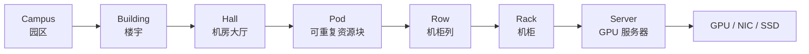
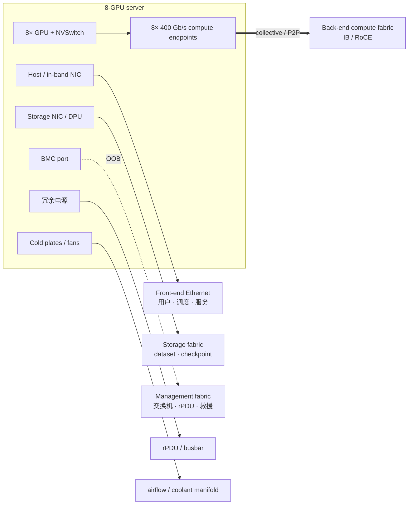

# L27 走进 AI 数据中心：从机柜、功耗到四张网络

> [!abstract] 本课速览
> 读完你将能够：
> 1. 从 campus 一路画到 GPU，说明 rack、U、pod 分别描述什么层级；
> 2. 用 power density 和 PUE 解释为什么“还有机柜空位”不等于“还能继续上 GPU”；
> 3. 区分 back-end、front-end、storage 与 management network，并说清 BMC 走哪张网；
> 4. 用统一口径复算 16,384 张 H100 集群约 25 MW 的设施功率；
> 5. 区分 east-west 与 north-south traffic，解释 AI collective 为什么给网络制造同步洪峰；
> 6. 在云论文中分清 datacenter、availability zone、region、colocation 与 hyperscaler。
>
> 前置：[[L25 节点内互联]] · 预计 50 分钟

## 论文里的这段话，你现在可能读不懂

> [!quote]
> “Within each **pod**, GPU servers are arranged in **racks** and attached to a high-bandwidth **back-end network** carrying synchronized **east-west traffic**. The **front-end**, **storage**, and **management networks** are isolated, while the **BMC** remains reachable through an out-of-band path. As rack **power density** rises, facility demand depends on **PUE**, and **liquid-cooled cold plates** become part of the system architecture rather than a facilities afterthought. Capacity may span **availability zones** and **regions**, with **colocation** sites used where power and construction schedules permit.”（改写自典型系统论文与基础设施文档表述）

这段话表面在讲“机房”，实际把三套约束压在一起：服务器放在哪里、电和热怎样进出、数据走哪张网。没有物理地图，读者很容易默认“GPU 数翻倍，其他东西照抄一份就行”；真实集群往往先撞上供电、散热、端口、光纤距离或故障域边界。

## 一、先把地图展开：园区不是一间摆满 GPU 的屋子

**datacenter**（数据中心）是容纳计算、网络、存储以及供电和散热设施的物理系统。它可以是一栋楼，也可以是一组建筑中的一个设施单元。大型园区通常继续分成 building、hall、row、rack 和 server；AI 集群还常用 pod 表示可重复部署的资源块。

**rack**（机柜）是安装服务器、交换机、配电单元和线缆管理部件的竖直框架。设备高度用 **U (rack unit)**（机架单位）描述：一台 8U 服务器占用连续 8 个竖向安装单元。U 只回答“高度装不装得下”，不回答电、热、重量和线缆是否还能承受。

以一台 8-GPU DGX H100 为代表，它的官方 form factor 是 8U；本课程按照 [[03 约定与符号]] 把 8×H100 节点整机功耗记作约 10 kW。[^dgx-h100] 如果只看 U，似乎一柜还能塞进好几台；但 4 台就已经是

$$
4\times 10 \text{kW}=40 \text{kW}
$$

的 IT 功率，还没算同柜交换机和其他设备。于是机柜可能“U 还有空，电和冷却余量先没了”。这就是 **power density**（功率密度）：在本课语境里通常指每个 rack 承载的 IT 功率，常写成 kW/rack；若论文按单位地板面积计算，必须另看分母。

传统通用机柜常处在十千瓦量级，新的 rack-scale AI 系统则进入百千瓦量级。这里故意只记量级，不把某一代产品的峰值当作所有部署的固定值。更高密度的意义也不是“同样的机房免费塞更多卡”：上游变压器、UPS、母线、rPDU、冷却管路和消防设计都要跟着改变。

**pod**（资源舱 / 集群单元）没有跨厂商统一的 GPU 数。它通常指一组可重复部署、网络和运维边界相对清晰的 racks/servers：有的文档用几十台服务器构成一个 building block，有的新闻会把千卡级资源块也叫 pod。看到“one pod”时，先找作者给出的 node、GPU、switch 和 failure-domain 定义，不能自行换算。

> [!tip] 直觉
> campus 像大学园区，building 是教学楼，hall 是楼层，row 是走廊，rack 是书架，U 是每本书占几格。pod 更像“一整套可复制的实验室配置”——它会跨几个书架，但规模由设计者定义。

## 二、算力即电力：PUE 和液冷把“设施”拉进系统设计

GPU 用掉的电最后几乎都变成热。电力从电网经过变电、**uninterruptible power supply (UPS)**（不间断电源）和 **power distribution unit (PDU)**（配电单元）进入服务器；热再经空气或液体搬到室外。AI 系统论文若只写 accelerator TDP 而不写 facility boundary，读者就无法判断它算的是芯片、IT 设备还是整座设施。

**PUE (Power Usage Effectiveness)**（电能使用效率）定义为

$$
\mathrm{PUE}
=
\frac{P_{\text{facility}}}{P_{\text{IT}}}
=
\frac{E_{\text{facility}}}{E_{\text{IT}}}.
$$

分子是整座数据中心输入的总功率或总能量，分母是服务器、网络与存储等 IT 设备使用的功率或能量。美国能源部资料也采用这一定义。[^pue] [[03 约定与符号]] 的教学取值是 1.2：每 1 MW IT 负载需要约 1.2 MW 设施输入，其中约 0.2 MW 落在冷却、配电损耗等非 IT 开销上。

PUE 越接近 1，说明设施附加开销相对越小；但它不告诉你 GPU 是否忙、模型 MFU 是否高，也不告诉你电力来源的碳强度。一个 GPU 长时间空转的机房也可能有漂亮的 PUE。

### 2.1 从风冷到 cold plate

**liquid cooling**（液冷）泛指用液体作为关键传热介质的冷却方案；它不自动等于把整台服务器泡进液体。高功率 AI 机柜常见的是 direct-to-chip 路线：在 CPU/GPU 上贴合 **cold plate**（冷板），让冷却液经过冷板内部流道带走热量，再由 manifold（歧管）和 **coolant distribution unit (CDU)**（冷却液分配单元）把热送到设施水路。

| 路线 | 热怎样离开芯片 | 适合什么密度 | 仍要留意什么 |
|---|---|---|---|
| 风冷 | 散热器把热交给高速气流 | 较低到中等 rack power density | 风机功耗、噪声、风道和热点 |
| direct-to-chip 液冷 | cold plate 把芯片热量直接交给液体 | 高 power density | 管路、泵、CDU、泄漏检测和维护 |
| 混合冷却 | CPU/GPU 液冷，NIC/SSD 等仍风冷 | 当前高密度系统常见形态 | 不能因为“液冷”就删掉全部风道 |

NVIDIA 的 rack-scale 系统文档就明确画出了 manifold 与贴合 CPU/GPU 的 cold plates，同时说明网络和存储部件仍由风扇冷却。[^gb-cooling] 所以“液冷机柜”常是液体和空气共同工作，不是二选一。

更麻烦的是功率不只“大”，还可能“同步变化”。大规模训练中，许多 GPU 会在计算、collective、checkpoint 或故障暂停之间一起切换，相关功率变化可能传到供电侧。美国能源部在 2026 年已把大规模 AI 负载的电力振荡和测量问题单独提出。[^power-oscillation] 这给系统研究打开了新问题：power capping、负载整形、作业错峰、储能协同和 grid-aware scheduling 怎样既保护电网又少损失训练吞吐？

### 2.2 算一算：16,384 张 H100 为什么约等于 25 MW

> [!example] 功率账：从 GPU TDP 算到设施进线
> 统一口径全部来自 [[03 约定与符号]]：
>
> - H100 SXM 功耗：700 W/GPU；
> - 8×H100 节点整机功耗：约 10 kW/node；
> - PUE：1.2；
> - 场景规模：16,384 张 GPU，每节点 8 张。
>
> **第一步：节点数。**
> $$
> N_{\text{node}}=\frac{16{,}384}{8}=2{,}048 \text{nodes}.
> $$
>
> **第二步：只算 GPU 芯片。**
> $$
> P_{\text{GPU}}
> =16{,}384\times700 \text{W}
> =11{,}468{,}800 \text{W}
> \approx11.47 \text{MW}.
> $$
>
> **第三步：按整机口径算 IT 负载。**
> $$
> P_{\text{IT}}
> =2{,}048\times10 \text{kW}
> =20{,}480 \text{kW}
> =20.48 \text{MW}.
> $$
> 芯片账与整机账之间约 9.01 MW 的差额，来自 CPU、DRAM、SSD、NIC、风扇和电源损耗等节点内开销；它们不是“免费配件”。
>
> **第四步：乘 PUE 得到设施输入。**
> $$
> P_{\text{facility}}
> =1.2\times20.48 \text{MW}
> =24.576 \text{MW}
> \approx25 \text{MW}.
> $$
>
> **第五步：一天的能量。**
> $$
> E_{\text{day}}
> =24.576 \text{MW}\times24 \text{h}
> =589.824 \text{MWh}
> =589{,}824 \text{kWh}.
> $$
> 若当地全包电价为每 kWh $c$ 个货币单位，则日电费是
> $$
> C_{\text{day}}=589{,}824c.
> $$
> 电价随地区、合同和时段变化，[[03 约定与符号]] 没有登记统一值，因此本课保留为变量，不把某个报价伪装成普适常数。

**megawatt (MW)**（兆瓦）是功率单位，$1 \text{MW}=10^6 \text{W}$。MW 回答“此刻需要多大功率”，MWh 回答“一段时间用了多少能量”。把“25 MW 的集群”写成“25 MWh 的集群”，就像把车速和路程混在一起。

## 三、核心观念：AI 数据中心里不是一张网

上一课 [[L25 节点内互联]] 讲到数据离开 NVLink domain 后要经过 NIC 进入 scale-out 网络。本课再加一个问题：它进入的是哪张网？在一套可运维的 AI 集群里，至少要区分下列四种逻辑网络。NVIDIA SuperPOD 的参考架构也把 compute、storage、in-band management 和 out-of-band management 分开描述。[^superpod-fabrics]

| 网络 | 主要承载什么 | 常见端点 / 技术 | 最怕什么 |
|---|---|---|---|
| **back-end network**（后端计算网） | all-reduce、all-to-all、TP/PP send-recv、分布式推理通信 | GPU 邻近 NIC/DPU；InfiniBand 或 RoCE | 拥塞、长尾、丢包恢复、拓扑不匹配 |
| **front-end network**（前端接入网） | 用户请求、登录、调度控制、镜像/代码仓库和对外服务 | host NIC；通常是 Ethernet/IP | 多租户隔离、接入可靠性、north-south tail latency |
| **storage network**（存储网） | dataset 读取、checkpoint 写入、模型加载 | storage NIC/DPU；Ethernet、RoCE 或 InfiniBand 均可能 | I/O 洪峰干扰训练通信、带宽不足 |
| **management network**（管理网） | 裸机配置、监控、交换机/rPDU 管理、故障救援 | host 管理口与 BMC；常有独立 OOB Ethernet | 主机挂死后也必须可达，权限隔离 |

这四张“网”是逻辑职责，不保证永远有四套完全独立的交换机和线缆。小集群可能让 front-end 和 storage 共用物理 Ethernet，再用 VLAN/VRF/QoS 隔离；高性能集群则常把 compute fabric 独立出来，避免 checkpoint 洪峰挤占 collective。论文写“we use a 400G network”仍不够，你必须继续问：哪张网、每节点几端口、是否与 storage 共用、oversubscription 多少？

**BMC (Baseboard Management Controller)**（基板管理控制器）是一颗独立的管理控制器。即使主机 OS 卡死，管理员仍可通过它读传感器、看事件日志、远程开关机或进入远程控制台。它通常走 management network 的 **out-of-band (OOB)** 路径，不依赖训练进程和主机数据面正常工作。BMC 带宽不大，但在故障恢复时价值极高。

### 3.1 一台 GPU 服务器为什么接着十余条线

[[03 约定与符号]] 的典型 H100 节点 scale-out 口径是 8×400 Gb/s，每张 GPU 对应 400 Gb/s 端点。再加 front-end、storage、BMC、冗余电源以及可能的冷却液进出，一台服务器背后出现十余条连接毫不奇怪。注意，NIC endpoint 数不一定等于肉眼看到的线缆数：一个 OSFP 接口可以 breakout（从一个物理接口分成多路链路），厂商布线也可能合并职责。图的目的不是背端口，而是学会按职责追线。

> [!warning] “前端/后端”取决于上下文
> 本课的 back-end 是 GPU 间 compute fabric，不是 Web 开发里的后端服务；front-end 是面向用户、控制和外部系统的接入侧，也不意味着 storage 与 management 必须物理并入同一张网。读论文先找作者的 topology figure 和端口表。

## 四、流量方向与规模：万卡不是把千卡复制十次

**east-west traffic**（东西向流量）指数据中心内部服务器、机柜或 pod 之间的流量；**north-south traffic**（南北向流量）指穿越数据中心或集群边界、面向用户或外部网络的流量。

训练的 gradient collective、MoE all-to-all 和 pipeline send/recv 都是 east-west。它们最难伺候的地方不只是“字节多”，而是成千上万个 rank 按同一训练 step 同步行动：一批流可能同时起跑、同时汇聚到相同链路。在线推理既有 north-south 的请求/响应，也可能因 tensor parallel、KV cache 迁移或跨副本路由产生大量 east-west。方向只是地理关系，不能直接等同于业务类型。

### 4.1 从千卡到 GW 园区

用相同的 8×H100 节点约 10 kW、PUE 1.2 做教学估算，可以得到直观的规模梯子：

| GPU 规模 | 节点数 | IT 功率估算 | 设施功率估算 | 应怎样理解 |
|---:|---:|---:|---:|---|
| 1,000（取可整除近似 1,024） | 128 | 1.28 MW | 1.54 MW | pod 级量级；“pod”本身不是 1,024 卡的定义 |
| 16,384 | 2,048 | 20.48 MW | 24.58 MW | Llama-3-405B 公开训练规模的量级 |
| 100,000 | 12,500 | 125 MW | 150 MW | 十万卡级；已经是大型电力负载 |
| 1 GW campus | — | — | 1,000 MW 规划容量 | 通常容纳多栋楼、多批集群，不等于一张无边界 back-end network |

表中前 3 行是统一口径下的满载近似，不是运营商公布的实测电表值；实际还受 GPU 型号、功率上限、利用率和设施配置影响。《The Llama 3 Herd of Models》公开了约 16K H100 的训练集群规模；xAI 的 Colossus 在 2024 年公开达到 100,000 张 Hopper GPU。[^llama3] [^colossus] 截至 2026 年，公开项目已经以 1 GW 园区描述规划容量，但“已开工/规划”不能写成“全部投运”，GW campus 也不表示园区里的所有 accelerator 都由一张无边界的二层网直接连接。[^gw-campus]

为什么不把所有 GPU 都塞在一栋楼？因为楼宇的变电容量、冷却、承重、光纤距离和建设周期都有上限。跨楼以后，链路更长、故障域更大；跨 availability zone 或 region 后，时延、带宽、成本与合规又进入问题定义。这正是 [[L63 跨域与跨集群训练]] 的伏笔：所谓“scale-out 的 scale-out”，首先是一道物理约束题。

## 五、AI 数据中心与传统云数据中心：差别在相关性

“传统云数据中心只跑网站、AI 数据中心只跑训练”都太绝对。云里同样有 HPC、存储和大规模 east-west 流量，AI 设施也要承载用户请求和多租户服务。更有用的比较是看典型工作负载的相关性和单作业规模：

| 维度 | AI 训练 / 大模型基础设施的典型倾向 | 通用云数据中心的典型倾向 |
|---|---|---|
| 工作负载 | 少量超大、长时间、gang-scheduled 作业；rank 强同步 | 海量大小不一、彼此较独立的 VM、容器和服务 |
| 流量 | east-west 比例高，collective 同步突发；一个作业可占大量链路 | north-south 与 east-west 混合；微服务也会大量东西向，但流更易统计复用 |
| 放置 | 强调 GPU/NIC/rail/pod 亲和性，连续资源很重要 | 强调弹性、多租户隔离、碎片利用和故障域分散 |
| 网络目标 | 高 bisection bandwidth、低 collective tail、性能可预测 | 灵活接入、隔离、成本与平均利用率的综合平衡 |
| 故障恢复 | 训练常依赖 checkpoint、作业重调度和 spare；同步作业容易被单个 straggler 拖住 | 常用实例/服务副本、重路由或迁移吸收单点故障 |
| 功率行为 | 大量 accelerator 同步切换，负载相关性强 | 多样负载互相平滑的机会更大 |

这张表是“典型倾向”，不是定义。大模型在线推理首先是一个服务，照样需要副本、SLO 和实例级 failover；传统分布式数据库也会有同步复制和 east-west 洪峰。真正让 AI DC 难的是：一个作业能同时关联数千节点，网络、功率和故障的局部事件会被同步放大。

## 六、云论文里的地理名词与现实约束

| 术语 | 一句话地图 | 读论文时追问 |
|---|---|---|
| **hyperscaler**（超大规模基础设施运营商） | 自建或大规模运营许多数据中心与全球网络的平台型公司 | 自研网络/芯片/调度能否被普通用户复现？ |
| **colocation**（第三方机房托管） | 设施商提供空间、供电、冷却和网络接入，客户放置或运营自己的设备 | 可用 rack power density、液冷、cross-connect 和扩容周期怎样？ |
| **availability zone**（可用区，AZ） | 云厂商在一个 region 内划分的相互隔离位置，可含一个或多个物理数据中心 | 作业是否跨 AZ？故障隔离换来了多少时延和流量费？ |
| **region**（区域） | 云厂商定义的独立地理区域，通常包含多个 AZ | 数据主权、服务可用性和跨 region RTT 怎样约束方案？ |

AWS 的官方定义就是“Region 是独立地理区域，AZ 是 region 内相互独立的位置；一个 AZ 可由一个或多个离散数据中心组成”。[^aws-az] 其他云的命名与边界可能不同，因此 region/AZ 不是国际计量单位。

colocation 也不等于“云上租 GPU”。colo 客户可能拥有服务器和网络设备，只租机房空间、电、冷却与线路；云租户通常拿到抽象后的 VM/instance，物理 topology、邻居流量和 placement 控制更有限。于是同一篇通信优化论文：

- 在自建集群里可以固定 rail、交换机和 rank placement；
- 在 colo 里可能控制服务器和 fabric，却受现有电力、冷却和跨接资源约束；
- 在公有云里可能只能申请 placement group，无法验证每条物理链路。

这不是工程“杂事”，而是研究复现的边界条件。结果若依赖独占无收敛网络，却只写“在云上使用 400G GPU instances”，证据仍然不完整。

> [!warning] 三个常见误区
> 1. **“数据中心网络就是一张网。”** 至少先区分 back-end、front-end、storage 和 management；物理是否合并是下一问。
> 2. **“U 还空着就能继续上服务器。”** rack power density、冷却、重量和线缆可能比高度先到上限。
> 3. **“云上租卡与自建同配置等价。”** GPU 型号相同，不代表 topology visibility、placement、oversubscription、故障域和邻居干扰相同。

## 回到开头那段话

现在逐句回读：

1. “Within each pod, GPU servers are arranged in racks and attached to a high-bandwidth back-end network carrying synchronized east-west traffic。”——pod 是可重复资源块而非固定卡数；rack/U 是物理安装层；back-end 承载 GPU collective，这些东西向流量常随训练 step 同步突发。
2. “The front-end, storage, and management networks are isolated, while the BMC remains reachable through an out-of-band path。”——用户接入、dataset/checkpoint、日常与救援管理有不同故障和性能目标；BMC 走 OOB，正是为了主机 OS 挂掉时还能救机器。
3. “As rack power density rises, facility demand depends on PUE, and liquid-cooled cold plates become part of the system architecture rather than a facilities afterthought。”——高密度机柜先撞电和热；IT 功率乘 PUE 才是设施输入；cold plate 把 CPU/GPU 热直接交给液体，但其他部件仍可能风冷。
4. “Capacity may span availability zones and regions, with colocation sites used where power and construction schedules permit。”——单楼资源有限，扩容会跨设施边界；AZ/region 带来新的时延与故障域，colo 则用设施控制权换建设速度，但不会消除电、冷却和网络约束。

你现在应该能把整段压成一句话：==AI 数据中心不是“很多 GPU 的房间”，而是计算、网络、供电、散热和故障域共同组成的一台 warehouse-scale computer。==

## 术语卡片

| 术语 | 中文 | 一句话解释 |
|---|---|---|
| datacenter | 数据中心 | 容纳计算、网络、存储以及供电和散热设施的物理系统。 |
| rack | 机柜 | 安装服务器、交换机、配电与线缆管理部件的竖直框架。 |
| U (rack unit) | 机架单位 | 描述设备占用机柜垂直高度的标准化安装单位。 |
| pod | 资源舱 / 集群单元 | 一组可重复部署、网络与运维边界相对清晰的 racks/servers，规模由具体设计定义。 |
| power density | 功率密度 | 单个 rack 或单位机房面积承载的 IT 功率，使用时必须注明分母。 |
| PUE | 电能使用效率 | 数据中心总功率或能量除以 IT 设备功率或能量。 |
| liquid cooling | 液冷 | 用液体作为关键传热介质、把高热流密度设备热量带走的冷却方式。 |
| cold plate | 冷板 | 贴合 CPU/GPU、让冷却液通过内部流道吸热的换热部件。 |
| back-end network | 后端计算网 | 承载 GPU/accelerator 间 collective 与分布式计算流量的高性能网络。 |
| front-end network | 前端接入网 | 承载用户请求、登录、控制与外部服务接入的网络。 |
| storage network | 存储网 | 承载 dataset、checkpoint 和模型文件读写流量的网络。 |
| management network | 管理网 | 承载配置、监控、设备管理和故障救援流量的网络。 |
| BMC | 基板管理控制器 | 独立于主机 OS 的硬件管理控制器，可用于监控、远程控制和故障救援。 |
| east-west traffic | 东西向流量 | 数据中心内部服务器、机柜或 pod 之间的流量。 |
| north-south traffic | 南北向流量 | 穿越数据中心或集群边界、面向用户或外部网络的流量。 |
| hyperscaler | 超大规模基础设施运营商 | 自建或大规模运营众多数据中心与全球网络的平台型公司。 |
| availability zone | 可用区 | 云 region 内相互隔离的部署位置，可包含一个或多个物理数据中心。 |
| region | 区域 | 云厂商定义的独立地理区域，通常包含多个 availability zones。 |
| colocation | 第三方机房托管 | 由设施商提供空间、供电、冷却和网络接入，客户部署自己的设备。 |
| megawatt | 兆瓦 | 等于 $10^6$ W 的功率单位，常用于描述集群或园区电力规模。 |

## 自测

1. 从 campus 到 GPU 画出空间层级，并说明 rack、U 和 pod 为什么不能互相换算。
2. PUE=1.2 的含义是什么？为什么它不能证明 GPU utilization 或 MFU 很高？
3. 按 [[03 约定与符号]] 估算 8,192 张 H100、每节点 8 卡时的节点数、IT 功率、设施功率和一天能耗。
4. 分别说明 back-end、front-end、storage 和 management network 的主要流量；为什么 BMC 应走 OOB？
5. east-west 与 north-south 按什么边界区分？训练 collective 和在线推理请求分别属于哪一类？
6. 为什么通用云数据中心也可能有大量 east-west traffic？AI 训练网络真正特殊的地方是什么？
7. 一篇论文只说“在云上使用同型号 400G GPU 实例复现实验”。你还会追问哪些 topology 与 placement 条件？

> [!note]- 参考答案
> 1. campus → building → hall → pod → row → rack → server → GPU/NIC/SSD。rack 是物理框架，U 只量设备高度，pod 是设计者定义的可重复资源块；三者的分母和边界不同。
> 2. 设施总功率约为 IT 功率的 1.2 倍，非 IT 附加开销约为 IT 功率的 20%。PUE 不观察 GPU 做了多少有效计算，因此不能替代 GPU utilization 或 MFU。
> 3. 节点数 $8192/8=1024$；IT 功率 $1024\times10\ \text{kW}=10.24\ \text{MW}$；设施功率 $10.24\times1.2=12.288\ \text{MW}$；一天能耗 $12.288\times24=294.912\ \text{MWh}$。
> 4. back-end 承载 collective/P2P；front-end 承载用户、登录和服务接入；storage 承载 dataset/checkpoint；management 承载配置、监控和救援。BMC 走 OOB，主机 OS 或数据面故障时仍可远程诊断与重启。
> 5. 以数据中心或集群边界区分：内部节点间是 east-west，穿越边界是 north-south。训练 collective 通常是 east-west；用户请求/响应通常是 north-south，但分布式推理内部通信仍是 east-west。
> 6. 微服务、数据库复制和分布式存储都会制造大量 east-west。AI 训练更特殊的是单个超大作业内众多 rank 强同步，流量在时间和路径上高度相关，局部拥塞会拖慢整个 step。
> 7. 至少追问：400 Gb/s 是每 GPU、每节点还是共享端口；back-end 是否独占；物理拓扑与 oversubscription；节点是否同 rack/pod/rail；placement group 是否固定；storage 是否共网；是否存在邻居流量；故障域和重试策略是否一致。

## 延伸阅读

- [《The Datacenter as a Computer: Designing Warehouse-Scale Machines》第 3 版](https://research.google/pubs/the-datacenter-as-a-computer-designing-warehouse-scale-machines/)（Barroso、Hölzle、Ranganathan，2018）：先读第 1 章，建立“整座数据中心是一台计算机”的总视角。
- [NVIDIA DGX SuperPOD：Network Fabrics](https://docs.nvidia.com/dgx-superpod/reference-architecture-scalable-infrastructure-b200/latest/network-fabrics.html)：对照 compute、storage、in-band 和 OOB 四张网，重点看端口属于谁、故障时哪张网仍可用。
- [SemiAnalysis《AI Datacenter Energy Dilemma – Race for AI Datacenter Space》](https://semianalysis.com/2024/03/13/ai-datacenter-energy-dilemma-race/)：用来获得 rack、colo、电力和建设周期的工程体感；其中预测和成本数字是分析口径，不作为本课程统一常数。
- [美国能源部《Monitoring Oscillations from Large Data Centers》](https://www.energy.gov/oe/articles/monitoring-oscillations-large-data-centers)：看到 AI workload 怎样从集群调度问题一路影响到电网测量与稳定性。

[^dgx-h100]: [NVIDIA《Introduction to DGX H100/H200 Systems》](https://docs.nvidia.com/dgx/dgxh100-user-guide/introduction-to-dgxh100.html)列出 DGX H100 的 8U form factor、8 张 H100、cluster/storage/management ports 与 BMC；正文功率估算仍统一采用 [[03 约定与符号]] 的约 10 kW/node。
[^pue]: [U.S. Department of Energy《Cooling Water Efficiency Opportunities for Federal Data Centers》](https://www.energy.gov/cmei/femp/cooling-water-efficiency-opportunities-federal-data-centers)把 PUE 定义为数据中心年度总能耗与 IT 设备年度能耗之比；正文教学值 1.2 取自 [[03 约定与符号]]。
[^gb-cooling]: [NVIDIA《DGX GB Rack Scale Systems — Hardware》](https://docs.nvidia.com/dgx/dgxgb200-user-guide/hardware.html)说明 compute tray 的冷却液经 manifold 流过贴合 CPU/GPU 的 cold plates，而 networking/storage devices 仍由风扇冷却。
[^power-oscillation]: [U.S. Department of Energy《Monitoring Oscillations from Large Data Centers》](https://www.energy.gov/oe/articles/monitoring-oscillations-large-data-centers)（2026）讨论同步 AI 训练负载引起的周期性电力波动及 PMU/point-on-wave 测量问题。
[^superpod-fabrics]: [NVIDIA DGX SuperPOD《Network Fabrics》](https://docs.nvidia.com/dgx-superpod/reference-architecture-scalable-infrastructure-b200/latest/network-fabrics.html)明确区分 compute、storage、in-band management 与 out-of-band management fabrics，并说明 BMC 连接 OOB。
[^llama3]: Aaron Grattafiori 等，《[The Llama 3 Herd of Models](https://arxiv.org/abs/2407.21783)》（2024）公开了 405B 模型及约 16K H100 训练基础设施；本课电力数字是按统一节点功耗与 PUE 推导的教学估算，不是 Meta 电表实测。
[^colossus]: [NVIDIA Newsroom](https://nvidianews.nvidia.com/news/spectrum-x-ethernet-networking-xai-colossus)在 2024 年公布 xAI Colossus 达到 100,000 张 Hopper GPU；表中 150 MW 是本课按 [[03 约定与符号]] 推导的量级估算，不是运营商公布值。
[^gw-campus]: [OpenAI《Building the infrastructure for the Intelligence Age in Michigan》](https://openai.com/index/stargate-michigan-data-center/)（2026）描述一座已开工的 1 GW data center campus；正文明确把它作为规划容量，不等同于已全部投运的单一训练 fabric。
[^aws-az]: [AWS《Regions and Availability Zones》](https://docs.aws.amazon.com/global-infrastructure/latest/regions/aws-regions-availability-zones.html)定义 Region 为独立地理区域、AZ 为 Region 内相互独立的位置，并说明一个 AZ 可包含一个或多个物理数据中心。

---
上一课：[[L26 加速器生态与软件栈]] ← · → 下一课：[[L28 数据中心网络基础]]
