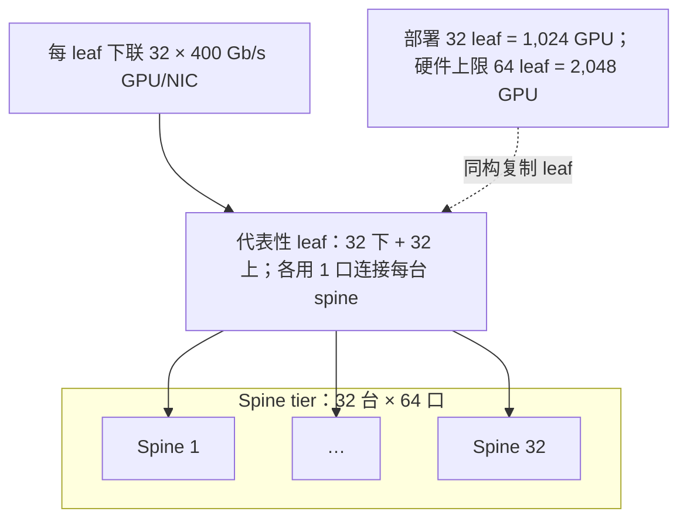
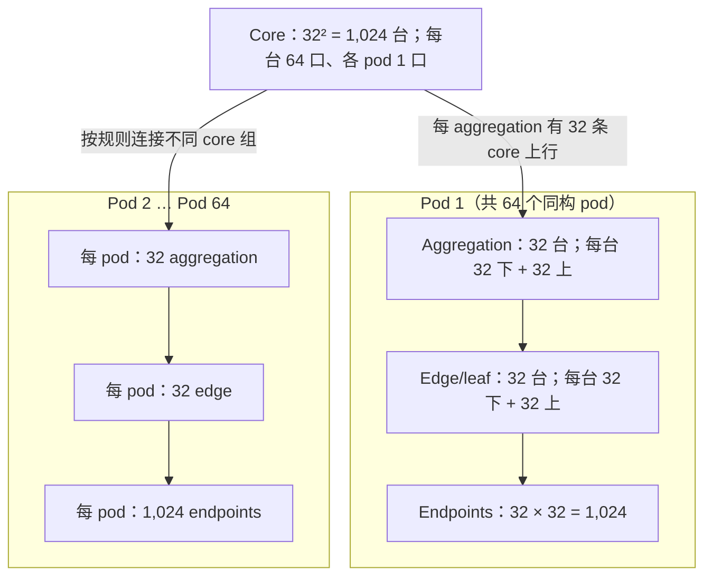
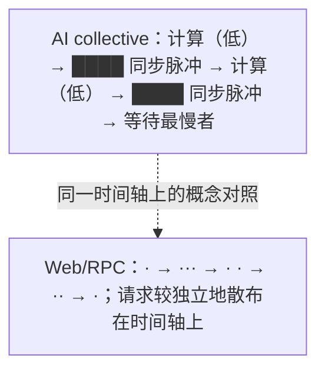

# L28 数据中心网络基础：Clos、带宽与 AI 流量

> [!abstract] 本课速览
> 读完你将能够：
> 1. 用 packet switching、RTT、serialization delay 与 propagation delay 快速拆开一条网络路径；
> 2. 从单根树的根瓶颈推导出 leaf-spine 与 fat-tree，认清 ToR、spine、aggregation、core 和 radix；
> 3. 独立计算 oversubscription、bisection bandwidth，并解释 full bisection 与 non-blocking 不保证“永不排队”；
> 4. 手搭 64 口 400 Gb/s 的两层 leaf-spine 与三层 fat-tree，复算 1,024、2,048 和 65,536 个端点分别从哪里来；
> 5. 区分 AI 与 Web 流量的统计性格，用 elephant/mice flow、FCT、bursty、synchronized 与 incast 解释训练网络为什么难；
> 6. 说明普通内核 TCP 能跑训练，却为什么常难以满足大规模训练对低开销、低长尾和可预测性的要求。
>
> 前置：[[L27 走进AI数据中心]] · 预计 50 分钟

## 论文里的这段话，你现在可能读不懂

> [!quote]
> “A **non-blocking leaf-spine Clos network** gives every **ToR** equal-cost paths through the **spine** tier and targets **full bisection bandwidth** without **oversubscription**. Distributed training, however, emits low-entropy **elephant flows** as **bursty, synchronized traffic**; a single straggling flow can extend collective **flow completion time**, while **incast** can congest one egress despite abundant aggregate bandwidth. Compared with statistically multiplexed **mice flows**, these properties make predictable **east-west traffic** more important than a large headline link rate.”（改写自典型数据中心网络表述，并结合 Meta 的生产训练网络观察）[^meta-rdma]

这三句把“拓扑容量”和“流量行为”压在了一起。只会看端口上的 400G，还回答不了三个真正的问题：所有 GPU 同时通信时，中间有没有足够路径？流量是否会在同一毫秒一起冲向少数出口？最慢的那条流会不会让其余 GPU 全部等着？

本课就是把本科网络知识接到这三问上。网络方向的同学可以快读第一节，但第四节不要跳：AI 网络难在相关性，不只是字节多。

## 一、半页速通：一条消息到底慢在哪里

### 1.1 从 packet 到 Ethernet、IP、TCP

**packet switching**（分组交换）把应用数据切成 packet，让许多通信共享链路；交换机或路由器读取 header，逐跳决定下一站。它像公路上的货车：不同货主不必预占一条端到端专线，但会在同一出口排队。

对本课够用的分工是：

| 层次 | 主要回答什么 | 在数据中心里常见的关注点 |
|---|---|---|
| Ethernet（二层） | 同一链路或二层域里，frame 怎样送到下一跳？ | 端口、MAC、VLAN、链路速率 |
| IP（三层） | packet 跨子网怎样选下一跳？ | 路由、ECMP、多条等价路径 |
| TCP（传输层） | 两端怎样得到可靠、有序的 byte stream？ | 连接、确认、重传、流量与拥塞控制 |

这些不是三套互斥网络。一个 TCP segment 通常封装进 IP packet，再装进 Ethernet frame，最终从物理链路发出去。后面的 RoCEv2 会换掉 TCP 数据面，但仍会使用 Ethernet、IP 和 UDP；细节留到 [[L29 RDMA原理]]。

### 1.2 RTT、串行化与传播：不要把所有时延叫 ping

**RTT (round-trip time)**（往返时延）是请求从发送端到接收端、响应或确认再返回发送端的总时间。它会包含端点处理、NIC/交换机处理、排队、串行化和传播等部分。RTT 是“来回总账”，不是某一段光纤的单向时延。

把长度为 $L$ bit 的 packet 推上一条速率为 $R$ bit/s 的链路，需要 **serialization delay**（串行化时延）：

$$
T_{\text{ser}}=\frac{L}{R}.
$$

它像把一列火车逐节送进隧道：第一节已经进入，最后一节还在入口。链路速率越高，同一个 packet 的串行化越快。按 [[03 约定与符号]]，400 Gb/s 是每方向的端口速率，也就是 50 GB/s。若一个阶段要把 1 MB 数据完整压上链路，那么理想串行化时间是

$$
T_{\text{ser}}
=\frac{1\times10^6\ \text{B}\times8\ \text{b/B}}
{400\times10^9\ \text{b/s}}
=20\ \mu\text{s}.
$$

数据的第一个 bit 进入介质后，还要走过距离 $d$。若介质中的传播速度为 $v$，**propagation delay**（传播时延）是

$$
T_{\text{prop}}=\frac{d}{v}.
$$

它像火车头在隧道里行驶：提高端口速率会缩短“整列车进隧道”的时间，却不会改变隧道长度和介质中的传播速度。数据中心内路径短时，排队、端点处理和串行化常更值得盯；跨 region 后，距离带来的传播时延就很难藏住。

> [!warning] 单位纪律
> 400 **Gb/s** 不是 400 **GB/s**。按 [[03 约定与符号]] 除以 8 后是 50 GB/s；端口速率还是每方向口径。把 bit、Byte 或单向、双向混掉，后面的拓扑容量会整整错 8 倍或 2 倍。

## 二、为什么不是一棵随便的树

### 2.1 单根树：越靠上，越像只有一个收费站

最直观的数据中心网络是一棵树：服务器接 access switch，access 再汇聚到更大的上层交换机。问题在于叶子数量随层级增长，根部端口和带宽却不会凭空增长。不同机柜间的 **east-west traffic**（东西向流量）都向根部收敛，根链路变成共享瓶颈；根设备故障还可能切断大片集群。

解决思路不是把根无限做大，而是增加“根”和路径：让每个下层交换机同时连接多个上层交换机，任意两组端点间都有多条等价路径。这就是 **Clos network**（Clos 多级互联网络）的核心直觉：用许多规模较小的交换单元，拼出高带宽、可扩展的多级网络。数据中心里的 **fat-tree**（胖树）是 Clos 的一种规则化实例；越靠近树根，逻辑总容量不再变“瘦”。Al-Fares 等的 SIGCOMM 2008 论文给出了用同构 commodity switches 搭 k-ary fat-tree 的经典构造。[^fattree]

> [!tip] 直觉
> 普通树像全城最后只剩一座桥；Clos 像在河上并排修很多桥，并让每个街区都能到达每座桥。路径多只是第一步，路由还得把车分开——这会在 [[L32 路由与负载均衡]] 继续讲。

### 2.2 两层 leaf-spine：每个 leaf 都认识每个 spine

**leaf-spine**（叶脊网络）有两种设备角色：

- **leaf** 连接服务器、GPU NIC 或其他端点；部署在机柜顶部时常叫 **ToR (top-of-rack)**（机架顶部交换机）。ToR 描述位置/角色，不表示所有 leaf 必须真的摆在每个 rack 顶部。
- **spine**（脊交换机）连接所有 leaf，提供 leaf 之间的等价上行路径。任意 leaf 不直接连另一个 leaf，而是经某台 spine 到达。

一台交换机能提供多少个可用于互联的端口，称为 **radix**（端口基数）。本课假设每台交换机 radix 为 64、每个端口 400 Gb/s。每台 leaf 把 32 口用于下联 GPU，另 32 口各连一台 spine，于是下行与上行都是

$$
32\times400\ \text{Gb/s}=12.8\ \text{Tb/s}.
$$

这里有一个很容易漏掉的端口守恒：

- leaf 有 32 个上行口，所以最多连接 32 台 spine；
- spine 的 64 个端口全都可以下联 leaf，所以最多连接 64 台 leaf；
- 因而完整二部图的硬件上限是 $64\times32=2{,}048$ 个端点。

若只部署 32 台 leaf，就得到设计练习里的 $32\times32=1{,}024$ 个端点，但每台 64 口 spine 只使用了 32 个端口，仍留有 32 个端口给后续 leaf。Cisco 的两层设计说明也明确区分：spine 数受每台 leaf 的上行口数限制，leaf 数受每台 spine 的端口数限制。[^two-tier-scale]

> [!warning] “两层”与“3-stage”可能在说同一张网
> 工程师说 two-tier leaf-spine，通常在数设备角色：leaf、spine 两层。Clos 理论有时按端到端经过的 switching stages 计数：leaf → spine → leaf 是 3-stage Clos。看到“3-stage”先看图，不要只凭数字猜层级。

### 2.3 三层 fat-tree：edge、aggregation、core 规则复制

两层拓扑最终受 spine radix 限制：一台 spine 没口再接新 leaf，就要再加一级。经典 k-ary fat-tree 使用相同的 k 口交换机，分成三个设备层级：

- 最下层 edge/leaf 连接端点；
- 中间 **aggregation**（汇聚层）连接同一个 pod 内的 edge，并上联 core；
- 顶层 **core**（核心层）把不同 pod 接起来。

在两层 leaf-spine 里，spine 本身承担汇聚角色；在三层 fat-tree 里，aggregation 与 core 是分开的设备层。不同厂商也可能把 aggregation 叫 spine、把 core 叫 super-spine，所以论文图比名字更可靠。

对偶数 $k$，经典构造是：

1. 一共有 $k$ 个 pod；
2. 每个 pod 有 $k/2$ 台 edge 和 $k/2$ 台 aggregation；
3. 每台 edge 用 $k/2$ 口接端点、$k/2$ 口接 aggregation；
4. core 有 $(k/2)^2$ 台，每台用 $k$ 口各接一个 pod。

因此端点数是

$$
N_{\text{endpoint}}
=k\times\frac{k}{2}\times\frac{k}{2}
=\frac{k^3}{4}.
$$

代入 $k=64$：

$$
N_{\text{endpoint}}
=\frac{64^3}{4}
=65{,}536.
$$

这里的“65,536 端口”准确说是 65,536 个端点-facing ports；本课场景假设每个 GPU 独占一个 400 Gb/s NIC endpoint，才可换算成 65,536 张 GPU。经典论文还把这种 fat-tree 描述为 **rearrangeably non-blocking**：对任意可容纳的通信配对，存在一组路径可以用满端点带宽，但可能需要重新安排已有路径，而不是任意路由算法天然都无阻塞。[^fattree]

## 三、三个容量词：收敛比、对分带宽、无阻塞

### 3.1 oversubscription：下行需求除以上行供给

**oversubscription**（收敛比 / 超额订阅）描述端点可注入带宽相对上层可承载带宽的比例。对一台 leaf，常按下式记账：

$$
\rho
=\frac{B_{\text{down}}}{B_{\text{up}}}
=\frac{n_{\text{down}}r_{\text{down}}}
{n_{\text{up}}r_{\text{up}}}.
$$

32 个 400 Gb/s 下行、32 个 400 Gb/s 上行得到

$$
\rho=\frac{32\times400}{32\times400}=1:1.
$$

若把 64 口 leaf 切成 48 下、16 上且速率相同，则是

$$
\rho=\frac{48}{16}=3:1.
$$

3:1 的含义不是每个端点永远只能跑到三分之一，而是所有 48 个下联端点同时向 leaf 外发送时，上行总容量只能覆盖需求的三分之一。若大多数端点不同时打满，统计复用会让单个活跃流仍可能拿到线速。

通用云网络可以为了端口、光模块、功耗与成本采用 3:1 之类的设计，因为大量租户和服务的峰值不总在同一时刻。性能敏感的 AI back-end domain 更倾向 1:1，因为同一 collective 会让许多端点同时注入；但“整个 AI 后端网必然处处 1:1”也不成立。Meta 的生产网络就在单个 AI Zone 内采用 non-blocking Clos，而跨 AI Zone 链路有意 oversubscribe，再用 topology-aware scheduling 减少跨 zone 流量。[^meta-rdma]

### 3.2 bisection bandwidth：最难切的不是总端口之和

**bisection bandwidth**（对分带宽）这样想：把全部端点分成数量相等的两半，计算跨过切面的链路容量；对所有等分方法取最小值。它问的是“最不利的半对半通信还能穿过多少”，不是把全网每个交换机的内部带宽相加。

对于 $N$ 个端点、每端点单向速率为 $r$ 的理想无收敛网络，**full bisection**（全对分带宽）要求最坏等分仍有

$$
B_{\text{bisect,full}}=\frac{N}{2}r
$$

的单向切面容量。之所以除以 2，是因为等分后每侧只有 $N/2$ 个发送端点。若把两个方向的同时传输相加会再乘 2，但本课遵守 [[03 约定与符号]]，沿用端口每方向速率和单向切面口径。

**non-blocking**（无阻塞）强调：对满足端口速率约束的通信需求，fabric 能找到不因内部容量不足而互相阻挡的路径。full bisection 是容量性质，non-blocking 还牵涉路径可实现性；二者都不保证现实中“从不排队”，因为 ECMP 哈希可能把大流撞到同一条链路，突发可能瞬时塞满 buffer，故障也会减少可用路径。

> [!example] 算一算：64 口 400G，从 1,024 到 65,536 个端点
> **口径来源：**交换机 radix=64、链路 400 Gb/s 是题设；Gb/s 到 GB/s、端口速率按每方向解释，来自 [[03 约定与符号]]；fat-tree 构造与 $k^3/4$ 公式已用 SIGCOMM 2008 原论文核实。[^fattree]
>
> **第一步：一台 leaf 的 1:1 端口切分。**
> $$
> 64=32\ \text{down}+32\ \text{up},
> $$
> $$
> B_{\text{down}}=B_{\text{up}}
> =32\times400\ \text{Gb/s}
> =12.8\ \text{Tb/s}.
> $$
>
> **第二步：部署 32 台 leaf 的练习实例。**
> $$
> N=32\ \text{leaf}\times32\ \text{GPU/leaf}
> =1{,}024\ \text{GPU}.
> $$
> 需要 32 台 spine，因为每台 leaf 有 32 条上行并各接一台 spine。每台 spine 此时连接 32 台 leaf，只用一半端口。
>
> **第三步：复算这个实例的 full bisection bandwidth。**
> $$
> B_{\text{bisect}}
> =\frac{1{,}024}{2}\times400\ \text{Gb/s}
> =204{,}800\ \text{Gb/s}
> =204.8\ \text{Tb/s}.
> $$
> 这是单向切面容量。对应每端点 50 GB/s，512 个端点从一侧发向另一侧，也可写成 $512\times50=25{,}600$ GB/s = 25.6 TB/s；乘 8 后仍是 204.8 Tb/s。
>
> **第四步：问清“部署规模”还是“硬件上限”。**
> 每台 64 口 spine 最多连接 64 台 leaf，因此同一 32-spine 设计可扩到
> $$
> N_{\max}=64\ \text{leaf}\times32\ \text{GPU/leaf}
> =2{,}048\ \text{GPU},
> $$
> $$
> B_{\text{bisect,max}}
> =\frac{2{,}048}{2}\times400\ \text{Gb/s}
> =409.6\ \text{Tb/s}.
> $$
> 所以 1,024 是“已部署 32 台 leaf 的实例”，不是 64 口 spine 的两层拓扑上限。
>
> **第五步：升级为经典三层 k-ary fat-tree。**
> 取 $k=64$：
> $$
> N_{\text{pod}}=64,
> \quad N_{\text{edge/pod}}=32,
> \quad N_{\text{host/edge}}=32,
> $$
> $$
> N_{\text{endpoint}}
> =64\times32\times32
> =\frac{64^3}{4}
> =65{,}536.
> $$
> core 数也可复算：$(64/2)^2=1{,}024$ 台。==记住的不是孤零零的 65,536，而是“pod 数 × 每 pod 的 edge 数 × 每 edge 的下联数”。==

> [!warning] 三个常见误区
> 1. **“带宽大就不会拥塞。”** 400 Gb/s 只说一条端口的线速；同步突发仍可在少数出口形成瞬时排队。
> 2. **“对分带宽等于交换机总带宽。”** 对分带宽只数最坏等分切面上的可用容量，分母和方向必须说清。
> 3. **“1:1 就等于每条流永远线速。”** 1:1 是设计容量；路由碰撞、buffer、故障和接收端瓶颈仍会拉长 FCT。

## 四、本课灵魂：AI 流量不是“放大版 Web”

### 4.1 先看五个词：少、大、突发、同步、等最慢者

Meta 对生产训练网络的描述很直接：相较传统数据中心 workload，AI 流量的 flow 数量和多样性更小，模式重复、可预测；在毫秒粒度呈 on/off burst；每次 burst 中单流强度可以接近 NIC line rate。论文还指出 collective 的 logical topology 稀疏，会造成 UDP 5-tuple 低熵，而 all-to-all 一类模式又可能制造 microburst。[^meta-rdma]

把这些观察拆成术语：

- **elephant flow**（大象流）是持续时间长或字节量大、能长期占据显著链路容量的 flow。训练中的大 tensor 传输常属于这一类。
- **mice flow**（老鼠流）是字节量小、完成很快的短 flow。Web/RPC 里常见大量 mice；它们很在意排队和握手带来的固定时延。
- **flow completion time (FCT)**（流完成时间）是一个 flow 从开始到全部数据完成传输所经历的时间。对 mice，几十微秒的固定开销可能占大头；对 elephant，长期可获得的带宽与拥塞恢复更关键。
- **bursty traffic**（突发流量）指流量强度在时间上明显 on/off，短时间内冲高，而不是平稳地匀速到达。
- **synchronized traffic**（同步流量）指许多发送者受同一个 step、barrier 或 collective 触发，在相近时刻开始通信。它比“各自偶尔突发”更危险，因为峰值会叠加。

下排只是“到达更分散、统计复用机会更大”的心智图，不声称真实 Web 流量严格服从 Poisson 分布。Web 数据中心同样有备份、存储、视频等 elephant；AI 在线服务也有 mice。区别是典型大规模训练作业内，众多 rank 的通信被同一计算图和 collective 强相关地触发。

### 4.2 为什么一条慢流会拖住全局

collective 不是“每条流各走各的，谁先到谁下班”。下一段计算往往要等 collective 的依赖全部满足。若一次通信阶段涉及 $m$ 条关键 flow，其完成时间至少受最慢者约束：

$$
T_{\text{collective}}
\ge
\max_{1\le i\le m} T_{\text{FCT},i}.
$$

某条流因哈希碰撞、重传或故障绕路变慢，它不只影响自己的发送者，还可能让所有已经完成通信的 GPU 空等。这个现象可称为 **straggler amplification**（拖尾放大）：局部网络长尾被同步语义放大成整个 step 的长尾。它解释了为什么训练网络常追求可预测的 tail，而不只追求平均吞吐。

| 维度 | 大规模 AI 训练的典型倾向 | Web / RPC 的典型倾向 |
|---|---|---|
| flow 数与熵 | 单 GPU 活跃 peer/flow 相对少，模式重复，低熵 | 大量连接与请求，端点组合更多 |
| 大小 | 大 tensor 形成 elephant flow | mice flow 很多，也可能混有 elephant |
| 时间 | 计算与通信交替，bursty | 到达更分散，统计复用机会较多 |
| 相关性 | collective 让许多 rank synchronized | 不同用户/服务请求通常较独立 |
| 完成条件 | 最慢关键 flow 可拖慢 collective 和 step | 单个请求慢通常先影响该请求及其调用链 |
| 设计目标 | 高利用率之外，更看重可预测 collective FCT | 常综合平均利用率、请求 p99、公平性与成本 |

### 4.3 incast：大家同时往一个门里挤

**incast**（多对一瞬时汇聚）指多个发送者在相近时刻把流量送向同一接收者或同一出口。即使全网总带宽很大，目标端口仍只有一条线速；多个输入同时到达会迅速占用 egress queue，随后触发排队、丢包或流控。

这正是“带宽大就不会拥塞”的反例：拥塞发生在某个时间、某个切面、某个出口，不发生在宣传页上的全网总容量。[[L30 无损网络与拥塞控制]] 会继续讨论 PFC、ECN 和这类瞬时洪峰；[[L32 路由与负载均衡]] 则会处理低熵 flow 怎样撞到少数路径。

## 五、为什么不能“就用 TCP 跑训练”

更准确的问题是：为什么不能只依赖未经专门优化的内核 TCP 数据路径，指望它在大规模训练中稳定给出低时延、低 CPU 开销和接近线速的 collective FCT？

标准 TCP 当然能传训练数据，很多系统也确实使用 TCP 或优化过的 socket 栈。困难主要有三类：

1. **端点开销。** 常规 socket 路径要经过内核协议栈、调度与 buffer 管理，CPU 工作和数据搬运路径通常比 NIC offload 的 RDMA 更重。Meta 的论文也把 CPU overhead 和更高时延列为 TCP/IP 路线的性能风险。[^meta-rdma]
2. **启动与恢复。** 新连接或空闲后恢复发送时，拥塞窗口不能盲目从线速起跑；一旦同步突发导致丢包，重传、窗口收缩和排队会把尾部拖长。长寿命 elephant 不会永远停在 slow start，但训练的 on/off burst、短阶段与故障恢复仍让“多久回到合适速率”很重要。
3. **语义不匹配。** TCP 优化的是可靠、有序 byte stream；collective library 更知道 ring/tree、chunk、rank 拓扑和阶段依赖。网络若看不见这些语义，很难主动避开某条关键路径上的 straggler。

RDMA 的方向是让 NIC 直接在应用注册的内存间搬数据、绕过两端内核数据路径，并通过 verbs/QP 暴露更贴近高性能通信的接口；它不是“把拥塞问题删除”，而是把端点开销降下来，同时要求网络对丢包、流控和拥塞更认真。下一课 [[L29 RDMA原理]] 就从这条边界继续。

## 回到开头那段话

现在逐句回读：

1. “A non-blocking leaf-spine Clos network gives every ToR equal-cost paths through the spine tier and targets full bisection bandwidth without oversubscription。”——leaf/ToR 下联端点并连接每台 spine；多根结构提供多条等价路径。1:1 让下行注入与上行供给相等，full bisection 则要求最坏等分仍有 $Nr/2$ 单向容量；但 routing 仍要真的把流摊开。
2. “Distributed training, however, emits low-entropy elephant flows as bursty, synchronized traffic。”——collective 的 peer 与 pattern 较少、重复而可预测，大 tensor 形成 elephant；计算/通信交替造成 on/off burst，许多 rank 又在同一步同时起跑。
3. “A single straggling flow can extend collective flow completion time, while incast can congest one egress despite abundant aggregate bandwidth。”——collective 完成时间受最慢关键 flow 约束；incast 只需堵住一个出口，就能把局部长尾放大到全局，即使其他链路仍空闲。
4. “Compared with statistically multiplexed mice flows, these properties make predictable east-west traffic more important than a large headline link rate。”——Web/RPC 的 mice 往往到达更分散，容量可在租户间统计复用；训练的东西向流量强相关，因此研究者更关心最坏切面、路由碰撞和 collective tail，而不只看“400G”。

你现在应能把整段压成一句话：==Clos 解决“有没有足够多的路”，流量工程解决“同步大流有没有走散”，collective 语义决定“一条慢路会不会拖住所有人”。==

## 术语卡片

| 术语 | 中文 | 一句话解释 |
|---|---|---|
| packet switching | 分组交换 | 把数据切成 packet，让多条通信共享链路并按 header 逐跳转发。 |
| RTT | 往返时延 | 请求到达对端并由响应或确认返回的总时间。 |
| serialization delay | 串行化时延 | 把 $L$ bit 数据压上速率 $R$ 链路所需的 $L/R$ 时间。 |
| propagation delay | 传播时延 | 信号跨越距离 $d$、以介质速度 $v$ 传播所需的 $d/v$ 时间。 |
| Clos network | Clos 多级互联网络 | 用多个较小交换单元和多条路径拼出可扩展高带宽 fabric。 |
| fat-tree | 胖树 | 带宽向上不变瘦的规则化多级 Clos；经典 k-ary 构造支持 $k^3/4$ 个端点。 |
| leaf-spine | 叶脊网络 | 每个 leaf 连接每个 spine 的两角色 Clos 拓扑。 |
| ToR (top-of-rack) | 机架顶部交换机 | 位于 rack 接入侧、连接服务器或 GPU NIC 的 leaf 交换机。 |
| spine | 脊交换机 | 汇聚所有 leaf、为 leaf 间通信提供等价上行路径的交换机。 |
| aggregation | 汇聚层 | 三层 fat-tree 中连接 pod 内 edge/leaf 并上联 core 的中间层。 |
| core | 核心层 | 三层 fat-tree 顶层，负责连接不同 pod 的 aggregation。 |
| radix | 端口基数 | 一台交换机可用于连接端点或其他交换机的端口数量。 |
| oversubscription | 收敛比 / 超额订阅 | 端点下行可注入带宽与上层可承载带宽之比。 |
| bisection bandwidth | 对分带宽 | 把端点等分时，所有等分切面中最小的跨切面容量。 |
| full bisection | 全对分带宽 | 最坏等分仍能承载一侧全部端点线速注入的容量性质。 |
| non-blocking | 无阻塞 | 对可容纳的通信需求，内部存在不因 fabric 容量不足而互相阻挡的路径。 |
| east-west traffic | 东西向流量 | 数据中心内部服务器、机柜或 pod 之间的流量。 |
| elephant flow | 大象流 | 持续较久或数据量大、能占据显著链路容量的 flow。 |
| mice flow | 老鼠流 | 数据量小、很快完成且常受固定时延主导的短 flow。 |
| flow completion time (FCT) | 流完成时间 | 一个 flow 从开始到全部数据传完所经历的时间。 |
| incast | 多对一瞬时汇聚 | 多个发送者同时冲向同一接收端或出口而形成的拥塞。 |
| bursty traffic | 突发流量 | 强度在时间上呈明显 on/off、短时冲高的流量。 |
| synchronized traffic | 同步流量 | 多个发送者受共同 step 或 barrier 触发、在相近时刻开始的流量。 |

## 自测

1. packet switching 中，Ethernet、IP、TCP 分别解决哪一层的问题？RTT 为什么不能等同于 propagation delay？
2. 一个 2 MB 消息在理想 400 Gb/s 链路上的 serialization delay 是多少？只提高链路速率会不会缩短相同距离的 propagation delay？
3. 对 64 口同速交换机，一台 leaf 使用 48 个下行口、16 个上行口。oversubscription 是多少？若改为 32 下、32 上呢？
4. 64 口 400 Gb/s 的两层 leaf-spine 中，每台 leaf 32 下 32 上、每条上行连接不同 spine。为什么 spine 数上限是 32，而 leaf 数上限是 64？最大端点数和单向 full bisection bandwidth 各是多少？
5. 不看结论，重新推导 k-ary fat-tree 的端点公式；$k=32$ 时支持多少端点？
6. full bisection、non-blocking 和“现实中绝不拥塞”为什么不是同一句话？
7. 用 elephant/mice、bursty/synchronized、FCT 与 incast 解释 AI 训练和 Web/RPC 的典型差异，并指出这只是倾向而非定义。
8. 一篇论文只写“back-end network 为 1:1、每端口 400G”。你还要追问哪些信息，才能判断 collective 会不会慢？

> [!note]- 参考答案
> 1. Ethernet 负责本地链路/二层 frame 转发，IP 负责跨子网寻路，TCP 提供可靠有序 byte stream 及流量/拥塞控制。RTT 是往返总账，除传播外还含串行化、端点/交换机处理和排队。
> 2. $T=2\times10^6\times8/(400\times10^9)=40\ \mu\text{s}$。不会；传播时延由距离与介质传播速度决定，链路速率只直接改变 serialization delay。
> 3. 同速端口下分别为 $48/16=3:1$ 与 $32/32=1:1$。3:1 不代表单个活跃端点永远只有三分之一线速，而表示全员同时向外注入时需求是上行供给的 3 倍。
> 4. 每台 leaf 只有 32 个上行口且通常每 spine 一条，所以最多 32 台 spine；每台 64 口 spine 可各接 64 台 leaf，所以最多 64 台 leaf。端点数 $64\times32=2{,}048$；单向 full bisection 为 $2{,}048/2\times400=409.6$ Tb/s。
> 5. 每个 fat-tree 有 $k$ 个 pod；每 pod 有 $k/2$ 台 edge；每 edge 下联 $k/2$ 个端点，所以 $N=k(k/2)(k/2)=k^3/4$。$k=32$ 时 $32^3/4=8{,}192$ 个端点。
> 6. full bisection 描述最坏等分切面的容量；non-blocking 描述存在可满足 admissible traffic 的内部路径；现实路由可能哈希碰撞，burst 会占满 queue，链路还会故障，因此二者都不是“永不拥塞”的承诺。
> 7. 训练常以少量大 tensor 形成 elephant，并被 collective 同步触发为 burst；关键 flow 的最大 FCT 决定 collective 尾部，many-to-one 阶段还可能 incast。Web/RPC 常有更多、到达较分散的 mice，统计复用机会更大；但 Web 也有 elephant，AI 服务也有 mice，分类看 workload 而不是行业标签。
> 8. 至少追问：1:1 在 leaf、pod 还是全 fabric 哪个边界成立；端口是否每 GPU 独占；leaf/spine 数和 radix；bisection 口径；路由/ECMP 与 flow entropy；buffer、拥塞控制和丢包恢复；作业 placement；故障降级后剩余容量；报告的是平均值还是 collective p99/FCT。

## 延伸阅读

- Mohammad Al-Fares、Alexander Loukissas、Amin Vahdat，《[A Scalable, Commodity Data Center Network Architecture](https://doi.org/10.1145/1402946.1402967)》（ACM SIGCOMM 2008）：读前 3 节，重点自己画出 k-ary fat-tree，并复算 $k^3/4$ 与 rearrangeably non-blocking 的准确含义。
- Adithya Gangidi 等，《[RDMA over Ethernet for Distributed AI Training at Meta Scale](https://doi.org/10.1145/3651890.3672233)》（ACM SIGCOMM 2024）：先读第 2、3、4 节，关注 low entropy、burstiness、elephant flows，以及单 zone non-blocking 与跨 zone oversubscription 如何并存。
- [Cisco《Massively Scalable Data Center Network Fabric Design and Operation》](https://www.cisco.com/c/en/us/products/collateral/switches/nexus-9000-series-switches/white-paper-c11-743245.html)：用工程端口表核对“两层里 spine 数由 leaf uplink 限制、leaf 数由 spine ports 限制”，再看第三层怎样改变端口预算。

[^fattree]: Mohammad Al-Fares、Alexander Loukissas、Amin Vahdat，《[A Scalable, Commodity Data Center Network Architecture](https://doi.org/10.1145/1402946.1402967)》（ACM SIGCOMM 2008）第 2.2 节定义了 k-ary fat-tree：$k$ 个 pod、每 pod 两组 $k/2$ 台交换机、$(k/2)^2$ 台 core，共支持 $k^3/4$ 个端点；论文将其称为 rearrangeably non-blocking。
[^two-tier-scale]: [Cisco《Massively Scalable Data Center Network Fabric Design and Operation》](https://www.cisco.com/c/en/us/products/collateral/switches/nexus-9000-series-switches/white-paper-c11-743245.html)说明，两层 spine-leaf 中最大 spine 数由每台 leaf 的 uplink 数决定，最大 leaf 数由每台 spine 的端口数决定。正文的 32 spine、64 leaf、2,048 endpoint 是据此做的端口守恒推导，不是产品部署承诺。
[^meta-rdma]: Adithya Gangidi 等，《[RDMA over Ethernet for Distributed AI Training at Meta Scale](https://doi.org/10.1145/3651890.3672233)》（ACM SIGCOMM 2024）报告训练 traffic 的 low entropy、毫秒粒度 on/off burst、elephant flows 与 collective microbursts；其单个 AI Zone 使用 non-blocking 两层 Clos，跨 zone 连接则有意 oversubscribe 并配合 topology-aware scheduling。

---
上一课：[[L27 走进AI数据中心]] ← · → 下一课：[[L29 RDMA原理]]
