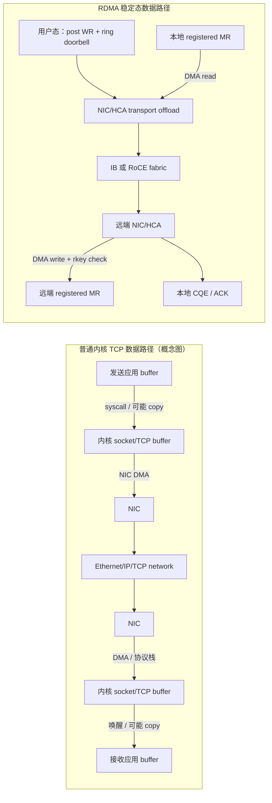
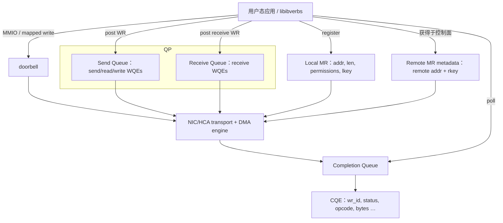
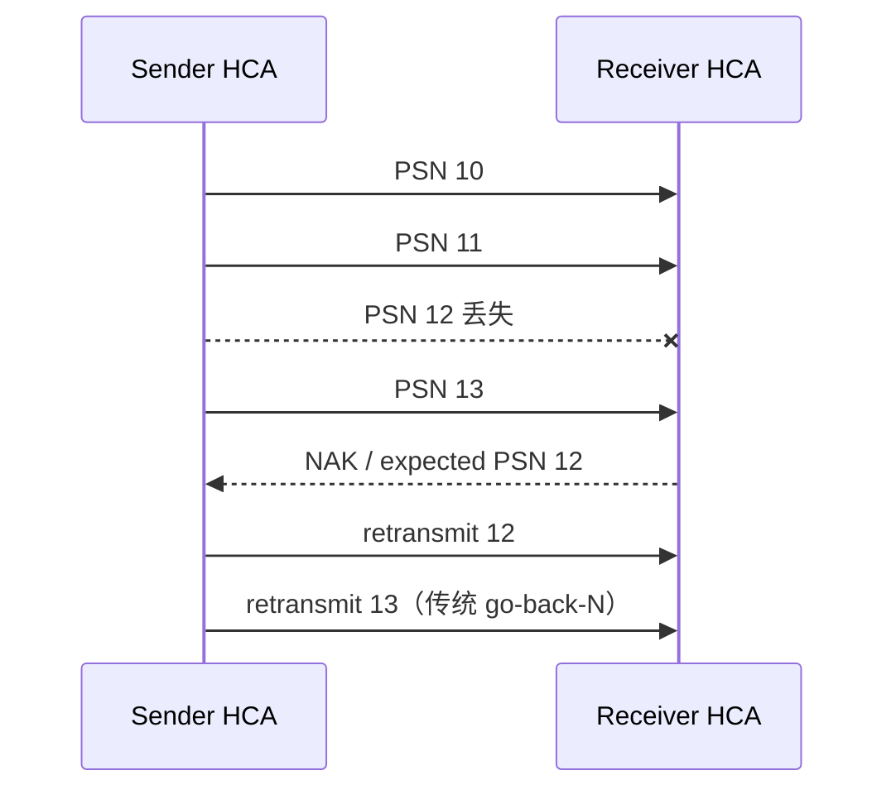

# L29 RDMA原理：从 verbs 到 GPUDirect RDMA

> [!abstract] 本课速览
> 读完你将能够：
> 1. 从内核穿越、内存拷贝与 CPU 协议处理三笔账，解释 RDMA 的 kernel bypass、zero copy 与 CPU offload 分别省了什么；
> 2. 把 QP、WR/WQE、CQ/CQE、MR、lkey/rkey 和 doorbell 还原成“一次 RDMA write”的对象与动作；
> 3. 区分 send/recv、RDMA read/write、one-sided/two-sided，以及 RC、UC、UD 的语义边界；
> 4. 说明传统 RC 的 go-back-N 为什么放大丢包，并知道现代 selective-repeat 是重要例外；
> 5. 比较 InfiniBand、RoCEv2、iWARP 与 EFA/SRD 的位置，而不把“RDMA”误当成某一种网线；
> 6. 画出 GPUDirect RDMA 前后的数据路径，并复算 host staging 多出的 PCIe 搬运。
>
> 前置：[[L28 数据中心网络基础]] · 预计 55 分钟

## 论文里的这段话，你现在可能读不懂

> [!quote]
> “The application registers an **MR**, posts an **RDMA write WQE** to the send queue of an **RC QP**, rings the **doorbell**, and polls a **CQ** for a **CQE**. The local **HCA** uses the **lkey** to DMA-read the source buffer, while the remote HCA validates the **rkey** and writes the destination without a posted receive or remote-CPU action on the data path. The same verbs can run over **InfiniBand** or **RoCEv2**, and **GPUDirect RDMA** lets a ConnectX-class adapter DMA GPU memory without host staging.”（改写自典型 RDMA 系统论文表述）

如果现在只读出“这是某种很快的网络”，还不够。三句话其实依次回答了：应用怎样给网卡下任务、远端内存凭什么能被写、verbs 与物理网络是什么关系。读完本课，我们会逐句把它翻回人话。

## 一、RDMA 到底 remote 在哪、direct 在哪

### 1.1 先看普通内核 TCP 的账单

上一课 [[L28 数据中心网络基础]] 已经看到：TCP 能传训练数据，但普通 socket 路径要为通用、隔离和兼容性付费。发送大块 tensor 时，典型数据面可能经历：

1. 应用发起系统调用，从 user space 进入 kernel space；
2. 内核管理 socket buffer、TCP 状态、分段、确认、重传与拥塞控制；
3. 数据可能在应用 buffer、内核 buffer 与 NIC DMA buffer 之间搬运；
4. 接收侧由中断或 polling 唤起 CPU，经过内核协议栈后再交给应用。

现代 NIC 的 checksum、TSO/GSO、GRO/LRO 与多队列会合并许多工作，所以“TCP 必然每包中断、每字节复制两遍”并不准确。甚至经过专门调优的 Linux TCP 也有跑过 400 Gb/s 以上应用数据率的公开实验。[^tcp400] 真正的问题是：AI 后端网能否在高带宽下同时保持低 CPU 占用、微秒级小消息时延和可预测的尾部，而不是 TCP 在逻辑上“不能传”。

**RDMA (Remote Direct Memory Access)**（远程直接内存访问）的 remote 是“另一台主机上的内存”，direct 是“NIC 的 DMA engine 直接访问事先授权的应用内存，不让远端 CPU 在每次数据搬运的关键路径上接力”。它用三板斧改变账单：

- **kernel bypass**（内核旁路）：连接建立、内存注册等控制路径仍需驱动和内核，但稳定态数据路径由用户态库直接向 NIC 队列投递，不为每次操作穿越通用内核网络栈；
- **zero copy**（零拷贝）：NIC DMA 直接读写应用注册的 buffer，避免为了协议栈再做 CPU 主导的中间 buffer copy；“零”不是没有 DMA、没有 cache 或没有任何内部副本；
- **CPU offload**（CPU 卸载）：分包、顺序号、ACK、重传和权限检查等传输工作由网卡硬件执行，CPU 主要准备描述符、协调控制面和检查完成状态。

图中的“绕过内核”只针对稳定态 data path。页锁定、地址映射、资源创建、权限和异常处理仍离不开 OS；这也是为什么 RDMA 不是“应用随便给个远端指针，网卡就能写”。

> [!tip] 一句话心智模型
> socket 像把包裹交给通用快递柜台；RDMA 像提前登记仓库、货架和通行证，之后直接给自动叉车下任务。登记更麻烦，但每车货不再重复排柜台。

### 1.2 跑满 400G 到底要多少 CPU 核

这个问题没有脱离机器与 workload 的唯一答案。大消息能被 TSO/GRO 合并，小消息更受 packet rate 与 cache miss 影响；NUMA、copy、checksum offload、flow 数、CPU 频率也会改变结果。与其背“某代 CPU 等于某个核数”，不如先做一个透明的 CPU budget 模型。

> [!example] 算一算：400 Gb/s 给软件栈留下多少 CPU 预算
> **口径来源：**[[03 约定与符号]] 规定 $400\ \text{Gb/s}=50\ \text{GB/s}$；CPU 频率 $f$ 和软件处理成本 $c$ 是本题显式假设，不是硬件规格表中的统一常数。
>
> 若 host networking 平均每搬运 1 Byte 消耗 $c$ cycles，一颗 core 每秒提供 $f$ cycles，则仅覆盖这条单向数据流所需的 core 数量级为
> $$
> N_{\text{core}}
> =\frac{50\times10^9\ \text{B/s}\times c\ \text{cycles/B}}
> {f\ \text{cycles/s/core}}.
> $$
> 取一个便于心算的场景 $f=3\times10^9$ cycles/s/core：
> $$
> N_{\text{core}}\approx16.7c.
> $$
> 即使做到 $c=1$ cycle/B，也约要 17 个 core；若 $c=2$ cycles/B，则约 33 个 core。这个结果==不是“Linux TCP 实测必烧 17–33 核”==，而是在告诉你：400G 只有很薄的 per-byte CPU budget，任何 copy、cache miss 与协议处理都会迅速放大。硬件 offload、批处理和大分段能把有效 $c$ 大幅压低；反过来，小 packet 的 per-packet 固定成本会让按 Byte 平均的模型过于乐观。

RDMA 的价值因此不只是把链路时延从“慢”变“快”，而是让 NIC 接管稳定态数据搬运，使 CPU 能留给 dataloader、collective 调度、故障处理和推理服务控制面。

## 二、verbs 名词地图：给网卡下任务的对象系统

### 2.1 先认网卡和接口

**NIC/HCA**（网卡 / 主机通道适配器）都指主机的网络 I/O 设备；RDMA/InfiniBand 语境常说 **HCA (Host Channel Adapter)**，Ethernet 语境常说 NIC。**ConnectX** 是 NVIDIA 的一族网络适配器产品名，部分型号可在 InfiniBand 与 Ethernet/RoCE 模式工作。产品名不是协议名：看到“ConnectX-7”还要继续问它跑 IB 还是 Ethernet。

**verbs**（RDMA 操作接口/动词集）是一套面向 RDMA 设备的编程抽象，Linux 常见实现是 `libibverbs`。它不是线上的封包协议，而是应用表达“注册内存、创建队列、投递 send/read/write、查询完成”的 API 词汇。NVIDIA 的 RDMA 编程手册对 QP、MR、lkey/rkey 与 transport types 给出了正式对象定义。[^verbs]

### 2.2 六组对象，够你读懂大多数论文

| 对象 | 展开 | 它解决什么问题 |
|---|---|---|
| **QP** | queue pair | 一对 work queues：send queue（SQ）+ receive queue（RQ）；是发起通信的核心端点对象。 |
| **WR/WQE** | work request / work queue element | WR 是软件提交的工作请求；provider/NIC 把它表示为队列中的 WQE。论文常混用，读代码时要分清 API struct 与硬件 entry。 |
| **CQ/CQE** | completion queue / completion queue entry | NIC 把已完成或出错的 operation 以 CQE 放入 CQ；应用 poll CQ，避免每次都靠中断。 |
| **MR** | memory region | 经过注册、页映射稳定且带访问权限的一段内存；NIC 只能 DMA 合法 MR。 |
| **lkey/rkey** | local key / remote key | lkey 让本地 WR 引用本地 MR；rkey 连同远端地址授权 peer 访问远端 MR。 |
| **doorbell** | 门铃 | 应用写一个映射到设备的通知，告诉 NIC：“SQ 有新的 WQE，开始取活。” |

QP 叫 pair，是因为它含 SQ 与 RQ，不是因为“本地 QP 加远端 QP 才算一对”。一个 CQ 可服务多个 QP；MR 也不是某个 QP 私有的子对象。对象关系更接近下面这张图：

### 2.3 一次 RDMA write 的完整旅程

假设机器 A 要把一块数据写入机器 B：

1. **B 注册目标 MR。** OS/driver 建立可供 HCA DMA 的映射，返回本地使用的 lkey 和允许远端写入时的 rkey。
2. **A 注册源 MR。** A 得到源 buffer 的 lkey。
3. **控制面交换元数据。** 双方先建立 RC QP，交换 QP 地址信息；B 还要通过可信控制通道把目标 virtual address、length 和 rkey 给 A。one-sided 省的是稳定态 remote CPU，不是省掉初始化与授权。
4. **A 构造 RDMA write WR。** local SGE 填源地址、长度、lkey；remote 字段填 B 的目标地址与 rkey；WR 还带 `wr_id` 供完成时对应请求。
5. **WR 变成 SQ 中的 WQE。** 用户态 provider 把描述符写进 QP 的 send queue，然后 ring doorbell。
6. **A 的 HCA 取 WQE 并 DMA-read。** 它用 lkey 检查本地权限，读取源 MR，把消息分成网络 packet，并在 RC 下维护 PSN、ACK 与重传状态。
7. **B 的 HCA 验证并 DMA-write。** 它检查目标地址、长度、rkey 与权限，把 payload 写入 B 的 MR。普通 RDMA write 不消费 B 的 receive WQE，也不要求 B 的 CPU 此刻运行 handler。
8. **A 收到完成。** 可靠传输满足完成条件后，若该 WR 请求 signaled completion，A 的 CQ 出现 CQE；A poll 到成功或错误状态。B 是否收到通知取决于额外机制，例如 write-with-immediate、单独的 send/doorbell record 或应用协议，不能假设“远端 CQ 自动多一条完成”。

> [!warning] rkey 不是“远端裸指针”
> 远端地址只有与匹配的 rkey、MR 边界和 access flags 一起才有意义。rkey 是 capability-like 的访问凭据，但不是替代租户隔离、可信控制通道与密钥轮换的密码学方案。注册缓存能降低反复 pin/register 的开销，却也增加资源回收与权限失效的系统复杂度。

## 三、操作语义与传输类型：两张表别混在一起

### 3.1 one-sided 与 two-sided：说的是对端怎样参与

**send/recv**（发送/接收）是典型 **two-sided**（双边操作）：发送方 post send WR，接收方必须提前 post receive WR；到达的数据放入接收方提供的 buffer，双方通常都能从 CQ 看到各自完成。

**RDMA read/write**（远程读/写）是典型 **one-sided**（单边操作）：发起方给出本地与远端 MR 信息；远端 HCA 完成内存访问，远端 CPU 不执行与每次传输对应的 receive call。

| verbs operation | 数据方向 | 远端要预贴 receive WR 吗 | 常见系统含义 |
|---|---|---:|---|
| send/recv | sender buffer → receiver posted buffer | 要 | 消息到达即有明确接收事件，控制消息和 RPC 容易组织。 |
| RDMA write | local MR → remote MR | 不要 | producer 主动 put 数据；适合参数、KV block 或 ring buffer 写入。 |
| RDMA read | remote MR → local MR | 不要 | consumer 主动 pull 数据；适合远端 KV/对象读取。 |

one-sided 的优势是远端 CPU 不在 data path，不代表应用没有同步问题。写入什么时候对远端线程可见、数据与通知怎样排序、多个 writer 会不会覆盖、peer 失败后谁回收权限，都要由 NIC ordering guarantee 加应用协议共同回答。因此==“省 remote CPU”不自动等于“端到端时延一定更低”==；小消息通知、atomicity 与一致性可能反而让 two-sided 更合适。

NCCL 的 API 叫 `ncclSend/ncclRecv` 时，不要据名字推断底层一定使用 verbs SEND/RECV。截至 2026-08-04 核验的 NVIDIA NCCL 开源 InfiniBand backend，数据 WQE 主要使用 `IBV_WR_RDMA_WRITE`，并用 `RDMA_WRITE_WITH_IMM` 等机制传递完成/通知；“collective 语义”和“verbs opcode”属于两个抽象层。[^nccl] 具体传输路径留到 [[L38 NCCL解剖]]。

### 3.2 RC、UC、UD：说的是 transport service

**RC/UC/UD** 是 QP 的传输类型，不是 one-sided/two-sided 的同义词：

| 类型 | 全称 | 连接与可靠性 | 操作与使用直觉 |
|---|---|---|---|
| RC | Reliable Connection | 一个 QP 对一个 peer QP；可靠、有序地交付该 QP 上的消息 | 支持 send/recv、RDMA read/write 等，是训练与存储系统的主流选择。 |
| UC | Unreliable Connection | connected，但不做端到端可靠重传 | 可做 send/recv 和 RDMA write；丢包由上层承担，研究与生产中远少于 RC。 |
| UD | Unreliable Datagram | connectionless；datagram 可丢失、重复或乱序 | 主要是 send/recv，单条消息受 datagram/MTU 约束；适合发现、控制或自建可靠层。 |

RC 的“有序”通常是==同一 QP 的顺序==，不是跨多个 QP 的全局总序。RC 还会把大 message 切成多个 packet，以 packet sequence number 追踪进度。

### 3.3 go-back-N：丢一个包，为什么会重传一串

传统 RoCE RC 常用 **go-back-N**（回退 N 帧重传）描述丢包恢复：若 receiver 期待 PSN 12，却先看到 13，就通过 NAK/序号反馈缺口；sender 从丢失处开始，把尚未确认窗口中的后续 packet 一并重传。

这对 AI workload 很伤：collective 的 elephant flow 会让 send window 里同时在飞许多 packet，丢一个包不只浪费它自己，还可能重发大量已到达链路的数据；某个 QP 的恢复尾部又会被 collective barrier 放大全局 step time。这就是下一课 [[L30 无损网络与拥塞控制]] 的动机链：尽量不丢、尽早标记拥塞、别等队列溢出才恢复。

不过，不能把 go-back-N 写成所有现代 RDMA NIC 的永恒定律。NVIDIA 官方驱动文档记录，ConnectX-6 及更新设备在双方支持时可为 RoCE 启用 selective-repeat，只重传丢失 packet，而不是整个 PSN window。[^selective-repeat] 这会缓解 loss amplification，却不会消除拥塞、排队、timeout 与 collective tail。

## 四、RDMA 不是一种网线：四条实现路线

### 4.1 InfiniBand 与 RoCEv2 是两套 fabric 选择

**InfiniBand**（IB）是原生为高性能互联设计的完整网络体系，包含 HCA、IB switch、链路/传输协议和 fabric 管理。按 [[03 约定与符号]] 的课程口径，EDR/HDR/NDR/XDR 每端口每方向依次为 100/200/400/800 Gb/s，即 12.5/25/50/100 GB/s。

它的两个管理特征经常出现在论文里：

- **credit-based flow control**（基于信用的流控）：下游按可用接收 buffer 给上游 credit，上游只有拿到 credit 才发送，从机制上抑制因 buffer overflow 造成的丢包；它不保证物理链路永不出错，也不等于端到端没有拥塞；
- **subnet manager**（子网管理器，SM）：集中发现和配置 IB fabric，为端口分配地址并计算/下发路径、partition 与 QoS 等。NVIDIA 文档将 SM 定义为每个 IB subnet 所需的发现、激活和管理实体。[^sm]

**RoCE/RoCEv2 (RDMA over Converged Ethernet)** 把 InfiniBand transport semantics 放到 Ethernet fabric 上。RoCEv1 是二层封装；今天论文里常见的 RoCEv2 进一步使用 UDP/IP 封装，因此可以三层路由。这里的 UDP 是给交换网络识别与转发的 encapsulation，不表示应用退化成“不可靠 UDP socket”；可靠性仍由 NIC 中的 RDMA transport 实现。NVIDIA 的 RoCE 文档明确给出 RoCEv2 的 IP header、UDP header 与目的端口 4791，并指出 RoCE fabric 不需要 IB subnet manager。[^roce]

| 维度 | InfiniBand | RoCEv2 |
|---|---|---|
| fabric | 专用 IB link/switch/HCA 体系 | Ethernet switch + IP/UDP encapsulation + RDMA-capable NIC |
| verbs/transport | 原生支持 IB transport 与 verbs | 复用 IB transport semantics 与 verbs，封装进 UDP/IP/Ethernet |
| 流控起点 | link-level credit-based flow control 是体系内建部分 | Ethernet 本身允许丢包；生产集群需专门设计 queue、ECN/PFC 或有损恢复机制 |
| 管理 | subnet manager 发现并配置 fabric | 沿用 Ethernet/IP 的路由、VLAN/VRF、telemetry 与运维工具，无 IB SM |
| 工程优势 | 软硬件一体、行为一致，适合专用高性能 fabric | 复用 Ethernet 生态、路由与多厂商工具，适合已有大规模网络团队 |
| 工程代价 | 专用设备与管理体系，生态选择较集中 | 要把 loss、congestion、ECMP entropy 和 buffer 配置做对，复杂度转到网络运营 |

不要把选型简化成“NVIDIA 集群必然 IB、超大厂必然 RoCE”。Meta 的 SIGCOMM 2024 论文是超大规模 RoCE 生产案例；与此同时 NVIDIA 自己也同时提供 InfiniBand 与 Ethernet/RoCE 产品路线。[^meta-rdma] 更可靠的判断是：团队是否已有可控的 Ethernet fabric、是否愿意承担 lossless/congestion tuning、是否需要 IP routability 与多厂商生态、应用是否能得到同样成熟的 collective/GDR 支持。

### 4.2 iWARP：记住名字，不必把它说成“已经死亡”

**iWARP (Internet Wide Area RDMA Protocol)** 是 IETF 定义的 RDMA-over-TCP 路线：用 MPA、DDP 与 RDMAP 等层在可靠 TCP byte stream 上提供远程内存语义。它的优势是继承 TCP 的可靠性与 IP 路由，代价是栈与硬件实现路径不同于 IB/RoCE；在当代 AI 集群论文里能见度明显低于 IB 和 RoCE。协议仍有 RFC 和实现，所以准确说法是“AI 后端网选型中较少见”，不是“协议已经不存在”。[^iwarp]

### 4.3 EFA/SRD：云厂商不一定复制 RC 的有序假设

**EFA/SRD** 指 AWS Elastic Fabric Adapter 及其 Scalable Reliable Datagram 传输。EFA 通过 libfabric 暴露 OS-bypass 能力，并支持 NCCL/MPI；SRD 会把 packet 动态散到多条 AWS fabric path，允许底层乱序到达，再由端点完成可靠交付与必要的排序。AWS 文档把 EFA 描述为带 OS-bypass 与 SRD congestion control 的低时延设备；当前 EFA 还在支持的实例类型上提供 RDMA read/write 能力。[^efa]

EFA 的意义不只是多记一个缩写，而是提醒你：传统 RC 的“一个有序 packet stream + go-back-N”不是高性能传输的唯一设计。允许 packet 走不同路径、容忍乱序再恢复，可以降低单条拥塞路径和单个丢包的 head-of-line blocking；[[L32 路由与负载均衡]] 会把这个思路接到 packet spraying 与 adaptive routing。

> [!warning] 三个常见误区
> 1. **“RDMA 就是快一点的 TCP。”** RDMA 暴露注册内存、QP、one-sided 操作与硬件可靠传输；编程模型、权限、ordering 和故障恢复都不同。
> 2. **“RoCE 就是把 IB 线换成网线。”** 两者可共享 verbs/transport semantics，但 link layer、fabric 管理、路由和丢包环境不同。
> 3. **“one-sided 一定更快。”** 它省 remote CPU，不自动解决通知、一致性、竞争写入和 failure recovery；系统目标决定哪种语义合适。

## 五、GPUDirect RDMA：把注册内存从 DRAM 延伸到显存

### 5.1 没有 GDR 时，host memory 是中转仓

**GPUDirect RDMA**（GDR，GPU 直接远程内存访问）让第三方 PCIe peer device（典型是 NIC/HCA）直接 DMA GPU memory。NVIDIA 官方文档把它定义为 GPU 与网络接口等 peer device 之间的直接 PCIe 数据路径，并明确指出它避免经 CPU memory bounce buffer。[^gdr]

对 GPU A 到 GPU B 的跨机消息，数据路径对比如下：

```mermaid
flowchart TB
    subgraph NG["无 GPUDirect RDMA：host staging"]
        GA["GPU A memory"] -->|"PCIe: D2H copy"| HA["Host DRAM A"]
        HA -->|"PCIe: NIC DMA read"| NA["NIC A"]
        NA --> FAB1["IB / RoCE fabric"]
        FAB1 --> NB["NIC B"]
        NB -->|"PCIe: NIC DMA write"| HB["Host DRAM B"]
        HB -->|"PCIe: H2D copy"| GB["GPU B memory"]
    end

    subgraph G["有 GPUDirect RDMA：peer DMA"]
        GGA["GPU A memory"] -->|"NIC peer DMA read"| NNA["NIC A"]
        NNA --> FAB2["IB / RoCE fabric"]
        FAB2 --> NNB["NIC B"]
        NNB -->|"NIC peer DMA write"| GGB["GPU B memory"]
    end
```

从端到端服务次数看，无 GDR 路径有 4 次 PCIe data traversal；GDR 路径有 2 次 peer traversal，因此每条消息少 2 次 PCIe 搬运。host DRAM 还少一次写入加一次读出。这里的“少 2 次”是跨发送端和接收端合计，不是说每台机器各少 2 次。

> [!example] 算一算：256 MB 消息，host staging 多走多久
> **口径来源：**消息大小 256 MB 是本题场景；[[03 约定与符号]] 给出 PCIe Gen5 x16 约 64 GB/s 单向、400 Gb/s NIC 每方向为 50 GB/s。按 SI 单位估算，并先假设各阶段串行、都能达到链路线速。
>
> 无 GDR 相对 GDR 多 2 次 PCIe traversal，因此只算这两次额外搬运：
> $$
> T_{\text{extra,PCIe}}
> =2\times\frac{256\times10^6\ \text{B}}
> {64\times10^9\ \text{B/s}}
> =8\ \text{ms}.
> $$
> 同一消息在理想 400 Gb/s 网络上的 serialization time 是
> $$
> T_{\text{wire}}
> =\frac{256\times10^6\ \text{B}}
> {50\times10^9\ \text{B/s}}
> =5.12\ \text{ms}.
> $$
> ==仅两次额外 PCIe staging 的串行服务时间就比理想上网时间更长。==实际系统会 pipeline/overlap，GPU、NIC 与 PCIe 还可能共享 switch/root complex，所以不能直接断言 wall-clock 必然多 8 ms；本题也没有为 host DRAM 读写另加精确时间，因为 [[03 约定与符号]] 未统一登记该带宽。结论是：不去掉 staging，升级 400G fabric 可能只把瓶颈推回节点内部。

### 5.2 GDR 不是“插上 NIC 自动生效”

GDR 仍依赖 GPU/NIC PCIe topology、IOMMU 设置、peer-memory 或 DMA-BUF 支持、memory registration 与通信库配置。NCCL 日志里看到 `NET/IB` 不等于已走 GPU-direct path；还要确认 GDR support、NIC 与 GPU 距离、实际 bandwidth/latency，以及 fallback 时是否落到 host staging。[[L25 节点内互联]] 讲过的 NUMA 与 PCIe 拓扑，在这里会重新决定 scale-out 性能。

## 六、时延项为什么会在 1,024 卡被放大

[[03 约定与符号]] 给出数据中心内教学量级：RDMA 单向约 1–3 µs，内核 TCP 约 30–100 µs。先忽略 bandwidth term，只把它们当作 α 的对照值，代入后续 [[L37 通信算法与代价模型]] 会推导的 ring all-reduce latency term：

$$
T_{\text{latency}}=2(p-1)\alpha.
$$

> [!example] 算一算：$p=1024$ 时，固定时延会累加多少
> **口径来源：**$p=1024$ 是题设；$\alpha$ 区间来自 [[03 约定与符号]] 的 RDMA/TCP 单向时延教学量级；$2(p-1)\alpha$ 是本课预告、[[L37 通信算法与代价模型]] 正式推导的 latency-only 模型。
>
> 首先计算逻辑阶段数：
> $$
> 2(p-1)=2\times1023=2046.
> $$
> 若用 RDMA 的 1–3 µs 代入：
> $$
> T_{\text{RDMA,latency}}
> =2046\times(1\text{--}3)\ \mu\text{s}
> \approx2.046\text{--}6.138\ \text{ms}.
> $$
> 若用内核 TCP 的 30–100 µs 代入：
> $$
> T_{\text{TCP,latency}}
> =2046\times(30\text{--}100)\ \mu\text{s}
> \approx61.38\text{--}204.6\ \text{ms}.
> $$
> 两个区间相差约 10–100 倍，即一到两个数量级；只有取 100 µs 对 1 µs 的端点才正好是 100 倍。实际 ring 会分 chunk、pipeline，并叠加 $\beta n$、软件调度与 topology，因此这不是 1,024 卡 all-reduce 的性能预测。它只说明：固定开销若在算法结构中重复 2,046 次，单次几十微秒也会累成百毫秒。

这也是 AI 网络论文常同时报告 bandwidth、small-message latency 与 collective performance 的原因：400G 只决定长消息斜率的一部分，α、重传尾部和软件调度决定短阶段能否扩展。

## 回到开头那段话

现在逐句回读：

1. “The application registers an MR, posts an RDMA write WQE to the send queue of an RC QP, rings the doorbell, and polls a CQ for a CQE。”——应用先把 memory 注册成 MR；WR 经 provider 成为 SQ 里的 WQE，doorbell 通知 HCA 取活；RC 保证这个 QP 上的可靠有序传输，完成或错误最终以 CQE 让本地应用 poll 到。
2. “The local HCA uses the lkey to DMA-read the source buffer, while the remote HCA validates the rkey and writes the destination without a posted receive or remote-CPU action on the data path。”——lkey 证明本地源 buffer 可被 NIC 使用，remote address+rkey 授权远端 MR；RDMA write 是 one-sided，不消费 remote RQ 的 receive WQE，也不需要 remote CPU 为这次 payload 搬运执行 handler，但授权、通知和一致性仍由控制面/应用协议负责。
3. “The same verbs can run over InfiniBand or RoCEv2, and GPUDirect RDMA lets a ConnectX-class adapter DMA GPU memory without host staging。”——verbs 是编程抽象，下面可接原生 IB fabric，也可把 RDMA transport 封装进 UDP/IP/Ethernet 的 RoCEv2；GDR 再把 MR 的可达范围延伸到 GPU memory，省去两端 host DRAM staging。

现在可以把整段压成一句话：==应用用 verbs 把“对哪段已授权内存做什么”写进队列，HCA 负责可靠搬运与完成通知；IB/RoCE 决定包走什么 fabric，GDR 决定数据是否还要在 host memory 换一次车。==

## 术语卡片

| 术语 | 中文 | 一句话解释 |
|---|---|---|
| RDMA | 远程直接内存访问 | NIC 直接访问另一主机预先注册授权的内存，让远端 CPU 不参与每次数据搬运。 |
| kernel bypass | 内核旁路 | 控制面完成设置后，用户态直接向 NIC 队列投递稳定态数据操作。 |
| zero copy | 零拷贝 | NIC DMA 直接读写应用 buffer，避免 CPU 主导的中间 buffer copy。 |
| CPU offload | CPU 卸载 | 把分包、顺序、ACK、重传和权限检查等传输工作下沉到 NIC。 |
| verbs | RDMA 操作接口/动词集 | 注册内存、创建队列并投递 send/read/write 等操作的编程抽象。 |
| QP | 队列对 | 由 send queue 与 receive queue 组成的 RDMA 通信端点对象。 |
| WR/WQE | 工作请求 / 工作队列项 | WR 是软件请求，WQE 是它在 provider/NIC work queue 中的描述符表示。 |
| CQ/CQE | 完成队列 / 完成项 | NIC 用 CQE 向 CQ 报告操作成功、失败及对应 `wr_id` 等信息。 |
| MR | 内存区域 | 经注册、映射稳定并带 NIC access permissions 的内存范围。 |
| lkey/rkey | 本地键 / 远端键 | lkey 供本地 WR 引用 MR，rkey 与远端地址共同授权 peer 访问 MR。 |
| doorbell | 门铃 | 应用写设备映射寄存器/记录，通知 NIC 有新 WQE 可处理。 |
| send/recv | 发送 / 接收 | 需要发送方和接收方分别 post WR 的 two-sided 消息操作。 |
| RDMA read/write | RDMA 读 / 写 | 发起方主动从远端 MR 拉取或向远端 MR 推送的 one-sided 操作。 |
| one-sided/two-sided | 单边 / 双边操作 | 区分远端是否需要为每次传输预贴 receive 并参与消息语义。 |
| RC/UC/UD | 可靠连接 / 不可靠连接 / 不可靠数据报 | 三类 QP transport service，可靠性、连接状态与支持操作不同。 |
| go-back-N | 回退 N 帧重传 | 检测到序号缺口后从丢失处重传尚未确认窗口的传统恢复方式。 |
| InfiniBand | InfiniBand 高性能互联 | 原生包含 HCA、switch、传输、流控和 fabric 管理的 RDMA 网络体系。 |
| subnet manager | 子网管理器 | 发现、激活并配置 IB subnet 路径、地址、partition 与 QoS 的管理实体。 |
| credit-based flow control | 基于信用的流控 | 下游用接收 buffer credit 限制上游发送，抑制 buffer overflow。 |
| RoCE/RoCEv2 | 融合以太网上的 RDMA | 在 Ethernet 上承载 RDMA transport；v2 用 UDP/IP 实现三层可路由封装。 |
| iWARP | 基于 TCP/IP 的 RDMA 协议族 | 用 MPA/DDP/RDMAP 在 TCP 上提供远程内存语义的 IETF 路线。 |
| EFA/SRD | AWS 弹性网络适配器 / 可扩展可靠数据报 | 以 OS-bypass、可靠数据报和多路径乱序容忍服务云上 AI/HPC 通信。 |
| GPUDirect RDMA | GPU 直接远程内存访问 | 让 NIC 经 PCIe peer DMA 直接读写 GPU memory，绕过 host staging。 |
| NIC/HCA | 网卡 / 主机通道适配器 | 执行网络 I/O、DMA 和 RDMA transport offload 的主机设备。 |
| ConnectX | NVIDIA 网络适配器产品族 | 可提供 InfiniBand 或 Ethernet/RoCE 能力的适配器系列，产品名不等于协议。 |

## 自测

1. RDMA 的 remote 和 direct 分别指什么？为什么 kernel bypass 不等于“内核从此完全不参与”？
2. kernel bypass、zero copy、CPU offload 分别省掉哪类工作？为什么不能把三者当同义词？
3. 按本课 CPU budget 模型，400 Gb/s、3 GHz/core、$c=1.5$ cycles/B 时需要多少个 core 的计算预算？这个数字为什么不能当作 TCP 实测结论？
4. 从 B 注册 MR 开始，按顺序写出 A 发起一次 signaled RDMA write 直到看到本地 CQE 的关键步骤；指出 lkey、rkey 和 doorbell 各在哪一步使用。
5. send/recv 与 RDMA write 对远端 RQ、remote CPU 和完成通知的要求有何不同？为什么 one-sided 不一定更快？
6. RC、UC、UD 与 one-sided/two-sided 为什么是两条独立分类轴？“RC 保序”又为什么不能推出跨 QP 全局有序？
7. 传统 go-back-N 在 elephant flow 上怎样放大一个丢包？selective-repeat 改善了什么，又没有解决什么？
8. 对 128 MB 消息、PCIe Gen4 x16 约 32 GB/s 单向，若无 GDR 相对 GDR 多 2 次 PCIe traversal，额外串行服务时间是多少？在 400 Gb/s 网络上的理想 serialization time 又是多少？

> [!note]- 参考答案
> 1. remote 是另一台主机的内存，direct 是 HCA DMA 直接访问已注册 buffer、remote CPU 不为每次 payload 搬运接力。内存注册、QP 建立、页映射、权限与异常处理仍经 OS/driver，所以 bypass 只描述稳定态 data path。
> 2. kernel bypass 省每次操作穿越通用内核数据栈；zero copy 省应用与中间协议 buffer 间的 CPU copy；CPU offload 把分包、可靠性和权限检查等状态机放到 NIC。三者分别是控制边界、数据路径和执行主体的变化。
> 3. $N=50\times10^9\times1.5/(3\times10^9)=25$ cores。$c$ 是由 packet size、offload、copy、NUMA、cache 和实现共同决定的假设，不是固定 TCP 常数；模型只展示预算敏感性。
> 4. B 注册目标 MR 并把 remote address/rkey 经控制面给 A；A 注册源 MR 得 lkey；双方建立 RC QP；A 构造含 local addr/len/lkey 与 remote addr/rkey 的 WR；provider 写 SQ WQE；doorbell 通知 HCA；A HCA DMA-read 并发送；B HCA 校验 rkey 后 DMA-write；ACK/可靠完成后 A 的 CQ 产生 CQE。doorbell 在投递后通知设备，lkey 用于本地源，rkey 用于远端目标。
> 5. send/recv 要远端预贴 receive WR，通常两端各有 CQ completion；普通 RDMA write 不消费远端 receive WQE，remote CPU 不在 payload data path，本地可得到 signaled CQE，但远端通知需额外协议。one-sided 仍需处理通知、ordering、一致性、竞争写与 failure recovery，所以不保证总时延更低。
> 6. RC/UC/UD 描述 QP transport 的连接与可靠性；one/two-sided 描述 operation 是否需要远端逐次参与。RC 可承载 send/recv 也可承载 RDMA write；它保证的是同一 QP 的传输顺序，不为多个 QP 建立全局序。
> 7. 丢 PSN 12 后，传统 go-back-N 可能把 12 及窗口内后续 packet 一起重传，浪费已传容量并拉长 collective tail。selective-repeat 只重发缺失 packet，降低 loss amplification；拥塞排队、timeout、故障与 barrier 放大仍存在。
> 8. 额外 PCIe 时间为 $2\times128\times10^6/(32\times10^9)=8$ ms。400 Gb/s = 50 GB/s，网络 serialization time 为 $128\times10^6/(50\times10^9)=2.56$ ms。两者都是理想串行服务时间，真实 pipeline/overlap 和拓扑会改变 wall-clock。

## 延伸阅读

- Adithya Gangidi 等，《[RDMA over Ethernet for Distributed AI Training at Meta Scale](https://doi.org/10.1145/3651890.3672233)》（ACM SIGCOMM 2024）：本模块核心读物；先读第 2–4 节，追踪 Meta 为什么选 RoCE、workload 的 burst/low entropy 怎样反推 topology、routing 与 transport。
- NVIDIA《[RDMA Aware Networks Programming User Manual](https://docs.nvidia.com/rdma-aware-networks-programming-user-manual-1-7.pdf)》：把 glossary 与 RC example 当 verbs 字典；读到能把 QP、MR、WR、CQ 与 lkey/rkey 对上代码即可，不必第一次就背完整 API。
- Dotan Barak，[RDMAmojo](https://www.rdmamojo.com/)：遇到具体 verbs 字段、completion status 或 ordering 问题时查；它适合做细节索引，不替代设备手册和规范。
- NVIDIA《[GPUDirect RDMA Documentation](https://docs.nvidia.com/cuda/gpudirect-rdma/)》：重点读 overview、standard DMA 与 GPUDirect path 的差别，再看 topology/IOMMU 限制。
- AWS《[Elastic Fabric Adapter](https://docs.aws.amazon.com/AWSEC2/latest/UserGuide/efa.html)》：用 EFA/SRD 对照“RC 必须有序”的默认心智模型，关注 OS-bypass、libfabric、multipath 与当前 RMA 支持边界。

[^tcp400]: [Linux Plumbers Conference 2022：Can the Linux networking stack be used with very high speed applications?](https://lpc.events/event/16/contributions/1345/) 报告在专门调优的 FPGA test setup 上，单 flow Linux TCP 应用数据率超过 670 Gb/s。它说明 kernel TCP 的上限强依赖 offload、packet size、硬件和调优，不应把某个固定“400G 需要 N 核”当普适事实。
[^verbs]: NVIDIA，《[RDMA Aware Networks Programming User Manual](https://docs.nvidia.com/rdma-aware-networks-programming-user-manual-1-7.pdf)》glossary 将 QP 定义为 SQ+RQ，将 MR 定义为已注册且带权限的内存，并说明注册产生 lkey/rkey；RC example 展示了 `IBV_WR_RDMA_WRITE` 的投递路径。
[^nccl]: NVIDIA NCCL 官方源码 [`src/transport/net_ib/p2p.cc`](https://github.com/NVIDIA/nccl/blob/master/src/transport/net_ib/p2p.cc)（核验于 2026-08-04）为 data WR 设置 `IBV_WR_RDMA_WRITE`，并使用 `IBV_WR_RDMA_WRITE_WITH_IMM` 等完成/通知路径。实现会演化，所以这里用来说明抽象层，不承诺所有版本和 plugin 完全相同。
[^selective-repeat]: NVIDIA MLNX_EN 文档的 [Changes and New Features History](https://docs.nvidia.com/networking/display/MLNXENv23100540/Changes%2Band%2BNew%2BFeatures%2BHistory) 说明 ConnectX-6 及更新设备支持 RoCE Selective Repeat：双方支持时可只重传丢失 packet，而非传统 go-back-N 的 PSN window。
[^sm]: NVIDIA《[Subnet Manager](https://docs.nvidia.com/networking/display/MLNXOSv3112006/Subnet%2BManager)》将 SM 描述为发现并配置 InfiniBand fabric devices、下发 routing、partitioning 与 QoS 的集中实体。
[^roce]: NVIDIA《[RDMA over Converged Ethernet (RoCE)](https://docs.nvidia.com/networking/display/mlnxofedv590590/rdma%2Bover%2Bconverged%2Bethernet%2B%28roce%29)》给出 RoCEv1 EtherType 封装与 RoCEv2 IP/UDP 封装，并说明 RoCE fabric 不要求 IB Subnet Manager。
[^meta-rdma]: Adithya Gangidi 等，《[RDMA over Ethernet for Distributed AI Training at Meta Scale](https://doi.org/10.1145/3651890.3672233)》（ACM SIGCOMM 2024）是 Meta 生产 RoCE 网络的设计、实现与运营报告，正式题名已按会议版核对。
[^iwarp]: IETF [RFC 5040](https://www.rfc-editor.org/rfc/rfc5040) 定义了 RDMAP；其 iWARP 协议栈结合 DDP、MPA 与 TCP 提供 remote memory semantics。
[^efa]: AWS《[Elastic Fabric Adapter](https://docs.aws.amazon.com/AWSEC2/latest/UserGuide/efa.html)》说明 EFA 通过 libfabric 提供 OS-bypass、使用 SRD，并列出 NCCL/MPI 与当前 RDMA read/write 支持；AWS 对 SRD 的[技术说明](https://aws.amazon.com/blogs/hpc/efa-is-now-mainstream/)进一步解释了多路径、可靠但容忍乱序的设计。
[^gdr]: NVIDIA《[GPUDirect RDMA Documentation](https://docs.nvidia.com/cuda/gpudirect-rdma/)》将 GDR 定义为 GPU 与 network interface 等 third-party PCIe peer device 之间的直接数据路径，并说明 peer DMA 与 memory pinning/mapping 的工作方式。

---
上一课：[[L28 数据中心网络基础]] ← · → 下一课：[[L30 无损网络与拥塞控制]]
