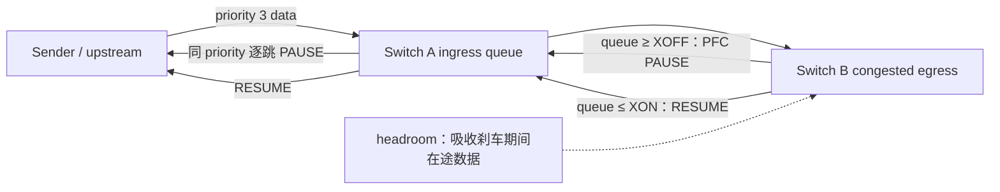
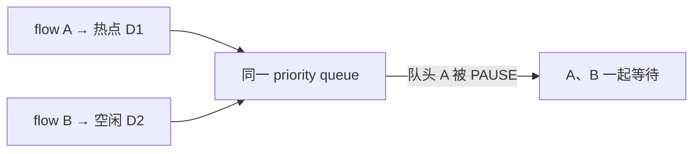
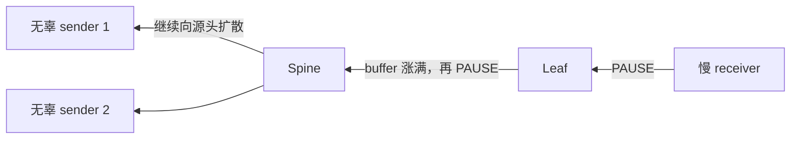
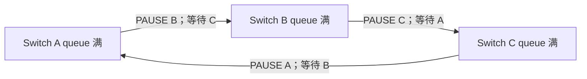
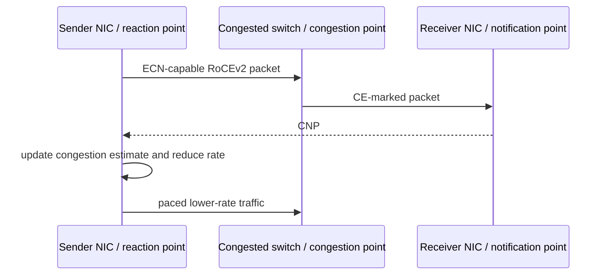
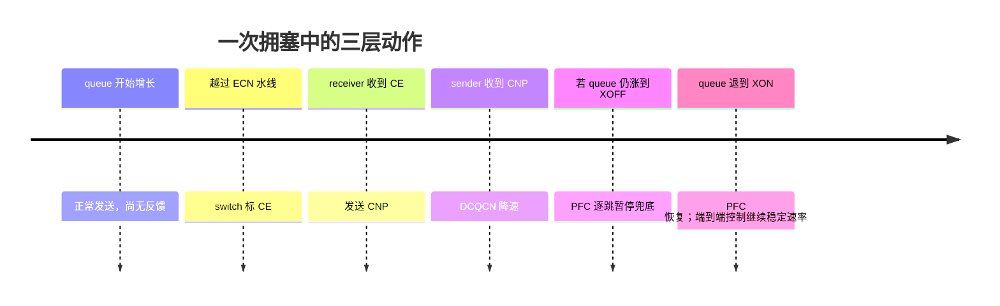
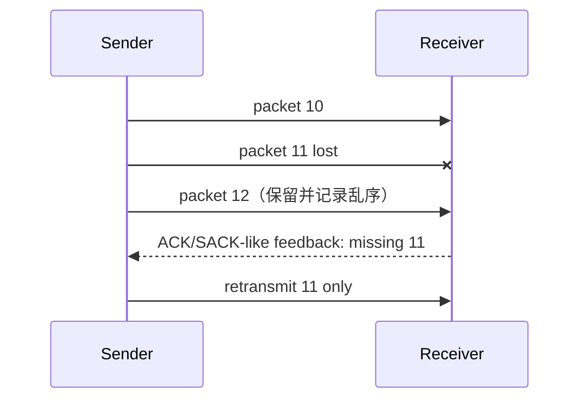

# L30 无损网络与拥塞控制：从 PFC 到有损 RDMA

> [!abstract] 本课速览
> 读完你将能够：
> 1. 从 RC 的传统 go-back-N 恢复解释 RoCE 为什么长期依赖 lossless Ethernet；
> 2. 画出 PFC 的 XOFF/XON 反压链，并识别 HoL blocking、congestion spreading、PFC storm 与 PFC deadlock；
> 3. 估算 400 Gb/s 链路的 headroom，说明 buffer 为什么既稀缺又不能简单做大；
> 4. 还原 ECN → CNP → DCQCN 降速的端到端控制环，比较 TIMELY/Swift 与 HPCC/INT 的反馈信号；
> 5. 复算 256-to-1 incast 的末跳排空时间，并把它连接到 AI collective 的 p99 长尾；
> 6. 解释 IRN、SRD、Falcon 与 UEC/UET 如何用选择性重传、多路径和乱序容忍放松无损假设。
>
> 前置：[[L29 RDMA原理]] · 预计 55 分钟

## 论文里的这段话，你现在可能读不懂

> [!quote]
> “A **lossless network** maps RoCE traffic into a PFC-enabled **traffic class**: after the queue crosses **XOFF**, the switch pauses its upstream neighbor while a **headroom buffer** absorbs in-flight packets. **DCQCN** instead asks the congested switch to mark **ECN**, the receiver to return a **CNP**, and the sender to reduce its rate before PFC becomes necessary. Because PFC can cause **HoL blocking**, **congestion spreading**, storms, and deadlocks, newer transports combine **selective retransmission**, multipath, and flexible ordering to operate efficiently even on lossy Ethernet.”（改写自典型 RDMA 拥塞控制论文表述）

这三句分别在回答：怎样把 Ethernet 暂时做成“不因拥塞而丢包”、怎样在暂停之前让源头减速，以及为什么系统界又想把可靠性从网络还给端点。现在先保留这三个问号，结尾再逐句翻译。

## 一、为什么 RoCE 曾经非“无损”不可

[[L29 RDMA原理]] 讲过传统 RoCE RC 的脆弱点：一个 message 会被拆成许多 packet；若 receiver 期待 PSN 12 却先看到 13，传统 **go-back-N** 会从缺口处重传一串尚未确认的数据。对长时间跑满链路的 elephant flow，丢一个 packet 可能浪费的不只是一个 MTU，而是窗口里已经送达的许多 packet。collective 又会等最慢 rank，于是一次局部恢复会变成全局 step 的尾巴。

由此得到早期工程链条：

$$
\text{go-back-N 的丢包放大}
\Rightarrow \text{尽量不让队列溢出}
\Rightarrow \text{用 PFC 构造 lossless Ethernet}.
$$

**lossless network**（无损网络）在这里不是“宇宙中绝不丢 packet”。它更准确地指：在受控 fabric 内，通过 buffer 和 flow control，目标是避免由拥塞导致的 frame drop。链路误码、设备故障、错误配置或 watchdog 主动打破死锁仍可能造成丢包。==无损消除的是一种失败路径，不是拥塞本身；原来的 drop 会变成排队和反压。==

> [!tip] 直觉
> 有损网络像仓库满了就把新货退回；PFC 无损网络像仓库满前给上游打电话“先别发”。货没有消失，但排队会沿供应链向上游蔓延。

## 二、PFC：逐跳踩刹车，headroom 接住刹车距离

### 2.1 priority、traffic class 与 XOFF/XON

**PFC (Priority Flow Control)**（优先级流控）由 IEEE 802.1Qbb 定义，类似传统 Ethernet PAUSE，但只暂停指定优先级，而不是冻结整条链路。Ethernet PCP 有 8 个 **priority**（优先级）值；设备再把这些值映射到实际的 **traffic class**（流量类别）及硬件 queue，多个 priority 值也可能共享一个 traffic class。论文口语常说“8 个优先级队列”，但准确说法是“最多 8 个 priority 值”，实际 queue 数量和映射由 ASIC 与 QoS 配置决定。[^qbb]

对某个启用 PFC 的 traffic class，交换机设置两条水线：

- **XOFF**（暂停水线）：ingress buffer 占用升到这里，交换机向直接上游发送该 priority 的 PFC PAUSE；
- **XON**（恢复水线）：queue 排空到更低位置后，发送恢复信号，让上游继续；
- 两条线之间留出 hysteresis，避免 queue 在一个阈值附近反复启停。

PAUSE 发出后，上游不能瞬间停住：已经在光纤中的 bit、PHY/MAC pipeline 中的 frame，以及对端处理信号期间新发出的 frame 仍会到达。XOFF 到真正 buffer 满之间预留的空间叫 **headroom buffer**（刹车余量）。headroom 不承载稳定态吞吐，它是在“看见危险”到“上游停住”的这段时间替系统兜底。NVIDIA 的交换机文档也明确提醒，headroom 计算要纳入 cable length、PHY/MAC/interface delay，而不是只乘一个传播时延。[^headroom]

### 2.2 算一算：400G、100 m 链路要留多少 headroom

> [!example] 算一算：PFC 的“刹车距离”
> **口径来源：**[[03 约定与符号]] 规定 400 Gb/s 为每方向端口速率，即 50 GB/s。100 m 与光纤中约 $2\times10^8$ m/s 的传播速度是本题教学场景；工程配置必须使用设备实测/厂商公式，不能把下面的简化式直接抄进生产网络。
>
> 100 m 光纤的单程传播约为
> $$
> t_{\text{one-way}}
> \approx\frac{100\ \text{m}}{2\times10^8\ \text{m/s}}
> =0.5\ \mu\text{s}.
> $$
> 只用“PAUSE 走到上游 + 停止前数据继续回到下游”的最简往返近似，反应窗口约 $1\ \mu\text{s}$。这段时间链路能送入
> $$
> H_{\text{flight}}
> =\frac{400\times10^9\ \text{b/s}\times1\times10^{-6}\ \text{s}}{8\ \text{b/B}}
> =50{,}000\ \text{B}
> \approx50\ \text{KB}.
> $$
> 再加至少一个最大 frame、PHY/MAC/NIC/ASIC pipeline 与实现安全余量，教学上得到“每端口、每个启用 PFC 的 lossless class 约百 KB 级 headroom”的体感。注意：$50$ KB 是传播主项，不是完整 vendor 配置值。
>
> 若做一个静态预留的上界思维实验，64 端口交换机分别启用 1、4、8 个 lossless class，按每份 100 KB 计：
> $$
> H_{1}=64\times1\times100\ \text{KB}=6.4\ \text{MB},
> $$
> $$
> H_{4}=25.6\ \text{MB},\qquad H_{8}=51.2\ \text{MB}.
> $$
> 最后一项单是 headroom 预算就到了几十 MB。真实 ASIC 常用 shared/dynamic buffer，不一定按这个乘法物理切死；它仍说明 priority、端口速率和 cable profile 不能随便开满，因为 buffer 是所有 queue 争用的片上稀缺资源。

### 2.3 PFC 的四种并发症

**1. HoL blocking。** **HoL blocking (head-of-line blocking)**（队头阻塞）指同一 traffic class 中，发往热点目的地的 packet 堵在队头，连带挡住本可走向空闲目的地的“无辜流”。PFC 按 port+priority 暂停，不知道 queue 里有多少条 flow，也就无法只刹真正制造拥塞的那一条。

**2. congestion spreading。** **congestion spreading**（拥塞扩散）是反压逐跳向上游传播：末跳的一个慢 receiver 让 leaf 暂停，leaf 的 buffer 又涨到 XOFF，再暂停 spine；原本离热点很远的 link 和 sender 也被卷入。

**3. PFC storm。** **PFC storm**（PFC 暂停风暴）是 PAUSE frame 长时间、高频或跨多跳扩散的病理状态。常见根因不是“大家都发得有点快”，而是 slow receiver、故障 NIC、卡死 queue 或持续过载出口；它们不断制造 PAUSE，使一个 priority 的大范围吞吐接近停摆。工业设备因此提供 stall detector / PFC watchdog：发现暂停持续过久时，宁可临时丢 packet，也要切断风暴。[^storm]

**4. PFC deadlock。** **PFC deadlock**（PFC 死锁）比 storm 更严格：若一组 queue 形成 **CBD (cyclic buffer dependency)**（循环 buffer 依赖），A 等 B 释放空间，B 等 C，C 又等 A；每个节点都握着上游需要的 buffer，同时等下游 RESUME，整个环没有谁能先前进。临时 routing loop 消失后，这个资源等待环也未必自动解除。[^deadlock]

四种病不是同义词：HoL 是 queue 内“错杀”别的 flow；spreading 是空间范围扩大；storm 是大量/持续暂停的运维症状；deadlock 是存在循环依赖、全环无法前进的结构性状态。

## 三、ECN + DCQCN：争取在 PFC 之前让源头松油门

PFC 是 hop-by-hop emergency brake，只解决“当前 buffer 别溢出”，没有回答 sender 以后该以多快的 rate 发送。**ECN (Explicit Congestion Notification)**（显式拥塞通知）与 **DCQCN (Data Center Quantized Congestion Notification)**（数据中心量化拥塞通知）补上端到端控制环：

1. RoCEv2 sender 把 packet 标为 ECN-capable；
2. 拥塞点 switch 的 queue 超过 ECN marking threshold 后，把经过 packet 标成 CE，而不是等 overflow 后 drop；
3. receiver/NIC 看到 CE 后生成 **CNP (Congestion Notification Packet)**（拥塞通知包）返回 sender；
4. sender NIC 根据 CNP 更新拥塞程度估计并降低对应 flow/QP 的发送 rate，之后再逐步恢复。

DCQCN 的关键不是“有一个更聪明的 PAUSE”，而是让真正的 source 减少 injection rate。PFC 影响直接上游某个 priority，DCQCN 针对端到端发送者；前者反应局部而快，后者反馈更精确但要花一个控制环时延。DCQCN 原论文正是为 RoCEv2 设计，并讨论了 ECN 与 PFC threshold 的联合调参。[^dcqcn]

理想的时间层次如下：

这也暴露了 threshold 的两难：ECN 标得太早、太激进，sender 可能在仍有可用容量时就降速；标得太晚，CNP 还在路上，queue 已经撞上 XOFF，PFC 先起飞。XOFF 太低会过度占用上游和浪费 buffer，太高又可能在上游停住前溢出。==DCQCN 的目标不是宣布“从此不用 PFC”，而是让 PFC 从日常控制器退成少触发的最后防线。==

论文里还会遇到两类同伴：

- **TIMELY/Swift**（基于时延信号的拥塞控制）：TIMELY 用 NIC 测得的 RTT/RTT gradient 判断 queue 是否增长；Swift 延续 delay-targeted 思路，用硬件 timestamp 和端到端 delay target 调节窗口/速率。它们的优势是不要求每跳都提供精细遥测，但要区分 host delay 与 fabric queueing。[^timely-swift]
- **HPCC/INT**（高精度拥塞控制 / 带内网络遥测）：**INT (In-band Network Telemetry)** 让 packet 携带沿途 link utilization、queue 等信息，HPCC 据此更直接地定位 bottleneck 并计算发送 rate。信号更细，代价是 switch/NIC 支持、header/telemetry overhead 与部署复杂度。[^hpcc]

## 四、incast：256 条“都不大”的流，合起来就是洪水

**incast**（多对一瞬时汇聚）发生在许多 sender 同时冲向一个 receiver 或末跳 egress。AI 系统尤其容易制造它：all-to-all 的某一时刻许多 rank 都向同一个 rank 发 chunk，parameter server 收梯度，分布式存储把许多 shard 同时回给一个 worker。[[L17 MoE混合专家]] 的 expert dispatch 会让路由结果随 step 变化，incast 还会变得难预测。

交换机的 **buffer/queue depth**（缓冲区 / 队列深度）只能吸收暂态速率差，不能改变末跳的服务率。下面把“buffer 不是带宽”算到底。

> [!example] 算一算：256-to-1、每流 1 MB
> **口径来源：**256 个 sender 和每流 1 MB 是设计稿给定场景；[[03 约定与符号]] 规定 400 Gb/s 每方向 = 50 GB/s，容量按 SI 计算。
>
> receiver 最终必须从一条 400 Gb/s 末跳收到
> $$
> D=256\times1\ \text{MB}=256\ \text{MB}.
> $$
> 即使上游、switch 与 NIC 都没有额外开销，末跳把这些数据串行化出去也至少需要
> $$
> T_{\text{drain}}
> =\frac{256\times10^6\ \text{B}}{50\times10^9\ \text{B/s}}
> =5.12\times10^{-3}\ \text{s}
> =5.12\ \text{ms}.
> $$
> 单个 1 MB flow 独占 400G 只需
> $$
> T_{1}=\frac{1\times10^6}{50\times10^9}=20\ \mu\text{s},
> $$
> 但 256 条同时到达时，最后一批数据要等毫秒级。与 [[03 约定与符号]] 给出的数据中心内 RDMA 单向约 1–3 µs 教学量级相比，仅理想末跳服务时间就大了约三到四个数量级；这还没算控制环、竞争与协议开销。所谓“p99 爆表”，就是大量平时微秒级的操作在这类同步事件中拖成毫秒级尾部。

那就买更大的 buffer 行不行？若 buffer 真能吞下近 256 MB，确实可能暂时不 drop、不 PFC，但最后一个 packet 仍要排约 5.1 ms。**bufferbloat**（缓冲膨胀）就是过深 queue 用“不丢包”的表面成绩换来巨大排队时延。buffer 能削峰，不能凭空扩容；持续 incast 最终必须靠 sender pacing、congestion control、receiver credit、routing 或 workload scheduling 改变到达过程。

## 五、有损学派：把可靠性从网络还给端点

PFC 的根因是“端点不擅长面对丢包”，那另一条路就很直接：把 NIC transport 改好，让少量 drop 不再引发灾难性恢复。

### 5.1 IRN：不是取消可靠性，而是只重传真正丢的

**selective retransmission**（选择性重传）允许 receiver 接收/记录乱序 packet，sender 根据 ACK/SACK-like 状态只重发确认缺失的部分，不像 go-back-N 那样从缺口起重放整个尾窗。

《Revisiting Network Support for RDMA》（SIGCOMM 2018）提出 **IRN (Improved RoCE NIC)**。它不是只换一个重传 opcode，而是做两项关键改造：选择性重传，以及用 BDP-based flow control 限制在途 packet 数。这样 queue/loss recovery 更可控，RoCE NIC 可以在不依赖 PFC 的情况下保持高性能。设计稿中的“NSDI 2018”是会议名误写；正式版本是 SIGCOMM 2018。[^irn]

### 5.2 SRD、Falcon 与 UEC：工业界开始接受多路径和乱序

- **SRD (Scalable Reliable Datagram)** 是 AWS EFA 使用的可靠数据报 transport。它把 packet 分散到多条 fabric path，允许底层乱序到达，再在更合适的层次恢复应用需要的顺序；应用经 **libfabric**（fabric 通信 API/库）及 EFA provider 接入，不必自己处理所有硬件细节。[^srd]
- **Falcon** 是 Google 面向高带宽、有损 Ethernet 的硬件辅助 transport：硬件 RTT measurement、per-flow traffic shaping、快速精确重传、multipath 与 flexible ordering 组合在一起，并向 RDMA/NVMe 等 upper-layer protocol 提供映射。Google Cloud 在 2026 年已提供 RDMA over Falcon 的网络配置，说明它不只是一篇概念论文。[^falcon]
- **Ultra Ethernet Consortium (UEC)**（超以太网联盟）制定面向 AI/HPC Ethernet 的 Ultra Ethernet Transport（UET）。截至 2026-08-04，官网列出的当前公开规范为 v1.0.3（2026-07-16）。UET 包括 multipath packet spraying、可靠有序/无序 delivery、现代重传与 congestion control、telemetry，并选择 libfabric 作为 northbound API。它被设计为既能跑在 lossy network，也能兼容 lossless network，所以把 UEC 简化成“彻底反 PFC”同样不准确。[^uec]

这几条路线的共同叙事是：==网络可以丢、可以多路径、可以乱序；端点必须用更现代的可靠性与排序语义把它们收回来。== 但“把可靠性还给端点”不等于 switch 什么都不做。ECN、telemetry、load balancing、queue management 仍可能提供信号，只是不再要求每一跳都靠 PFC 保证零拥塞丢包。

## 六、工程现实：你要盯的是计数器，不是口号

生产 RoCE fabric 通常不会把一个无限大的二层 lossless domain 当作目标。更常见的思路是：限制故障/暂停传播域，只对必要 traffic class 开 PFC，给 CNP/control traffic 独立优先级，预先验证 topology/routing 无循环依赖，并配置 PFC watchdog 作为最后的止血手段。

读工业论文或做运维，至少追踪这些信号：

| 计数器/现象 | 正常期望 | 异常时说明什么 |
|---|---|---|
| PFC PAUSE frames / pause duration / XOFF→XON transitions | 偶发、短时 | 持续增长可能是 incast、slow drain、storm 或阈值错误。 |
| ECN marked packets / marking ratio | 拥塞时先于大量 PFC 上升 | 长期过高可能阈值过低或持续过载；完全为零也可能 ECN 未生效。 |
| CNP sent / handled | 与 CE feedback 大致对应 | 只标不降可能是 QoS、CNP 路径或 NIC 配置问题。 |
| queue depth / max usage | 短暂上升后回落 | 长时间贴顶意味着控制环没有稳定住 offered load。 |
| no-buffer discard / retransmission / timeout | lossless 模式下应接近零 | 非零表明 headroom、cable profile、故障或 watchdog 行为需要核查。 |

上线前的“PFC 风暴演练”不是故意把网络搞坏，而是可控地注入 slow receiver、256-to-1 incast、链路切换/临时 routing loop、priority mapping 错误与 cable-length profile 错误，确认监控能先看到 ECN/CNP，再在必要时看到短暂 PFC，且 watchdog/隔离机制能阻止暂停无限传播。NVIDIA 的公开命令也把 pause packet/duration、ECN marked packet、buffer max usage、CNP 与 no-buffer discard 放在同一组 RoCE counters 里；它们必须联合解释，单看“没有 drop”会把排队灾难误判成健康。[^counters]

> [!warning] 三个常见误区
> 1. **“无损 = 不拥塞。”** 无损只是不以 congestion drop 表现；queue、反压和毫秒级 tail 仍然是拥塞。
> 2. **“PFC 是坏东西，应全部关闭。”** 在传统 go-back-N RoCE NIC 与受控小域中，PFC 是合理兜底；问题是把逐跳应急机制当成唯一、日常的 congestion control。
> 3. **“大 buffer 能治好 incast。”** 它可以延后 drop/XOFF，却不能提高末跳 400 Gb/s 的服务率，还可能制造 bufferbloat。

## 回到开头那段话

现在逐句回读：

1. “A lossless network maps RoCE traffic into a PFC-enabled traffic class: after the queue crosses XOFF, the switch pauses its upstream neighbor while a headroom buffer absorbs in-flight packets。”——RoCE priority 被映射到启用 PFC 的 traffic class；ingress queue 到 XOFF 就逐跳暂停，上游真正停住前仍在飞的数据由 headroom 接住，排空到 XON 才恢复。
2. “DCQCN instead asks the congested switch to mark ECN, the receiver to return a CNP, and the sender to reduce its rate before PFC becomes necessary。”——switch 用 CE 提前暴露 queue，receiver 把它翻译成 CNP，sender NIC 端到端降速；设计目标是让反馈在撞上 XOFF 前生效，PFC 只做最后兜底。
3. “Because PFC can cause HoL blocking, congestion spreading, storms, and deadlocks, newer transports combine selective retransmission, multipath, and flexible ordering to operate efficiently even on lossy Ethernet。”——PFC 会错杀同 queue 的无辜 flow、把反压扩散成 storm，循环 buffer 依赖还能造成 deadlock；IRN、SRD、Falcon 与 UET 因而增强端点的选择性恢复、多路径和乱序语义，减少对逐跳无损的依赖。

现在这段话可以压成一句：==PFC 用 buffer 和逐跳暂停避免“丢”，DCQCN 用端到端反馈尽量避免“停”，新 transport 则让端点学会高效处理“丢与乱序”。==

## 术语卡片

| 术语 | 中文 | 一句话解释 |
|---|---|---|
| lossless network | 无损网络 | 在受控 fabric 内避免拥塞导致 frame drop，不代表物理故障或配置错误下绝不丢包。 |
| PFC | 优先级流控 | IEEE 802.1Qbb 的逐跳、按 priority 暂停机制。 |
| priority/traffic class | 优先级 / 流量类别 | PCP 提供 8 个 priority 值，设备再把它们映射到实际 traffic class 与 queue。 |
| XOFF/XON | 暂停 / 恢复水线 | queue 到 XOFF 触发 PAUSE，排空到较低 XON 后恢复发送。 |
| headroom buffer | 刹车余量缓冲 | 接住 PAUSE 发出到上游真正停住期间仍会到达的数据。 |
| HoL blocking | 队头阻塞 | 一个受阻 packet/flow 挡住同 queue 中本可前进的无辜流。 |
| congestion spreading | 拥塞扩散 | PFC 反压从热点逐跳传播到远处 link、queue 与 sender。 |
| PFC storm | PFC 暂停风暴 | PAUSE 长时间、高频或跨多跳扩散并造成大范围吞吐下降。 |
| PFC deadlock | PFC 死锁 | queue 形成循环 buffer 依赖，彼此等待 RESUME 而无人能前进。 |
| ECN | 显式拥塞通知 | switch 在 drop 前给 packet 标 CE，向端点暴露拥塞。 |
| CNP | 拥塞通知包 | receiver/NIC 收到 CE-marked RoCE packet 后发给 sender 的降速反馈。 |
| DCQCN | 数据中心量化拥塞通知 | 以 ECN/CNP 驱动 sender NIC 调节 RoCEv2 rate 的端到端 congestion control。 |
| TIMELY/Swift | 基于时延信号的拥塞控制 | 用精细 RTT/端到端 delay target 推断 queue 并调节发送。 |
| HPCC/INT | 高精度拥塞控制 / 带内网络遥测 | 由 packet 携带逐跳负载/queue 信息，供 sender 精确定位瓶颈和控速。 |
| incast | 多对一瞬时汇聚 | 多个 sender 同时冲向同一 receiver/egress 的同步拥塞。 |
| buffer/queue depth | 缓冲区 / 队列深度 | 可暂存等待服务数据的容量，能吸收 burst 但不能提高链路服务率。 |
| bufferbloat | 缓冲膨胀 | 过深 queue 减少 drop，却制造很大的排队与尾时延。 |
| selective retransmission | 选择性重传 | 只重发确认缺失的 packet，并保留/记录已到达的乱序 packet。 |
| IRN | 改进型 RoCE NIC | 以选择性恢复和 BDP flow control 放松 RoCE 对 PFC 的依赖。 |
| SRD | 可扩展可靠数据报 | AWS EFA 的可靠、multipath、可容忍底层乱序的 datagram transport。 |
| Falcon | Google 硬件辅助 transport | 组合 RTT 测量、traffic shaping、精确重传、多路径与灵活排序的有损 Ethernet transport。 |
| Ultra Ethernet Consortium (UEC) | 超以太网联盟 | 制定面向 AI/HPC 的 UET、软件 API、link 与 telemetry 等规范的产业联盟。 |
| libfabric | fabric 通信 API/库 | 为 EFA/SRD、UET 等 provider 向 MPI/collective/应用暴露统一通信接口。 |

## 自测

1. lossless network 为什么不等于“不拥塞”或“任何原因都不丢包”？
2. PFC 相比整链路 PAUSE 多了什么粒度？priority、traffic class 与硬件 queue 为什么不能直接画等号？
3. XOFF、XON 与 headroom 分别解决什么问题？为什么 XOFF 不能贴着物理 buffer 上限？
4. 200 Gb/s 链路若简化的 pause reaction window 为 $2\ \mu$s，只算在途主项需要多少 KB headroom？若再预留 30 KB pipeline/MTU margin，总计多少 KB？
5. 分别用一句话区分 HoL blocking、congestion spreading、PFC storm 与 PFC deadlock。
6. 按顺序写出 DCQCN 从 queue 越过 ECN 水线到 sender 降速的控制环；ECN 过早与过晚各有什么代价？
7. 128 个 sender 各向同一 receiver 发送 2 MB，末跳为 400 Gb/s。理想排空时间是多少？为什么把 switch buffer 加到 256 MB 也不会缩短它？
8. IRN、SRD/Falcon 与 UET 分别怎样挑战“RDMA 必须依赖 PFC”的默认假设？为什么 UET 又不能简单称为“只支持有损网络”？

> [!note]- 参考答案
> 1. 这里的 lossless 主要指避免受控 fabric 内的 congestion drop；拥塞仍会表现成 queue 和 backpressure，误码、故障、配置错误与 watchdog 也可能产生 drop。
> 2. PFC 可只暂停指定 priority，其他 priority 仍能发送。PCP 有 8 个 priority codepoint，但 priority 可映射/合并到设备的 traffic class，实际 queue 数和资源布局由 ASIC/QoS 配置决定。
> 3. XOFF 触发 PAUSE，XON 在 queue 降到更低位置后恢复，headroom 接住反应期间的在途数据。若 XOFF 贴近上限，上游停住前到达的数据会溢出；XON 低于 XOFF 可避免反复抖动。
> 4. $H=200\times10^9\times2\times10^{-6}/8=50{,}000$ B = 50 KB；再加 30 KB 得 80 KB。它仍只是给定反应窗口下的简化题，不替代 vendor headroom 公式。
> 5. HoL 是同 queue 内无辜 flow 被队头挡住；spreading 是反压范围逐跳扩大；storm 是 PAUSE 大量、持续传播的症状；deadlock 是 CBD 环中所有 queue 互等、无人能前进。
> 6. switch 将 ECN-capable packet 标 CE → receiver/NIC 看到 CE → 返回 CNP → sender NIC 更新拥塞估计并降 rate。过早/过激会牺牲可用吞吐，过晚则 CNP 尚未生效 queue 已撞到 XOFF/PFC。
> 7. 总数据 $128\times2=256$ MB，400 Gb/s = 50 GB/s，$T=256\times10^6/(50\times10^9)=5.12$ ms。buffer 只改变数据在哪里等，不改变末跳 50 GB/s 的服务率；更深 queue 还可能造成 bufferbloat。
> 8. IRN 用 selective retransmission+BDP flow control 高效恢复 loss；SRD/Falcon 接受多路径与底层乱序，并在端点恢复所需语义；UET 把 reliable ordered/unordered delivery、multipath、现代 CC 与 libfabric API 标准化。UET 被设计为同时适配 lossy 与 lossless fabric，所以不是“只支持有损”。

## 延伸阅读

- Yibo Zhu 等，《[Congestion Control for Large-Scale RDMA Deployments](https://www.microsoft.com/en-us/research/publication/congestion-control-for-large-scale-rdma-deployments/)》（ACM SIGCOMM 2015）：先读 motivation 和 PFC/ECN threshold 部分，掌握 DCQCN 为什么必须与 PFC 联合调参。
- Radhika Mittal 等，《[Revisiting Network Support for RDMA](https://doi.org/10.1145/3230543.3230557)》（ACM SIGCOMM 2018）：重点读 IRN 的 selective recovery 与 BDP-FC，理解“需要无损”为什么可能是 NIC 设计产物而非 RDMA 定律。
- IEEE 802.1，《[802.1Qbb — Priority-based Flow Control](https://1.ieee802.org/dcb/802-1qbb/)》：把它当 PFC 边界定义，重点确认 per-priority、single-hop 与受控 domain，而不是背 frame bit field。
- Ultra Ethernet Consortium，《[Ultra Ethernet Specification History](https://ultraethernet.org/specification-history/)》：快速演化区；截至 2026-08-04 以 v1.0.3 为当前版本，阅读时优先看最新 specification/release notes。
- Google Cloud，《[Introducing Falcon: a reliable low-latency hardware transport](https://cloud.google.com/blog/topics/systems/introducing-falcon-a-reliable-low-latency-hardware-transport)》：用工业实现对照 IRN 的研究主张，关注 lossy Ethernet、multipath、retransmission 与 flexible ordering 如何共同工作。

[^qbb]: IEEE 802.1 的 [802.1Qbb 项目页](https://1.ieee802.org/dcb/802-1qbb/)将 PFC 定义为按 traffic class、逐条 full-duplex link 工作的 flow control，并说明 priority 来自 VLAN tag priority；IEEE 公开材料说明 PFC 支持 8 个 priority 值。priority 到硬件 queue 的映射仍由设备实现与 QoS 配置决定。
[^headroom]: NVIDIA Cumulus Linux，[Quality of Service — Priority Flow Control](https://docs.nvidia.com/networking-ethernet-software/cumulus-linux-59/Layer-1-and-Switch-Ports/Quality-of-Service/)：PFC headroom 计算纳入 cable length 和 PHY/MAC interface delay，错误 cable profile 会浪费 buffer 或在 flow control 生效前丢包。
[^storm]: Cisco，[RoCE Storage Implementation over NX-OS VXLAN Fabrics](https://www.cisco.com/c/en/us/td/docs/dcn/whitepapers/roce-storage-implementation-over-nxos-vxlan-fabrics.html) 描述 stuck end queue 如何让 PFC pause 沿路径扩散，并以 PFC watchdog 临时 drop/flush 打破 storm；NVIDIA 驱动文档也提供 pause-storm warning/error counters 与 stall prevention。
[^deadlock]: Shuihai Hu 等，《[Deadlocks in Datacenter Networks: Why Do They Form, and How to Avoid Them](https://www.microsoft.com/en-us/research/publication/deadlocks-datacenter-networks-form-avoid-2/)》（ACM HotNets 2016）把 PFC deadlock 描述为 cyclic buffer dependency：环中每个 switch 占着上游需要的 buffer，同时等待下游释放空间。
[^dcqcn]: Yibo Zhu 等，《[Congestion Control for Large-Scale RDMA Deployments](https://www.microsoft.com/en-us/research/publication/congestion-control-for-large-scale-rdma-deployments/)》（ACM SIGCOMM 2015）提出 DCQCN，并给出 ECN/PFC buffer thresholds 与 protocol parameters 的联合调优；NVIDIA RoCE 文档将 congestion point、notification point/CNP 和 sender reaction 描述为闭环。
[^timely-swift]: Google Research 的 [TIMELY](https://research.google/pubs/timely-rtt-based-congestion-control-for-the-datacenter/)（SIGCOMM 2015）用微秒级 RTT/gradient 作信号；[Swift](https://research.google/pubs/swift-delay-is-simple-and-effective-for-congestion-control-in-the-datacenter/)（SIGCOMM 2020）使用硬件 timestamp、端到端 delay target 与 AIMD 控制。
[^hpcc]: Yuliang Li 等，《[HPCC: High Precision Congestion Control](https://www.statslab.cam.ac.uk/~fpk1/PAPERS/hpcc.html)》（ACM SIGCOMM 2019）利用 INT 获得逐跳 link load/queue 信息，以更直接地控制发送速率。
[^irn]: Radhika Mittal 等，《[Revisiting Network Support for RDMA](https://doi.org/10.1145/3230543.3230557)》（ACM SIGCOMM 2018）的正式版本提出 IRN；其两项增量改造是 selective loss recovery 与 BDP-based flow control，而非“关闭 PFC”本身。
[^srd]: AWS，[In the search for performance, there’s more than one way to build a network](https://aws.amazon.com/blogs/hpc/in-the-search-for-performance-theres-more-than-one-way-to-build-a-network/) 说明 SRD 以 Ethernet 为基础、放松底层 in-order delivery、跨多条 path 传输，并由 libfabric provider 向上层暴露。
[^falcon]: Google Cloud，[Introducing Falcon](https://cloud.google.com/blog/topics/systems/introducing-falcon-a-reliable-low-latency-hardware-transport) 描述其在 lossy Ethernet 上结合 RTT measurement、hardware shaping、精确重传、multipath 与 flexible ordering；Google Cloud [VPC release notes](https://docs.cloud.google.com/vpc/docs/release-notes) 记录 RDMA over Falcon 于 2026-02-23 GA。
[^uec]: Ultra Ethernet Consortium 的 [v1.0 进展说明](https://ultraethernet.org/uec-progresses-towards-v1-0-set-of-specifications/)列出 multipath packet spraying、reliable unordered delivery、congestion control、telemetry 与 libfabric API，并明确 UET 可运行于 lossy 或 lossless network；[版本历史](https://ultraethernet.org/specification-history/)显示 v1.0 于 2025-06-11 首发、v1.0.3 于 2026-07-16 发布且为截至本课日期的当前公开版本。
[^counters]: NVIDIA Onyx/Cumulus 的 [RoCE counters](https://docs.nvidia.com/networking/display/nvidiaonyxusermanualv3104006/roce%2Bcommands)同时列出 PFC pause packet/duration、ECN-marked packet、buffer usage/max、CNP 与 no-buffer discard，适合用来建立“ECN 先反馈、PFC 少兜底、drop 近零”的联合观测。

---
上一课：[[L29 RDMA原理]] ← · → 下一课：[[L31 AI集群网络拓扑]]
