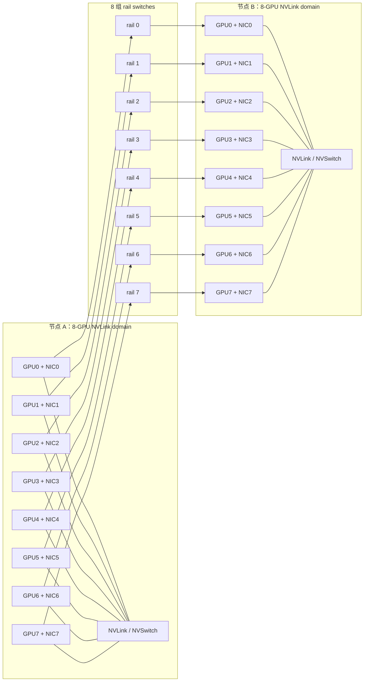
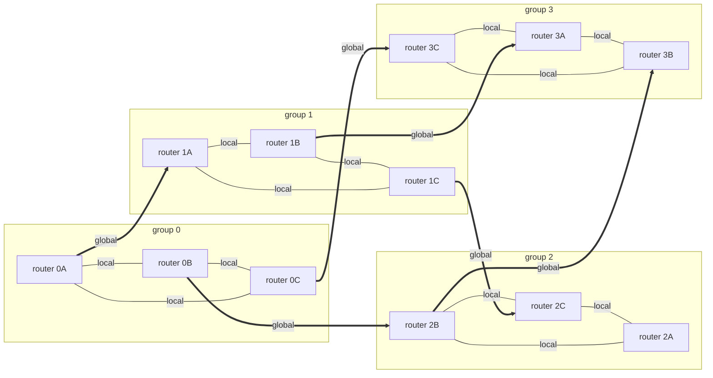
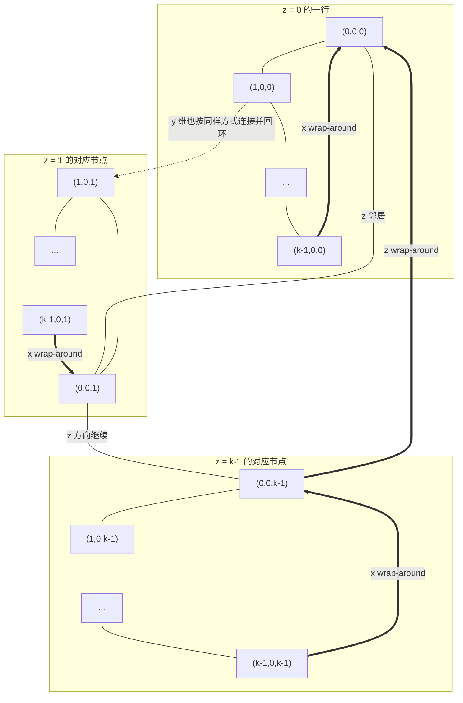
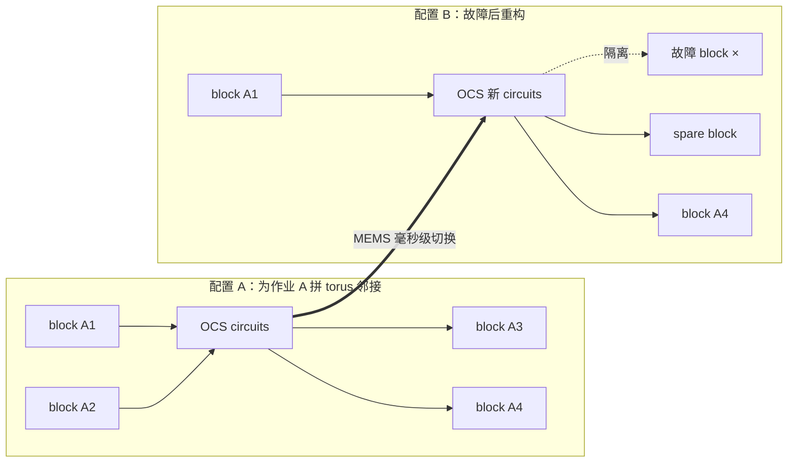
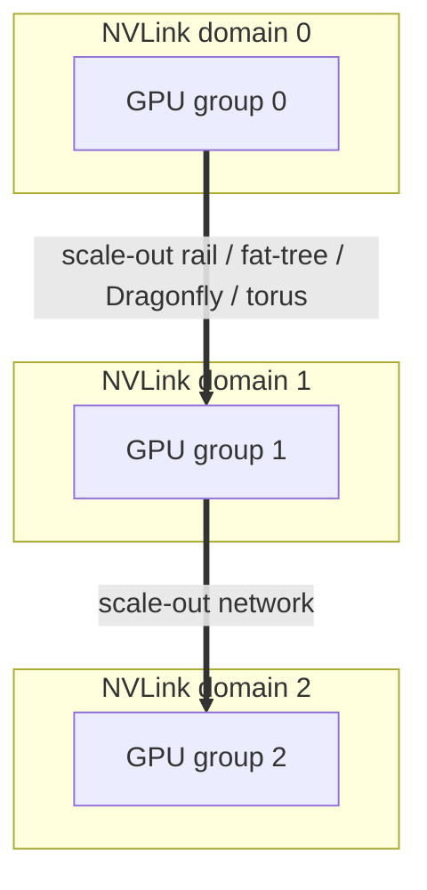

# L31 AI集群网络拓扑：让路网匹配通信

> [!abstract] 本课速览
> 读完你将能够：
> 1. 用流量模式、规模、成本与故障边界解释“拓扑没有全局最优”；
> 2. 画出 8-rail 的 rail-optimized topology，并说清 PXN 与 rail-only 如何借用 NVLink domain；
> 3. 用 group/global link、diameter 与 path diversity 读懂 Dragonfly(+)，知道 Slingshot 在哪一支；
> 4. 推导 $16\times16\times16$ 3D torus 的最坏 24 跳，并与三层 fat-tree 的 5 个 switching stages 对照；
> 5. 区分电分组交换与 OCS，解释 MEMS、topology reconfiguration、TPU v4 和 Jupiter 的关系；
> 6. 复算万卡全光 fat-tree 的光模块数量级，以及 Rail-only 论文中的 38%–77% 成本降幅。
>
> 前置：[[L28 数据中心网络基础]] · [[L25 节点内互联]] · 预计 60 分钟

## 论文里的这段话，你现在可能读不懂

> [!quote]
> “In a **rail-optimized topology**, equal-local-rank NICs share a **rail**, while an **oversubscribed spine** preserves limited cross-rail reachability; a **rail-only** fabric removes that tier and relies on forwarding inside the **NVLink domain**, as **PXN** does in software. **Dragonfly** organizes routers into **groups** joined by sparse **global links** for small **diameter** and high **path diversity**, whereas a **torus** uses cheap neighbor links plus **wrap-around** connections. A **MEMS**-based **OCS** can perform **topology reconfiguration**, as demonstrated by TPU v4 and **Jupiter**. The right choice is therefore **topology-aware** co-design, not a universal winner.”（改写自 Rail-only、TPU v4、Jupiter Evolving、Slingshot 与 NCCL 的典型表述）

这段话把六种网络思路压成了四句。它真正追问的不是“哪张拓扑图最好看”，而是：==哪些 GPU 经常互相说话、一次说多少、允许绕几跳，以及你愿意为任意点对点能力付多少钱？==

## 一、没有万能拓扑：先看谁和谁说话

[[L28 数据中心网络基础]] 已经讲过 **fat-tree**（胖树）如何用规则化 Clos 提供多路径和高对分带宽。若预算足、所有端点都可能互相打满，full-bisection fat-tree 是很稳妥的通用答案；问题是 AI workload 往往不“通用”。

- 数据并行 all-reduce 常被排成逻辑 ring/tree；一个 rank 的主要伙伴少而重复。
- tensor parallel / pipeline parallel 的 peer 关系由并行分组决定，通信矩阵能在多个 step 中保持稳定。
- MoE 的 all-to-all 更接近任意点对点需求，且 expert load 随 token 路由变化，难以只靠固定邻居链路。
- 作业 placement、故障与多租户会打乱理想分组；一张只适配单作业的网，未必适合共享集群。

所以拓扑选择至少要同时匹配四件事：

| 维度 | 要问的问题 | 选错的后果 |
|---|---|---|
| 流量模式 | all-reduce、all-to-all 还是 point-to-point？peer 是否稳定？ | 有的链路闲着，另一些成为热点。 |
| 规模 | 是 8 卡、72 卡、一个 pod，还是跨 pod？ | 小规模省下的层级，放大后可能成为不可达边界。 |
| 成本与功耗 | 要多少 switch ports、光模块、线缆与运维工时？ | 为很少出现的 any-to-any 峰值长期付费。 |
| 故障与共享 | 链路坏了能否绕行？多作业能否安全切片？ | 最快的稳态拓扑可能恢复最慢。 |

第一次读拓扑论文时，先抓两个量：

- **diameter**（网络直径）是任意两端点最短路径长度的最大值。它约束“最倒霉的一对”至少绕多远，但 hop 到底按 link、router 还是 switching stage 计，必须看作者口径。
- **path diversity**（路径多样性）是端点间可利用的不同路径有多少、是否共享瓶颈。路径多不等于自动均衡；[[L32 路由与负载均衡]] 会专门处理“明明有路却全挤一条”的问题。

**topology-aware**（拓扑感知）则是让 placement、collective algorithm 或 routing 显式利用这些结构。例如把 TP group 放进一个 NVLink domain，把 DP group 沿 rail 排列，把高 all-to-all 的 EP group 避免放进脆弱的 rail-only 分区。它不是一种拓扑，而是一种“软件承认物理世界存在”的设计方法。

> [!tip] 先分清物理图和逻辑图
> 机房里真实的 GPU、NIC、switch、port 与 cable 构成物理拓扑；NCCL ring/tree 是映射在其上的逻辑拓扑。逻辑 ring 可以铺在物理 fat-tree 上；OCS 改的是物理连线关系，routing 改的是 packet 走哪条现有路。两张图都叫 topology，但不是一回事。

## 二、rail-optimized：让同号 GPU 走同一条轨道

### 2.1 从通用 fat-tree 到 8 条 rail

按 [[03 约定与符号]] 的统一例子，一台典型 H100 节点有 8 张 GPU 与 $8\times400$ Gb/s scale-out 端口，总注入带宽为 3.2 Tb/s；节点内则由 NVLink/NVSwitch 形成 **NVLink domain**（NVLink 域）。[[L25 节点内互联]] 已经给 **rail**（网络轨道）埋过伏笔：把每台节点的第 $i$ 号 GPU/NIC 都接到同一组 rail switches。

这就是 **rail-optimized topology**（轨道优化拓扑）：同 local rank 的 GPU/NIC 在同一 rail 内近距离互达。若 GPU 0 主要与别的节点 GPU 0 通信，它们在同一 leaf group 内可只过一个 rail switch；更大的 rail 也可以自己做成多级 Clos。关键不是“永远一跳”，而是最常见的同号通信不必先跨 rail 再回来。

为什么这与 collective 合拍？假设每台 8 卡节点都把一段 ring 映射成相同 local rank 之间的跨节点边，8 条并行 rail 就能同时搬运，互相少干扰。NCCL 的 `NCCL_CROSS_NIC` 也会根据 rail-optimized fabric 决定是否保持同号 NIC；软件和布线在这里共同定义有效拓扑。[^pxn]

### 2.2 spine 还在，但可以比通用网更瘦

rail 之间仍可能要通信，所以工程版 rail-optimized fabric 通常保留 spine。若 rail-to-spine 总上行小于 rail 下联可注入带宽，就形成 **oversubscribed spine**（有收敛的脊层）。它省端口与光模块，也保留跨 rail 可达性；代价是 all-to-all 或 placement 不理想时，跨 rail 流量会共同争用较窄的上层。

这时 **PXN**（PCIe × NVLink 网络中转，NCCL 名称）很关键。假设节点 A 的 GPU 0 要发给节点 B 的 GPU 3，与其从 rail 0 上去跨 spine 再下到 rail 3，PXN 可先在 A 内经 NVLink 把数据交给 GPU 3，再从 NIC 3 进入 rail 3，直接抵达 B 的 GPU 3。NCCL 2.12 的官方说明把它称为用 NVLink 与中间 GPU 访问 non-local NIC，并用聚合减少跨 rail 流量。[^pxn]

### 2.3 rail-only：既然常用流量不碰 spine，那就删掉它

**rail-only**（纯轨道网络）把问题再推一步：保留各 rail，移除连接 rail 的 spine。跨 local rank 数据必须先在源 NVLink domain 内中转到目标 rail 的 GPU/NIC，或通过额外 relay 安排转发。于是它用便宜的节点内高带宽换掉昂贵的全局 any-to-any 网络容量。

它并不是“fat-tree 的无条件升级”：

- TP、DP 等通信能被整理成同 rail 时，spine 可能长期低利用，删掉很划算；
- MoE all-to-all、共享集群的任意 placement、节点内互联故障或没有强 NVLink domain 的平台，会让 relay 更频繁；
- rail-only 缩小了跨 rail 的 path diversity，故障恢复、multi-job isolation 与调度必须共同设计；
- 论文结论依赖其 LLM 并行策略、HB domain 和 bandwidth ratio，不能外推成“所有 AI 网络都不需要 spine”。

> [!example] 算一算一：万卡全光 fat-tree 与 Rail-only 成本
> **第一笔：只数光模块数量级。** 设 $N=10{,}000$ 个 GPU/NIC 端点，把经典三层 fat-tree 按规模近似截取。1:1 构造中，endpoint–edge、edge–aggregation、aggregation–core 三类物理链路各约 $N$ 条：
> $$
> L_{\text{all}}\approx N+N+N=3N=30{,}000\ \text{条链路}.
> $$
> 若题设采用“全光”且每条链路两端各一只光模块：
> $$
> M_{\text{optics}}\approx2L_{\text{all}}=6N=60{,}000\ \text{只}.
> $$
> 所以设计稿给出的 5–10 万只确实是合理数量级；真实机房若 rack 内用铜缆/AEC，或层级与 radix 不同，数量会变。[[03 约定与符号]] 只把 400G 光模块登记为“数百美元/只”，因此本课只推出光模块本身是**数千万美元量级**，不自造精确采购价。
>
> 一份 2024 年训练成本研究把 A100/InfiniBand 集群的 cluster-level interconnect 报告为约 10%–20% 的专家估计，并在其 SuperPOD 成本模型中取约 19%；这只能当特定代际和配置的规划范围，不是拓扑定律。[^cost-share]
>
> **第二笔：按 Rail-only 论文原表复算，而不是把当前市场价混进来。** 论文的 32,768-GPU、64-port switch 场景采用每只 400G transceiver 为 \$199、每个 switch port 为 \$694 的论文假设。rail-optimized 基线有 2,560 台 switch、196,608 只 transceiver：
> $$
> C_{\text{base}}
> =2{,}560\times64\times694
> +196{,}608\times199
> =\$152{,}829{,}952.
> $$
> rail-only 有 1,536 台 switch、131,072 只 transceiver：
> $$
> C_{\text{rail-only}}
> =1{,}536\times64\times694
> +131{,}072\times199
> =\$94{,}306{,}304.
> $$
> 因而论文口径下节省
> $$
> 1-\frac{94{,}306{,}304}{152{,}829{,}952}
> \approx38.3\%.
> $$
> 同表 128-port 场景按其设备数量复算约 76.6%，所以正式版的结论是 **38%–77% network cost reduction**。这是论文场景内的 equipment cost，不是任意万卡集群都能拿到的折扣。[^rail-only]

## 三、Dragonfly 与 torus：少铺远路，接受更强的路由约束

### 3.1 Dragonfly(+)：组内抱团，组间少跳

**dragonfly**（蜻蜓拓扑）来自 HPC interconnect。它先把 routers 划成 **group**（组），组内用高密度 **local links** 互连；再用较少的 **global links**（全局链路）连接不同 groups。可把每个 group 想成一座城市：市内道路密，城市之间只修少量高速，但希望任意两城之间都能少跳到达。

最短路通常是“组内 local → 一次 global → 组内 local”。Dragonfly+ 常把 group 内部改成 leaf-spine/两级结构，而不是要求所有 routers 真正组成 clique，便于使用现实 radix 扩展。无论哪一版，global links 都是宝贵资源：多个 job 若同时压中同一组间链路，低 diameter 也救不了排队。

所以 adaptive routing 是它的灵魂伴侣：直达 global link 拥塞时，packet 可先去一个中间 group 再转向目标，用多一跳换空闲容量。**Slingshot** 是应认得名字的工业/HPC 实例；HPE 公开资料把它描述为 Dragonfly、低直径、细粒度 adaptive routing 与 congestion management 的组合。[^slingshot] 具体怎样在最短路与非最短路间选择，留到 [[L32 路由与负载均衡]]。

### 3.2 Torus：每个节点只认邻居，但边界首尾相接

**torus**（环面拓扑）把 nodes 排成规则网格，每个维度只连接前后邻居；**wrap-around**（首尾回环链路）把网格两端接起来，消掉“边缘节点”。二维 torus 像把纸先卷成圆筒、再把筒两端接成甜甜圈；3D torus 则在 $x,y,z$ 三个维度都做回环。

每个 3D torus node 只需要沿六个方向连接邻居，布线规则、端口数固定；邻居通信、沿维度铺开的 ring/torus collective 很自然。代价是任意两点不再像 fat-tree 那样几跳抵达，all-to-all 会让大量 traffic 穿过中间 nodes，placement 与 dimension-order/adaptive routing 都很重要。TPU v2/v3/v4 的 ICI 拓扑演进正是“accelerator、collective 与 topology co-design”的活教材。

> [!example] 算一算二：$16\times16\times16$ 3D torus 为什么最远 24 跳
> 一个长度为 $k$ 的环，从位置 $a$ 到 $b$ 的最短距离是
> $$
> d_k(a,b)=\min(|a-b|,\ k-|a-b|),
> $$
> 所以该维最坏距离为 $\lfloor k/2\rfloor$。三维 torus 的最短路可把三个维度距离相加：
> $$
> D_{\text{torus}}
> =\left\lfloor\frac{k_x}{2}\right\rfloor
> +\left\lfloor\frac{k_y}{2}\right\rfloor
> +\left\lfloor\frac{k_z}{2}\right\rfloor.
> $$
> 对 $16\times16\times16=4{,}096$ 个 nodes：
> $$
> D=8+8+8=24\ \text{条 inter-node links}.
> $$
> 同规模三层 fat-tree 的最远端点路径是 source leaf → aggregation → core → aggregation → destination leaf，即经过 5 个 switching stages。若把两端 endpoint–leaf 接入链路也算进去，则是 6 条 links；这正说明论文写“hop”时必须先核对节点定义。无论采用哪种严谨口径，结论不变：==torus 用较少端口与规则邻居链路，买来了更长的最坏路径；可概括为“省钱买了跳数”。==

## 四、OCS：不替每个 packet 选路，而是先把路接好

电交换机接收 packet、查表、buffer、逐跳转发；**OCS (optical circuit switch)**（光电路交换机）先把输入光纤与输出光纤建立光路，数据随后直接穿过该 circuit。**MEMS (Micro-Electro-Mechanical Systems)**（微机电系统）在这里可理解为用微型可动镜面改变光束指向的实现路线。

| 维度 | 电分组交换 | OCS 光电路交换 |
|---|---|---|
| 决策粒度 | 每个 packet/flow 查表转发 | 先建立 circuit，再让大量数据通过 |
| 统计复用 | 强，多个 flow 可在时间上共享 link | 较弱，circuit 占用期间容量更固定 |
| 排队位置 | switch queue 可逐跳排队 | OCS 本体不做逐包 store-and-forward；等待可能转移到 circuit 建立前或边缘电交换层 |
| 变化速度 | 数据面可逐包改变 path | 重构慢得多，适合稳定 traffic epoch |
| 强项 | 突发、多租户、细粒度任意通信 | 大流、稳定矩阵、故障绕行、可重构物理带宽 |

**topology reconfiguration**（拓扑重构）就是让控制器改变这些 circuit，把同一批物理端口重新接成另一张图。

TPU v4 的 Palomar OCS 使用 3D MEMS mirrors，论文报告 switching time 为毫秒级。它把 4×4×4 electrical cube 作为 building block，再通过 OCS 提供 3D torus 的 wrap-around 与可变 slice 连接：scheduler 可以按作业形状拼 slice，坏 host/block 可被绕开，系统还能分批部署而不必等整座 4K-chip supercomputer 全部接好。论文还报告 OCS 与相关光学部件占 TPU v4 supercomputer 资本成本低于 5%、功耗低于 3%；这只描述 TPU v4 这套实现，不可拿来代表所有 OCS。[^tpu-v4]

为什么“毫秒级重构”在这里不算慢？因为它不是为每个 packet 或每次 collective chunk 重接电路，而是为一个长时间运行的 job/slice 或故障事件选择连接；重构成本可以被后续大量 step 摊薄。反过来，若 traffic matrix 每几个微秒就完全改变，OCS 就追不上，仍需要电分组层承接短时波动。

**Jupiter** 是 Google 数据中心网络 fabric 的名字，不是 TPU 型号。Jupiter Evolving 把传统 Clos 演进为 aggregation blocks 之间的 direct-connect，并用 MEMS OCS、SDN、traffic engineering 与 topology engineering 协同；论文报告的目标还包括故障处理、渐进扩容和在线演进。它与 TPU v4 都使用 OCS，但一个是通用生产数据中心 fabric 演进，一个是 ML supercomputer interconnect，不能混成同一套拓扑。[^jupiter]

## 五、NVLink domain 让集群变成“两级世界”

[[L25 节点内互联]] 里，HGX H100 的 NVLink domain 常与 8-GPU 节点重合；NVL72 则把这个高带宽域扩到机柜级。于是现代 AI cluster 越来越像两级系统：

域内是高带宽 scale-up，域间是更窄、更远的 scale-out。拓扑设计与并行策略因此必须一起组装：高频 TP/EP 尽量留域内，DP 沿 rail 展开，PP 可跨更远边界；具体组合留到 [[L47 混合并行组装]]。集群调度器还要把 GPU 分给 job，使它们落在合适的 domain、rail、leaf 或 group 中，这就是 [[L35 GPU集群调度]] 的 topology-aware placement。

最后用一张表把五类选择压在一起。这里把“torus + OCS 可重构实现”合并为一类，因为 OCS 是实现/重构连接的技术，不限定逻辑拓扑必须是哪一种。

| 拓扑 | 对分带宽 | 典型 diameter / 路径 | 成本直觉 | 最适配流量 | 代表系统/思路 |
|---|---|---|---|---|---|
| 通用 fat-tree | 可做 full bisection | 三层最远 5 个 switching stages；path diversity 高 | switch ports 与 optics 多 | 不确定、any-to-any、多租户 | 经典 Clos fabric |
| rail-optimized fat-tree | 同 rail 强；跨 rail 取决于 spine | 同号近，跨 rail 经 spine；可保留多路径 | 比完全通用布线更能压缩跨 rail 层 | 规则 all-reduce、混合并行 | DGX/HPN 类训练网络；HPN 还用 dual-plane[^hpn] |
| rail-only | 同 rail 强；跨 rail 靠域内 relay | 没有统一 any-to-any spine diameter；cross-rail path diversity 较低 | 删除 spine，论文场景省 38%–77% 网络设备成本 | 稳定、稀疏、可整理成同 rail 的训练通信 | Rail-only |
| Dragonfly(+) | 高，但依赖 global-link 配比与路由 | local–global–local 少跳；可非最短绕行 | 用高 radix 与较少长距离 links 降层级 | HPC、较均匀大规模通信、可自适应流量 | Slingshot |
| Torus + OCS | 规则切面，通常不等同 full-bisection tree | $k$-ary 3D torus 最坏 $3\lfloor k/2\rfloor$；OCS 可改邻接 | 每 node 固定少量邻居 ports；控制面更复杂 | 邻居/ring、稳定 slice、可预测作业 | TPU v4；Jupiter 展示通用 OCS 演进 |

> [!warning] 三个常见误区
> 1. **“fat-tree 无收敛，所以不会拥塞。”** full bisection 只说明有容量；ECMP 哈希冲突、同步 incast、故障与 queue 仍会堵，正是 [[L32 路由与负载均衡]] 的主角。
> 2. **“拓扑越花哨越先进。”** 生产系统还要布线、扩容、监控、隔离、排障和恢复。简单、可预测、可运维本身就是性能条件。
> 3. **“NCCL ring 说明机房铺的是 ring。”** ring 是逻辑 collective，可能映射在 fat-tree、rail、Dragonfly 或 torus 上；物理拓扑决定每条逻辑边实际走多远、共享哪些 bottleneck。

## 回到开头那段话

现在逐句回读：

1. “In a rail-optimized topology, equal-local-rank NICs share a rail, while an oversubscribed spine preserves limited cross-rail reachability; a rail-only fabric removes that tier and relies on forwarding inside the NVLink domain, as PXN does in software。”——每台 8 卡节点的同号 GPU/NIC 组成 8 条 rail；spine 可以收敛但仍让 rail 互达。rail-only 删除 spine，用域内 NVLink 把数据送到目标 rail，PXN 是这种“先域内中转、再出正确 NIC”的软件伙伴。
2. “Dragonfly organizes routers into groups joined by sparse global links for small diameter and high path diversity, whereas a torus uses cheap neighbor links plus wrap-around connections。”——Dragonfly 让 group 内密连、组间用少量 global links，依靠 adaptive routing 利用多路径；torus 每维只连邻居并首尾回环，省 ports 的同时把最坏路径拉长，$16^3$ 例子是 24 跳。
3. “A MEMS-based OCS can perform topology reconfiguration, as demonstrated by TPU v4 and Jupiter。”——MEMS mirrors 不是逐 packet 查表，而是改变 input/output fiber circuit；TPU v4 用它拼 torus slice、绕故障，Jupiter 用它重构通用数据中心 blocks 并支持渐进演进。
4. “The right choice is therefore topology-aware co-design, not a universal winner。”——traffic matrix、parallel groups、placement、routing、故障与成本必须一起看。fat-tree、rail、Dragonfly、torus 和 OCS 都是在不同约束下买不同的能力。

你现在可以把整段压成一句话：==拓扑优化不是把平均 hop 做小，而是把最贵的长距离容量留给真正会用它的通信。==

## 术语卡片

| 术语 | 中文 | 一句话解释 |
|---|---|---|
| fat-tree | 胖树 | 用规则化多级 Clos 提供高对分带宽和多路径的通用拓扑。 |
| rail | 网络轨道 | 把各节点相同 local rank 的 GPU/NIC 接入同组 switches 形成的并行路径。 |
| rail-optimized topology | 轨道优化拓扑 | 优先让同号 GPU/NIC 的高频跨节点通信留在同一 rail。 |
| rail-only | 纯轨道网络 | 删除跨 rail spine、以 NVLink domain 内 relay 承担跨 rail 通信的低成本设计。 |
| PXN | PCIe × NVLink 网络中转 | NCCL 通过 NVLink 中间 GPU 使用 non-local NIC，使流量留在目标 rail 并可聚合。 |
| dragonfly | 蜻蜓拓扑 | 把 routers 分组，以密集 local links 和稀疏 global links 构成低直径网络。 |
| group/global link | 组 / 全局链路 | group 是局部高密度互联单元；global link 负责连接不同 groups。 |
| torus | 环面拓扑 | 在多个维度连接规则邻居，并用首尾回环消除边界的直接网络。 |
| wrap-around | 首尾回环链路 | 把某一维的两个边界位置直接相连，缩短环上最远距离。 |
| OCS (optical circuit switch) | 光电路交换机 | 先配置 input-output 光路，再让数据穿过固定 circuit 的交换设备。 |
| MEMS | 微机电系统 | 用微型可动结构控制光束或器件状态；Palomar OCS 用可动 mirrors 切换光路。 |
| topology reconfiguration | 拓扑重构 | 改变物理 circuit/邻接关系，使容量匹配作业、故障或扩容状态。 |
| diameter | 网络直径 | 任意端点对最短路径长度的最大值，使用时必须注明 hop 口径。 |
| path diversity | 路径多样性 | 端点间可利用的不同路径及其瓶颈独立程度。 |
| oversubscribed spine | 有收敛的脊层 | spine 上行容量小于下层总注入能力，用较低成本保留有限跨 rail 可达性。 |
| Slingshot | HPE HPC interconnect | 采用 Dragonfly、adaptive routing 与 congestion management 的 HPC 网络产品族。 |
| Jupiter | Google 数据中心网络 fabric | 从 Clos 演进到 OCS direct-connect、并联合 topology/traffic engineering 的生产网络。 |
| topology-aware | 拓扑感知 | placement、routing 或 collective algorithm 显式利用物理连接与带宽层级。 |
| NVLink domain | NVLink 域 | 经 NVLink/NVSwitch 形成、GPU 可高带宽互访显存的一组加速器。 |

## 自测

1. 为什么“full-bisection fat-tree 的对分带宽最高”不能直接推出它对所有 AI 集群都最优？
2. 8-GPU 节点的 rail 0 是什么？GPU 0 要给另一节点 GPU 3 发数据时，PXN 如何避免跨 rail spine？
3. rail-only 删掉了什么，又把什么工作转移给了 NVLink domain、collective library 与 scheduler？
4. Dragonfly 的 minimal path 为什么常写成 local–global–local？adaptive non-minimal routing 在什么情况下值得多绕一个 group？
5. 推导 $12\times8\times4$ 3D torus 的 diameter。若作者把 endpoint access link 也算 hop，结果会不会改变？
6. 8,192 个端点的三层 full-bisection fat-tree，若三类链路数量各约 $N$、全部使用光链路、每条两只模块，需要多少只光模块？
7. OCS 为什么可以说“本体没有逐包排队”，却不能说“使用 OCS 的系统完全没有等待”？毫秒级 reconfiguration 适合什么时间尺度？
8. 你要在一个共享集群部署高 all-to-all 的 MoE job。rail-only、Dragonfly 和可重构 torus 各要额外检查什么，才能做 topology-aware placement？

> [!note]- 参考答案
> 1. full bisection 买的是任意切面的通用容量，但 AI 通信可能长期集中在固定 peers/rails；若流量稀疏稳定，通用 spine 的 ports、optics、功耗和运维成本可能长期闲置。还要考虑故障、共享、路由与部署复杂度。
> 2. rail 0 由每台节点的 GPU0/NIC0 及其接入 switches 组成。PXN 可先把源 GPU0 数据经 NVLink 写到源节点 GPU3，再从 NIC3 进入 rail 3，抵达目标 GPU3；数据面不必从 rail 0 经 spine 跨到 rail 3。
> 3. 它删除跨 rail spine，把跨 local-rank 数据的 relay 转给节点内 NVLink/HB domain；软件要规划 relay/collective，scheduler 要维持适合的 placement，故障与多作业隔离也更依赖协同。
> 4. 源 router 先经 local link 到拥有目标 global link 的 router，跨一次 group，再经目标 group 的 local link 到 endpoint。若直达 global link 拥塞而另一组路径空闲，多走一个中间 group 可能降低排队/FCT。
> 5. $D=\lfloor12/2\rfloor+\lfloor8/2\rfloor+\lfloor4/2\rfloor=6+4+2=12$ 条 inter-node links。若把 endpoint access link 也计入，数值会增加；这不改变 torus 坐标间距离，但会改变论文报告的 hop 口径。
> 6. $L\approx3N=24{,}576$ 条物理链路，$M=2L=6N=49{,}152$ 只光模块，约 $4.9\times10^4$，仍是 5 万量级。
> 7. OCS circuit 建好后不逐 packet store-and-forward，但数据可能在建立 circuit 前、边缘 electrical switch 或 endpoint queue 等待。毫秒级重构适合 job/slice、稳定 traffic epoch、故障绕行和扩容，不适合微秒级逐 packet 变化。
> 8. rail-only 要检查 all-to-all 的 cross-rail relay 带宽与 NVLink domain 健康；Dragonfly 要检查 group/global-link load、job interference 与 adaptive routing；reconfigurable torus 要检查 slice geometry、diameter/bisection、OCS 重构与故障隔离。三者都要把 EP group、peer matrix 和故障域映射到物理图。

## 延伸阅读

- Weiyang Wang 等，《[Rail-only: A Low-Cost High-Performance Network for Training LLMs with Trillion Parameters](https://ieeexplore.ieee.org/document/10664412)》（IEEE Symposium on High-Performance Interconnects，HOTI 2024）：重点读 traffic matrix、Figure 6 与 Table II；自己复算不同 switch radix 下的设备数量和成本，不要只背 38%–77%。
- Norman P. Jouppi 等，《[TPU v4: An Optically Reconfigurable Supercomputer for Machine Learning with Hardware Support for Embeddings](https://doi.org/10.1145/3579371.3589350)》（ISCA 2023）：重点读第 2 节，串起 3D torus、Palomar OCS、slice、故障绕行和 topology tailoring。
- Kun Qian 等，《[Alibaba HPN: A Data Center Network for Large Language Model Training](https://doi.org/10.1145/3651890.3672265)》（ACM SIGCOMM 2024）：看 rail-optimized、non-stacked dual-ToR 与 dual-plane 如何把论文拓扑落成可运维生产网络，并预习下一课的 hash polarization。
- Leon Poutievski 等，《[Jupiter Evolving: Transforming Google's Datacenter Network via Optical Circuit Switches and Software-Defined Networking](https://research.google/pubs/jupiter-evolving-transforming-googles-datacenter-network-via-optical-circuit-switches-and-software-defined-networking/)》（ACM SIGCOMM 2022）：对照 TPU v4，理解 OCS 如何服务通用 datacenter fabric 的渐进扩容与 topology/traffic engineering。

[^pxn]: NVIDIA，[Doubling all2all Performance with NVIDIA Collective Communication Library 2.12](https://developer.nvidia.com/blog/?p=44338) 与 [NCCL 环境变量文档](https://docs.nvidia.com/deeplearning/nccl/archives/nccl_2203/user-guide/docs/env.html)：rail-optimized topology 把同号 NIC 接到同组 leaf；PXN 用 NVLink 和 intermediate GPU 访问 non-local NIC，并可把同一目标 NIC 的 messages 聚合后发送。
[^cost-share]: Ben Cottier 等，《[The Rising Costs of Training Frontier AI Models](https://arxiv.org/abs/2405.21015)》（2024）附录把 A100/InfiniBand 集群 interconnect 的专家估计写为硬件成本约 10%–20%，并在 NVIDIA SuperPOD 成本例中得到约 19%。该结果依赖代际、采购价与配置；本课只把它当范围证据。
[^rail-only]: Weiyang Wang 等，《[Rail-only: A Low-Cost High-Performance Network for Training LLMs with Trillion Parameters](https://ieeexplore.ieee.org/document/10664412)》（IEEE Symposium on High-Performance Interconnects，HOTI 2024）Table II 给出 32,768/65,536 GPUs、不同 radix 下的 switches/transceivers 数量；脚注给出 \$199/transceiver、\$694/switch port 的成本假设，论文结论为网络设备成本下降 38%–77%、power 下降 37%–75%。
[^slingshot]: HPE，[Slingshot Interconnect 400 Data Sheet](https://www.hpe.com/psnow/generateDDS/HPE%20Slingshot%20interconnect%20400%20data%20sheet-PSN1014946906FIEN.pdf?cc=FI&contentDisposition=attachment&deepLink=&isLinearized=false&lc=EN&oid=1014946906&prelaunch=false&prelaunchSection=&print=&section=&softroll=0&softrollSection=)：公开资料说明其使用 Dragonfly topology、低直径高 radix switches，并根据实时 path load 做 fine-grained adaptive routing。
[^tpu-v4]: Norman P. Jouppi 等，《[TPU v4: An Optically Reconfigurable Supercomputer for Machine Learning with Hardware Support for Embeddings](https://doi.org/10.1145/3579371.3589350)》（ISCA 2023）第 2 节：Palomar OCS 基于 3D MEMS mirrors、以毫秒级切换；OCS 支持 3D torus wrap-around、failure bypass、slice scheduling、modular deployment 与 topology tailoring；第 2.10 节给出该实现的成本/功耗占比。
[^jupiter]: Leon Poutievski 等，《[Jupiter Evolving: Transforming Google's Datacenter Network via Optical Circuit Switches and Software-Defined Networking](https://research.google/pubs/jupiter-evolving-transforming-googles-datacenter-network-via-optical-circuit-switches-and-software-defined-networking/)》（ACM SIGCOMM 2022）：Jupiter 从 Clos 演进为 aggregation blocks 间的 direct-connect，关键组件包括 MEMS OCS、集中式 SDN、traffic engineering、topology engineering 与自动化运维。
[^hpn]: Kun Qian 等，《[Alibaba HPN: A Data Center Network for Large Language Model Training](https://doi.org/10.1145/3651890.3672265)》（ACM SIGCOMM 2024）：HPN 在 tier 1 采用 rail-optimized access，并用 non-stacked dual-ToR 和 tier-2 dual-plane 兼顾故障与 hash polarization；论文报告其生产 pod 可覆盖 15K GPUs。

---
上一课：[[L30 无损网络与拥塞控制]] ← · → 下一课：[[L32 路由与负载均衡]]
