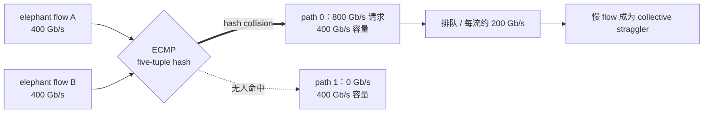
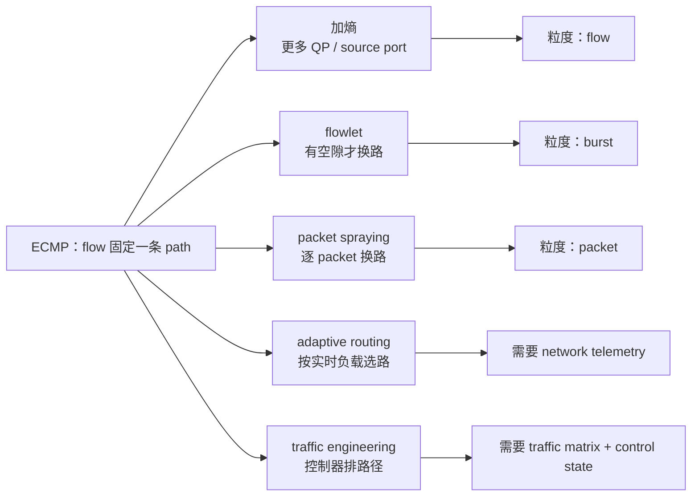
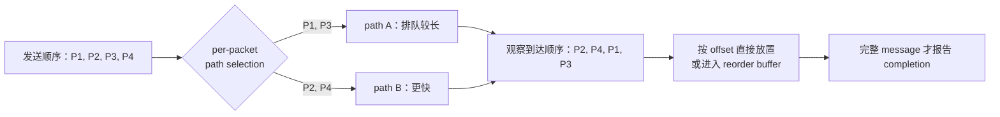
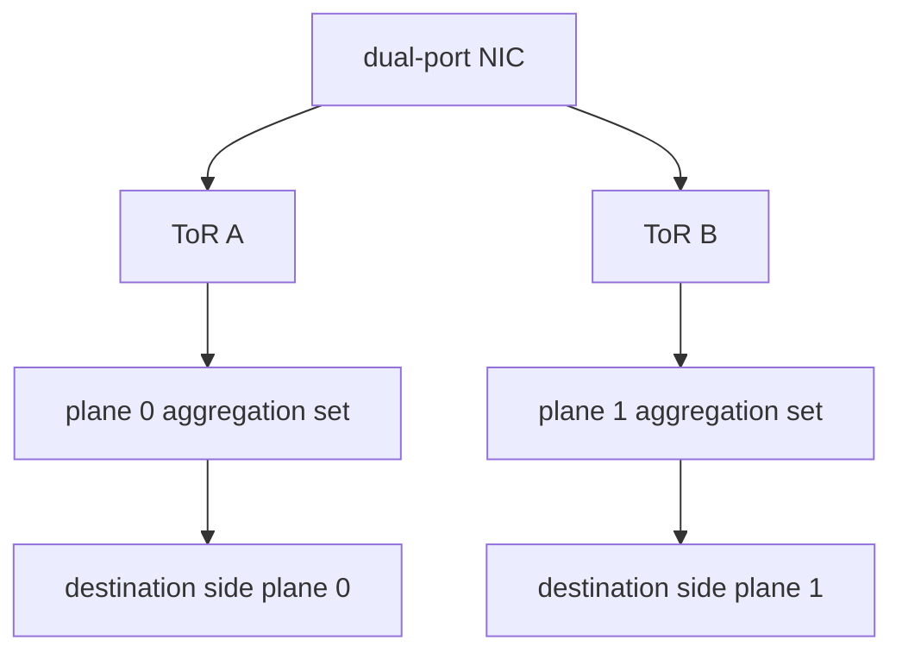

# L32 路由与负载均衡：多路径不等于均衡

> [!abstract] 本课速览
> 读完你将能够：
> 1. 从 five-tuple hash 的假设出发，解释低熵 AI 流量为什么让 ECMP 频繁撞车；
> 2. 复算 $n$ 条流随机进入 $m$ 条等价路径时的碰撞概率，并把链路热点一路连到 collective 完成时间、MFU 与 GPU·h；
> 3. 对比加熵、flowlet、packet spraying、adaptive routing 与 traffic engineering 五条解法的机制和代价；
> 4. 解释 packet spraying 为什么制造乱序，以及 NIC、transport、application 三层如何分摊这笔“乱序税”；
> 5. 说清 HPN 的 dual-plane / dual-ToR 为什么是在架构上缩小负载均衡问题；
> 6. 用链路利用率分布、FCT 与 collective bus bandwidth 设计一组可信的路由实验。
>
> 前置：[[L31 AI集群网络拓扑]] · [[L28 数据中心网络基础]] · 预计 55 分钟

## 论文里的这段话，你现在可能读不懂

> [!quote]
> “**ECMP** pins each **elephant flow** to one equal-cost path with a **five-tuple hash**; under low **flow entropy**, a **hash collision** therefore becomes a collective **straggler**. **QP scaling** and **flowlet** switching add entropy or change paths at burst boundaries, while **per-packet load balancing** and **adaptive routing** spread traffic more finely but may cause **out-of-order delivery**. A **traffic engineering** controller or **dual-plane** fabric can assign paths more explicitly, yet the stack must still decide who pays for **reordering** and how to preserve the required **in-order delivery guarantee**.”（改写自 Alibaba HPN、Meta RDMA、CONGA 与 UEC 的典型表述）

这三句其实在讲一个取舍：==切得越细，均衡越准；切得越细，顺序越难保。== 先从最常见、也最容易被误解的 ECMP 开始。

## 一、八条路都空着，为什么两条大流偏要撞车

### 1.1 ECMP 只随机分流，不观察流量大小

[[L28 数据中心网络基础]] 已经说明 Clos / fat-tree 能在端点间提供多条等价路径。**ECMP (Equal-Cost Multi-Path)**（等价多路径）做的事很朴素：交换机先得到一组到同一目的前缀、代价相等的 next hops，再对 packet header 做 **five-tuple hash**（五元组哈希），把结果映射到其中一个 next hop。

五元组通常是 source IP、destination IP、source port、destination port 与 protocol。对 RoCEv2 来说，外层是 UDP/IP；同一条 flow 的五元组保持不变，于是所有 packets 通常固定走同一条 path。这样几乎不引入乱序，交换机也无须记住每条流的实时速率。

ECMP 的隐含假设不是“哈希绝不碰撞”，而是：**flow 足够多、每条足够小，随机误差会互相抵消。** Web fabric 里若有成千上万条短流，某条 path 多分到三条、另一条少分到三条，bytes 可能仍接近平均值。AI backend traffic 却常由少数同步的 **elephant flow**（大象流）主导：一条 flow 可以持续打到 NIC line rate，而 collective 的 peers 和 QPs 又反复复用。Meta 将这种特征概括为 low entropy、bursty、elephant；Alibaba HPN 也把少量周期性大流与 ECMP hash polarization 直接联系起来。[^meta][^hpn]

这里的 **flow entropy**（流熵）不是在算 payload 的信息熵，而是在问“可供 hash 区分、并能独立落到不同路径的活跃 flow 有多少、多不多样”。只有少量固定五元组，就是 low entropy。

这就是 **hash collision**（哈希碰撞）：不同五元组得到同一 bucket/path。注意，ECMP 可能在“flow 数量”上看着均匀，却在 bytes 上很不均匀；一条 400 Gb/s elephant 与一条小流不能各算“1”后就宣布公平。

> [!warning] 多路径不等于自动均衡
> 拓扑提供 path diversity，只说明“有别的路”；ECMP 只保证理想 hash 下的统计分散，不保证某一个 job、某一个时刻的 offered load 均匀。full-bisection fabric 也可能因为 hash collision 堵住一条 uplink。

### 1.2 生日悖论：至少撞一次几乎是必然

设 $n$ 条 flow 独立、均匀地随机映射到 $m$ 条等价 path，且 $n\le m$。完全不碰撞等价于第一条任选、第二条避开第一条、第三条再避开前两条：

$$
P_{\text{no collision}}
=\frac{m}{m}\cdot\frac{m-1}{m}\cdots\frac{m-n+1}{m}
=\frac{m!}{(m-n)!m^n}.
$$

因此

$$
P_{\text{collision}}
=1-\frac{m!}{(m-n)!m^n}.
$$

> [!example] 算一算：一次不走运，如何变成几千 GPU·h
> **第一笔：8 条 flow 进 8 条 path。**
> $$
> P_{\text{collision}}
> =1-\frac{8!}{8^8}
> =1-\frac{40{,}320}{16{,}777{,}216}
> \approx99.7597\%.
> $$
> “至少两条撞在一起”几乎必然；它不等于“所有 path 都恰好 2× 过载”，但说明不能把“8 流、8 路”误读成自然的一一配对。
>
> **第二笔：4 条 flow 进 16 条 path。**
> $$
> P_{\text{collision}}
> =1-\frac{16\times15\times14\times13}{16^4}
> =1-\frac{43{,}680}{65{,}536}
> \approx33.35\%.
> $$
> 常用生日悖论近似 $1-e^{-n(n-1)/(2m)}$ 给出 $1-e^{-12/32}\approx31.27\%$；设计稿中的“约 31%”是这个指数近似，精确值应为 33.35%。
>
> **第三笔：把一次碰撞连到作业账。** 按 [[03 约定与符号]]，400 Gb/s 单向端口等于 50 GB/s。若两条都想跑满 400 Gb/s 的 elephant flow 撞进一条 400 Gb/s uplink，公平分担时每条约得 200 Gb/s = 25 GB/s。传一个教学设定的 50 GB chunk：
> $$
> T_{\text{ideal}}=\frac{50\ \text{GB}}{50\ \text{GB/s}}=1\ \text{s},\qquad
> T_{\text{collision}}=\frac{50\ \text{GB}}{25\ \text{GB/s}}=2\ \text{s}.
> $$
> 同步 collective 要等最慢 flow，所以这一通信阶段约变成 $2\times$。若正常 step 中通信占比为 $f$，计算部分不变，则
> $$
> \frac{T'_{\text{step}}}{T_{\text{step}}}
> =(1-f)+2f=1+f,
> \qquad
> \frac{\text{MFU}'}{\text{MFU}}\approx\frac{1}{1+f}.
> $$
> 例如 $f=50\%$，step time 变为 $1.5\times$，MFU 约降到原来的 $2/3$；只有在网络阶段几乎主导全程时，作业时间和 MFU 才接近 $2\times$ / 减半。
>
> 再做一个透明的 GPU·h 思维实验：若 4,096-GPU 作业原有 1 小时是上述网络主导工作，固定 hash 使它变成 2 小时，就额外消耗
> $$
> 4{,}096\ \text{GPU}\times1\ \text{h}=4{,}096\ \text{GPU·h}.
> $$
> 按 [[03 约定与符号]] 的教学租价 $2/\text{GPU·h}$，对应约 \$8,192。这里的 50 GB、4,096 GPU 和 1 小时都是显式场景变量，不是硬件规格；要记住的是“固定 hash 热点 × 同步等待 × 大规模并行”的放大链。

## 二、五条解法：在粒度、状态和顺序之间做交易

负载均衡没有一颗万能药。可以把主流方案放在一张谱系图上：前三条越来越细地切割 flow，第四条让 network 读取实时负载，第五条让 control plane 直接安排 traffic matrix。

| 路线 | 核心机制 | 代表系统 / 做法 | 主要收益 | 主要代价与失效点 |
|---|---|---|---|---|
| 加熵 | 把一个 peer pair 暴露成更多可 hash 的 flows | multi-QP、source-port variation、Meta E-ECMP | 保留 flow 内顺序，复用现有 ECMP | QP/ACK/buffer 状态增加；hash 字段没变就白拆 |
| flowlet | 只在 packet burst 间隙换 path | FLARE、CONGA | 比 flow 更细，又尽量不乱序 | 满速 elephant 可能“无隙可乘” |
| packet spraying | 每个 packet / 小单元独立选 path | SRD、UEC RUD、交换机 per-packet LB | 最细粒度利用全部 paths | out-of-order、接收状态、retransmission 设计 |
| adaptive routing | 根据 queue occupancy、port utilization 等动态选 path | InfiniBand AR、Spectrum-X、Dragonfly UGAL | 绕开实时热点与故障 | 局部信息可能误判；全局信息贵且易过时 |
| traffic engineering | 根据 topology、placement、traffic matrix 规划路径 | Meta centralized TE、collective-aware scheduling | 可利用训练流量的重复与可预测性 | controller scale、rule space、更新时延与失效回退 |

### 2.1 加熵：把一条逻辑传输拆成更多可哈希对象

**QP scaling**（QP 扩展）让同一 NIC-to-NIC 关系使用多个 Queue Pairs，把原来的一条大 flow 暴露成多条 flow；若 source UDP port 或交换机参与 hash 的 QP 字段随之变化，它们就可能落到不同 paths。这里的 **multi-pathing**（多路径传输）指一份逻辑通信能同时利用多条网络路径，不只是“拓扑里理论上有多条路”。

在 NCCL 这类 collective library 中，这种 split 可表现为把 messages/chunks 分派给多个 QPs 或 channels；但“软件拆开了”只创造候选 flows，最终能否分路仍取决于封装后的 hash inputs。

Meta 的生产演进很说明问题：仅增加 QP 后，某些场景的外层 UDP ports 没有产生足够差异；他们又让 switch 的 Enhanced ECMP 把 RoCE destination QP 字段纳入 hash，才真正增加 entropy。论文还对比了拆 message 与 round-robin posting 等 QP scaling 方法，提醒我们：==加 QP 不是魔法，必须确认 hash 真看见了新差异。==[^meta]

代价也很直接：QP context、buffer、completion/ACK bookkeeping 都要扩张；把一条 message 拆得更碎还会增加 ACK 与小消息开销。它适合“不想改 transport ordering、但愿意花 endpoint state”的团队。

### 2.2 flowlet：等前一拨车走远，再换下一拨的路

**flowlet**（流片）是一条 flow 中由短 packet gap 分开的 burst。设并行 paths 的最大时延差为 $\Delta d$；若两个 bursts 间隔 $\delta>\Delta d$，前一 burst 的最后一个 packet 已足够领先，下一 burst 即使改走快路也不应追上它，于是可避免 flow 内乱序。FLARE 系统化提出了这个条件；CONGA 则在 Clos fabric 中按 congestion feedback 为 flowlet 选 path。[^flowlet]

但 AI elephant 的强项恰好是持续满速：一个 collective chunk 的 packets 可能连成很长 burst，中间没有足够大的 gap。flowlet switching 只能在 gap 出现时反应；timeout 设太长，均衡慢，设太短，又会把同一 burst 错切并制造乱序。这就是为什么“对 Web 流量有效”不能自动推出“对 RDMA collective 也有效”。

### 2.3 packet spraying：均衡最细，乱序也最直接

**packet spraying**（包喷洒）也叫 **per-packet load balancing**（逐包负载均衡）：同一 flow 的连续 packets 可以走不同 equal-cost paths。若所有 paths 容量近似、调度足够公平，它不必等 flow 结束或 flowlet gap，能很快填平利用率。

不同 path 的 propagation 与 queueing delay 不同，所以接收端看到 **out-of-order delivery**（乱序到达）不是网络 bug，而是细粒度 multi-pathing 的自然结果。**reordering**（重排）则是恢复所需逻辑顺序的动作：缓存先到 packet，等缺口补齐后再按序交付。缓存占容量，查序号要状态，最慢 path 仍可能形成 head-of-line blocking。

“一定要重排”也不完全准确。NVIDIA 文档说明 ConnectX-5 及更新 adapters（包含 ConnectX-7）在指定 InfiniBand RC/XRC QP 与 DC transport 上支持 out-of-order data placement：乱序 packet 可被接受并按目标位置放入 host memory，而不是直接丢弃并触发重传。它是“硬件识别位置并接受乱序”，不应泛化成所有 Ethernet/RDMA 模式都有一个透明的通用 reorder buffer。[^nvidia-ooo]

transport 也可以改变交付契约。AWS SRD 放松 in-order packet delivery，利用多路径并在更高层恢复所需语义；UEC 的 Reliable Unordered Delivery 则让 bulk data 按 packet offset 直接放置，application 只在整个 message 完成后观察 completion，从而不必先排成 packet 序列再 memcpy。[^srd][^uec]

### 2.4 adaptive routing：看见哪里堵，再决定下一步

**adaptive routing**（自适应路由）不再只看静态 destination/hash，而会参考 queue depth、port utilization、credit 或 congestion signal，在多条合法 path 中选更空的一条。InfiniBand adaptive routing、NVIDIA **Spectrum-X**（AI Ethernet 网络平台）的 adaptive routing，以及 [[L31 AI集群网络拓扑]] 里 Dragonfly 的 **UGAL (Universal Globally-Adaptive Load-balanced routing)** 都属于这条思路。

UGAL 应先“认名”：它比较 minimal route 与经 intermediate group 的 non-minimal route，用额外 hops 换避开拥塞的机会。真正难点是信息范围：

- 只看本 switch 的 local queue，反应快、状态小，却看不见两跳后的 global-link hotspot；
- 收集 global load，选择更聪明，但 telemetry 有时延，信息到手可能已经过期；
- 所有 switches 同时追逐“当前最空 path”，还可能把热点来回搬动，需要 hysteresis、randomization 或 rate control 配合。

Spectrum-X 官方文档把 eligible packets 发往较轻载 path，并以 queue occupancy / port utilization 等状态做选择；NVIDIA 的 InfiniBand / UCX 文档同时明确，adaptive routing 需要 endpoint/transport 能接受乱序到达。[^spectrum]

### 2.5 traffic engineering：既然通信矩阵可预测，就直接排

**traffic engineering (TE)**（流量工程）把问题提到 control plane：输入 topology、link state、job placement 与 traffic matrix，输出 flow/path allocation 或 forwarding rules。与 adaptive routing 的逐 packet / 逐 switch 反应相比，TE 通常在更长时间尺度上做全局规划。

AI training 恰好提供了传统 Web traffic 很少有的礼物：collective pattern、parallel groups、message size 和 iteration rhythm 大量重复，许多 peer relations 在作业启动或编译 collective 时就已知。控制器可以提前错开 elephants，collective compiler 甚至可以联合决定“哪一块数据何时走哪条 path”。Meta 的 centralized TE 就把实时 topology、traffic matrix 与 scheduler placement 接到同一个控制环中，并以默认路由作为 rule 缺失或故障时的回退。[^meta]

代价是 controller 本身也有 scale 和 freshness：规划太慢追不上 burst，规则太细塞不进 switch table，故障后的旧计划还可能把 traffic 指向坏路。因此更现实的组合常是“TE 安排大方向 + ECMP/adaptive routing 处理短时扰动”，而不是二选一。

## 三、HPN：能否在架构上让冲突无处发生

五条路线都在现有多路径图上更聪明地选路。Alibaba HPN 提供了另一种工程视角：改变图，让某些选择根本不再需要随机 hash。

先区分两个容易混的词：

- **dual-ToR**（双 ToR）让一张双端口 NIC active-active 地连接两台独立 ToR，重点是 access redundancy 与故障切换；HPN 用 non-stacked dual-ToR 降低两台 ToR 状态耦合。
- **dual-plane**（双平面）把 ToR 与 aggregation 的连接分成两个相互分离的 forwarding planes。flow 一旦进入某个 uplink/plane，Pod 内后续 path 就被结构性确定，避免在多级 Clos 中反复对同一五元组 hash。

HPN 的关键不是“平面数量越多越好”，而是用 wiring constraints 缩小 path-selection search space、消除 Pod 内 cascading hash polarization，再让 controller 只在更小集合中找 disjoint paths。换句话说，它用架构确定性换掉一部分动态 LB 复杂度。论文把 dual-plane 与 dual-ToR、rail-optimized access、failure handling 一起评估；不能把某一项收益脱离其 2-tier Pod 设计外推。[^hpn]

> [!tip] 消灭问题，也是在付另一种账
> 固定 plane 减少了 hash 决策，但也约束了可用 path 集合。设计时仍要检查某一 plane 失效后的容量、job placement 是否跨 plane 均匀，以及 all-to-all 是否会制造新的结构性热点。

## 四、乱序税到底谁来交

[[L29 RDMA原理]] 讲过 RC 的可靠语义与传统 go-back-N：若 transport 把先到的高序号 packet 当成“前面丢了”，细粒度 spraying 可能触发无谓重传。这里的冲突可以压成一句话：传统 RC 喜欢一条 QP 的 packet sequence 单调到达，而 per-packet path selection 不承诺 path delays 相同。

**in-order delivery guarantee**（按序交付保证）必须说明“对谁保证什么顺序”：是 wire 上 packets 按序、receiver memory 的 bytes 最终在正确 offsets、同一 QP 的 messages 按序 completion，还是 application read() 看到连续 byte stream？不同 contract 的代价完全不同。

| 谁付账 | 典型做法 | 保留的语义 | 成本 / 风险 |
|---|---|---|---|
| NIC 硬件 | packet sequence tracking、OOO data placement、可选 reorder buffer | 让 transport / application 少感知乱序 | on-NIC SRAM/state、实现与模式限制 |
| transport / library | selective ACK/retransmit、message offset、completion gating、flexible ordering | 可靠 message，可选择 ordered 或 unordered delivery | 协议复杂度、endpoint bookkeeping |
| application / collective | chunk ID、target offset、等完整 buffer 再消费 | bulk collective 只关心最终 buffer 正确 | application 必须声明依赖，不能提前读半成品 |

为什么常说 message semantics 比 byte stream 更容易容忍乱序？一份 50 GB collective message 可以切成带 target offset 的 chunks：chunk 17 先到，就直接写 buffer 的第 17 段；只要 completion 在所有 chunks 到齐后才触发，application 不必观察 arrival order。byte stream 的消费者却常期待“下一个可读 byte”紧接上一个，前方有洞就不能把后面的 bytes 当连续前缀交付。

但要加限定：==不是所有 message API 都天然容忍乱序。== MPI matching、atomics、带 signal 的 write、同一 QP 上有依赖的 operations 都可能要求 ordered completion。UEC 因此同时定义 ordered 与 unordered delivery services，而不是把所有应用强塞进一种模式。[^uec]

> [!warning] 三个常见误区
> 1. **“乱序就是丢包或网络 bug。”** 多路径细粒度分散本来就会产生 path-delay difference；是否接受、重排或重传是 transport contract。
> 2. **“NIC 支持 OOO，所以任意 RC flow 都能随便喷。”** 功能受 adapter、transport、QP 与 fabric 配置约束；先核对具体 mode，再谈 spraying。
> 3. **“message-based 就完全不要顺序。”** bulk payload 常可按 offset 直接放置，但 operation matching、completion 与 side effects 仍可能有顺序依赖。

## 五、怎样证明“更均衡”真的让训练更快

一篇路由论文若只画平均 link utilization，很容易藏住 collective 最怕的尾部。至少要同时看三层指标：

| 层次 | 指标 | 它回答什么 |
|---|---|---|
| network | 每条 link utilization 的 CDF、max/mean ratio、queue occupancy、drop/retransmit/OOO rate | 容量是否均匀使用，热点和乱序税在哪里 |
| flow | **FCT (flow completion time)** 的 p50/p99/max | elephant 或最后一条 flow 被拖慢多少 |
| collective / job | algorithm bandwidth、**collective bus bandwidth**、iteration time、MFU | 网络改进是否穿透到 collective 与训练，而非只移动 queue |

collective bus bandwidth 是把 collective 的算法通信量归一到一个便于比较的有效 fabric bandwidth 视角；[[L37 通信算法与代价模型]] 会推导算法相关系数，[[L39 实践-动手集合通信]] 会用 `nccl-tests` 亲手看 `algbw` 与 `busbw`。这里先记住：`busbw` 不是某一条物理 link 的瞬时利用率，不能替代 per-link telemetry。

实验方法比指标名字更重要：

1. 固定 topology、message size、rank placement、QP count 与 congestion control，只改变 routing/LB；
2. 对 ECMP 更换多组 hash seeds，报告分布和 worst case，不能挑一个幸运 seed；
3. 分开测 all-reduce、all-to-all 与 background traffic，因为 low entropy 和 incast 程度不同；
4. 注入 single-link / switch failure，观察 remapping 后是否产生新碰撞；
5. 同时记录 OOO/retransmit/buffer cost，避免用无限 receiver state 换漂亮的 link utilization；
6. 最终回到 iteration time 与 MFU，检查收益是否被 synchronization 或 compute phase 吞掉。

这也直接连到课题组的 research 线：collective schedule 已知 chunk dependencies，routing controller 知道 topology 与 congestion，scheduler 知道 placement。三者若只各自局部最优，可能互相打架；把 collective、routing 与 placement 联合优化，正是 [[L37 通信算法与代价模型]] 与 [[L67 测量仿真与评测]] 之后值得继续追的问题。

## 回到开头那段话

现在逐句回读：

1. “ECMP pins each elephant flow to one equal-cost path with a five-tuple hash; under low flow entropy, a hash collision therefore becomes a collective straggler。”——ECMP 为保顺序把同一五元组固定到一条路；AI job 只有少量 line-rate elephants，生日悖论让碰撞频繁发生；同步 collective 又把最慢 flow 的等待广播给所有 ranks。
2. “QP scaling and flowlet switching add entropy or change paths at burst boundaries, while per-packet load balancing and adaptive routing spread traffic more finely but may cause out-of-order delivery。”——multi-QP 增加 hash 对象，flowlet 只在安全 gap 换路；packet spraying 和 adaptive routing 反应更细，却必须让 endpoint/transport 接住不同 path delay 产生的乱序。
3. “A traffic engineering controller or dual-plane fabric can assign paths more explicitly, yet the stack must still decide who pays for reordering and how to preserve the required in-order delivery guarantee。”——TE 用 traffic matrix 做全局安排，HPN dual-plane 用物理结构减少随机选择；只要同一逻辑传输仍跨多 path，就必须明确 packet、message、operation 与 application 各层需要哪一种顺序。

你现在可以把整段压成一句话：==ECMP 的问题不是没有路，而是用少数随机 hash 替一个同步大作业做了代价极高的决定。==

## 术语卡片

| 术语 | 中文 | 一句话解释 |
|---|---|---|
| ECMP | 等价多路径 | 对等价 next hops 做 hash 选路，常把同一 flow 固定在一条 path。 |
| five-tuple hash | 五元组哈希 | 用源/目的 IP、源/目的 port 与 protocol 生成 ECMP bucket。 |
| hash collision | 哈希碰撞 | 不同 flows 被映射到同一 path，可能让一条链路过载而别处空闲。 |
| flow entropy | 流熵 | 可独立参与分路的活跃 flows 在数量与 header 多样性上的丰富程度。 |
| elephant flow | 大象流 | 持续较久或数据量大、能占据显著链路容量的 flow。 |
| flowlet | 流片 | 同一 flow 内由足够长 packet gap 分隔、可独立换路的 burst。 |
| packet spraying | 包喷洒 | 把同一 flow 的 packets 分散到多条 paths 的细粒度转发。 |
| per-packet load balancing | 逐包负载均衡 | 以 packet 为选择路径单位的负载均衡，与 packet spraying 近义。 |
| out-of-order delivery | 乱序到达 / 交付 | 后发 packet 因走更快 path 而先于前发 packet 被 receiver 观察。 |
| reordering | 重排 | 缓存并按 sequence/offset 恢复所需逻辑顺序。 |
| adaptive routing | 自适应路由 | 根据实时 queue、utilization 或 congestion 状态动态选择 path。 |
| UGAL | 通用全局自适应负载均衡路由 | 在 minimal 与经中间节点的 non-minimal path 间权衡 hops 和 congestion。 |
| Spectrum-X | NVIDIA AI Ethernet 网络平台 | 组合 Spectrum switches、SuperNIC/DPU 与软件，并提供 adaptive routing 等能力。 |
| traffic engineering (TE) | 流量工程 | 根据 topology、traffic matrix 与 policy 全局规划 traffic/path allocation。 |
| dual-plane | 双平面 | 把 fabric 划为相互分离的 forwarding planes，以结构约束减少 path 冲突。 |
| dual-ToR | 双 ToR | NIC/host 同时接入两台 ToR，以提高接入冗余与故障切换能力。 |
| QP scaling | QP 扩展 | 为同一 peer relation 使用多个 QPs，增加可被 hash/调度的 flows。 |
| multi-pathing | 多路径传输 | 让一份逻辑通信同时或先后利用多条 network paths。 |
| in-order delivery guarantee | 按序交付保证 | 对 packet、message 或 operation 的可观察顺序作出的 transport/API 承诺。 |

## 自测

1. 为什么 ECMP 在海量小流上通常可用，在少量 AI elephant flows 上却容易出现严重 byte imbalance？
2. 8 条 flow 随机进入 16 条等价 paths，至少一次 collision 的精确概率是多少？
3. 两条 400 Gb/s flow 撞在一条 400 Gb/s uplink 上，各传 100 GB；假设公平分带宽、忽略协议开销，理想和碰撞 FCT 各是多少？
4. QP scaling 为什么可能“QP 变多了，entropy 却没增加”？它又会消耗哪些资源？
5. flowlet timeout 为什么既不能太短，也不能太长？持续满速 elephant 对它有什么特殊困难？
6. packet spraying 后，NIC hardware、transport 与 collective application 各能如何处理 out-of-order delivery？
7. adaptive routing 的 local information 与 global information 各有什么优缺点？UGAL 为什么有时愿意走 non-minimal path？
8. 设计一个比较 ECMP、QP scaling 与 TE 的 all-reduce 实验：至少列出三个控制变量和三类结果指标。

> [!note]- 参考答案
> 1. ECMP 依靠大量独立 flows 的统计平均；小流的 hash 偏差常能互相抵消。AI traffic flow entropy 低、单 flow 可占满 link，少数 collision 就会造成显著 byte hotspot，同步 collective 又等待最慢 flow。
> 2. $P=1-\frac{16!}{(16-8)!16^8}=1-\frac{16\times15\times\cdots\times9}{16^8}\approx87.92\%$。
> 3. 400 Gb/s = 50 GB/s。理想时每条独占一条 link，$100/50=2$ s；碰撞后每条约 200 Gb/s = 25 GB/s，$100/25=4$ s。
> 4. 若外层 source/destination ports 与 switch hash fields 没变化，更多 QPs 仍可能落到同一 ECMP bucket。代价包括 QP contexts、buffers、CQ/completion state、ACK 与更小 messages。
> 5. timeout 小于 paths 的最大 delay difference 时，后一 flowlet 可能追过前一 flowlet并乱序；太长则很少有机会换路、反应慢。持续满速 elephant 的 packet gaps 小，可能长期达不到切换条件。
> 6. NIC 可跟踪 sequence、OOO direct placement 或缓存重排；transport/library 可用 offset、selective recovery、completion gating 与 flexible ordering；collective 可把 chunks 写入已知 target offsets，并等完整 message 后再消费。
> 7. local state 新鲜、便宜但看不见远端热点；global state 更全面但采集和传播慢、可能过时。UGAL 在 minimal path 拥塞时，经 intermediate group 多走几跳可能减少 queueing，总完成时间反而更短。
> 8. 控制 topology、message size、rank placement、QP count、congestion control 与 background load 中至少三项；结果同时看 per-link utilization/max-mean/queue、FCT/OOO/retransmit，以及 busbw/iteration time/MFU。ECMP 还应跑多组 hash seeds 并报告尾部。

## 延伸阅读

- Kun Qian 等，《[Alibaba HPN: A Data Center Network for Large Language Model Training](https://doi.org/10.1145/3651890.3672265)》（ACM SIGCOMM 2024）：必读第 2、4、6 节；看 low-entropy traffic、hash polarization、non-stacked dual-ToR 与 dual-plane 如何组成一套生产设计。
- Adithya Gangidi 等，《[RDMA over Ethernet for Distributed AI Training at Meta Scale](https://doi.org/10.1145/3651890.3672233)》（ACM SIGCOMM 2024）：重点读 routing evolution，从 ECMP/path pinning、QP scaling/E-ECMP 一路看到 centralized TE。
- Advait A. Dixit 等，《[On the Impact of Packet Spraying in Data Center Networks](https://doi.org/10.1109/INFCOM.2013.6567015)》（IEEE INFOCOM 2013）：选读 packet spraying、reordering 与 transport performance 的经典问题设置，注意其 TCP/datacenter 背景不等于现代 RDMA transport。
- Ultra Ethernet Consortium，《[Ultra Ethernet Specification 1.0](https://ultraethernet.org/uec-1-0-spec)》：按需读 Reliable Ordered / Unordered Delivery 与 packet-level multipath，理解“直接放到正确 offset”如何改变乱序税。

[^meta]: Adithya Gangidi 等，《[RDMA over Ethernet for Distributed AI Training at Meta Scale](https://engineering.fb.com/wp-content/uploads/2024/08/sigcomm24-final246.pdf)》（ACM SIGCOMM 2024）：第 4 节描述 low entropy、burstiness、elephant flows，以及 ECMP → path pinning → QP scaling/E-ECMP → centralized TE 的生产演进。
[^hpn]: Kun Qian 等，《[Alibaba HPN: A Data Center Network for Large Language Model Training](https://cs.stanford.edu/~keithw/sigcomm2024/sigcomm24-final878-acmpaginated.pdf)》（ACM SIGCOMM 2024）：论文将少量周期性大流与 hash polarization 联系起来，并用 non-stacked dual-ToR、2-tier dual-plane 与简化 path selection 共同处理性能和故障问题。
[^flowlet]: Srikanth Kandula 等，《[Dynamic Load Balancing Without Packet Reordering](https://citeseerx.ist.psu.edu/document?doi=5c5d03e884d4f0094b217c62267466fa11432c8e&repid=rep1&type=pdf)》提出以大于 path-delay difference 的 gap 切 flowlet；Mohammad Alizadeh 等，《[CONGA: Distributed Congestion-Aware Load Balancing for Datacenters](https://people.csail.mit.edu/alizadeh/papers/conga-sigcomm14.pdf)》（ACM SIGCOMM 2014）用远端 congestion feedback 为 Clos 中的 flowlets 选路。
[^nvidia-ooo]: NVIDIA，《[Out-of-order Data Placement](https://docs.nvidia.com/doca/sdk/out-of-order%2Bdata%2Bplacement/index.html)》：列出的支持范围为 ConnectX-5 及更新 adapters、RC/XRC QPs 与 DC transport；其机制是接受并放置乱序 InfiniBand packets，避免把乱序直接当丢失而重传。
[^srd]: AWS，《[How we enabled uncompressed live video with CDI over EFA](https://aws.amazon.com/blogs/hpc/how-we-enabled-uncompressed-live-video-with-cdi-over-efa/)》与 [EFA 文档](https://docs.aws.amazon.com/AWSEC2/latest/UserGuide/efa.html)：SRD 通过放松 in-order packet delivery 使用多路径，并由 EFA 提供 OS-bypass、可靠性与 congestion control。
[^uec]: Ultra Ethernet Consortium，《[Ultra Ethernet Specification 1.0](https://ultraethernet.org/uec-1-0-spec)》与 [v1.0 机制说明](https://ultraethernet.org/uec-progresses-towards-v1-0-set-of-specifications/)：区分 Reliable Ordered Delivery 与 Reliable Unordered Delivery；后者可结合 direct data placement 处理 packet spraying 的乱序，而不要求传统 reorder buffer。
[^spectrum]: NVIDIA，[Cumulus Linux Adaptive Routing 文档](https://docs.nvidia.com/networking-ethernet-software/cumulus-linux-516/Layer-3/Routing/Equal-Cost-Multipath-Load-Sharing/) 与 [HPC-X Adaptive Routing 文档](https://docs.nvidia.com/networking/display/hpcxv211/unified%2Bcommunication%2B-%2Bx%2Bframework%2Blibrary)：前者说明 Spectrum-X 按 queue occupancy / port utilization 等状态选择较轻载 next hop，后者说明 InfiniBand adaptive routing 需要 transport 支持 out-of-order arrival。

---
上一课：[[L31 AI集群网络拓扑]] ← · → 下一课：[[L33 在网计算与智能网卡]]
