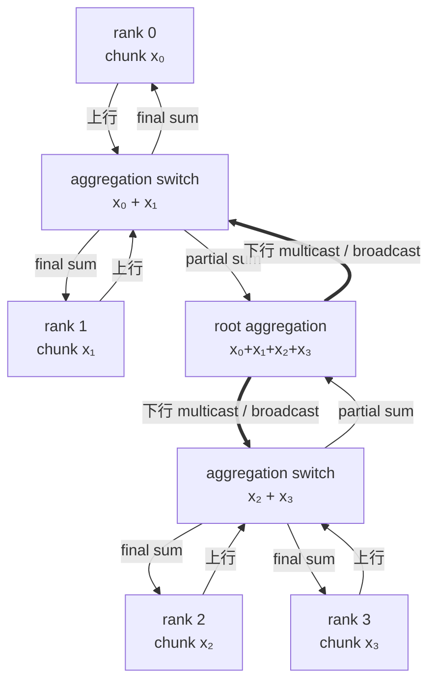
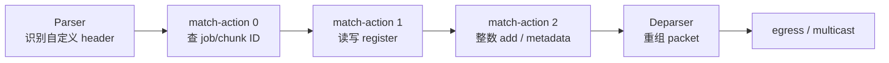
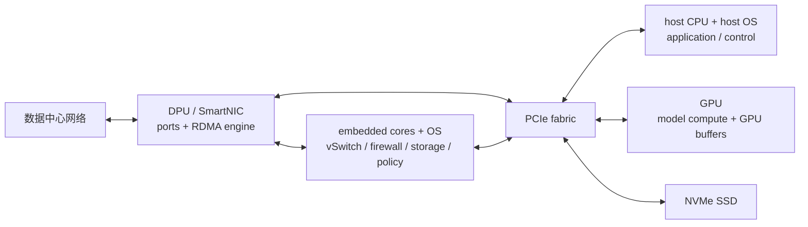

# L33 在网计算与智能网卡：让网络不只搬数据

> [!abstract] 本课速览
> 读完你将能够：
> 1. 画出 **in-network computing (INC)** all-reduce 的上行聚合、下行广播路径，并解释它为何不能省 $p$ 倍流量；
> 2. 用 1024 ranks、1 GB 梯度复算 **SHARP** 相对 ring all-reduce 的带宽与时延收益上限，并区分节点内的 **NVLS**；
> 3. 解释 **P4**、**match-action** 与 **RMT** 的关系，以及 **SwitchML** 为什么要把浮点梯度缩放成定点整数；
> 4. 区分 **programmable switch**、**SmartNIC** 与 **DPU**，指出 **BlueField** 适合卸载的网络、存储和安全工作；
> 5. 从精度、片上状态、多租户、故障、加密和生态六个维度判断一次 INC 提案是否真的划算。
>
> 前置：[[L29 RDMA原理]] · [[L36 集合通信原语]]（可后补） · 预计 55 分钟

## 论文里的这段话，你现在可能读不懂

> [!quote]
> “An **in-network aggregation** engine constructs a **reduction tree** and performs **streaming aggregation**, then uses **multicast** to return the result. A **programmable switch** exposes **match-action** stages in an **RMT** pipeline to **P4**, while the end hosts may scale floating-point gradients into fixed-point integers before a SwitchML-like aggregation. A **DPU** or **SmartNIC** moves a different set of infrastructure services—networking, storage, security, and transport **offload**—into an isolated processing domain.”（改写自 NVIDIA SHARP/NCCL、SwitchML、P4/RMT 与 BlueField 文档的典型表述）

这段话把三种“让网络做更多事”的路线挤在一起了：交换机做固定功能的 collective、可编程数据面处理 packets、服务器边缘设备接管基础设施服务。它们都叫 offload，却不是同一种硬件，也不该用同一套收益口径。

## 一、如果网络永远只是管道，会浪费什么

### 1.1 all-reduce 的结果相同，走法可以不同

先补一口 [[L36 集合通信原语]] 的语义：$p$ 个 ranks 各自持有一份 $n$-byte tensor，all-reduce 对相同位置做 sum、max 等 reduction，最后每个 rank 都拿到完整结果。数据并行训练里，这份 tensor 常是本地 gradients。

传统做法让 endpoints 通过 ring 或 tree 互相转发、归约。问题在于：这些 bytes 本来就会经过 switches，switch 却只看 header，payload 原封不动地搬过去；partial sum 于是要在 endpoint 生成，再穿越 fabric 进入下一轮。

in-network computing 把部分计算放进 packet 的转发路径；当这项计算专指把多个 inputs 合成一个 sum/max 时，叫 **in-network aggregation**（在网聚合）。其核心动作是 **offload**（卸载）：把原先由 CPU、GPU 或 endpoint communication stack 承担的工作迁到 network device。

这棵结构叫 **reduction tree**（归约树）：leaves 是 ranks，中间节点合并 children 的 partial results，root 得到最终结果；下行用 **multicast**（组播，一份 packet 在网络内复制给一组 receivers）或 broadcast 把结果发回。每条 tree edge 对一个 chunk 只需一次上行和一次下行，不再让完整 tensor 在 endpoints 之间绕多轮。

> [!tip] 直觉：沿途把箱子合并
> 普通 network 像快递中转站：只换车，不拆箱。in-network aggregation 像每个中转站都把同一订单的箱子合并，越靠近 root，继续向上搬的就越少；最终清单再沿树复印发回。

### 1.2 省的是重复穿越，不是把 $p$ 份输入变没

每个 rank 的本地输入至少要离开一次，最终结果至少要回来一次。因此理想 INC 也绕不开“一份上行 + 一份下行”。它消掉的是 ring all-reduce 中一块数据被多轮转发的部分，而不是省掉所有其他 ranks 的输入。

> [!warning] 常见误区：能省 $p$ 倍流量
> 对 ring all-reduce，endpoint 的单方向通信量约从 $2n$ 降到 $n$，带宽项上限是 $2\times$，不是 $p\times$。集群变大主要放大的是 ring 的 round 数和同步开销，不会突破“数据至少上传一次、结果至少下载一次”的下界。

## 二、固定功能硬件怎样做归约

### 2.1 SHARP：把 aggregation tree 放进 InfiniBand fabric

**SHARP (Scalable Hierarchical Aggregation and Reduction Protocol)** 是 NVIDIA InfiniBand 生态中的 collective offload：fabric 建立 SHARP trees，由支持 aggregation 的 network nodes 在数据经过时执行 reduction，减少 endpoints 之间的重复发送。官方文档明确把它用于 MPI 和 machine learning collectives，并支持面向大 payload 的 streaming 路线。[^sharp]

**streaming aggregation**（流式聚合）不是等完整 1 GB tensor 全部进入 switch memory 后再求和，而是把 tensor 切成 chunks：某个 chunk 的各 rank inputs 到齐后，pipeline 立刻合并并向上推进；不同 chunks 同时位于 tree 的不同 stages。这样 switch 只需维护有限数量的 in-flight states，就能连续处理远大于片上存储的 tensor。

这也解释了 SHARP 的两个收益来源：

- endpoint 不再执行多轮 reduction/forwarding，CPU/GPU communication work 与 fabric bytes 都减少；
- reduction tree 的 depth 随 $p$ 近似按 $\log p$ 增长，避免 ring 的 round count 随 $p$ 线性增长。

但“树浅”不等于永远更快。大消息会把 link 跑满，此时主要账是 bytes/bandwidth；若已有 ring 能充分利用 rails 和 full-duplex links，SHARP 的 bandwidth term 也只能逼近 $2\times$。小消息或极大 $p$ 下，fixed latency 与 round count 的减少才更显眼。

### 2.2 NVLS：同一思路缩到 NVSwitch domain

**NVLS (NVLink SHARP)** 把硬件 multicast/reduction 放进节点内 NVSwitch domain。NCCL 文档说明，NVLS 可 offload `ncclAllReduce` 等 collectives；在支持的 Hopper 及后续 NVSwitch systems 上，`NCCL_NVLS_ENABLE` 默认取自动检测语义，而不是要求 application 自己实现一遍 aggregation protocol。[^nvls]

SHARP 与 NVLS 是同族思路，但边界不同：前者面向 scale-out InfiniBand fabric，后者面向 NVLink/NVSwitch scale-up domain。后续 [[L38 NCCL解剖]] 会把 NVLS 放回 NCCL algorithm selection 与 topology detection 中；这里先记住：==“硬件支持”只是候选路径，库还要判断 topology、datatype、buffer registration 与资源是否匹配。==

> [!example] 算一算：1024 卡、1 GB 梯度能省多少
> 设 $p=1024$、每个 rank 的 gradient 为 $n=1\ \text{GB}$。按 [[03 约定与符号]]，400 Gb/s 单向端口等于 $B=50\ \text{GB/s}$，集合通信固定开销取 $\alpha\approx10\ \mu\text{s}$ 量级。下面忽略协议 header、contention、pipeline fill/drain 与多 rail，只算理想上限。
>
> **带宽项。** ring all-reduce 每个 rank 的发送量和接收量各为
> $$
> V_{\text{ring, one-way}}
> =2n\frac{p-1}{p}
> =2\times1\times\frac{1023}{1024}
> =1.998046875\ \text{GB}.
> $$
> full-duplex 下用一个方向的 bytes 除以单向带宽：
> $$
> T_{\text{ring,bw}}
> =\frac{1.998046875}{50}\ \text{s}
> \approx39.96\ \text{ms}.
> $$
> 理想 in-network tree 中，每个 rank 只发送 $n$、接收 $n$：
> $$
> T_{\text{INC,bw}}=\frac{1}{50}\ \text{s}=20\ \text{ms},
> \qquad
> S_{\text{bw}}=\frac{39.96}{20}\approx1.998\times.
> $$
> 整个 1024-rank communicator 的单方向 endpoint injection 也相应从 $1024\times1.998\approx2046\ \text{GB}$ 降到 $1024\ \text{GB}$。这就是“约减半”，不是 $1024\times$。
>
> **latency 项。** 用最朴素的 round-count 模型，ring 的 reduce-scatter + all-gather 有 $2(p-1)=2046$ rounds：
> $$
> T_{\text{ring,lat}}\approx2(p-1)\alpha
> =2046\times10\ \mu\text{s}
> =20.46\ \text{ms}.
> $$
> 二叉 reduction tree 上行加下行约 $2\log_2p=20$ levels：
> $$
> T_{\text{tree,lat}}\approx2\log_2(p)\alpha
> =20\times10\ \mu\text{s}
> =0.20\ \text{ms}.
> $$
> 若机械相加，这个教学模型给出 ring 约 $60.42$ ms、INC 约 $20.20$ ms；它不是产品 benchmark，因为两种实现的有效 $\alpha$、chunk pipeline 和 link concurrency 未必相同。可迁移的结论是：$n\to\infty$ 时 latency 被摊薄，总收益趋近 bandwidth 上限 $2\times$；$n$ 小或 $p$ 大时，树的 $\log p$ latency scaling 可能额外占优。

## 三、P4 与 programmable switch：线速可编程不等于通用计算

### 3.1 从“固定查表”到 match-action pipeline

**programmable switch**（可编程交换机）允许 operator 定义部分 packet parser、header processing 与 forwarding logic。常见抽象是 **match-action**（匹配—动作）：从 header/metadata 取 keys 查表，命中后执行改 header、选 port、更新 counter/register 等受限 actions。

这类流水也常概括为 **PMA (programmable match-action)** 架构。**RMT (Reconfigurable Match Tables)**（可重构匹配表）是其经典实现：packet 经过 parser 后穿过多级 match-action stages，最后由 deparser 重组；每级能用的 table memory、register ports、算术单元和执行次数都有硬上限。RMT 论文的关键贡献不是把 CPU 塞进 switch，而是在 line rate 约束下提供“足够可重构”的 packet-processing stages。[^rmt]

**P4** 是描述数据面如何解析和处理 packets 的 domain-specific language。P4 program 可表达 header formats、tables、actions 与 pipeline control；compiler 再把这些逻辑映射到具体 target。于是研究者能改“网络遇到这种 packet 时做什么”，却不能假设有动态内存、任意循环、丰富 floating-point units 或无限共享 state。

**Tofino** 是 Barefoot、后归 Intel 的 P4-programmable switch ASIC 系列，也是大量学术 prototypes 使用的 target。行业现实也值得知道：Intel 在 2023 年宣布停止对 network switching product line 的未来投入，后来又对 Tofino products 发布正式 product discontinuance / EOL 通知；这说明一个漂亮的 programming model 与一条可持续的 commercial silicon roadmap 是两件事。[^tofino]

### 3.2 SwitchML：把 gradients 塞进整数流水线

**SwitchML** 是《Scaling Distributed Machine Learning with In-Network Aggregation》（NSDI 2021）提出的 switch–host co-design。它把 gradient vector 切成可放进 packets 的 chunks，switch 用 register slots 记录 partial sums，凑齐 worker contributions 后将 result 发回 workers。[^switchml]

难点是 ML frameworks 使用 floating point，而当时 target 的数据面算术以 integer 为主。SwitchML 的办法不是假装 switch 会 FP32，而是让 endpoints 选择 adaptive scaling factor，把 floating-point values 缩放并转换成 fixed-point integers；switch 做 integer addition，endpoint 收到 aggregate 后再还原尺度。精度、overflow range 与 scaling coordination 因而成为 protocol 的一部分。

这段设计很值得学：它没有只问“P4 能否写一个 add”，而是同时改了 packet format、endpoint transport、loss recovery、switch scoreboard/state 和 ML framework interface。真正的 INC 往往是 end-to-end co-design，不是一段孤立的 P4 code。

**ATP** 是同在 NSDI 2021 的《ATP: In-network Aggregation for Multi-tenant Learning》。它把问题推进到 multi-rack、multi-job 场景：多个 training jobs 竞争有限 switch aggregation resources 时，系统要做 decentralized、dynamic、best-effort aggregation 与公平共享，而不是默认整台 switch 只服务一个 job。[^atp]

### 3.3 为什么没有“从此所有训练都在交换机里聚合”

| 约束 | 为什么会卡住 | 设计者必须回答什么 |
|---|---|---|
| 数值格式 | 通用 floating point、舍入和 overflow handling 不一定在 target 上可用 | 定点转换是否损害训练；不同 datatype/op 如何回退 |
| 片上状态 | GB 级 tensor 远大于 register/SRAM，且多 jobs 要并发 | chunk/slot 如何复用；慢 worker、丢包时何时回收 |
| pipeline 算力 | 每个 packet 只有有限 stages/actions，复杂 control flow 可能需要 recirculation | 能否保持 line rate；会不会挤占基本 forwarding 功能 |
| 多租户 | aggregation state 有 job、group、chunk 与 epoch 身份 | 隔离、公平、admission control 和恶意/异常 tenant 怎么做 |
| 可靠性与调试 | 一个 switch bug 或错误 partial sum 可影响整组 ranks；state 跨 endpoint 与 switch，timing-sensitive failure 难以复现 | duplicate、loss、restart、fallback、observability 和 end-to-end verification 怎么做 |
| 加密 | payload encryption 让 switch 看不到 operands；中途改 payload 又影响完整性校验 | trust boundary 在哪；是否只处理可信 backend fabric |
| 生态 | P4 program、ASIC capability、collective library 与 framework 都要对齐 | 跨 vendor/代际如何部署，unsupported case 如何退回普通 collective |

这就是“为什么十年了还没统治世界”的冷静答案：INC 对简单、可结合、重复量大且路径稳定的 operations 很有吸引力，但 programmability、state、precision 与 operations 的组合空间远窄于 GPU；异构 hardware/software 生态和困难的分布式调试又抬高了部署门槛。它更像一把专用扳手，不是网络里的通用服务器。

## 四、DPU 与 SmartNIC：把服务器基础设施面搬到网卡侧

### 4.1 三个名字，别只看营销页

**SmartNIC**（智能网卡）通常指带可编程处理能力、能执行部分 network/storage/security functions 的 NIC；实现可以是 ASIC、FPGA、embedded cores 或其组合。**DPU (Data Processing Unit)**（数据处理单元）通常更强调独立 CPU cores、memory、accelerators 与可运行 OS 的 infrastructure computing domain。两者边界没有跨厂商统一的硬标准，很多 DPU 也会被泛称 SmartNIC。

**BlueField** 是 NVIDIA 的 DPU 产品族。其 software 文档描述的典型形态是 embedded Arm subsystem + ConnectX network controller + accelerators，并运行独立 Linux/DOCA stack；在 DPU mode 下，embedded system 可拥有 NIC resources 和 host network data path 的控制权。[^bluefield]

| 设备 | 主要位置与能力 | 适合做什么 | 不应默认做什么 |
|---|---|---|---|
| 普通 NIC/HCA | packet I/O、RDMA transport 等固定功能 | checksum、segmentation、RDMA reliable transport | 运行复杂 tenant services |
| SmartNIC | NIC 上增加可编程 datapath/cores | vSwitch、filter、telemetry、部分 storage/security | 自动拥有完整独立 OS 与强隔离域 |
| DPU | NIC + embedded compute + memory + accelerators + OS | infrastructure services、isolation、policy、storage/network/security offload | 代替 GPU 做 GEMM 或承诺任意 collective 都更快 |

### 4.2 主机—DPU—网络“三明治”

可以把趋势概括成“host infrastructure data plane 归 DPU，model data plane 归 GPU”，但不要把它理解成每个 GPU packet 都先绕 Arm cores。[[L29 RDMA原理]] 中的 GPUDirect RDMA 仍追求 NIC 与 GPU buffers 的直接路径；ConnectX 等 fixed-function engines 可 offload RDMA transport 本身，DPU cores/accelerators 则更适合把 host CPU 从 vSwitch、virtualization、firewall/encryption policy、telemetry、network management 和 storage services 中解放出来。

**NVMe-oF (NVMe over Fabrics)**（基于网络 fabric 的 NVMe）把 NVMe command/queue semantics 扩展到远端 storage，可运行在 RDMA 或 TCP transport 上。BlueField 可承担 NVMe-oF target、virtual block device 和部分 storage acceleration；对 AI cluster 的意义会在 [[L34 存储与数据供给]] 里落到 dataset supply、checkpoint write 与 restore storm。

对 AI cluster，DPU 的现实价值主要有三类：

1. **多租户隔离**：把 tenant host 与 fabric policy、virtual network、security enforcement 分开，降低 host compromise 直接控制 network 的风险；
2. **基础设施 CPU 节省**：把 networking/storage/security bookkeeping 移出 host cores，让 CPU 更专注 data pipeline 与 GPU orchestration；
3. **可部署的研究位置**：DPU 比 switch 更容易运行复杂 scheduler、maintain per-job state、处理 exceptions，可尝试 communication scheduling、aggregation、compression 或 telemetry；代价是多一次 data movement、PCIe/state synchronization 和额外 failure domain。

> [!warning] DPU 不是“更贵的网卡”，也不是“免费的 CPU”
> 它是可独立升级、重启、受攻击、失效和观测的计算域。设计若只算 host CPU 省了多少，却不算 DPU cores/memory、PCIe traffic、software lifecycle、tail latency 与故障恢复，就还没有完成 offload 的账。

## 五、什么时候 INC 真的赚：一张研究评估清单

看到“把 X 搬进网络”时，按下面顺序追问，比先看 speedup 柱状图更有用：

1. **瓶颈对吗？** baseline 的 end-to-end iteration 是 network-bound，还是 compute、data loading、synchronization 在主导？
2. **operation 合适吗？** sum/max 这类 associative reduction 易切 chunks；复杂 control flow、non-associative numerics 或 dependency-heavy operation 很难线速化。
3. **state 装得下吗？** 不只算一个 job 的 happy path，还要算并发 jobs、in-flight chunks、retransmissions 和 slow ranks。
4. **bytes 真少了吗？** 分别报告 endpoint injection、per-link traffic、PCIe traffic 和 recirculation；不要把 traffic 从 fabric 搬到 PCIe 就叫“消失”。
5. **收益穿透了吗？** 同时测 collective latency/bandwidth、iteration time、MFU/goodput，而不是只测 switch packets/s。
6. **异常怎么办？** switch/DPU failure、packet duplicate/loss、job restart、resource exhaustion 时能否检测、清 state 并回退到 ordinary collective。
7. **信任边界变了吗？** aggregation 需要读取并修改 payload；encryption、integrity、tenant isolation 与 operator trust 如何兼容。
8. **能部署多久？** hardware generations、P4 targets、drivers、NCCL/framework versions 与 operations 的 compatibility matrix 是否可维护。

这张清单直接落在用户研究方向的两条主线：一是 collective communication 与 topology 的联合优化，二是 AI infrastructure 的 survivability。值得做的下一步不是泛泛地“用 DPU 加速 AI”，而是给出明确的 workload、network bottleneck、offload boundary、failure model 和 end-to-end metric，再用 [[L37 通信算法与代价模型]] 建模、用 [[L67 测量仿真与评测]] 校准。

## 回到开头那段话

现在逐句回读：

1. “An in-network aggregation engine constructs a reduction tree and performs streaming aggregation, then uses multicast to return the result。”——ranks 的 chunks 沿 reduction tree 上行，switch 边到边合并；root 得到 final chunk 后沿下行 multicast 复制，避免完整 tensor 在 endpoints 间多轮转发。
2. “A programmable switch exposes match-action stages in an RMT pipeline to P4, while the end hosts may scale floating-point gradients into fixed-point integers before a SwitchML-like aggregation。”——P4 配置的不是通用 CPU，而是资源有限的 RMT match-action pipeline；SwitchML 因 target 缺少通用 floating-point arithmetic，让 endpoints 先缩放成 fixed-point integers，再由 switch registers 累加。
3. “A DPU or SmartNIC moves a different set of infrastructure services—networking, storage, security, and transport offload—into an isolated processing domain。”——DPU/SmartNIC 不等同于 SHARP switch：它位于 server edge，BlueField 这类 DPU 有 embedded cores 与 OS，主要接管 network/storage/security infrastructure services，并形成新的 trust 与 failure domain。

你现在可以把整段压成一句话：==SHARP 把一个固定但高价值的 reduction 放进 fabric，P4 把受限 packet logic 交给程序，DPU 则把一部分服务器基础设施搬到网卡侧；三者的共同点是 offload，边界和代价完全不同。==

## 术语卡片

| 术语 | 中文 | 一句话解释 |
|---|---|---|
| in-network computing | 在网计算 | 在 packet 转发路径上的 network device 内执行部分 application/infrastructure computation。 |
| in-network aggregation | 在网聚合 | 在 network fabric 内合并多个 ranks 的 sum/max 等 partial results。 |
| SHARP | 可扩展分层聚合与归约协议 | NVIDIA InfiniBand 生态中把 collective reduction offload 到 fabric aggregation nodes 的技术。 |
| streaming aggregation | 流式聚合 | 将大 tensor 切成 chunks，在有限片上 state 中边到达、边归约、边转发。 |
| NVLS | NVLink SHARP | 在 NVSwitch/NVLink domain 内用硬件 multicast/reduction 加速 NCCL collectives。 |
| programmable switch | 可编程交换机 | 允许编程部分 parser、match-action 与 forwarding behavior 的线速 switch。 |
| P4 | P4 数据面编程语言 | 描述 network device 如何解析和处理 packets 的领域专用语言。 |
| match-action | 匹配—动作 | 用 header/metadata 查表，并执行与命中项关联的受限 packet actions。 |
| RMT | 可重构匹配表 | 由多级可配置 match-action stages 组成的高速 programmable dataplane 架构。 |
| Tofino | P4 可编程交换芯片系列 | Barefoot/Intel 的 programmable switch ASIC，曾被大量 P4 research prototypes 使用。 |
| SwitchML | 交换机内 ML 聚合系统 | 以 switch–host co-design、定点整数转换和片上 slots 聚合 distributed training gradients。 |
| ATP | 多租户在网聚合系统 | 面向 multi-rack、multi-job training 的动态、best-effort switch aggregation 服务。 |
| DPU | 数据处理单元 | 带 embedded compute、memory、accelerators 与 OS，面向 infrastructure services 的处理器。 |
| SmartNIC | 智能网卡 | 在 NIC 上加入可编程处理能力、可 offload network/storage/security functions 的设备类别。 |
| BlueField | NVIDIA DPU 产品族 | 组合 ConnectX networking、embedded Arm subsystem 与 DOCA/Linux software stack 的 DPU。 |
| NVMe-oF | 基于 fabric 的 NVMe | 把 NVMe command/queue semantics 扩展到 RDMA/TCP network 上的远端 storage protocol。 |
| offload | 卸载 | 把工作从 host CPU/GPU 迁移到 NIC、DPU、switch 或其他专用 engine。 |
| multicast | 组播 | network 从一份输入复制出多份 packets，发送给指定 receiver group。 |
| reduction tree | 归约树 | leaves 贡献 inputs、中间节点合并 partial results、root 产生最终结果的 collective 结构。 |

## 自测

1. in-network aggregation 为什么能减少 ring all-reduce 的 bytes，却不能把通信量减少 $p$ 倍？
2. 1024 ranks 各有 1 GB gradient。按本课口径，ring 每 rank 单方向通信量是多少？在 400 Gb/s link 上的 bandwidth time 是多少？理想 INC 呢？
3. 用 $\alpha=10\ \mu\text{s}$ 比较 1024-rank ring 的 $2(p-1)$ latency rounds 与二叉 reduction+broadcast tree 的 $2\log_2p$ levels。这个结果为什么不能直接当 benchmark？
4. P4、match-action 与 RMT 分别处在哪一层？为什么“P4 可编程”不等于 switch 能执行任意 Python/CUDA 程序？
5. SwitchML 为什么把 floating-point gradients 转成 fixed-point integers？这项转换新增了哪两类正确性风险？
6. ATP 相比只服务单个 job 的 aggregation prototype，多解决了什么系统问题？
7. DPU 与普通 NIC、programmable switch 的位置和职责有什么区别？列出两项适合 BlueField offload 的工作和一项不应默认 offload 的工作。
8. 若 tensor payload 做了 end-to-end encryption，你会怎样评估 switch aggregation 提案？至少写出 trust、correctness、fallback 三个问题。

> [!note]- 参考答案
> 1. 每个 rank 的 input 至少要上传一次，final result 至少要下载一次；INC 消掉的是 ring 中的多轮转发。ring 单方向约 $2n$，理想 INC 为 $n$，所以 bandwidth term 上限约 $2\times$。
> 2. $2\times1\times1023/1024=1.998046875$ GB；$1.998046875/50\approx39.96$ ms。理想 INC 为 1 GB，$1/50=20$ ms，bandwidth speedup 约 $1.998\times$。
> 3. ring 为 $2046\times10\ \mu\text{s}=20.46$ ms；tree 为 $20\times10\ \mu\text{s}=0.20$ ms。该模型假设两种实现有相同有效 $\alpha$，并忽略 pipeline、topology、multi-rail、contention、resource allocation 与 protocol overhead，只能展示 scaling trend。
> 4. P4 是描述语言，match-action 是 packet-processing 抽象，RMT 是承载多级 match-action 的硬件 pipeline 架构。target 只有有限 stages、tables/registers、ALUs 和 control flow，缺少通用处理器的动态内存、循环与丰富 floating-point execution。
> 5. 因为目标 switch dataplane 主要支持 integer arithmetic。风险至少有 quantization/rounding error，以及 scaling 选择不当导致的 integer overflow；还要协调所有 workers 使用一致、可恢复的尺度。
> 6. 它处理 multi-rack、multi-job 下有限 switch slots/state 的动态分配、公平共享与 contention，并允许 best-effort aggregation/fallback，而不是假设独占设备。
> 7. 普通 NIC/HCA 主要做 packet I/O 和固定 transport；programmable switch 位于 fabric 中间、按 packet 线速处理；DPU 位于 server edge，有 embedded compute/OS，接管 infrastructure services。适合 offload vSwitch/firewall、telemetry、NVMe-oF/storage、security/RDMA management；不应默认拿它替 GPU 做 model GEMM。
> 8. 先问 switch 是否属于可见 plaintext 的 trust boundary、谁持有 keys；中途 reduction 后怎样验证 aggregate 的 integrity/precision；unsupported op、key rotation、switch failure 或 verification failure 时，能否回退到 endpoint collective。若必须保持 payload 对中间 network 保密，普通明文 in-switch sum 就不成立。

## 延伸阅读

- Amedeo Sapio 等，《[Scaling Distributed Machine Learning with In-Network Aggregation](https://www.usenix.org/conference/nsdi21/presentation/sapio)》（USENIX NSDI 2021）：必读 design；追踪 fixed-point conversion、switch slots、endpoint protocol 与 loss recovery 如何共同组成 SwitchML。
- ChonLam Lao 等，《[ATP: In-network Aggregation for Multi-tenant Learning](https://www.usenix.org/conference/nsdi21/presentation/lao)》（USENIX NSDI 2021）：选读 resource management；看 multi-job contention 怎样把“能聚合”升级成“能共享”。
- NVIDIA，《[Scalable Hierarchical Aggregation and Reduction Protocol (SHARP) Introduction](https://docs.nvidia.com/networking/display/sharpv390/introduction)》：工程视角读 SHARP 的 collective offload、tree 与 streaming 定位。
- Pat Bosshart 等，《[Forwarding Metamorphosis: Fast Programmable Match-Action Processing in Hardware for SDN](https://conferences.sigcomm.org/sigcomm/2013/papers/sigcomm/p99.pdf)》（ACM SIGCOMM 2013）：读 abstract 与架构图，理解 RMT 为何是“受资源约束的可重构流水线”。
- NVIDIA，《[BlueField Software Overview](https://docs.nvidia.com/networking/display/bluefieldbsp4100/bluefield%2Bsoftware%2Boverview)》：按 networking、storage 与 embedded Arm 架构浏览，建立 DPU 的边界感。

[^sharp]: NVIDIA，《[SHARP Introduction](https://docs.nvidia.com/networking/display/sharpv390/introduction)》与《[SHARP Collective Library](https://docs.nvidia.com/networking/display/sharpv261/nvidia%2Bsharp%2Bcollective%2Blibrary)》：前者说明 collective offload 与减少重复 endpoint transmissions，后者列出 Streaming Aggregation Tree 及 pipeline tuning。
[^nvls]: NVIDIA NCCL，《[Environment Variables: `NCCL_NVLS_ENABLE`](https://docs.nvidia.com/deeplearning/nccl/archives/nccl_2276/user-guide/docs/env.html#nccl-nvls-enable)》与《[User Buffer Registration](https://docs.nvidia.com/deeplearning/nccl/archives/nccl_2243/user-guide/docs/usage/bufferreg.html#nvlink-sharp-buffer-registration)》：说明 NVLS 的系统范围、automatic detection 与 supported collectives/buffers。
[^rmt]: Pat Bosshart 等，《[Forwarding Metamorphosis: Fast Programmable Match-Action Processing in Hardware for SDN](https://conferences.sigcomm.org/sigcomm/2013/papers/sigcomm/p99.pdf)》（ACM SIGCOMM 2013）：提出 RMT abstraction，并强调 programmability 受 overall on-chip resources 约束。
[^tofino]: Intel 在 2023 年 Q4 2022 earnings call 中宣布停止 network switching product line 的未来投入；其官方《[Tofino Products Product Discontinuance / End of Life](https://www.intel.com/content/www/us/en/content-details/827577/intel-tofino-products-pcn-827577-00-product-discontinuance-tofino-end-of-life.html)》随后给出产品停产通知。这里据此区分“停止路线图投入”与“既有产品立即停止支持”。
[^switchml]: Amedeo Sapio 等，《[Scaling Distributed Machine Learning with In-Network Aggregation](https://www.usenix.org/conference/nsdi21/presentation/sapio)》（USENIX NSDI 2021）：论文明确说明 target 缺少 floating-point support，并用 adaptive scaling 把 values 转为 fixed point。
[^atp]: ChonLam Lao 等，《[ATP: In-network Aggregation for Multi-tenant Learning](https://www.usenix.org/conference/nsdi21/presentation/lao)》（USENIX NSDI 2021）：面向 multi-rack、multi-job training，采用 decentralized、dynamic、best-effort aggregation 并处理有限 switch resources 的共享。
[^bluefield]: NVIDIA，《[BlueField Software Overview](https://docs.nvidia.com/networking/display/bluefieldbsp4100/bluefield%2Bsoftware%2Boverview)》与《[Modes of Operation](https://docs.nvidia.com/networking/display/bluefieldbsp4132/modes-of-operation)》：前者描述 Arm subsystem、ConnectX 与 networking/storage capabilities，后者说明 DPU mode 的 NIC resource/data-path ownership。

---
上一课：[[L32 路由与负载均衡]] ← · → 下一课：[[L34 存储与数据供给]]
