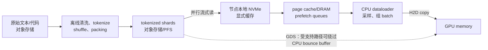
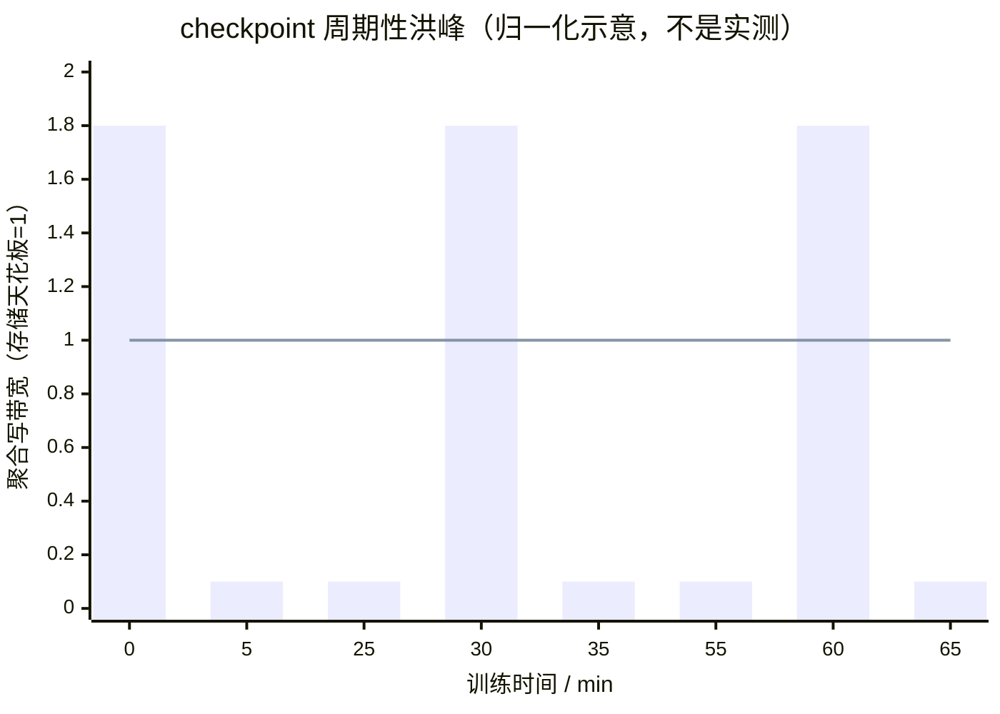

# L34 存储与数据供给：别让万卡等一块盘

> [!abstract] 本课速览
> 读完你将能够：
> 1. 区分训练数据读取、checkpoint 写入与模型分发三种完全不同的 storage workload；
> 2. 画出从对象存储、并行文件系统、本地 **NVMe**、内存到 GPU 的 **data pipeline**，并定位 **dataloader stall**；
> 3. 解释 **Lustre/GPFS**、**S3**、**page cache**、**burst buffer** 与 **3FS** 在管线中的角色，而不把“容量大”误当“供给快”；
> 4. 用 $14\ \text{B/参数}$ 复算 405B 模型的 **checkpoint size**、5 分钟写入带宽和 10,000 卡 **restore** 下界；
> 5. 从共享存储读放大、P2P 分发与独立 storage network 推导恢复时间和生存性的关系。
>
> 前置：[[L27 走进AI数据中心]] · [[L14 预训练]] · 预计 55 分钟

## 论文里的这段话，你现在可能读不懂

> [!quote]
> “Training samples are pre-tokenized into shuffled **shards**, and each node **prefetches** batches through a **parallel filesystem** into a local **NVMe** cache. **Sharded checkpoints** are staged **asynchronously** so that synchronized writes do not remain on the training critical path. During **restore**, one worker reads each shared state partition and redistributes it to peers, while a **GPUDirect Storage** path may avoid a CPU bounce buffer.”（综合改写自 MegaScale、Llama 3、3FS 与 NVIDIA GDS 的典型表述）

第一句在讲稳态喂数据，第二句在讲周期性写洪峰，第三句在讲故障后的读洪峰。它们都访问 storage，却有不同的方向、并发形状和关键指标。若只说一句“把存储带宽加大”，还没有真正读懂问题。

## 一、同一套存储，要接住三种脾气

训练集、checkpoint 和待部署模型都可以是 TB 级文件，但 workload 画像不同。先把本课骨架钉牢：

| workload | 方向与并发形状 | 首要指标 | 没接住会怎样 |
|---|---|---|---|
| 训练数据读取 | 长时间、近似顺序的大读；可预取、可缓存 | 可持续读带宽、尾时延 | GPU 在 step 之间等 batch，形成 dataloader stall |
| checkpoint 写入 | 周期性、许多 ranks 同时写；短而尖的突发 | 峰值聚合写带宽、完成时延、元数据吞吐 | 所有 workers 一起停，甚至把共享 storage 打满 |
| 模型分发/加载 | 一个版本向许多推理实例一对多读；发布或扩容时突发 | 冷启动时间、fan-out 能力、缓存命中 | 新副本迟迟起不来，扩缩容跟不上流量 |

训练读取像食堂每天连续出餐：需求稳定，能提前备菜。checkpoint 像下课铃一响，全校同时冲进食堂；平均客流不高，瞬时队伍却能挤爆门口。模型分发则像给许多分店同时发同一本新菜单，源端读放大尤其明显，后续在 [[L61 推理服务框架与集群]] 回收。

> [!tip] 先问“时间形状”，再问“总字节数”
> 15.6T token 的数据集很大，不等于每秒都要从远端重读整个数据集；训练可以顺序流式读、预取和缓存。反过来，一份 5.7 TB checkpoint 虽小于整个语料，却可能要求在几分钟内由全体 ranks 同时写完。==容量问题与带宽时间形状不是同一个问题。==

## 二、15T token 怎样送到一万张“嘴”里

### 2.1 data pipeline 不是一个 DataLoader 类

**data pipeline**（数据管线）是原始数据从收集到成为 GPU batch 的全流程，而不只是 Python 里的 `DataLoader`：

离线阶段先清洗、去重和 **tokenize**，再把 token IDs 与样本索引写成许多 **shard**（数据分片）。这里的 shard 是可独立校验、读取和重试的数据块；若把万亿 token 做成一个巨型文件，更新、故障重试和并行读取都很难，若做成数十亿小文件，又会把元数据系统压垮。

**sequence packing**（序列装箱）会把若干短样本拼进固定长度的训练序列，尽量少用 padding；实现还需保存样本边界、attention/loss mask 等信息，不能把两个文档的边界悄悄当成普通连续文本。它主要提高有效 token 比例，但也会改变 shard 的索引格式和训练时随机读取粒度。

### 2.2 global shuffle 与 shard-local shuffle 的取舍

**global shuffle** 希望把全数据集的样本近似放进同一个随机排列，统计混合更充分，但对海量数据做真正全局重排会产生昂贵的跨节点读写。**shard-local shuffle** 只打乱每个 shard 内的样本，再随机改变 shard 顺序；它保留了较好的顺序 I/O，却可能让同源数据在一段时间内扎堆。

工程上常取中间态：离线阶段充分随机分 shard，训练时随机 shard 顺序，并在内存中维护有限 shuffle buffer。研究者要同时问两个问题：随机性是否足够支撑训练目标，I/O pattern 是否仍能让存储顺序高吞吐。

### 2.3 prefetch、缓存和 dataloader stall

训练时，**prefetch**（预取）在 GPU 计算当前 batch 时准备后续 batch。节点的 **NVMe**（基于 PCIe 的非易失性内存块存储）常作显式本地缓存；**page cache**（页缓存）则是操作系统用空闲 DRAM 自动缓存文件页。两者都把重复远端读变成本地读，但区别很实际：前者由应用/缓存服务管理、可控，后者可能被其他进程挤走，也可能让每个 worker 重复缓存同一份数据。

如果“准备下一个 batch”的时间超过 GPU 计算当前 batch 的时间，预取队列会被吃空，GPU 只能等。这段空白就是 **dataloader stall**（数据加载停顿）。在 profiler timeline 里，它通常表现为相邻训练 step 之间 GPU stream 上没有 kernel，而 CPU 侧出现文件读取、解码、token transform、锁等待或 worker 调度。[[L52 性能剖析与MFU核算]] 会教你区分这种 gap 与通信暴露。

MegaScale 给了一个很有系统味的例子：同一节点的 tensor-parallel workers 每步输入相同，于是系统只让一个专用 loader 读入 shared memory，再由各 GPU worker 取走自己的输入，避免节点内多个 loaders 重复争抢 disk bandwidth。它还把下一步的 preprocessing 与当前步末尾的 gradient synchronization 重叠。[^megascale]

> [!warning] “多开 DataLoader workers”不是万能药
> 当瓶颈是 CPU transform 时，多 worker 可能有用；当瓶颈已经是共享 PFS、metadata server 或本地盘队列时，继续加 workers 只会增加争用。确诊要同时看 GPU gap、CPU timeline、I/O bandwidth、IOPS 和 metadata latency。

## 三、存储家族：谁做源仓，谁做高速路，谁做冰箱

### 3.1 从 POSIX 文件到对象 key

**parallel filesystem**（并行文件系统，PFS）让许多 clients 同时访问一个共享文件命名空间，并把一个文件或不同文件的数据 I/O 分散到多台 storage servers/disks。**POSIX semantics**（POSIX 文件语义）在这里首先意味着应用仍可使用熟悉的层次目录和 `open/read/write/stat/rename` 等文件接口；具体系统在多客户端并发、缓存一致性和失败时的细节仍要查文档，不能只凭“POSIX”三个字推断。

**Lustre** 是开源并行文件系统。它把 namespace/layout 等交给 **metadata server**（元数据服务器，MDS），把 bulk file data 放在 object storage targets；client 打开文件取得 layout 后，数据读写可直接访问 storage servers，不让 MDS 搬每个 data byte。一个大文件可通过 **striping**（条带化）按 chunk 分布到多个 storage targets，并行取得聚合带宽。[^lustre]

因此，“MDS 是瓶颈”通常不是说所有大文件字节都穿过 MDS，而是大量 workers 同时 `open/stat/create` 小文件时形成 **metadata storm**。多做 shard、少做 tiny files，就是在数据格式层减少元数据请求。现代系统也可以切分目录或分布 metadata；这里的单 MDS 图景是理解瓶颈的起点，不是所有 PFS 的固定实现。

**GPFS** 是 IBM General Parallel File System 的旧称，现产品名为 IBM Storage Scale。它同样向多服务器提供共享文件接口与并行访问，但内部数据、metadata、锁和节点角色组织不应硬套 Lustre 的 MDS/OSS 命名。[^gpfs]

**object storage**（对象存储）把数据作为 object，以 bucket 中的 key 访问，典型操作是 PUT/GET/LIST，而不是直接暴露本地文件的 inode 与任意 POSIX 操作。**S3** 是最常见的对象 API/服务语义：general purpose bucket 的数据模型是扁平 key 空间，`a/b/c` 的斜杠只是前缀带来的逻辑目录。AWS S3 自 2020 年 12 月起对成功写入后的 GET/LIST 等提供强一致性；把今天的 S3 一概写成“最终一致”已经过时。[^s3]

### 3.2 放回训练管线看角色

| 类型 | 语义 / 带宽特征 | 管线中的典型位置 | 最容易踩的坑 |
|---|---|---|---|
| 本地 NVMe | 节点私有块设备；低共享、靠近 compute | hot shard cache、临时 checkpoint stage | 节点坏了缓存可一起丢；每节点预热会放大源端读取 |
| Lustre / GPFS 类 PFS | 共享文件命名空间；clients 并行读写 | 训练在线数据、共享 checkpoint | 小文件 metadata storm、条带参数不合 workload、共享带宽长尾 |
| S3 类对象存储 | bucket+key、GET/PUT；通常面向大规模容量与耐久 | 原始数据源仓、归档 checkpoint、模型仓库 | 不等同 POSIX；裸挂载/小对象访问可能产生语义与请求开销 |
| page cache / 内存缓存 | DRAM 命中快，但容量有限、易被回收 | hot pages、prefetch queue、共享内存 | 多进程重复缓存、cache pollution、命中率抖动 |
| **burst buffer**（突发缓冲层） | 用 DRAM/本地 NVMe/专用快速层先吸收尖峰，再后台排空 | async checkpoint 的 compute 与 durable storage 之间 | 缓冲层满后仍会反压；“已写入缓冲”未必等于“已耐久” |

**3FS**（Fire-Flyer File System，面向 AI 的分布式文件系统）由 DeepSeek 开源：以 NVMe SSD 与 RDMA network 构建 shared storage，官方 README 强调 locality-oblivious access、strong consistency、parallel checkpointing，以及对 training samples 的 random access；它甚至把“减少应用侧 prefetch/shuffle 的需要”列为 dataloader 目标。[^3fs] 这里先认名，不把其公开 benchmark 当成任意集群都能复现的常数。真正读设计时要追问：metadata 怎样扩展、random read 怎样调度、故障后怎样重建、训练和 KV cache 多租户争用怎样隔离。

> [!tip] 一条实用的分层心智模型
> 对象存储像远端总仓，PFS 像全园区共享仓库，本地 NVMe 像每家店的冰柜，page cache/DRAM 像操作台。把所有东西都放总仓最省管理，却不可能让一万名厨师每次都回总仓拿一勺盐。

## 四、checkpoint：5.7 TB 不大，5 分钟一起写才大

### 4.1 先把 checkpoint size 的口径算清

**checkpoint size**（检查点体积）取决于“为了恢复训练，究竟保存哪些 state”。按 [[03 约定与符号]] 的 Adam 混合精度统一口径：

$$
C_{ckpt}=N\times(2_{\text{BF16参数}}+4_{\text{FP32 master}}+4_m+4_v)\ \text{B}=14N\ \text{B}.
$$

checkpoint 不保存可由下一步重新算出的 gradient，所以不是训练驻留显存的 $16\ \text{B/参数}$。对 $N=405\times10^9$：

$$
C_{ckpt}=405\times10^9\times14=5.67\times10^{12}\ \text{B}\approx5.7\ \text{TB}.
$$

实际框架还可能保存 scheduler、RNG、dataloader cursor、manifest 等小量 metadata，也可能只保存权重做推理；看到论文里的 checkpoint 数字，先问它是“可续训状态”还是“模型权重”。

### 4.2 为什么同步写像存储侧 incast

最朴素的 checkpoint 在某一步设置 global barrier，所有 ranks 同时把 state 写向共享存储，写完才继续训练。这在时间上很像 [[L30 无损网络与拥塞控制]] 的 incast：许多 senders 在短时间内冲向有限的一组 storage targets、metadata services 和 uplinks。区别是这里还要维护文件布局、完成语义与 durable commit。

柱是瞬时写入需求，横线是 storage capacity。尖峰超过天花板后不会消失，只会排队、拉长 checkpoint pause，并干扰同一系统里的 dataloader 和其他 jobs。Llama 3 报告明确把“高度突发的 checkpoint writes 在短时间饱和 storage fabric”列为主要挑战。[^llama3]

### 4.3 四类缓解手段

- **sharded checkpoint**（分片检查点）：每个 rank 直接保存自己持有的 parameter/optimizer shard，不先 gather 成一份巨型文件；它减少单点内存和网络汇聚，但必须用 manifest 记录全局版本、拓扑与 shard 映射。
- **async checkpoint**（异步检查点）：先把 GPU state 快速复制到 host memory 或 burst buffer，让训练尽快继续，再由后台进程排空到 durable storage。MegaScale 的两阶段方案正是 GPU→host memory 后恢复训练、后台写 HDFS。[^megascale]
- 内存多副本 / P2P：把 shard 在邻居或备用节点内存保留副本，故障时从近端恢复；代价是额外 DRAM、网络流量与副本一致性。
- 增量 / 差分 checkpoint：只写自上一版本变化的内容；能减字节，却增加版本链管理和 restore 路径复杂度。

无论选哪类，正确性底线都一样：各 shards 必须属于同一个逻辑 training step；只有所有必要 shards 和 manifest 都完成，版本才可原子发布为“可恢复”。否则速度很快地写出一组混合版本，没有意义。

> [!example] 算一算（一）：30 分钟一次、5 分钟写完
> 每次写 $C=5.7\ \text{TB}=5700\ \text{GB}$，checkpoint interval 为 30 分钟，要求写入窗口 $T_w=5\ \text{min}=300\ \text{s}$。
>
> 峰值窗口所需聚合带宽为
> $$
> B_{write}=\frac{C}{T_w}=\frac{5700\ \text{GB}}{300\ \text{s}}=19\ \text{GB/s}.
> $$
>
> 若只拿总量除以 30 分钟，会得到
> $$
> B_{avg}=\frac{5700}{1800}\approx3.17\ \text{GB/s}.
> $$
>
> 两者正好相差 $30/5=6$ 倍。容量规划若只看平均值，会把真正的 checkpoint 洪峰低估 6 倍。这里的 $5.7\ \text{TB}$ 来自 [[03 约定与符号]]；未计协议、metadata、replication/erasure coding 和 contention，因此 $19\ \text{GB/s}$ 只是应用 payload 下界。

## 五、restore：从“读回来”走到“能重新训练”

**restore**（恢复加载）是把 checkpoint 中的模型、optimizer 和训练进度重新装回 workers。它处在故障恢复 critical path：checkpoint 可以后台慢慢落盘，restore 没完成，下一步训练就不能开始。

### 5.1 裸拉为什么会产生读放大

当 data-parallel replicas 需要相同 state partition 时，若每个 worker 都从对象存储/PFS 重复 GET 同一 shard，共享存储侧读取量会从一份 $C$ 放大到 $A\times C$，其中 $A$ 是重复读取因子。MegaScale 的做法是每组只选一个 worker 从 HDFS 读 shared partition，再 broadcast 给 peers：external storage 只服务一份，复制流量转到更适合 fan-out 的 P2P network。[^megascale]

这不是“总网络字节凭空消失”，而是改变瓶颈位置：从少数 storage servers/gateways 的共享出口，搬到许多 workers 的并行 network links。本地 NVMe cache 和 in-memory replica 也是同一思想——先把数据靠近 failure domain，再并行恢复。

> [!example] 算一算（二）：对象存储几十分钟与 P2P 秒级，条件是什么
> 仍取 $C=5700\ \text{GB}$、$G=10{,}000$ GPUs。若 checkpoint 均匀切分，每卡最终需要的独有 payload 为
> $$
> C/G=5700/10{,}000=0.57\ \text{GB}=570\ \text{MB}.
> $$
>
> **共享对象存储/PFS 入口。** 设端到端可持续聚合读取带宽为 $B_s$，不代入未经 [[03 约定与符号]] 登记的“典型对象存储带宽”：
> $$
> T_{shared}=\frac{5700}{B_s}\ \text{s}.
> $$
> 要在 30 分钟读完，必须有 $B_s\ge5700/1800\approx3.17\ \text{GB/s}$；60 分钟的门槛是 $1.58\ \text{GB/s}$。所以当单网关、连接数、小请求、认证、客户端并发或 contention 把有效聚合带宽压到约 $1.6$–$3.2\ \text{GB/s}$ 时，才会落入“几十分钟”。这是条件反推，不是说对象存储天生只有这个速度。若还有读放大 $A$，分子要换成 $A\times5700$。
>
> **分布式内存/NVMe + P2P。** 按 [[03 约定与符号]]，400 Gb/s 每方向等于 $50\ \text{GB/s}$。若每个 worker 的 570 MB shard 已有近端副本，单卡 payload 的链路线速下界是
> $$
> T_{recv,min}=0.57/50=0.0114\ \text{s}=11.4\ \text{ms}.
> $$
> 真正系统还要反序列化、建 process groups、校验和装载 GPU，绝不会承诺 11.4 ms。再看 source 侧：若 $q$ 条独立 400 Gb/s source paths 并行送出一份 checkpoint，
> $$
> T_{source,min}=\frac{5700}{50q}=\frac{114}{q}\ \text{s}.
> $$
> $q\ge12$ 时 byte movement 的理想下界已不超过约 9.5 s；之后秒级恢复能否成立，取决于软件 critical path、缓存命中与网络争用。结论不是“P2P 必定秒级”，而是：==去掉共享源瓶颈后，恢复才有进入秒级的物理条件。==

### 5.2 存储流量究竟走哪张网

在 [[L27 走进AI数据中心]] 的分层里，训练控制、数据集和 checkpoint 常走 front-end network，或者部署独立 **storage network**；collective 则走高性能 back-end network。边界不是厂商定律，但隔离很重要：若 checkpoint 洪峰与 all-reduce 共用同一 oversubscribed links，保存状态本身可能拖慢训练，故障后的 restore 风暴又会妨碍其他健康 jobs。

**GPUDirect Storage**（GPU 直连存储，GDS）让本地 NVMe 或远端 storage NIC 的 DMA data path 直接面向 GPU memory，避免先落到 CPU bounce buffer 再做一次 H2D copy；它降低 CPU load 和额外搬运，但不会创造 PFS/object store 本来没有的带宽，也不替代应用的 sharding、prefetch 和 concurrency tuning。[^gds]

从生存性角度，可以把链条写成：

$$
\text{storage/restore 有效带宽}\longrightarrow T_{restore}\longrightarrow MTTR\longrightarrow\text{作业可用时间与丢失进度}.
$$

这里的 $T_{restore}$ 不只等于 $C/B$，还包含故障检测、节点替换、metadata/listing、反序列化、process-group 重建和必要重算。[[L53 大规模训练可靠性]] 会把这些项放回 checkpoint interval 与 failure rate 的完整权衡。本课先记住：==存储带宽不是后台运维指标，它直接进入恢复时间和训练生存性。==

> [!warning] 三个常见误区
> 1. **“存储是运维问题，不是研究问题。”** checkpoint/restore 同时牵涉一致性、调度、网络 fan-out、故障域和 MTTR，是标准的 systems problem。
> 2. **“带宽够就行。”** 小文件的 metadata storm、共享系统的长尾、manifest 发布和 hot shard 都可能让 aggregate bandwidth 指标看起来够、训练仍然 stall。
> 3. **“数据集越大，训练时 I/O 压力一定越大。”** 数据集大小决定容量和扫描周期；每秒压力还取决于 global tokens/s、编码字节/token、复用、缓存与预取。checkpoint 的麻烦则主要来自同步洪峰。

## 回到开头那段话

1. “Training samples are pre-tokenized into shuffled shards, and each node prefetches batches through a parallel filesystem into a local NVMe cache。”——原始数据先离线 tokenize、shuffle 和 sequence packing，产出适合并行读取的 shards；运行时 PFS 提供共享命名空间与聚合读，本地 NVMe、page cache 和 prefetch 把远端读取藏在 GPU 计算后面，避免 dataloader stall。
2. “Sharded checkpoints are staged asynchronously so that synchronized writes do not remain on the training critical path。”——sharded checkpoint 让 ranks 各写自己的 state partition，async checkpoint 先把状态落到 host memory/burst buffer，再后台写 durable storage；它缩短 GPU pause，但仍要保证所有 shards 属于同一版本，并应对周期性 write burst。
3. “During restore, one worker reads each shared state partition and redistributes it to peers, while a GPUDirect Storage path may avoid a CPU bounce buffer。”——每组一个 reader 能消除对共享 storage 的重复读取，再用 P2P broadcast 利用分布式 network bandwidth；GDS 进一步减少 CPU 中转 copy，但两者解决的是不同层次的瓶颈。

现在可以把整段压成一句话：==data pipeline 用预取和缓存把稳态读藏起来，checkpoint 用分片和异步把突发写移出 critical path，restore 用近端副本和 P2P 把共享读瓶颈摊开。==

## 术语卡片

| 术语 | 中文 | 一句话解释 |
|---|---|---|
| data pipeline | 数据管线 | 原始数据经清洗、tokenize、sharding、读取、组 batch 到进入 GPU 的全流程。 |
| dataloader stall | 数据加载停顿 | 下一 batch 未及时就绪，使 GPU 在相邻训练 step 之间空等的现象。 |
| prefetch | 预取 | 在消费当前 batch 时提前准备后续 batch，以隐藏数据处理与 I/O 时延。 |
| shard | 数据分片 | 可独立校验、读取、调度和重试的一块 tokenized 数据或训练状态。 |
| sequence packing | 序列装箱 | 将多个短样本装入固定长度训练序列以减少 padding，同时保留必要边界信息。 |
| parallel filesystem | 并行文件系统 | 让多 clients 共享文件命名空间，并把 I/O 并行分散到多 storage targets 的文件系统。 |
| Lustre | Lustre 并行文件系统 | 以 metadata 与 bulk data 分离、clients 直访 storage targets 支撑并行 I/O 的开源 PFS。 |
| GPFS | 通用并行文件系统 | IBM Storage Scale 的原名，面向多服务器共享、并行文件访问。 |
| striping | 条带化 | 把一个文件按 chunks 分布到多个 storage targets，以取得并行带宽。 |
| metadata server | 元数据服务器 | 处理 namespace、目录、权限、文件 layout 等 metadata 请求的服务。 |
| POSIX semantics | POSIX 文件语义 | 向应用提供层次文件名与 open/read/write/stat/rename 等熟悉文件接口及其约定。 |
| object storage | 对象存储 | 以 bucket/key 标识 object、通过 PUT/GET/LIST 等 API 访问的存储模型。 |
| S3 | S3 对象存储语义 | Amazon S3 的 bucket/object/key API；general purpose bucket 使用扁平 key 空间。 |
| NVMe | 非易失性内存快速接口 | 通过 PCIe 等连接 SSD 的低开销块存储协议/接口，本课主要指节点本地高速缓存盘。 |
| burst buffer | 突发缓冲层 | 用 DRAM、NVMe 或专用快速层吸收短时 I/O 洪峰，再后台排空到耐久存储。 |
| page cache | 页缓存 | 操作系统用 DRAM 缓存文件页、减少重复块设备或远端读取的机制。 |
| checkpoint size | 检查点体积 | 一份可恢复训练状态的总字节数；本课 Adam 混合精度口径约为 $14\ \text{B/参数}$。 |
| async checkpoint | 异步检查点 | 快速 staging 状态后恢复训练，由后台任务完成耐久写入。 |
| sharded checkpoint | 分片检查点 | 各 ranks 保存自己持有的 state shards，并由 manifest 组成一个逻辑版本。 |
| restore | 恢复加载 | 将 checkpoint 的模型、优化器和训练进度装回 workers 以重新开始训练。 |
| GPUDirect Storage | GPU 直连存储 | 让 storage-side DMA engine 与 GPU memory 直接搬数据、避免 CPU bounce buffer 的路径。 |
| 3FS | Fire-Flyer File System | DeepSeek 面向 AI workload、结合 NVMe 与 RDMA 的开源分布式文件系统。 |

## 自测

1. 训练数据读取、checkpoint 写入和模型分发的并发形状分别是什么？为什么不能用同一个“平均带宽”指标概括？
2. global shuffle 与 shard-local shuffle 各牺牲了什么？为什么“一个样本一个文件”不利于 PFS？
3. Lustre 的 MDS 为什么可能成为 metadata bottleneck，却不是大文件 data path 的必经点？GPFS 为什么不应硬套相同组件名？
4. 按本课口径复算 405B 模型 checkpoint size；若 10 分钟写完，应用 payload 所需聚合写带宽是多少？
5. 10,000 卡 restore 一份 5.7 TB checkpoint，每卡独有 shard 多大？在 400 Gb/s 端口上的理想接收下界是多少？为什么它不是端到端恢复时间？
6. “S3 只有最终一致性”错在哪里？扁平 key 空间与 POSIX 层次目录又有什么区别？
7. 你要研究“故障后 30 秒恢复训练”，至少应测量哪四段 critical path？哪一段可以用 P2P 分发优化？

> [!note]- 参考答案
> 1. 数据读取是长期、可预取的稳态读；checkpoint 是周期性多 writer 突发；模型分发是一对多突发读。平均带宽会掩盖 checkpoint 的短窗口峰值和分发的源端 fan-out。
> 2. global shuffle 混合更充分但全局重排 I/O 昂贵；shard-local shuffle 保持顺序访问但可能产生局部相关性。一个样本一个文件会让 open/stat/list 等 metadata 请求数量爆炸，吞吐卡在 metadata 而非 bulk bytes。
> 3. Lustre client 先向 MDS 取得 namespace/layout，之后直接和 OSS/OST 传 bulk data；因此海量 create/open/stat 可压住 MDS，大文件内容却不必穿过它。GPFS/Storage Scale 有自己的 distributed metadata、locking 与节点角色设计，只能在“共享并行文件访问”这一抽象层类比。
> 4. $405\times10^9\times14=5.67\times10^{12}\ \text{B}\approx5.7\ \text{TB}$；10 分钟为 600 s，所以 $5700/600=9.5\ \text{GB/s}$。仍未计 metadata、replication 和 contention。
> 5. $5700/10{,}000=0.57\ \text{GB}=570\ \text{MB}$；400 Gb/s = 50 GB/s，故 $0.57/50=11.4$ ms。端到端还包括共享源读取、软件协议、反序列化、校验、进程组重建、GPU 装载和 straggler。
> 6. AWS S3 自 2020 年 12 月起对成功写后的 GET/LIST 等提供强一致性。general purpose bucket 中 `a/b` 是带 `/` 的 key prefix，不是原生 inode/directory hierarchy；POSIX 文件系统还定义一组文件/目录操作及其语义。
> 7. 至少测故障检测/定位、替换与进程启动、checkpoint 数据读取/分发、反序列化与 GPU 状态装载；还可单列通信组重建和重算。P2P 主要优化“共享 storage 读一份后向 peers fan-out”这段，减少 external read amplification。

## 延伸阅读

- Ziheng Jiang 等，《[MegaScale: Scaling Large Language Model Training to More Than 10,000 GPUs](https://www.usenix.org/conference/nsdi24/presentation/jiang-ziheng)》（USENIX NSDI 2024）：精读 §3.4 与 §4.4，看 per-node loader、GPU→host→HDFS 两阶段 checkpoint，以及 recovery 时读一份再 broadcast 怎样共同移除 storage bottleneck。
- Llama Team，《[The Llama 3 Herd of Models](https://arxiv.org/pdf/2407.21783)》（技术报告 2024）：对照 infrastructure 的 Storage 段，观察真实万卡训练为何把 bursty checkpoint 明确列为 storage fabric 挑战。
- DeepSeek，《[3FS: Fire-Flyer File System](https://github.com/deepseek-ai/3fs)》（官方开源仓库）：先读 README 的 architecture/workload 定位，再追 design notes；重点不是背 benchmark，而是看 NVMe+RDMA 文件系统怎样同时服务 dataloader、checkpoint 与 KV cache。
- Lustre，《[Introduction to Lustre](https://wiki.lustre.org/Introduction_to_Lustre)》：用架构图核对 MDS/MDT、OSS/OST、client direct I/O 与 striping 的关系。
- NVIDIA，《[GPUDirect Storage Overview Guide](https://docs.nvidia.com/gpudirect-storage/overview-guide/)》：读 direct path、compatibility 与 concurrency 小节，避免把 GDS 误解成绕开整个 file-system control path。

[^megascale]: Ziheng Jiang 等，《[MegaScale: Scaling Large Language Model Training to More Than 10,000 GPUs](https://www.usenix.org/system/files/nsdi24-jiang-ziheng.pdf)》（USENIX NSDI 2024），§3.4 说明 per-machine dedicated loader 与 shared memory，§4.4 说明 GPU→host memory→HDFS 的异步两阶段 checkpoint，以及单 worker 读取 shared state 后向 peers broadcast 的 recovery。
[^lustre]: Lustre，《[Introduction to Lustre](https://wiki.lustre.org/Introduction_to_Lustre)》与《[Lustre Operations Manual](https://doc.lustre.org/lustre_manual.pdf)》：前者说明 POSIX namespace、metadata/data 分离和 client direct I/O，后者定义 MDS/MDT、OSS/OST 与 file layout。
[^gpfs]: IBM，《[IBM Storage Scale Overview](https://www.ibm.com/docs/en/storage-scale?topic=STXKQY%2Fgpfsclustersfaq.htm)》与《[GPFS Architecture](https://www.ibm.com/docs/en/storage-scale/6.0.0?topic=overview-gpfs-architecture)》：说明 Storage Scale 源自 GPFS，并面向多 servers 的共享、并行文件访问。
[^s3]: AWS，《[Amazon S3 Data Consistency Model](https://docs.aws.amazon.com/AmazonS3/latest/userguide/Welcome.html#ConsistencyModel)》与《[Naming Amazon S3 Objects](https://docs.aws.amazon.com/AmazonS3/latest/userguide/object-keys.html)》：前者说明成功 PUT/DELETE 后的强一致读及 LIST 可见性，后者说明 general purpose bucket 的扁平 key structure；AWS 于 2020-12-01 宣布这一一致性更新。
[^3fs]: DeepSeek，《[3FS README](https://github.com/deepseek-ai/3fs)》：官方定位是用 modern SSDs 与 RDMA 提供 shared storage，并列出 random-access dataloading、parallel checkpointing、strong consistency 与 inference KV cache 等 workloads。
[^llama3]: Llama Team，《[The Llama 3 Herd of Models](https://arxiv.org/pdf/2407.21783)》（技术报告 2024），Infrastructure/Storage 段报告 Tectonic storage fabric，并明确指出 bursty checkpoint writes 会在短时间饱和 storage fabric；正文未把该系统实测数字泛化成课程常数。
[^gds]: NVIDIA，《[GPUDirect Storage Overview Guide](https://docs.nvidia.com/gpudirect-storage/overview-guide/)》：GDS 为 local/remote storage 与 GPU memory 提供 DMA direct data path，避免 CPU bounce buffer；control path 和兼容性仍依赖 filesystem/driver 与 alignment 等条件。

---
上一课：[[L33 在网计算与智能网卡]] ← · → 下一课：[[L35 GPU集群调度]]
