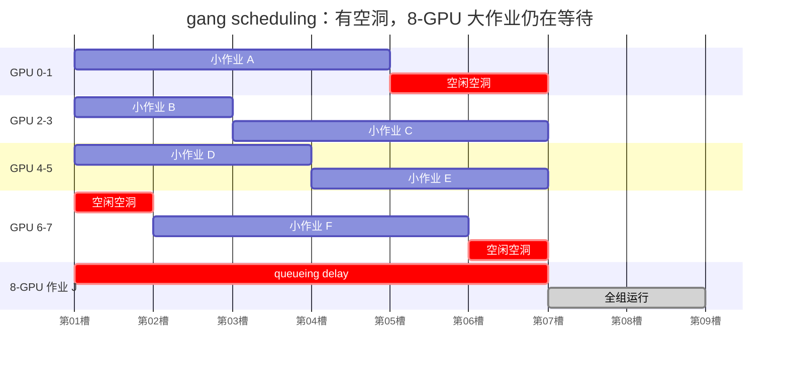
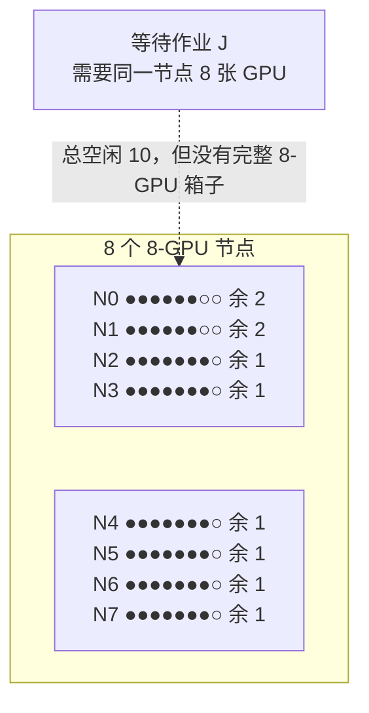
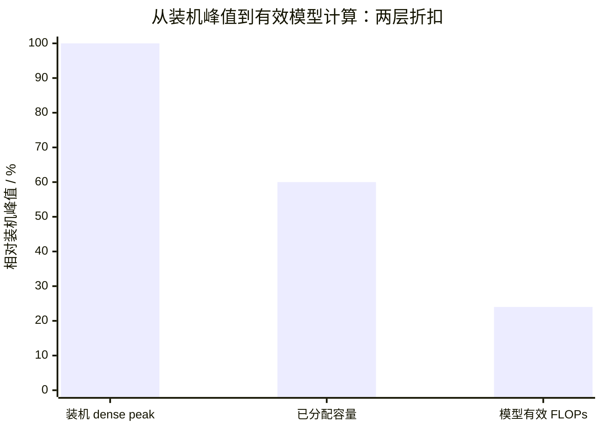

# L35 GPU集群调度：为什么空着卡，你还在排队

> [!abstract] 本课速览
> 读完你将能够：
> 1. 从同步集合通信解释训练作业为什么需要 **gang scheduling**，以及它怎样连锁造成队头阻塞、碎片和饥饿；
> 2. 认出 **Slurm** 与 **Kubernetes** 调度栈中的 partition、QoS、backfill、device plugin、Volcano 与 Kueue；
> 3. 把 GPU placement 看成带拓扑约束的 **bin packing**，手算 1,024 卡集群里 15.625% 的碎片空闲；
> 4. 区分 **allocation rate**、GPU utilization、MFU 与 goodput，并复算“60% × 40% = 24%”的准确含义；
> 5. 用 JCT、公平、makespan、拓扑与抢占代价解释为什么调度没有单一最优目标。
>
> 前置：[[L27 走进AI数据中心]] · 建议回看 [[L31 AI集群网络拓扑]] · 预计 55 分钟

## 论文里的这段话，你现在可能读不懂

> [!quote]
> “Distributed training jobs follow an **all-or-nothing** execution model: a **gang scheduler** must place every worker before useful progress begins. A **topology-aware placement** policy may wait for a compact allocation rather than accept fragmented GPUs, increasing **queueing delay** while reducing communication time. Under multi-tenant **quota**, the scheduler may **backfill** short jobs or **preempt** low-priority work, but high allocation alone does not imply high **goodput** or short **JCT**.”（综合改写自 Tiresias、Philly trace、Pollux 与批调度器的典型表述）[^tiresias] [^philly] [^pollux]

这三句把本课最难的矛盾压在一起：现在有空卡，不等于凑得出一组能共同开工、位置又合适的卡；把卡全发出去，也不等于 GPU 正在产生有效模型进度。调度器不是简单地“找空位”，而是在时间、空间、拓扑和多租户规则之间不断做取舍。

## 一、一个作业为何绑住一群 GPU

### 1.1 调度不是单个 Pod 找一台机器

**job scheduler**（作业调度器）接收待运行作业和资源需求，根据集群状态与策略决定三件事：

1. **何时运行**：现在启动、继续排队，还是抢占别人；
2. **给多少资源**：满足固定规模，还是让弹性作业 grow/shrink；
3. **放在哪里**：选择哪些 GPU、节点、NVLink domain、leaf/rail 和故障域。

第二、三件事常统称资源 allocation/placement。传统独立批任务即使只启动一部分 task，也可能先做出一些结果；同步分布式训练则常有更强的整体约束。每个 rank 要在相同 step 参加 all-reduce 等 collective：缺一个 rank，其他 ranks 通常只能等 barrier，不能把 512 卡作业当成 511 个有用的单卡任务。

这就是 **gang scheduling**（成组调度）：一组相互依赖的 workers 达到最低并发规模后才一起运行。固定规模同步训练常采用最严格的 **all-or-nothing**（全有或全无）语义——512 卡要么全部到位，要么不占卡启动。它避免“先启动 300 个 workers，让它们拿着 GPU 等另外 212 个”的死锁式浪费，却把启动门槛抬得很高。

> [!tip] 把 gang 想成八人赛艇
> 空出七个座位没有用；少一名桨手，其他七人不是少划 $1/8$，而是整条船不能按既定节奏出发。弹性训练可以换船或改编队，但那需要训练 runtime、batch size 与容错机制共同配合，不是调度器凭空把固定作业改成弹性作业。

### 1.2 排队时间怎样进入 JCT

**queueing delay**（排队时延）是作业提交到真正开始运行之间的墙钟时间。**JCT (job completion time)**（作业完成时间）则从提交一直量到完成：

$$
T_{JCT}=T_{queue}+T_{run}+T_{recovery/restart}.
$$

有些论文只研究 $T_{queue}$，有些把执行期中的暂停、迁移、抢占和故障恢复都算进 JCT；读图前必须核对起止点。**makespan**（批次总完工时间）是从一批作业开始被考虑，到其中最后一个作业完成的时间。平均 JCT 短，不保证最后那个巨型作业不挨饿；makespan 短，也不保证交互式小实验响应快。

gang 约束会触发三连锁：

- **队头阻塞**：队首大作业凑不齐卡；若策略严格按序，后面能运行的小作业也可能被挡住；
- **fragmentation**：空卡散在不合适的节点或 topology domains，空闲总量够、可用形状却不够；
- **starvation**（饥饿）：小作业不断插空或高优先级作业不断到达，使大作业长期等不到完整窗口。

下面把 8 张 GPU 两两画成四条资源 lane。小作业在不同时间占住不同 lane；每天都能看到空洞，但直到第 7 个时间槽才第一次同时空出 8 张卡，大作业才能开工。

如果调度器允许 **backfill**，它会让某些小作业利用这些空洞；但若没有给大作业保留未来启动窗口，填洞也可能把“第 7 槽开工”一再推迟。利用率和公平性从这里第一次正面冲突。

## 二、Slurm 与 Kubernetes：两种血统，同一块 GPU 蛋糕

### 2.1 Slurm：先有批作业与资源队列

**Slurm** 是 HPC/批处理语境中常见的 workload manager。对初读论文，先认四个词：

- **partition**（分区/队列）：一组节点及其作业入口和限制；它不是网络 partition，也不一定是物理上完全隔离的一批机器；
- **QoS (Quality of Service)**（服务质量策略）：可承载优先级、资源/时长限制、抢占关系等策略；名字叫 QoS，不等于推理服务的 latency SLO；
- **reservation**（预留）：把指定资源和时间窗留给用户、账户或特殊作业；
- **backfill**（回填）：在不推迟更高优先级作业预计启动时间的前提下，让较低优先级作业提前使用空洞。有效 backfill 依赖相对可信的 time limit，否则调度器不知道小作业能否及时退出。[^slurm]

Slurm 的思想很像机场时刻表：队首航班拿到未来跑道窗口，短航班可以趁窗口前起降，但不能占到约定时刻。reservation 保护启动承诺，backfill 回收窗口内的闲置；两者都要付预测误差和规划复杂度。

### 2.2 Kubernetes：先调 Pod，再补齐批作业语义

**Kubernetes** 的原生调度单位是 Pod。**device plugin**（设备插件）让 vendor 在节点上发现并上报 GPU 等设备，Pod 再以 `nvidia.com/gpu` 一类 extended resource 请求整数个设备；基础 device-plugin 资源不能直接 overcommit。默认 kube-scheduler 的一次 scheduling cycle 为一个 Pod 选择节点，这与“整组 workers 同时可运行”的语义不是一回事。[^kubernetes]

AI/HPC 批作业通常在 Kubernetes 之上补一层：

- **Volcano** 通过 PodGroup/Job 的 `minMember` 或 `minAvailable` 表达 gang 门槛；资源不足以满足最小成员数时，不让一部分 Pods 先占住资源；
- **Kueue** 更偏 queueing/admission：先为一个 Workload 的全部 Pod sets 一次性保留 quota，再解除 suspend 交给底层调度；其 all-or-nothing 还可结合 topology assignment 与“未按时全部 Ready 就释放 quota、重新排队”的机制。[^volcano] [^kueue]

截至 2026 年，把两者简单说成“Kubernetes 自带 gang scheduling”并不准确。更准确的层次是：device plugin 暴露设备，Kubernetes 完成 Pod placement，Volcano/Kueue 等项目提供面向批作业的 group、queue、quota 与 admission 语义；具体部署可能组合其中一部分。

| 维度 | Slurm 语境 | Kubernetes 批调度语境 |
|---|---|---|
| 基本提交对象 | batch job / job step | Pod、Job、operator 定义的训练 workload |
| GPU 暴露 | GRES/TRES 等资源模型 | vendor device plugin / extended resource |
| 队列与策略 | partition、account、QoS、reservation | ClusterQueue/LocalQueue、priority、admission policy 等 |
| gang 补法 | 批作业本就按资源集合启动；具体插件/配置另看 | Volcano PodGroup、Kueue Workload admission 等补齐 group 语义 |
| 共同难题 | 碎片、拓扑、配额、公平、抢占、预测运行时间 | 同左；还多一层 controller/operator 与 Pod readiness 协同 |

## 三、碎片：总数够，形状不对

### 3.1 调度即带约束的 bin packing

**fragmentation**（碎片）在 [[L21 GPU内存体系]] 中指“空闲显存总量够，但没有足够连续块”；在集群调度里则指“空闲 GPU 总量够，但分布位置、类型或时间窗口不能满足一个作业”。两者的共同结构都是：==总量约束满足，形状约束失败。==

**bin packing**（装箱）把节点看作箱子、GPU 作业看作不同大小的物品，希望用尽量少的箱子装下它们。真实调度比教科书装箱更难，因为它还有：

- 多维资源：GPU、CPU、DRAM、NIC、local NVMe；
- 类型约束：H100 与其他 GPU 不可随意混成一个同步 job；
- 拓扑约束：同节点、同 NVLink domain、同 leaf/rail；
- 时间约束：运行时长未知、reservation、preemption；
- 故障与隔离：不能把所有副本塞进同一 failure domain。

### 3.2 算一算（一）：1,024 卡里空着 160 张，8 卡作业仍启动不了

> [!example] 一个可手算的碎片快照
> 先看 8 个 8-GPU 节点。前两个节点分别放了 $4+2$ 卡作业，后六个分别放了 $4+2+1$ 卡作业，所以已分配量为
> $$
> G_{alloc}=2\times6+6\times7=54.
> $$
> 空闲量为
> $$
> G_{idle}=8\times8-54=10,
> $$
> 空闲比例为
> $$
> f_{idle}=\frac{10}{64}=15.625\%.
> $$
> 空闲总量 $10\ge8$，但每节点只剩 1–2 张卡。若新来的 8 卡作业要求单节点，它仍然无法启动。

图中，● 表示已分配 GPU，○ 表示空闲 GPU：

把这个 8 节点图样复制 16 组，就得到 $128\times8=1{,}024$ 卡集群：

$$
G_{idle}=16\times10=160,
\qquad
f_{idle}=160/1024=15.625\%.
$$

这说明 10%–25% 量级的碎片损耗在组合上完全可能，且不需要总空闲低于作业需求。==但这不是由“1/2/4/8 卡作业随机到达”唯一推导出的稳态常数。==稳态碎片率还取决于各尺寸的到达率、运行时长分布、节点/拓扑约束、放置算法、backfill 与是否允许迁移。没有这些条件，诚实的做法是给可复算快照，或在 [[L67 测量仿真与评测]] 用 trace-driven simulation 报分布，而不是凭“随机”二字编一个百分比。

### 3.3 topology-aware placement：空卡也有远近

**topology-aware placement**（拓扑感知放置）在选 GPU 时显式考虑连接层级。对一个同步训练 job，常见偏好顺序是：先压进较少节点/NVLink domains，再尽量落在同 leaf 或同 rail，最后才跨更高层 spine。[[L31 AI集群网络拓扑]] 已说明：同 rail 的常见通信可能只经过一个 rail switch；跨 rail/spine 的路径可能经过 leaf–spine–leaf 三个 switching stages，并与其他 jobs 争用上层链路。

于是调度器面对一个很不舒服的选择：

- **立即启动但放得散**：queueing delay 小，之后每个 step 的 collective 可能变慢；
- **多等一会儿凑紧凑 placement**：queueing delay 变大，run time 可能缩短；
- **先散放、再迁移/重排**：两边都想要，但要支付 checkpoint、process-group 重建和迁移风险。

这里有个很实用的判据：不要只优化启动时间，要比较

$$
T_{JCT}=T_{queue}+T_{run}(\text{placement})+T_{migration/restart}.
$$

### 3.4 算一算（二）：一次错误放置要交多少固定时延税

先预告 [[L37 通信算法与代价模型]]：对 $p$ 个 ranks 的 ring all-reduce，reduce-scatter 与 all-gather 共约 $2(p-1)$ 个串行通信轮次。只看固定时延项，可写为

$$
T_{\alpha}\approx2(p-1)\alpha.
$$

拓扑不会改变 ring 的逻辑轮数，却会改变每轮端到端固定开销。令同 leaf 放置的固定项为 $\alpha_{leaf}$，跨上层网络后的固定项为 $\alpha_{cross}$，则

$$
\Delta T_{\alpha}
=2(p-1)(\alpha_{cross}-\alpha_{leaf}).
$$

对 $p=8$：

$$
\Delta T_{\alpha}=14\Delta\alpha,
\qquad
\Delta\alpha=\alpha_{cross}-\alpha_{leaf}.
$$

按 [[03 约定与符号]]，集合通信 $\alpha$ 统一按约 $10\ \mu\text{s}$ 量级估算。这里不编造某台交换机的逐跳时延，而做一个敏感性问题：==若跨层 placement 仅让每轮端到端固定项多一个 $10\ \mu\text{s}$ 量级==，那么一次 8-rank ring all-reduce 就多

$$
14\times10\ \mu\text{s}=140\ \mu\text{s}=0.14\ \text{ms}.
$$

这不是说“经过三层必然慢 10 µs”，也没计算消息字节对应的 $\beta$ 项、拥塞和路由碰撞；它只告诉你敏感度：固定项每增加 $1\ \mu\text{s}$，8-rank ring 就增加 $14\ \mu\text{s}$。训练循环反复调用 collective，placement 的小税会被每一步重复征收。

## 四、多租户蛋糕：配额、公平、抢占与填洞

### 4.1 quota 不是“这一刻必须占满”

**quota**（配额）定义用户、团队或队列可申请/占用资源的边界，可能是硬上限、可借用份额或时间窗口内的用量政策。它把组织规则变成 scheduler constraint：没有 quota，活跃团队可能吃光集群；quota 太刚，又可能出现某团队队列爆满、另一团队保留份额闲置。

**preemption**（抢占）让更高优先级工作收回已分给低优先级工作的资源。抢占不是免费的 `kill -9`：被抢作业若能先写 checkpoint、稍后 restore，浪费的是自上次 checkpoint 以来的进度和恢复时间；若支持弹性 shrink，可能只交出部分 GPU；若二者都没有，抢占就可能变成重跑。它与 [[L34 存储与数据供给]] 的 checkpoint 带宽、[[L53 大规模训练可靠性]] 的恢复时间以及 [[L66 弹性算力与资源效率]] 的 spot/低优先级资源直接相连。

> [!warning] 抢占策略至少要写清四件事
> 谁能抢谁、触发条件是什么、被抢者怎样保存/恢复、抢占开销记在谁的 JCT 里。只报告“高优先级 job 更快了”，却不统计被抢者丢失的 GPU-hours，是把成本藏到了图外。

### 4.2 DRF：公平的是主导份额，不只是 GPU 张数

**DRF (Dominant Resource Fairness)**（主导资源公平）把多资源下的 max-min fairness 建立在“用户占用比例最高的那类资源”上。对用户 $i$，若各类资源份额是 $s_{i,r}$，其 dominant share 为

$$
d_i=\max_r s_{i,r}.
$$

例如集群有 100 GPU、200 CPU cores：用户 A 已拿 40 GPU、20 CPU，份额为 $(40\%,10\%)$，dominant share 是 40%；用户 B 已拿 20 GPU、100 CPU，份额为 $(20\%,50\%)$，dominant share 是 50%。在一个简化的 DRF 分配步骤里，A 的 dominant share 更小，应优先得到下一份可行资源，直到各用户的 dominant shares 更接近。[^drf]

这不意味着原版 DRF 已经解决 GPU 拓扑、异构性能、gang 和训练 goodput；它提供的是“多维公平”的基本词汇。GPU scheduler 还要决定：一张 H100 和一张较慢 GPU 怎样归一化？同样 8 张卡、一个 job 跨 spine 另一个同节点，资源份额相同但进度是否公平？这些正是后续研究空间。

### 4.3 backfill 为什么既救利用率，也可能制造饥饿

backfill 的安全版本会保护高优先级大作业的预计启动时刻，只让能在此前结束的小作业填洞。若小作业时长申报失真、可超时运行，或者根本没有给大作业做 reservation，那么“填一个小洞”会不断把大作业需要的全空窗口推迟，形成 starvation。

常见目标之间没有免费午餐：

| 目标 | 看什么 | 容易牺牲什么 |
|---|---|---|
| 高 allocation rate | 尽量把 GPU 分出去 | 可能过度 backfill，使大 gang job 久等；也可能把 job 放散 |
| 低平均 JCT | 让更多作业尽快完成 | 短作业优先可能伤害大作业尾部与 fairness |
| 低 p99 JCT / 防 starvation | 给老作业 aging、reservation 或最小服务 | 可能保留空洞、降低短期 allocation |
| 低 makespan | 让整批 workload 尽早全部结束 | 可能不照顾交互式实验的响应时间 |
| topology locality | 等紧凑节点/leaf/rail | queueing delay 可能变长 |
| quota / DRF fairness | 控制团队或主导资源份额 | 可能不是瞬时 throughput 最大的 allocation |
| 高 goodput | 把资源给“有效进度/资源”更高的配置 | 需要 job/runtime 暴露性能与统计效率，模型误差也会进决策 |

## 五、集群“利用率”到底是哪一层

系统论文里的 utilization 是高危词。至少拆开四层：

1. **allocation rate**：安装 GPU 中有多少已经分给作业，$A=G_{allocated}/G_{total}$；
2. **GPU utilization**：已分配 GPU 有多少采样时间至少有 kernel 在执行；它不说明 Tensor Core 是否跑满；
3. **MFU**：模型有效 FLOPs 相对已分配 GPU dense peak FLOPS 的比例，定义回看 [[L22 算力度量与MFU]]；
4. **goodput**：满足训练正确性/收敛效率或服务约束的有效进度率；Pollux 把 system throughput 与 statistical efficiency 一起纳入调度。

### 算一算（三）：60% 分配率 × 40% MFU = 24%，究竟是什么

设整座集群的 dense peak 为 $P_{cluster}$，分配率 $A=60\%$；再设对“已经分配的 GPU 时间”求得的平均 MFU 为 $M=40\%$。则已分配卡的 dense peak 是

$$
P_{allocated}=A P_{cluster}=0.6P_{cluster},
$$

模型有效 FLOPS 为

$$
P_{model}=M P_{allocated}
=0.4\times0.6P_{cluster}
=0.24P_{cluster}.
$$

所以 24% 是“相对全体安装 GPU dense peak 的模型有效计算产出比例”。它不是 `nvidia-smi` GPU utilization，也不自动等于训练 goodput：如果大 batch 改变了 statistical efficiency，或者反复重算/失败恢复，MFU 看起来不错，有效到达训练目标的进度仍可能更低。

这张图也解释了“集群显示 60% 利用率，你却排队三天”的可能来源：仪表盘的 60% 也许只是 allocation rate；剩余 40% 中一部分正在维护/故障，一部分被 quota 隔离，一部分散成 topology fragments，一部分不匹配你的 GPU 类型或 512 卡 gang 形状。==全局有空，不等于你的可行集合非空。==

## 六、四篇调度论文，四次把边界往外推

下面不是完整 related work，而是一张以后写综述时能继续长枝叶的种子图。每篇只抓“它把哪个变量纳入 scheduler”。

| 系统 | 正式发表 | 新纳入的观察/控制变量 | 你读论文时抓什么 |
|---|---|---|---|
| Gandiva | OSDI 2018 | 利用 mini-batch iteration 的可预测性做 introspection、time-slicing、migration 与 grow/shrink | scheduler 不只静态分卡，还能观察执行并重排，缓解 job-resource fit 与碎片。[^gandiva] |
| Tiresias | NSDI 2019 | 在 job duration 难预测时，用 attained service 等信息调优先级，并讨论何时放松 consolidation | all-or-nothing、未知时长、JCT 与 placement 约束怎样共同定义问题。[^tiresias] |
| Pollux | OSDI 2021 Best Paper | job 侧动态调 batch size/learning rate，cluster 侧动态调 GPU allocation，以 goodput 协同优化 | “多给卡”会同时改变 system throughput 与 statistical efficiency，资源和训练配置必须共适应。[^pollux] |
| Sia | SOSP 2023 | 把 GPU 异构类型、弹性资源自适应、throughput model 与 hybrid-parallel job 一起纳入分配 | 不同 GPU 的“1 张卡”不能按同质 token 计价，配置与卡型匹配直接影响 goodput/JCT。[^sia] |

这条谱系与网络研究的接口很直接：placement 决定 collective 穿过哪些 links，拥塞又改变 throughput model；preemption/checkpoint 决定恢复 traffic；故障让原本紧凑的 gang placement 破洞。于是 scheduler 的优化变量会从“GPU 数量”扩展成 GPU 类型、topology domain、带宽份额、checkpoint 状态与 failure risk——这正落在“分布式训练的网络与系统优化”和“AI 系统生存性”两条主线上。

## 七、把一张 GPU 再切开：MIG、MPS 与 time-slicing

大训练常以整卡乃至整节点为单位；小模型推理、开发测试和强扩展后每进程工作量很小时，整卡独占可能浪费。三种共享技术先认清边界：

| 技术 | 直觉 | 隔离与资源形状 | 调度含义 |
|---|---|---|---|
| **MIG (Multi-Instance GPU)** | 硬切 | 把支持的 GPU 划为预定义小实例，提供硬件层 memory/fault isolation | scheduler 分的是 MIG profile/instance；硬切更可预测，但 profile 组合也会产生新碎片。 |
| **MPS (Multi-Process Service)** | 软共享 | 多个 CUDA processes 经 MPS 协同并发提交，可减少 context switching、让小 kernels 重叠；不是 MIG 那种硬件故障隔离 | 适合单进程喂不满 GPU 的合作型 workload；需额外管显存、active thread 份额与多租户风险。 |
| **time-slicing** | 分时轮转 | 多个进程/Pods 轮流使用同一 GPU；基础 time-slicing replica 没有 MIG 的 memory/fault isolation | 增加逻辑可分配份数，不保证申请两份就得到两倍 compute；尾时延与 noisy neighbor 更难控。 |

NVIDIA 官方文档明确区分：MIG 提供预定义实例及 memory/fault isolation；Kubernetes time-slicing 以共享换更多并发但不提供这些隔离；MPS 是让合作的多进程工作流并发利用 GPU 的 runtime service。[^sharing]

这些技术不会让物理算力变多，只会改变复用粒度。调度器还得回答：共享后的 quota 怎样计？MPS 客户端互相干扰时如何预测 JCT？MIG profile 剩余切片能否拼成新实例？推理 p99 是否允许 time-slicing？到 [[L61 推理服务框架与集群]] 和 [[L66 弹性算力与资源效率]]，这些问题会从“认名”升级为主角。

> [!warning] 三个常见误区
> 1. **“集群利用率高 = 管理得好。”** 高 allocation 可能伴随长队、差 topology、低 MFU 和频繁重算；必须同时报 queueing/JCT、有效产出和 fairness。
> 2. **“调度只是工程 glue。”** Pollux 把资源分配与训练动力学共同优化，Sia 把异构与混合并行纳入 goodput；问题定义、模型与算法都很“科研”。
> 3. **“抢占很残忍，所以不该用。”** 没有 checkpoint/弹性时确实浪费；配齐保存、恢复、aging 和补偿记账后，preemption 是把低优先级/碎片化资源转成有效产出的关键杠杆。

## 回到开头那段话

1. “Distributed training jobs follow an all-or-nothing execution model: a gang scheduler must place every worker before useful progress begins。”——同步 workers 要共同参加 collective，固定规模作业缺一个 rank 也不能推进；gang admission 避免部分 workers 占卡空等，却提高了完整资源窗口的门槛，并引出队头阻塞和 starvation。
2. “A topology-aware placement policy may wait for a compact allocation rather than accept fragmented GPUs, increasing queueing delay while reducing communication time。”——空卡散落时，总量可以够、单节点/NVLink domain/leaf/rail 的形状却不够；等待紧凑放置会增加 $T_{queue}$，立即散放则让 $T_{run}(placement)$ 变长，正确目标是完整 JCT 而非其中一项。
3. “Under multi-tenant quota, the scheduler may backfill short jobs or preempt low-priority work, but high allocation alone does not imply high goodput or short JCT。”——quota/DRF 管公平，reservation/backfill 填时间空洞，preemption 回收低优先级资源；它们都要统计被延迟或被抢作业的代价。60% allocation 与 40% MFU 相乘只有 24% 全集群模型有效峰值，离 goodput 和公平还差一层。

现在可以把整段压成一句话：==GPU 调度不是“哪里有空卡就放哪里”，而是在 gang 形状、拓扑距离、时间窗口和多租户规则下，寻找能让有效进度尽快且公平发生的资源组合。==

## 术语卡片

| 术语 | 中文 | 一句话解释 |
|---|---|---|
| job scheduler | 作业调度器 | 决定作业何时运行、获得多少资源以及放到哪些节点/GPU 的控制系统。 |
| gang scheduling | 成组调度 | 相关 workers 达到最低并发规模后才作为一组启动的调度语义。 |
| all-or-nothing | 全有或全无 | 固定规模作业的全部所需资源同时可用才启动，否则整体等待。 |
| queueing delay | 排队时延 | 从提交作业到真正开始执行之间的墙钟时间。 |
| JCT | 作业完成时间 | 作业从提交到完成的总时间，通常含排队、运行与暂停/恢复。 |
| makespan | 批次总完工时间 | 一批作业中从起点到最后一个作业完成的时间跨度。 |
| Slurm | Slurm 工作负载管理器 | HPC/批处理环境常用的资源与作业管理系统。 |
| partition | 分区/队列 | Slurm 中组织一组节点并承载准入、时限等策略的逻辑资源集合。 |
| QoS | 服务质量策略 | 在 Slurm 等系统中表达优先级、限制、用量与抢占关系的策略对象。 |
| reservation | 预留 | 为指定主体和时间窗保留资源、保护未来启动承诺的机制。 |
| backfill | 回填 | 不推迟受保护高优先级作业启动时间时，用较小作业填资源空洞。 |
| Kubernetes | Kubernetes 容器编排系统 | 以 Pod 为基本调度单位、通过扩展机制管理设备与批作业的编排平台。 |
| device plugin | 设备插件 | 向 kubelet 注册并上报 GPU 等 vendor-specific devices 的扩展机制。 |
| Volcano | Volcano 批调度系统 | 以 PodGroup/Job 等对象为 Kubernetes 补充 gang、queue 等批作业语义。 |
| Kueue | Kubernetes 队列控制器 | 在 workload admission 层按 quota、priority 与 topology 管理批作业排队。 |
| quota | 配额 | 限定或保障用户、团队、队列可使用资源份额的策略。 |
| preemption | 抢占 | 高优先级工作收回低优先级工作资源，并让后者暂停、缩容或重启。 |
| starvation | 饥饿 | 作业因持续被插队或缺少完整资源窗口而长期得不到服务。 |
| DRF | 主导资源公平 | 以用户各类资源份额中的最大值为 dominant share 的多资源公平方法。 |
| fragmentation | 碎片 | 空闲总量足够，但位置、类型、拓扑或时间形状不能满足作业。 |
| topology-aware placement | 拓扑感知放置 | 选 GPU 时显式考虑节点、NVLink domain、leaf、rail、spine 等连接层级。 |
| bin packing | 装箱 | 把不同资源需求的作业装入有限容量节点/域，并尽量减少浪费的问题抽象。 |
| allocation vs utilization | 分配率与利用率辨析 | “资源已分出去”与“资源正在产生多少有效工作”是不同层指标。 |
| goodput | 有效吞吐 | 同时考虑系统速度和约束/统计效率后，单位时间取得的有效进度。 |
| MIG | 多实例 GPU | 把支持的 GPU 硬件划分为带 memory/fault isolation 的预定义小实例。 |
| MPS | 多进程服务 | 让多个合作型 CUDA processes 并发共享 GPU 执行资源的 runtime service。 |
| time-slicing | 分时共享 | 让多个工作按时间片轮流使用同一物理 GPU 的复用方式。 |

## 自测

1. 为什么固定规模同步训练常需要 gang scheduling？它避免了什么浪费，又制造了哪三类连锁问题？
2. Slurm 的 partition、QoS、reservation 与 backfill 各解决什么问题？为什么 backfill 需要可信的 time limit？
3. Kubernetes device plugin 解决的是“看见/分配 GPU”还是“整组训练 workers 一起启动”？Volcano 与 Kueue 分别从哪一层补语义？
4. 复算 8 个 8-GPU 节点例子的空闲比例。复制为 1,024 卡后空闲多少卡？为什么 8 卡单节点作业仍不能运行？
5. 一个 8-rank ring all-reduce 中，若跨层 placement 让每轮固定项增加 $5\ \mu\text{s}$，只看 $\alpha$ 项，一次 collective 多花多少？
6. 若 allocation rate 为 75%，已分配 GPU 上平均 MFU 为 32%，模型有效 FLOPS 相对整座集群 dense peak 是多少？为什么这仍不等于 goodput？
7. DRF 为什么比“每人同样 GPU 张数”更适合多资源集群？preemption 又为什么必须和 checkpoint/弹性一起评估？
8. MIG、MPS 与 time-slicing 在隔离、共享粒度和适合 workload 上有什么不同？

> [!note]- 参考答案
> 1. 同步 workers 必须共同参加 barrier/collective，少一个 rank 其他 ranks 通常也不能推进；all-or-nothing admission 避免部分 workers 占卡空等。代价是队头阻塞、资源/拓扑碎片和 starvation。
> 2. partition 组织节点与队列入口，QoS 表达优先级/限制/抢占策略，reservation 保护未来资源时间窗，backfill 用不会推迟该窗口的小作业填洞。若时长上界不可信，小作业可能越过窗口，反而延迟队首作业。
> 3. device plugin 让 kubelet 发现并上报 GPU、让 Pod 请求设备，不自动提供 group admission。Volcano 用 PodGroup/Job 的最小成员数做 gang scheduling；Kueue 先在 workload admission/queue 层为全部 pod sets 保留 quota，再交给底层 scheduler。
> 4. 已分配 $2\times6+6\times7=54$，空闲 $64-54=10$，比例 $10/64=15.625\%$；复制 16 组后空闲 $160$ 卡。每节点只余 1–2 卡，没有一个 8 卡连续节点，所以单节点 8 卡 job 的可行 placement 集合仍为空。
> 5. ring 两阶段共有 $2(p-1)=14$ 个串行轮次，所以 $\Delta T_{\alpha}=14\times5\ \mu\text{s}=70\ \mu\text{s}$。这不含 $\beta$、拥塞与实现开销。
> 6. $0.75\times0.32=0.24$，即整座集群 dense peak 的 24%。goodput 还可能扣除 statistical inefficiency、无效重算、失败恢复或不满足 SLO 的工作，不能只由 MFU 决定。
> 7. 用户可能分别受 GPU、CPU、DRAM 或网络约束；DRF 比较各用户的 dominant share，能表达多维公平。同样，preemption 的收益必须减去 checkpoint pause、丢失进度、restore 和重建通信组等成本。
> 8. MIG 是预定义硬件切片，隔离和可预测性较强；MPS 让合作型 CUDA 多进程并发共享执行资源，隔离不等同 MIG；time-slicing 让工作轮流使用 GPU，能提高逻辑并发，但基础方案没有 MIG 的 memory/fault isolation，noisy-neighbor 与尾时延更难控制。

## 延伸阅读

- Wencong Xiao 等，《[Gandiva: Introspective Cluster Scheduling for Deep Learning](https://www.usenix.org/conference/osdi18/presentation/xiao)》（USENIX OSDI 2018）：看 introspection、time-slicing、migration 与 grow/shrink 如何把静态 placement 变成运行时反馈控制。
- Aurick Qiao 等，《[Pollux: Co-adaptive Cluster Scheduling for Goodput-Optimized Deep Learning](https://www.usenix.org/conference/osdi21/presentation/qiao)》（USENIX OSDI 2021，Best Paper）：重点读 goodput 定义，以及 job-level batch/learning-rate adaptation 与 cluster-level allocation 怎样共适应。
- Myeongjae Jeon 等，《[Analysis of Large-Scale Multi-Tenant GPU Clusters for DNN Training Workloads](https://www.usenix.org/conference/atc19/presentation/jeon)》（USENIX ATC 2019）：结合 [Philly traces](https://github.com/msr-fiddle/philly-traces) 看 gang、locality、queueing 与 failure 的生产 workload 证据；[[L67 测量仿真与评测]] 会复用 trace-driven 方法。
- Juncheng Gu 等，《[Tiresias: A GPU Cluster Manager for Distributed Deep Learning](https://www.usenix.org/conference/nsdi19/presentation/gu)》（USENIX NSDI 2019）：看未知 job duration 下怎样用 attained service 优化平均 JCT，以及 consolidation constraint 何时可以放松。
- Suhas Jayaram Subramanya 等，《[Sia: Heterogeneity-aware, goodput-optimized ML-cluster scheduling](https://doi.org/10.1145/3600006.3613175)》（ACM SOSP 2023）：从异构卡型、elastic scaling 和 hybrid-parallel job 理解“GPU 数量”为什么不是充分的 allocation 描述。
- Ali Ghodsi 等，《[Dominant Resource Fairness: Fair Allocation of Multiple Resource Types](https://www.usenix.org/conference/nsdi11/dominant-resource-fairness-fair-allocation-multiple-resource-types)》（USENIX NSDI 2011）：先掌握 dominant share，再思考 GPU 类型、网络 locality 与 goodput 怎样迫使公平模型继续扩展。

[^tiresias]: Juncheng Gu 等，《[Tiresias: A GPU Cluster Manager for Distributed Deep Learning](https://www.usenix.org/conference/nsdi19/presentation/gu)》（USENIX NSDI 2019）：论文明确把 unpredictable duration、all-or-nothing execution model、queueing delay、JCT 与 consolidated placement 作为 GPU cluster scheduling 的核心问题。
[^philly]: Myeongjae Jeon 等，《[Analysis of Large-Scale Multi-Tenant GPU Clusters for DNN Training Workloads](https://www.usenix.org/conference/atc19/presentation/jeon)》（USENIX ATC 2019）：基于 Microsoft 多租户 GPU 集群的两个月 trace，分析 gang scheduling/locality 对 queuing 与 GPU utilization 的影响；公开 trace 位于 `msr-fiddle/philly-traces`。
[^pollux]: Aurick Qiao 等，《[Pollux: Co-adaptive Cluster Scheduling for Goodput-Optimized Deep Learning](https://www.usenix.org/conference/osdi21/presentation/qiao)》（USENIX OSDI 2021，Best Paper）：将 system throughput 与 statistical efficiency 组合为 goodput，并在 job/cluster 两层共同调整训练配置和资源。
[^slurm]: SchedMD，《[Slurm Scheduling Configuration Guide](https://slurm.schedmd.com/sched_config.html)》《[Quality of Service](https://slurm.schedmd.com/qos.html)》与《[Advanced Resource Reservation Guide](https://slurm.schedmd.com/reservations.html)》：backfill 只启动不影响高优先级预计启动时间的作业，依赖 time limits；partition、QoS 与 reservation 的具体交互以部署配置为准。
[^kubernetes]: Kubernetes，《[Device Plugins](https://kubernetes.io/docs/concepts/extend-kubernetes/compute-storage-net/device-plugins/)》《[Schedule GPUs](https://kubernetes.io/docs/tasks/manage-gpus/scheduling-gpus/)》与《[Scheduling Framework](https://kubernetes.io/docs/concepts/scheduling-eviction/scheduling-framework/)》：device plugin 向 kubelet 注册 vendor resource，GPU extended resource 按整数请求，默认一次 scheduling cycle 为一个 Pod 选节点。
[^volcano]: Volcano，《[Gang](https://volcano.sh/docs/scheduler/plugins/gang/)》与《[PodGroup](https://volcano.sh/docs/concepts/podgroup/)》：以 `minAvailable`/`minMember` 表达一组 tasks 的最低可运行规模，资源不足时不做部分调度。
[^kueue]: Kueue，《[All-or-nothing Scheduling](https://kueue.sigs.k8s.io/docs/concepts/all_or_nothing/)》：Workload 的 pod sets 在 admission 时共同预留 quota，可结合 topology assignment 与 `waitForPodsReady` 超时释放/重排；实际原子性仍受底层 scheduler 与基础设施约束。
[^drf]: Ali Ghodsi 等，《[Dominant Resource Fairness: Fair Allocation of Multiple Resource Types](https://www.usenix.org/conference/nsdi11/dominant-resource-fairness-fair-allocation-multiple-resource-types)》（USENIX NSDI 2011）：DRF 把 max-min fairness 推广到多资源，核心是比较每个用户的 dominant share。
[^gandiva]: Wencong Xiao 等，《[Gandiva: Introspective Cluster Scheduling for Deep Learning](https://www.usenix.org/conference/osdi18/presentation/xiao)》（USENIX OSDI 2018）：利用 training iterations 的可预测性做 introspection，并以 time-slicing、migration、packing/grow-shrink 改善 job-resource fit 与 cluster efficiency。
[^sia]: Suhas Jayaram Subramanya 等，《[Sia: Heterogeneity-aware, goodput-optimized ML-cluster scheduling](https://doi.org/10.1145/3600006.3613175)》（ACM SOSP 2023）：把异构 GPU 类型、resource-adaptive jobs、throughput model 与 hybrid-parallel elastic scaling 放进同一调度问题。
[^sharing]: NVIDIA，《[Time-Slicing GPUs in Kubernetes](https://docs.nvidia.com/datacenter/cloud-native/gpu-operator/24.9/gpu-sharing.html)》与《[Multi-Process Service](https://docs.nvidia.com/deploy/mps/latest/index.html)》：前者对比 MIG 的硬件 memory/fault isolation 与 time-slicing 的共享边界，后者说明 MPS 的 client/server 架构及多进程并发目标。

---
上一课：[[L34 存储与数据供给]] ← · → 下一课：[[L36 集合通信原语]]
