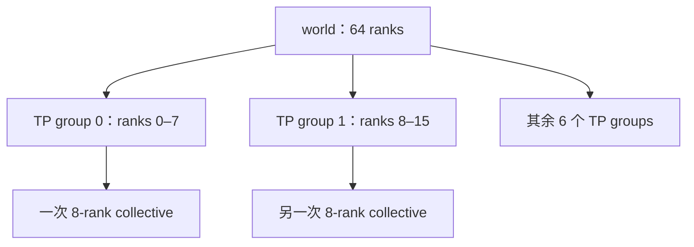
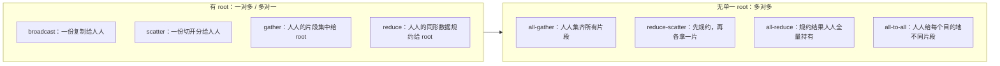
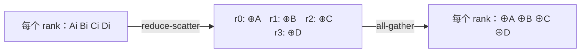

# L36 集合通信原语：四个 rank 怎样像一个系统说话

> [!abstract] 本课速览
> 读完你将能够：
> 1. 用 rank、world size 与 process group 描述一次通信的参与者；
> 2. 只看通信前后的数据布局，辨认 broadcast、scatter、gather、reduce、all-gather、reduce-scatter、all-reduce 与 all-to-all；
> 3. 画出并解释 `all-reduce = reduce-scatter + all-gather`；
> 4. 把 DP、ZeRO/FSDP、TP、PP、EP、CP 映射到正确的通信原语；
> 5. 手算 8 个 rank 同步 16 GB 数据时的每-rank 通信量与 400 Gb/s 理想线速时间。
>
> 前置：[[L01 全景图]] · 建议回看 [[L25 节点内互联]] · 预计 55 分钟

## 论文里的这段话，你现在可能读不懂

> [!quote]
> “In an **SPMD** data-parallel job, all **ranks** in a **process group** participate in an **all-reduce** to sum gradients. Fully sharded training instead composes **reduce-scatter** with **all-gather**, whereas expert parallelism routes personalized token payloads through **all-to-all**. Pipeline stages communicate **point-to-point** with **send/recv**, rather than invoking a world-wide collective.”（综合改写自分布式训练系统的典型表述）

这三句其实是一张“并行策略—通信原语”压缩表。现在最容易混淆的是：all-gather 和 all-reduce 都让每个人拿到全量，为什么不是一回事？all-to-all 也让每个人收很多数据，为什么又不同？学完本课，你应该能从输入、输出和参与范围逐句还原它。

## 一、先把通信的人数和范围说清楚

### 1.1 primitive 是语义合同，不是线路图

**collective communication**（集合通信）是：一个已知进程集合共同参加一次数据移动、规约或同步操作。**primitive**（原语）则是上层程序可以直接调用的基本语义单元，例如“把 root 的 tensor 发给组内所有人”或“把所有人的梯度求和后交给所有人”。

原语只承诺“通信后谁应当拥有什么”，通常不规定底层必须走 ring、tree 还是分层算法。就像你对快递下单时写明“这四件货分别送给四个人”，但不替快递公司规定每辆车的路线。路线与时间模型留到 [[L37 通信算法与代价模型]]；本课先把订单看懂。

如果没有集合通信库，程序员也能用很多次 send/recv 拼出相同结果，但要自己处理配对、顺序、分块、死锁和拓扑。集合通信把反复出现的全组模式变成可优化的统一接口；NCCL 的 API 也明确沿用了 MPI 的 collective 血统。[^nccl]

### 1.2 rank、world size 与 group

分布式程序常用 **SPMD (Single Program, Multiple Data)**（单程序多数据）模型：每个进程运行同一份程序，再按自己的编号处理不同数据。注意，“同一份程序”不等于每行都做同一件事；代码可以写 `if rank == 0`，让 0 号进程额外加载配置或保存结果。

- **rank**（进程编号）是在某个通信组内的唯一整数，通常从 0 到 $p-1$；它是逻辑身份，不是 GPU 型号，也不保证等于物理 GPU 编号。
- **world size**（全局进程数）通常指默认全局组里的进程总数。本课用 $p$ 表示参与当前 collective 的 rank 数；子组的大小可能小于 world size。
- **communicator**（通信域）是 MPI 血统的说法：它界定一组成员、成员顺序和一次通信的“名字空间”。
- **process group**（进程组）是 PyTorch 等框架里的常见说法：collective 只要求这个 group 的成员参加，不一定动用整个 world。一个全局 rank 在不同子组里还可能拥有不同的 group rank。[^mpi] [^pytorch]

例如，一个 64-GPU 作业可以有 world size 64，同时切出 8 个各含 8 个 rank 的 TP group。一次 TP all-reduce 只在其中一个 8-rank group 内发生；若误以为任何 all-reduce 都跨 64 张卡，通信量和拓扑分析从第一步就错了。

> [!tip] 先问“谁参加”，再问“传多少”
> 论文写 “an all-reduce over the tensor-parallel group” 时，$p$ 是 TP degree；写 “over the data-parallel group” 时，$p$ 是 DP degree。原语名字相同，参与范围可能完全不同。

### 1.3 collective 与 point-to-point

**point-to-point (P2P)**（点到点通信）指定一个发送方和一个接收方；最典型接口是 **send/recv**（发送 / 接收）。发送方的 send 必须与接收方兼容的 recv 配对。流水线并行里，stage 2 只需把 activation 发给 stage 3，并不需要全组都拿一份，这就是 P2P 的自然场景。

collective 则由整个 communicator/process group 共同完成。所有成员必须以兼容的顺序和参数参加；某个 rank 漏调、调用了不同原语，或 tensor 大小不匹配，其他 rank 可能一直等待。它很像四人抬桌子：P2P 是两个人递箱子；collective 是约好四个人共同完成一套动作，少一个就无法按合同收尾。

**barrier**（屏障同步）是最纯粹的 collective：每个 rank 到达 barrier 后等待，直到组内所有 rank 都到达，再一起继续。它主要同步控制进度，不搬运本课的 $n$ 字节业务 tensor；“等齐了”也不代表 GPU、CPU 或网络的所有异步工作天然都已完成，具体完成语义要看框架 API。

## 二、八大原语：只盯住通信前后

下面统一用 4 个 rank。`A/B/C/D` 是数据块；$A_i$ 表示 rank $i$ 对逻辑块 $A$ 的一份贡献；$\oplus A=A_0\oplus A_1\oplus A_2\oplus A_3$。`·` 表示该位置没有有效输出。表中的“通信后”描述 collective 的输出 buffer；除非显式使用后文介绍的原地模式，不能据此断言输入 buffer 被销毁。

### 2.1 一对多 / 多对一：broadcast、scatter、gather、reduce

| 原语 | 通信前（4 rank） | 通信后（collective 输出） |
|---|---|---|
| **broadcast** | `r0:[A B C D]`；`r1–r3:[·]` | `r0–r3:[A B C D]` |
| **scatter** | `r0:[A B C D]`；`r1–r3:[·]` | `r0:[A] r1:[B] r2:[C] r3:[D]` |
| **gather** | `r0:[A] r1:[B] r2:[C] r3:[D]` | `r0:[A B C D]`；`r1–r3:[·]` |
| **reduce** | `ri:[Ai Bi Ci Di]`，$i=0,1,2,3$ | `r0:[⊕A ⊕B ⊕C ⊕D]`；`r1–r3:[·]` |

1. **broadcast**（广播）：一个 root 已有完整数据，通信后组内每个 rank 都得到相同副本。常见用途是从 rank 0 分发初始化参数或控制信息。
2. **scatter**（分散）：root 持有按目的 rank 排好的多个片段，通信后每个 rank 只拿属于自己的那片。关键是“切开再分”，不是复制全量。
3. **gather**（汇集）：scatter 的方向反过来；每个 rank 贡献一片，只有 root 得到按 rank 顺序拼接的全量。它不做求和。
4. **reduce**（规约到 root）：每个 rank 贡献形状相同的数据，按逐元素 **reduction operator**（规约算子）合并，只有 root 得到结果。常见 operator 有 `sum`、`max`、`min`；“reduce”不是“压缩文件”，而是把同一位置的多个值合成一个值。

以 `sum` 为例，若四个 rank 的单元素输入分别是 `[1] [2] [3] [4]`，reduce 到 rank 0 后，root 输出 `[10]`；gather 到 rank 0 后，root 输出 `[1 2 3 4]`。这一个例子足以区分“规约”和“拼接”。

### 2.2 多对多：all-gather、reduce-scatter、all-reduce、all-to-all

| 原语 | 通信前（4 rank） | 通信后（collective 输出） |
|---|---|---|
| **all-gather** | `r0:[A] r1:[B] r2:[C] r3:[D]` | `r0–r3:[A B C D]` |
| **reduce-scatter** | `ri:[Ai Bi Ci Di]`，$i=0,1,2,3$ | `r0:[⊕A] r1:[⊕B] r2:[⊕C] r3:[⊕D]` |
| **all-reduce** | `ri:[Ai Bi Ci Di]`，$i=0,1,2,3$ | `r0–r3:[⊕A ⊕B ⊕C ⊕D]` |
| **all-to-all (A2A)** | `ri:[Xi0 Xi1 Xi2 Xi3]` | `rj:[X0j X1j X2j X3j]` |

1. **all-gather**（全汇集）：每个 rank 起初只有一片；通信后每个 rank 都按 rank 顺序拼出相同的全量。它只搬数据，不做 reduction。
2. **reduce-scatter**（规约-分散）：每个 rank 起初都有一份完整逻辑向量；先逐元素规约，再把规约结果切成互不重叠的片。每个 rank 最终只保留 $1/p$。
3. **all-reduce**（全规约）：每个 rank 都贡献一份同形数据；通信后每个 rank 都得到完整规约结果。数据并行对梯度求和或求平均，最常见的语义就是它。
4. **all-to-all (A2A)**（全对全通信）：每个源 rank 都为每个目的 rank 准备一份“个性化”片段。上表的输入可看成矩阵的行，输出则像取矩阵的列：rank $j$ 收到所有 $X_{ij}$。MoE 中不同 token 要去不同 expert owner，正需要这种按目的地重排，而不是让所有 rank 得到同一全量。

> [!warning] 三组最常见混淆
> - all-gather ≠ all-reduce：前者拼接不同片段，后者用 operator 合并同一位置的贡献。
> - all-to-all ≠ all-gather：all-gather 结束后人人拿到相同全量；all-to-all 结束后不同目的 rank 通常拿到不同数据。
> - “reduce 会丢信息，所以不如 gather”没有意义：若训练要的是逐元素梯度和，丢掉各 rank 的单独副本正是目标，不是缺陷。

## 三、结构关系：记住一把能开 ZeRO 的钥匙

### 3.1 all-reduce = reduce-scatter + all-gather

对同一组 rank、同一份分块和同一个 reduction operator，有：

$$
\text{all-reduce}
=\text{reduce-scatter}+\text{all-gather}.
$$

第一段 reduce-scatter 已经完成所有数值规约，只是把结果分片放在不同 rank；第二段 all-gather 不再做算术，只把这些结果片段复制给所有人。最终每个 rank 拿到的内容与一次 all-reduce 完全相同。NCCL 官方文档也把这条等价关系写进 collective 语义说明。[^nccl]

这不是纸面小技巧。[[L42 ZeRO与FSDP]] 会利用中间的 sharded 状态：如果下一步不要求每个 rank 立刻持有完整结果，就可以停在 reduce-scatter 后，避免冗余驻留；需要完整参数时再 all-gather。

### 3.2 两组“对偶”，不要误读成数学可逆

- scatter 与 gather 在数据流方向上互为对偶：一个 root 拆给大家，大家再拼回一个 root。
- all-gather 与 reduce-scatter 在“分片 ↔ 全量”布局上互为对偶：前者从分片到全量，后者从全量贡献到规约后的分片。

但 reduce-scatter 含有 reduction，一般不能从规约结果恢复每个 rank 的原始贡献，所以它不是 all-gather 的数学逆运算。“对偶”只帮助记忆数据布局方向。

还有一条朴素等价关系：

$$
\text{all-reduce}
=\text{reduce to root}+\text{broadcast from root}.
$$

它在语义上正确，却可能让 root 成为热点。高性能库通常选择 ring、tree 或分层算法直接实现 all-reduce，而不是机械地走一个中心节点。[[L37 通信算法与代价模型]] 会解释为什么“语义等价”不等于“性能等价”。

## 四、通信量：先统一 $n$ 的口径

通信量表最怕一个字母表示三种东西。本节统一约定：

- 对 reduce/all-reduce，$n$ 是每个 rank 贡献的完整 tensor 字节数；
- 对 all-gather，每个 rank 初始持有 $n/p$，最终全量为 $n$；
- 对 reduce-scatter，每个 rank 输入完整的 $n$，输出 $n/p$；
- 对 all-to-all，每个 rank 的发送 buffer 总计 $n$，其中均匀切成 $p$ 份；
- 对 scatter/gather，root 侧全量为 $n$，每个 rank 的片段为 $n/p$。

### 4.1 每 rank 到底过网多少字节

有 root 的四种原语负载不对称，不能硬塞成一个“每 rank 平均值”。下面先给最直白的 direct/star 组织；tree 会把 root 的一部分发送或接收压力交给中间 rank，具体推导放在下一课。

| 原语 | direct/star 下的 per-rank 数据量 | 关键提醒 |
|---|---|---|
| broadcast | root 发送 $n(p-1)$；每个非 root 接收 $n$ | tree 可让中间 rank 转发，削弱 root 热点 |
| scatter | root 向网外发送 $n(p-1)/p$；每个非 root 接收 $n/p$ | root 自己那片不用过网 |
| gather | 每个非 root 发送 $n/p$；root 接收 $n(p-1)/p$ | scatter 的反向数据流 |
| reduce | 每个非 root 发送 $n$；root 接收 $n(p-1)$ | tree 可边收边 reduce，避免所有流直接撞 root |

对称的多对多原语可以给出 ring/direct 常用组织下的每-rank 单方向发送量；接收量相同：

| 原语 | 每 rank 初始 / 最终布局 | 每 rank 发送量 | 每 rank 接收量 |
|---|---|---:|---:|
| all-gather | $n/p \rightarrow n$ | $n(p-1)/p$ | $n(p-1)/p$ |
| reduce-scatter | $n \rightarrow n/p$ | $n(p-1)/p$ | $n(p-1)/p$ |
| all-reduce | $n \rightarrow n$ | $2n(p-1)/p$ | $2n(p-1)/p$ |
| all-to-all（均匀） | $n \rightarrow n$，数据按目的地重排 | $n(p-1)/p$ | $n(p-1)/p$ |

“发送 28 GB、接收也有 28 GB”不代表必须按 56 GB 的串行搬运时间记账。全双工网卡可以同时以每方向线速发送和接收；带宽理想时间通常用一个方向的关键路径字节数除以该方向带宽。若看 NIC byte counters，send+receive 的计数当然会是两倍。算法是否能让两向持续重叠、是否碰到共享上行和对分带宽，则是另一层问题。

### 4.2 算一算：8 个 rank 同步 16 GB 梯度

> [!example] 400 Gb/s 网卡上的理想下界
> 按 [[03 约定与符号]]：Llama-3-8B 有 $8\times10^9$ 参数，BF16 梯度按 $2\ \text{B/参数}$，所以每个 DP rank 的梯度 tensor 为
> $$
> n=8\times10^9\times2\ \text{B}=16\ \text{GB}.
> $$
> 400 Gb/s 是每方向端口速率，换成
> $$
> B=400/8=50\ \text{GB/s}.
> $$
> 令 $p=8$，先算 all-reduce 每 rank 的单方向发送量：
> $$
> V_{AR}=2n\frac{p-1}{p}
> =2\times16\times\frac78
> =28\ \text{GB}.
> $$
> 忽略固定时延、协议开销、拥塞和拓扑瓶颈，理想线速时间为
> $$
> T_{AR,ideal}=\frac{28\ \text{GB}}{50\ \text{GB/s}}
> =0.56\ \text{s}.
> $$
> 对 all-gather，前提是每 rank 起初只持有 $n/p=2$ GB：
> $$
> V_{AG}=n\frac{p-1}{p}=16\times\frac78=14\ \text{GB},
> \qquad
> T_{AG,ideal}=14/50=0.28\ \text{s}.
> $$
> reduce-scatter 的同口径结果也是 14 GB、0.28 s；两段相加正好回到 all-reduce 的 28 GB、0.56 s。
> 对均匀 all-to-all，若每 rank 的发送 buffer 总计 16 GB，其中 $1/8$ 留给自己：
> $$
> V_{A2A}=16\times\frac78=14\ \text{GB},
> \qquad
> T_{A2A,ideal}=14/50=0.28\ \text{s}.
> $$
> 但 A2A 同时制造 $p(p-1)$ 个个性化 source-destination 关系，实际更容易受路由冲突、incast 与对分带宽限制；“字节数相同”不保证“实测时间相同”。

==一次 8B 模型梯度同步的理想值已经是 560 ms，而不是“几微秒的函数调用”。==这正是分布式训练必须重叠通信、分片状态并优化网络的原因。下一课会把被忽略的 $\alpha$ 固定项、算法步数与拓扑补回来，因此这里的结果只能叫带宽下界，不能冒充实测值。

## 五、谁在用什么：全课程高频对照表

| 并行策略 | 主要通信语义 | 为什么是它 | 后续课程 |
|---|---|---|---|
| DP / DDP | all-reduce 梯度 | 各 rank 对不同 mini-batch 算出同形梯度，参数副本需要相同的梯度和/平均 | [[L41 数据并行与DDP]] |
| ZeRO / FSDP | reduce-scatter + all-gather | 梯度规约后分片持有；计算某层前再按需集齐参数 | [[L42 ZeRO与FSDP]] |
| TP | all-reduce；带 sequence parallel 时常拆为 all-gather + reduce-scatter | 矩阵按维度切开后，部分输出需要求和或在序列布局与张量布局间转换 | [[L43 张量并行]] |
| PP | P2P send/recv | 相邻 stage 传 activation/gradient，无需让所有 stage 拿到全量 | [[L44 流水线并行]] |
| EP / MoE | all-to-all（dispatch + combine） | token 按路由结果发给不同 expert owner，计算后再送回来源 | [[L46 专家并行与MoE训练]] |
| CP / Ring Attention | 环形 P2P | KV block 沿 rank 环转，逐站更新局部 attention 结果 | [[L45 序列与上下文并行]] |

这张表还揭示了一个网络研究视角：原语决定流量矩阵。DP all-reduce 常是规则、重复的全组规约；PP 是相邻 stage 的定向流；MoE all-to-all 是个性化、随路由负载变化的全互连流量。调度、拓扑映射、路由和拥塞控制若不知道 workload 在说哪种“通信语言”，就只能盲目优化平均带宽。

### 5.1 三个真实尺寸，把“小消息直觉”赶出去

下面只用 [[03 约定与符号]] 已登记的模型参数和 dtype 字节数：

1. **DP 梯度同步**：8B 参数的 BF16 梯度是 $8\times10^9\times2=16$ GB。一次 collective 的 payload 已接近一部本地大文件，而不是 RPC header。
2. **一块 hidden activation**：Llama-3-8B 的 $d=4096$。若序列长度 $S=8192$、micro-batch $b=1$，一份 BF16 hidden tensor 是
   $$
   bSd\times2\ \text{B}
   =1\times8192\times4096\times2
   =67{,}108{,}864\ \text{B}
   \approx67.1\ \text{MB}.
   $$
   TP/CP 的具体切分会改变每次实际发送的分片大小，但“激活通信是几十 MB 量级”已经有了可复算参照。
3. **MoE token dispatch**：Mixtral-8x7B 的 $d=4096$、top-2，每个 token 若把 BF16 hidden payload 发往两个 expert，忽略 metadata、padding 与实现优化，需要
   $$
   k\times d\times2\ \text{B}
   =2\times4096\times2
   =16{,}384\ \text{B}.
   $$
   若一个 rank 本轮处理 8,192 个 token，dispatch payload 总计约
   $$
   8192\times16{,}384\ \text{B}
   \approx134.2\ \text{MB},
   $$
   算完还要一次同量级 combine A2A。实际负载不均时，最忙目的 rank 会比这个均匀直觉更糟。

> [!tip] 原语是“流量矩阵模板”
> 做 MLSys × 网络研究时，不要只记录 message size。至少同时记录 group size、每个 rank 的源/目的关系、是否规约、是否随 token 路由变化，以及 collective 在 step 中出现的频率。

## 六、API 里最容易漏掉的两条边界

### 6.1 reduction operator 影响数值语义

reduce、reduce-scatter 与 all-reduce 都必须指定 reduction operator。`sum` 与 `max` 的通信形状可以相同，结果含义完全不同。浮点加法又不是严格结合律；高性能库改变规约顺序后，末位结果可能与单机固定顺序略有差别。读论文看到“exactly equivalent”时，要分清它说的是数学语义、容许浮点误差的数值结果，还是 bitwise identical。

### 6.2 in-place 省 buffer，不省网络

**in-place**（原地操作）表示输入与输出复用同一块或 API 规定的重叠 buffer。例如 NCCL all-reduce 在 send buffer 与 receive buffer 相同时可原地执行；all-gather/reduce-scatter 的 in-place 地址还必须落在与本 rank 对应的全局 buffer 偏移。[^nccl-api]

in-place 的主要收益是少占一份额外 buffer、少一次本地 copy；它不会让别的 rank 凭空知道你的数据，所以不会把 28 GB 网络通信量变成 0。并且不同库、不同原语的合法 alias 规则不同，不能把“指针相同”当作通用写法。

> [!warning] collective hang 先查调用合同
> 同一 process group 内，各 rank 是否按相同顺序进入了兼容的 collective？root、shape、dtype、count 和 group 是否一致？某个 rank 是否提前异常退出？在怀疑网卡以前，先把这组问题查完。官方 NCCL 与 MPI 教程都明确提醒：参与者不完整时，其他 rank 会等待。[^nccl] [^llnl]

## 回到开头那段话

开场的三个句子可以拆成四个分句回读：

1. “In an SPMD data-parallel job ... all-reduce to sum gradients.”——所有进程跑同一训练程序、按 rank 处理不同 mini-batch；DP process group 中每个 rank 贡献同形梯度，all-reduce 做逐元素 sum，并把完整结果交还每个参数副本。
2. “Fully sharded training ... reduce-scatter with all-gather.”——先 reduce-scatter，规约后的梯度/状态按 rank 分片，避免人人长期持有全量；需要完整参数参与计算时再 all-gather。这正是 `all-reduce = RS + AG` 中间态的系统价值。
3. “Expert parallelism ... personalized token payloads through all-to-all.”——每个 token 去哪个 expert 由路由决定，不同目的 rank 收到不同 token，因此是矩阵转置式的个性化 A2A，不是人人拿相同结果的 all-gather。
4. “Pipeline stages communicate point-to-point ... rather than a world-wide collective.”——流水线只在相邻 stage 间传 activation/gradient，用 send/recv 即可；让整个 world 参加反而扩大同步范围、浪费流量。

你现在不仅能翻译这段话，还能从每个原语还原通信后的 buffer 布局，并追问 group size、消息大小、拓扑与算法——这才是读系统论文需要的“懂 collective”。

## 术语卡片

| 术语 | 中文 | 一句话解释 |
|---|---|---|
| collective communication | 集合通信 | 一个已知进程集合共同完成的数据移动、规约或同步操作。 |
| primitive | 原语 | 上层直接调用、只规定基本语义而不固定底层算法的通信单元。 |
| rank | 进程编号 | 一个进程在特定 communicator/process group 内的逻辑编号。 |
| world size | 全局进程数 | 默认全局进程组中的进程总数；当前子组大小可能更小。 |
| communicator | 通信域 | MPI 中界定通信参与者、顺序和消息上下文的对象。 |
| process group | 进程组 | 框架中供 collective/P2P 使用的一组 ranks 及其通信后端。 |
| point-to-point (P2P) | 点到点通信 | 在指定发送 rank 与接收 rank 之间传数据的通信模式。 |
| send/recv | 发送 / 接收 | P2P 通信中相互匹配的发送与接收操作。 |
| SPMD | 单程序多数据 | 多个进程运行同一程序，并按 rank 处理不同数据或分支。 |
| broadcast | 广播 | root 的完整数据被复制到组内所有 ranks。 |
| scatter | 分散 | root 的全量数据按 rank 切片并分给各 rank。 |
| gather | 汇集 | 各 rank 的片段按顺序拼接到一个 root。 |
| reduce | 规约 | 各 rank 的同形数据经 operator 合并，结果只交给 root。 |
| all-gather | 全汇集 | 各 rank 的片段被拼成全量，并复制给所有 ranks。 |
| reduce-scatter | 规约-分散 | 先逐元素规约，再把结果按 rank 分片。 |
| all-reduce | 全规约 | 逐元素规约各 rank 的贡献，并把完整结果交给所有 ranks。 |
| all-to-all (A2A) | 全对全通信 | 每个 rank 向每个目的 rank 发送一份个性化片段。 |
| barrier | 屏障同步 | 所有组成员到齐后才允许各自继续执行的同步 collective。 |
| reduction operator | 规约算子 | 定义多个对应元素怎样合并的运算，如 sum 或 max。 |
| in-place | 原地操作 | 按 API 规则复用输入/输出 buffer，而不是消除跨 rank 通信。 |

## 自测

1. rank 是全局永久身份吗？world size 与当前 collective 的 $p$ 一定相等吗？
2. 四个 rank 分别持有 `[A] [B] [C] [D]`。哪种原语让所有 rank 得到 `[A B C D]`？若想得到 `[A+B+C+D]`，又应选什么？
3. 四个 rank 分别持有 `[A0 B0 C0 D0]` 到 `[A3 B3 C3 D3]`。画出 sum reduce-scatter 的输出。
4. $p=8,n=16$ GB 时，ring all-reduce、all-gather 与均匀 all-to-all 的每-rank 单方向发送量分别是多少？在每方向 400 Gb/s 理想线速下各需多久？
5. 为什么 DP 用 all-reduce，而 MoE expert parallelism 更自然地用 all-to-all？
6. barrier、send/recv 与 all-reduce 分别属于哪种通信模式？为什么某个 rank 漏调 collective 可能让其他 rank hang？
7. `all-reduce = reduce-scatter + all-gather` 的中间状态是什么？它为什么对 ZeRO/FSDP 有价值？
8. in-place all-reduce 是否会降低跨网字节数？它实际省下什么？

> [!note]- 参考答案
> 1. 不是。rank 只在某个 group/communicator 内有意义；同一进程在不同组中可有不同 group rank。world size 是默认全局组规模，当前 collective 若在子组内，$p$ 可以小于 world size。
> 2. `[A] [B] [C] [D] → 人人[A B C D]` 是 all-gather。若四个值是同一逻辑位置的贡献并要相加、让人人得到 `[A+B+C+D]`，是 sum all-reduce。gather 只把拼接结果给 root，reduce 只把和给 root。
> 3. `r0:[A0⊕A1⊕A2⊕A3]`，`r1:[B0⊕B1⊕B2⊕B3]`，`r2:[C0⊕C1⊕C2⊕C3]`，`r3:[D0⊕D1⊕D2⊕D3]`；这里 $\oplus$ 为 sum。
> 4. all-reduce 为 $2\times16\times7/8=28$ GB，all-gather 和均匀 A2A 都是 $16\times7/8=14$ GB。400 Gb/s = 50 GB/s，因此理想值分别为 0.56 s、0.28 s、0.28 s。接收量相同且假设与发送全双工重叠；实际时间通常更长。
> 5. DP 中每个 rank 对同一组参数产生同形梯度，需要逐元素求和并让所有副本一致，符合 all-reduce。MoE 中每个 token 的 expert 目的地不同，各 rank 要发送个性化片段，符合 all-to-all。
> 6. barrier 与 all-reduce 是 collective；send/recv 是 P2P。collective 是整个 group 的共同合同，某个成员不进入兼容调用时，其他成员等待的消息或同步条件永远不能满足。
> 7. 中间状态是“规约已经完成，但每个 rank 只持有结果的 $1/p$ 分片”。ZeRO/FSDP 可保留这种 sharded 状态减少冗余内存，到真正需要全量参数时再 all-gather。
> 8. 不会。in-place 复用合法的输入/输出 buffer，主要省额外 buffer 和可能的本地 copy；其他 rank 仍需交换相同信息，网络字节数不因此消失。

## 延伸阅读

- NVIDIA，《[NCCL User Guide: Collective Operations](https://docs.nvidia.com/deeplearning/nccl/user-guide/docs/usage/collectives.html)》：逐张对照 all-reduce、broadcast、reduce、all-gather、reduce-scatter 与 all-to-all 的官方输入输出图；先读语义，不必在本课追实现细节。
- MPI Forum，《[MPI 4.1 Standard](https://www.mpi-forum.org/docs/mpi-4.1/)》：查 communicator、collective 与 reduction 的正式定义；用作术语字典，不建议第一次从头通读标准。
- Lawrence Livermore National Laboratory，《[MPI Collective Communication Routines](https://hpc-tutorials.llnl.gov/mpi/collective_communication_routines/)》：用经典 MPI 图复习 scatter/gather、all-to-all 和 barrier，适合与本课棋盘逐项互译。
- PyTorch，《[Distributed communication package](https://docs.pytorch.org/docs/stable/distributed.html)》：把 rank、world size、process group 与 send/recv 对应到真实 API；[[L39 实践-动手集合通信]] 会亲手运行这些调用。

[^nccl]: NVIDIA，《[NCCL Collective Operations](https://docs.nvidia.com/deeplearning/nccl/user-guide/docs/usage/collectives.html)》：定义 all-reduce、broadcast、reduce、all-gather、reduce-scatter、all-to-all 的输入输出，并说明 reduce+broadcast 与 reduce-scatter+all-gather 的语义等价关系。
[^nccl-api]: NVIDIA，《[NCCL Collective Communication Functions](https://docs.nvidia.com/deeplearning/nccl/user-guide/docs/api/colls.html)》：各 collective 的 C API、count 口径及 in-place buffer 条件。
[^mpi]: MPI Forum，《[MPI 4.1: Communicator Argument](https://www.mpi-forum.org/docs/mpi-4.1/mpi41-report/node115.htm)》与《[Communicator Accessors](https://www.mpi-forum.org/docs/mpi-4.1/mpi41-report/node187.htm)》：communicator 界定 collective 的参与组，rank 范围为 0 到 size−1。
[^pytorch]: PyTorch，《[Distributed communication package](https://docs.pytorch.org/docs/stable/distributed.html)》：`rank` 是 process group 内的唯一编号，`world_size` 是组内进程数，`new_group()` 可构造任意 rank 子集。
[^llnl]: Lawrence Livermore National Laboratory，《[Collective Communication Routines](https://hpc-tutorials.llnl.gov/mpi/collective_communication_routines/)》：communicator 内所有进程必须参加 collective；页面同时给出 barrier、broadcast、scatter/gather、reduce/all-reduce、reduce-scatter 与 all-to-all 的教学定义。

---
上一课：[[L35 GPU集群调度]] ← · → 下一课：[[L37 通信算法与代价模型]]
