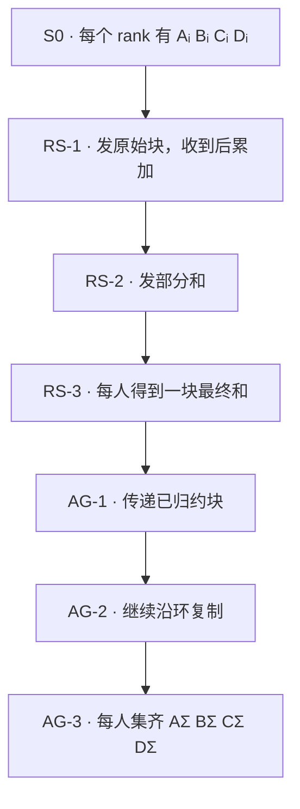
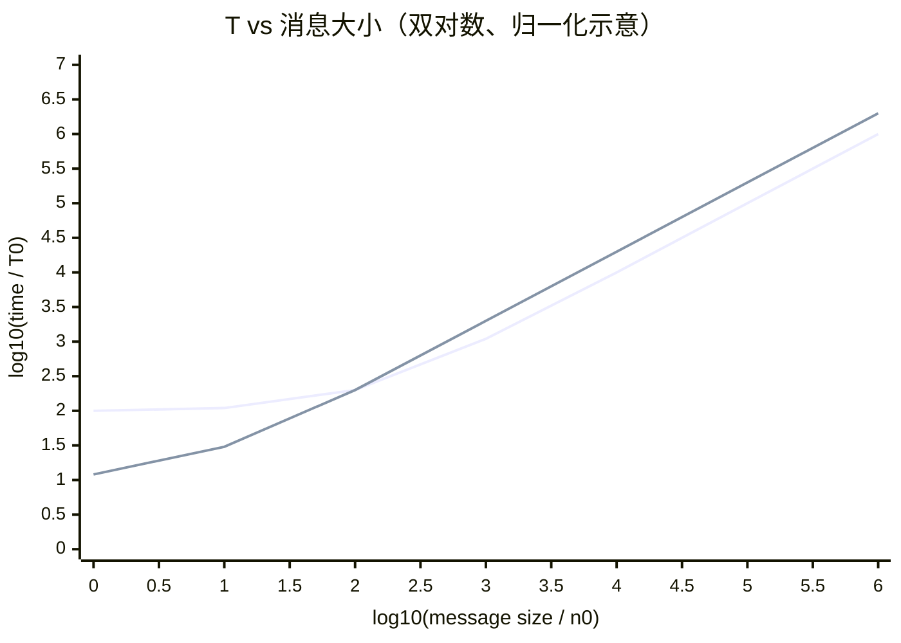
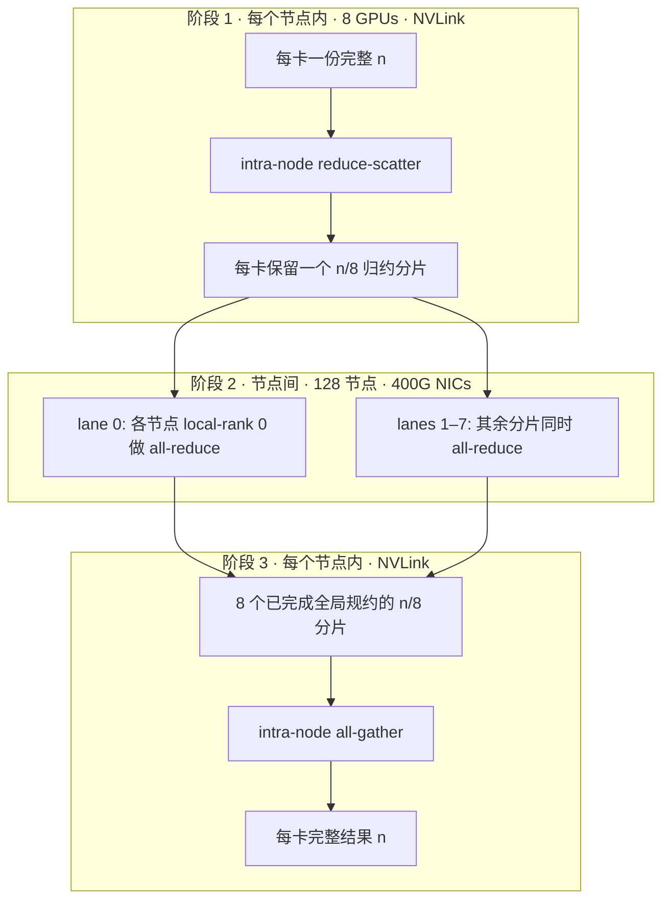

# L37 通信算法与代价模型：ring、tree 与 α-β 的选择题

> [!abstract] 本课速览
> 读完你将能够：
> 1. 用 $T=\alpha+n\beta$ 判断一条通信是固定时延主导，还是传输字节主导；
> 2. 从 reduce-scatter 和 all-gather 逐步推出 ring all-reduce 的步数、通信量与时间；
> 3. 解释 ring、tree、double binary tree 和 recursive halving/doubling 各自在什么消息区间占优；
> 4. 设计并正确记账节点内快、节点间慢的分层 all-reduce；
> 5. 读懂 `nccl-tests` 里的 `algbw` 与 `busbw`，不再拿错的列和线速比。
>
> 前置：[[L36 集合通信原语]] · 建议回看 [[L31 AI集群网络拓扑]] · 预计 60 分钟

## 论文里的这段话，你现在可能读不懂

> [!quote]
> “For large tensors, the **ring algorithm** is **bandwidth-optimal**, but its $2(p-1)$ startup steps make small-message collectives latency-bound. A **double binary tree** or **recursive halving/doubling** scheme reduces the latency term to logarithmic scale, while hierarchical collectives exploit fast intra-node links before crossing the slower fabric. We report both **algbw** and normalized **busbw**.”（综合改写自集合通信论文与性能报告的典型表述）

这段话说的不是四个互不相干的优化技巧，而是同一道选择题：在当前的消息大小、rank 数和物理拓扑下，应该付出多少次固定启动代价，又能把多少链路持续喂满？先有代价模型，才能把“ring 还是 tree”从偏好变成可验证的判断。

## 一、先给每条消息标个价

### 1.1 $\alpha$ 是进场费，$\beta$ 是按字节计价

[[L36 集合通信原语]] 解决了“通信结束后谁拿到什么”，却没规定数据怎样走。同一个 all-reduce 可以用 ring、tree 或分层算法实现；语义相同，代价可以差很多。

最常用的第一把尺子是 **$\alpha$-$\beta$ model**（$\alpha$-$\beta$ 代价模型）：

$$
T_{\text{P2P}}(n)=\alpha+n\beta.
$$

- $n$ 是这条消息的字节数；
- **latency term**（时延项）$\alpha$ 是每条消息的固定代价，可把软件栈、队列启动、同步与传播时延等压成一个有效参数；
- **bandwidth term**（带宽项）$n\beta$ 随数据量线性增长，$\beta$ 的单位是 s/B，可理解为有效带宽 $B_{\text{eff}}$ 的倒数；
- 规约还要做加法等本地计算，更细的模型会加上 $n\gamma$，其中 $\gamma$ 是每字节的规约计算代价。本课主要聚焦通信，必要时才把它加回。[^thakur]

**message size regime**（消息大小区间）指的就是 $n$ 相对于分界点 $\alpha/\beta=\alpha B_{\text{eff}}$ 有多大：

$$
n\ll\alpha B_{\text{eff}}\Rightarrow T\approx\alpha,
\qquad
n\gg\alpha B_{\text{eff}}\Rightarrow T\approx n/B_{\text{eff}}.
$$

按 [[03 约定与符号]] 的教学取值，$\alpha=10\ \mu\text{s}$、400 Gb/s $=50$ GB/s，两项相等时

$$
n_0=10^{-5}\ \text{s}\times50\times10^9\ \text{B/s}
=5\times10^5\ \text{B}=0.5\ \text{MB}.
$$

这不是通用的算法切换阈值，因为每种算法的消息步数、有效带宽和拓扑冲突都不同。它只在提醒你：对 4 KB 消息继续追求多 10 GB/s 可能没什么用；对 16 GB 梯度只减少一次 $10\ \mu\text{s}$ 启动也几乎没什么用。

> [!tip] 一句话心智模型
> 小消息在乎“发了几辆车”，大消息在乎“每辆车装了多少、路有多宽”。

## 二、ring all-reduce：一块数据怎样绕完一圈

### 2.1 四个 rank 的 reduce-scatter + all-gather

**ring algorithm**（环形算法）先把每个 rank 的 $n$ 字节 tensor 切成 $p$ 块，再把 ranks 连成逻辑环。每一步中，rank $r$ 向右邻居发一块，同时从左邻居收一块。下图用 $p=4$、`A/B/C/D` 四个 chunk 展开这条时间线；$A_i$ 是 rank $i$ 对 chunk A 的贡献，$A_\Sigma=\sum_i A_i$。

reduce-scatter 的三步可以按“每步发什么”来跟：

| 步骤 | r0 → r1 | r1 → r2 | r2 → r3 | r3 → r0 |
|---|---|---|---|---|
| RS-1 | $A_0$ | $B_1$ | $C_2$ | $D_3$ |
| RS-2 | $D_0+D_3$ | $A_1+A_0$ | $B_2+B_1$ | $C_3+C_2$ |
| RS-3 | $C_0+C_3+C_2$ | $D_1+D_0+D_3$ | $A_2+A_1+A_0$ | $B_3+B_2+B_1$ |

接收方把收到的部分和与本地对应 chunk 相加。RS-3 结束后，`r0:BΣ, r1:CΣ, r2:DΣ, r3:AΣ`：规约已经完成，但每人只有结果的 $1/p$。随后的 all-gather 不再做加法：

| 步骤 | r0 → r1 | r1 → r2 | r2 → r3 | r3 → r0 |
|---|---|---|---|---|
| AG-1 | $B_\Sigma$ | $C_\Sigma$ | $D_\Sigma$ | $A_\Sigma$ |
| AG-2 | $A_\Sigma$ | $B_\Sigma$ | $C_\Sigma$ | $D_\Sigma$ |
| AG-3 | $D_\Sigma$ | $A_\Sigma$ | $B_\Sigma$ | $C_\Sigma$ |

最终所有 rank 都拿到 `AΣ BΣ CΣ DΣ`。这就是上一课的语义等式怎样落到具体路线上：

$$
\text{all-reduce}=\text{reduce-scatter}+\text{all-gather}.
$$

### 2.2 从步数推出时间

reduce-scatter 有 $p-1$ 步，每步传 $n/p$ 字节；all-gather 完全一样，再来 $p-1$ 步。忽略规约计算 $\gamma$ 时：

$$
\begin{aligned}
T_{\text{ring}}
&=(p-1)\left(\alpha+\frac np\beta\right)
 +(p-1)\left(\alpha+\frac np\beta\right)\\
&=2(p-1)\alpha+2n\frac{p-1}{p}\beta.
\end{aligned}
$$

若把 reduce-scatter 的本地规约也记上，可再加 $n(p-1)\gamma/p$。上式的带宽项使用每 rank 单方向关键路径字节数；在全双工链路上，发送和接收可以同时发生，不能因为 NIC counter 同时记了 TX 和 RX，就把理想时间再乘 2。

当 $n$ 足够大时，

$$
T_{\text{ring}}\approx2n\frac{p-1}{p}\beta\xrightarrow[p\to\infty]{}2n\beta.
$$

也就是说，大 tensor 下每 rank 的带宽项不随 $p$ 线性增长。对使用普通 P2P send/recv、且没有在网规约的 all-reduce，每个元素要先吸收其他 $p-1$ 份贡献，再让 $p-1$ 个其他 rank 拿到结果；均摊到 $p$ 个 rank，关键路径的单方向传输下界就是 $2n(p-1)/p$。ring 达到这个下界，因此称为 **bandwidth-optimal**（带宽最优）。[^nccl-perf] [^patarasuk]

但它付出了 $2(p-1)$ 次固定启动代价。当 $n$ 很小时，$T\approx2(p-1)\alpha$，rank 越多反而越糟。==ring 的强项是大消息持续喂满邻居链路，不是把固定时延变没。==

## 三、tree 与 halving/doubling：用少走几轮换小消息时延

### 3.1 tree 不是一个唯一实现

**tree algorithm**（树形算法）让 leaves 的数据逐层向 root 规约，再把结果沿树广播回去。平衡二叉树的深度为 $\lceil\log_2p\rceil$，所以 reduce + broadcast 的启动项约为 $2\lceil\log_2p\rceil\alpha$，比 ring 的 $2(p-1)\alpha$ 温和得多。

朴素单树却容易让内部节点成为热点，或者在多层反复传大块数据时用不满所有链路。工程上会用 **chunking**（分块）把大 tensor 切成更小的通信块，再用 **pipelining**（流水化）让多个块处在不同树层；代价是块过小又会多付 $\alpha$。

NCCL 引入的 **double binary tree**（双二叉树）使用两棵互补的树：一个 rank 至多在其中一棵树上充当内部节点，两棵树各处理一半数据。因而每个 rank 最多两次收半份、两次发半份，在保留对数深度的同时逼近 ring 的每-rank 通信量。[^nccl-tree]

### 3.2 别把 recursive doubling 和 Rabenseifner 混成一个词

对 $p=2^k$ 个 ranks，经典 full-buffer recursive doubling 每轮把完整 buffer 与距离 $1,2,4,\ldots$ 的 partner 交换并规约，只需 $\log_2p$ 轮；它以最少数量级的启动轮数取胜，可称为 **latency-optimal**（时延最优）路线，但每 rank 传了 $n\log_2p$ 字节，对大消息很亏。

**recursive halving/doubling**（递归减半 / 翻倍）换了一种组合：

1. reduce-scatter 阶段每轮只与 partner 交换当前保留区域的一半，消息大小为 $n/2,n/4,\ldots,n/p$；
2. all-gather 阶段反向执行，消息大小为 $n/p,2n/p,\ldots,n/2$。

两个阶段各有 $\log_2p$ 轮，但每 rank 的总发送量为

$$
2\left(\frac n2+\frac n4+\cdots+\frac np\right)
=2n\frac{p-1}{p},
$$

同样达到带宽下界。这个将 recursive halving reduce-scatter 与 recursive doubling all-gather 组合的带宽最优路线，通常与 **Rabenseifner**（算法名，认名）联系在一起。它在 $p$ 为 2 的幂、丰富的 partner 连接可以无冲突并行时很漂亮；非 2 的幂需要额外处理，而差的拓扑映射可能让 butterfly 式 partner 穿过更多 hops 或争用链路。[^thakur] [^patarasuk]

| 算法路线 | 启动轮数 | 每-rank 发送量（理想） | 拓扑 / 规模要求 | 常见优势区间 |
|---|---:|---:|---|---|
| ring | $2(p-1)$ | $2n(p-1)/p$ | 只需稳定邻居环；非 2 的幂也自然 | 大消息、带宽主导 |
| full-buffer recursive doubling | $\log_2p$ | $n\log_2p$ | $p=2^k$ 最自然；partner 距离逐轮翻倍 | 极小消息、时延主导 |
| recursive halving/doubling | $2\log_2p$ | $2n(p-1)/p$ | $p=2^k$ 且 butterfly 流量无严重冲突 | 小到中等消息，兼顾字节数 |
| double binary tree | $O(\log p)$ 深度 | 经互补双树与分块可逼近 ring | 需构树、分块和拓扑映射 | 大规模的小到中等消息 |

所以“ring vs tree”不应该被讲成一条永久阈值。真实库会根据 message size、rank 数、拓扑与实测阈值切换；下图只表达“低启动项”和“高稳态带宽”之间会产生交叉。横纵轴都是无量纲对数示意，数值不是某款硬件的 benchmark。

若把两种算法写成 $T_1=A_1+C_1n$、$T_2=A_2+C_2n$，其中 $A_1>A_2$但 $C_1<C_2$，则交叉点为

$$
n^*=\frac{A_1-A_2}{C_2-C_1}.
$$

这个式子比背一个固定字节数有用：软件版本、通信 protocol、拓扑或拥塞一变，$A$ 和 $C$ 就会变，切换点也跟着移。

## 四、分层 all-reduce：别让快链路和慢链路同价

一台 H100 节点内，[[03 约定与符号]] 统一口径的 NVLink 是每方向 450 GB/s；跨节点 400 Gb/s NIC 是每方向 50 GB/s，相差 9 倍。把 1,024 张 GPU 当成一张扁平速度的网，等于拿公交车和高铁用同一张时刻表。

**hierarchical all-reduce**（分层 all-reduce）先在快的拓扑域内合并或分片，再走慢的跨域链路，最后在域内复原布局。对每节点 $q=8$ 张 GPU、$m=128$ 个节点，常见的 **2D ring**（二维环）可写成：

三个阶段是：节点内 reduce-scatter $→$ 按 local rank 组成 8 条跨节点 all-reduce lanes $→$ 节点内 all-gather。每个 GPU/NIC lane 的跨节点 payload 从 $n$ 变成 $n/8$，但节点上有 8 条 lane 并行，==节点聚合的跨网字节总量并没有凭空少 8 倍==。收益来自先用快链路分片、再让多张 NIC 并行承担各自的 $n/8$。NCCL 对 hierarchical ring 的公开说明也是节点内 reduce-scatter、节点间多个 all-reduce、再节点内 all-gather。[^nccl-tree]

还有一种“节点内 reduce 到 leader $→$ leaders 之间 all-reduce $→$ 节点内 broadcast”的组织。它把跨节点参与者减为 $m$，却让 leader 继续携带完整 $n$；若只用一张 NIC，不能宣称跨网 payload 变成 $n/8$。看到论文写“hierarchical”，必须继续问：域内做的是 reduce 还是 reduce-scatter？域间有几个 leaders/lanes？究竟在说 per-GPU、per-NIC 还是 per-node aggregate？

这个思路还能继续扩展：把逻辑环对齐 [[L31 AI集群网络拓扑|同号 rail]]，减少跨 rail 路径；或让 [[L33 在网计算与智能网卡|SHARP]] 在交换机内流式规约。优化 collective 的本质不是变魔术，而是逼近信息传输下界、减少启动轮数，并让流量匹配物理拓扑。

## 五、`algbw` 和 `busbw`：一个是用户视角，一个是折算视角

`nccl-tests` 同时报告两种带宽：

- **algorithm bandwidth (algbw)**（算法带宽）是用户 tensor 大小除以 collective 时间：$\text{algbw}=n/T$。它直接回答“这块 tensor 多久同步完”。
- **bus bandwidth (busbw)**（总线折算带宽）把 algbw 乘上该 collective 在 P2P 实现下的理论流量系数，便于把不同 rank 数和原语折算到更接近硬件瓶颈的口径。它不是 NIC/NVLink counter 直接测出的 wire bandwidth。[^nccl-perf]

| `nccl-tests` 原语 | $\text{busbw}/\text{algbw}$ | $n$ 的口径 |
|---|---:|---|
| all-reduce | $2(p-1)/p$ | 每 rank 的完整输入 tensor |
| reduce-scatter | $(p-1)/p$ | 全部 ranks 输出分片合起来的总数组，也是每 rank 的完整输入 |
| all-gather | $(p-1)/p$ | 所有分片拼起来的完整输出 |
| broadcast | $1$ | root 的完整 tensor |
| reduce | $1$ | 每 rank 的完整输入 tensor |
| all-to-all | $(p-1)/p$ | 每 rank 的总发送 buffer |

例如 $p=8,n=16$ GB 的 ring all-reduce 若理想耗时 $T=0.56$ s，则

$$
\text{algbw}=16/0.56\approx28.57\ \text{GB/s},
$$

$$
\text{busbw}=28.57\times\frac{2\times7}{8}
=50\ \text{GB/s}.
$$

用户确实在 0.56 s 内完成了一个 16 GB tensor，所以 algbw 是 28.57 GB/s；但 ring 的每-rank 关键路径传了 28 GB，折算后刚好对应 50 GB/s 线速。

> [!warning] `busbw` 高于一个端口的标称线速，不一定是穿越物理
> 先查系数、单向/双向、使用了几条 rails/NICs，以及是否启用 NVLS/SHARP 类在网规约。`busbw` 是基于普通 P2P 传输下界的校正值；硬件直接完成 multicast/reduction 时，它可能更像“达到同等性能的 P2P 算法需要多大带宽”，不再映射某一根线的真实 byte counter。

## 六、all-to-all 为什么没有 ring 的舒服日子

均匀 all-to-all 中，每 rank 向其他 rank 发送的总量仍是 $n(p-1)/p$，看上去比 all-reduce 还少。但 all-reduce 传的是可规约、最终人人相同的数据，中间 rank 可边收边加，再把部分和向前传；all-to-all 中 $X_{ij}$ 只属于目的 rank $j$，不能用一个部分和代替多份个性化 payload。

因此，$p$ 个 ranks 会产生 $p(p-1)$ 个有向 source-destination 关系。两个风险紧跟着出现：

1. 均匀流量也要求高 **bisection bandwidth**（对分带宽）；某个切面容量不足时，所有穿过它的个性化流都会竞争。
2. MoE token routing 往往不均匀；多个 source 同时把数据发向热门 expert owner，就会形成 [[L30 无损网络与拥塞控制|incast]]。平均每 rank 发送量没超标，最忙目的端的 ingress 仍可能先爆掉。

所以读 all-to-all 论文时，不能只看 `algbw`；还要看流量矩阵、最热目的端、对分带宽、路由冲突和尾时延。这就是 [[L46 专家并行与MoE训练]] 会把 A2A 当作网络主菜的理论起点。

## 七、算一算：大消息、小消息、分层三连算

> [!example] 统一口径
> 三题都使用 [[03 约定与符号]]：400 Gb/s $=50$ GB/s（每方向），H100 NVLink 双向 900 GB/s、每方向 450 GB/s，集合通信 $\alpha=10\ \mu\text{s}$ 量级；容量与带宽用 SI 口径。计算都忽略 protocol header、路由冲突、排队与 $\gamma$，因而是理想模型，不是实测承诺。
>
> **① 大消息：$p=1024,n=16$ GB 的扁平 ring**
>
> 时延项：
> $$
> T_\alpha=2(p-1)\alpha
> =2\times1023\times10\ \mu\text{s}
> =20.46\ \text{ms}.
> $$
> 带宽项：
> $$
> T_\beta=\frac{2n(p-1)}{pB}
> =\frac{2\times16\ \text{GB}\times1023/1024}{50\ \text{GB/s}}
> =0.639375\ \text{s}.
> $$
> 总时间：
> $$
> T_{\text{ring}}\approx20.46\ \text{ms}+639.375\ \text{ms}
> =659.835\ \text{ms}\approx0.66\ \text{s}.
> $$
> $\alpha$ 只占约 $20.46/659.835\approx3.1\%$，所以这是大消息带宽主导区间；若只做量级估算，可写成约 0.64 s，但完整模型值是约 0.66 s。
>
> **② 小消息：$p=1024,n=1$ MB**
>
> ring 的带宽项只有
> $$
> T_{\beta,\text{ring}}
> =\frac{2\times10^6\times1023/1024}{50\times10^9}
> \approx39.96\ \mu\text{s},
> $$
> 但时延项仍是 20.46 ms，因而
> $$
> T_{\text{ring}}\approx20.50\ \text{ms}.
> $$
> 若理想的 recursive halving/doubling 使用 $2\log_2p=20$ 轮，并保持同样的带宽项，
> $$
> T_{\text{RHD}}
> \approx20\times10\ \mu\text{s}+39.96\ \mu\text{s}
> \approx0.240\ \text{ms}.
> $$
> 理想加速比为 $20.50/0.240\approx85.4\times$，也就是“近百倍”。实际值取决于 butterfly partner 映射、链路冲突和库的 protocol。
>
> **③ 分层：8 GPUs/节点 $×$ 128 节点，$n=16$ GB**
>
> 先做节点内 reduce-scatter，每个 inter-node lane 只携带
> $$
> n/q=16/8=2\ \text{GB}.
> $$
> 8 条 lane 并行后，每条 lane 在 128 个节点之间的 ring all-reduce 时间为
> $$
> T_{\text{inter}}
> =2(128-1)\times10\ \mu\text{s}
> +\frac{2\times2\times127/128}{50}\ \text{s}
> =2.54\ \text{ms}+79.375\ \text{ms}
> =81.915\ \text{ms}.
> $$
> 节点内 RS+AG 的理想时间为
> $$
> T_{\text{intra}}
> =2(8-1)\times10\ \mu\text{s}
> +\frac{2\times16\times7/8}{450}\ \text{s}
> \approx0.14\ \text{ms}+62.22\ \text{ms}
> =62.36\ \text{ms}.
> $$
> 三阶段串行上界约为
> $$
> T_{\text{hier}}\approx144.28\ \text{ms}.
> $$
> 相比扁平 1,024-rank ring 的约 0.66 s，理想模型给出约 $4.6\times$ 缩短。这不是因为节点总流量少了 8 倍，而是每条慢 lane 只处理 $n/8$，并行利用 8 张 400G NIC；真实实现还可以用 chunk pipeline 重叠三个阶段。

> [!warning] 三个常见误区
> - **“ring 总是最好”**：它大消息时带宽优，小消息会被 $O(p)$ 启动轮数拖垮。
> - **“加 rank 会让 all-reduce 通信更快”**：ring 带宽项只是趋近 $2n\beta$，不会因 $p$ 增大而归零；时延项还会变差。加卡主要加速的是每卡计算份额。
> - **“分层必然少传 $q$ 倍数据”**：必须说清 per-lane 还是 per-node aggregate，reduce 还是 reduce-scatter，以及有几条 NIC lanes。

## 八、与网络与系统研究的连接

$\alpha$-$\beta$ 模型不会预测每一个 packet，但它能快速识别研究杠杆在哪里：

- 若 $\alpha$ 主导，问题更像是减少同步轮数、融合 protocol steps、使用 tree/NVLS，或把小 tensor 合并成 bucket；
- 若 $n\beta$ 主导，问题更像是提高有效带宽、增加 rails、减少拥塞，或改变通信量；
- 若拓扑异构，优化变量会变成 rank mapping、分层域、每层算法和多 rail 调度；
- 若是 all-to-all，还要从一个标量 $n$ 升级到整张 traffic matrix，研究热点、路由和负载均衡。

它也是一把审稿尺子。论文若声称“新 all-reduce 大幅降低通信”，你应该立刻问：降的是 $\alpha$ 轮数、$\beta$ 乘数、有效 $B$，还是应用层的 $n$？它是否使用额外 NIC、交换机规约、更强的拓扑假设或更多内存？“更快”只有落到这些可记账项上，才是系统结论。

## 回到开头那段话

现在可以逐句拆开它：

1. “For large tensors, the ring algorithm is bandwidth-optimal.”——ring 的 RS 和 AG 各传 $n(p-1)/p$，每 rank 总关键路径字节数为 $2n(p-1)/p$，达到普通 P2P all-reduce 的带宽下界；大 $n$ 时 $\beta$ 项压过 $\alpha$ 项。
2. “Its $2(p-1)$ startup steps make small-message collectives latency-bound.”——ring 的死穴是启动轮数随 $p$ 线性增长；1 MB、1,024 ranks 的教学算例里，20.46 ms 固定项远大于约 $40\ \mu$s 带宽项。
3. “A double binary tree or recursive halving/doubling scheme reduces the latency term to logarithmic scale.”——平衡树用对数深度传播；双树把数据平分到互补树上弥补带宽；halving/doubling 则用两个 $\log_2p$ 阶段同时达到最小字节数。
4. “Hierarchical collectives exploit fast intra-node links before crossing the slower fabric.”——先在 NVLink 域内 reduce-scatter，再让多条 NIC lanes 各自跨节点 all-reduce $n/q$ 分片，最后域内 all-gather；不能把 per-lane 缩小误读为节点聚合流量凭空消失。
5. “We report both algbw and normalized busbw.”——algbw 是 $n/T$ 的应用视角；busbw 乘上 collective 流量系数，用于折算硬件利用，但不是物理链路 counter。

你现在不仅能翻译这段话，还能拿出公式追问它的适用域：多大的 $n$、多少 ranks、哪层拓扑、几条 lanes，以及报表用的究竟是哪个 bandwidth。

## 术语卡片

| 术语 | 中文 | 一句话解释 |
|---|---|---|
| α-β model | $\alpha$-$\beta$ 代价模型 | 用每消息固定代价 $\alpha$ 与每字节代价 $\beta$ 估算通信时间。 |
| latency term | 时延项 | 与消息字节数无关、主要由启动步数和 $\alpha$ 决定的部分。 |
| bandwidth term | 带宽项 | 随传输字节数线性增长、主要由 $n\beta$ 决定的部分。 |
| ring algorithm | 环形算法 | ranks 沿逻辑环逐块 reduce-scatter 再 all-gather 的算法。 |
| tree algorithm | 树形算法 | 沿树向 root 规约、再沿树广播结果的算法家族。 |
| double binary tree | 双二叉树 | 两棵互补树各处理一半数据，兼顾对数深度和高带宽。 |
| recursive halving/doubling | 递归减半 / 翻倍 | 先用消息递减的 RS，再用消息递增的 AG 完成 all-reduce。 |
| Rabenseifner | Rabenseifner 算法 | 将 recursive halving reduce-scatter 与 recursive doubling all-gather 组合的带宽最优路线。 |
| bandwidth-optimal | 带宽最优 | 算法的字节传输项达到给定通信模型下的下界。 |
| latency-optimal | 时延最优 | 算法以最少数量级的消息轮数完成信息扩散。 |
| hierarchical all-reduce | 分层 all-reduce | 按 NVLink/节点/网络等带宽层级分段完成规约与分发。 |
| 2D ring | 二维环 | 把域内和域间当作两个环维度组合 collective 的算法。 |
| algorithm bandwidth (algbw) | 算法带宽 | 用户 tensor 大小除以 collective 完成时间，即 $n/T$。 |
| bus bandwidth (busbw) | 总线折算带宽 | algbw 乘原语流量系数得到的硬件利用折算值。 |
| message size regime | 消息大小区间 | 由 $n$ 相对 $\alpha/\beta$ 的大小决定时延项还是带宽项主导的区间。 |
| pipelining | 流水化 | 让多个 chunk 同时处在通信算法的不同阶段。 |
| chunking | 分块 | 把大 tensor 拆成多个通信块，以支持并行、流水和负载均衡。 |

## 自测

1. $\alpha$ 和 $\beta$ 分别吸收了哪类开销？为什么不存在跨机器的固定切换阈值？
2. 画出 $p=4$ ring all-reduce 的 RS 与 AG 两阶段，并说明每个阶段各有几步、每步传多大。
3. 从步数推出 $T_{\text{ring}}=2(p-1)\alpha+2n(p-1)\beta/p$，并解释“带宽项与 $p$ 近似无关”不等于“通信随加卡消失”。
4. $p=256,n=4$ MB，$\alpha=10\ \mu\text{s}$、$B=50$ GB/s。计算 ring all-reduce 的时延项、带宽项和总时间；判断哪项主导。
5. full-buffer recursive doubling 与 recursive halving/doubling 的步数、字节数有什么交换？哪个更适合极小消息？
6. 在 8 GPUs/节点的分层 all-reduce 中，“跨网数据降到 $1/8$”应如何限定口径？为什么 leader reduce 方案不满足这句话？
7. $p=16$ 的 all-reduce 实测 `algbw = 40 GB/s`。计算 `busbw`；它是否等于某条物理链路的实测 counter？

> [!note]- 参考答案
> 1. $\alpha$ 是每消息的固定启动代价，$\beta$ 是每字节传输时间。不同算法的启动轮数、有效带宽、protocol 和拓扑冲突不同，所以实际切换点不是一个机器无关常数。
> 2. RS 有 $p-1=3$ 步，AG 再有 3 步；每步每 rank 发送并接收 $n/p=n/4$。RS 结束后每 rank 有一个规约完成的 chunk，AG 把四个 chunks 复制给所有人。
> 3. 两阶段各为 $(p-1)(\alpha+n\beta/p)$，相加得公式。当 $p$ 大时，$(p-1)/p\to1$，带宽项趋近 $2n\beta$，仍然是传约 $2n$ 的代价；而且 $2(p-1)\alpha$ 还在增长。
> 4. $T_\alpha=2\times255\times10\ \mu\text{s}=5.10$ ms。$T_\beta=2\times4\times10^6\times255/256/(50\times10^9)\ \text{s}=0.159375$ ms。总时间约 5.259 ms，时延项约占 97%，因此 latency term 主导。
> 5. full-buffer recursive doubling 用 $\log_2p$ 轮，但每 rank 传 $n\log_2p$；halving/doubling 用 $2\log_2p$ 轮，却只传 $2n(p-1)/p$。在其他条件相同且消息极小时，前者更省启动轮数；消息变大后，后者的字节优势更重要。
> 6. 只能说“经节点内 reduce-scatter 后，每条 inter-node lane/每张 GPU NIC 携带 $n/8$”；8 条 lane 的节点聚合数据量未减 8 倍。leader reduce 生成的仍是完整 $n$ 结果，leader 跨节点 all-reduce 的 payload 仍是 $n$。
> 7. $\text{busbw}=40\times2\times15/16=75$ GB/s。它是按 all-reduce P2P 流量系数得到的折算值，不是某条物理链路的 counter；多 rails 或在网规约时尤其要谨慎解读。

## 延伸阅读

- Thakur、Rabenseifner 与 Gropp，《[Optimization of Collective Communication Operations in MPICH](https://web.cels.anl.gov/~thakur/papers/ijhpca-coll.pdf)》（IJHPCA 2005）：集合通信代价模型与算法选择的经典文献；优先读 cost model 和 all-reduce 相关段落。
- Patarasuk 与 Yuan，《[Bandwidth Optimal All-reduce Algorithms for Clusters of Workstations](https://doi.org/10.1016/j.jpdc.2008.09.002)》（JPDC 2009）：看 ring 的带宽下界、无冲突条件，以及它与 butterfly 路线的差异。
- Andrew Gibiansky，《[Bringing HPC Techniques to Deep Learning](https://andrew.gibiansky.com/blog/machine-learning/baidu-allreduce/)》（2017，原为 Baidu Research 技术博客，此处为作者授权转载）：用图文看 ring all-reduce 如何从 HPC 进入深度学习工程。
- NVIDIA，《[Massively Scale Your Deep Learning Training with NCCL 2.4](https://developer.nvidia.com/blog/massively-scale-deep-learning-training-nccl-2-4/)》：看 double binary tree 的互补构造、对数深度和 2D hierarchical ring 的官方图示。
- NVIDIA `nccl-tests`，《[Performance reported by NCCL tests](https://github.com/NVIDIA/nccl-tests/blob/master/doc/PERFORMANCE.md)》：`algbw`、`busbw` 与各原语折算系数的定义出处；[[L38 NCCL解剖]] 会用它读真实报表。

[^thakur]: Rajeev Thakur, Rolf Rabenseifner, William Gropp，《[Optimization of Collective Communication Operations in MPICH](https://web.cels.anl.gov/~thakur/papers/ijhpca-coll.pdf)》，*The International Journal of High Performance Computing Applications* 19(1), 2005：给出 $\alpha+n\beta$ 模型，并用消息大小和进程数指导 collective 算法选择。
[^patarasuk]: Pitch Patarasuk, Xin Yuan，《[Bandwidth Optimal All-reduce Algorithms for Clusters of Workstations](https://doi.org/10.1016/j.jpdc.2008.09.002)》，*Journal of Parallel and Distributed Computing* 69(2), 2009：推导 all-reduce 通信下界，并比较 ring 与 recursive halving/doubling 的带宽最优条件。
[^nccl-tree]: NVIDIA，《[Massively Scale Your Deep Learning Training with NCCL 2.4](https://developer.nvidia.com/blog/massively-scale-deep-learning-training-nccl-2-4/)》：说明互补双二叉树各处理一半数据，以及 2D hierarchical ring 的 intra-node RS $→$ inter-node all-reduces $→$ intra-node AG 结构。
[^nccl-perf]: NVIDIA `nccl-tests`，《[Performance reported by NCCL tests](https://github.com/NVIDIA/nccl-tests/blob/master/doc/PERFORMANCE.md)》：定义 $\text{algbw}=n/T$，并给出 all-reduce 的 $2(p-1)/p$、all-gather/reduce-scatter/all-to-all 的 $(p-1)/p$ 等 busbw 折算系数。

---
上一课：[[L36 集合通信原语]] ← · → 下一课：[[L38 NCCL解剖]]
