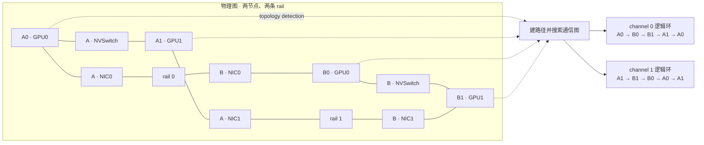
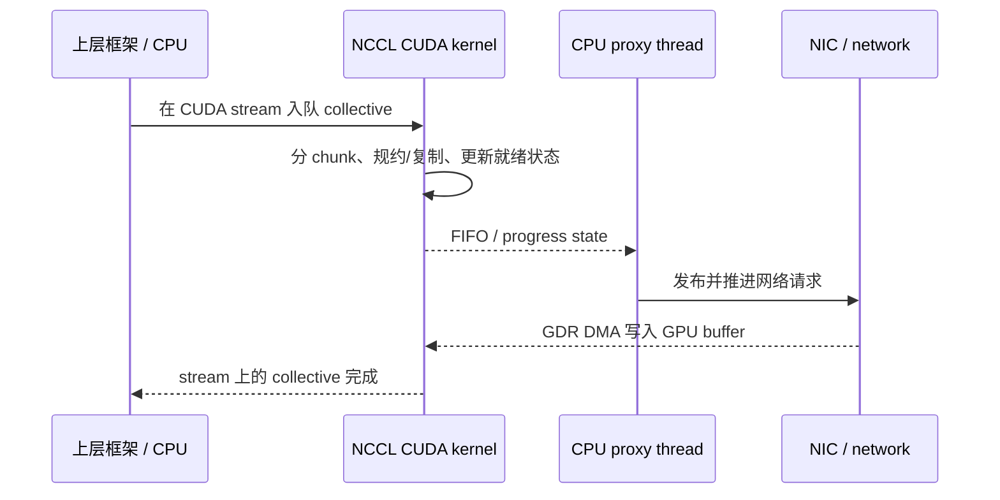

# L38 NCCL解剖：从拓扑、channel、protocol 到 nccl-tests

> [!abstract] 本课速览
> 读完你将能够：
> 1. 解释 NCCL 如何从硬件拓扑生成 ring/tree，并按消息大小选择算法与 protocol；
> 2. 说清 channel、CUDA kernel 与 proxy thread 分别在通信数据面做什么；
> 3. 区分 Simple、LL、LL128，并解释 PXN、NVLS 与 GPUDirect RDMA 各优化哪段路径；
> 4. 安全使用常见 NCCL 环境变量，而不是靠“玄学参数”掩盖拓扑问题；
> 5. 跑通并读懂 `nccl-tests`，用 `time/algbw/busbw` 判断小消息时延和大消息带宽是否健康；
> 6. 面对 timeout、hang 与 WARN 时，先区分“报错的 rank”和“真正掉队的 rank”。
>
> 前置：[[L37 通信算法与代价模型]] · [[L25 节点内互联]] · 建议回看 [[L31 AI集群网络拓扑]] · 预计 60 分钟

## 论文里的这段话，你现在可能读不懂

> [!quote]
> “NCCL performs **topology detection** during communicator initialization, builds multiple **channels**, and selects an algorithm–**protocol** pair for each collective. Large messages often favor Ring/**Simple**, whereas small messages may use Tree/**LL** or **LL128**. **PXN** and **NVLS** exploit rail-aligned NICs and NVSwitch reduction, while **nccl-tests** reports both **algbw** and normalized **busbw**. An **NCCL timeout** observed at one rank may be caused by another rank that failed to rendezvous or make progress.”（综合改写自 NCCL 文档、源码与工程日志的典型表述）

这段话把初始化、GPU kernel、网络路径、性能表和故障现象压在了四句话里。你若只知道 all-reduce 的数学语义，会看到一串“像参数名又像硬件名”的缩写。本课把它们按一条数据真正走过的路径拆开。

## 一、NCCL 是把算法题落到真实机器上的库

### 1.1 它是什么，又不是什么

**NCCL**（NVIDIA Collective Communications Library）是面向 NVIDIA GPU 的集合通信库，提供 all-reduce、all-gather、reduce-scatter、broadcast、send/recv 等操作，并针对 PCIe、NVLink/NVSwitch、InfiniBand 与 Socket 网络选择路径。它不是训练框架、集群调度器或完整的并行运行时：谁启动进程、怎样给 rank 编号、失败后是否重启，通常由 PyTorch、MPI、Slurm 或上层控制面负责。[^nccl]

把它和 MPI 对照最容易建立直觉：MPI 起源于通用 CPU/HPC 消息传递，现代实现也能 CUDA-aware；NCCL 则从一开始就把 GPU buffer、CUDA stream、GPU 拓扑和 collective kernel 当作中心对象。两者不是“旧与新”的替代关系，多节点 `nccl-tests` 本身就常用 MPI 启动进程，再由 NCCL 搬 GPU 数据。

没有 NCCL 这一层会怎样？上层框架要亲自处理 NVLink、PCIe、GPU–NIC 亲和性、ring/tree 构造、分块流水和跨机 transport。`all_reduce(tensor)` 本来一行就够，最后会膨胀成一套硬件相关通信系统。

### 1.2 初始化先集合，再识路

多进程初始化先经过 **rendezvous**（会合）：一个参与者生成 `ncclUniqueId`，再借助 MPI、Socket 或上层 store 把它带外广播给所有 ranks；每个 rank 用同一个 ID 和唯一 rank 号创建 communicator。rendezvous 解决的是“哪些人属于同一组、怎样找到彼此”，不是传训练 tensor 的高速数据面。少一个 rank、rank 重号或同一 communicator 重复使用同一 CUDA device，都可能让初始化卡住。[^communicator]

随后进入 **topology detection**（拓扑发现）。NCCL 源码中的主线很直白：发现 GPU、CPU、PCIe、NVLink 与 NIC，计算 GPU↔GPU、GPU↔NIC 路径，裁掉不可达设备，再搜索 ring、tree、NVLS 等候选通信图。collective 入队时，tuning model 会结合操作类型、消息大小、rank 数、拓扑与架构，从候选算法×protocol 的代价表中选预计时间最低者。[^source]



图里物理连线没有变，变的是逻辑次序。一个好环要让跨机边尽量留在对应 rail，节点内边走 NVLink，并避免多个 channel 都挤同一条瓶颈链路。[[L37 通信算法与代价模型]] 讲的是候选算法的代价；NCCL 做的是把候选算法映射到眼前这台机器。

> [!tip] 一句话心智模型
> topology detection 像先画地铁图，graph search 像规划线路，algorithm×protocol 选择才是决定这趟车走快线还是站站停。

## 二、通信真的会占 GPU：kernel、channel 与 proxy

### 2.1 collective 也是 CUDA kernel

**CUDA kernel**（CUDA 内核）不只做 GEMM。经典 NCCL collective 会把工作提交到 CUDA stream，再启动通信 kernel；源码中 kernel grid 的 `x` 维直接取活跃 channel 数。kernel 里的线程负责从 GPU buffer 读写、规约、复制、轮询就绪状态并推进 chunk。[^source]

因此“通信与计算重叠”不是免费的：通信 kernel 也要占用 SM/CTA、寄存器和内存带宽。若 GEMM 已把 GPU 填得很满，额外通信 kernel 可能拿不到足够执行资源；反过来，给通信开太多并行工作也可能挤压计算。后面的 [[L52 性能剖析与MFU核算]] 会把这种资源竞争放进时间线分析。

### 2.2 channel 是并行流水线，不是 CUDA stream

**channel**（NCCL 通信通道）是一条可独立推进的逻辑通信流水线，通常拥有自己的 ring/tree 连接和 buffer。大 tensor 被切成 chunks 后，可以条带化到多个 channels 上并行推进：像把一条收费站车道扩成多条，让多条 NVLink 或 NIC rail 同时有活干。

但 channel 越多并不保证越快：消息太小时，分块后每条 channel 吃不饱，调度和同步开销反而占主导；channel 增加还常意味着更多 CTAs 和更多 GPU 资源占用。==channel 是库根据拓扑和消息大小选择的执行并行度，不是“越大越好”的用户旋钮。==

### 2.3 proxy thread 负责把 GPU 与网络 transport 接起来

跨机时，GPU kernel 不能自己调用 Socket 或 InfiniBand verbs。NCCL 的 **proxy thread**（代理进度线程）在 CPU 侧推进网络 transport：处理连接、发布/轮询网络请求、维护进度，并通过 FIFO/状态与 GPU kernel 协作。数据若走 **GPUDirect RDMA**（GPU 直接远程内存访问），NIC 可以 DMA 读写 GPU memory，不必把 payload 搬到 host memory；但这不等于 CPU proxy 消失了，控制和 progress 仍需有人推进。[^proxy]



## 三、Simple、LL、LL128：同一算法的三套“挡位”

**protocol**（通信协议）在这里不是 TCP/InfiniBand 那种网络协议，而是 NCCL kernel 搬 chunk、表示就绪并同步生产者/消费者的设备端传输格式。算法回答“沿 ring 还是 tree 走”，protocol 回答“每一步怎样装载、通知和流水”。同一个 Ring 可以配 Simple、LL 或 LL128，于是形成不同的固定时延与有效带宽。

- **Simple**（简单协议）偏向大块、稳态带宽：额外元数据比例低，适合大消息把链路持续喂满，但等待一块数据就绪的粒度较粗。
- **LL**（Low-Latency protocol，低时延协议）偏向小消息：源码把 32-bit data 与 32-bit ready flag 组成一个 8-byte 原子可见单元，接收端可边到边轮询；代价是大约一半空间给了 flag，payload efficiency 较低。
- **LL128**（128-byte 低时延协议）取折中：每个 128-byte line 用 120 bytes 装数据、8 bytes 表示就绪，理论 payload 比例为 $120/128=93.75\%$；它依赖受支持的平台与路径，不能看到名字就强开。[^protocol]

下面是心智模型，不是固定阈值表。实际边界随 NCCL 版本、GPU、拓扑、rank 数和 collective 变化：

| 消息区间 | 常见候选算法 | 常见候选 protocol | 选择理由 |
|---|---|---|---|
| 极小消息 | Tree / 低轮数路线 | LL | 少等完整 chunk，优先压低固定时延 |
| 小到中等消息 | Tree 或 Ring | LL128 | 保留细粒度 progress，同时提高 payload 比例 |
| 大消息 | Ring；支持时也可能选 NVLS 等 | Simple | 元数据比例低，优先追求稳态带宽 |

> [!warning] `NCCL_PROTO=LL128` 不是“更高级所以更快”
> NCCL 官方文档明确不建议长期强制 protocol；在不支持 LL128 的平台上强开甚至可能导致数据损坏。正确做法是让自动调优先选，只有在复现问题或做受控 A/B benchmark 时才限定候选集。[^env]

## 四、跨机三件套：GDR、PXN 与 NVLS 优化不同位置

### 4.1 GDR：让 NIC 直接碰 GPU memory

上一节提到的 GPUDirect RDMA 省掉 host staging：传统路径可能是 GPU→host memory→NIC，GDR 则让 NIC 通过 PCIe peer DMA 直接读写注册过的 GPU buffer。它优化的是 GPU memory 与 NIC 之间的数据路径；走错 NUMA、IOMMU/ACS 配置不合适、容器没暴露 verbs 设备，都可能让它回退或不可用。完整机制见 [[L29 RDMA原理]]。

### 4.2 PXN：本 GPU 借同节点另一张 GPU 的 NIC 出门

**PXN**（PCIe × NVLink 网络中转）允许数据先经 NVLink 到达同节点的中间 GPU，再从与目标 rail 对齐的 non-local NIC 发出。例如本地 GPU0 要去远端 GPU1，但 GPU0 的 NIC0 与目标所在 rail 不匹配；PXN 可走 `GPU0 → NVLink → GPU1 → NIC1 → rail 1`，避免在网络里跨 rail 绕路，并可在合适场景聚合多份消息。它正是 [[L31 AI集群网络拓扑|rail-optimized 拓扑]] 的软件搭档。[^pxn]

### 4.3 NVLS：让 NVSwitch 参与归约

**NVLS**（NVLink SHARP）利用支持的 NVSwitch/NVLink domain 的 hardware multicast/reduction 能力，让交换结构参与 collective，而不必把普通 P2P ring 的每一步都交给 GPU kernel 完成。它优化的是节点内/scale-up domain 的 collective 数据流，与跨机 InfiniBand SHARP 不是同一个物理层级；NCCL 可以再把不同层级组合起来。回看 [[L33 在网计算与智能网卡]]，你会发现两者共享同一思路：把可结合的 reduction 尽量靠近数据路径执行。

| 技术 | 优化的路径段 | 没有解决什么 |
|---|---|---|
| GPUDirect RDMA | NIC ↔ GPU memory，绕过 host staging | 不替你选对 NIC/rail，也不消除拥塞 |
| PXN | GPU ↔ 同节点中间 GPU ↔ non-local NIC | 多一次节点内中转，不保证任意拓扑都获益 |
| NVLS | NVSwitch/NVLink domain 内 multicast/reduction | 不是跨数据中心网络，也不能修复坏链路 |

## 五、环境变量：用来观测和做实验，不是先验药方

截至 2026 年，NCCL 的自动选择已覆盖大量拓扑与架构。官方文档把一部分变量归为系统配置，另一部分归为调试用途，并警告把调试覆盖项长期留在生产脚本中可能导致次优性能、crash 或 hang。[^env]

| 环境变量 | 一句话用途 | 常见用法 / 风险 |
|---|---|---|
| `NCCL_DEBUG` | 控制日志级别 | `WARN` 看异常，`INFO` 看选择；`TRACE` 日志量很大 |
| `NCCL_DEBUG_SUBSYS` | 过滤日志子系统 | 常看 `INIT,GRAPH,TUNING,NET`，减少无关输出 |
| `NCCL_ALGO` | 限定算法候选 | 用 `Ring`/`Tree`/`NVLS` 等做 A/B；长期强制会绕过自动选择 |
| `NCCL_PROTO` | 限定 Simple/LL/LL128 | 用于定位 protocol 问题；不要在未知平台盲开 LL128 |
| `NCCL_IB_HCA` | 过滤 InfiniBand/RoCE verbs HCA 与 port | 多 HCA 机器上排除错误/不可达端口；精确匹配时注意前导 `=` 语法 |
| `NCCL_SOCKET_IFNAME` | 选择 IP interface | 影响 bootstrap 或 Socket transport；它不是 verbs HCA 选择器 |
| `NCCL_PXN_DISABLE` | 禁用 PXN | 用于验证中转路径是否是问题来源，不是通用加速开关 |
| `NCCL_NVLS_ENABLE` | 控制 NVLS 可用性 | 仅在硬件与软件支持时有意义；强制模式失败应回查支持条件 |

第一次看集群，推荐先只开观测：

```bash
NCCL_DEBUG=INFO \
NCCL_DEBUG_SUBSYS=INIT,GRAPH,TUNING,NET \
mpirun -np 64 -N 8 ./build/all_reduce_perf -b 8 -e 1G -f 2 -g 1
```

先确认日志发现了预期 HCA、GDR、rings/trees 与 channels，再做单变量实验。例如只比较 `NCCL_ALGO=Ring` 和默认值；不要一次同时改 algorithm、protocol、channel 数和 HCA，否则即使变快也不知道是谁起作用。

## 六、`nccl-tests`：拿到集群先做通信体检

### 6.1 命令与输出列

**nccl-tests**（NCCL 性能与正确性测试套件）是独立于 NCCL 主仓库的官方 benchmark。下面的命令由 64 个 MPI processes 驱动 64 张 GPU，即 8 节点×8 GPU；`-b/-e` 给最小/最大消息，`-f 2` 每次翻倍，`-g 1` 表示每个 process 控制 1 GPU。官方 README 的 `M/G` 参数是 MiB/GiB，而输出 `algbw/busbw` 使用 GB/s。[^tests]

```bash
mpirun -np 64 -N 8 \
  ./build/all_reduce_perf -b 8 -e 1G -f 2 -g 1
```

输出中的关键列：

- `size`：每个 rank 的完整输入 tensor 字节数；`count=size/sizeof(type)`；
- `time`：一次 collective 的平均时间，通常以 µs 显示；
- **algorithm bandwidth (algbw)**（算法带宽）：$n/T$，直接回答“这个 tensor 多久完成”；
- **bus bandwidth (busbw)**（总线折算带宽）：按 collective 的理论 P2P 流量系数校正 algbw；all-reduce 为 $2(p-1)/p$；
- `#wrong`：校验错误数，性能再高但它非 0 都不能算健康。

### 6.2 注释版 64 卡 NDR 教学表

> [!warning] 这不是伪装成实测的 benchmark
> 仓库设计稿没有附带可追溯的 8×H100 原始日志。下表仅复刻 `all_reduce_perf` 的真实列格式，并用一条统一教学模型生成全部数值：假定 $p=64$、小消息走理想 Tree，按 [[03 约定与符号]] 取 $\alpha=10\ \mu\text{s}$；再令大消息的目标 busbw 为 45.6 GB/s，则 $B_{\text{alg},\infty}=45.6/1.96875\approx23.162$ GB/s。
> $$
> T_{\text{teach}}(n)=2\log_2(64)\alpha+\frac{n}{B_{\text{alg},\infty}}.
> $$
> 每个 `time/algbw/busbw` 都由这条公式推出。它用于练读表和复算，不能当作任何集群的实测成绩。

| `size (B)` | `count` | `type` | `redop` | `time (µs)` | `algbw (GB/s)` | `busbw (GB/s)` | `#wrong` | 注释 |
|---:|---:|---|---|---:|---:|---:|---:|---|
| 8 | 2 | float | sum | 120.000 | 0.000067 | 0.000131 | 0 | 进入固定时延平台 |
| 1,024 | 256 | float | sum | 120.044 | 0.008530 | 0.016790 | 0 | size 增长，time 几乎不动 |
| 16,384 | 4,096 | float | sum | 120.707 | 0.136 | 0.267 | 0 | 仍主要由 $\alpha$ 决定 |
| 1,048,576 | 262,144 | float | sum | 165.272 | 6.345 | 12.491 | 0 | 开始进入带宽爬升区 |
| 16,777,216 | 4,194,304 | float | sum | 844.345 | 19.870 | 39.119 | 0 | 启动项占比继续下降 |
| 268,435,456 | 67,108,864 | float | sum | 11,709.524 | 22.925 | 45.133 | 0 | 越过 45 GB/s 健康参照线 |
| 1,073,741,824 | 268,435,456 | float | sum | 46,478.097 | 23.102 | **45.482** | 0 | 本表 busbw 峰值 |

### 6.3 算一算：这张表健康吗

> [!example] 8 节点×8 卡、每 GPU 一张 NDR NIC
> [[03 约定与符号]] 给出 NDR 端口速率 400 Gb/s（每方向），换算为
> $$
> B_{\text{line}}=400/8=50\ \text{GB/s}.
> $$
> 设计稿给的良好参照线是线速的 90%：
> $$
> B_{\text{healthy}}=50\times0.9=45\ \text{GB/s}.
> $$
> 表中峰值为 45.482 GB/s，因此相对单端口线速的折算利用率为
> $$
> \eta=45.482/50\approx91.0\%.
> $$
> 在“每 rank 对应一张 400G NIC、ring 留在对应 rail、普通 P2P all-reduce”这个口径下，大消息区健康。
>
> 再复算最后一行。$p=64$ 时 all-reduce 的 busbw 系数是
> $$
> \frac{2(p-1)}p=\frac{126}{64}=1.96875.
> $$
> 因而
> $$
> \text{algbw}=\frac{1.073741824\ \text{GB}}{0.046478097\ \text{s}}
> \approx23.102\ \text{GB/s},
> $$
> $$
> \text{busbw}=23.102\times1.96875\approx45.482\ \text{GB/s}.
> $$
> 这也解释了为什么不能拿 algbw 的 23.102 直接和 50 GB/s 比。
>
> 最后找 $\alpha$ 主导的证据：消息从 8 B 增到 16,384 B，放大 $2,048\times$；时间只从 120.000 增到 120.707 µs，约 $1.006\times$。此时固定启动/同步成本远大于序列化 payload 的时间。

这里的“90%”是给指定 NDR 单端口场景的体检参照，不是跨机器定律。如果一张 NIC 被多 GPU 共享，应看共享后的 aggregate 上限；如果多 rails 同时工作，参照线要乘实际并发端口数；如果使用 NVLS/SHARP，busbw 是 P2P 等效折算值，甚至可能高于一根物理链路的 wire rate。[[L37 通信算法与代价模型]] 已解释这层口径。

> [!tip] 体检顺序
> 先看 `#wrong=0`，再看小消息 `time`，最后看大消息 `busbw` 是否形成平台。只报峰值、不报消息大小和 rank/拓扑，信息几乎不够用。

## 七、timeout、hang 与 WARN：谁报错不等于谁生病

**NCCL timeout**（NCCL 集合通信超时）是工程日志里的常用总称：某个 collective 在上层 watchdog 或通信超时窗口内没有完成。collective 有“全员依赖”，所以 rank 17 打印 timeout，只说明它等不到进度；真正原因可能是 rank 3 CUDA OOM 后退出、rank 42 进入了不同 collective、某台主机没完成 rendezvous，或网络确实丢失了连接。

**hang**（挂起）更强调没有及时失败、进程像死锁一样长期互等。经典来源包括：不同 ranks 的 collective 顺序/消息大小不一致、某 rank 根本没调用、初始化接口选择了不可达地址、GPU kernel 因更早的异步错误无法前进。`WARN` 则是日志级别，不是单一病名；它可能报告 verbs/HCA 初始化失败、GDR 路径不可用、remote process exited、拓扑不对称或非法配置。

一条实用排障链是：

1. 记录 GPU、driver、CUDA、NCCL、framework、NIC firmware 版本和完整启动命令；
2. 先跑单节点 `nccl-tests`，再跑两节点，最后扩大到完整规模，找出故障第一次出现的边界；
3. 开 `NCCL_DEBUG=INFO` 与 `INIT,GRAPH,TUNING,NET`，确认选中的 interface/HCA、GDR、PXN、channels 与算法；
4. 对照所有 ranks 的第一条异常时间，而不是只看最后打印 timeout 的 rank；
5. 仅为定位做单变量 A/B：限定一个 HCA、禁用 PXN、比较 Ring/Tree 或排除某 protocol；定位后撤掉不必要覆盖项。

> [!warning] 三个最常见误区
> - **“NCCL 慢，先抄一串环境变量”**：先用 `nccl-tests` 判断是单节点、跨节点、特定消息区间还是正确性问题，再动变量。
> - **“通信不占 GPU”**：NCCL collective 通常有 CUDA kernel；更多 channels 和更激进重叠会竞争 SM 与内存系统。
> - **“timeout 就是网坏了”**：网络只是候选之一。collective 的陪等效应会把任意 rank 的 OOM、崩溃、straggler 或调用不一致都显示成通信故障。

## 八、生态与研究入口：不只一家 xCCL

不同硬件生态有相似定位的库：**RCCL**（ROCm Communication Collectives Library）面向 AMD GPU，**HCCL**（Huawei Collective Communication Library）面向 Ascend，**oneCCL**（oneAPI Collective Communications Library）来自 Intel；**Gloo** 是常见的 CPU collective/后备 backend。它们的 API、传输层和调优细节不同，不能把“NCCL 参数”原样搬过去，但 topology、algorithm、protocol、progress 与 benchmark 这些问题框架仍然通用。

**MSCCL**（Microsoft Collective Communication Library）进一步把 collective algorithm 做成可定制、可综合的对象；MSCCLang/相关工具让研究者描述硬件与数据移动计划，再生成专用算法。它代表一条很适合 MLSys × 网络研究的路线：不只问“ring 还是 tree”，而是把拓扑、流量矩阵、chunk schedule、GPU kernel 资源和网络拥塞一起作为优化变量。

读系统论文时，可以用本课的四层检查法：

- **语义层**：是哪种 collective，输入/输出和 rank group 是什么；
- **算法层**：ring/tree/分层/自定义 schedule，通信量与轮数怎样；
- **执行层**：多少 channels、哪种 protocol、占多少 GPU/CPU progress 资源；
- **物理层**：NVLink/PCIe/NIC/rail/交换机怎样映射，GDR、PXN、NVLS 是否改变路径。

这样一来，“我们的 communication backend 更快”就不再是结论，而是待追问的问题：更快来自少传字节、少付 $\alpha$、更好地铺满链路、硬件归约，还是用了更多 SM/NIC/交换机资源？

## 回到开头那段话

现在逐句回读：

1. “NCCL performs topology detection … builds multiple channels … selects an algorithm–protocol pair.”——rendezvous 先组成 communicator；NCCL 再发现 GPU/NVLink/PCIe/NIC、搜索逻辑 ring/tree/NVLS，并根据 collective 与 message size 选择算法×protocol。channel 是并行的数据流水线。
2. “Large messages often favor Ring/Simple … small messages may use Tree/LL or LL128.”——Ring/Simple 倾向低元数据比例和高稳态带宽；Tree 减少传播深度，LL 用细粒度 flag 降低等待，LL128 用 120/128 payload 比例折中。这里说“often”，不是固定阈值承诺。
3. “PXN and NVLS exploit rail-aligned NICs and NVSwitch reduction.”——PXN 借节点内 NVLink 中转到合适 NIC，让流量留在目标 rail；NVLS 把部分 multicast/reduction 下沉到 NVSwitch/NVLink domain。GDR 则让 NIC 直接 DMA GPU memory。
4. “nccl-tests reports both algbw and normalized busbw.”——algbw 是应用 tensor 的 $n/T$；busbw 再乘 collective 流量系数。64-rank all-reduce 的系数是 1.96875，本课教学表的 23.102 GB/s algbw 对应 45.482 GB/s busbw。
5. “A timeout observed at one rank may be caused by another rank …”——collective 是全员依赖。报 timeout 的 rank 只是等待者；根因可能发生在任意 rank 的 rendezvous、CUDA、调用顺序或网络路径上。

你现在不仅能翻译这段话，还能把每个名词放回初始化、执行、传输、测量或故障层，不会再把一切慢和挂都归结成“NCCL 玄学”。

## 术语卡片

| 术语 | 中文 | 一句话解释 |
|---|---|---|
| NCCL | NVIDIA 集合通信库 | 面向 NVIDIA GPU、拓扑感知的 collective 与 P2P 通信库。 |
| topology detection | 拓扑发现 | 枚举 GPU、CPU、PCIe、NVLink 与 NIC 并计算可用路径。 |
| channel | NCCL 通信通道 | 拥有独立逻辑连接和 buffer、可并行推进 chunks 的通信流水线。 |
| protocol | NCCL 设备端传输协议 | 规定 chunk 怎样搬运、标记就绪和流水，不等同于 TCP/IB。 |
| Simple | 简单协议 | 元数据比例低、偏向大消息稳态带宽的 NCCL protocol。 |
| LL | 低时延协议 | 用细粒度 data+flag 单元降低等待、但 payload efficiency 较低的 protocol。 |
| LL128 | 128-byte 低时延协议 | 每 128 bytes 中用 120 bytes 承载数据的时延/带宽折中 protocol。 |
| proxy thread | 代理进度线程 | CPU 侧推进网络连接和 transport 请求、与 GPU kernel 协作的线程。 |
| PXN | PCIe × NVLink 网络中转 | 经节点内中间 GPU 使用 non-local NIC，使跨机流量对齐 rail。 |
| NVLS | NVLink SHARP | 在支持的 NVSwitch/NVLink domain 内用硬件 multicast/reduction 加速 collective。 |
| GPUDirect RDMA | GPU 直接远程内存访问 | 让 NIC 经 PCIe peer DMA 直接读写 GPU memory，绕过 host staging。 |
| nccl-tests | NCCL 测试套件 | 检查 NCCL collective 正确性、时延与带宽的官方 benchmark。 |
| algorithm bandwidth (algbw) | 算法带宽 | 用户 tensor 大小除以 collective 完成时间，即 $n/T$。 |
| bus bandwidth (busbw) | 总线折算带宽 | algbw 乘 collective 理论流量系数得到的硬件利用折算值。 |
| NCCL timeout | NCCL 集合通信超时 | collective 在规定窗口内未完成的症状，报错 rank 未必是根因。 |
| rendezvous | 会合 | ranks 在 communicator 创建前交换组身份、地址/ID 等元数据的初始化阶段。 |
| RCCL | ROCm 集合通信库 | 面向 AMD GPU/ROCm 生态的高性能 collective library。 |
| HCCL | 华为集合通信库 | 面向 Ascend/CANN 生态的高性能 collective library。 |
| oneCCL | oneAPI 集合通信库 | Intel 面向 AI/HPC 工作负载的 collective communication library。 |
| Gloo | Gloo 通信库 | 常用于 CPU collective 和框架后备路径的通信库。 |
| MSCCL | 微软集合通信库 | 支持面向硬件/应用定制 collective algorithm 的平台。 |
| CUDA kernel | CUDA 内核 | 在 GPU 上执行的函数；NCCL collective 的数据移动与规约也常由它推进。 |

## 自测

1. NCCL 与训练框架、MPI 的职责边界分别是什么？为什么多节点 `nccl-tests` 可以同时出现 MPI 和 NCCL？
2. 从 rendezvous 到 collective kernel 启动，按顺序列出至少四个阶段，并说明 topology detection 的输出怎样影响 channel。
3. channel、CUDA stream 和物理 NIC channel 是同一个概念吗？为什么增加 NCCL channels 可能损伤计算通信重叠？
4. LL 的 8-byte data+flag 单元与 LL128 的 120/128 payload 比例各在交换什么？为什么不能背固定消息阈值？
5. 解释 GDR、PXN、NVLS 分别优化哪一段路径。PXN 为什么特别适合 rail-optimized topology？
6. $p=64$ 的 all-reduce，`size=536,870,912 B`、`time=24,000 µs`。计算 algbw、busbw，并与单张 NDR NIC 的 45 GB/s 健康线比较。
7. rank 17 报 NCCL timeout。给出至少四个不等于“rank 17 网卡坏了”的根因，并设计一个从小规模到大规模的定位顺序。

> [!note]- 参考答案
> 1. 训练框架负责模型/算子与分布式编排，MPI 可负责通用进程启动和消息传递，NCCL 专注 GPU collective/P2P 数据面。MPI 可启动 64 个 processes 并分配 ranks，进程内部再调用 NCCL 在 GPU buffers 间通信，所以二者可以共存。
> 2. 一条合理顺序是：带外交换 `ncclUniqueId` 完成 rendezvous → 创建 communicator 并汇总 peer 信息 → topology detection 与路径计算 → ring/tree/NVLS graph search → tuning model 按 collective/message size 选择算法×protocol 与 channel 数 → 在 CUDA stream 上启动 kernel，并在跨机时由 proxy 推进 transport。
> 3. 不是。CUDA stream 是 GPU 命令有序队列；NCCL channel 是 collective 内部的逻辑流水线；NIC channel/queue 是网卡资源。更多 NCCL channels 往往意味着更多 chunks/CTAs，可能多占 SM、寄存器和内存带宽，从而挤压同时运行的计算 kernel。
> 4. LL 用 32-bit data+32-bit flag 的细粒度原子可见单元换低等待，但 payload 比例低；LL128 每 128 bytes 仅拿 8 bytes 做 flag，payload 比例 93.75%，更偏带宽。实际交叉点还由算法、拓扑、架构、rank 数和版本共同决定。
> 5. GDR 优化 NIC↔GPU memory，省 host staging；PXN 优化 GPU↔合适的 non-local NIC，把跨机流量对齐目标 rail；NVLS 优化 NVSwitch/NVLink domain 内的 multicast/reduction。rail-optimized 网络把同号 NIC 连在同一 rail，PXN 可先在节点内换“出口”，避免网络层跨 rail。
> 6. $T=24,000\ \mu\text{s}=0.024$ s。$\text{algbw}=0.536870912/0.024\approx22.370$ GB/s；$\text{busbw}=22.370\times126/64\approx44.040$ GB/s。它约为 50 GB/s 线速的 88.1%，略低于 45 GB/s 教学健康线，应继续看大消息平台、重复性和 topology/log，而不能仅凭一行宣布故障。
> 7. 可能是其他 rank OOM/崩溃、collective 顺序或 tensor size 不一致、某 rank 是 straggler、rendezvous/接口选择错误、GPU 更早发生异步错误，或网络故障。先单节点逐机跑，再两节点配对，再逐步扩节点；同时比较所有 ranks 最早异常并记录版本，最后才用单变量环境开关定位 HCA/PXN/algorithm/protocol。

## 延伸阅读

- NVIDIA，《[NCCL User Guide](https://docs.nvidia.com/deeplearning/nccl/user-guide/)》：查 communicator、API、环境变量与 troubleshooting；工程使用时以安装版本对应文档为准。
- NVIDIA，《[Understanding NCCL Tuning to Accelerate GPU-to-GPU Communication](https://developer.nvidia.com/blog/understanding-nccl-tuning-to-accelerate-gpu-to-gpu-communication/)》：看 Ring/Tree 与 Simple/LL/LL128 的时延—带宽选择，以及为什么调参应先 benchmark。
- NVIDIA，《[Doubling all2all Performance with NVIDIA Collective Communication Library 2.12](https://developer.nvidia.com/blog/doubling-all2all-performance-with-nvidia-collective-communication-library-2-12/)》：PXN 与 rail 拓扑关系的第一手图解。
- NVIDIA `nccl-tests`，《[README](https://github.com/NVIDIA/nccl-tests)》与《[Performance reported by NCCL tests](https://github.com/NVIDIA/nccl-tests/blob/master/doc/PERFORMANCE.md)》：命令行、`algbw` 和各 collective 的 `busbw` 公式出处。
- NVIDIA，《[NCCL GitHub issues](https://github.com/NVIDIA/nccl/issues)》：看真实机器上的 topology、fallback、hang 与版本差异；先找维护者回复和完整复现信息，不把单个 issue 当普遍规律。
- Microsoft，《[MSCCL Leaderboard](https://microsoft.github.io/msccl-leaderboard/)》：认识硬件/应用专用 collective algorithm 这一研究方向，再追到 MSCCLang 与算法综合工作。

[^nccl]: NVIDIA，《[NCCL Documentation](https://docs.nvidia.com/deeplearning/nccl/)》：将 NCCL 定义为 topology-aware 的多 GPU collective library，而非完整并行框架；NCCL 主仓库也列出其针对 PCIe、NVLink/NVSwitch、InfiniBand verbs 与 TCP/IP Socket 的优化范围。
[^communicator]: NVIDIA，《[Creating a Communicator](https://docs.nvidia.com/deeplearning/nccl/user-guide/docs/usage/communicators.html)》：`ncclGetUniqueId` 生成组 ID，再由任意 CPU 通信系统分发给参与 ranks，随后调用 `ncclCommInitRank`。
[^source]: NVIDIA NCCL 源码快照 `5067397`：[`init.cc`](https://github.com/NVIDIA/nccl/blob/5067397c2676d5aed50042fc39e5c8ee96eb0027/src/init.cc) 依次执行 topology discovery/path computation，并搜索 Ring/Tree/NVLS graphs；[`enqueue.cc`](https://github.com/NVIDIA/nccl/blob/5067397c2676d5aed50042fc39e5c8ee96eb0027/src/enqueue.cc) 维护算法×protocol cost table，并以活跃 channel 数设置 kernel grid。
[^proxy]: NVIDIA NCCL 源码快照 `5067397`：[`proxy.cc`](https://github.com/NVIDIA/nccl/blob/5067397c2676d5aed50042fc39e5c8ee96eb0027/src/proxy.cc) 与 [`transport/net.cc`](https://github.com/NVIDIA/nccl/blob/5067397c2676d5aed50042fc39e5c8ee96eb0027/src/transport/net.cc) 实现 proxy progress 与网络 send/recv progress；GPU 与 proxy 通过 buffer/FIFO 状态协作，payload 可走 GDR。
[^protocol]: NVIDIA，《[Understanding NCCL Tuning to Accelerate GPU-to-GPU Communication](https://developer.nvidia.com/blog/understanding-nccl-tuning-to-accelerate-gpu-to-gpu-communication/)》给出 Simple 偏带宽、LL 偏时延、LL128 居中的官方定位；NCCL 源码快照 `5067397` 的 [`device.h`](https://github.com/NVIDIA/nccl/blob/5067397c2676d5aed50042fc39e5c8ee96eb0027/src/include/device.h) 定义 LL 的 data/flag 布局，以及 LL128 的 128-byte line、15 个 64-bit data elements。
[^pxn]: Karthik Mandakolathur、Sylvain Jeaugey，NVIDIA，《[Doubling all2all Performance with NVIDIA Collective Communication Library 2.12](https://developer.nvidia.com/blog/doubling-all2all-performance-with-nvidia-collective-communication-library-2-12/)》（2022）：说明 PXN 借 NVLink 与 non-local NIC 对齐目标 rail，并可聚合消息。
[^env]: NVIDIA，《[NCCL Environment Variables](https://docs.nvidia.com/deeplearning/nccl/user-guide/docs/env.html)》：给出 `NCCL_DEBUG`、`NCCL_ALGO`、`NCCL_PROTO`、`NCCL_IB_HCA`、`NCCL_SOCKET_IFNAME` 等变量的当前语义，并警告调试覆盖项不宜长期保留在生产配置中。
[^tests]: NVIDIA `nccl-tests`，《[README](https://github.com/NVIDIA/nccl-tests)》给出 64 processes×1 GPU 的官方命令例；《[Performance reported by NCCL tests](https://github.com/NVIDIA/nccl-tests/blob/master/doc/PERFORMANCE.md)》定义 $\text{algbw}=S/t$ 与 all-reduce 的 $\text{busbw}=\text{algbw}\times2(p-1)/p$。

---
上一课：[[L37 通信算法与代价模型]] ← · → 下一课：[[L39 实践-动手集合通信]]
