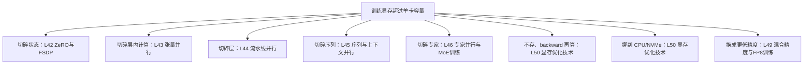

# L40 训练显存全解剖：16 B/参数、activation 与 memory wall

> [!abstract] 本课速览
> 读完你将能够：
> 1. 用 16 B/参数记账法拆出 BF16 参数、BF16 梯度、FP32 主参数和 Adam 状态；
> 2. 把论文中的 activation 公式换成本课程符号，判断 batch、序列长度和 attention 怎样放大显存；
> 3. 独立复算 Llama-3-8B 在朴素训练与 memory-efficient attention 下的显存数量级；
> 4. 区分模型状态、activation、框架额外占用与碎片，解释为什么理论值总比实测值小；
> 5. 从“切碎、不存、挪走、换格式”四类动作读懂 M6–M7 的显存解法地图。
>
> 前置：[[L06 优化器]] · [[L05 反向传播与梯度]] · [[L13 自回归生成与KV缓存]] · 预计 50 分钟

## 论文里的这段话，你现在可能读不懂

> [!quote]
> Training keeps BF16 parameters and gradients together with FP32 master weights and Adam optimizer states, giving a static model-state footprint of 16 bytes per parameter. Activations remain resident until backward, and their memory grows with micro-batch size and sequence length, including a quadratic attention term. We therefore combine state sharding, activation checkpointing, and memory-efficient attention to fit the training run within device memory.（改写自典型论文表述）

这三句把两本账揉在了一起：一边是只看参数量就能估的静态账，另一边是随 workload 和实现变化的 activation 账。若把“8B 模型的 BF16 权重约 16 GB”直接当成训练显存，你会少算至少七份同等大小的状态，还没开始算中间结果。

## 一、为什么“参数装得下”不等于“模型训得动”

### 1.1 先把一份参数的随身行李摊开

**memory footprint**（内存占用）不是文件有多大，而是某一执行阶段同时驻留在 GPU HBM 中的所有数据之和。朴素的 Adam 混合精度全参训练，按 [[03 约定与符号]] 的统一口径，对每个 **parameter**（参数）要准备下面几份数据：

| 项目 | dtype | 每参数字节 | $N$ 个参数的占用 | 为什么要留 |
|---|---:|---:|---:|---|
| 模型参数 | BF16 | 2 B | $2N$ B | forward/backward 实际使用 |
| **gradient**（梯度） | BF16 | 2 B | $2N$ B | backward 产生，供本 step 更新 |
| **master weights**（主参数） | FP32 | 4 B | $4N$ B | 用更高精度累计细小更新 |
| Adam 一阶矩 $m$ | FP32 | 4 B | $4N$ B | 保存历史梯度方向 |
| Adam 二阶矩 $v$ | FP32 | 4 B | $4N$ B | 保存历史平方梯度尺度 |
| **合计** |  | **16 B** | **$16N$ B** | activation 另算 |

严格说，Adam 的 **optimizer states**（优化器状态）通常特指 $m$、$v$，共 $8N$ B；本课程的 16 B 训练账把与 optimizer 更新相关的 FP32 master weights 也并入这一大桶，所以这一桶共 $12N$ B。看到论文写“optimizer states”，先检查它是否把 master weights 算在里面，不要只对名词、不对字节。

这种“先问每个参数带几字节”的方法叫 **per-parameter bytes**（每参数字节记账）。于是朴素静态账是

$$
M_{\text{static}}=N(2+2+4+4+4)=16N\ \text{B}.
$$

这里的 **static/model states**（静态项 / 模型状态）不是说数值不更新，而是说张量形状主要由 $N$ 决定：batch 或序列长度改变时，这部分容量基本不变。一次训练 step 中，这些数据的 **residency**（驻留性）要求它们在需要的时间窗里真实留在 HBM；不能把磁盘上的 checkpoint 大小当成驻留显存。[[03 约定与符号]] 中 checkpoint 是约 14 B/参数，因为持久化快照通常不存梯度，这和训练时 16 B/参数是两套口径。

```text
每格 = 16 GB
8B 训练静态 | P | G | W | W | m | m | v | v | 128 GB
8B 推理权重 | P |                             |  16 GB

P = BF16 参数，G = BF16 梯度，W = FP32 master weights
m / v = FP32 Adam 一阶矩 / 二阶矩
```

图中训练静态项是推理权重的 $128/16=8$ 倍。推理还要另算 [[L13 自回归生成与KV缓存|KV 缓存]] 和运行时空间；这里的 8 倍只是在相同 BF16 权重口径下比较“训练静态项”和“推理权重”。

> [!tip] 直觉：搬家与做饭
> 参数像厨房里固定的锅碗，梯度与 Adam 状态像每口锅配套的账本；activation 像做这一桌菜时临时铺开的食材。锅碗数量由模型决定，台面会不会爆则还取决于一次做几桌、每桌多少道菜。

### 1.2 静态账只是地板，不是天花板

把模型状态看成一条容量地板，会立刻得到两个结论：

- 8B 模型：$16\times8\times10^9=128\times10^9$ B = **128 GB**，仅静态项就超过一张 80 GB H100 SXM；
- 70B 模型：$16\times70\times10^9=1.12\times10^{12}$ B = **1.12 TB**。

若存在完美切分状态的机制，70B 静态项的纯容量下界是

$$
\left\lceil\frac{1120\ \text{GB}}{80\ \text{GB/卡}}\right\rceil=14\ \text{卡}.
$$

但 14 卡恰好没有给 activation 和运行时留一字节，而且“有 14 张卡”不会自动切分数据。朴素 data parallelism 会在每卡复制完整状态，仍然每卡 1.12 TB；要让这道除法成立，必须用 [[L42 ZeRO与FSDP]]、[[L43 张量并行]] 或 [[L44 流水线并行]] 等机制明确切开它。

## 二、activation 为什么会随 workload 爆炸

### 2.1 backward 要沿路找回什么

[[L05 反向传播与梯度]] 讲过，backward 计算局部梯度时要用 forward 的输入或中间结果。**activation memory**（激活显存）就是为这些 backward 依赖保留的中间 tensor。若 forward 刚算完就把它们全扔掉，backward 到这一层时便没有足够信息求梯度。

这就是静态项和 activation 最重要的管理差异：

| 对比 | static/model states | activation memory |
|---|---|---|
| 主要随什么增长 | 参数量 $N$ | 层数 $L$、序列长度 $S$、micro-batch $b$、宽度 $d$，以及 kernel/并行策略 |
| step 之间是否复用 | 是 | 通常每个 step 重新产生 |
| 常见动作 | sharding、低精度、offload | recomputation、sequence/context parallel、memory-efficient kernel |
| 直觉 | 固定资产 | 随订单量变化的流动库存 |

### 2.2 把 Megatron 论文的符号翻译成本课程符号

[《Reducing Activation Recomputation in Large Transformer Models》](https://proceedings.mlsys.org/paper_files/paper/2023/hash/80083951326cf5b35e5100260d64ed81-Abstract-mlsys2023.html)（MLSys 2023）对无模型并行、混合精度的 GPT 式 Transformer 给出每层估算。原论文公式 (1) 写作

$$
sbh\left(34+5\frac{as}{h}\right)\ \text{B},
$$

其中原文 $s$ 是序列长度、$b$ 是 micro-batch、$h$ 是 hidden size、$a$ 是 attention 头数。原文的 $h$ 和本课程“$h$ 表示头数、$d$ 表示 hidden size”的约定冲突。逐项换名：

$$
s\rightarrow S,\qquad b\rightarrow b,\qquad h_{\text{paper}}\rightarrow d,\qquad a_{\text{paper}}\rightarrow h.
$$

于是本课程写成

$$
\boxed{M_{\text{act,layer}}\approx Sbd\left(34+5\frac{hS}{d}\right)\ \text{B}}
=34Sbd+5hbS^2\ \text{B}.
$$

第一项对 $S$ 线性增长；第二项来自朴素 attention 保存的 score、softmax 等中间量，对 $S$ 平方增长。把 $S$ 加倍时，前者变成 $2\times$，后者变成 $4\times$。这正是长序列容易撞上 **memory wall**（内存墙）的原因：算力还没吃完，HBM 容量先不够了。本课主要讨论容量墙；另一些论文用 memory wall 指算力增长快于内存带宽的“带宽墙”，读上下文才能判定。

> [!warning] 这个公式是估算器，不是 `torch.cuda.max_memory_allocated()` 的预言
> 34 和 5 来自论文所分析的 GPT 式 block、dtype、保存策略与 kernel。Llama-3 的 GQA、SwiGLU、RMSNorm、融合算子和框架实现都可能改变常数。它适合做数量级推演和比较 $S$、$b$ 的趋势，不应冒充 Llama-3-8B 的实测峰值。

### 2.3 FlashAttention 与 activation checkpointing 分别扔掉什么

朴素 attention 会把 $S\times S$ 的中间矩阵写入 HBM 并留给 backward。[**FlashAttention**](https://proceedings.neurips.cc/paper/2022/hash/67d57c32e20fd0a7a302cb81d36e40d5-Abstract-Conference.html)（IO 感知精确 attention）用 tiling、online softmax 和 backward 重算避免让整张二次矩阵常驻；它仍做精确 dense attention，额外显存随 $S$ 线性而非平方增长。因此在上式的教学口径下，可以把 $5hS/d$ 这一二次驻留项去掉，写成

$$
M_{\text{act,layer,mem-eff}}\approx34Sbd\ \text{B}.
$$

这只是“沿用同一公式、移除 $S^2$ 项”的可复算估算，不表示某个 FlashAttention 版本的真实系数恰好为 34。

更一般的 **activation checkpointing**（激活检查点）会只保留少数层边界或选定 tensor，backward 时重新执行部分 forward。这里的 checkpoint 是内存中的计算边界，不是写到存储上用于故障恢复的训练 checkpoint。它的交换很直接：少存 activation，代价是多算一遍。MLSys 2023 论文把这类做法称为 activation recomputation，并进一步讨论 selective recomputation；[[L50 显存优化技术]] 会完整展开。

## 三、算一算：8B 到底差多少显存

> [!example] 算一算：Llama-3-8B，$S=8192$、$b=1$
> 参数来自 [[03 约定与符号]]：$N=8\times10^9$、$L=32$、$d=4096$、query 头数 $h=32$；容量按 SI 字节换算。
>
> **第一步：静态项。**
>
> $$
> M_{\text{static}}=16N
> =16\times8\times10^9
> =128\times10^9\ \text{B}
> =128\ \text{GB}.
> $$
>
> 其中参数 16 GB、梯度 16 GB、master weights 32 GB、$m$ 32 GB、$v$ 32 GB。activation 还没进场，80 GB 已经不够。
>
> **第二步：朴素 attention 的每层 activation。**
>
> $$
> Sbd=8192\times1\times4096=33{,}554{,}432,
> $$
>
> $$
> 5\frac{hS}{d}
> =5\times\frac{32\times8192}{4096}
> =320.
> $$
>
> 因而
>
> $$
> M_{\text{act,layer}}
> \approx33{,}554{,}432\times(34+320)
> =11{,}878{,}268{,}928\ \text{B}
> \approx11.9\ \text{GB}.
> $$
>
> 32 层合计
>
> $$
> M_{\text{act,total}}
> \approx32\times11.8788
> \approx380.1\ \text{GB}.
> $$
>
> 静态项加 activation 约 $128+380.1=508.1$ GB，还未计运行时零头。
>
> **第三步：移除 $S^2$ 驻留项的教学估算。**
>
> $$
> M_{\text{act,layer,mem-eff}}
> \approx33{,}554{,}432\times34
> =1{,}140{,}850{,}688\ \text{B}
> \approx1.14\ \text{GB},
> $$
>
> $$
> M_{\text{act,total,mem-eff}}
> \approx32\times1.1409
> \approx36.5\ \text{GB}.
> $$
>
> 总计仍约 $128+36.5=164.5$ GB。结论不是“FlashAttention 没用”，而是：它解决了 activation 的二次项，却没有碰 128 GB 的模型状态。==不开状态切分、模型并行、offload 等优化时，8B 全参训练仍放不进一张 80 GB 卡。==

### 3.1 反过来问：80 GB 最多训练多大模型

先做不可能被突破的静态上界：假装 activation 和运行时占用都是 0，

$$
N_{\max,\text{static-only}}
=\frac{80\times10^9\ \text{B}}{16\ \text{B/参数}}
=5\times10^9
=5\text{B 参数}.
$$

所以 5B 只是纸面上限，不是可运行答案。更诚实的筛选式是

$$
N_{\max}=\frac{80\ \text{GB}-M_{\text{activation}}-M_{\text{runtime}}}{16\ \text{B/参数}}.
$$

若候选 4B 模型，静态项已占 $16\times4=64$ GB，只剩 16 GB 给 activation 与运行时；候选 3B 模型静态项占 48 GB，剩 32 GB。于是“3–4B”是一个先检查的候选带，不是脱离 $L,S,b,d,h$ 和 kernel 就能保证的容量定律。拿到具体模型后仍要把 activation 公式代回去。

## 四、为什么论文表格和你的实测总差一截

截至这里，我们只数了主要 tensor。实际训练进程还会占用：

- CUDA context 与框架运行时元数据；
- NCCL 通信 buffer——即使本课先做单卡账，进入分布式训练后它也会出现；
- GEMM、attention、optimizer kernel 的临时 **workspace**（工作空间）；
- allocator 为复用而保留的块，以及对齐、生命周期交错造成的 **fragmentation**（碎片）。

[[L21 GPU内存体系]] 已区分 `reserved` 与 `allocated`：缓存分配器可以让 reserved 明显高于当前活跃 tensor 的 allocated；碎片还可能导致“总空闲看着够，却找不到合适连续块”的 OOM。因此论文的解析公式应该与“活跃 tensor 理论账”比较，而不是要求它逐字节等于设备总占用。

> [!warning] 三个常见误区
> 1. **“显存就是参数大小。”** 那只接近推理权重账；Adam 混合精度训练先按 16 B/参数，再加 activation。
> 2. **“OOM 就加几张卡。”** 不改并行策略时，data parallelism 复制整套状态，单卡 footprint 不会下降。
> 3. **“用了 FlashAttention 就不会 OOM。”** 它主要拿掉 attention 的 $S^2$ 常驻中间量，不会自动切分参数、梯度和 optimizer states。

## 五、解法地图：本模块接下来在切什么



- **切碎状态**：[[L42 ZeRO与FSDP]] 把参数、梯度和 optimizer states 分给多个 ranks；
- **切碎模型**：[[L43 张量并行]] 切矩阵，[[L44 流水线并行]] 切层；
- **切碎序列**：[[L45 序列与上下文并行]] 把 token 维分给多个 ranks；
- **切碎专家**：[[L46 专家并行与MoE训练]] 让不同 ranks 驻留不同 experts；
- **不存或挪走**：[[L50 显存优化技术]] 讲 recomputation、CPU/NVMe offload 和内存池；
- **换格式**：[[L49 混合精度与FP8训练]] 用更少字节表示训练数据，同时处理数值稳定性。

每条路都不是免费午餐。切分通常新增 collective 或点到点通信；recomputation 用计算换容量；offload 用 PCIe/存储带宽换 HBM；低精度要处理 scale 与溢出。系统论文真正优化的，往往不是“把显存降到最低”，而是在容量约束下平衡 step time、通信、吞吐和可部署性。

### 本课三账

| 账 | 本课基线结论 | 后续优化会改什么 |
|---|---|---|
| 显存账 | Adam 混合精度静态项 $16N$ B；activation 另算 | sharding、并行、重算、offload、低精度 |
| 通信账 | 单卡基线为 0；“多卡容量相加”本身不成立 | 切分后用通信换单卡容量，具体字节见 L41–L47 |
| 适用条件 | 16 B 只适用于本课程规定的 BF16 参数/梯度 + FP32 master/$m$/$v$ 口径 | optimizer、gradient dtype、模型结构、$S$、$b$、kernel 变了都要重算 |

## 回到开头那段话

第一句说：训练不只留一份 BF16 参数。2 B 参数 + 2 B 梯度 + 4 B master weights + 4 B 一阶矩 + 4 B 二阶矩，正好是 16 B/参数；它们属于随 $N$ 变化的 static/model states。

第二句说：forward 中间结果要保持 residency，等 backward 使用；activation memory 随 $b$、$S$、$d$、$L$ 变化，其中朴素 attention 还有 $5hbS^2$ 的二次项。它和静态项不是同一本账。

第三句说：因此系统要组合多种手段。state sharding 切模型状态，activation checkpointing 用重算换显存，memory-efficient attention 避免 $S^2$ 中间矩阵常驻。现在你还应补上一句论文没写出的检查：这些手段分别增加多少通信、计算或数据搬运？这正是后续 M6–M7 要算的账。

## 术语卡片

| 术语 | 中文 | 一句话解释 |
|---|---|---|
| memory footprint | 内存占用 | 某执行阶段同时占用设备内存的数据总量。 |
| static/model states | 静态项 / 模型状态 | 容量主要由参数量决定的参数、梯度及 optimizer 相关状态；“静态”不表示值不更新。 |
| activation memory | 激活显存 | 为 backward 保留的 forward 中间结果及相关元数据所占显存。 |
| parameter | 参数 | 训练可更新、决定模型计算行为的数值。 |
| gradient | 梯度 | loss 对参数的偏导，backward 产生并供 optimizer 更新使用。 |
| optimizer states | 优化器状态 | optimizer 跨 step 保存的历史 tensor；Adam 主要为 $m$、$v$，宽口径有时连 master weights 一起计。 |
| master weights | 主参数 | 混合精度训练中用于高精度累计更新的 FP32 参数副本。 |
| activation checkpointing | 激活检查点 | 少存一部分 forward 中间结果，在 backward 时重算以节省显存。 |
| per-parameter bytes | 每参数字节记账 | 把每种同参数规模 tensor 的 dtype 字节相加，快速估算静态训练显存。 |
| residency | 驻留性 | 数据在某段执行时间内必须真实保留在目标内存层级的要求。 |
| fragmentation | 碎片 | 总空闲容量尚可，但缺少满足大小、连续性或生命周期要求的可用块。 |
| memory wall | 内存墙 | 内存容量或带宽先于算力成为扩展瓶颈；本课主要指 HBM 容量墙。 |

## 自测

1. 为什么 BF16 8B 模型推理权重约 16 GB，而朴素 Adam 混合精度训练静态项是 128 GB？
2. `optimizer states = 12N B` 与“Adam 的 $m,v$ 共 8N B”矛盾吗？
3. 按本课口径，3B 模型的训练静态项是多少 GB？一张 80 GB 卡还剩多少 GB 给其他占用？
4. 对 Llama-3-8B、$S=8192$、$b=1$，复算 $5hS/d$ 和朴素每层 activation；若 $b$ 变成 2，结果怎样变化？
5. 其他量不变时，把 $S$ 从 8192 减为 4096，$34Sbd$ 项和 $5hbS^2$ 项分别变为原来的多少？
6. 为什么给一个 OOM 作业增加 data-parallel replicas，不一定降低单卡 memory footprint？
7. 你要研究跨节点长序列训练：若选择 context parallelism、activation checkpointing、offload 三条路线，分别最先检查哪一种系统代价？

> [!note]- 参考答案
> 1. 推理比较项只含一份 BF16 权重，即 $2N=16$ GB；训练静态项还含 BF16 梯度、FP32 master weights、FP32 $m$ 和 $v$，合计 $16N=128$ GB。KV cache 和 activation 都未混入这组比较。
> 2. 不矛盾。严格的 Adam 历史状态 $m,v$ 是 $8N$ B；16 B 记账常把 FP32 master weights 的 $4N$ B 与它们合称 optimizer-related states，于是这一大桶是 $12N$ B。读论文要核对作者分桶方式。
> 3. $16\times3\times10^9=48$ GB，静态上还剩 $80-48=32$ GB；这 32 GB 必须同时容纳 activation、context、workspace、通信 buffer 与碎片余量，所以不能直接宣布“3B 一定能训”。
> 4. $5hS/d=5\times32\times8192/4096=320$；每层约 $33{,}554{,}432\times354\approx11.9$ GB。公式对 $b$ 线性，$b=2$ 时约 23.8 GB/层。
> 5. 线性项变为 $1/2$，二次项变为 $1/4$。这也是缩短序列对朴素 attention activation 特别有效的原因。
> 6. 朴素 data parallelism 在每个 replica 上复制完整参数、梯度和 optimizer states；增加 replicas 只是增加副本数量。只有 sharding/model parallel 等明确切分数据时，单卡 footprint 才下降。
> 7. context parallelism 先查跨 rank 的 attention 通信量和关键路径；activation checkpointing 先查重算 FLOPs 与 step-time 增量；offload 先查 PCIe/主机内存/存储带宽和能否与计算重叠。

## 延伸阅读

- [《ZeRO: Memory Optimizations Toward Training Trillion Parameter Models》](https://sc20.supercomputing.org/proceedings/tech_paper/tech_paper_pages/pap379.html)（SC 2020）：先读第 3 节的模型状态记账，理解为什么“冗余状态可切分”是数据并行的结构性机会。
- [《Reducing Activation Recomputation in Large Transformer Models》](https://proceedings.mlsys.org/paper_files/paper/2023/hash/80083951326cf5b35e5100260d64ed81-Abstract-mlsys2023.html)（MLSys 2023）：精读第 4 节，重点看公式 (1) 的 activation 分解、sequence parallelism 与 selective recomputation。
- [《FlashAttention: Fast and Memory-Efficient Exact Attention with IO-Awareness》](https://proceedings.neurips.cc/paper/2022/hash/67d57c32e20fd0a7a302cb81d36e40d5-Abstract-Conference.html)（NeurIPS 2022）：先抓住“不把 $S^2$ 中间矩阵写回 HBM”这条主线，再读 IO complexity 证明。

---
上一课：[[L39 实践-动手集合通信]] ← · → 下一课：[[L41 数据并行与DDP]]
