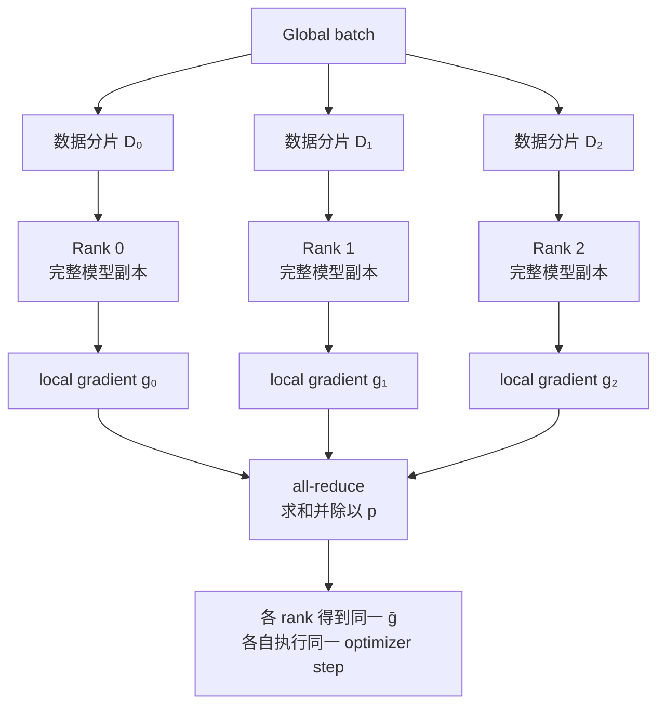
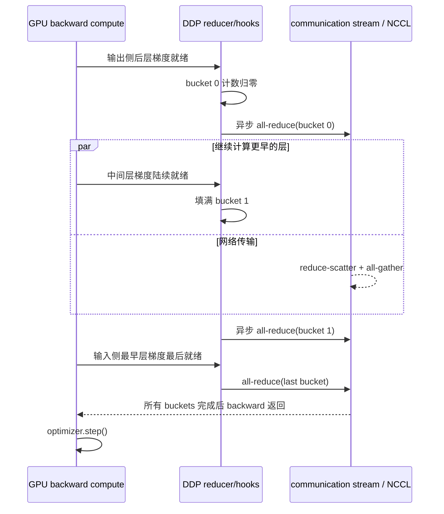
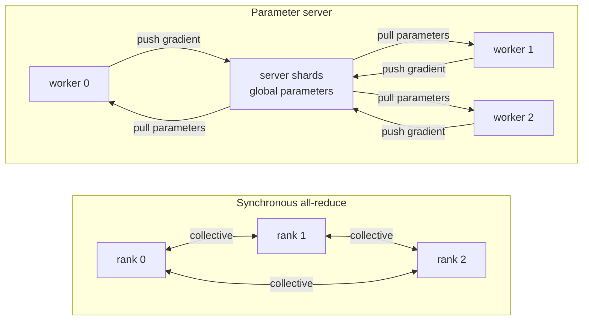

# L41 数据并行与DDP：从梯度同步到通信-计算重叠

> [!abstract] 本课速览
> 读完你将能够：
> 1. 从梯度公式证明同步 data parallel 与同一 global batch 的单副本训练等价，并说清等价的前提；
> 2. 画出 DDP 从 backward 产出梯度、装桶到 all-reduce 的时序，解释 bucket 大小为何是启动开销与重叠窗口的折中；
> 3. 分别核算 DP 的显存、通信和适用条件，识别“每 rank 通信量近似不随 DP 度增长”的边界；
> 4. 用 8B、64 卡教学算例估计计算/通信比，并先检查该配置能否通过单卡容量门槛；
> 5. 区分同步 all-reduce 与 parameter server 的 BSP、ASP 和 bounded-delay 语义。
>
> 前置：[[L40 训练显存全解剖]] · [[L36 集合通信原语]] · [[L37 通信算法与代价模型]] · 预计 50 分钟

## 论文里的这段话，你现在可能读不懂

> [!quote]
> Each data-parallel replica processes a disjoint local batch, and synchronous SGD averages gradients before every optimizer step. DDP buckets gradients in approximate backward order and launches asynchronous all-reduce operations to overlap communication with the remaining backward computation. During gradient accumulation, `no_sync` skips intermediate synchronizations; scaling to more workers therefore changes both the global batch and the optimization regime. Unlike an asynchronous parameter server, this bulk-synchronous design avoids gradient staleness but exposes the step to the slowest worker.（改写自典型论文表述）

这四句横跨了数学语义、框架实现、网络时序与优化算法。最容易犯的错，是只记住“加卡切数据”，却没问三件事：每卡到底存什么、每 step 到底传多少、所有卡何时才能进入下一步。

## 一、为什么复制模型也能得到同一个梯度

### 1.1 切数据，不切模型

**data parallelism**（数据并行，DP）做的事很朴素：每张 GPU 放一份完整模型 **replica**（副本），把 global batch 沿数据维切成互不重叠的 local batches。每个 rank 独立执行 forward 和 backward，随后再同步梯度。

设有 $p$ 个 ranks，每个 rank 的 local batch 都有 $b$ 个样本；先令梯度累积次数 $\mathrm{GA}=1$。rank $r$ 对本地平均 loss 求出的梯度是

$$
g_r=\frac{1}{b}\sum_{x\in\mathcal D_r}\nabla_\theta \ell(x;\theta).
$$

**gradient synchronization**（梯度同步）把各 rank 的梯度求和并按 $p$ 平均：

$$
\bar g
=\frac{1}{p}\sum_{r=0}^{p-1}g_r
=\frac{1}{pb}\sum_{r=0}^{p-1}\sum_{x\in\mathcal D_r}\nabla_\theta\ell(x;\theta).
$$

右边正是把 $pb$ 个样本拼成一个 global batch 后，对平均 loss 求出的梯度。只要各 replica 从相同参数和 optimizer state 出发，收到同一个 $\bar g$ 后又执行相同更新，它们就会继续保持一致。这种“每步都等所有 ranks 汇合，再一起更新”的语义叫 **synchronous SGD**（同步随机梯度下降）。

按 [[03 约定与符号]]，有梯度累积时

$$
B=b\times\mathrm{DP}\times\mathrm{GA}.
$$

这里的 $B$ 是每次参数更新共同贡献梯度的样本数；若每个样本是一条长度为 $S$ 的定长序列，对应 token 数是 $BS$。

> [!warning] “数学等价”有条件
> 1. 上式假设各 rank 的 local batch 大小相同、样本权重相同，且 loss 采用一致的平均口径。最后一个不齐的 batch 若让各 rank 样本数不同，简单的“按 rank 平均”不再等于“按样本平均”。
> 2. 随机数、浮点规约顺序、dropout 与非确定性 kernel 仍可能让逐 bit 结果不同；等价指目标梯度与更新语义，而非承诺 bitwise identical。
> 3. DDP 同步的是梯度，不是每 step 重新广播参数。参数之所以一致，是因为各 rank 用相同梯度和状态执行相同 optimizer step。

> [!tip] 直觉：多人批改后合并红笔
> 每位助教拿同一版答案模板，分别批一叠互不重叠的试卷。只有把每叠试卷的平均修改意见再按试卷数合并，所有助教才会写出同一版新模板；直接让每个人各改各的，下一轮模板就分叉了。

## 二、DDP 怎样让梯度边算边传

### 2.1 从“backward 完再通信”到梯度桶

PyTorch 的 **DistributedDataParallel (DDP)**（分布式数据并行封装）通常采用“一 GPU 一进程”：每个进程持有完整 module，应用负责用 sampler 等机制给它不同数据，DDP 负责在 backward 中同步梯度。

最简单的实现是：等整个 backward 完成，再对每个参数梯度逐个调用 all-reduce。它正确，却同时踩中两个性能坑：

- 小 tensor 太多，每次 collective 都要支付固定启动代价 $\alpha$；
- 通信被硬塞到 backward 之后，算力和网络不能同时工作。

**gradient bucketing**（梯度装桶）先把多个小梯度组织成较大的 bucket，再按 bucket 调用 all-reduce。大桶减少 collective 次数，因而摊薄 $\alpha$；但桶必须等内部最后一个梯度就绪才能发送，太大又会推迟第一笔通信。

DDP 在参数的 gradient accumulator 上注册 hook。一个梯度算完，hook 就把对应 bucket 的“未就绪计数”减一；计数归零时，DDP 异步发起该桶的 all-reduce。由于 backward 大致按 forward 的反方向计算，靠近模型输出的后层梯度先就绪，因此 DDP 按近似反向参数顺序组织和发射 buckets。这个顺序是工程近似：动态计算图或参数注册顺序与真实执行顺序不一致时，重叠效果会变差。各 ranks 还必须按同一 bucket index 顺序调用 collectives；某个后序桶即使先就绪也不能随意“插队”，否则 collective 配对可能错位甚至挂起。

### 2.2 主图：backward 与 all-reduce 的重叠窗口

这就是 **communication-computation overlap**（通信-计算重叠）：bucket 0 在网络上飞时，GPU 仍在计算更靠前层的 backward。重叠不是把通信字节“消灭”，而是把其中一部分塞进原本就要花的计算时间。最后一个 bucket 只能在 backward 尾部发出，它的完成时间通常仍暴露在 step 关键路径上。

bucket 大小因而没有脱离 workload 的万能答案：

| bucket 选择 | 好处 | 代价 |
|---|---|---|
| 很小 | 第一桶早发，潜在重叠窗口大 | collective 多，$\alpha$ 与 kernel/调度开销高 |
| 很大 | 大消息带宽效率高，启动次数少 | 等梯度凑齐更久，尾部通信更难隐藏 |
| 中间值 | 在两者之间折中 | 最优点依模型结构、网络、backend 与 rank 数变化，需 profile |

### 2.3 `no_sync` 与梯度累积

如果要连续处理 $\mathrm{GA}$ 个 micro-batches 后才更新一次参数，前 $\mathrm{GA}-1$ 次 backward 没必要都 all-reduce。DDP 的 **`no_sync`**（暂缓梯度同步上下文）允许这些 backward 只在本地累积 `.grad`；最后一次 forward-backward 离开该上下文，才触发同步，然后执行一次 `optimizer.step()`。

因此 `no_sync` 改的是同步频率，不是模型副本数，也不会自动修正 loss scale。应用仍要保证：forward 也包含在该上下文中、累积期间不提前更新参数，并按训练代码的 loss reduction 方式正确缩放。此时 $B=b\times p\times\mathrm{GA}$，每个 optimizer step 仍同步一次完整梯度。

## 三、DP 的三账：显存、通信、适用条件

### 3.1 显存账：不除以 DP

[[L40 训练显存全解剖]] 的 Adam 混合精度静态账是 $16N$ B。纯 DP 在每个 rank 上复制参数、梯度、FP32 master weights、Adam 一阶矩和二阶矩，所以

$$
M_{\text{rank}}
\approx16N+M_{\text{activation}}(b,S)+M_{\text{runtime}}+M_{\text{DDP buffers}},
$$

而不是 $16N/p$。DDP 的 buckets 和通信运行时还可能增加额外 buffer；“DP 一点不省显存”准确地说，是它不切分任何一类模型状态，不能降低 $16N$ 这条单卡地板。

所以 DP 是吞吐的朋友，却是解决单卡 OOM 时的错误工具。模型状态或 activation 放不进一张卡，应转向 [[L42 ZeRO与FSDP]]、[[L43 张量并行]]、[[L44 流水线并行]] 等明确切分机制。

### 3.2 通信账：近似与 $p$ 无关，说的是每 rank 带宽项

BF16 梯度大小是

$$
n_{\text{grad}}=2N\ \text{B}.
$$

按 [[03 约定与符号]] 的 ring all-reduce 口径，每个 rank 在每个方向传输

$$
V_{\text{send}}=V_{\text{recv}}
=2n_{\text{grad}}\frac{p-1}{p}
=4N\frac{p-1}{p}\ \text{B}
\xrightarrow[p\to\infty]{}4N\ \text{B}.
$$

这里的“约 $4N$ B”不是发送再加接收后的双倍数；全双工端口可同时收发，链路时间用单方向端口速率与 $V_{\text{send}}$（或同样大的 $V_{\text{recv}}$）相除。若把全双工两向流量做审计，收发合计才是约 $8N$ B。

“DP 通信量与卡数无关”也要补齐三个限定：

1. 它说的是 bandwidth-dominated ring 中的**每 rank、每方向、渐近字节数**；
2. ring 的 $2(p-1)\alpha$ 会随 $p$ 增长，真实拓扑、拥塞和 straggler 也会让时间变差；
3. 全集群发送字节约为 $pV_{\text{send}}$，当然随 $p$ 增长，不能把每 rank 结论偷换成“网络总负载不变”。

相应的理想时间模型是

$$
T_{\text{comm}}
\approx2(p-1)\alpha
+\frac{4N(p-1)}{p\,BW},
$$

其中 $BW$ 必须使用每方向的有效带宽；若只有端口线速，这只是乐观下界。

### 3.3 适用条件：先过容量门，再谈重叠

纯 DDP 是下面条件同时成立时的默认基线：

- 完整模型状态、local-batch activation 与运行时空间能放进单卡；
- 每卡 local work 足以让 GPU 高效计算，并给通信留下可重叠窗口；
- global batch 没越过优化算法和样本效率能接受的范围；
- 训练网络能承载同步 all-reduce，慢 rank 不会频繁拖住全组。

> [!example] 算一算：8B、DP=64、H100 + 400 Gb/s
> **先声明边界。** 参数和硬件来自 [[03 约定与符号]]：$N=8\times10^9$，H100 SXM BF16 dense 峰值约 $989\ \text{TFLOPS}$，400 Gb/s 每方向等于 50 GB/s，collective 的 $\alpha$ 取约 $10\ \mu\text{s}$ 量级。设计稿另给教学假设：每卡 $b=2$、$S=8192$，计算达到 dense 峰值的 40%。
>
> 第一关其实已经失败：纯 DP 每卡静态模型状态是
>
> $$
> 16N=16\times8\times10^9=128\ \text{GB},
> $$
>
> 大于 H100 的 80 GB，还没算 activation。==所以这不是一套可直接运行的纯 DDP 配置==；下面只把它当作隔离“若容量问题已不存在，计算与网络各需多久”的性能模型。若用 ZeRO 等解决容量，通信账也必须按对应策略重算，不能照搬本例。
>
> **通信时间。** BF16 梯度 $n_{\text{grad}}=2N=16$ GB。$p=64$ 时，每 rank 发送、同时也接收
>
> $$
> V_{\text{dir}}
> =2\times16\times\frac{63}{64}
> =31.5\ \text{GB}.
> $$
>
> 用 50 GB/s 单方向端口线速估算 bandwidth term：
>
> $$
> T_{\text{bw}}\ge\frac{31.5\ \text{GB}}{50\ \text{GB/s}}=0.63\ \text{s}.
> $$
>
> ring 的 latency term 约为
>
> $$
> T_\alpha\approx2(64-1)\times10\ \mu\text{s}=1.26\ \text{ms}.
> $$
>
> 因此按理想线速下界，$T_{\text{comm}}\gtrsim0.631$ s；协议效率、拓扑共享与拥塞只会把实际值推高。
>
> **计算时间。** 每卡本 step 处理 $bS=2\times8192=16{,}384$ tokens。按训练约 $6N$ FLOPs/token：
>
> $$
> C_{\text{rank}}
> =6\times8\times10^9\times16{,}384
> =7.86432\times10^{14}\ \text{FLOPs}.
> $$
>
> 40% 教学效率下的速率是
>
> $$
> 989\times10^{12}\times0.40
> =3.956\times10^{14}\ \text{FLOPS},
> $$
>
> 所以
>
> $$
> T_{\text{comp}}
> \approx\frac{7.86432\times10^{14}}{3.956\times10^{14}}
> \approx1.99\ \text{s}.
> $$
>
> 若完全串行，通信占二者总时间
>
> $$
> \frac{0.631}{1.99+0.631}\approx24.1\%.
> $$
>
> 理想 overlap 的 step 下界接近 $\max(1.99,0.631)=1.99$ s，而不是两者相加；实际还会暴露最后 buckets 的尾巴。这个例子的正确结论有两层：网络侧看，约 2 s 计算有机会藏住 0.63 s 通信的大部分；容量侧看，纯 DDP 根本过不了 80 GB 门槛。

## 四、什么时候通信开始吃掉扩展性

把计算与通信两式相除，可得一个先做纸面筛选的比值：

$$
\rho
=\frac{T_{\text{comm}}}{T_{\text{comp}}}
\approx
\frac{2(p-1)\alpha+4N(p-1)/(pBW)}{6NbS/(\eta F_{\text{peak}})},
$$

其中 $\eta$ 是相对 dense 峰值的计算效率。$\rho\ll1$ 时，通信较容易藏在 backward 里；$\rho$ 接近或超过 1 时，网络更可能主导 step。

这个式子给出四个系统直觉：

- $bS$ 越大，每卡计算越厚，同一份梯度通信越容易隐藏；
- 固定 global batch 增加 DP 时，$b$ 被迫减小，计算缩短但梯度大小不变，属于难做的 strong scaling；
- bandwidth term 中 $N$ 在分子分母大致抵消，但小模型更容易让 $\alpha$、kernel launch 等固定开销显眼；
- $p$ 很大时，每 rank 字节数仍趋近常数，ring 轮数、拥塞域与慢 rank 风险却继续增长。

因此“小模型、大集群、小 local batch”通常最难 scale。DDP 的 overlap 也有上限：通信若比整个 backward 还长，怎么排桶都藏不完。

## 五、加卡也改变了优化问题

### 5.1 weak scaling：吞吐增加，global batch 也增加

若保持每卡 $b$ 不变、DP 从 $p$ 增到 $kp$，global batch 也从 $B$ 变成 $kB$。这属于 **weak scaling**：每卡工作量近似不变，总工作量随资源增长。系统 tokens/s 往往更好看，但每个 optimizer step 看过的数据变多，训练所需 step 数、收敛轨迹和泛化都可能变化。

经典 **linear scaling rule**（学习率线性缩放规则）建议 batch 放大 $k$ 倍时把 learning rate 也近似放大 $k$ 倍，并配合 warmup。它是特定训练条件下形成的实用启发，不是“DP 加倍必然保持精度”的数学定律。batch 继续增大后，噪声减少的边际收益会下降，甚至需要更多样本才能达到同等质量。

**LAMB**（面向大 batch 的逐层自适应优化器）是为扩大可用 batch 区间而提出的一类方法：它按层调节更新尺度，曾用于大 batch 的 BERT 训练。记住它的定位即可——LAMB 可以改变算法允许的 batch 上限，却不能让 global batch 约束消失，也不能修复网络和显存瓶颈。

这就是“DP 度不是想加就加”：

$$
\mathrm{DP}=\frac{B}{b\times\mathrm{GA}}.
$$

当 $B$ 有算法上限、$b$ 有显存与 kernel 效率下限、$\mathrm{GA}$ 又影响更新频率时，DP 度已经被三方夹住。[[L47 混合并行组装]] 会把这条 batch 预算与其他并行维度一起组装。

> [!warning] 吞吐、扩展效率和 time-to-accuracy 不是同一个指标
> 加卡后 tokens/s 上升，不代表达到同一 validation loss 的墙钟时间同比下降。比较 DP 方案时至少同时报告 global batch、训练 token/step 数、最终质量与硬件规模。

## 六、parameter server：另一条同步历史

### 6.1 worker 推、server 存

**parameter server**（参数服务器，PS）把角色拆成两类：**worker**（工作节点）拉取参数、用本地数据计算梯度并推送更新；**server**（参数节点）持有全局参数，参数很多时还可按 key range 分片到多个 servers。它不像 all-reduce 那样要求所有参与者对称地持有并规约完整 dense tensor。

PS 的关键价值是能选择不同一致性语义：

| 语义 | 谁要等谁 | 算法代价 | 系统收益 |
|---|---|---|---|
| **BSP**（Bulk Synchronous Parallel，批量同步并行） | 每个逻辑时钟设 barrier，所有 workers 完成本轮才推进 | 参数版本新鲜，但被最慢 worker 拖住 | 结果容易推理，接近同步 SGD |
| bounded delay / SSP | 最快 worker 不能领先最慢者超过给定时钟差 $\tau$ | 允许有限旧参数 | 在收敛风险与等待时间间折中 |
| **ASP**（Asynchronous Parallel，异步并行） | worker 不等全局 barrier，push/pull 可独立推进 | 可能读取旧参数并提交延迟梯度 | 隐藏慢节点与长时延，资源更松耦合 |

在 **asynchronous SGD**（异步 SGD）中，worker 可能基于参数版本 $t-\tau$ 算出梯度，但 server 收到时全局参数已到版本 $t$。这个版本落后量就是 **staleness**（陈旧度）。staleness 大时，梯度指向的是“过去位置”的下降方向，系统虽然少等了 barrier，却可能需要更多训练工作才能收敛，甚至不稳定。

### 6.2 为什么 dense GPU 训练更偏爱同步 all-reduce

对同构 GPU 上每步都会产生的 dense 梯度，all-reduce 有三点优势：

- 没有集中 server 必须吞下所有 workers 流量，链路角色更对称；
- 每步得到明确一致的平均梯度，没有 staleness 这笔算法债；
- ring、tree、分层 collective 能贴合 NVLink 与 scale-out 网络拓扑。

所以现代同构集群中的 dense 同步训练通常以 all-reduce/DDP 为基线。但“PS 被淘汰”同样是错的：参数访问稀疏、设备异构、参与方间歇在线、跨地域链路慢或需要中心化控制时，worker/server 解耦和放宽一致性仍有价值。联邦、边缘和跨域训练中的中心聚合器未必等同于 2014 年的 PS 实现，却继承了相似的角色分工；[[L63 跨域与跨集群训练]] 会再看到这条架构谱系。

## 七、把 DDP 当成网络系统问题

从系统与网络研究视角看，DDP 不是“调用一个 all-reduce API”就结束了。至少有四类可优化变量：

- **时间**：bucket 边界、发射顺序、通信 stream 与 backward 依赖决定 overlap；
- **空间**：rank 到 GPU/NIC/leaf 的映射决定流量经过哪一层拓扑；
- **速率**：多个 buckets、多个 jobs 竞争链路时，需要拥塞控制、调度与带宽隔离；
- **同步**：任一慢 rank 都会把 collective 尾部变成全组 step time，故障则可能让所有 ranks 一起停住。

你读 DDP 性能论文时，可以固定问一句：作者降低的是原始通信字节、$\alpha$ 次数、暴露在关键路径上的通信，还是 straggler 等待？这四种收益不能只用一个“communication overhead 降低”含糊带过。

### 本课三账

| 账 | 纯 DDP 基线 | 读论文时继续追问 |
|---|---|---|
| 显存账 | 每 rank 保留完整 $16N$ B 静态状态，activation 与 DDP buffers 另算 | 是否真的 sharding，还是只减少通信/复制开销？ |
| 通信账 | BF16 梯度 $2N$ B；ring 每 rank 每方向约 $4N(p-1)/p$ B/optimizer step | 用什么有效带宽、多少 $\alpha$、有多少暴露在关键路径？ |
| 适用条件 | 完整训练状态单卡装得下，global batch 可接受，local work 足够厚 | capacity、time-to-accuracy、网络拓扑和 straggler 哪个先限制扩展？ |

## 回到开头那段话

第一句说的是数学语义：每个 replica 处理互不重叠的 local batch；只要 batch 等大且 loss reduction 一致，synchronous SGD 对各 rank 梯度求平均，就等价于对拼接后的 global batch 求平均梯度。

第二句说的是 DDP 工程：gradient bucketing 用大消息摊薄 $\alpha$，近似 backward 顺序让后层 bucket 先就绪；异步 all-reduce 与更早层 backward 并行，形成 communication-computation overlap。

第三句把框架机制接到优化语义：`no_sync` 让前几次 micro-batch 只做本地 gradient accumulation，最后一次才同步；但更多 workers 或更大的 GA 会把 $B=b\times\mathrm{DP}\times\mathrm{GA}$ 推高，训练已经不再是原来的 batch regime。

第四句对比两种一致性：DDP 是 BSP 式的同步设计，没有 asynchronous SGD 的 staleness；代价是 all-reduce 必须等所有 ranks 以相同顺序参加，最慢 worker 会暴露在 step 尾部。现在你应该能把四句分别落到“数学账、时序账、batch 账、一致性账”。

## 术语卡片

| 术语 | 中文 | 一句话解释 |
|---|---|---|
| data parallelism | 数据并行 | 每个 rank 复制完整模型、处理不同数据分片，再同步梯度或参数。 |
| replica | 副本 | 驻留在一个 rank 上、结构和初始状态相同的完整模型实例。 |
| synchronous SGD | 同步 SGD | 所有 workers 完成本轮并聚合梯度后，才共同进入下一次参数更新。 |
| gradient synchronization | 梯度同步 | 聚合各 ranks 的本地梯度，使 replicas 在更新前获得一致梯度。 |
| DistributedDataParallel (DDP) | 分布式数据并行封装 | PyTorch 以多进程 replica 和 backward 梯度同步实现的数据并行模块。 |
| gradient bucketing | 梯度装桶 | 把多个小梯度合并成较大通信桶，以摊薄 collective 固定开销并支持流水。 |
| communication-computation overlap | 通信-计算重叠 | 在网络处理已就绪梯度时继续执行其余 backward，以隐藏部分通信时间。 |
| no_sync | 暂缓梯度同步 | DDP 中跳过若干次 backward 同步、只本地累积梯度的上下文。 |
| linear scaling rule | 学习率线性缩放规则 | batch 放大 $k$ 倍时将 learning rate 近似放大 $k$ 倍并配合 warmup 的经验启发。 |
| LAMB | 大 batch 逐层自适应优化器 | 按层调整更新尺度、用于扩大可训练 batch 区间的优化方法。 |
| parameter server | 参数服务器 | 由 servers 持有全局参数、workers 拉参数并推更新的分布式训练架构。 |
| worker | 工作节点 | 读取参数、处理本地数据并计算/提交梯度或更新的执行角色。 |
| server | 参数节点 | 持有和更新全局参数，可按 key range 切分的服务角色。 |
| asynchronous SGD | 异步 SGD | workers 不经全局 barrier 就读取参数和提交梯度的 SGD 执行方式。 |
| staleness | 陈旧度 | worker 计算梯度所用参数版本相对 server 当前版本的落后程度。 |
| BSP | 批量同步并行 | 每个逻辑轮次设置全局 barrier、等所有参与者完成后再推进的语义。 |
| ASP | 异步并行 | 不设置逐轮全局 barrier、允许 workers 独立推进的语义。 |

## 自测

1. 用两行公式说明：为什么 $p$ 个等大 local batches 的平均梯度，等于一个大小为 $pb$ 的 global batch 的平均梯度？
2. DDP 为什么不等整个 backward 结束后再统一 all-reduce？bucket 太小和太大分别有什么问题？
3. 按本课口径，3B 模型的 BF16 梯度有多大？$p=8$ 时 ring all-reduce 每 rank 每方向传多少 GB？
4. 8B、$p=64$ 的算例为什么一开始就不是可运行的纯 DDP 配置？忽略容量后，通信串行占计算+通信时间约多少？
5. 使用 `no_sync` 做 $\mathrm{GA}=4$ 时，哪几次 backward 不同步？何时才能调用 `optimizer.step()`？
6. 保持 $b$ 不变把 DP 加倍，为何不只是一个系统扩展动作，还改变了优化问题？
7. 分别解释 BSP、bounded delay、ASP 怎样处理快 worker 与慢 worker；staleness 出现在哪两种语义中？
8. 对跨地域、设备间歇在线且参数访问稀疏的训练，你会优先从 all-reduce 还是 parameter server 家族起步？列出两条系统理由和一条算法风险。

> [!note]- 参考答案
> 1. $g_r=\frac1b\sum_{x\in\mathcal D_r}\nabla\ell(x)$；再做 $\bar g=\frac1p\sum_rg_r=\frac1{pb}\sum_r\sum_{x\in\mathcal D_r}\nabla\ell(x)$。前提是各 local batch 等大且 loss/样本权重口径一致。
> 2. 及早发出已就绪 bucket，才能让 all-reduce 与剩余 backward 重叠。桶太小会反复支付 $\alpha$ 和发射开销；桶太大要等更多梯度，第一笔通信晚、尾巴更难藏。
> 3. BF16 梯度 $n=2N=6$ GB。每 rank 每方向 $2n(p-1)/p=2\times6\times7/8=10.5$ GB；发送和接收可在全双工端口上同时发生。
> 4. 静态状态 $16\times8$ GB = 128 GB，已经超过 H100 的 80 GB。忽略容量时，$T_{\text{comm}}\gtrsim0.631$ s、$T_{\text{comp}}\approx1.99$ s，串行占比约 $0.631/(0.631+1.99)=24.1\%$。
> 5. 前 3 次 forward-backward 放在 `no_sync` 中，只本地累积；第 4 次离开上下文触发同步。等这次同步完成后才执行一次 `optimizer.step()`，累积期间不能提前更新。
> 6. $B=b\times\mathrm{DP}\times\mathrm{GA}$；$b,\mathrm{GA}$ 不变时 DP 加倍会让 global batch 加倍，进而改变每次更新的数据量、学习率策略、step 数和可能的收敛/泛化表现。
> 7. BSP 每轮等所有 workers，不产生跨轮旧参数但受 straggler 拖累；bounded delay 允许至多 $\tau$ 的领先，存在受限 staleness；ASP 不设逐轮 barrier，等待少但 staleness 可能更大。
> 8. 可优先评估 parameter server/中心聚合家族：worker/server 解耦适合间歇参与，稀疏 push/pull 也避免每轮 dense 全量 collective；跨地域不必让所有参与方锁步。算法风险是 stale update 或本地多步造成的收敛偏差，仍需 bounded delay、版本控制或聚合规则约束。

## 延伸阅读

- [《PyTorch Distributed: Experiences on Accelerating Data Parallel Training》](https://vldb.org/pvldb/vol13/p3005-li.pdf)（PVLDB 2020）：精读第 3 节，沿 gradient bucketing、overlap、gradient accumulation 三条线对应本课主图。
- [PyTorch `DistributedDataParallel` 官方文档](https://docs.pytorch.org/docs/stable/generated/torch.nn.parallel.DistributedDataParallel.html)：核对当前 API 的梯度平均、input sharding 责任与 `no_sync` 使用边界；框架细节随版本变化，以文档为准。
- [《Scaling Distributed Machine Learning with the Parameter Server》](https://www.usenix.org/conference/osdi14/technical-sessions/presentation/li_mu)（OSDI 2014）：读架构与一致性模型，理解 worker/server、eventual consistency 和 bounded delay 为何是系统—算法共同选择。
- [《Accurate, Large Minibatch SGD: Training ImageNet in 1 Hour》](https://arxiv.org/abs/1706.02677)（2017）：看 linear scaling rule 与 warmup 的原始实验语境，不要把视觉任务经验无条件外推到 LLM。
- [《Large Batch Optimization for Deep Learning: Training BERT in 76 minutes》](https://openreview.net/forum?id=Syx4wnEtvH)（ICLR 2020）：认清 LAMB 解决的是大 batch 优化，不是网络通信或单卡显存。

---
上一课：[[L40 训练显存全解剖]] ← · → 下一课：[[L42 ZeRO与FSDP]]
