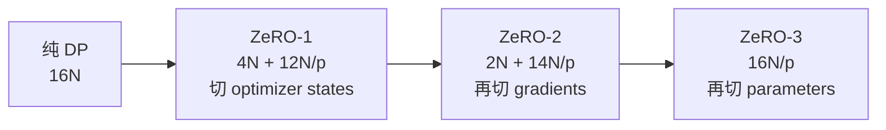
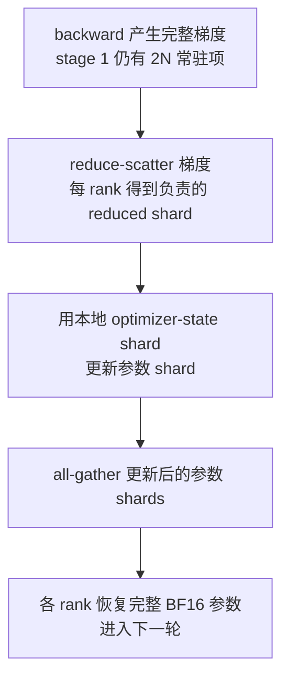
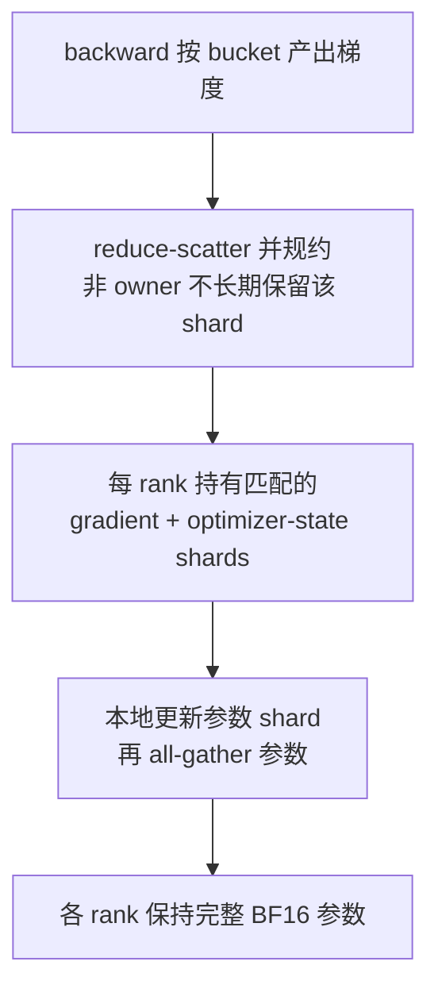
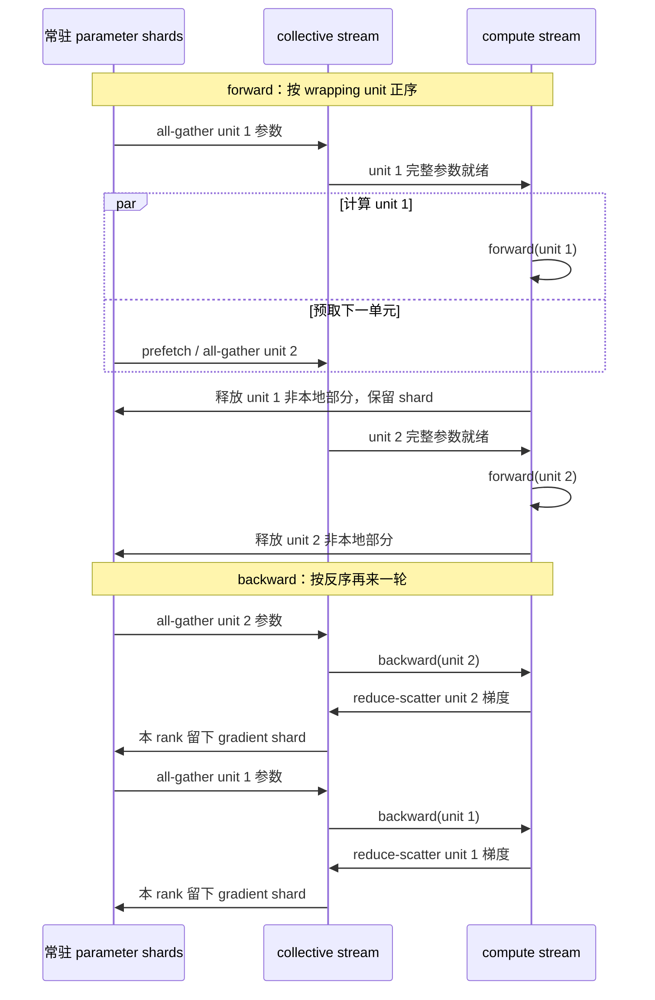
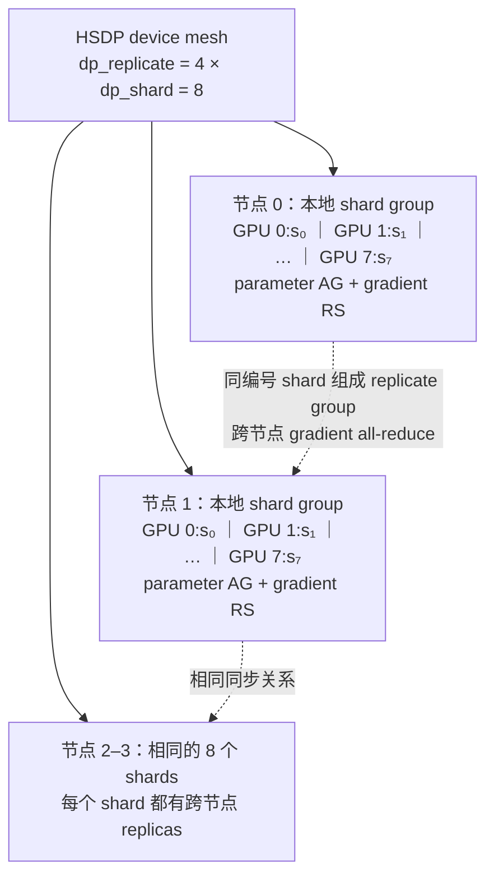

# L42 ZeRO与FSDP：把数据并行的冗余状态切碎

> [!abstract] 本课速览
> 读完你将能够：
> 1. 从 $16N$ B 静态状态账推导 ZeRO stage 1/2/3 的每卡显存公式，并说出每一阶段切了什么；
> 2. 用 reduce-scatter 与 all-gather 重画数据并行同步，解释 ZeRO-1/2 为何不增加渐近通信量、ZeRO-3 为何约为 DDP 的 1.5 倍；
> 3. 画出 ZeRO-3 的“all-gather—使用—释放”时序，识别 wrapping 粒度、prefetch、启动时延和瞬时峰值之间的折中；
> 4. 说清 PyTorch FSDP1、FSDP2/DTensor 与 ZeRO-3 的关系，并用两维 device mesh 解释 HSDP；
> 5. 判断一个问题应该先用 ZeRO/FSDP、offload，还是必须叠加 TP/PP 等真正切计算的并行方式。
>
> 前置：[[L41 数据并行与DDP]] · [[L36 集合通信原语]] · [[L37 通信算法与代价模型]] · [[L40 训练显存全解剖]] · 预计 55 分钟

## 论文里的这段话，你现在可能读不懂

> [!quote]
> ZeRO eliminates data-parallel redundancy by progressively partitioning optimizer states, gradients, and parameters. Under full sharding, parameters are all-gathered on demand for each wrapped unit and resharded after use, while gradients are reduce-scattered to their owners. FSDP overlaps these collectives with computation through prefetching, whereas hybrid sharding restricts full-shard communication to a fast local group and replicates shards across groups. The memory saving must therefore be evaluated together with communication-volume overhead, collective granularity, and transient unsharded buffers.（改写自 ZeRO 与 PyTorch FSDP 的典型表述）

这四句真正问的不是“ZeRO 有几个 stage”，而是四笔互相牵制的账：哪些字节常驻、何时必须还原全量、通信走哪个组、峰值显存是否仍能过关。先把状态的所有权画清楚，名词自然会落位。

## 一、DP 的问题不是“有状态”，而是“状态重复”

### 1.1 八个人没有必要各存八本同样的账簿

[[L41 数据并行与DDP]] 中，每个 data-parallel rank 都保留完整模型副本。按 [[03 约定与符号]] 的 Adam 混合精度口径，每参数静态状态为：

| 静态状态 | 每参数字节 | 纯 DP 中每 rank 是否完整复制 |
|---|---:|---|
| BF16 参数 | 2 B | 是 |
| BF16 梯度 | 2 B | 是 |
| FP32 master parameter | 4 B | 是 |
| FP32 Adam 一阶矩 | 4 B | 是 |
| FP32 Adam 二阶矩 | 4 B | 是 |
| 合计 | **16 B** | **是，共复制 $p$ 份** |

这些副本让每个 rank 可以独立执行同一个 optimizer step，却也构成了 **redundancy**（冗余）：一次同步更新后，各 rank 的参数、梯度与 optimizer states 在逻辑上对应同一份全局训练状态，没有必要全部常驻 $p$ 份。

**ZeRO**（Zero Redundancy Optimizer，零冗余优化器）的宣言可以压成一句话：==把没有必要复制的模型状态分给不同 ranks 保管，需要时再通过通信拼回来==。把一个逻辑 tensor 沿 ranks 分配所有权，叫 **partitioning / sharding**（分区 / 切分）；本课程按 [[03 约定与符号]] 统一把 sharding 译作“切分”。理想均匀切分时，每个 rank 只常驻该类状态的 $1/p$。

> [!tip] 直觉：分账保管，不是撕掉账目
> 八位会计仍共同维护一本完整总账，但每人只长期保管八分之一的原始账页。要核对某一章时，大家暂时把相关页拼齐；核对完再只留下自己负责的页。省下的是重复存储，不是逻辑状态本身。

### 1.2 三个 stage 是累计关系

令 $N$ 为参数量、$p$ 为 ZeRO 切分组中的 rank 数。三个阶段不是三套互不相干的算法，而是逐层把 optimizer states、gradients、parameters 纳入切分：

这里的“瀑布”只计算静态模型状态。activation、临时还原的参数、collective buffers、allocator 碎片与框架运行时空间都没有神奇消失；后面会专门把这个边界加回来。

## 二、ZeRO 三阶段：每切一类状态，所有权就多一层

### 2.1 ZeRO stage 1：先切最胖的 optimizer states

**ZeRO stage 1**（ZeRO 第一阶段，常写 ZeRO-1）切分 FP32 master parameter 和 Adam 两个矩，共 $12N$ B；BF16 参数与 BF16 梯度仍各完整保留。因此每 rank 的静态状态是

$$
M_1=2N+2N+\frac{12N}{p}
=4N+\frac{12N}{p}\quad\text{B}.
$$

每个 rank 只更新自己拥有的参数分片。逻辑通信流程可以写成：

为什么公式仍算完整 $2N$ 梯度，而流程里又出现 reduce-scatter？因为 stage 1 的节省对象只有 optimizer states：backward 的完整梯度驻留需求还在；同步结束时可以只把 reduced shard 交给对应 owner 做更新。stage 2 才进一步改造梯度的长期/峰值管理。

### 2.2 ZeRO stage 2：梯度也只留给 owner

**ZeRO stage 2**（ZeRO 第二阶段，ZeRO-2）累计 stage 1，再切分 $2N$ B 的 BF16 梯度。完整复制的只剩 BF16 参数：

$$
M_2=2N+\frac{2N+12N}{p}
=2N+\frac{14N}{p}\quad\text{B}.
$$

stage 1 与 stage 2 的 collective 骨架相似，区别主要落在显存生命周期：stage 2 不要求每 rank 长期保留完整梯度。真实实现还会 bucketize 以流水执行，所以不能把上图误读成“整个模型 backward 完成后只发一个大消息”。

### 2.3 ZeRO stage 3：参数也只在计算前暂时拼齐

**ZeRO stage 3**（ZeRO 第三阶段，ZeRO-3）再切 BF16 参数，三类状态全部均匀分布：

$$
M_3=\frac{2N+2N+12N}{p}
=\frac{16N}{p}\quad\text{B}.
$$

但普通 dense layer 的 GEMM 仍需要本层完整权重。ZeRO-3 采用 **all-gather on demand**（按需 all-gather）：轮到某个参数块/模块计算时才拼齐，计算结束后释放非本 rank 所有的部分，也就是常说的“用时才 gather，用完就 reshard”。

### 2.4 主图：all-gather—使用—释放

图中 **prefetch**（预取）是“趁当前单元还在计算，提前发起下一单元的参数 all-gather”。它扩大通信—计算重叠，却会让“当前完整单元 + 下一完整单元 + 当前梯度”等对象同时存在，提高瞬时显存。没有 prefetch，显存更稳，下一层又可能站在关键路径上等网络。

> [!warning] “$16N/p$ 能装下”不等于训练一定不 OOM
> $16N/p$ 是均匀切分后的静态下界。执行某个 wrapping unit 时，rank 还要暂时持有该单元的完整参数；再叠加 activation、prefetch 的下一单元、梯度、collective buffer 和 allocator 碎片，峰值会更高。若一个不可再拆的单层/算子权重及其工作空间本身就放不下单卡，ZeRO-3 也救不了，必须切算子。

## 三、为什么通信原语必须换，但字节数没有爆炸

### 3.1 所有权改变，all-reduce 就做多了

纯 DDP 需要每个 rank 得到完整 reduced gradient，所以用 all-reduce。状态切分后，每个 rank 只需自己负责的 reduced gradient shard；先 all-reduce 再丢掉其中 $(p-1)/p$，显然浪费。于是梯度同步自然变为 reduce-scatter，参数更新后再 all-gather 给仍需完整参数的 ranks。

令 BF16 参数或梯度的完整大小为

$$
W=2N\ \text{B}.
$$

沿用 [[L37 通信算法与代价模型]] 的 ring 大消息口径：一次 reduce-scatter 或 all-gather 中，每 rank 每方向搬运约 $W(p-1)/p$；一次 all-reduce 是两者之和，约 $2W(p-1)/p$。先假设每次 optimizer update 只有一轮 forward-backward、各参数单元在 forward 后重新切分，且每轮各使用一次；据此得到每 step 的渐近通信账：

| 方案 | 主要 collectives | 每 rank 每方向字节数 | 相对 DDP |
|---|---|---:|---:|
| DDP | gradient RS + AG（即 all-reduce） | $2W(p-1)/p$ | $1\times$ |
| ZeRO-1 | gradient RS + updated-parameter AG | $2W(p-1)/p$ | $1\times$ |
| ZeRO-2 | gradient RS + updated-parameter AG | $2W(p-1)/p$ | $1\times$ |
| ZeRO-3 | forward parameter AG + backward parameter AG + gradient RS | $3W(p-1)/p$ | $1.5\times$ |

这就是 **communication volume overhead**（通信量额外开销）：相对同一 DDP 基线，多搬了多少数据。ZeRO-1/2 把 all-reduce 的“RS+AG”改成“gradient RS + parameter AG”，总量仍约 $2W$；ZeRO-3 为 backward 再次计算前多一轮参数 AG，变成约 $3W$，所以是 $3W/2W=1.5$ 倍。这个结论来自 ZeRO 原论文的 bandwidth-dominated 大消息分析，不是对任意实现墙钟时间的 1.5 倍承诺。梯度累积、选择在 forward 后保留完整参数，或框架采用不同 reshard/recomputation 调度时，都要按实际 collective 次数重算。

> [!tip] “通信量只多 50%”与“可能慢很多”可以同时成立
> 把一个 $W$ 大消息切成许多 wrapping units，不改变总字节数，却增加 collective 次数。每次都要付 $\alpha$、调度和同步代价；跨慢链路、单元太碎或 prefetch 失败时，额外通信又更难藏住。因此应同时看 bytes、message count 和 exposed time。

### 3.2 wrapping 粒度是显存—带宽—时延三角

**wrapping**（包装 / 切分计算单元）决定哪些 parameters 被视作一个全量还原单元。大 unit 的 collective 更容易跑满带宽、$\alpha$ 次数少，但瞬时完整参数大且下一单元更难提前；小 unit 峰值低、流水机会多，却会产生小消息风暴。

可以把它类比成搬家：整层一次装一辆大车，车少但需要大停车场；每张桌椅叫一辆小车，停车容易却被叫车和排队开销淹没。工程上常从 Transformer block 这类自然模块边界开始，再用 profiler 看 AG、RS 和 compute timeline，而不是只凭参数量选粒度。

> [!example] 算一算：70B 的三阶段显存瀑布
> 参数量取 [[03 约定与符号]] 的 Llama-3-70B 教学值 $N=70\times10^9$；Adam 混合精度静态状态取 $16$ B/参数。因此纯 DP 每 rank 为
>
> $$
> 16N=16\times70\times10^9
> =1.12\times10^{12}\ \text{B}
> =1120\ \text{GB}=1.12\ \text{TB}.
> $$
>
> 各组成项为：$2N=140$ GB、$4N=280$ GB、$12N=840$ GB、$14N=980$ GB。代入三阶段公式：
>
> | 切分组大小 $p$ | ZeRO-1：$280+840/p$ | ZeRO-2：$140+980/p$ | ZeRO-3：$1120/p$ |
> |---:|---:|---:|---:|
> | 64 | $280+13.125=\mathbf{293.125}$ GB | $140+15.3125=\mathbf{155.3125}$ GB | $\mathbf{17.5}$ GB |
> | 512 | $280+1.640625=\mathbf{281.640625}$ GB | $140+1.9140625=\mathbf{141.9140625}$ GB | $\mathbf{2.1875}$ GB |
>
> 取一位小数就是设计时常见的 293.1、155.3、17.5 GB，以及 281.6、141.9、2.2 GB。对 80 GB H100，ZeRO-1/2 即使把 $p$ 从 64 加到 512，完整 BF16 参数的 140 GB 下界仍在；ZeRO-3 的静态项可以通过容量门槛。==但 17.5 GB 不是训练峰值==：activation 与临时 gathered unit 仍要加入。状态问题解决后，activation 和单层工作集问题就登场了，后续见 [[L43 张量并行]] 与 [[L50 显存优化技术]]。

## 四、FSDP：同一 fully-sharded 思想在 PyTorch 里的落地

### 4.1 FSDP 与 ZeRO-3 是同族，不是“竞品二选一”

**FSDP**（Fully Sharded Data Parallel，完全切分数据并行）是 PyTorch 对 fully-sharded data parallel 思想的实现；PyTorch 官方文档明确说明它受到 ZeRO stage 3 启发，并切分 parameters、gradients 与 optimizer states。算法层面可以把 FSDP full-shard 看作 ZeRO-3 对应物；工程层面两者属于不同框架/API，实现细节、checkpoint 格式和调参入口并不相同。

FSDP 的核心仍是本课主图：某个单元 forward/backward 前 all-gather 参数，计算后 reshard；backward 产出的完整梯度经 reduce-scatter 回到 owners。optimizer 只在本地 shards 上更新。于是它保持 data-parallel 的数学语义——各 rank 处理不同数据——却不再让模型状态完整复制。

> [!warning] FSDP 不是“自动把所有显存除以 $p$”
> 它主要切模型状态，不会自动把每个 rank 的 local-batch activation 除以 $p$；参数 AG 还会产生瞬时全量单元。模型初始化、checkpoint、shared parameters、mixed precision 和 gradient accumulation 也各有框架约束，实际配置必须以当前官方文档为准。

### 4.2 FSDP1：flat parameter、wrapping 与 prefetch

经典 FSDP1 把一个 wrapping unit 内的多个原始参数 flatten、concatenate，再切成通信块；这个内部对象叫 **flat parameter**（扁平参数）。这样能把许多小 tensors 合成较大的 collective，便于带宽利用和调度，但也让单个原始参数的冻结、状态字典和组合式并行更复杂。

wrapping policy 决定 unit 边界，也就同时决定：

- 一次 all-gather/reduce-scatter 的消息大小；
- 瞬时 unsharded parameter 的峰值；
- 有多少机会把下一单元的 AG 与当前计算重叠；
- 一步要支付多少次固定启动开销。

prefetch 则决定 collectives 何时被发起。更积极的 backward prefetch 能提高 overlap，却会同时保留更多参数/梯度；rate limiting 可约束连续 all-gathers，避免 CPU 过快发射导致峰值失控。这正是网络调度与显存调度耦合的地方。

### 4.3 FSDP2：DTensor per-parameter sharding

截至 2026-08，PyTorch 的 FSDP2 入口是 `fully_shard`。它不再把 `FlatParameter` 当作切分表示，而让每个 parameter 以 **DTensor**（分布式张量）表达自己在 device mesh 上的 placement，默认采用按第 0 维的 per-parameter sharding。forward/backward hooks 仍负责参数 AG、释放与梯度 RS，算法语义没有因为表示变化而改掉。

所以读资料时要带版本意识：

| 对比 | FSDP1 | FSDP2 |
|---|---|---|
| 切分表示 | wrapping unit 内 flatten/concatenate 后形成 `FlatParameter` | 每个 parameter 以 DTensor 表示 shard |
| 通信分组 | 由 FSDP wrapping units 隐式形成 flat groups | 仍由应用 `fully_shard` 的 module 边界决定，没有自动万能 bucket |
| 使用直觉 | 参数组是通信与状态管理中心 | 原始参数身份更清楚，更利于组合与 sharded state dict |
| 共同点 | 参数按需 AG、梯度 RS、optimizer state 本地切分 | 相同 |

“FSDP 使用 flat parameter”描述的是 FSDP1，不应写成跨版本定义；“FSDP2 使用 DTensor”也不表示 collective 自动消失，DTensor 是描述分布布局与触发必要通信的抽象。

## 五、HSDP：用两维 mesh 把高频通信关进快域

### 5.1 全局 full-shard 为什么可能得不偿失

假设 4 个节点、每节点 8 张 GPU。若 32 张卡组成一个全局 FSDP group，每个 wrapping unit 的 forward/backward 参数 AG 与梯度 RS 都会跨节点；静态状态能降到约 $16N/32$，但参数通信反复穿过 scale-out 网络。

**HSDP / hybrid sharding**（Hybrid Sharded Data Parallel，混合切分数据并行）把 device mesh（把设备按并行维度组织起来的网格）拆成两维：节点内 8 卡做 full shard，节点间复制同一组 shards。它等价于“节点内 FSDP + 节点间 DDP 式复制”：参数 AG 与梯度 RS 留在快的节点内域，跨节点只同步对应的 gradient shards。

图中节点内实线域执行 parameter all-gather / gradient reduce-scatter；同 local rank 的虚线形成跨节点 replicate group，对已经切小的 gradient shard 做 all-reduce。具体 collective 发射顺序由实现调度，上图表达的是二维所有权与流量边界。

这是一堂很典型的拓扑感知课：[[03 约定与符号]] 中，H100 NVLink 单方向约 450 GB/s，而 400 Gb/s 网卡每方向为 50 GB/s，线速相差约 9 倍。让频繁的参数 AG/梯度 RS 留在 8-GPU scale-up 域，往往比把所有 32 ranks 拉进每次 full-shard collective 更容易扩展。

### 5.2 HSDP 付出的显存代价

HSDP 不是免费的“既有 $p$ 倍省显存，又不跨网”。若节点内 shard group 大小为 $s=8$，静态模型状态近似为

$$
M_{\text{HSDP}}\approx\frac{16N}{s},
$$

而不是按全局 $p=32$ 得到 $16N/p$；相同 shards 在 4 个节点间复制。它用 4 份跨节点冗余换掉高频跨节点 parameter collectives。选择 full FSDP 还是 HSDP，本质是在“全局显存效率”与“慢域通信量/参与者规模”之间选点。

> [!tip] 先画 mesh，再说“FSDP 度”
> 只报 32 卡无法说明 HSDP 的显存和流量。应明确写成 `dp_replicate=4 × dp_shard=8`：8 决定每份状态切多细，4 决定有多少份副本以及跨节点同步组多大。

## 六、家族延伸：不只“切多细”，还可以“放哪里、在哪个域切”

### 6.1 offload：把容量压力移出 GPU

**ZeRO-Offload** 把 optimizer memory 与计算等移到 host CPU，主要沿 ZeRO-1/2 路线降低 GPU 压力；**ZeRO-Infinity** 把 ZeRO-3 与更完整的异构内存管理结合，可把模型状态放到 CPU 或 NVMe。二者都是 **offload**（卸载）：用更大的低层级容量换 PCIe/内存/NVMe 搬运与 CPU/I/O 调度成本，详见 [[L50 显存优化技术]]。

offload 适合“GPU 容量先撞墙，慢层级还有容量，而且数据移动能流水”的场景。若每 step 都同步等待 PCIe/NVMe，它可能只是把 GPU OOM 换成 I/O stall。读论文时必须同时问：移走哪类状态、何时预取、慢层级有效带宽是多少、多少传输真正暴露在关键路径。

### 6.2 缩小分片域与压缩通信

**MiCS**（Minimizing Communication Scale）把全局 ranks 分成较小 groups，在组内切模型状态，以减少 collective 参与者和慢链路流量；思想与 HSDP 都是在问“是否值得对全世界 full-shard”，但具体同步与层次化调度不同。原始设计见 [《MiCS: Near-linear Scaling for Training Gigantic Model on Public Cloud》](https://www.vldb.org/pvldb/vol16/p37-zhang.pdf)。

**ZeRO++** 是构建在 ZeRO-3 上的通信优化家族：量化参数通信、层次化 partition，以及量化后的梯度通信共同针对跨节点瓶颈。这里先记住问题分解，不背配置项：原始 ZeRO 优先消灭显存 redundancy，ZeRO++ 再压低这些按需 collectives 的慢域成本；三类机制可在 [DeepSpeed ZeRO++ 官方教程](https://www.deepspeed.ai/tutorials/zeropp/)中核对。

## 七、第一次选型：ZeRO/FSDP 不是所有“模型太大”的答案

### 7.1 ZeRO-3 仍是 data parallel 的显存改良

常见误区是“参数切了，所以 ZeRO 是 model parallel”。不是。ZeRO-3 在存储阶段切 parameters，但某个 unit 真正计算前仍把完整参数拼回每个 data-parallel rank；各 rank 执行完整 dense operator，只是输入数据不同。它没有把一个 GEMM 的乘法分摊到多个 ranks。

因此可以用下面的顺序判断：

| 首要约束 | 先评估什么 | 原因 |
|---|---|---|
| 完整 $16N$ 状态放不下，但单层/单元能放下 | ZeRO-3 / FSDP | 全切模型状态，保持 DP 编程语义 |
| GPU 仍放不下，但 CPU/NVMe 容量充足 | ZeRO-Offload / Infinity | 继续用慢层级容量换 GPU 显存 |
| 单个 layer/operator 的完整权重或工作集就放不下 | [[L43 张量并行]] 或 [[L44 流水线并行]] | 必须切计算或切层，AG 完整单元仍会 OOM |
| 推理时想让多卡共同缩短单请求 prefill / TTFT（time to first token，首 token 时延） | 评估 TP，而不是训练态 ZeRO | TP 分摊算子计算；但 collective 也可能抵消收益，并非自动更快 |
| 全球 full-shard 反复穿过慢网 | HSDP、MiCS 类分层/缩域方案 | 用额外 replicas 换拓扑局部性 |

通信粒度也不同：ZeRO/FSDP 主要按 parameter wrapping units 做 AG/RS，可以把下一单元参数预取到当前计算后面；TP 通常在层内按 activation tensor 做 collective，依赖更贴近算子关键路径，往往更难完全隐藏。反过来，ZeRO 单元切得过碎又会对 $\alpha$ 敏感。[[L47 混合并行组装]] 会把两者与 PP、CP、EP 放到同一 device mesh 中。

### 7.2 三个误区，一次收口

> [!warning] 常见误区
> 1. **“ZeRO 是模型并行。”** 它是 data-parallel 模型状态的切分优化；full-shard 计算前仍还原当前单元，算子本身没有按 ZeRO 度切开。
> 2. **“ZeRO-3 通信爆炸。”** 在 ZeRO 原论文的大消息字节口径中是 DDP 的 1.5 倍，不是数量级爆炸；真正可能致命的是碎消息、$\alpha$、慢域参与者和暴露在关键路径的调度尾巴。
> 3. **“FSDP 和 ZeRO 是竞品。”** FSDP full-shard 与 ZeRO-3 属于同一算法思想在不同软件栈里的实现；该比较应落到 API、组合性、checkpoint、成熟度和 workload 实测，而不是把名字当成两种原理。

## 回到开头那段话

第一句说 ZeRO 如何消除 data-parallel redundancy：stage 1 切 $12N$ optimizer states，stage 2 累计切 $2N$ gradients，stage 3 再切 $2N$ parameters，对应 $4N+12N/p$、$2N+14N/p$、$16N/p$ 三条静态显存公式。

第二句说的是 ZeRO-3/FSDP 主时序：每个 wrapped unit 计算前 all-gather on demand，使用后 reshard；backward 的 gradients 不必让所有 ranks 得到完整副本，而由 reduce-scatter 直接送回 owners。

第三句把调度与拓扑接起来：prefetch 试图用当前计算遮住下一轮 AG；HSDP 则让 full-shard collectives 留在本地 fast shard group，只让对应 gradient shards 在跨组 replicate dimension 上同步。

第四句提醒不能只看 $16N/p$：还要核算 communication volume overhead、消息粒度、$\alpha$ 次数、瞬时 unsharded buffers 与 activation。现在你应该能把开场四句逐一落到“所有权—时序—拓扑—峰值”四张图，而不再只背 stage 编号。

## 术语卡片

| 术语 | 中文 | 一句话解释 |
|---|---|---|
| ZeRO | 零冗余优化器 | 逐步切分数据并行中的 optimizer states、gradients 和 parameters，以通信换静态显存。 |
| ZeRO stage 1 | ZeRO 第一阶段 | 只切分 FP32 master parameter 与 Adam moments，本课口径每 rank 为 $4N+12N/p$ B。 |
| ZeRO stage 2 | ZeRO 第二阶段 | 在 stage 1 上再切 gradients，本课口径每 rank 为 $2N+14N/p$ B。 |
| ZeRO stage 3 | ZeRO 第三阶段 | 再切 parameters，使静态模型状态降为 $16N/p$ B，并在计算前按需聚合参数。 |
| partitioning / sharding | 分区 / 切分 | 把一个逻辑状态沿 ranks 分配所有权，使每个 rank 只常驻其中一片。 |
| redundancy | 冗余 | 多个 data-parallel ranks 保存逻辑相同状态副本所形成的重复占用。 |
| FSDP | 完全切分数据并行 | PyTorch 对 fully-sharded data parallel 的实现，full-shard 思想对应 ZeRO-3。 |
| flat parameter | 扁平参数 | FSDP1 把一个参数组 flatten、concatenate 后用于切分和 collective 的内部表示。 |
| wrapping | 包装 / 划分单元 | 确定哪些 parameters 一起 all-gather、计算与 reshard 的模块边界。 |
| prefetch | 预取 | 当前单元计算尚未结束时提前发起下一单元的参数通信，以扩大 overlap。 |
| HSDP / hybrid sharding | 混合切分数据并行 | 在本地组内 full-shard、跨组复制 shards 并同步梯度的二维 data-parallel 策略。 |
| DTensor | 分布式张量 | 用 device mesh 与 placement 描述 tensor 分布布局的 PyTorch 抽象，FSDP2 用它表示参数 shards。 |
| ZeRO-Offload | ZeRO 卸载 | 将 optimizer memory/compute 等迁到 CPU 的 ZeRO 扩展。 |
| ZeRO-Infinity | ZeRO Infinity | 将 ZeRO-3 与 CPU/NVMe 异构内存 offload、prefetch 和 tiling 结合的系统。 |
| ZeRO++ | ZeRO++ | 用量化与层次化 partition 等机制降低 ZeRO-3 通信成本的扩展。 |
| MiCS | 最小化通信规模系统 | 通过缩小模型状态切分组和分层同步，降低慢网络上的参与者规模与流量。 |
| all-gather on demand | 按需 all-gather | 只在某参数单元即将计算时临时还原完整参数，用后释放非本地部分。 |
| communication volume overhead | 通信量额外开销 | 相对基线方案增加的数据搬运量；不等同于墙钟时延或暴露通信时间。 |

## 自测

1. 从 $2+2+4+4+4=16$ B/参数出发，分别说明 ZeRO stage 1/2/3 切了什么，并写出每 rank 静态显存公式。
2. 为什么 ZeRO-1/2 可以把 gradient all-reduce 改成 gradient reduce-scatter + updated-parameter all-gather？按 $W=2N$ B 推导其通信量为何与 DDP 相同。
3. 70B 模型、$p=128$ 时，按本课口径计算 ZeRO-1、ZeRO-2、ZeRO-3 每 rank 静态状态；哪些能通过 80 GB 容量门槛？
4. 为什么 $16N/p<80$ GB 仍不能保证 ZeRO-3 在 80 GB GPU 上不 OOM？至少列出三项公式外的峰值来源。
5. “FSDP 使用 flat parameter”为什么需要加版本限定？FSDP2 用什么表示切分参数，collective 语义是否因此消失？
6. 在 4 节点 × 8 GPU 的 HSDP 中，写出 device mesh 的两个维度；若不计额外项，静态状态按 8 还是 32 切分？跨节点主要同步什么？
7. 对下面三个场景分别选起点并说明理由：完整训练状态放不下但单层能放下；单层权重就放不下；GPU 容量不足但 CPU/NVMe 富余、且可容忍搬运开销。
8. 一篇论文称“通信量只增加 50%，所以性能最多下降 50%”。用本课至少三个概念指出推理漏洞。

> [!note]- 参考答案
> 1. stage 1 切 $12N$ B 的 FP32 master parameter 与两个 Adam moments，保留完整 BF16 parameter/gradient，得 $4N+12N/p$；stage 2 再切 $2N$ gradient，得 $2N+14N/p$；stage 3 再切 $2N$ parameter，得 $16N/p$ B。三阶段累计。
> 2. owner 只需自己负责的 reduced gradient shard，RS 可直接把规约结果送给 owner；owner 更新参数 shard 后，用 AG 让需要完整参数的 ranks 获得新参数。RS 与 AG 各约搬 $W(p-1)/p$，合计 $2W(p-1)/p$，等于 DDP all-reduce 的 RS+AG。
> 3. $840/128=6.5625$ GB，$980/128=7.65625$ GB，$1120/128=8.75$ GB。故 ZeRO-1 为 $286.5625$ GB，ZeRO-2 为 $147.65625$ GB，ZeRO-3 为 $8.75$ GB；只有 ZeRO-3 的静态项低于 80 GB。仍不能据此宣称完整训练可运行。
> 4. 至少包括 local-batch activation、当前 wrapping unit 的完整 gathered parameters、prefetch 的下一单元、当前 gradients、collective buffers、allocator/runtime 碎片；单层工作空间也可能成为地板。
> 5. flat parameter 是 FSDP1 的核心表示。FSDP2 以 DTensor per-parameter sharding 表示 parameters；forward/backward 前的 AG、用后 reshard 和 gradient RS 仍然存在，变化的是表示与组合方式，不是通信守恒。
> 6. 可写成 `dp_replicate=4 × dp_shard=8`。静态状态只按 shard group 的 8 切分，同一 shards 在 4 个节点复制；参数 AG/gradient RS 主要在节点内，跨节点 replicate groups 对对应 gradient shards 做 all-reduce。
> 7. 第一种先用 ZeRO-3/FSDP；第二种必须引入 TP/PP 等切算子或切层策略；第三种可评估 ZeRO-Offload/Infinity，同时核算 PCIe、CPU memory 与 NVMe 的有效带宽和暴露 I/O。
> 8. 50% 是大消息、每 rank 字节数相对 DDP 的渐近账，不是 step time。消息碎片会增加 $\alpha$ 次数；wrapping/prefetch 决定 overlap 与暴露时间；慢域带宽、参与者规模、拥塞和 straggler 会改变 collective 时间；更积极 prefetch 还可能提高峰值显存。

## 延伸阅读

- [《ZeRO: Memory Optimizations Toward Training Trillion Parameter Models》](https://sc20.supercomputing.org/proceedings/tech_paper/tech_paper_pages/pap379.html)（SC 2020）：精读第 5–7 节；图 1 建立三阶段直觉，第 7 节给出 $2\Psi$ 与 $3\Psi$ 的通信量推导。
- [《PyTorch FSDP: Experiences on Scaling Fully Sharded Data Parallel》](https://www.vldb.org/pvldb/vol16/p3848-huang.pdf)（PVLDB 2023）：读设计与执行流程，理解 wrapping、prefetch、rate limiter 和内存管理为何是同一个调度问题。
- [PyTorch FSDP2 `fully_shard` 官方文档](https://docs.pytorch.org/docs/main/distributed.fsdp.fully_shard.html)与 [DeviceMesh/HSDP 官方教程](https://docs.pytorch.org/tutorials/recipes/distributed_device_mesh.html)：核对截至当前的 FSDP2、DTensor 和二维 mesh API；框架细节随版本变化，以官方文档为准。
- [DeepSpeed ZeRO 官方教程](https://www.deepspeed.ai/tutorials/zero/)：把 stage 1/2/3、ZeRO-Offload/Infinity 的概念映射到真实配置，但不要把配置默认值当成跨 workload 定律。
- [Hugging Face《The Ultra-Scale Playbook》](https://huggingface.co/spaces/nanotron/ultrascale-playbook)：用动画和分层图复习 ZeRO，并把本课与 TP、PP、CP 的混合并行选择连起来。

---
上一课：[[L41 数据并行与DDP]] ← · → 下一课：[[L43 张量并行]]
