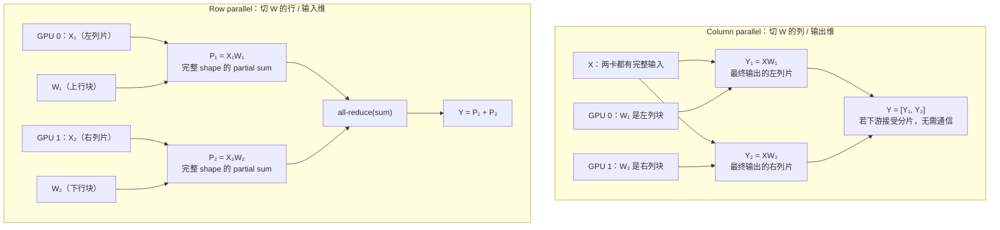
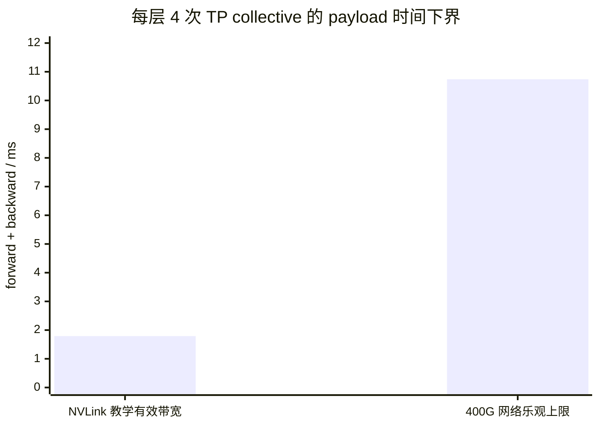
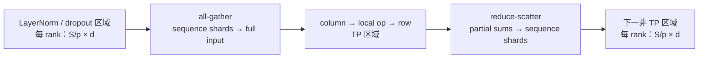

# L43 张量并行：把同一层的矩阵切开算

> [!abstract] 本课速览
> 读完你将能够：
> 1. 用分块矩阵推导 column parallel 与 row parallel，判断输出是列片还是 partial sums；
> 2. 重画 Megatron-LM 的 attention 与 FFN，解释为什么必须“先列后行”；
> 3. 用 f/g 算子钉死每层 forward 2 次、backward 2 次 all-reduce；
> 4. 从 $bSd$ activation 推导 TP 通信量，并复算 Llama-3-70B、TP=8 的每 step 通信账；
> 5. 区分 Megatron-SP 与 context parallelism，并根据互联层级选择合理 TP degree。
>
> 前置：[[L12 Transformer全解剖]] · [[L36 集合通信原语]] · [[L25 节点内互联]] · 预计 50 分钟

## 论文里的这段话，你现在可能读不懂

> [!quote]
> Tensor parallelism applies column parallelism to the QKV and first MLP projections, followed by row parallelism in the output projections. The conjugate f/g operators are identity in one pass and all-reduce in the other, yielding two all-reduces per transformer layer in both forward and backward. Because these collectives communicate activations on the critical path, tensor-parallel groups are usually kept inside a high-bandwidth intra-node domain. Sequence parallelism further shards the LayerNorm and dropout regions along the sequence dimension and replaces each all-reduce with paired all-gather and reduce-scatter operations.（改写自 Megatron-LM 与 Megatron-SP 的典型表述）

这段话把矩阵怎么切、通信发生在哪里、为什么拓扑决定 TP 上限压成了四句。读完本课，你应该能逐句画出 tensor shape，并把“通常放节点内”从经验口号还原成一笔可复算的带宽账。

## 一、ZeRO 切“放在哪里”，TP 切“由谁来算”

### 1.1 单层本身太大时，按需聚合也救不了

上一课 [[L42 ZeRO与FSDP]] 把 parameters、gradients 与 optimizer states 分给不同 ranks 常驻，但某个 wrapped unit 真正计算前仍可能 all-gather 完整参数。若一层的权重、activation 或 GEMM 工作集本身就塞不进一张卡，或者单卡完成这一层太慢，问题已经不是“状态放在哪里”，而是“这个算子能不能由多卡共同完成”。

**tensor parallelism, TP**（张量并行）把同一层里的 weight tensor 与计算沿某个维度切开，让一个 GEMM、一个 attention 或一个 FFN 同时跑在多个 ranks 上。旧资料常用 **model parallelism**（模型并行）统称“一个模型由多卡共同执行”；现代语境最好继续追问：切同一层内部 tensor 的是 TP，按层深切段的是 [[L44 流水线并行|PP]]。

| 方案 | 长期切什么 | 计算某层时是否还原完整层 | 主要目的 |
|---|---|---|---|
| DP | 不切模型，每 rank 一份副本 | 是，本来就完整 | 扩大数据吞吐 |
| ZeRO/FSDP | 模型状态的所有权 | 常按 unit 临时聚合 | 降低冗余静态状态 |
| TP | 同一层的 weights、intermediate activations 与 GEMM | 否，多卡共同算完 | 切单层工作集、分摊计算 |
| PP | 层序列 | 每个 stage 内的层仍完整，除非叠加 TP | 切模型深度 |

> [!tip] 直觉：ZeRO 是分仓储，TP 是分车床
> 八个仓库各保管八分之一零件，开工前仍把一整台机器的零件运来，这是 ZeRO-3；八台车床各加工同一零件的一部分，再把结果拼起来，这是 TP。

### 1.2 TP degree 是算子级分工人数

**TP degree**（张量并行度）记作 $p$，表示一个 TP group 中共同完成同一层的 rank 数。理想均匀切分时，每 rank 只保存约 $1/p$ 的该层权重，并完成约 $1/p$ 的主要 GEMM；但 collective 并不会随 $p$ 自动消失。$p$ 越大，每卡矩阵越窄、GEMM 越难跑满，参与通信的 ranks 也越多，所以“能切到 $p$”与“最优是 $p$”是两件事。

## 二、一张主图看懂 column parallel 与 row parallel

设一个 linear layer 忽略 bias：

$$
Y=XW,\qquad
X\in\mathbb{R}^{m\times k},
W\in\mathbb{R}^{k\times n},
Y\in\mathbb{R}^{m\times n}.
$$

这里 $m=bS$ 可以理解为这张卡一次处理的 token 数，$k$ 是输入维度，$n$ 是输出维度。TP 最基本的两刀就是沿 $W$ 的列切，或沿 $W$ 的行切。

### 2.1 Column parallel：切输出维，不用先求和

**column-parallel linear**（列并行线性层）把 $W$ 沿输出维拼成列块：

$$
W=\begin{bmatrix}W_1&W_2\end{bmatrix},
\qquad
Y=XW
=\begin{bmatrix}XW_1&XW_2\end{bmatrix}
=\begin{bmatrix}Y_1&Y_2\end{bmatrix}.
$$

GPU 0 拿 $W_1$，GPU 1 拿 $W_2$；两边都需要完整 $X$，但各自产出的 $Y_i$ 已经是最终 $Y$ 的一组列。只要下一算子能直接消费列片，forward 此处不需要通信。

### 2.2 Row parallel：切输入维，partial sums 必须相加

**row-parallel linear**（行并行线性层）把 $W$ 沿输入维竖着切，同时把 $X$ 的对应列切开：

$$
X=\begin{bmatrix}X_1&X_2\end{bmatrix},
\qquad
W=\begin{bmatrix}W_1\\W_2\end{bmatrix}.
$$

于是

$$
Y=XW=X_1W_1+X_2W_2=P_1+P_2.
$$

每张卡得到的 $P_i$ 都是完整输出 shape 的 **partial sum**（部分和），而不是 $Y$ 的不同列。必须对 $P_1,P_2$ 做求和 all-reduce，所有 ranks 才得到相同的完整 $Y$。

### 2.3 用一个 $2\times2$ 数值例确认结果没变

取

$$
X=\begin{bmatrix}1&2\\3&4\end{bmatrix},
\qquad
W=\begin{bmatrix}5&6\\7&8\end{bmatrix},
\qquad
XW=\begin{bmatrix}19&22\\43&50\end{bmatrix}.
$$

列切时，GPU 0 算 $X[5,7]^T=[19,43]^T$，GPU 1 算 $X[6,8]^T=[22,50]^T$，横向拼接就是 $XW$。行切时：

$$
P_1=\begin{bmatrix}1\\3\end{bmatrix}\begin{bmatrix}5&6\end{bmatrix}
=\begin{bmatrix}5&6\\15&18\end{bmatrix},
$$

$$
P_2=\begin{bmatrix}2\\4\end{bmatrix}\begin{bmatrix}7&8\end{bmatrix}
=\begin{bmatrix}14&16\\28&32\end{bmatrix},
$$

all-reduce 求和得到 $P_1+P_2=XW$。==切法改变的是数据布局与通信位置，不改变 linear layer 的数学结果。==

> [!warning] “列切/行切”说的是 weight 的维度
> 有些框架以 $Y=XW^T$ 存放 weight，此时代码中的 axis 编号会反过来。读实现不要只背 `dim=0/1`，先写出数学式和 tensor shape：column parallel 切输出特征，row parallel 切输入特征。

## 三、Megatron 组合拳：为什么必须先列后行

### 3.1 FFN：让非线性留在本地

经典两矩阵 FFN 写作

$$
H=\operatorname{GeLU}(XW_{up}),
\qquad
Y=HW_{down}.
$$

**Megatron-LM**（Megatron 大模型训练系统）先对 $W_{up}$ 做 column parallel：每个 rank 得到一片 $H_i=\operatorname{GeLU}(XW_{up,i})$。GeLU 是逐元素操作，可以独立施加在各列片上，不用先同步。随后 $W_{down}$ 做 row parallel，直接消费对应的 $H_i$，各 rank 产生 $P_i=H_iW_{down,i}$，最后只做一次 all-reduce：

$$
Y=\sum_{i=1}^{p}P_i.
$$

若反过来先 row parallel，第一层只产生 partial sums；必须先 all-reduce 才能正确计算非线性，因为一般有

$$
\operatorname{GeLU}(P_1+P_2)
\ne
\operatorname{GeLU}(P_1)+\operatorname{GeLU}(P_2).
$$

这就是“先列后行”的真正原因：不是审美，而是把同步点推到两次 GEMM 之后。Llama 式 SwiGLU 多一个 gate projection；工程上通常把 gate/up 都按输出维切，逐元素门控仍在本地完成，再用 row-parallel down projection 收口，通信骨架不变。

### 3.2 Attention：按 head 切正好是 column parallel

attention 的 Q、K、V 投影沿输出维切后，每个 rank 得到若干完整 heads，并独立完成这些 heads 的 $QK^T$、softmax 与 $PV$。这种 **attention head sharding**（注意力头切分）天然对应 QKV column parallel：不同 heads 之间在输出投影前没有数据依赖。

多头结果接着送入 $W_O$。$W_O$ 沿输入维做 row parallel，每张卡对自己的 head 输出形成一个 partial sum，最后一次 all-reduce 恢复完整 hidden state。于是 attention 也是“QKV 列切 → heads 本地计算 → $W_O$ 行切 → all-reduce”。

### 3.3 f/g 算子把 forward 与 backward 对称地接起来

Megatron 原论文用一对共轭的 **f/g operators**（f/g 算子）隐藏 autograd 中的通信细节：

| 算子 | forward | backward | 放在哪里 |
|---|---|---|---|
| $f$ | identity（原样通过） | all-reduce input gradient | column-parallel 区域入口 |
| $g$ | all-reduce partial sums | identity（原样通过） | row-parallel 区域出口 |

因此一个“column → 本地非线性/attention → row”子块在 forward 只由 $g$ 做一次 all-reduce，在 backward 只由 $f$ 做一次 all-reduce。一个 Transformer layer 有 attention 与 FFN 两个子块，所以数字必须钉死：

$$
\boxed{\text{每层 forward 2 次 all-reduce，backward 2 次，共 4 次。}}
$$

```mermaid
flowchart LR
    X["输入 X<br/>TP ranks 上复制"]
    FA["f_att<br/>F: identity｜B: all-reduce"]
    QKV["QKV<br/>column parallel"]
    HEAD["heads 本地 attention<br/>无需 TP 通信"]
    WO["W_O<br/>row parallel<br/>产生 partial sums"]
    GA["g_att<br/>F: all-reduce｜B: identity"]
    R1["dropout + residual + norm"]
    FF["f_ffn<br/>F: identity｜B: all-reduce"]
    UP["W_gate / W_up<br/>column parallel"]
    ACT["SwiGLU / GeLU<br/>逐元素、本地"]
    DOWN["W_down<br/>row parallel<br/>产生 partial sums"]
    GF["g_ffn<br/>F: all-reduce｜B: identity"]
    Y["层输出 Y"]

    X --> FA --> QKV --> HEAD --> WO --> GA --> R1
    R1 --> FF --> UP --> ACT --> DOWN --> GF --> Y
```

> [!warning] backward 不是免费逆放映
> 只数 forward 的两个 $g$ 会把训练通信少算一半。backward 穿过两个 column-parallel 入口时，必须由两个 $f$ 汇总 input gradients；因此完整训练 step 是每层 4 次 TP activation all-reduce。

## 四、通信账：TP 发的是 activation，不是整模型梯度

### 4.1 每个 collective 的逻辑消息有多大

设 micro-batch size 为 $b$、序列长度为 $S$、hidden size 为 $d$，activation 使用 BF16（2 B/元素）。attention 与 FFN 的 row-parallel 输出都恢复成 $b\times S\times d$，所以一次 all-reduce 的逻辑消息大小是

$$
n=bSd\times2 \text{B}.
$$

这叫 **activation communication**（activation 通信）：通信量由本 step 的 token 数与 hidden size 决定。它与 DP 的参数梯度通信有根本差别：

| 对比 | TP | DP/DDP |
|---|---|---|
| 发什么 | 层间 activation / input gradient | parameter gradient buckets |
| 大小主要随什么变 | $bS d$，并且每层重复 | 参数量 $N$，通常每 step 一轮 |
| 频率 | 每层 forward 2 次、backward 2 次 | backward 中每个 bucket 一次同步 |
| 是否贴近关键路径 | 是，下一算子常等 collective 结果 | 可从后往前按 bucket 与其余 backward 重叠 |

每个 local micro-batch 有 $bS$ 个 tokens。若只数四次 collective 的逻辑 payload，不把 ring 在链路上的复制因子算进去，那么每 token、每层、完整 forward+backward 为

$$
\frac{4n}{bS}
=\frac{4(bSd\times2)}{bS}
=8d\ \text{B/token/layer}.
$$

对 $d=8192$，就是 $65{,}536$ B，约 65.5 kB/token/layer。这个“固定 $8d$”是逻辑消息口径；若按 [[L37 通信算法与代价模型]] 的 ring per-rank 链路流量，还要对每次 all-reduce 乘 $2(p-1)/p$。两种口径都能用，但不能混着除同一个带宽。

### 4.2 算一算：Llama-3-70B、TP=8 为什么不该跨 400G

> [!example] 算一算：320 次 activation collective 的带宽悬崖
> 取 [[03 约定与符号]] 的 Llama-3-70B：$L=80,d=8192$；设 $p=8,S=8192,b=1$，activation 为 BF16（2 B）。一次 all-reduce 的逻辑消息为
>
> $$
> n=1\times8192\times8192\times2
> =134{,}217{,}728\ \text{B}
> \approx134.2\ \text{MB}
> =128\ \text{MiB}.
> $$
>
> 注意本课程容量默认 SI：它不是 128 MB，而是 128 MiB。每层前后向共 4 次，80 层一 step 的 TP collectives 数量为
>
> $$
> N_{coll}=80\times4=320.
> $$
>
> 为复现设计稿的直觉比较，下面把 $B_{alg}$ 定义为“逻辑 payload $n$ 除以 collective 完成时间”的算法带宽，因此 ring 的流量放大已经折进 $B_{alg}$，不能再乘一次 $2(p-1)/p$。[[03 约定与符号]] 给出 H100 NVLink 单向硬件上限 450 GB/s；考虑协议、调度与实现损失，这里只设一个明确的教学场景 $B_{alg,NV}\approx300$ GB/s。400 Gb/s 网卡换算为 50 GB/s 每方向，所以即使把它乐观地当作 $B_{alg,net}$ 上限：
>
> $$
> t_{NV}=\frac{134.2\ \text{MB}}{300\ \text{GB/s}}
> \approx0.447\ \text{ms},
> $$
>
> $$
> t_{net}\ge\frac{134.2\ \text{MB}}{50\ \text{GB/s}}
> \approx2.684\ \text{ms}.
> $$
>
> 每层四次的纯 payload 时间约为 1.79 ms 与至少 10.74 ms；把 320 次直接相加：
>
> $$
> T_{NV}\approx320\times0.447=0.143\ \text{s},
> $$
>
> $$
> T_{net}\ge320\times2.684=0.859\ \text{s}.
> $$
>
> 跨到单张 400G NIC 后，仅这笔乐观的 payload 账就多出
>
> $$
> \Delta T\ge0.859-0.143
> \approx0.716\ \text{s/step}.
> $$
>
> 这还没加入 collective 固定时延、拥塞、协议损失、straggler 与同步尾巴。真实值应以匹配 message size、TP group 和 topology 的 nccl-tests/profiler 为准；300 GB/s 是教学场景，不是 [[03 约定与符号]] 的硬件保证。

图里的比值约 6 倍，而硬件线速比是 $450/50=9$ 倍，因为 NVLink 一侧已经用保守的 300 GB/s 算法带宽场景；网络一侧仍用了不可能超过的 50 GB/s 线速上限。它们的共同结论不是某个固定 benchmark，而是：==TP collective 频繁、依赖紧，跨越带宽层级会把同一份 activation 账重复放大 320 次。==

### 4.3 “TP 不出机箱”要翻译成拓扑规则

在本课 H100 教学配置里，一个节点恰有 8 张 GPU 组成 NVLink domain，因此常见 **intra-node parallelism**（节点内并行）选择是 `TP=8`，跨节点扩展交给 DP/PP。此时“TP 通常不出机箱”是很实用的简称。

但它不是永久的物理定律。[[L25 节点内互联]] 已看到 NVL72 把 scale-up NVLink domain 扩到机柜级；更一般的规则应写成：==让高频 TP group 尽量留在低时延、高带宽的 scale-up 域内，是否等于一台服务器取决于硬件代际。== 即使域内能容纳 72 张 GPU，也不表示 TP=72 一定划算：矩阵会变窄、collective 参与者增加，最佳 TP degree 仍要按 workload 实测。

## 五、Megatron-SP：把非 TP 区域的 activation 也切掉

### 5.1 TP 留下了一块复制区

经典 Megatron TP 让 GEMM 中间结果沿 hidden 维切分，但 LayerNorm、dropout 与 residual 一类逐 token 操作通常在完整 $S\times d$ activation 上重复执行。它们计算不重，却让每个 TP rank 保存相同 activation，成为显存补丁的目标。

**sequence parallelism (Megatron-SP)**（Megatron 式序列并行）让这些非 TP 区域沿 sequence 维切成 $S/p\times d$。进入 column-parallel 区域前，用 all-gather 把 sequence shards 还原成各 rank 所需的完整输入；row-parallel 区域产生 partial sums 后，不再先 all-reduce 得到完整复制结果，而是直接 reduce-scatter 成不同 sequence shards。

普通 TP 的一次 all-reduce 可以分解成 reduce-scatter + all-gather。Megatron-SP 把两半放到 TP 区域的两侧，因此从大消息字节数看是等量重排，不是额外多搬一个数量级；但 message count、固定时延和具体 overlap 可能不同，“带宽量相同”不等于“墙钟时间必然相同”。

### 5.2 Megatron-SP 不等于 context parallelism

> [!warning] 同名陷阱：先问 attention 的 context 有没有被切
> Megatron-SP 主要切 LayerNorm/dropout 等非 TP 区域，目标是减少复制 activation；它并不让一个 query 跨多卡寻找完整 context 的 KV。[[L45 序列与上下文并行]] 的 **context parallelism, CP** 切的是整段长上下文，attention 本身必须交换 KV 或变换 head/sequence layout。论文都可能写 “sequence parallelism”，读者应按 tensor shape 与通信位置辨认，而不是只看名字。

## 六、三个工程边角，决定方案能不能落地

### 6.1 Vocabulary / embedding 也能切

**vocab parallelism**（词表并行）沿 vocabulary 维切 input embedding 与 output logits。输入 token 落在哪个 shard，可由本地 lookup 后求和恢复 embedding；输出侧若直接 all-gather 全量 $b\times S\times V$ logits 会很贵，Megatron-LM 把并行 logits 与 cross-entropy 融合，先在 shards 上算局部量，再只规约 loss 所需统计量。

### 6.2 GQA 先看 head 整除，再谈 TP 度

最干净的 head sharding 要求 query heads 能均匀分给 TP ranks；GQA 还要检查 $h_{kv}$。Llama-3-70B 在 [[03 约定与符号]] 中为 $h/h_{kv}=64/8$，所以 TP=8 可让每 rank 拿 8 个 Q heads 与 1 个 KV head。若 $p$ 不整除 $h$ 或 $h_{kv}$，实现可能需要复制 KV heads、改变 layout 或加入额外通信；不能只看 hidden size 能否被 $p$ 整除。

### 6.3 Async TP 是调度问题，不是删掉依赖

当前 Megatron Core 支持把 input-gradient all-reduce / reduce-scatter 与 weight-gradient GEMM 异步重叠，也提供 TP communication overlap 路径。可重叠的是依赖图中彼此独立的一段计算与通信；row-parallel 输出后的 LayerNorm 若必须等完整结果，那个同步点仍然存在。所谓 async-TP 研究，就是进一步分块 GEMM、提早发送已就绪 tiles，并处理通信 kernel、compute kernel 对 SM 与带宽的争用。

这正落在 MLSys × 网络研究的交叉处：优化变量不仅是 `TP=4` 还是 `TP=8`，还包括 TP group 的拓扑放置、collective algorithm、分块粒度、通信 stream 调度与 PP/DP 的组合。[[L47 混合并行组装]] 会把这些选择放进同一个 device mesh。

## 七、四个误区，一次收口

> [!warning] 常见误区
> 1. **“把前 40 层放 GPU 0、后 40 层放 GPU 1 就是 TP。”** 那是 PP；TP 切同一层内部的 matrix/tensor。
> 2. **“TP degree 越大，单卡工作越少，所以一定越快。”** 更大的 $p$ 会让 GEMM 变窄、增加 collective 参与者，并可能跨出快域；收益和通信必须一起算。
> 3. **“Column parallel 完全不通信。”** 只对该段 forward 且下游能消费列片成立；它要求各 rank 有完整输入，backward 的 input gradient 还要由 $f$ all-reduce。
> 4. **“Megatron-SP 把通信量减半。”** 它主要把 all-reduce 改排成 AG+RS 并切掉复制 activation；大消息带宽量近似相同，显存布局和 overlap 机会改变。

## 回到开头那段话

第一句说的是 Megatron 的结构选择：QKV 与 FFN 第一投影切输出维，各 rank 独立完成 heads/非线性；$W_O$ 与 FFN down projection 切输入维，最后对 partial sums 求和。这就是 column → row 组合。

第二句说的是通信守恒：$f$ 在 forward 是 identity、backward 是 all-reduce；$g$ 正好相反。attention 与 FFN 各有一对 f/g，所以每层 forward 2 次、backward 2 次，漏数 backward 就会把训练通信砍掉一半。

第三句说的是 activation communication 的关键路径：每次消息为 $bSd\times2$ B，Llama-3-70B 教学配置一 step 要执行 320 次。H100 节点中跨出 NVLink 域会从 450 GB/s 单向硬件层级跌到每 GPU 50 GB/s 的 400G 网络层级，因此 TP 通常做 intra-node placement；一般化后应说“留在高速 scale-up 域”，不应把机箱当永恒边界。

第四句说的是 Megatron-SP：LayerNorm/dropout 区域沿 sequence 切，TP 区域两侧用 all-gather 与 reduce-scatter 转 layout。它主要省 activation 显存，并不等于把 attention context 分布到多卡的 CP。现在开场四句已经可以逐句落到“矩阵切分—f/g 依赖—通信字节—layout 转换”四张图上。

## 术语卡片

| 术语 | 中文 | 一句话解释 |
|---|---|---|
| tensor parallelism (TP) | 张量并行 | 把同一层的 weight tensor、activation 与 GEMM 沿维度分给多个 ranks 共同执行。 |
| model parallelism | 模型并行 | “一个模型由多卡共同执行”的历史总称，现代应继续区分 TP、PP 等具体切法。 |
| column-parallel linear | 列并行线性层 | 沿 weight 输出维切分，各 rank 得到最终输出的不同列片。 |
| row-parallel linear | 行并行线性层 | 沿 weight 输入维切分，各 rank 产生同形输出的 partial sum，随后求和。 |
| partial sum | 部分和 | row-parallel GEMM 在单个 rank 上得到的 $X_iW_i$，必须跨 ranks 相加才是完整输出。 |
| f/g operators | f/g 算子 | Megatron 中共轭的通信封装：$f$ 为前向 identity/反向 all-reduce，$g$ 相反。 |
| attention head sharding | 注意力头切分 | 把完整 attention heads 分给不同 TP ranks 本地计算，对应 QKV column parallel。 |
| Megatron-LM | Megatron 大模型训练系统 | 提出并实现 Transformer 层内“先列后行”TP 组合的 NVIDIA 研究与软件项目。 |
| sequence parallelism (Megatron-SP) | Megatron 式序列并行 | 把 LayerNorm/dropout 等非 TP 区域沿 sequence 切分，并用 AG/RS 转换布局。 |
| activation communication | activation 通信 | TP 在层内传输 activation 或其梯度，消息规模主要随 $bSd$ 增长。 |
| TP degree | 张量并行度 | 一个 TP group 中共同完成同一层的 rank 数，记作 $p$。 |
| intra-node parallelism | 节点内并行 | 把高频并行通信组放在同一服务器的高速 GPU 互联域内；H100 教学例中常指 8 卡 NVLink 域。 |

## 自测

1. ZeRO-3 与 TP 都会“切参数”，为什么 ZeRO-3 仍不能替代 TP 解决单层工作集过大的问题？
2. 对 $Y=XW$，分别写出 column parallel 与 row parallel 的分块式；哪一种产生列片，哪一种产生 partial sums？
3. 为什么 FFN 第一层不先做 row parallel 再各自施加 GeLU？用一个不等式回答。
4. 写出 $f$ 与 $g$ 在 forward/backward 的行为，并据此解释为什么一个 Transformer layer 是前向 2 次、反向 2 次 all-reduce。
5. 若 $b=2,S=4096,d=8192$、BF16，一次 TP all-reduce 的逻辑消息是多少 MB（SI）？完整 80 层前后向共有多少次 collectives，逻辑 payload 总量是多少？
6. `TP=16` 是否一定比 `TP=8` 快？至少从 GEMM shape、collective 与 topology 三方面回答。
7. Megatron-SP 与 CP 都沿 sequence 切 activation，为什么不能视作同一件事？
8. Llama-3-70B 的 $h/h_{kv}=64/8$。为什么 TP=8 是干净的 head layout？若想用 TP=16，工程上还要检查或改变什么？

> [!note]- 参考答案
> 1. ZeRO-3 切的是状态所有权，普通算子计算前仍可能 all-gather 完整 wrapped unit；TP 让 ranks 各自保留权重片并共同完成 GEMM，不要求在单卡还原完整层。因此单层本身放不下/算不动要切计算。
> 2. Column：$W=[W_1,W_2]$，$Y=[XW_1,XW_2]$，得到列片；row：$X=[X_1,X_2],W=[W_1;W_2]$，$Y=X_1W_1+X_2W_2$，各 rank 得 partial sum，需 all-reduce。
> 3. 一般 $\operatorname{GeLU}(P_1+P_2)\ne\operatorname{GeLU}(P_1)+\operatorname{GeLU}(P_2)$。先 row 会在非线性前强制一次同步；先 column 可在列片上独立施加逐元素非线性，再由第二个 row-parallel GEMM 统一收口。
> 4. $f$ 是 forward identity / backward all-reduce，$g$ 是 forward all-reduce / backward identity。attention 与 FFN 各有一对，所以 forward 两个 $g$、backward 两个 $f$，合计 4 次。
> 5. $n=2\times4096\times8192\times2=134{,}217{,}728$ B = 134.2 MB（128 MiB）。collectives 数仍为 $80\times4=320$；逻辑 payload 为 $320\times134{,}217{,}728=42{,}949{,}672{,}960$ B，约 42.95 GB。这里没有乘 ring per-rank 流量因子。
> 6. 不一定。TP=16 会把每卡 GEMM 再切窄，可能降低 Tensor Core 效率；collective 参与者更多、固定时延与同步尾巴可能增加；在 8-GPU H100 节点上还会跨出 NVLink domain 进入慢网络。只有容量/计算收益超过这些成本才值得。
> 7. Megatron-SP 主要切非 TP 的 LayerNorm/dropout 区域，用 AG/RS 在 sequence layout 与 TP layout 间转换；CP 让一个完整 attention context 跨 ranks 分布，必须让 Q 接触全局 KV。目标、覆盖算子和通信位置都不同。
> 8. TP=8 时 64 个 Q heads 与 8 个 KV heads 可均分为每 rank 8Q+1KV。TP=16 时 $h_{kv}=8$ 不能再“一 rank 一组完整 KV head”地均分；实现需检查是否复制 KV heads、改变 Q/KV 映射或增加 layout/通信支持，同时仍要保证 query heads 与 head dimension 的 kernel 约束。

## 延伸阅读

- [《Megatron-LM: Training Multi-Billion Parameter Language Models Using Model Parallelism》](https://arxiv.org/abs/1909.08053)（2019，arXiv 版）：精读 Figure 3/4 与 Model Parallel Transformers 小节；本课的 column/row 组合、f/g 与每层四次通信都从这里来。
- [《Reducing Activation Recomputation in Large Transformer Models》](https://proceedings.mlsys.org/paper_files/paper/2023/hash/80083951326cf5b35e5100260d64ed81-Abstract-mlsys2023.html)（MLSys 2023；预印本 2022）：读 Sequence Parallelism 小节，重点核对 AG/RS 的共轭关系、通信量守恒与 activation 显存公式。
- [Megatron Core：Tensor Parallel Layers API](https://docs.nvidia.com/megatron-core/developer-guide/latest/apidocs/core/core.tensor_parallel.layers.html)与 [Parallelism Strategies Guide](https://docs.nvidia.com/megatron-core/developer-guide/latest/user-guide/parallelism-guide.html)：把本课矩阵式映射到 `ColumnParallelLinear`、`RowParallelLinear`、sequence parallel 与 TP communication overlap；版本细节以当前官方文档为准。
- [Hugging Face《The Ultra-Scale Playbook》](https://huggingface.co/spaces/nanotron/ultrascale-playbook)：用动画复习 TP 数据布局与通信时间线，再继续比较 TP、PP、DP、SP；其中性能曲线只作具体平台案例，不当成通用常数。

---
上一课：[[L42 ZeRO与FSDP]] ← · → 下一课：[[L44 流水线并行]]
