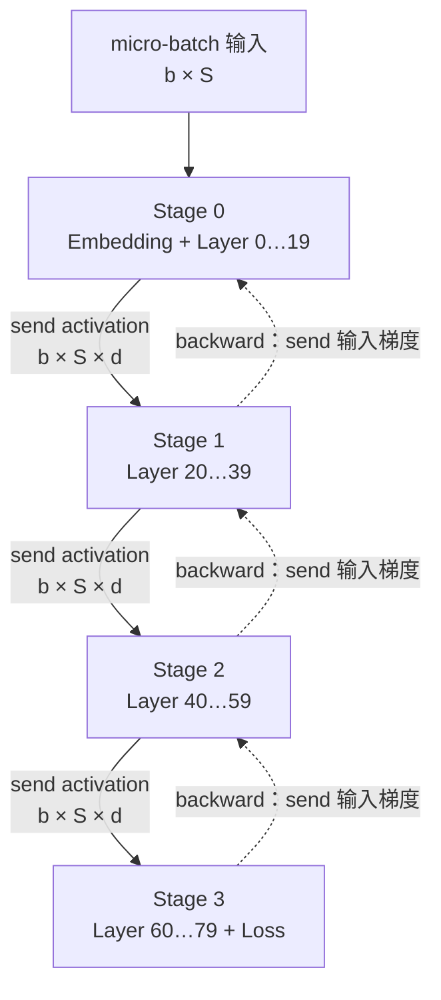
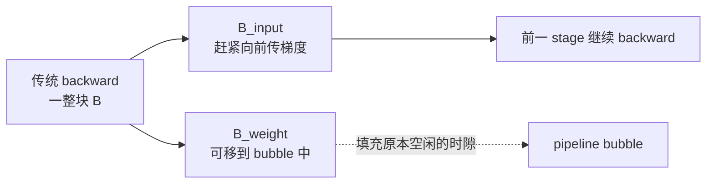

# L44 流水线并行：把层切成一条生产线

> [!abstract] 本课速览
> 读完你将能够：
> 1. 区分流水线并行与张量并行，并画出 stage 边界上的 activation send/recv；
> 2. 从时隙图推导 $(p-1)/(m+p-1)$，算出给定 PP 度与气泡目标所需的 micro-batch 数；
> 3. 解释 GPipe 与 1F1B 的气泡率为何相同、activation 峰值为何不同；
> 4. 说清 interleaved、zero-bubble 与 DualPipe 各自用什么资源换气泡；
> 5. 从消息大小、通信频率和拓扑判断为什么 PP 通常比 TP 更适合跨节点。
>
> 前置：[[L43 张量并行]] · [[L40 训练显存全解剖]] · 预计 50 分钟

## 论文里的这段话，你现在可能读不懂

> [!quote]
> The model is partitioned into pipeline stages, and each global batch is split into micro-batches that traverse stage boundaries through point-to-point activation transfers. After warmup, a 1F1B schedule alternates forward and backward work until cooldown, while a pipeline flush preserves synchronous optimizer semantics. Interleaved virtual stages reduce bubble time at the cost of more communication; zero-bubble schedules and DualPipe further fill idle slots by decomposing backward work or pairing bidirectional flows.（改写自 GPipe、Megatron-LM、Zero Bubble 与 DeepSeek-V3 的典型表述）

这段话把“模型怎么切”“小批次怎么走”“什么时候存 activation”“洞怎么补”“网络发什么”压在了一起。先别背调度名字；把每张卡在每个时隙做什么画出来，所有名词都会变成一张可核算的时间表。

## 一、按层切开之后，显存下来了，GPU 却开始排队

### 1.1 PP 切的是层，不是层内矩阵

**pipeline parallelism, PP**（流水线并行）把一串连续层切成 $p$ 个 **stage**（流水段），通常让每个 stage 放在一张 GPU 或一个 TP 组上。若模型有 $L$ 层且计算较均匀，每个 stage 大约持有 $L/p$ 层、$N/p$ 参数；训练静态状态的字节数再按 [[L40 训练显存全解剖]] 的每参数口径核算。

这和 [[L43 张量并行]] 的分工不同：TP 让多张卡共同完成“同一层里的一个矩阵乘”，PP 则让不同卡各自完成“不同的一段完整层”。旧资料里的 **model parallelism**（模型并行）是两者的历史总称；看到这个词，必须继续问作者切的是层内 tensor，还是层序列。



相邻 stages 在 forward 传边界 activation，在 backward 反向传该 activation 的梯度。这种 **P2P activation transfer**（点对点 activation 传输）由 send/recv 完成；它不是 all-reduce，也不要求所有 ranks 同时参与。

### 1.2 只送一个大 batch，利用率为什么只有 $1/p$

若不切小 batch，stage 1 必须等 stage 0 产出，stage 2 又要等 stage 1。以 $p=4$、forward 与 backward 各占一个等长时隙为例，`F0/B0` 表示同一个 batch 的前向/反向：

```text
朴素按层切（p=4, m=1）        时间 →  01 02 03 04 05 06 07 08
Stage 0                              F0 ·  ·  ·  ·  ·  ·  B0
Stage 1                              ·  F0 ·  ·  ·  ·  B0 ·
Stage 2                              ·  ·  F0 ·  ·  B0 ·  ·
Stage 3                              ·  ·  ·  F0 B0 ·  ·  ·
```

每个 stage 在 8 个时隙中只忙 2 个，利用率正好 $2/8=1/4=1/p$。空白时隙叫 **pipeline bubble**（流水线气泡）：不是程序崩了，而是数据依赖让某个 stage 暂时没有合法工作可做。

> [!tip] 直觉：四个窗口办一张表
> 一份材料要依次盖四个章。若窗口 0 等整摞材料办完才交给窗口 1，任何时刻大多只有一个窗口在忙；若把整摞拆成小份，后一个窗口处理第 0 份时，前一个窗口已经能处理第 1 份。

## 二、GPipe：用 micro-batch 把生产线喂饱

### 2.1 拆 batch，不改变一次 optimizer update 的数学边界

**GPipe** 把一个 global batch 在每个 data-parallel replica 内拆成 $m$ 个 **micro-batch**（微批次），让它们依次穿过流水线。每份输入仍有大小 $b_{micro}$；$m$ 份梯度累积完成后才做一次 optimizer update。若没有额外的梯度累积层次，可以把 [[03 约定与符号]] 中的 $\mathrm{GA}$ 视为这里的 $m$：

$$
B=b_{micro}\times m\times \mathrm{DP}.
$$

序列模型里 $B$ 的单位是“条序列”，不是 token；每 step token 数还要乘 $S$。这一区分很快会在气泡预算里变得要命。

### 2.2 主图：朴素、GPipe、1F1B 的精确时隙

下面统一取 $p=4,m=4$，并把一次 stage forward 与 backward 各归一成一个时隙。`·` 是 bubble；真实 backward 若更长，只需把每个 `B` 横向拉宽，依赖顺序不变。

```text
A. 朴素（m=1）              时间 →  01 02 03 04 05 06 07 08
Stage 0                             F0 ·  ·  ·  ·  ·  ·  B0
Stage 1                             ·  F0 ·  ·  ·  ·  B0 ·
Stage 2                             ·  ·  F0 ·  ·  B0 ·  ·
Stage 3                             ·  ·  ·  F0 B0 ·  ·  ·

B. GPipe（全 F 后全 B）      时间 →  01 02 03 04 05 06 07 08 09 10 11 12 13 14
Stage 0                             F0 F1 F2 F3 ·  ·  ·  ·  ·  ·  B3 B2 B1 B0
Stage 1                             ·  F0 F1 F2 F3 ·  ·  ·  ·  B3 B2 B1 B0 ·
Stage 2                             ·  ·  F0 F1 F2 F3 ·  ·  B3 B2 B1 B0 ·  ·
Stage 3                             ·  ·  ·  F0 F1 F2 F3 B3 B2 B1 B0 ·  ·  ·

C. 1F1B（同样会 flush）      时间 →  01 02 03 04 05 06 07 08 09 10 11 12 13 14
Stage 0                             F0 F1 F2 F3 ·  ·  ·  B0 ·  B1 ·  B2 ·  B3
Stage 1                             ·  F0 F1 F2 F3 ·  B0 ·  B1 ·  B2 ·  B3 ·
Stage 2                             ·  ·  F0 F1 F2 B0 F3 B1 ·  B2 ·  B3 ·  ·
Stage 3                             ·  ·  ·  F0 B0 F1 B1 F2 B2 F3 B3 ·  ·  ·
```

GPipe 先完成所有 micro-batches 的 forward，再按逆序做 backward。相较朴素方案，生产线中段被填满了，但 forward 和 backward 两端仍各有一个三角形空区。

### 2.3 气泡率从哪里来

令每个 stage 处理一个 micro-batch 的 forward、backward 时间分别为 $t_f,t_b$，先假设 stages 完全均衡、通信被包含或隐藏，且不同 micro-batches 耗时相同。$m$ 份有效工作花费

$$
T_{useful}=m(t_f+t_b),
$$

流水线填充与排空额外花费

$$
T_{bubble}=(p-1)(t_f+t_b).
$$

所以总时间与 **bubble ratio**（气泡率）为

$$
T=(m+p-1)(t_f+t_b),
$$

$$
r_{bubble}=\frac{T_{bubble}}{T}
=\frac{p-1}{m+p-1}.
$$

当 $m=1$ 时，$r_{bubble}=(p-1)/p$，利用率 $1-r=1/p$，正好回到朴素方案。上图 $p=4,m=4$ 时，气泡率为 $3/7\approx42.9\%$；每个 stage 忙 8 个、总共 14 个半程时隙，也是 $1-8/14=42.9\%$。

> [!warning] “把 $m$ 调大”不是免费旋钮
> 固定 $b_{micro}$ 与 DP 度时，$m$ 越大，global batch 就越大；固定 global batch 时，又只能减 DP 或减 $b_{micro}$。后者过小会让 GEMM 形状变瘦、GPU 利用率下降。气泡、算法允许的 batch 上限和 DP 扩展度在争同一份预算，[[L47 混合并行组装]] 会把这笔账合起来。

## 三、1F1B：气泡没少，但 activation 不必堆到最后

### 3.1 warmup、steady、cooldown

**1F1B**（one-forward-one-backward，一前一后）不再等待所有 forward 完成。每个 stage 先做若干 forward 把流水线灌起来，然后尽可能交替执行一个 forward 与一个 backward：

- **warmup**（流水线预热段）：越靠前的 stage 需要先放入越多 micro-batches，尚无 backward 可做；
- **steady**（稳态段）：依赖就绪时交替执行 F/B，$m\gg p$ 时各 stage 的中部时间线接近满载；
- **cooldown**（排空段）：不再注入新 forward，把剩余 backward 做完。

上面的 C 图用很短的 $m=4$ 展示依赖顺序，所以稳态尚不长；当 $m$ 远大于 $p$，中间反复的 F/B 锯齿才是论文图里最显眼的部分。

**PipeDream** 是 1F1B 谱系里的代表性系统：原始工作还处理跨 minibatch 权重版本等异步流水问题。现代大模型训练常用的是带同步边界的 PipeDream-Flush / 1F1B 变体：完成同一 global batch 的全部 micro-batches 后执行一次 **pipeline flush**（流水线排空），再更新权重。这样同一步内的 forward/backward 使用一致的参数版本，代价是 step 首尾的 bubble 仍在。

### 3.2 为什么气泡率不变，显存却下降

比较 B、C 两张图：总长度都为 14 个半程时隙，首尾空区面积也一样，因此同步 GPipe 与非交错 1F1B 的理想气泡率相同。变化的是 activation 生存期。

GPipe 的 stage 0 在开始 backward 前，可能已经为 $m$ 个 micro-batches 保存了 forward 所需 activation；1F1B 则让较早 micro-batch 的 backward 提前发生，完成后即可释放对应 activation。均衡非交错流水中，每个 stage 的在飞 activation 数从 $O(m)$ 降到 $O(p)$，常说“最多约 $p$ 份”；各 stage 的精确峰值随位置和实现而变。

这就是 1F1B 的核心价值：==不是用更少气泡换吞吐，而是用相同气泡率换更低 activation 峰值，从而允许更大的 $m$ 去摊薄气泡==。若 activation 仍太大，再与 [[L50 显存优化技术]] 的 recomputation 组合。

## 四、继续填洞：interleaved、zero-bubble 与 DualPipe

### 4.1 interleaved：一张卡拿多段不连续层

**interleaved pipeline**（交错流水线）让每张物理卡持有 $v$ 个非连续的 **virtual stage**（虚拟流水段 / model chunk）。例如 $p=4,v=2$、8 个 chunks：

| 物理 GPU | 持有的 virtual stages | 层序位置 |
|---|---|---|
| GPU 0 | C0、C4 | 最前一段 + 中后一段 |
| GPU 1 | C1、C5 | 第二段 + 更后一段 |
| GPU 2 | C2、C6 | 第三段 + 更后一段 |
| GPU 3 | C3、C7 | 第四段 + 最后一段 |

下面只放大 forward 填充段；`Ck:mj` 表示 virtual stage $k$ 处理 micro-batch $j$。每个 chunk 的计算时间是原物理 stage 的 $1/v$，backward 按反向依赖交错，原理相同。

```text
interleaved forward Gantt（p=4, v=2, m=4）
时间 →  01    02    03    04    05    06    07    08    09    10    11
GPU 0   C0:m0 C0:m1 C0:m2 C0:m3 C4:m0 C4:m1 C4:m2 C4:m3 ·     ·     ·
GPU 1   ·     C1:m0 C1:m1 C1:m2 C1:m3 C5:m0 C5:m1 C5:m2 C5:m3 ·     ·
GPU 2   ·     ·     C2:m0 C2:m1 C2:m2 C2:m3 C6:m0 C6:m1 C6:m2 C6:m3 ·
GPU 3   ·     ·     ·     C3:m0 C3:m1 C3:m2 C3:m3 C7:m0 C7:m1 C7:m2 C7:m3
```

非交错时，一个物理 stage 的 fill/drain bubble time 为 $(p-1)(t_f+t_b)$；理想均衡下，每个 chunk 只占原 stage 的 $1/v$，交错调度把它降为

$$
T_{bubble}^{interleaved}=\frac{(p-1)(t_f+t_b)}{v}.
$$

代价也很直接：同样的层边界被切得更碎，P2P 通信次数与总字节量都约放大 $v$ 倍，调度还要满足 micro-batch/chunk 的整除与依赖约束。==interleaved 省的是 bubble time，不是凭空省计算；它用更多消息和更复杂调度来换。==

### 4.2 zero-bubble：把 backward 拆成两块塞进洞里

**zero-bubble pipeline**（零气泡流水线）观察到 backward 不是不可分的一整块：

- $B_{input}$ 计算对输入 activation 的梯度，必须尽快传给前一个 stage，位于跨 stage 依赖的关键路径；
- $B_{weight}$ 计算本 stage 参数梯度，只要在 optimizer step 前完成即可，调度自由度更大。



《Zero Bubble (Almost) Pipeline Parallelism》中的 ZB-H1 / ZB-V 等调度在不同显存约束下重排这些工作；本课只要求抓住这条直觉。名称里的 zero-bubble 是调度目标，不表示任何模型、任意 kernel 比例下都能零空闲：拆分粒度、算子时长、同步与内存限制仍可能留下尾巴。

### 4.3 DualPipe：把双向流和 MoE 通信一起排

**DualPipe** 是 DeepSeek-V3 技术报告中的双向流水调度：micro-batches 从流水线两端同时进入，把一对 forward/backward chunks 的 attention、MoE all-to-all dispatch、MLP、combine 与 PP 通信重新排序；backward 同样拆分 input-gradient 与 weight-gradient 工作。目标不只减少 bubble，还要让一个方向的计算覆盖另一个方向的通信。

它是“调度即系统设计”的好例子：当 [[L46 专家并行与MoE训练]] 的跨节点 all-to-all 与计算同量级时，PP scheduler 已经不能只排 F/B 方块，还要同时分配 SM、通信流和依赖。DualPipe 也不是免费午餐；技术报告明确给出它需要两份参数副本，而论文中的收益依赖 DeepSeek-V3 的 EP、模型布局和定制通信实现，不能直接外推成任意 dense 模型都更快。

## 五、PP 的三账：显存、气泡与网络

### 5.1 显存账：$1/p$ 静态状态只是起点

理想均衡时，每个 stage 持有约 $N/p$ 参数；若不叠加 ZeRO，Adam 混合精度静态模型状态可按 [[03 约定与符号]] 粗算为 $16N/p$ B。1F1B 还需保存最多 $O(p)$ 份在飞 activation，而 GPipe 可能是 $O(m)$ 份。除此之外还有临时 buffer、通信 buffer、allocator 碎片与 recomputation 策略。

“每段放一样多层”也未必均衡：首 stage 常带 embedding，尾 stage 常带 final norm、output head 与 loss；MoE 层的实际 token 负载还会变化。**stage balancing**（流水段负载均衡）应优先按 profiler 测得的 forward/backward 时间或至少按 FLOPs 切层，并补偿首尾特殊层。流水线吞吐由最慢 stage 的时间决定，多出来的快卡时间最终都会变成 bubble。

### 5.2 通信账：量小、点对点、容易形成计算窗口

对 BF16 hidden activation，一个 stage 边界、一个 micro-batch 的 forward 消息为

$$
n_{act}=b_{micro}\times S\times d\times 2\ \text{B}.
$$

backward 还会沿反方向发送同形状的输入梯度。PP 的网络优势不是“没有通信”，而是：只在 stage 边界通信、参与者是相邻两段、消息是 P2P，并且不同 micro-batches 提供了天然的计算—通信流水窗口。相比每层都可能进入关键路径的 TP collective，PP 更容易把 stage 放到不同节点，甚至为 [[L63 跨域与跨集群训练]] 提供候选切分方式。

> [!example] 算一算：16 段流水要多少 micro-batches，边界消息多大
> 气泡公式与符号取 [[03 约定与符号]]。令 $p=16,m=64$：
>
> $$
> r_{bubble}=\frac{16-1}{64+16-1}
> =\frac{15}{79}\approx18.99\%\approx19\%.
> $$
>
> 若目标是不超过 $5\%$：
>
> $$
> \frac{15}{m+15}\le0.05
> \Rightarrow 15\le0.05m+0.75
> \Rightarrow m\ge285
> =19(p-1).
> $$
>
> 取 $b_{micro}=1$，则 global batch 为
>
> $$
> B=b_{micro}\times m\times\mathrm{DP}
> =285\times\mathrm{DP}\quad\text{条序列}.
> $$
>
> 若 $S=8192$，每 step token 数才是
>
> $$
> B_{token}=285\times8192\times\mathrm{DP}
> =2{,}334{,}720\times\mathrm{DP}\quad\text{tokens}.
> $$
>
> 再取 Llama-3-70B 的统一宽度 $d=8192$、BF16 为 2 B，一个边界的一次 forward activation 为
>
> $$
> n_{act}=1\times8192\times8192\times2
> =134{,}217{,}728\ \text{B}
> \approx134.2\ \text{MB}=128\ \text{MiB}.
> $$
>
> [[03 约定与符号]] 规定 400 Gb/s $=50$ GB/s，因此忽略固定时延、协议效率与拥塞时，线速下界为
>
> $$
> t_{wire}=\frac{134{,}217{,}728}{50\times10^9}
> \approx2.68\ \text{ms}.
> $$
>
> backward 的边界梯度是另一次反向同形状传输。若该 stage 在相邻依赖之间能提供不少于约 2.68 ms 的独立计算窗口，且 send/recv 真能并发，单次传输才有可能被流水隐藏；否则它仍会暴露在关键路径。这里没有假造 stage 计算时间，所以结论是可核验的阈值，不是“400G 一定够”。

### 5.3 为 L47 铺桌：三种并行的通信形状

| 维度 | 切什么 | 主要通信 | 频率与关键路径 | 常见拓扑放置 |
|---|---|---|---|---|
| TP | 同一层内的 tensor / GEMM | activation 规模的 all-reduce、all-gather 等 collective | 一层内多次，依赖紧、较难隐藏 | 优先节点内 NVLink/NVSwitch 域 |
| PP | 连续层组成的 stages | 边界 activation / gradient 的 P2P send/recv | 每边界、每 micro-batch；可与其他 micro-batch 计算流水 | 可跨节点；慢网下仍需核算计算窗口 |
| DP | 数据副本 | 参数梯度规模的 all-reduce，或 RS/AG | 每 step 按 bucket；可与 backward 部分重叠 | 常承担跨节点扩展 |

所以“PP 通信最便宜”应翻译成更严谨的一句：==在常见 Transformer 混合并行中，PP 的通信参与者最少、边界最稀、最有流水机会，因此通常对慢网络最友好==。长序列和大 $d$ 会让单条边界消息变大，stage 太短又会削弱掩盖窗口；它不是无条件的零成本通行证。

PP 最适合层数足够多、能切出若干近似均衡 stages，且单段计算足以摊薄边界通信的超深模型；它尤其适合模型容量迫使层跨节点放置的场景。模型很浅、首尾开销极不均衡，或 $m$ 被 global-batch 上限卡得很小时，继续提高 PP 度往往只会放大 bubble。

> [!warning] 常见误区
> 1. **“PP 的卡在轮流休息，所以没有扩展价值。”** 朴素 $m=1$ 确实只有 $1/p$ 利用率；$m\gg p$ 的 1F1B 稳态可以让各 stage 持续工作，气泡主要留在 step 首尾。
> 2. **“气泡是实现 bug。”** 对需要 flush 的同步流水，填充和排空来自依赖图；增加 $m$ 只能摊薄，interleaved/zero-bubble 则用更多通信或更细算子重排去填洞。
> 3. **“stage 间通信是 collective。”** 普通 PP 边界是相邻 stages 的 P2P send/recv；若 stage 本身是 TP 组，边界周围可能另有 scatter/gather，但那是混合并行实现细节。
> 4. **“层数均分就完成 balancing。”** embedding、output head、MoE 负载和不同层 kernel 时间都可能破坏均衡；最慢 stage 决定整条流水线节拍。

## 六、从系统论文视角看：调度其实在分配四种资源

读一篇新的 pipeline 论文，不要只问“bubble 降了多少”，而应同时画四张账：

1. **依赖账**：是否保持同步 optimizer 语义，何时 flush，有没有 weight version / staleness；
2. **显存账**：每个 stage 持几份参数、多少在飞 activation，是否把 backward 拆分后延长了某些 tensor 的生存期；
3. **网络账**：每个边界的 bytes、消息数、P2P 是否跨慢域，interleaved 是否把通信次数乘了 $v$；
4. **资源竞争账**：通信 kernel 是否占用 SM，计算与通信“重叠”后是否互相降速，最慢 stage 是否被 MoE load imbalance 拖住。

这正落在本课程的 MLSys × 网络主线上：PP 不只是“模型放不下时切层”，还是把计算窗口、链路层级和调度自由度共同映射到多节点基础设施的方法。后续 [[L46 专家并行与MoE训练]] 会看到 all-to-all 如何改变 DualPipe 的排程目标，[[L47 混合并行组装]] 再把 PP、TP、DP、CP、EP 放到同一个 device mesh 里。

## 回到开头那段话

第一句说模型按连续层切成 stages，一个 global batch 再切成 micro-batches；跨 stage 的数据不是参数 collective，而是 forward activation 与 backward 输入梯度的 P2P transfer。

第二句描述同步 1F1B 的三段时间线：warmup 先灌入 forward，steady 尽可能一前一后，cooldown 排空 backward；step 末 pipeline flush 后才更新参数，所以保持同步训练语义。

第三句先讲 interleaved：每卡持 $v$ 个 virtual stages，理想 bubble time 除以 $v$，通信次数约乘 $v$；再讲 zero-bubble：把 $B_{input}$ 与 $B_{weight}$ 拆开，用后者填原来的洞。

第四句落到 DualPipe：它从两端注入 micro-batches，并把 forward/backward、MoE all-to-all 与 PP 通信一起排，以双向流和算子拆分换更少气泡与更多 overlap。现在这段英文不再是一串 scheduler 名字，而是四种“拿什么换空闲”的具体选择。

## 术语卡片

| 术语 | 中文 | 一句话解释 |
|---|---|---|
| pipeline parallelism (PP) | 流水线并行 | 把连续层分到多个 stages，并让不同 micro-batches 流水执行。 |
| stage | 流水段 | 一段连续层及其计算、参数和本地 activation 的执行单元。 |
| micro-batch | 微批次 | global batch 在单个 pipeline replica 内进一步拆出、依次进入流水线的小批数据。 |
| pipeline bubble | 流水线气泡 | 因 stage 依赖与填充/排空造成的设备空闲时隙。 |
| bubble ratio | 气泡率 | 理想均衡同步流水中，空闲时间占总流水时间的比例 $(p-1)/(m+p-1)$。 |
| GPipe | GPipe | 先流水执行全部 micro-batch forward，再逆序执行全部 backward 的同步方案。 |
| 1F1B | 一前一后 | warmup 后尽可能交替执行一个 forward 与一个 backward 的调度。 |
| warmup | 流水线预热段 | step 开头只有 forward 可做、逐步把 micro-batches 灌入各 stages 的阶段。 |
| steady | 流水线稳态段 | warmup 后 F/B 交替、各 stages 在 $m\gg p$ 时接近持续忙碌的阶段。 |
| cooldown | 流水线排空段 | 停止注入新 forward、完成剩余 backward 的阶段。 |
| PipeDream | PipeDream | 代表性的 pipeline 系统，提出 1F1B 等机制并处理双向训练流水与权重版本问题。 |
| interleaved pipeline | 交错流水线 | 每张物理卡持多个不连续 model chunks，以更多通信换更短 bubble time。 |
| virtual stage | 虚拟流水段 | interleaved 调度中映射到物理 GPU 的较小模型分段。 |
| zero-bubble pipeline | 零气泡流水线 | 拆分 input-gradient 与 weight-gradient backward 并重排，以填充气泡的调度家族。 |
| DualPipe | 双向流水调度 | DeepSeek-V3 中从两端注入 micro-batches、联合覆盖计算与通信的调度。 |
| P2P activation transfer | 点对点 activation 传输 | 相邻 stages 在 forward 传 activation、backward 传其输入梯度的 send/recv。 |
| pipeline flush | 流水线排空 | 在参数更新或下一批开始前清空当前流水中的所有 micro-batches。 |
| stage balancing | 流水段负载均衡 | 按实测时间/FLOPs 与特殊层开销切分 stages，使最慢段不过度拖慢节拍。 |

## 自测

1. TP 与 PP 分别切模型的哪个维度？为什么“把第 1–20 层放 GPU 0”不是 TP？
2. 从 $m(t_f+t_b)$ 的有效工作和 $(p-1)(t_f+t_b)$ 的填充/排空时间，推导 bubble ratio。
3. $p=8,m=56$ 时气泡率是多少？若要求不超过 $5\%$，最少需要多少 micro-batches？
4. 为什么 GPipe 与同步非交错 1F1B 的理想气泡率相同，但 activation 峰值不同？
5. 解释 warmup、steady、cooldown 与 pipeline flush；为什么 flush 能简化参数版本语义？
6. interleaved 的 $v$ 增大时，bubble、通信次数和调度复杂度分别怎样变化？zero-bubble 又利用了 backward 的什么结构？
7. 对 $b=2,S=4096,d=8192$ 的 BF16 activation，计算一次 stage 边界 forward 消息的 SI MB；在理想 400 Gb/s 链路上线速下界是多少？
8. 一篇论文声称“PP 只做 P2P，所以一定适合跨地域”。请列出至少四项还必须核算的条件。

> [!note]- 参考答案
> 1. TP 切同一层内部的 tensor/GEMM，多卡共同完成一层；PP 切层序列，不同 stages 各自完成不同连续层。把完整层段放到不同卡是 PP。
> 2. 总时间为 $[m+(p-1)](t_f+t_b)$，其中 bubble time 是 $(p-1)(t_f+t_b)$，相除得到 $(p-1)/(m+p-1)$。
> 3. $r=7/(56+7)=7/63\approx11.1\%$。令 $7/(m+7)\le0.05$，得 $m\ge19\times7=133$。
> 4. 两者需要相同的填充/排空时间；GPipe 等全部 forward 后再 backward，早期 activation 要存到后半程，峰值可达 $O(m)$。1F1B 让早期 backward 尽快完成并释放 activation，峰值降到 $O(p)$。
> 5. warmup 灌入 forward，steady 尽可能 F/B 交替，cooldown 完成剩余 backward；flush 确保本 step 的所有 micro-batches 离开流水线后才统一更新参数，从而避免跨 step 的多版本权重问题。
> 6. 理想 bubble time 约除以 $v$，P2P 次数约乘 $v$，整除/依赖与消息调度更复杂。zero-bubble 把 backward 拆成关键路径上的 input-gradient 计算和可延后的 weight-gradient 计算，用后者填洞。
> 7. $n=2\times4096\times8192\times2=134{,}217{,}728$ B $\approx134.2$ MB。400 Gb/s $=50$ GB/s，线速下界约 $134{,}217{,}728/(50\times10^9)=2.68$ ms；实际还要加固定时延、协议效率与拥塞。
> 8. 至少要看 $S,d,b$ 决定的消息大小、跨域带宽与 RTT、每个 stage 的独立计算窗口、send/recv 与计算能否真并发、stage balance、micro-batch 数与 bubble、丢包/拥塞和 straggler，以及同步语义与故障恢复成本。P2P 参与者少不等于链路代价消失。

## 延伸阅读

- [《GPipe: Efficient Training of Giant Neural Networks using Pipeline Parallelism》](https://proceedings.neurips.cc/paper/2019/hash/093f65e080a295f8076b1c5722a46aa2-Abstract.html)（NeurIPS 2019）：读 Figure 2 与 bubble 分析，掌握“拆 micro-batch + flush”的基线。
- [《PipeDream: Generalized Pipeline Parallelism for DNN Training》](https://dl.acm.org/doi/10.1145/3341301.3359646)（SOSP 2019）：重点读 1F1B、weight stashing 与 stage partition，区分原始异步 PipeDream 和现代同步 flush 变体。
- [《Efficient Large-Scale Language Model Training on GPU Clusters Using Megatron-LM》](https://doi.org/10.1145/3458817.3476209)（SC 2021）：读 pipeline scheduling 与 interleaved schedule，核对 bubble 除以 $v$、通信乘以 $v$ 的交换关系。
- [《Zero Bubble (Almost) Pipeline Parallelism》](https://openreview.net/forum?id=tuzTN0eIO5)（ICLR 2024）：先读 backward 拆分与调度图，再看不同内存上限下的 ZB-H1 / ZB-V。
- [《DeepSeek-V3 Technical Report》](https://arxiv.org/abs/2412.19437)（技术报告）：精读 DualPipe 小节与调度图；配合 [[L46 专家并行与MoE训练]] 看它如何隐藏 MoE all-to-all。

---
上一课：[[L43 张量并行]] ← · → 下一课：[[L45 序列与上下文并行]]
