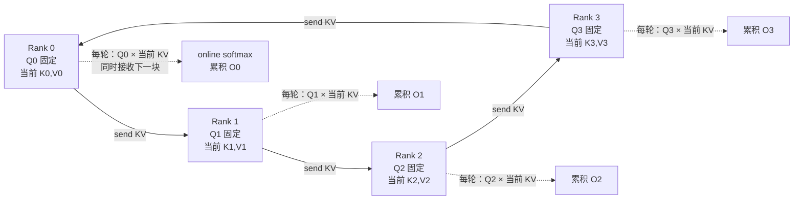
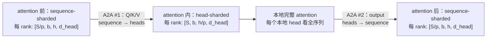

# L45 序列与上下文并行：把百万 token 切给多张卡

> [!abstract] 本课速览
> 读完你将能够：
> 1. 从 $S\times d$ activation 与 $S^2$ attention 两条增长曲线解释为什么长上下文必须切序列；
> 2. 画出 Ring Attention 中“Q 留在本地、KV 绕环流动”的数据路径，并用 online softmax 说明它为何仍是精确 attention；
> 3. 解释 causal attention 的负载不均，以及 zigzag / load-balanced sharding 如何把早、晚 token 配对；
> 4. 画出 DeepSpeed-Ulysses 的两次 all-to-all 维度变换，并说清头数约束；
> 5. 区分 Megatron-SP、Ulysses 所称的 sequence parallelism 与现代语境里的 context parallelism；
> 6. 独立复算 `CP=8, S=128K, d=8192` 的 Ring 通信量，并判断通信能否被计算覆盖。
>
> 前置：[[L11 注意力机制]] · [[L43 张量并行]] · [[L44 流水线并行]] · 预计 50 分钟

## 论文里的这段话，你现在可能读不懂

> [!quote]
> The long-context run shards activations along the sequence dimension. In Ring Attention, local query blocks remain stationary while key-value blocks circulate through point-to-point transfers, and online softmax accumulates the exact output; zigzag, load-balanced sharding mitigates causal load imbalance. DeepSpeed-Ulysses instead uses all-to-all head switching to transpose from sequence shards to head shards and back. This use of context parallelism should not be confused with Megatron sequence parallelism, which shards sequence-wise operators around tensor-parallel regions.（改写自 Ring Attention、DeepSpeed-Ulysses、Megatron-SP 与 Llama 3 的典型表述）

四句话里竟有三种“切序列”。先别按名字站队：只要追问“哪一个 tensor 沿哪一维切、attention 前后做什么通信”，命名混战就会重新变成可以画图、算 bytes 的系统问题。

## 一、为什么百万 token 不能只靠一张更大显存的卡

### 1.1 一条 hidden state 已经是 16 GB，attention 计算还要平方增长

设 batch size 为 1，序列长度 $S=1{,}000{,}000$，hidden size $d=8192$，activation 用 BF16。按 [[03 约定与符号]] 的 2 B/元素口径，仅一份形状为 $[S,d]$ 的 hidden state 就占：

$$
M_{hidden}=S\times d\times2\ \text{B}
=1{,}000{,}000\times8192\times2
=16.384\ \text{GB}.
$$

Q、K、V 三份同形状 tensor 合计约 $49.152$ GB；训练还要为 backward 保存残差、归一化输入、线性层输入等多份 activation。这里的精确倍数依赖 kernel、recomputation 与模型结构，但增长规律不变：**activation scaling with S**（activation 随序列长度的增长关系）中，hidden、QKV、FFN 中间量都至少随 $S$ 线性增长。

attention 还有第二条更陡的曲线。每个 Q 都要和所有 K 交互，dense attention 的计算量随 $S^2d$ 增长。若朴素物化单个 head 的 $S\times S$ BF16 score，$S=1$M 时就是 2 TB；[[L51 算子优化与FlashAttention]] 会用 tiling 避免常驻这张矩阵，却不会消掉 exact dense attention 的 $O(S^2)$ 计算。

> [!tip] 两个水位同时上涨
> FlashAttention 像是“不把整张百万乘百万的表摊在桌上”，解决的是中间表的 I/O 与显存；上下文并行则像“把一百万行分给多张桌子”，解决每卡保存的序列分片。表可以不摊开，但每一对需要交互的行列仍得算。

这种为单个长样本分摊 activation 与 attention 工作的训练场景叫 **long-context training**（长上下文训练）。把一个样本的 context 沿序列维分给 $p$ 个 ranks，通常称 **context parallelism (CP)**（上下文并行）。理想情况下，每卡只常驻 $S/p$ 个 token 的主要 activation；难点是 attention 不能只看本地分片。

### 1.2 哪些算子可以“切了白切”，哪个算子必须跨卡

LayerNorm、dropout、逐元素激活和 Transformer 的 position-wise FFN 都按 token 独立工作。把 $S$ 切成 $p$ 段后，每卡直接处理自己的 $S/p$ 个位置，不需要为这些算子交换别人的 token。

attention 不同。若 rank 0 只拿序列前 $S/p$ 个 Q、K、V，本地 attention 只能让这些 Q 看见前 $S/p$ 个 KV；这已经改变了 [[L11 注意力机制]] 的数学结果。要保持 exact attention，每个本地 Q 最终必须与全序列的 K、V 交互。Ring Attention 与 Ulysses 的分歧，正是“怎样让它见全”：一个移动 KV 块，一个把 sequence layout 转成 head layout。

## 二、Ring Attention：Q 不动，让 KV 绕场一周

### 2.1 主图：每轮收一个 KV 块，边算边传下一站

**Ring Attention**（环式注意力）先把 $Q,K,V$ 都沿序列维切成 $p$ 块。每个 rank 的 Q 块留在原地；K、V 块组成一对，沿逻辑环做 P2P send/recv。经过本地块加 $p-1$ 次远端轮转后，每个 Q 块恰好见过全部 KV。

一轮中，rank 用当前 KV 块算局部 attention tile，同时把它发给下一个 rank、从前一个 rank 接收下一块。只要一块 attention 的计算时间不少于一块 KV 的传输时间，通信就有机会藏在计算后面。这和 FlashAttention 有亲缘：两者都把 attention 分块并维护 softmax 统计量；Ring Attention 再把“下一个块”放到了另一张卡上。

### 2.2 online softmax 为什么不会把结果算错

softmax 的分母依赖一整行 score，看起来必须等全序列到齐。**online softmax**（在线 softmax）用运行中的最大值、指数和与加权和解决这个问题。

假设本地某个 Q 已处理旧块，维护运行最大值 $m$、归一化前的分母 $\ell$ 和加权分子 $z$。新 KV 块产生 score 向量 $x$，块内最大值为 $m_x$，则更新：

$$
m'=\max(m,m_x),
$$

$$
\ell'=e^{m-m'}\ell+\sum_j e^{x_j-m'},
$$

$$
z'=e^{m-m'}z+\sum_j e^{x_j-m'}V_j,
\qquad O=\frac{z'}{\ell'}.
$$

旧块先乘 $e^{m-m'}$，相当于把旧、新两批数都换到同一个数值稳定的标尺上。块按什么顺序到达都能合并成同一个 exact dense-attention 结果；这里只允许正常的浮点舍入差异，并没有改成近似 attention。

> [!warning] “切序列”不等于“只做局部 attention”
> local/sliding-window attention 是改变连接图的模型方法；Ring Attention 和 Ulysses 是重排 exact attention 的系统方法。前者可能省掉远距离交互，后两者仍覆盖原 attention mask 允许的全部 QK 对。

### 2.3 causal load imbalance：后半段 token 天生活更多

对 causal attention，序列越靠后的 Q 能看到的历史越长。若 $p=4$ 且每卡拿一段连续 token，合法 tile 呈下三角：

| 本地 Q 块 | KV0 | KV1 | KV2 | KV3 | 有效工作直觉 |
|---|---:|---:|---:|---:|---|
| Q0（最早） | 半块 | 跳过 | 跳过 | 跳过 | 最少 |
| Q1 | 全块 | 半块 | 跳过 | 跳过 | 较少 |
| Q2 | 全块 | 全块 | 半块 | 跳过 | 较多 |
| Q3（最晚） | 全块 | 全块 | 全块 | 半块 | 最多 |

这叫 **causal load imbalance**（因果 attention 负载不均）：有的 rank 已经跳过被 mask 的 tile，另一些 rank 仍在算完整 tile；同步轮次只能等最慢者。于是普通连续切分很难把 causal mask 理论上接近一半的可跳过计算真正变成一半墙钟时间。

**zigzag / load-balanced sharding**（之字形 / 负载均衡切分）不再让一张卡只拿连续早段或晚段。常见做法把序列先切成 $2p$ 个小块，让 rank $i$ 同时拿第 $i$ 块和第 $2p-1-i$ 块：

| rank | $p=4$ 时持有的 chunks | 配对直觉 |
|---|---|---|
| 0 | 0 + 7 | 最早 + 最晚 |
| 1 | 1 + 6 | 较早 + 较晚 |
| 2 | 2 + 5 | 中早 + 中晚 |
| 3 | 3 + 4 | 中间两段 |

每卡都混有“历史短”和“历史长”的 Q，总有效工作更接近。另一种 Striped Attention 则按位置对设备数取模，把整条序列均匀撒到各卡。两者都保持原 position id 与 causal mask 语义；重新排的是设备布局，不是 token 的逻辑时间顺序。

## 三、DeepSpeed-Ulysses：先从序列切换成头，再切回来

### 3.1 两次 all-to-all 做 layout 转置

**DeepSpeed-Ulysses** 是另一条路线。进入 attention 前，每卡有全体 attention heads、但只有 $S/p$ 个 token；第一次 **all-to-all head switching**（all-to-all 头维切换）把布局改成“全长 $S$、但只有 $h/p$ 个 heads”。各卡独立算自己那组 heads 的完整 attention，第二次 all-to-all 再把输出换回序列分片，交给后续逐 token 算子。

Ulysses 论文把每层 QKV 的第一次 all-to-all 记为聚合消息 $3Sd$，输出的第二次记为 $Sd$；在其网络模型中，每链路通信量写成 $4Sd/p$。真正部署时，per-rank 字节、链路负载与完成时间仍取决于 all-to-all 算法、拓扑、并发流和拥塞，不能把这个复杂度式直接当 wall-clock。

原始纯 Ulysses 需要把 heads 分给 ranks，因此通常要求 $p$ 整除 head 数，并且 $p\le h$。这就是它的**头数上限**。GQA/MQA、与 TP 同时切头时，实际可用度数还可能被 KV heads 或实现布局进一步约束；混合 Ulysses+Ring 的二维方案可以继续扩展，但那已经不是本课这条纯 A2A 路径。

### 3.2 两条流派放在同一张表里

| 维度 | Ring Attention | DeepSpeed-Ulysses |
|---|---|---|
| attention 内谁保持本地 | Q 的 sequence block | 一组 attention heads |
| 主要通信 | 相邻 ranks 的 KV P2P 轮转 | attention 前后两次 all-to-all |
| overlap | 每块 KV 传输可与 blockwise attention 重叠 | collective 通常位于 attention 边界，是否重叠看实现 |
| 并行度约束 | 不直接受 head 数限制；受本地 block 粒度与环时延约束 | 纯方案通常 $p\le h$ 且需可整除 |
| causal attention | 连续切分有负载不均，需 zigzag/striped 等布局 | 每卡持部分 heads 的全序列，head 间负载较自然；mask 支持看 kernel |
| 网络性格 | P2P 流水，拓扑与 straggler 会逐轮影响环 | all-to-all 对 fabric 对分带宽、路由与拥塞敏感 |
| 代表工作 | 《Ring Attention with Blockwise Transformers for Near-Infinite Context》 | 《DeepSpeed Ulysses: System Optimizations for Enabling Training of Extreme Long Sequence Transformer Models》 |

“哪个一定更快”没有脱离机器的答案。节点内高带宽、head 数足够时，优化良好的 all-to-all 往往很有吸引力；跨慢链路、all-to-all 容易拥塞时，Ring 的 P2P 流水可能更容易控制。最终要把本地 attention kernel 时间、有效链路带宽、collective 实现和负载均衡放进同一条 timeline。

## 四、命名大扫除：Megatron-SP 不等于 CP

**sequence parallelism**（序列并行）是一个被多篇工作重复使用、但含义不同的名字。最稳的读法不是背缩写，而是看 tensor shape 与通信位置：

| 看到的名字 | 年份 / 体系线索 | 实际切在哪里 | attention 是否跨序列分布 | 先找什么通信 |
|---|---|---|---|---|
| Megatron sequence parallelism（Megatron-SP） | 2022 预印本 / MLSys 2023；常与 TP 同组 | 把 LayerNorm、dropout 等非 TP 区域沿 sequence 切分 | 主要目标不是让一个 Q 跨多卡找全 KV | TP 区域边界的 all-gather + reduce-scatter |
| DeepSpeed-Ulysses 所称 sequence parallelism | 2023；DeepSpeed | 整层保持 sequence shard，attention 内转成 head shard | 是 | 两次 all-to-all |
| Ring Attention | 2023；blockwise / ring / P2P | QKV 初始均沿 sequence 切 | 是 | KV 的环式 send/recv |
| context parallelism（现代框架常用） | 2023 以后常见 umbrella term | 单个长 context 沿 sequence 分给一组 ranks | 是，具体可用 ring、all-gather 或混合实现 | 先看 KV 在 ring、AG 还是 A2A 中移动 |
| Llama 3 的 CP | 2024 报告；GQA + document mask | $2p$ chunks 配成 $p$ 个负载均衡 sequence shards | 是 | K/V all-gather，不是 Ring Attention |

Megatron-SP 的关键补丁已在 [[L43 张量并行]] 铺过：TP 区域内部 activation 常按 hidden 维切，而 LayerNorm/dropout 的计算量小、却会复制 $S\times d$ activation。Megatron-SP 让这些非 TP 区域沿序列切，再用 all-gather / reduce-scatter 在两种 layout 间转换；它省 activation 显存，但不等于本课“把一次完整 attention 的 context 跨更多设备”的 CP。

> [!warning] 读论文时的三问
> 1. `sequence parallel` 是沿 $S$ 保存 activation，还是连 attention 的全序列交互也分布式执行？
> 2. attention 前后出现的是 AG/RS、A2A，还是环式 P2P？
> 3. 这个并行组是否与 TP 共用，度数又受 heads、KV heads 或拓扑中的哪一项限制？
>
> 三问答完，比作者选择 SP 还是 CP 这个名字更可靠。

## 五、算一算：Ring 的 3.76 GB 到底是“发”“收”还是“收发合计”

> [!example] `CP=8, S=128K, d=8192` 的 forward 通信—计算账
> 取 $p=8$，$S=128\text{K}=131{,}072$，$d=8192$，K/V 均为 BF16 2 B。所有 dtype、H100 dense BF16 与 400 Gb/s 换算均取 [[03 约定与符号]]。
>
> 每卡 sequence block 长度：
>
> $$
> c=\frac{S}{p}=\frac{131{,}072}{8}=16{,}384\ \text{tokens}.
> $$
>
> 一对本地 KV block 的字节数为：
>
> $$
> n_{KV,block}=2\times c\times d\times2\ \text{B}
> =536{,}870{,}912\ \text{B}
> \approx536.9\ \text{MB}=512\ \text{MiB}.
> $$
>
> 每个 rank 先处理本地 KV；为让所有 KV 块绕环传播，随后 $p-1=7$ 个轮转中，每轮发送一个当前 KV block、同时接收一个远端 KV block。因此每 rank 在一次 attention forward 的 KV 环游中：
>
> $$
> n_{send}=n_{recv}
> =n_{KV,block}(p-1)
> =3{,}758{,}096{,}384\ \text{B}
> \approx3.758\ \text{GB}=3.5\ \text{GiB}.
> $$
>
> 所以设计稿公式
>
> $$
> 2\times S\times d\times2\ \text{B}\times\frac{p-1}{p}
> $$
>
> 算出的约 3.76 GB 是==发送量，接收量也各有一份==；若把 NIC endpoint 的 send+recv 字节相加是约 7.52 GB。400 Gb/s 是每方向 50 GB/s，full-duplex 时间不能错误地拿 7.52 GB 除以单方向 50 GB/s。理想单向线速下界为：
>
> $$
> t_{comm}\ge\frac{3.758\times10^9}{50\times10^9}
> \approx0.0752\ \text{s}=75.2\ \text{ms}.
> $$
>
> 若每个 block 一条消息，$7\alpha$ 按统一的 $\alpha\approx10\ \mu\text{s}$ 量级只约 0.07 ms；这里主要是带宽项。真实时间还包括协议效率、P2P 实现、拥塞与同步等待。
>
> 再算每卡 non-causal attention forward 的 QK 与 AV 两个矩阵乘，乘加各按 2 FLOPs：
>
> $$
> F_{attn,rank}
> =4\times\frac{S}{p}\times S\times d
> =70{,}368{,}744{,}177{,}664\ \text{FLOPs}
> \approx70.37\ \text{TFLOPs}.
> $$
>
> 用 H100 BF16 dense 峰值 989 TFLOPS 只求不可能突破的计算时间下界：
>
> $$
> t_{comp}\ge\frac{70.37\times10^{12}}{989\times10^{12}}
> \approx71.2\ \text{ms}.
> $$
>
> 两个下界是同一量级，不能据此宣称“通信一定被完美覆盖”。Ring Attention 论文给出的每块充分条件可写成：block attention 约 $4dc^2$ FLOPs、KV 传输约 $4dc$ B，因此
>
> $$
> \frac{4dc^2}{F}\ge\frac{4dc}{B_{net}}
> \Longrightarrow c\ge\frac{F}{B_{net}}.
> $$
>
> 对本例 H100 + 400 Gb/s，$F/B_{net}\approx989\text{T}/50\text{G}=19{,}780$ tokens，而 $c=16{,}384$，峰值口径下尚未达到充分条件。实际 attention 吞吐低于 dense 峰值会拉长计算窗口，可能让 overlap 成立；causal mask、kernel tile、有效网络带宽和资源竞争又会改变两边。正确结论是：==CP 固定时，计算/通信比随 $S$ 线性改善，长序列越来越容易隐藏通信；短序列会反转，但 128K 这个具体配置仍应实测，不能把“长”直接等同于“免费”。==

这笔账只覆盖 attention forward 的 KV 环游；backward 还会有相应的分布式依赖和通信，不能拿 3.76 GB 当完整训练层的总流量。

## 六、真实系统里，CP 放在 TP、PP 与网络的什么位置

Llama 3 报告给了一个很清楚的现实例子。其 405B 模型的 128K 长上下文阶段采用 TP、CP、PP、DP 四维并行；报告 Table 4 中的 16,384-GPU 配置为 TP=8、CP=16、PP=16、DP=8。它把序列切成 $2\times\text{CP}$ chunks，让 rank $i$ 持有第 $i$ 与第 $2\text{CP}-1-i$ 块做负载均衡。

但 Llama 3 的 CP 不是原始 Ring Attention：它先 all-gather K/V，再让本地 Q 算 attention。报告给出的理由包括更容易支持 document mask，以及 GQA 使 K/V 比 Q 小。这正好提醒我们：CP 是问题维度，不是唯一通信算法；模型的 $h_{kv}$、mask 语义与网络 collective 质量都会改变最合适的实现。

与其他并行维组合时，可先用这张放置直觉：

1. TP 每层通信紧，优先留在节点内高速域；
2. CP 的 Ring/A2A/AG 同样发生在每个 attention 层，应放在高带宽、低拥塞且负载稳定的域，通常仅次于 TP；
3. PP 只跨 stage 边界，较能容忍慢链路；
4. DP/FSDP 跨更外层设备，但还要核算参数 AG/梯度 RS 与 bucket overlap。

[[L47 混合并行组装]] 会把这些维度放入同一个 device mesh。对网络研究，L45 留下的问题尤其直接：Ring 的邻居如何映射到物理 rail，all-to-all 的流量怎样避开 hash collision，causal sharding 如何减少 rank-level straggler，以及 GQA 下复制少量 KV 是否比复杂 P2P pipeline 更划算。

推理侧也会遇到 CP：超长 prompt 的 prefill 仍有大量 QK 交互，可以按 context 分摊；到了逐 token decode，新 Q 只有一个位置，搬 KV 与同步的占比会陡增，训练时的“长序列计算盖通信”不能原样照搬。这个差异留到 [[L60 分布式推理与PD分离]]。

## 回到开头那段话

第一句的 “shards activations along the sequence dimension” 是 CP 的共同起点：单个长样本的 $S\times d$ activation 分到多卡，线性显存项约除以 CP 度。

第二句逐项描述 Ring Attention：Q block 固定，KV 经 P2P 绕环；online softmax 用运行最大值、分母与加权分子合并各块，所以结果仍是 exact attention；zigzag 把早、晚 chunks 配对，缓解 causal attention 后段工作更重造成的 rank 不均。

第三句是 Ulysses：第一次 all-to-all 把 `[S/p, all heads]` 换成 `[full S, heads/p]`，本地算完整序列 attention，第二次再换回。所谓 head switching 是一次分布式 layout 转置，不是更换模型参数。

第四句专门消毒命名：Megatron-SP 主要切 LayerNorm/dropout 等非 TP 区域，并以 AG/RS 连接 TP 区域；现代 CP 则要求 attention 本身跨 sequence shards 保持全局交互。现在看到一篇新论文写 “SP”，你应先找 tensor shape 和 collective，而不是仅凭缩写判断机制。

## 术语卡片

| 术语 | 中文 | 一句话解释 |
|---|---|---|
| context parallelism (CP) | 上下文并行 | 把单个长样本的 context 沿序列维切给多个 ranks，并分布式完成全局 attention。 |
| sequence parallelism | 序列并行 | 被多套系统复用的名称；可能指 Megatron 的非 TP 区域切分，也可能指 Ulysses 式长序列 attention，必须结合通信辨析。 |
| Ring Attention | 环式注意力 | 本地 Q 固定、KV blocks 沿逻辑环轮转并以 blockwise attention 累积 exact 输出。 |
| online softmax | 在线 softmax | 用运行最大值、指数和与加权和逐块合并 score，无需同时持有完整 attention 行。 |
| zigzag / load-balanced sharding | 之字形 / 负载均衡切分 | 把早、晚序列 chunks 配给同一 rank，使 causal attention 的有效工作更均匀。 |
| DeepSpeed-Ulysses | DeepSpeed-Ulysses | 用两次 all-to-all 在 sequence-sharded 与 head-sharded layout 间切换的长序列并行方法。 |
| all-to-all head switching | all-to-all 头维切换 | attention 前后通过 all-to-all 交换 sequence 与 head 两个分片维度。 |
| causal load imbalance | 因果 attention 负载不均 | 连续序列切分下，晚段 Q 可见历史更多，使 ranks 的有效 tile 数和轮次时长不均。 |
| long-context training | 长上下文训练 | 用很长的单条训练序列学习远距离依赖，系统上同时承受线性 activation 与平方 attention 计算增长。 |
| activation scaling with S | activation 随 $S$ 的增长关系 | hidden/QKV 等主要 activation 随 $S$ 线性增长，朴素 attention score 随 $S^2$ 增长。 |

## 自测

1. 为什么 LayerNorm/FFN 可以直接处理本地 $S/p$ 个 token，而 attention 不能只看本地 KV？
2. online softmax 维护哪三类统计量？新块出现更大 score 时，旧块为什么要重新缩放？
3. 画出 4-card Ring Attention 的一轮数据流；完成全局 attention 需要本地块加多少个远端 KV blocks？
4. 对 $p=4,S=64\text{K}=65{,}536,d=8192$ 的 BF16 K/V，计算一次 forward 中每 rank 的发送量、接收量与理想 400 Gb/s 单向线速下界。
5. Ulysses 的两次 all-to-all 分别把什么 layout 变成什么 layout？为什么纯方案的并行度受 head 数约束？
6. 一篇论文只写“we enable sequence parallelism”。列出至少三项你还必须检查的信息，才能判断它是 Megatron-SP、Ring 还是 Ulysses 类方法。
7. 对 causal long-context 模型，连续 Ring、zigzag Ring 与 Ulysses 各自最值得担心的一个系统瓶颈是什么？

> [!note]- 参考答案
> 1. LayerNorm、dropout、逐元素算子和 position-wise FFN 对 token 位置相互独立；attention 中每个 Q 必须与 mask 允许的全局 KV 交互，只算本地 KV 会改变模型结果。
> 2. 维护运行最大值 $m$、指数分母和 $\ell$、带 V 的加权分子 $z$。新最大值 $m'$ 改变了数值稳定的指数基准，旧统计量必须乘 $e^{m-m'}$ 才能与新块在同一标尺上相加。
> 3. 本地 Q 固定，当前 KV 向下一 rank 发送、同时从上一 rank 接收下一 KV；每轮计算一个 Q×KV tile。每个 Q 需处理自己的 1 块和 $p-1=3$ 个远端块。
> 4. $c=S/p=16{,}384$。一对 KV block 为 $2\times16{,}384\times8192\times2=536{,}870{,}912$ B。三个轮转使发送量与接收量各为 $1{,}610{,}612{,}736$ B $\approx1.611$ GB；send+recv 合计约 3.221 GB。单方向 50 GB/s 的理想下界为 $1.6106/50\approx0.0322$ s，即 32.2 ms。
> 5. 第一次从 `[S/p, all heads]` 变成 `[S, heads/p]`，第二次把 attention 输出换回 `[S/p, all heads]`。每 rank 至少要分到可执行的一组 heads，因此原始纯方案通常要求 $p\le h$ 且 head 数可被 $p$ 整除；GQA/TP 组合还可能更紧。
> 6. 至少检查：attention 内 tensor shape 沿 sequence 还是 head 切；attention 前后是 AG/RS、A2A 还是 P2P ring；并行组是否与 TP 共用；每个 Q 如何见到全局 KV；是否存在 head/KV-head 约束。
> 7. 连续 Ring 要担心 causal rank imbalance 与最慢环节；zigzag Ring 改善负载后仍受 P2P overlap、tile 粒度和环 straggler 影响；Ulysses 要担心 all-to-all 的对分带宽、路由拥塞与 head 数约束。具体优劣必须用目标 topology 和 kernel 实测。

## 延伸阅读

- [《Ring Attention with Blockwise Transformers for Near-Infinite Context》](https://arxiv.org/abs/2310.01889)（arXiv 2023）：重点读方法图、online/blockwise 累积与 $c\ge F/B$ 的 overlap 条件。
- [《DeepSpeed Ulysses: System Optimizations for Enabling Training of Extreme Long Sequence Transformer Models》](https://arxiv.org/abs/2309.14509)（arXiv 2023）：重点读两次 all-to-all 的 tensor layout 与 $4Sd/p$ 通信分析。
- [《Reducing Activation Recomputation in Large Transformer Models》](https://proceedings.mlsys.org/paper_files/paper/2023/hash/80083951326cf5b35e5100260d64ed81-Abstract-mlsys2023.html)（MLSys 2023）：读 Figure 5–6，弄清 Megatron-SP 的 AG/RS 转换为什么不等于 CP。
- [《Striped Attention: Faster Ring Attention for Causal Transformers》](https://arxiv.org/abs/2311.09431)（arXiv 2023）：读 causal tile 图，比较连续切分与按位置条带化的负载。
- [《The Llama 3 Herd of Models》](https://ai.meta.com/research/publications/the-llama-3-herd-of-models/)（Meta 2024）：精读 context parallelism 与 Table 4，观察生产系统为何选择 zigzag chunks + KV all-gather 而非原始 Ring。

---
上一课：[[L44 流水线并行]] ← · → 下一课：[[L46 专家并行与MoE训练]]
