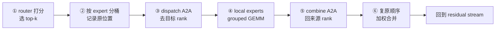
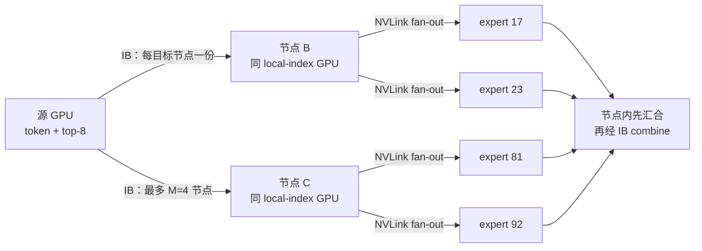

# L46 专家并行与MoE训练：驯服数据依赖的网络风暴

> [!abstract] 本课速览
> 读完你将能够：
> 1. 顺着一个 token 画出 router、dispatch、expert compute、combine 的完整旅程，并解释训练时每个 MoE 层为什么有四次 all-to-all；
> 2. 从 $Tkdq$ 推导每 rank 的通信量，区分逻辑 payload、跨节点流量与实际 wire traffic；
> 3. 解释热门专家如何把局部负载不均放大成全局 straggler，并比较路由、容量、放置三层治理手段；
> 4. 读懂 DeepSeek-V3 的 node-limited routing、DualPipe 与两级 IB/NVLink 通信为什么必须协同设计。
>
> 前置：[[L17 MoE混合专家]] · [[L36 集合通信原语]] · [[L44 流水线并行]] · 预计 55 分钟

## 论文里的这段话，你现在可能读不懂

> [!quote]
> With **expert parallelism**, **token routing** turns every MoE layer into a **dispatch all-to-all**, **grouped GEMMs**, and a **combine all-to-all**. Data-dependent **load imbalance** can make the rank hosting a **hot expert** a global **straggler**, even in **dropless** training. **Node-limited routing**, **expert placement**, and **EPLB** reduce inter-node traffic and rebalance device load. **DeepEP** and **DualPipe** seek to overlap the remaining communication with computation.
>
> （改写自《DeepSeek-V3 Technical Report》及 DeepEP/EPLB 官方说明的典型系统表述；不是逐字引文）

这三句的主语看似是 MoE，真正的故事却发生在网络里：router 每一步都可能改写通信矩阵；一张卡多收了一批 token，就可能让几千张卡一起等。[[L17 MoE混合专家]] 已讲过“为什么只激活少数专家”，本课只追问一个系统问题：==这些专家不在本卡时，token 怎样去、怎样回、怎样不把集群堵死？==

## 一、一个 token 的跨卡往返

### 1.1 EP 切的不是矩阵，而是专家集合

设一个 MoE 层有 $E$ 个 routed experts，**expert parallelism (EP)**（专家并行）组有 $ep$ 个 ranks。最简单的均匀放置让每个 rank 保存 $E/ep$ 个专家；attention、router 等 dense 部分可以仍在各 rank 复制。与 [[L43 张量并行]] 把同一矩阵切开不同，EP 通常让一个专家的权重完整落在某个 rank 上，再把 token 搬到权重旁边计算。

这就是 **expert placement**（专家放置）：回答“逻辑专家及其副本分别驻留在哪张 GPU、哪个节点”。router 决定 token 想去哪里，placement 决定这个愿望要走 NVLink 还是跨节点网络。

### 1.2 六步旅程：先分拣，再去专家，最后回家

把一个 rank 上的本地 token 记为 $t_0,t_1,\ldots$。一次 MoE forward 可拆成六步：

1. router 为每个 token 对所有专家打分，执行 **token routing**（token 路由）并选出 top-$k$ 专家及权重；
2. 按目标 expert/rank 对 hidden states 做分桶、重排，并记录原始 token 位置；
3. **dispatch**（派发）all-to-all 把每份 hidden state 发给目标 expert owner；
4. owner 把发往同一专家的 token 聚成小 batch，执行 expert FFN；
5. **combine**（汇合）all-to-all 把 expert 输出送回 token 的来源 rank；
6. 来源 rank 按原位置复原顺序，再用 router 权重合并 top-$k$ 输出。

forward 因而有两次 **all-to-all**（全对全通信）。backward 沿计算图反向走：combine 的 backward 是一次 dispatch，dispatch 的 backward 又是一次 combine，所以每个 MoE 层每个训练 step 还要两次，总计四次。这里的 **dispatch/combine** 不是两种新的集合通信原语，而是 MoE 对两段数据搬运的语义命名；底层可实现成 all-to-all-v、定制 point-to-point 调度或融合 kernel。

> [!tip] 直觉：包裹分拨中心
> token 像包裹，router 写目的地，dispatch 把包裹送到专门车间，expert 完成加工，combine 再送回寄件仓。top-$k$ 意味着同一件包裹要复制给 $k$ 个车间；最后不是任选一个结果，而是按权重合并。

### 1.3 为什么常说“attention 是 DP，FFN 是 EP”

有些系统让 EP 复用原本的 DP ranks：对 dense attention 来说，这些 ranks 各自处理不同 token、持有同一份 dense 权重，行为像 data parallelism；进入 MoE FFN 后，同一组 ranks 改为各持一部分 experts，并互相 dispatch token。它不是“整层同时既 DP 又 EP”的含糊标签，而是==同一设备组对不同参数子模块采用不同分布方式==。

EP 还可以与 TP 组合：当单个 expert 也放不下一张卡时，再把 expert 内部矩阵做 tensor parallelism。代价是 token 先跨 EP 找专家、专家内部又要走 TP collective；哪些维度放在同一高速域，将留给 [[L47 混合并行组装]] 收口。

## 二、为什么 all-to-all 比 all-reduce 难伺候

### 2.1 通信矩阵每一步都在变

[[L36 集合通信原语]] 中的 all-reduce 通常让每个 rank 处理同形状 tensor，梯度 bucket 大小在训练开始前就能知道。MoE 的 all-to-all 不一样：目的 rank 和每对 rank 的字节数由当步 router 输出决定。即使 token 总数不变，主题、语言和训练阶段变化也会让流量矩阵改变。

| 维度 | all-reduce 梯度同步 | MoE dispatch/combine |
|---|---|---|
| 每对 rank 的数据量 | 通常规则、可预知 | 数据依赖、每 step 可变 |
| 数据操作 | 传输并规约 | 重排、变长交换，combine 还可能累加 |
| 主要压力 | 总带宽、算法拓扑 | 对分带宽、热点、incast、变长 buffer |
| 静态优化 | 容易预分 bucket、选 ring/tree | 需先统计路由计数，再生成 offsets/调度 |
| 慢 rank 影响 | collective 完成被最慢参与者拖住 | dispatch 后的 expert compute 与 combine 一起被拖住 |

一个热门 expert 会让许多发送者同时把 token 压向同一 owner，形成 **incast**（多打一汇聚）并冲击接收队列，机制可回看 [[L30 无损网络与拥塞控制]]。同时，all-to-all 把总 payload 切成许多 peer 消息，小消息时 $\alpha$ 项、元数据交换和 kernel launch 都更显眼；大消息时又会逼近网络的对分带宽上限。

> [!warning] “all-to-all 是 barrier”要说准确
> all-to-all 本身不等于 barrier 原语；但 MoE 的下一段 expert compute 要等所需 token 到达，combine 后的后续层也要等结果复原。于是它在关键路径上表现出 barrier-like 的同步放大效应：最慢通信或最忙 expert 会卡住整体推进。

### 2.2 一次 dispatch 到底发多少

设每 rank 在这一层有 $T=bS$ 个 token，每 token 选择 $k$ 个专家，hidden width 为 $d$，通信 dtype 每元素 $q$ B。忽略路由索引、scale、对齐 padding 与协议头，一次 dispatch 的逻辑 payload 上界为：

$$
V_{\mathrm{dispatch}}=T\times k\times d\times q\quad\text{B/rank}.
$$

$k$ 出现在式子里，是因为一个 token 的 hidden state 要复制给 $k$ 个专家。combine 把 $k$ 份 expert 输出送回，若输出宽度仍为 $d$，逻辑 payload 同阶。注意这是“算法要搬的 hidden-state 副本”，不自动等于跨节点 wire traffic：本地专家不用过网；同一节点的多个专家可先跨 IB 发送一份，再在 NVLink 域内转发；combine 也可能在节点内先累加。

> [!example] 算一算：DeepSeek-V3 风格的一步 A2A 账
> 按 [[03 约定与符号]] 的 SI 单位和 dtype 口径，取设计稿固定的教学场景 $T=bS=4096$ token，并从参考模型表取 top-$k=8$、$d=7168$；先做一个统一 BF16（$q=2$ B）的上界：
>
> $$
> \begin{aligned}
> V_{\mathrm{one\ A2A}}
> &=4096\times8\times7168\times2\\
> &=469{,}762{,}048\ \text{B}\\
> &\approx0.470\ \text{GB/rank}.
> \end{aligned}
> $$
>
> 《DeepSeek-V3 Technical Report》给出 61 层、前三层为 dense FFN，因此有 $61-3=58$ 个 MoE 层。若 forward 两次、backward 两次都按上述 BF16 payload 记账：
>
> $$
> V_{\mathrm{step}}=0.470\times58\times4\approx109\ \text{GB/rank/step}.
> $$
>
> [[03 约定与符号]] 规定 400 Gb/s $=50$ GB/s（每端口每方向）。在“109 GB 全部串行穿过单个 400G 端口”的未优化假设下，完全不重叠且忽略协议和拥塞，裸传时间为：
>
> $$
> t_{\mathrm{wire}}\ge\frac{109}{50}\approx2.18\ \text{s/step}.
> $$
>
> 这 109 GB 是便于复算的==逻辑 BF16 上界，不是 DeepSeek-V3 实测 wire traffic==，2.18 s 也只属于上述“全量过单端口”的思维实验。报告说明其实际 dispatch 量化为 FP8、forward/backward combine 保留 BF16；只按 dtype 修正，四程约为 $2\times0.235+2\times0.470=1.41$ GB/层，58 层约 81.7 GB/rank/step，仍是百 GB 邻近量级。再考虑本地流量、node-limited 转发、路由分布与融合，才会得到真实跨网字节。结论不变：==不做低精度、拓扑约束和通信-计算重叠，MoE 省下的 FLOPs 会被网络吐回去。==

## 三、负载不均如何变成全局 straggler

### 3.1 从热门专家到最慢 rank

若本层共有 $T_{\mathrm{group}}$ 个 token、每个选 $k$ 个专家，$E$ 个专家的理想平均接待量是：

$$
\bar{n}=\frac{kT_{\mathrm{group}}}{E}.
$$

把专家 $i$ 的实际 token 数记为 $n_i$，可以用 $\rho=\max_i n_i/\bar{n}$ 做最简单的倾斜指标。$
ho=2$ 表示最热 expert 接到平均值两倍的 token。**hot expert**（热门专家）不仅多做一倍 FFN，还要多收 dispatch、多发 combine；如果同一 rank 放着多个热门专家，设备级倾斜会继续叠加。

**load imbalance**（负载不均）因此不是“平均值有点不漂亮”，而是尾部问题。**straggler**（掉队者 / 慢 rank）指在同步阶段完成得更晚、迫使其他参与者等待的 rank；成因可以是路由负载、网络拥塞、GPU 降频或其他干扰。本课重点是 routing-induced straggler：router 的统计偏斜先制造 expert 热点，再经同步依赖放大成全局 step 尾部。

下面是一个示意热力图，块越深表示该 expert 在该 step 接到的 token 越多。E2 连续热门；若 E2、E5 恰好同卡，placement 会让问题更糟。

| expert \ step | 1 | 2 | 3 | 4 | 5 |
|---|---:|---:|---:|---:|---:|
| E0 | ░ | ▒ | ░ | ▒ | ░ |
| E1 | ▒ | ░ | ▒ | ░ | ▒ |
| E2 | █ | █ | ▓ | █ | █ |
| E3 | ░ | ▒ | ░ | ░ | ▒ |
| E4 | ▒ | ░ | ▒ | ▒ | ░ |
| E5 | ▓ | ▒ | ▓ | ▒ | ▓ |

### 3.2 三层治理：改路由、管容量、挪专家

| 层次 | 控制旋钮 | 解决什么 | 新代价 |
|---|---|---|---|
| 算法 / 路由层 | auxiliary loss、auxiliary-loss-free bias | 让 token 选择更均匀 | 平衡约束过强可能干扰任务目标 |
| 容量层 | **capacity factor**（容量因子）、**token dropping**（token 丢弃）/ **dropless**（不丢 token） | 给每个 expert 设接待上限，或承诺全部处理 | 固定容量会 padding/丢 token；动态容量带来 buffer 与尾部波动 |
| 放置层 | expert replication、expert placement、**EPLB** | 把热点副本与冷门专家重新打包到设备 | 占额外权重显存，迁移与统计有控制面成本 |

前两层已在 [[L17 MoE混合专家]] 见过：capacity factor 用平均负载的倍数设容量；溢出时 token dropping 让部分 token 跳过 expert，dropless 则动态接住所有 token。dropless 保住语义不等于自动均衡——热门 rank 仍可能成为 straggler，只是系统不能靠“丢掉麻烦 token”缩短尾巴。

放置层的 **EPLB**（Expert Parallelism Load Balancer，专家并行负载均衡器）是另一条路。[DeepSeek 开源 EPLB 的说明](https://github.com/deepseek-ai/EPLB)给出一种做法：从历史统计估计 expert load，复制高负载专家，再把 replicas 打包到 nodes/GPUs，使节点与 GPU 的总负载更接近；在 group-limited routing 下，还尽量把同组专家放在同一节点，降低跨节点流量。它优化的是“专家副本放哪儿”，不是替代 router 的训练目标。官方仓库当前示例还区分 prefill/decode 的 placement policy，不能据此假定训练中会每 step 迁移专家。

expert 收到的 token 数通常不相等。若为每个小专家单独 launch 一个 GEMM，矩阵太小、launch 太碎。**grouped GEMM**（分组 GEMM）把多个不同 $M$ 维的 expert GEMM 组织在一次或少数 kernel 中调度，提高利用率、减少 launch 开销。它能改善“每份工作太碎”，却不能消灭最热专家的总工作量。

## 四、DeepSeek-V3：算法、调度与网络必须一起改

[《DeepSeek-V3 Technical Report》](https://arxiv.org/html/2412.19437)给出了一套很适合网络研究者拆解的实例：2048 张 H800，节点内 8 GPU 走 NVLink/NVSwitch，节点间走 InfiniBand；训练使用 PP16、跨 8 节点的 EP64 与 ZeRO-1 DP，并避免 TP。它不是靠一个“更快 all-to-all”解决问题，而是同时限制路由、设计两级转发、重排流水调度。

### 4.1 node-limited / group-limited routing：先限制目的节点数

**node-limited / group-limited routing**（节点受限 / 分组受限路由）先按 node/group 汇总 affinity，再只允许 token 在少数目标节点内选 expert。DeepSeek-V3 的 top-$8$ 路由约束每 token 最多到 $M=4$ 个节点：先通过 IB 把 hidden state 发给目标节点上相同 local index 的 GPU，再由该 GPU 通过 NVLink 转发给真正的 expert owner；combine 反向聚合。

做一个理想化上界比较：若 top-$8$ 的 8 个专家原本分散到 8 个远端节点，跨节点要发送 8 份 hidden vector；限制到最多 4 个节点并在节点内 fan-out 后，跨节点 dispatch 副本数最多为 4，比例为：

$$
\frac{k_{\mathrm{node}}}{k}=\frac{4}{8}=50\%.
$$

这不是“任意 MoE 网络流量必减半”的定律：若多个目标专家本来就在同一节点、部分 expert 本地可达，基线就不到 8 份；路由元数据、combine 聚合与 expert placement 也会改变 wire bytes。它表达的是 node-limited 的核心杠杆：==允许的目标节点数，而不是目标专家数，决定昂贵的跨节点复制次数。==

### 4.2 DualPipe：不是等通信结束，而是改执行顺序

**DualPipe**（双向流水调度）已在 [[L44 流水线并行]] 讲过气泡。本课要补上 MoE 视角：报告把一个 chunk 拆成 attention、dispatch A2A、expert MLP、combine A2A，并把 backward 再拆成 input-gradient 与 weight-gradient 部分；来自流水两端的 forward/backward chunks 重新排列，让某个 chunk 通信时，GPU 可计算另一个 chunk。

所以“DualPipe 把 A2A 藏进气泡”只是直觉说法，更准确的是：它创造跨 chunk 的独立计算窗口，并手工协调 compute/communication 对 SM 的占用。没有足够计算窗口、依赖关系不允许并发，或通信 kernel 抢走太多 SM/L2 资源，都无法得到完整 overlap。

### 4.3 DeepEP：把 dispatch/combine 做成拓扑感知 kernel

**DeepEP**（DeepSeek 的 EP 通信库）是 DeepSeek 后续开源的通信组件，[官方 README](https://github.com/deepseek-ai/DeepEP)将其核心定位为 MoE dispatch/combine 的高吞吐、低时延 all-to-all kernels，并支持低精度通信。与“直接调用一个通用 A2A”相比，它显式面向 NVLink 与 RDMA 两级路径、变长 token 布局、dispatch/combine 融合以及通信-计算重叠。

通信 kernel 并不是免费 DMA：打包、转发、累加和同步可能占 SM、寄存器、L2 与 HBM 带宽，进而挤慢同卡 GEMM。V3 报告的特定实现以 20 个 SM、10 个 communication channels 组织 IB/NVLink 的收发与转发，并通过定制 PTX、chunk auto-tuning 减少对其他计算的干扰。这个数字是报告配置，不是所有 DeepEP 版本或所有 GPU 的固定常数；真正的优化目标是端到端 step time，而不是让通信 kernel 单项带宽最好看。

> [!warning] 三个常见误区
> 1. **“MoE 少算，所以训练一定更快”**：少的是 expert FLOPs；A2A、负载尾部与小 GEMM 利用率可能把收益吃完。
> 2. **“A2A 和 all-reduce 只是名字不同”**：all-reduce 的 tensor 形状通常静态，MoE A2A 的通信矩阵由 token routing 每步生成。
> 3. **“负载均衡只归模型算法管”**：router bias、capacity、replica placement、拓扑路由、网络拥塞控制与 kernel 调度共同决定系统尾部。

## 五、这为什么是网络与系统研究的富矿

EP 同时暴露三类可优化变量：

1. **流量如何塑形**：在不明显伤害模型选择质量的前提下，能否把 token 的目标节点数、链路最大负载或 incast 风险写进 routing objective？
2. **专家如何放置**：给定历史/预测负载、GPU 显存、NVLink 域与网络拓扑，怎样联合决定 replica 数、placement 与迁移时机？
3. **尾部如何生存**：面对 hot expert、拥塞、慢卡或节点故障，能否重路由到 replica、临时降级 top-$k$，并约束 step-time/SLO 的恶化？

这三类问题分别把模型的 token affinity 接到网络流量工程、资源调度和生存性设计上。评估时不能只报平均 expert load：至少还要看最大/平均负载比、per-link bytes、A2A 暴露时长、端到端 step time，以及不同输入分布和故障下的尾部。

## 回到开头那段话

现在逐句回读：

1. **“Token routing turns every MoE layer into a dispatch all-to-all, grouped GEMMs, and a combine all-to-all.”** router 先生成每步不同的目标矩阵；dispatch 去 expert owner，同一 owner 上按 expert 分桶做 grouped GEMM，combine 再回来源。forward 两次 A2A，backward 对称地再来两次。
2. **“Load imbalance can make a hot expert's rank a global straggler, even in dropless training.”** dropless 只保证 token 不被丢；若热门专家接得更多，owner 的通信和计算仍最慢，并经关键路径同步放大到全局 step。
3. **“Node-limited routing, expert placement, and EPLB reduce inter-node traffic and rebalance device load.”** 前者限制昂贵的目标节点数，后两者复制/重排专家，让每 GPU 的总负载更均匀；它们控制的是不同层面的变量，不能互相替代。
4. **“DeepEP and DualPipe seek to overlap the remaining communication with computation.”** DeepEP 优化 token 搬运与两级互联 kernel，DualPipe 创造可重叠的执行窗口；只有 topology、kernel 资源占用和调度依赖一起匹配，A2A 才可能从 timeline 上消失。

一句话收束：==EP 用搬 token 换取少算参数；MoE 训练的胜负，不只取决于搬了多少，还取决于搬向哪里、谁最后到、能否藏在计算后面。==

## 术语卡片

| 术语 | 中文 | 一句话解释 |
|---|---|---|
| expert parallelism (EP) | 专家并行 | 将不同 experts 放到不同 ranks，并把 token 路由到 expert owner 的并行方式。 |
| dispatch/combine | 派发 / 汇合 | 将 token hidden states 送往专家，再把专家输出送回来源并加权复原的两段通信。 |
| all-to-all | 全对全通信 | 每个 rank 可向所有 ranks 发送不同数据；MoE 中承载数据依赖的 dispatch/combine。 |
| token routing | token 路由 | router 为每个 token 选择目标 experts，并生成索引与权重。 |
| load imbalance | 负载不均 | token、通信或计算在 experts/ranks 之间分配不均的状态。 |
| hot expert | 热门专家 | 在一段 workload 中持续接收显著多于平均 token 的 expert。 |
| capacity factor | 容量因子 | 按平均 token 负载的倍数设置每个 expert 接待上限。 |
| token dropping | token 丢弃 | expert 容量溢出时跳过部分 token 的 expert 计算。 |
| dropless | 不丢 token | 即使路由不均也处理全部已选 token 的容量策略。 |
| EPLB | 专家并行负载均衡器 | 根据估计负载复制热门专家并生成平衡的 expert placement。 |
| expert placement | 专家放置 | 决定逻辑 expert 及其 replicas 驻留在哪些 GPUs/nodes。 |
| node-limited / group-limited routing | 节点受限 / 分组受限路由 | 限制 token 可到达的目标 node/group 数，以控制跨域流量。 |
| DualPipe | 双向流水调度 | 重排双向 forward/backward chunks，以重叠 MoE A2A、PP 通信与计算。 |
| DeepEP | DeepSeek EP 通信库 | 面向 MoE dispatch/combine 的高性能、低精度、拓扑感知通信 kernel 库。 |
| grouped GEMM | 分组 GEMM | 在一次或少数 kernel 中调度多组不同形状的 expert 矩阵乘。 |
| straggler | 掉队者 / 慢 rank | 在同步阶段完成最晚并迫使其他参与者等待的 rank。 |

## 自测

1. 一个 token 在 EP MoE 层的 forward 中经历哪六步？为什么 backward 还会再产生两次 A2A？
2. 为什么 MoE dispatch 的通信矩阵是数据依赖的？这会让哪些静态优化比 all-reduce 更难？
3. **计算题**：每 rank 有 2048 token，top-$k=4$，$d=4096$，使用 BF16。一次 dispatch 的逻辑 payload 是多少 GB？若 32 个 MoE 层、每层每 step 四次同量级 A2A，总 payload 是多少 GB/rank？
4. all-to-all 不是 barrier 原语，为什么它在 MoE 训练的关键路径上仍会表现出 barrier-like 效应？
5. capacity factor、dropless 与 EPLB 分别控制哪一层问题？它们为什么不能互相替代？
6. DeepSeek-V3 的 top-$8$、最多 4 个目标节点在理想化“原本每专家一节点”场景下，能把跨节点 hidden-vector 副本降到原来的多少？为什么这不是普适流量定律？
7. 设计一个 EP 性能实验：除平均吞吐外，至少还应记录哪四类指标，才能区分路由倾斜、网络拥塞与 kernel 资源竞争？

> [!note]- 参考答案
> 1. router 打分 → 分桶/记录位置 → dispatch A2A → 本地 expert compute → combine A2A → 复原并加权。backward 对两段通信求梯度：combine 的 backward 对应 dispatch，dispatch 的 backward 对应 combine，所以再有两次。
> 2. 目的 experts 由当步 token hidden states 与 router 分数决定，因此每对 ranks 的 token 数和字节数可变。固定 split sizes、静态 offsets、稳定 peer schedule、固定 buffer 与长期均匀流量假设都会更难成立。
> 3. 一次为 $2048\times4\times4096\times2=67{,}108{,}864$ B $\approx0.0671$ GB。全 step 为 $0.0671\times32\times4\approx8.59$ GB/rank；均为忽略元数据、本地流量与协议的逻辑 payload。
> 4. 下一段 expert compute 依赖 dispatch 到达，后续层又依赖 combine 复原。最慢 peer、最忙 expert 或最拥塞路径会拖住关键依赖，即使 collective API 没有额外 barrier 语义，也会出现全局等待。
> 5. capacity factor 管每 expert 的接待上限；dropless 决定溢出时仍处理全部 token；EPLB 管 expert replicas 的放置。它们分别作用于容量语义与物理资源映射，不能单独保证路由质量、通信均匀和设备尾部同时最优。
> 6. 最多从 8 份降为 4 份，即 $4/8=50\%$。真实比例还取决于专家是否同节点/本地、节点内 fan-out、combine 聚合、placement、元数据和协议，因此不能把 50% 当作任意集群的实测节省。
> 7. 至少记录：per-expert 与 per-rank token histogram/最大平均比；per-NIC/per-link bytes、拥塞与重传/ECN 指标；dispatch/combine 的暴露时长与 p50/p99；expert/communication kernel 的 SM、HBM/L2 利用及 overlap；最后用端到端 step time 和 straggler 分布收口。

## 延伸阅读

- [《DeepSeek-V3 Technical Report》](https://arxiv.org/html/2412.19437)（arXiv v2 2025）：精读 2.1.2 与 3.2，核对 node-limited routing、DualPipe 和跨节点 A2A 的协同设计。
- [DeepEP 官方仓库](https://github.com/deepseek-ai/DeepEP)：先读 README 的 dispatch/combine 接口、低精度与 topology 模式；性能表只在匹配硬件和版本时比较。
- [EPLB 官方仓库](https://github.com/deepseek-ai/EPLB)：读 hierarchical/global balancing 的输入输出，区分“预测负载”与“根据负载生成 replica/placement”。
- [DualPipe 官方仓库](https://github.com/deepseek-ai/DualPipe)：对照 schedule 图观察哪些 forward/backward 计算块与通信块真正重叠。
- [《GShard: Scaling Giant Models with Conditional Computation and Automatic Sharding》](https://arxiv.org/abs/2006.16668)（arXiv 2020）：选读 MoE sharding 与编译器接口，理解大规模 expert parallelism 的早期系统化实现。

---
上一课：[[L45 序列与上下文并行]] ← · → 下一课：[[L47 混合并行组装]]
