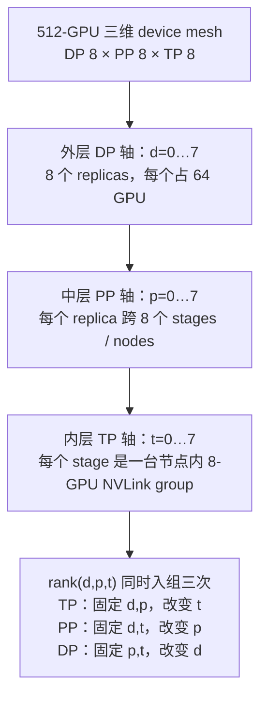
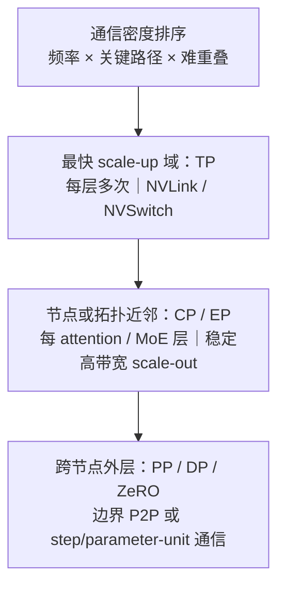
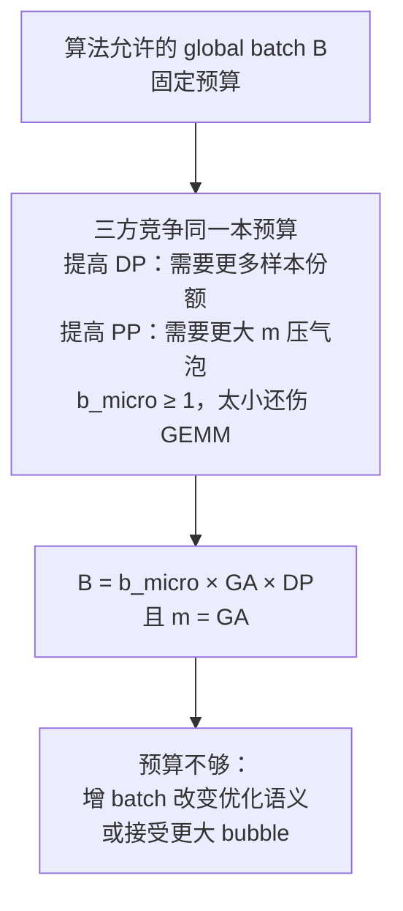

# L47 混合并行组装：让并行维度服从物理拓扑

> [!abstract] 本课速览
> 读完你将能够：
> 1. 把 DP、ZeRO、TP、PP、CP、EP 写成 device mesh 上的坐标、process groups 与 tensor 切分规则；
> 2. 用通信频率、消息大小、可重叠性解释“TP 留在快域、PP 跨节点、DP 放最外层”；
> 3. 同时核算显存、通信、流水线气泡和 global batch，排除“卡数乘得上但跑不动”的配置；
> 4. 完整推演 70B 模型在 512 张 H100 上的三套候选方案；
> 5. 逐字段读懂 Llama 3 405B 与 DeepSeek-V3 的公开训练配置。
>
> 前置：[[L41 数据并行与DDP]] · [[L42 ZeRO与FSDP]] · [[L43 张量并行]] · [[L44 流水线并行]] · [[L45 序列与上下文并行]] · [[L46 专家并行与MoE训练]] · 预计 60 分钟

## 论文里的这段话，你现在可能读不懂

> [!quote]
> We arrange the global device mesh in TP, CP, PP, and DP dimensions. Tensor-parallel groups remain inside the high-bandwidth domain, pipeline stages span nodes, and data-parallel replicas occupy the outer dimension. The parallel plan must satisfy both the device-count identity and the global-batch budget; increasing a degree can reduce memory while increasing communication or pipeline bubbles.（改写自 Megatron-LM、Llama 3 与 Alpa 的典型表述）

这段话没有发明新的并行算法，却把前六课全部压在一起：设备为什么要排成 mesh？同一个 rank 为什么同时在好几个 group 里？“外层”到底是逻辑顺序还是物理距离？卡数乘积合法，为什么 batch 和气泡还会否决它？本课就把这些拼图装成一张能执行、能复算的配置单。

## 一、六种并行不是六支队伍，而是同一张坐标表

### 1.1 从 3D 到 4D：名字不如轴重要

**hybrid parallelism**（混合并行）指在同一个训练作业里组合两种或更多并行方式。最经典的 **3D parallelism**（三维并行）是 DP × TP × PP；再加入 CP 后，Llama 3 报告称之为 **4D parallelism**（四维并行）。有的资料也会把 EP 算作第四或第五维，所以看到“4D/5D”不要猜，直接找作者列出的轴。

对本课的 dense 教学配置，世界大小先写成：

$$
W=\mathrm{DP}\times\mathrm{TP}\times\mathrm{PP}\times\mathrm{CP}.
$$

ZeRO 不是再乘一个“ZeRO 度”：它是 DP 轴上的状态切分策略。MoE 中的 EP 也经常复用 DP 轴——同一组设备对 attention/dense 部分表现为数据副本，对专家 FFN 部分则分别持有 experts；这种情况下不能再把 EP 乘一次。若某实现真的建立独立 EP 轴，则必须按它的 mesh 定义重算，不能套上式。

这张多维坐标表就是 **device mesh**（设备网格）：它把一维的 global ranks 重解释成多维坐标，并为每个维度规定 tensor 如何切、谁和谁通信。**mapping**（映射）则回答第二个问题：这些逻辑坐标具体落到哪张 GPU、哪个 NVLink 域、哪个节点、哪条 rail。

### 1.2 主图：512 张卡如何变成 DP8 × PP8 × TP8

令坐标为 $(d,p,t)$，三轴都取 $0\ldots7$。一种便于把 TP 连续放进节点的 rank 编号是：

$$
\operatorname{rank}(d,p,t)=((d\times8)+p)\times8+t.
$$

于是固定 $(d,p)$、改变 $t$ 的 8 张卡恰好连续，可映射到同一台 8×H100 节点；固定 $(d,t)$、改变 $p$，得到一条跨 8 个节点的流水；固定 $(p,t)$、改变 $d$，得到相同模型 shard 的 8 个数据副本。

同一个 rank 同时属于多个 **process group**（进程组）。例如 rank $(3,5,2)$：

- 在 TP group 中与 $(3,5,0\ldots7)$ 做层内 activation collective；
- 在 PP group 中与 $(3,0\ldots7,2)$ 的相邻 stages 做 send/recv；
- 在 DP group 中与 $(0\ldots7,5,2)$ 同步相同参数 shard 的梯度。

所以 process group 不是给 GPU 贴一个永久标签，而是“这一次 collective 的参与者集合”。一张 GPU 可以同时是 TP rank、PP stage 的一个 shard、DP replica 的一部分。

> [!tip] 心智模型：座位坐标与群聊
> device mesh 像教室座位的“排、列、楼层”；process group 像按排、按列分别建的群聊；mapping 则是把座位表落实到哪栋楼、哪间教室。一个人能同时在多个群聊里，但每个群聊的消息频率与网络条件不同。

### 1.3 parallel plan 不只是一串乘法

**parallel plan / strategy**（并行方案 / 策略）至少应写清六件事：

1. 各逻辑维度的 degree，以及 ZeRO/EP 是否复用某个维度；
2. rank 到 device/node 的 mapping；
3. 每类参数和 activation 沿哪一维切分；
4. 每个 process group 使用什么 collective/P2P；
5. micro-batch、GA、pipeline schedule 与 global batch；
6. recomputation、overlap、通信 dtype 等影响显存与时间的实现选项。

只有 `TP=8, PP=8, DP=8` 还不是完整 plan。它像只说“八车道、八站、八班车”，却没说道路画在哪、每班装多少人、何时发车。

## 二、映射定律：通信越密，物理距离越近

### 2.1 用三项指标排队

把 [[L41 数据并行与DDP]] 到 [[L46 专家并行与MoE训练]] 的通信账放在一起，只需问三件事：

| 维度 | 典型频率 | 典型消息 | 可重叠性 | 常见放置 |
|---|---|---|---|---|
| TP | 每层 forward/backward 多次 | $bSd$ activation collective | 依赖紧，最难藏 | 最快 scale-up 域，常为节点内 NVLink |
| CP | 每个 attention 层 | KV ring / all-gather / A2A | 可与 attention 分块部分重叠 | 快域或拓扑近邻 |
| EP | 每个 MoE 层 dispatch/combine | token hidden states 的变长 A2A | 可跨 chunk 部分重叠，受热点拖累 | 尽量局部化，跨节点时做拓扑约束 |
| PP | 每个边界、每个 micro-batch | $bSd$ P2P activation/gradient | 有天然流水窗口 | 可跨节点，较能容忍慢链路 |
| DP/DDP | 每 optimizer step，按 bucket 发起 | 参数梯度 | 可与 backward 大段重叠 | 外层、跨更多节点 |
| ZeRO-3 | 每个参数单元按需 AG/RS | 参数 shards | 能预取，但比 DDP 更频繁 | 需限制 group/层级，避免全局反复流参 |

由此得到本课的一句话定律：

> [!tip] 通信密度定律
> **通信越频繁、越贴关键路径、越难重叠，它就越应该映射到物理上更近、更快、更稳定的设备。**

这就是常说的 **TP intra-node law**（“TP 留在节点内”规则）。按 [[03 约定与符号]] 的 H100 教学口径，节点内 NVLink 单方向 450 GB/s，而每 GPU 的 400G 网卡是 50 GB/s，线速相差 9 倍。TP 对 70B 的一轮训练在每层反复同步 activation，跨出快域会把同一带宽落差重复几百次。

“intra-node”是当前常见 8×GPU 服务器上的简称，不是永恒边界。若硬件提供机柜级 scale-up 域，更一般的规则是“TP 留在高速 scale-up domain”；即使域更大，也要防止 degree 过高导致 GEMM 变窄和 collective 参与者过多。

图不是说 CP/EP 永远不能跨节点。长上下文 CP 的目的本来就可能是扩到多节点；大规模 EP 也会跨节点。它说的是：一旦跨出去，就必须用更大的计算窗口、分层 collective、node-limited routing、placement 或 overlap 偿还带宽债。

### 2.2 三账影响方向矩阵

下面的箭头是在“其他条件大致固定、只提高该 degree”的一阶趋势；`↓` 是减少，`↑` 是增加，`—` 表示不直接改善。实际 plan 还会因 degree 乘积与 batch 固定而联动。

| 提高的维度 | 单卡静态显存 | 单卡 activation | 通信压力 | 流水气泡 | 主要硬约束 |
|---|---:|---:|---:|---:|---|
| +DP（纯 DDP） | — | 可能因 local batch↓而↓ | 跨域梯度同步↑ | — | GBS 与最小 local batch |
| +ZeRO stage/group | ↓↓ | — | 参数 AG/梯度 RS ↑ | — | 临时完整单元、collective 粒度 |
| +TP | ↓ | 配 SP 时↓ | ↑↑，每层关键路径 | — | scale-up 带宽、矩阵可整除与 GEMM 效率 |
| +PP | ↓ | 单 stage 层数↓，但在飞份数↑ | 边界 P2P / 消息数↑ | ↑ | 层数、stage balance、micro-batch 数 |
| +CP | — | ↓ | attention 通信↑ | — | 序列/head 布局与 attention 实现 |
| +EP | expert 权重↓ | 与路由实现相关 | A2A 与负载尾部↑ | 可拖慢 stage | expert 数、token 量、placement |

这张表也解释了两个常见误区：有了 ZeRO 并不等于不需要 TP/PP，因为 ZeRO 不会切一个算子，也不会自动分摊 activation；并行度更高也不等于更快，因为每个向下的显存箭头旁边几乎都有一个向上的通信、气泡或小 GEMM 箭头。

## 三、全局 batch 是所有维度共享的一本预算

### 3.1 DP、GA 与 micro-batch 的恒等式

设每个 pipeline replica 一次送入 $b_{micro}$ 条序列，连续累积 $\mathrm{GA}$ 次再更新，数据并行度为 DP，则：

$$
\boxed{B=b_{micro}\times\mathrm{GA}\times\mathrm{DP}}.
$$

**gradient accumulation (GA)**（梯度累积）在这里不仅是显存技巧；当每次累积对应一个进入流水线的 micro-batch 时，$m=\mathrm{GA}$。而 [[L44 流水线并行]] 的气泡率要求：

$$
r_{bubble}=\frac{\mathrm{PP}-1}{m+\mathrm{PP}-1}.
$$

若目标 $r_{bubble}\le\epsilon$，移项得到：

$$
m\ge\left(\frac{1}{\epsilon}-1\right)(\mathrm{PP}-1).
$$

当 $\epsilon=5\%$ 时，$m\ge19(\mathrm{PP}-1)$。把它代回 global batch：

$$
B\ge19\,b_{micro}\,\mathrm{DP}(\mathrm{PP}-1).
$$

这就是 **micro-batch budget**（微批次预算）：pipeline 想要更多 micro-batches 来压气泡，DP 想要更多 replicas 来扩吞吐，二者都在花同一个有算法上限的 $B$。若 $b_{micro}\ge1$，DP 也不可能无脑增到超过 $B/\mathrm{GA}$。

> [!warning] “卡数恒等式成立”只是第一关
> `DP×TP×PP=512` 只能证明卡分完了。还要检查 tensor shape 是否可整除、每卡显存、$B=b\times GA\times DP$、气泡、每种 group 的物理 mapping，以及通信是否有可用 overlap 窗口。

## 四、算一算：70B 模型在 512×H100 上怎么选

### 4.1 题面、统一口径与 activation 档位

> [!example] 题面
> 模型取 [[03 约定与符号]] 的 Llama-3-70B 教学参数：$N=70\times10^9$、$L=80$、$d=8192$。集群为 64 节点 × 每节点 8 张 H100 SXM，共 512 张卡；每 GPU 一张 400 Gb/s 网卡。令 $S=8192$、目标 global batch $B=1024$ 条序列、$b_{micro}=1$，训练状态按 Adam 混合精度 $16$ B/参数，activation/通信为 BF16。

比较三套候选：

1. A：TP8 × PP8 × DP8；
2. B：TP8 × PP4 × DP16；
3. C：ZeRO-3 × DP512，不用 TP/PP。

先声明 activation 估算档位，避免拿一个模糊的“开了 checkpoint”糊弄三套方案：

- A/B 使用 **selective recomputation + Megatron sequence parallelism**。沿用 [[L40 训练显存全解剖]] 核实过的公式，1F1B 首 stage 需保存约整模型层数等价的 activation：

$$
M_{act,selective}\approx\frac{34SbdL}{\mathrm{TP}}.
$$

- C 没有 TP，selective 档会达到约 182.5 GB，直接超过 80 GB；因此改用 **full activation recomputation**，只保存每层边界，教学估算为：

$$
M_{act,full}\approx2SbdL.
$$

两式来自[《Reducing Activation Recomputation in Large Transformer Models》](https://proceedings.mlsys.org/paper_files/paper/2023/file/80083951326cf5b35e5100260d64ed81-Paper-mlsys2023.pdf)（MLSys 2023）的分析模型。它们不含 embedding/output、workspace、collective buffer、allocator 碎片与临时 gathered parameters，所以是方案比较账，不是显存峰值保证。

代入 $S=d=8192,b=1,L=80$：

$$
Sbd=8192\times8192=67{,}108{,}864,
$$

$$
M_{act,selective}
=\frac{34\times67{,}108{,}864\times80}{8}
\approx22.82\ \text{GB},
$$

$$
M_{act,full}
=2\times67{,}108{,}864\times80
\approx10.74\ \text{GB}.
$$

### 4.2 batch 与气泡账

由 $\mathrm{GA}=B/(b_{micro}\mathrm{DP})$：

| 候选 | GA = $m$ | 气泡率 |
|---|---:|---:|
| A：PP8, DP8 | $1024/8=128$ | $7/(128+7)=5.19\%$ |
| B：PP4, DP16 | $1024/16=64$ | $3/(64+3)=4.48\%$ |
| C：PP1, DP512 | $1024/512=2$ | $0$ |

A 差一点才到 5%：PP8 的严格 5% 门槛是 $m\ge19\times7=133$，但 batch 预算只给每个 replica 128 条序列。B 的门槛是 $m\ge57$，所以 64 足够。若为了让 A 达到 5% 而把 GA 提到 133，global batch 会变成 $1\times133\times8=1064$；训练的优化语义已经变了。

### 4.3 静态显存账

A/B 的 TP 与 PP 都切模型状态，纯 DP 不再切；理想均衡静态项为：

$$
M_{static}=\frac{16N}{\mathrm{TP}\times\mathrm{PP}}.
$$

因此 A 为 $1120/(8\times8)=17.5$ GB，B 为 $1120/(8\times4)=35.0$ GB。C 的 ZeRO-3 静态下界为 $1120/512=2.1875$ GB。

| 候选 | 静态模型状态 | activation 档位 | 静态 + activation | 80 GB 容量初筛 |
|---|---:|---:|---:|---|
| A：TP8-PP8-DP8 | 17.50 GB | selective + SP：22.82 GB | 40.32 GB | 通过，余量最大 |
| B：TP8-PP4-DP16 | 35.00 GB | selective + SP：22.82 GB | 57.82 GB | 理想模型通过，但运行时余量较紧 |
| C：ZeRO3-DP512 | 2.19 GB | full recompute：10.74 GB | 12.92 GB | 静态通过；还需临时完整 parameter unit |

C 看起来赢麻了，但这是典型的“只看显存会选错”。ZeRO-3 要在计算前反复把参数 shards 聚回来，下一节才是它真正的代价。

### 4.4 通信账：按物理链路拆开

一次 BF16 hidden message 是：

$$
n=2Sbd=134{,}217{,}728\ \text{B}\approx134.2\ \text{MB}.
$$

对 A/B，TP8 配 Megatron-SP 与 selective recompute 时，每层每 micro-batch 完整 forward+backward 的 ring 等价 per-rank、每方向流量为：

$$
V_{TP,layer}=16\frac{8-1}{8}Sbd=14Sbd.
$$

每张卡在一个 step 处理的“本地层数 × micro-batch 数”恰好相同：A 为 $10\times128=1280$，B 为 $20\times64=1280$。所以两者的节点内 TP 账相同：

$$
V_{TP,step}=14\times Sbd\times1280
\approx1.203\ \text{TB/rank/direction}.
$$

这不是说一条 1.2 TB tensor 一次发完，而是每层许多 collectives 在整 step 的累计；它必须留在 NVLink 快域。

PP 每个边界、每个方向在一个 step 传 $m$ 个 $n$：A 为 $128\times134.2\text{ MB}\approx17.18$ GB，B 为约 8.59 GB；反向梯度在相反方向还有同量级流量。DP 对本 rank 所持参数 shard 做 ring all-reduce，每 rank、每方向为：

$$
V_{DP}=2\left(\frac{2N}{TP\times PP}\right)\frac{DP-1}{DP}.
$$

代入得 A 为 3.83 GB，B 为 8.20 GB。

C 令完整 BF16 参数 $W_p=2N=140$ GB。沿用 [[L42 ZeRO与FSDP]] 的标准 reshard 教学调度：每个 micro-batch 的 forward/backward 各 AG 一次；再乐观地假设两次 backward 之后只做一次 gradient RS，则通信账为：

$$
V_{ZeRO3}^{(5W)}=(2\times GA+1)W_p\frac{511}{512}
=5\times140\times\frac{511}{512}
\approx698.6\ \text{GB/rank/direction/step}.
$$

若每个 micro-batch 都各做一轮 RS，则是 $6W_p(511/512)\approx838.4$ GB。真实值取决于 reshard、no-sync、wrapping 与 prefetch；若跨 micro-batches 保留完整 parameter units 或重排执行，可以少做 AG，但会提高 residency 或改变 schedule。这里不是任意 ZeRO-3 实现的数学下界，而是明确调度下的可复算账。无论选 5W 还是 6W，都已是全局 scale-out 上的数百 GB 参数流，而不是 A/B 那几 GB 的 DP 梯度账。

| 候选 | NVLink / 快域 | 跨节点 PP（每边界每方向） | 跨节点 DP/ZeRO（每 rank 每方向） | 气泡 |
|---|---:|---:|---:|---:|
| A：TP8-PP8-DP8 | TP 累计约 1.203 TB | 17.18 GB | DDP 3.83 GB | 5.19% |
| B：TP8-PP4-DP16 | TP 累计约 1.203 TB | 8.59 GB | DDP 8.20 GB | 4.48% |
| C：ZeRO3-DP512 | 无 TP | 无 PP | 标准 reshard 教学账约 698.6 GB | 0 |

所有字节都是便于复算的算法/链路流量估算，不含协议效率、$\alpha$、拥塞与重叠；不能直接相加后除以某个带宽冒充 step time。尤其 PP 是 P2P 流水流，DP/ZeRO 是大组 collective，它们对拓扑和尾部的压力不同。

### 4.5 选择：先落 A，再把 B 当性能候选

在没有 profiler 实测 workspace 与 overlap 的纸面阶段，我会先选 **A：TP8-PP8-DP8** 作为保守可行解：

- TP8 恰好塞进单个 8×H100 NVLink 域，兑现 TP intra-node law；
- 静态 + activation 教学账约 40.3 GB，给临时 tensor、通信 buffer、embedding/output 不均衡和碎片留出更大余量；
- 跨节点 DDP 量只有约 3.83 GB/rank/direction，并可按 bucket 与 backward 重叠；
- 代价是 PP 边界字节更多，5.19% 气泡略高于 5% 目标。

B 不是非法方案。它把 PP 减半，气泡降到 4.48%，PP 边界累计也减半；但每卡静态状态翻倍到 35 GB，DP collective 翻到约 8.20 GB，运行时容量余量更紧。若真实峰值低于 80 GB 且跨节点 all-reduce overlap 好，B 可能更快，所以它应是上线前必须 benchmark 的第二候选。

C 的显存最低且无气泡，却把参数按单元反复流过 512 卡 scale-out 网络；再加 full recompute 的额外计算和 512-rank collective 尾部，它不是本题的首选。它仍有价值：当模型结构不方便 TP/PP、集群规模较小、分层 FSDP 能把高频 AG/RS 关进快域，或框架实现提供出色 overlap 时，结论可能改变。

> [!warning] 结论的边界
> 这是一份“先筛掉明显坏解”的 parallel plan，不是声称 A 的墙钟时间已经最优。真正上线前还要跑 memory snapshot、collective benchmark 和端到端 profiler；尤其要验证首尾 stage、selective recompute 实现、TP/PP overlap 与有效网络带宽。

## 五、真实配置解码：plan 是约束的函数

### 5.1 Llama 3 405B：DP 会给 CP 让位置

[《The Llama 3 Herd of Models》](https://arxiv.org/abs/2407.21783) Table 4 给出两组 16,384-GPU 配置：

| 阶段 | TP | CP | PP | DP | 乘积 |
|---|---:|---:|---:|---:|---:|
| $S=8192$ | 8 | 1 | 16 | 128 | $8\times1\times16\times128=16{,}384$ |
| $S=131{,}072$ | 8 | 16 | 16 | 8 | $8\times16\times16\times8=16{,}384$ |

逐字段翻译：TP8 处理层内 tensor，并优先吃快域；PP16 把 126 层与首尾特殊模块切成流水段；短序列时 CP1，不需要切 context，于是剩余卡数给 DP128；长到 128K 后 activation 与 attention 迫使 CP16，固定总卡数下 DP 必须从 128 降到 8。

这不是“长序列阶段不想扩吞吐”，而是同一张 16K 卡预算里，CP 轴拿走了 16 倍资源。报告还说明其 DP 使用 FSDP 语义，optimizer states 与 gradients 被切分；因此表里的 DP 不能简单读成“128 份完整 405B 状态副本”。

### 5.2 DeepSeek-V3：为什么 PP16 + EP64 + ZeRO-1，却不用 TP

[《DeepSeek-V3 Technical Report》](https://arxiv.org/html/2412.19437) 写明：训练集群为 2048 张 H800，每节点 8 GPU；整体使用 PP16、跨 8 节点的 EP64 与 ZeRO-1 DP，并通过显存优化避免 costly TP。

这里不能把 dense 模型的 `DP×TP×PP` 生搬硬套：attention/dense 部分与 MoE FFN 使用不同的逻辑分组。EP64 把细粒度 experts 分到 64 张卡，attention 部分仍按数据副本推进；PP16 沿模型深度切段；ZeRO-1 切 optimizer states。EP 与 DP 在不同子模块上复用设备，是“同一 mesh、不同层采用不同 placement”的典型例子。

为什么不照抄 Llama 的 TP8？

1. MLA 的低秩压缩、FP8 存储、选择性 recompute 等降低 activation 压力；细粒度 expert 权重又由 EP 分散，PP 与 ZeRO-1 继续切深度和 optimizer states，容量上不再非用 TP 才能过关。
2. [[03 约定与符号]] 的课内口径中，H800 NVLink 双向合计 400 GB/s，低于 H100 的 900 GB/s。避免 TP 等于避免每层密集 activation collective 持续占用这层更受限的 scale-up 带宽。
3. MoE 的 EP all-to-all 不能消失，于是系统把优化预算投向 node-limited routing、IB→NVLink 两级转发、低精度 dispatch 与 DualPipe overlap。配置是在“必须付 EP 债”的前提下，少背一笔 TP 债。

这两个案例合起来给出最重要的反照抄原则：==并行配置是模型结构、序列长度、显存、互联层级、batch 上限与实现能力共同作用的函数。== 拓扑或模型换一个字段，最优 plan 就可能换轴。

## 六、auto-parallelism：让编译器搜，但先把成本模型做对

**auto-parallelism**（自动并行）试图把“枚举 plan → 估算代价 → 选解 → 生成通信与执行图”交给编译器/系统。**GSPMD** 允许用户给少量 tensor sharding annotations，再传播各算子的分片并插入必要通信；**Alpa**（OSDI 2022）把空间分成 intra-operator 与 inter-operator 两层，联合搜索 operator sharding 和 pipeline stages。

难点不只是候选数多，而是 **cost model**（成本模型）容易在真实集群上失真：

- collective 时间不是 `bytes/线速`，还受拓扑、并发 flow、$\alpha$、拥塞与 straggler 影响；
- overlap 不是把两段时间取 `max` 就完事，通信 kernel 会争用 SM、L2、HBM 和调度队列；
- activation 峰值取决于 schedule、tensor lifetime、prefetch 与 allocator，而不只是静态除法；
- MoE traffic matrix 随 token routing 变化，stage time 也随 hot experts 漂移；
- batch/收敛约束并不是纯系统代价，搜索器不能擅自把 $B$ 放大后只比较 tokens/s。

所以截至 2026 年，生产训练仍常由专家先给出少量合法 plan，再用 profiler/autotuner 做局部搜索；不是 auto-parallelism 没价值，而是它需要一个能校准真实系统的模型。对本课的研究方向，这正是接口：用 microbenchmark、trace、ASTRA-sim/ns-3 或小规模 testbed 校准 cost model，再搜索 topology-aware mapping。[[L67 测量仿真与评测]] 会回到“模型怎样才可信”。

## 回到开头那段话

现在逐句回读：

1. **“We arrange the global device mesh in TP, CP, PP, and DP dimensions.”** 一维 ranks 被解释为多维坐标；每个轴规定切分语义与 process groups。Llama 3 的 128K 配置就是 `TP8×CP16×PP16×DP8`，EP 是否另乘则必须看模型与框架。
2. **“Tensor-parallel groups remain inside the high-bandwidth domain, pipeline stages span nodes, and data-parallel replicas occupy the outer dimension.”** 这不是排版习惯，而是通信密度排序：TP 每层多次且难藏；PP 是边界 P2P、有流水窗口；DP 通常每 step 同步并能按 bucket overlap。因此逻辑轴要 mapping 到对应的物理距离。
3. **“The parallel plan must satisfy both the device-count identity and the global-batch budget.”** `DP×TP×PP×CP=W` 只管卡数；$B=b\times GA\times DP$ 与 $m=GA$ 还管优化语义和气泡。70B 候选 A 的卡数完全合法，却因 $m=128<133$ 略过不了严格 5% 气泡线。
4. **“Increasing a degree can reduce memory while increasing communication or pipeline bubbles.”** TP/PP/ZeRO 都能降某类显存，却分别增加层内 collective、流水气泡/边界消息、参数 AG/RS。parallel plan 是显存—通信—气泡—batch 四账求解，不是把所有 degree 往上拧。

一句话收束：==先用模型与显存决定“必须切什么”，再用通信密度决定“切分组放多近”，最后用 batch 和气泡检查“这套坐标能不能持续喂饱”。==

## 术语卡片

| 术语 | 中文 | 一句话解释 |
|---|---|---|
| hybrid parallelism | 混合并行 | 在同一作业中组合两种或更多并行/切分方式。 |
| 3D parallelism | 三维并行 | 经典的 DP × TP × PP 组合；具体资料仍应核对轴定义。 |
| 4D parallelism | 四维并行 | 在三维组合上再加入 CP 等第四轴；名称本身不保证轴集合唯一。 |
| device mesh | 设备网格 | 把 global ranks 组织成多维坐标，并描述各维 tensor placement 与通信组。 |
| process group | 进程组 | 执行某类 collective/P2P 的 ranks 集合；同一 rank 可同时属于多个组。 |
| parallel plan / strategy | 并行方案 / 策略 | 包含 degrees、tensor sharding、groups、mapping、batch、schedule 与优化选项的完整配置。 |
| mapping | 映射 | 把逻辑 mesh 坐标和通信组落实到具体 GPU、节点与网络层级。 |
| gradient accumulation (GA) | 梯度累积 | 连续处理多个 micro-batches 后才更新参数；本课中还决定流水线的 $m$。 |
| micro-batch budget | 微批次预算 | global batch 能分配给 DP replicas 和 pipeline micro-batches 的有限份额。 |
| auto-parallelism | 自动并行 | 自动搜索/推导 sharding、pipeline 与 device mapping 并生成执行计划的方法。 |
| Alpa | Alpa 自动并行系统 | 以 intra-/inter-operator 两层空间联合搜索 operator 与 pipeline parallelism 的系统。 |
| GSPMD | 通用可扩展 SPMD 并行化 | 根据少量 sharding annotations 传播 tensor placement 并插入通信的编译器方法。 |
| cost model | 成本模型 | 估算候选 plan 的计算、通信、显存与重叠代价，供搜索和比较。 |
| TP intra-node law | “TP 留在节点内”规则 | 把高频、关键路径上的 TP group 留在最快 scale-up 域；节点只是常见边界。 |

## 自测

1. 在 `DP8×PP8×TP8` mesh 中，rank $(3,5,2)$ 分别与哪些坐标组成 TP、PP、DP group？
2. 为什么“4D parallelism”不能只凭名字判断包含哪些并行轴？ZeRO 与 EP 为什么不一定增加 world-size 乘积？
3. 按频率、消息大小、可重叠性解释 TP、PP、DP 的常见物理放置顺序。
4. **计算题**：给定 $B=2048,b_{micro}=2,DP=16,PP=8$，求 GA、非交错 1F1B 气泡率；是否达到 5%？
5. 本课候选 A 与 B 的 TP 累计流量为何相同，而 PP 与 DP 流量方向相反？
6. ZeRO3-DP512 的静态显存最低，为什么仍被排除为首选？至少从三类系统代价回答。
7. Llama 3 的 128K 阶段为什么把 DP128 换成 CP16×DP8？DeepSeek-V3 不用 TP 又不代表它“没有高频通信”，为什么？
8. 如果你要为 auto-parallelism 建 cost model，至少测量哪些量，才能避免把 `bytes/peak bandwidth` 当成真实 step time？

> [!note]- 参考答案
> 1. TP：固定 $(d,p)=(3,5)$，改变 $t=0\ldots7$；PP：固定 $(d,t)=(3,2)$，改变 $p=0\ldots7$；DP：固定 $(p,t)=(5,2)$，改变 $d=0\ldots7$。
> 2. 不同系统可能把 CP、EP、SP 或 ZeRO 算作新增维，必须看轴列表。ZeRO 是 DP 轴上的状态切分策略，不单独复制设备；EP 常在 MoE 子层复用 DP 设备，attention 是 DP、expert FFN 是 EP，因而不一定另乘。
> 3. TP 每层多次传 activation、下一算子常等待，最难隐藏，故放最快 scale-up 域；PP 只在 stage 边界做 P2P，micro-batches 提供流水窗口，可跨节点；DP 通常每 step 同步参数梯度，并可从 backward 早期 bucket 开始 overlap，适合最外层扩展。
> 4. $GA=2048/(2\times16)=64$，取 $m=64$；气泡率 $7/(64+7)=7/71\approx9.86\%$，未达到 5%。严格 5% 需 $m\ge133$；若其他量不变，$B$ 至少为 $2\times133\times16=4256$ 条序列。
> 5. 每 rank 的本地层数×micro-batches：A 为 $10\times128$，B 为 $20\times64$，相同，所以 TP 层内工作量与累计通信相同。B 的 PP stages 更少且 $m$ 更小，边界 P2P 减少；但每 rank 持有的参数 shard 更大、DP group 更大，梯度 all-reduce 字节增加。
> 6. 它需要跨 512 ranks 反复 AG 参数与 RS 梯度；按本课声明的标准 reshard 调度，即使两次 backward 只做一次 gradient RS，也约 698.6 GB/rank/direction/step。大组 collective 更受固定时延、拥塞和 straggler 影响；full recompute 还增加计算，临时完整 parameter unit/prefetch 也会抬高峰值。静态显存除法没有包含这些代价。
> 7. 长序列 activation/attention 迫使 CP16，在固定 16,384 卡乘积中 DP 只能从 128 降到 8。DeepSeek-V3 虽避免 TP，却有每个 MoE 层的 EP all-to-all，并用 node-limited routing、两级转发和 DualPipe overlap 偿还通信债。
> 8. 至少包括：不同 group size/message size/topology 的 collective/P2P 实测；kernel/GEMM 时间；communication-computation 资源争用与可重叠窗口；activation/parameter/buffer 的峰值 lifetime；拥塞和 straggler 分布；MoE traffic/load trace；以及 batch 对优化语义的约束。

## 延伸阅读

- [《Efficient Large-Scale Language Model Training on GPU Clusters Using Megatron-LM》](https://arxiv.org/abs/2104.04473)（SC 2021）：精读 3D 并行配置与 TP/PP/DP trade-off，练习把 setup 表翻成三张通信账。
- [《The Llama 3 Herd of Models》](https://arxiv.org/abs/2407.21783)（Meta 2024）：精读 3.3.2、Figure 5 与 Table 4，核对 TP/CP/PP/DP groups 和长上下文阶段的轴置换。
- [《DeepSeek-V3 Technical Report》](https://arxiv.org/html/2412.19437)（技术报告，2024/2025 版本）：精读 3.2，观察 PP、EP、ZeRO-1、无 TP 与通信—计算 overlap 如何一起成立。
- [《Alpa: Automating Inter- and Intra-Operator Parallelism for Distributed Deep Learning》](https://www.usenix.org/conference/osdi22/presentation/zheng-lianmin)（OSDI 2022）：读 hierarchical space 与 cost model，理解 auto-parallelism 搜索的对象。
- [《GSPMD: General and Scalable Parallelization for ML Computation Graphs》](https://arxiv.org/abs/2105.04663)（2021）：读 sharding annotations 和 compiler propagation，区分“自动补通信”与“自动找到全局最优 plan”。
- [The Ultra-Scale Playbook](https://huggingface.co/spaces/nanotron/ultrascale-playbook) 的 “5D Parallelism in a Nutshell”：作为 DP/ZeRO/TP/CP/PP/EP 的速查表使用；精确数字仍回到论文与实测。

---
上一课：[[L46 专家并行与MoE训练]] ← · → 下一课：[[L48 实践-并行策略推演]]
