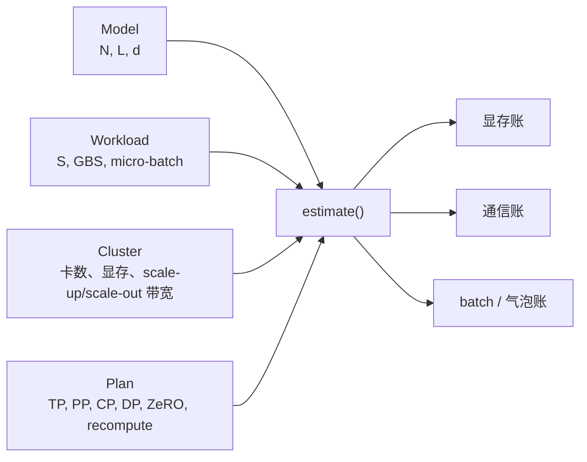

# L48 实践：并行策略推演，把显存、通信与气泡算到同一张纸上

> [!abstract] 本课速览
> 这是一场不需要 GPU 的“期中考试”。做完后，你将能够：
> 1. 从模型、workload、集群和并行配置中独立列出显存、通信、气泡三账；
> 2. 先排除卡数、batch、整除与容量不合法的方案，再讨论性能；
> 3. 为 8B 单节点、70B 512 卡、70B 128K 长上下文三道题给出可辩护的 parallel plan；
> 4. 用纯 Python 计算器逐项核对手算，而不是让脚本替你作决定；
> 5. 解释为什么换一块 GPU、一个序列长度或一档网速，推荐方案会翻转。
>
> 前置：[[L47 混合并行组装]] · 预计 90–120 分钟

## 本次实践你要亲眼看到什么

1. `DP×TP×PP×CP=总卡数` 成立的方案，仍可能因为显存或 global batch 不合法而出局。
2. 8B 在单节点 8×H100 上用 ZeRO-3 与 TP8 都能过容量线，但通信位置和总量完全不同。
3. 70B 在 512×H100 上，`TP8-PP8-DP8` 与 `TP8-PP4-DP16` 没有绝对赢家：前者余量大，后者气泡小。
4. 把 $S=8\text{K}$ 换成 $128\text{K}$ 后，原方案的 selective activation 从约 22.82 GB 涨到约 365.07 GB；CP 从“可选轴”变成容量解法之一。
5. 把 400 Gb/s 降为 100 Gb/s，所有 scale-out payload 下界都变成 $4\times$，但最值得担心的是每个 micro-batch 都依赖的 PP 边界。

前八课已经分别教过账本上的每一行。真正难的是：题面从来不会告诉你“这里该用 TP8”。它只给模型、卡、网络、序列长度和 batch；你得自己把这些约束变成一套 **parallel plan / strategy**（并行方案 / 策略）。本课的目标不是搜到一个神奇最优点，而是形成一个不会漏账的排除流程。

## 〇、环境准备

### 0.1 最低硬件：能运行 Python 的电脑

本课不执行任何 tensor 运算。CPU 笔记本、Apple Silicon 和没有 CUDA 的服务器都能完成；只需要 Python 3.9+ 标准库，不需要 PyTorch、NumPy 或 GPU。完整单文件是 [[L48_parallel_plan.py]]：

```bash
python3 "M6 分布式训练并行/实践代码/L48_parallel_plan.py" --self-test
```

预期输出：

```text
[PASS] preset memory/batch/communication checks matched the hand-derived accounts.
```

这行 PASS 只说明代码输出与本课手算的 10 个断言一致，不说明公式已经变成真实 profiler。脚本按 Python `dataclass` 分开四类输入：



运行任一预置题：

```bash
python3 "M6 分布式训练并行/实践代码/L48_parallel_plan.py" --preset b_tp8_pp8
```

用 `--help` 可以看到全部 presets。想改任意字段时，先导出 JSON，再编辑后重算：

```bash
python3 "M6 分布式训练并行/实践代码/L48_parallel_plan.py" \
  --preset b_tp8_pp8 --dump-config /tmp/l48-plan.json

python3 "M6 分布式训练并行/实践代码/L48_parallel_plan.py" \
  --config /tmp/l48-plan.json
```

### 0.2 先读懂计算器“不算什么”

脚本把前课的六个词放回同一张表：**activation memory**（激活显存）回答“容量够不够”；方案之间算法字节的增量是 **communication volume overhead**（通信量额外开销）；**bubble ratio**（气泡率）回答 pipeline 因填充、排空空了多少。**gradient accumulation**（梯度累积）把多个 micro-batches 合成一次更新并决定本课的 $GA=m$；**context parallelism (CP)**（上下文并行）沿序列维分摊长 context；这些字段合起来才是一份可执行的 parallel plan。

脚本故意只做一阶筛选：

- 静态显存按 [[L40 训练显存全解剖]] 的 Adam 混合精度 $16$ B/参数与 [[L42 ZeRO与FSDP]] 的三阶段公式；
- selective activation 按 memory-efficient attention 教学式 $34SbdL$，再按 TP sequence parallelism 与 CP 分片；full recomputation 用 $2SbdL$ 的层边界教学式；
- TP、DP/ZeRO、PP、CP 字节量分别沿用 [[L43 张量并行]]、[[L42 ZeRO与FSDP]]、[[L44 流水线并行]]、[[L45 序列与上下文并行]] 已声明的口径；
- 气泡只用理想均衡、非交错 1F1B 的 $(p-1)/(m+p-1)$；
- 带宽换算全部来自 [[03 约定与符号]]：400 Gb/s 是每方向 50 GB/s，H100 NVLink 双向 900 GB/s 对应每方向 450 GB/s，H800 双向 400 GB/s 对应每方向 200 GB/s。

它不算 workspace、通信 buffer、allocator 碎片、首尾 stage 不均、ZeRO 临时 gathered unit、kernel 效率、协议损失、$alpha$、拥塞、straggler 和真实 overlap。脚本打印的 `payload-LB` 是“字节数 ÷ 对应方向峰值”的不可能突破下界；不同通信可以重叠、争用或位于不同关键路径，==禁止把四行下界相加冒充 step time==。

> [!warning] 计算器是筛子，不是裁判
> `memory screen=PASS` 表示“已记两项没有超过 80 GB”，不是保证不 OOM；`payload-LB=0.3 s` 表示只搬 payload 至少需要这么久，不是保证 collective 0.3 秒结束。真实上线仍要 memory snapshot、microbenchmark 和端到端 profiler。

## 一、逐步任务

### 任务 A：8B、单节点 8×H100，ZeRO 还是 TP？

#### A.1 题面与先做的决定

模型取 [[03 约定与符号]] 的 Llama-3-8B 教学形状：$N=8\times10^9$、$L=32$、$d=4096$；集群是一台 8×H100 SXM，单卡 80 GB，$S=8192$。设计稿没有指定 batch，而通信和气泡账必须知道它，因此本题补充 $B=8,b=1$；所有方案都处理同样的 8 条序列。activation 使用 selective recomputation + memory-efficient attention。

先暂停，自己比较：

1. ZeRO-2 × DP8；
2. ZeRO-3 × DP8；
3. TP8 × DP1，并开启 Megatron sequence parallelism。

运行：

```bash
python3 "M6 分布式训练并行/实践代码/L48_parallel_plan.py" --preset a_zero2
python3 "M6 分布式训练并行/实践代码/L48_parallel_plan.py" --preset a_zero3
python3 "M6 分布式训练并行/实践代码/L48_parallel_plan.py" --preset a_tp8
```

#### A.2 对答案：三套都合法，首选 ZeRO 家族

> [!example] 算一算：8B 的三套容量账
> 未切分时静态状态为
>
> $$
> 16N=16\times8\times10^9=128\ \text{GB}.
> $$
>
> ZeRO-2 的每卡静态项：
>
> $$
> M_{Z2}=2N+\frac{14N}{8}
> =16+14=30\ \text{GB}.
> $$
>
> ZeRO-3 与 TP8 都把 128 GB 均匀分成 8 份：
>
> $$
> M_{Z3}=M_{TP8}=\frac{128}{8}=16\ \text{GB}.
> $$
>
> 不用 TP 时，selective activation 为
>
> $$
> M_{act}=34\times8192\times1\times4096\times32
> \approx36.51\ \text{GB}.
> $$
>
> TP8 + sequence parallelism 再除以 8，约 $4.56$ GB。因此三套“已记显存”分别约 66.51、52.51、20.56 GB。

| 方案 | GA | 静态 | activation | 已记合计 | 主要通信 / rank / 方向 / step | 纸面判断 |
|---|---:|---:|---:|---:|---:|---|
| ZeRO-2 DP8 | 1 | 30.00 GB | 36.51 GB | 66.51 GB | 28.00 GB | 能过，但只剩 13.49 GB 未记余量 |
| ZeRO-3 DP8 | 1 | 16.00 GB | 36.51 GB | 52.51 GB | 42.00 GB | 容量更稳，参数 AG 更多 |
| TP8 DP1 | 8 | 16.00 GB | 4.56 GB | 20.56 GB | TP 120.26 GB | 余量最大，但每层反复 collective |

ZeRO-2 的 28 GB 来自 $W=2N=16$ GB 的 `gradient RS + parameter AG`：

$$
2W\frac{7}{8}=2\times16\times\frac78=28\ \text{GB}.
$$

ZeRO-3 在 GA=1 的标准 reshard 教学调度中是两次 parameter AG 加一次 gradient RS：

$$
3W\frac78=42\ \text{GB}.
$$

我的第一落点是 **ZeRO-3 DP8**：它不切单个 GEMM，通信全留在单节点快域，而且比 ZeRO-2 多出 14 GB 容量余量，更能容纳未记项目。若 memory snapshot 证明 ZeRO-2 的 13.49 GB 余量足够，ZeRO-2 通信更少，可能成为更快候选。TP8 当然能跑，但对只有 8B 的模型，把每个矩阵切成 8 份并为整个 step 累计约 120.26 GB TP 流量，通常不是第一选择。

其他合理解包括 TP2×ZeRO-3-DP4，或在实测证明 TP kernel/collective 很强时选择 TP8。评分标准不是“和参考答案 degree 一样”，而是三账、mapping 与 trade-off 全说清。

### 任务 B：70B、512×H100，完整走一遍筛选漏斗

#### B.1 题面

模型取 $N=70\times10^9,L=80,d=8192$；集群为 64 节点×8 H100，共 512 卡，每 GPU 一张 400G 网卡；$S=8192,B=1024,b=1$。使用 selective recomputation、memory-efficient attention 和 TP sequence parallelism。比较：

- B1：TP8-PP8-DP8；
- B2：TP8-PP4-DP16；
- B3：TP4-PP8-DP16。

在运行脚本前，按下面顺序手算：


#### B.2 对答案：合法不等于可运行

三套 degree 乘积都是 512，80 层也都能被 PP8 或 PP4 整除。batch 与气泡为：

$$
GA=\frac{B}{b\times DP},\qquad
r_{bubble}=\frac{PP-1}{GA+PP-1}.
$$

于是 B1 的 GA=128、气泡 $7/135\approx5.19\%$；B2 的 GA=64、气泡 $3/67\approx4.48\%$；B3 的 GA=64、气泡 $7/71\approx9.86\%$。

完整脚本输出汇总如下：

| 候选 | 静态 | activation | 已记合计 | TP / NVLink | PP / 每边界 | DP / scale-out | 气泡 | 容量筛选 |
|---|---:|---:|---:|---:|---:|---:|---:|---|
| B1 TP8-PP8-DP8 | 17.50 GB | 22.82 GB | 40.32 GB | 1202.59 GB | 17.18 GB | 3.83 GB | 5.19% | PASS |
| B2 TP8-PP4-DP16 | 35.00 GB | 22.82 GB | 57.82 GB | 1202.59 GB | 8.59 GB | 8.20 GB | 4.48% | PASS，余量较紧 |
| B3 TP4-PP8-DP16 | 35.00 GB | 45.63 GB | 80.63 GB | 515.40 GB | 8.59 GB | 8.20 GB | 9.86% | **FAIL** |

表中的通信量均为 per rank、per direction、per optimizer step 算法 payload。B1/B2 的 TP 总量相同不是巧合：

$$
\left(\frac{L}{PP}\right)GA:
\quad B1=10\times128=1280,
\quad B2=20\times64=1280.
$$

也就是说，B2 每张卡层数翻倍，但 micro-batch 数减半；同一 step 的本地“层×micro-batch”工作量没变。B2 的 PP 边界减半、气泡略降，却让每卡模型 shard 加倍，DP gradient collective 也从 3.83 GB 增到 8.20 GB。

B3 告诉你为什么筛选顺序重要。它把 TP 降到 4，确实把 TP 算法字节降到 515.40 GB；但静态状态和 activation 都翻倍，连未记开销之前就已经达到 80.63 GB。==一套容量下限已经失败的配置，没有资格进入“TP 少了可能更快”的讨论。==

参考选择仍是 **B1 先落地、B2 做性能候选**。B1 约有 39.68 GB 未记余量，适合作为 bring-up 配置；B2 只剩 22.18 GB，却减少 PP 边界与气泡。若真实 memory snapshot、stage balance 和 DDP overlap 都健康，B2 可能更快。这个结论与 [[L47 混合并行组装]] 一致，但你现在是从空白题面重新算出来的。

### 任务 C：换成 H800 + 128K，约束怎样翻转？

#### C.1 先只改两个字段

沿用题 B 的 512 卡、400G scale-out 网络、$B=1024,b=1$，把 GPU 换成 H800，并令 $S=128\text{K}=131{,}072$。按 [[03 约定与符号]]，单卡仍是 80 GB，但 NVLink 双向合计从 H100 的 900 GB/s 变为 H800 的 400 GB/s，即单方向从 450 降为 200 GB/s。

先保持 selective recomputation，比较：

- C0：TP8-PP8-DP8-CP1；
- C1：TP8-PP8-CP8-DP1；
- C2：TP4-PP8-CP16-DP1。

#### C.2 对答案：CP8 过容量线，但不是免费午餐

$S$ 从 8192 增到 131072，正好是 16 倍。C0 的静态项不变，selective activation 线性放大：

$$
22.82\times16\approx365.07\ \text{GB}.
$$

加静态状态后约 382.57 GB，直接出局。TP8 的累计 payload 也从约 1.203 TB 增为 19.241 TB；H800 每方向 scale-up 峰值又只有 H100 的 $200/450$，因此 payload-only 下界相对题 B 约放大

$$
16\times\frac{450}{200}=36\times.
$$

这就是“TP 收益变化”的准确说法：TP8 仍把静态与 activation 分成 8 份，容量收益没有消失；但消息随 $S$ 放大、链路还变慢，性能代价显著上升，不能再只背“TP 留在节点内”。

C1 加入 CP8，并在固定 512 卡下把 DP8 让成 DP1：

$$
8_{TP}\times8_{PP}\times8_{CP}\times1_{DP}=512.
$$

activation 再除以 CP8：

$$
M_{act}=\frac{34\times131072\times8192\times80}{8_{TP}\times8_{CP}}
\approx45.63\ \text{GB}.
$$

静态 17.50 GB + activation 45.63 GB = 63.13 GB，纸面通过。DP 降到 1 后 $GA=1024$，PP8 气泡变为 $7/(1024+7)\approx0.68\%$；气泡漂亮，不代表 step 很快，只表示一条 pipeline replica 被 1024 个 micro-batches 喂得非常满。

CP 的网络债也必须正面写出。按 [[L45 序列与上下文并行]] 的 Ring Attention forward 教学账，CP8 中每层、每 micro-batch、每 rank 的 KV 发送量是：

$$
4\frac{S}{CP}d(CP-1)
=4\times16384\times8192\times7
\approx3.758\ \text{GB},
$$

接收量另有同样一份。每 rank 持有 10 层、一个 optimizer step 处理 1024 个 micro-batches，因此累计发送量约

$$
3.758\times10\times1024
\approx38{,}482.9\ \text{GB}.
$$

这个大数不是让你把 38 TB 除以网速后宣布训练不能跑；Ring/CP 的设计目的就是把分块 attention 计算与 KV 传输流水重叠。它提醒你：DP 消失以后，每个 rank 在一个巨大 global batch 中承担的序列工作成倍增加，CP 的性能必须用 attention tile 时间、P2P overlap、因果负载均衡和真实网络共同判断。

C2 想用 CP16 抵消 TP4 的容量损失。结果静态项升到 35 GB，activation 仍约 45.63 GB，合计 80.63 GB，未计 runtime 已失败。CP 切 activation，不切参数；它不能无条件替代 TP。

本题参考解是 **C1 作为 selective-recompute 约束下的可行起点**，然后重点 benchmark CP。其他合理解也存在：若改用 full activation recomputation，C0 的 activation 教学账会降为

$$
\frac{2\times131072\times8192\times80}{8}
\approx21.47\ \text{GB},
$$

不加 CP 也可能过容量线，但会增加重算，并让每张卡独自承担更长 attention 工作。于是正确答案不是“128K 必须 CP”，而是：==在本题指定的 selective 档位下需要 CP；放宽 recomputation、ZeRO 或 schedule 后，应重新比较容量、计算与通信。==

### 附加题：把题 B 的 400G 降到 100G

```bash
python3 "M6 分布式训练并行/实践代码/L48_parallel_plan.py" \
  --preset b_tp8_pp8_100g
```

100 Gb/s = 12.5 GB/s，因此 B1 的 PP 与 DP payload 下界都变为原来的 $4\times$：

| scale-out | PP 边界累计下界 | DP 累计下界 |
|---|---:|---:|
| 400 Gb/s | $17.18/50\approx0.344$ s | $3.83/50\approx0.077$ s |
| 100 Gb/s | $17.18/12.5\approx1.374$ s | $3.83/12.5\approx0.306$ s |

更关键的是单个 PP forward 消息：

$$
n_{act}=2Sbd
=2\times8192\times1\times8192
\approx134.2\ \text{MB}.
$$

它的理想单向下界从 $134.2/50\approx2.68$ ms 变成 $134.2/12.5\approx10.74$ ms。PP 的下一 stage 要等当前 micro-batch 的 activation，若 stage compute window 不足约 10.74 ms，这段通信就会直接暴露在关键路径上。DP all-reduce 虽也变慢，却还能按 bucket 与 backward 大段重叠。因此新瓶颈首先应怀疑 **跨节点 PP P2P 的暴露时间**；这为 [[L63 跨域与跨集群训练]] 的慢链路直觉埋下一颗钉子。

## 二、观察与解释

| 你看到的结果 | 不应得出的结论 | 正确解释 |
|---|---|---|
| 三个 A 方案都能装下 | “显存最小的 TP8 必然最快” | TP8 把 activation 和状态切得最碎，也把每层 collective 放进关键路径；先比较通信位置与 GEMM 粒度。 |
| B1/B2 的 TP 都是 1202.59 GB | “PP 不影响 TP” | 在本题固定 $B$ 与 world size 的联动下，局部层数×GA 恰好相同；换 batch 或 degrees 后要重算。 |
| B3 只超 0.63 GB | “误差很小，可以算 PASS” | 估算本来就漏了 workspace、buffer 和碎片；下限已超容量是确定 FAIL，不是四舍五入问题。 |
| C1 气泡只有 0.68% | “C1 一定很快” | DP1 令 GA=1024，流水线很满，但每 rank 的 step 工作和 CP 流量巨大；低气泡只回答一件事。 |
| CP8 让 activation 降为 45.63 GB | “CP 也会切模型状态” | CP 只切序列相关 activation/attention 工作；17.50 GB 静态项没有因 CP 改变。 |
| 100G 的所有网络下界都是 $4\times$ | “把总 GB 最大的一项叫瓶颈” | 暴露时间取决于依赖和 overlap；PP 每个 micro-batch 都要交付，DP bucket 有更长隐藏窗口。 |

这里练的是 **sensitivity analysis**（敏感性分析）：固定其他变量，一次只改 $S$、带宽、显存或 batch，看哪个约束先变号。对本课研究方向，parallel plan 决定 traffic matrix 与同步依赖，实际 fabric 决定通信暴露时间；两者必须联动。

## 三、挑战题

### 挑战 1：把“能跑”改成“至少留 20 GB 余量”

给脚本增加 `required_headroom_gb`，把 `memory_pass` 改成：

$$
M_{static}+M_{act}+M_{required\ headroom}\le M_{HBM}.
$$

重跑题 B。B2 只剩 22.18 GB，几乎踩线；再把门槛设为 25 GB，它会翻为 FAIL。解释为什么生产配置不能把估算值刚好贴着 80 GB。

### 挑战 2：枚举而不是猜 degrees

在 `TP∈{1,2,4,8}`、`PP∈{1,2,4,8,16}`、`CP∈{1,2,4,8,16}` 中枚举，令 DP 由 512 卡乘积反推。先用合法性、20 GB 余量、气泡≤10% 三个硬条件过滤，再按下面的启发式排序：

1. TP 不跨 8-GPU 节点；
2. scale-out 上暴露的 PP/DP/CP 风险较小；
3. degrees 不把矩阵或 local sequence 切得过碎。

不要把四种 payload 下界简单相加作为 score；若要排序，必须为 overlap 和关键路径写出显式假设。

### 挑战 3：换约束，看答案是否翻转

从题 C 出发分别改一项：

- global batch 从 1024 降到 256；
- HBM 从 80 GB 换成 [[03 约定与符号]] 中 B200 的 192 GB；
- scale-out 从 400G 换成 100G；
- selective 改 full recomputation。

每次回答三句话：哪项账首先变化？原首选是否合法？新方案牺牲了什么？这三句话就是一段合格的系统论文 sensitivity analysis 雏形。

## 回到本次实践

现在逐项回看开头的五个目标：

1. 你已经亲手看到 B3：卡数乘积和层数整除都合法，仍因 80.63 GB 的容量下限失败。合法性、可行性和性能是三道不同的门。
2. 你能解释单节点 8B 为什么先选 ZeRO-3：不是因为 TP8 装不下，而是 ZeRO 保持完整 GEMM、通信在单节点快域且容量余量足够；ZeRO-2 则是少通信、少余量的实测候选。
3. 你完整核对了 70B 三套方案：B1 余量大、B2 气泡与 PP 边界更小、B3 容量失败，所以“首个可运行方案”和“潜在最快方案”可以不是同一个。
4. 你看到 $S$ 增长 16 倍后，selective activation 与 TP payload 同步放大，H800 的 scale-up 又变慢；CP8 让容量过线，却引入需要与 attention 计算重叠的巨大 KV traffic。
5. 你把 400G 换成 100G 后，没有只说“网络慢了四倍”，而是定位到单个 PP 消息下界从 2.68 ms 变成 10.74 ms，并解释它为什么更容易暴露在关键路径。

一句话收束：==先用硬约束删掉不可能，再用三账解释候选差异，最后把“最优”留给目标集群上的测量。==

## 术语卡片：三账速查卡

本课没有新的设计稿必收术语；frontmatter 列出的是 L40–L47 已登记、在实践中再次使用的核心词，因此 [[02 术语总表]] 不重复追加。下面把关键公式汇成一页 cheatsheet。令

| frontmatter 复习词 | 中文 | 在三账中的位置 |
|---|---|---|
| activation memory | 激活显存 | 容量账的动态项，随 $S,b,L,d$ 与保存/切分策略变化。 |
| communication volume overhead | 通信量额外开销 | 与同一基线相比多出的算法字节，不等于墙钟变慢比例。 |
| bubble ratio | 气泡率 | pipeline 填充与排空的空闲占比。 |
| parallel plan / strategy | 并行方案 / 策略 | degrees、sharding、mapping、batch、schedule 与优化选项的完整配置。 |
| gradient accumulation | 梯度累积 | 累积 $GA$ 个 micro-batches 后更新一次参数；本课中 $m=GA$。 |
| context parallelism (CP) | 上下文并行 | 沿序列维切一个长 context，并分布式完成全局 attention。 |

公式中令

$$
N'=\frac{N}{TP\times PP},\qquad
S'=\frac{S}{CP},\qquad
W=2N'\ \text{B}.
$$

| 检查项 | 公式 / 口径 | 使用边界 |
|---|---|---|
| 卡数 | $W_{GPU}=DP\times TP\times PP\times CP$ | EP 复用 DP 维时另算；先查 tensor/layer/head 整除 |
| global batch | $B=b\times GA\times DP$ | 本课取 pipeline micro-batch 数 $m=GA$ |
| ZeRO-0 静态 | $16N'$ B | Adam 混合精度；activation 另算 |
| ZeRO-1 静态 | $(4+12/DP)N'$ B | 参数、梯度复制；optimizer 相关状态切分 |
| ZeRO-2 静态 | $(2+14/DP)N'$ B | 参数复制；梯度与 optimizer 相关状态切分 |
| ZeRO-3 静态 | $16N'/DP$ B | 只是常驻下界；另有 gathered unit / prefetch 峰值 |
| selective activation | $34SbdL/(TP\times CP)$ B | memory-efficient attention + TP sequence parallelism 的教学估算 |
| full-recompute activation | $2SbdL/(TP\times CP)$ B | 只保留层边界的教学估算；计算开销增加 |
| ring all-reduce | 每 rank 收发各 $2n(p-1)/p$ B | $n$ 是 collective 输入字节数 |
| TP 每 step | $16\frac{TP-1}{TP}S'bd\frac{L}{PP}GA$ B | Megatron-SP ring-equivalent；per rank/per direction |
| PP 每边界每 step | $2S'bd\,GA$ B | BF16 forward；backward 反方向另有同量级 |
| DDP / ZeRO-1/2 | $2W(DP-1)/DP$ B | gradient RS + AG；per rank/per direction |
| ZeRO-3 | $(2GA+1)W(DP-1)/DP$ B | 本课标准 reshard：每 micro-batch 两次 AG、step 一次 RS |
| Ring CP forward | $4S'bd(CP-1)(L/PP)GA$ B | KV send；receive 另有同量；不含 backward |
| 气泡率 | $(PP-1)/(GA+PP-1)$ | 理想均衡非交错 1F1B |

三个术语最容易混：**activation memory**（激活显存）是容量；**communication volume overhead**（通信量额外开销）是算法字节差，不等于墙钟；**bubble ratio**（气泡率）只描述流水线填充/排空空闲，不包含网络和 stage imbalance。

## 自测

1. 为什么本课总是先检查 `DP×TP×PP×CP` 与整除，再算显存？
2. 8B 题中 ZeRO-2 静态显存为什么是 30 GB，而不是 $128/8=16$ GB？
3. **计算题**：70B、TP8、PP8、DP8、$B=1024,b=1$，求 GA、气泡率、静态显存；只凭这三项能否保证不 OOM？
4. B1 与 B2 的 TP 累计流量为什么相同？哪两个 scale-out 项朝相反方向变化？
5. **计算题**：把 134.2 MB 的 PP 消息放到 100 Gb/s 每方向链路，求 payload-only 下界；若每 micro-batch 的 stage 计算窗口只有 8 ms，能否仅凭计算完全隐藏？
6. 题 C 中 CP8 为什么把 activation 降下来了，却没有把 17.5 GB 静态项一起除以 8？
7. 如果有人把脚本打印的 TP、PP、DP、CP 四个 `payload-LB` 相加后称为 step time，至少指出三处错误。
8. 开放题：为跨两个数据中心的 70B 训练写出你会额外加入计算器的四个输入或代价项。

> [!note]- 参考答案
> 1. degree 乘积、层/head/tensor shape 整除属于离散合法性；不合法的 plan 无法形成所需 groups 或均匀 shard，后续连续值估算没有意义。合法只过第一关，仍需容量与性能筛选。
> 2. ZeRO-2 只切 gradient 与 optimizer 相关状态，BF16 参数 $2N=16$ GB 仍完整复制；被切部分是 $14N/8=14$ GB，所以合计 30 GB。只有 ZeRO-3 才把三类状态都切到 $16N/8=16$ GB。
> 3. $GA=1024/(1\times8)=128$；气泡 $7/(128+7)=7/135\approx5.19\%$；静态显存 $16\times70\text{B}/(8\times8)=17.5$ GB。不能保证不 OOM：还要算 activation、workspace、buffer、碎片、stage imbalance 和临时对象；本课 selective activation 另有约 22.82 GB。
> 4. 本地层数×GA 分别为 $10\times128$ 与 $20\times64$，所以固定题面下 TP 工作与累计字节相同。B2 的 PP 边界从 17.18 降到 8.59 GB，DP 从 3.83 升到 8.20 GB。
> 5. 100 Gb/s = 12.5 GB/s；$0.1342/12.5\approx0.01074$ s = 10.74 ms。8 ms 的独立计算窗口小于 payload 下界，即使通信可并发也不可能完全隐藏；协议和同步只会让实际更慢。
> 6. CP 沿序列维切 activation 与 attention 工作，不改变参数、梯度和 Adam 状态的所有权；静态项只被 TP、PP 与相应 ZeRO group 切分。
> 7. 至少：不同通信可能重叠而非串行；TP 走 scale-up、其他项可能走 scale-out，资源不同；每项在依赖图中的暴露窗口不同；峰值带宽不是有效 collective 带宽；脚本未计 $alpha$、拥塞和 straggler；CP 只记 forward、PP backward 另有流量。
> 8. 可加入跨域带宽与 RTT、域内/域间分层 collective 算法、链路价格或流量成本、故障率与重传/恢复、时钟/straggler 分布、可用 overlap 窗口、跨域 PP stage placement、数据与 checkpoint 放置等。关键是把它们映射到完成时间、成本或生存性目标，而不是只加一个“跨域惩罚系数”。

## 延伸阅读

- [The Ultra-Scale Playbook](https://huggingface.co/spaces/nanotron/ultrascale-playbook)：打开交互式章节，对照它的 memory/parallelism 可视化与本课三账；重点比较假设，不要只比最终 GB。
- [NVIDIA Megatron-LM examples](https://github.com/NVIDIA/Megatron-LM/tree/main/examples)：看真实训练脚本怎样同时填写 tensor/pipeline/context parallel size、micro/global batch、recompute 与 distributed optimizer；练习把一份命令行参数反推成这节课的输入表。

---
上一课：[[L47 混合并行组装]] ← · → 下一课：[[L49 混合精度与FP8训练]]
