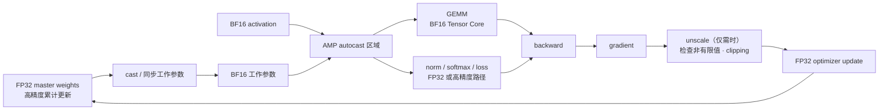
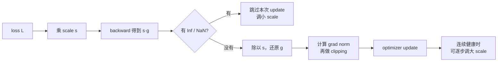
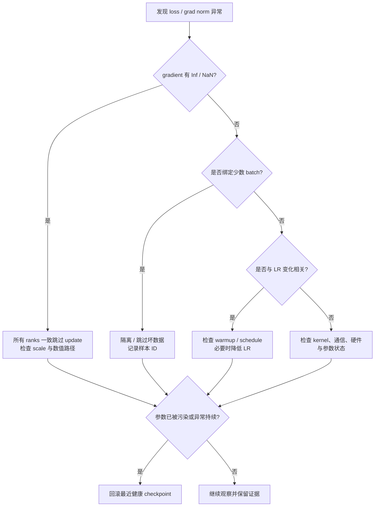
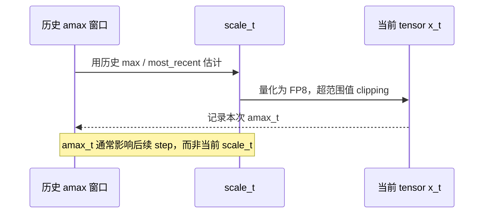

# L49 混合精度与FP8训练：算得更低，关键处记得更精

> [!abstract] 本课速览
> 读完你将能够：
> 1. 画出 AMP 训练的数据流，指出计算、参数更新与敏感算子分别使用什么精度；
> 2. 用梯度的缩放与还原解释 FP16 loss scaling，并说明 BF16 标准配方为什么不需要它；
> 3. 根据 loss、grad norm、learning rate 与非有限值日志处置一次 loss spike；
> 4. 区分 Transformer Engine 的 per-tensor delayed scaling 与 DeepSeek-V3 的细粒度在线 scaling；
> 5. 用 Amdahl's Law 和 activation 账估算 FP8 的理论收益边界；
> 6. 区分 determinism、bitwise reproducibility 与“训练曲线统计上一致”。
>
> 前置：[[L24 数值格式]] · [[L40 训练显存全解剖]] · 预计 55 分钟

## 论文里的这段话，你现在可能读不懂

> [!quote]
> “Training uses **AMP** with BF16 Tensor Core GEMMs and FP32 **master weights**, while the legacy FP16 recipe relies on **dynamic loss scaling**. Our **FP8 training** path tracks **amax** and applies either per-tensor **delayed scaling** or fine-grained **tile-wise scaling** with **high-precision accumulation**. We monitor **grad norm** and **loss spikes**; deterministic kernels improve run-to-run **determinism**, but do not guarantee **bitwise reproducibility** across systems.”（改写自典型 mixed-precision 与 FP8 训练表述）

这三句其实在回答三本账：低精度到底放在哪，数值出事时怎样保护参数，以及跑得更快之后还能不能复现。只记住“把 dtype 改成 BF16/FP8”会漏掉最关键的一半：==混合精度的核心不是全都变低，而是给每条数据流分配刚好够用的精度。==

## 一、为什么训练不能“一键全改低精度”

### 1.1 AMP 混合的不是一个数，而是不同角色

**mixed precision**（混合精度）是在同一次训练中，让不同 tensor、operator 或训练阶段使用不同数值格式。**AMP**（Automatic Mixed Precision，自动混合精度）则由框架按算子规则自动选择 dtype：大规模 GEMM 尽量进入低精度 Tensor Core 路径，数值敏感或计算占比很小的部分留在更高精度。

一套常见的 BF16 训练分工如下。它是逻辑角色图；具体框架可能保留 FP32 参数并在算子入口临时 cast，也可能显式维护低精度工作副本，不一定能在程序里找到两组同名 tensor。

| 角色 | 常见精度 | 为什么这样放 |
|---|---|---|
| Linear / attention 中的 GEMM 输入 | BF16 | 吃到 Tensor Core 吞吐，输入与 activation 字节也比 FP32 少一半 |
| norm、softmax、loss、部分 reduction | FP32 或内部高精度计算 | 对求和、指数和很小差值更敏感；计算量通常不是主体 |
| forward/backward 工作参数与 gradient | BF16（课程统一记账口径） | 降低计算和驻留字节；实现也可能使用其他 gradient dtype |
| **master weights**（主参数） | FP32 | 累计小更新，避免更新量在低精度参数格子中被舍入吞掉 |
| Adam 的 $m,v$ | FP32（课程基线） | 跨许多 steps 累积历史统计；特定系统可以另做低精度配方 |

这就是一句好记的话：**算得糙，记得精**。低精度副本负责本 step 的重计算，高精度 master weights 负责跨 steps 记账。[[L40 训练显存全解剖]] 的 $16$ B/参数基线正是 BF16 参数 2 B + BF16 gradient 2 B + FP32 master 4 B + FP32 $m$ 4 B + FP32 $v$ 4 B。

> [!warning] AMP 不是“模型 `.half()` 一下”
> 自动选择 dtype 的规则要知道算子语义。GEMM 适合低精度，不代表 softmax、norm、loss 与 optimizer update 也该无条件降到同样精度；把所有 tensor 一刀切，常常正是 NaN、Inf 或静默精度损失的来源。

## 二、FP16 为什么要放大 loss，BF16 为什么通常不用

### 2.1 loss scaling 只是给 backward 临时“开大音量”

[[L24 数值格式]] 已经比较过：FP16 指数位少，动态范围比 BF16 窄。backward 里本来就小的 gradient 可能发生 **underflow**（下溢），舍入为 0 后再也救不回来。**loss scaling**（损失缩放）不改变优化问题，而是在 backward 前把 loss 乘一个正的 scale $s$：

$$
L'=sL,\qquad
\nabla_\theta L'=s\nabla_\theta L.
$$

放大后的 gradient 先避开 FP16 的过小区域；在 optimizer 真正更新前再除以 $s$：

$$
\frac{\nabla_\theta L'}{s}=\nabla_\theta L.
$$

固定 $s$ 很难兼顾整个 training run：太小救不了 underflow，太大又可能把值推成 Inf。**dynamic loss scaling**（动态损失缩放）因此根据运行状态调节 $s$：检测到非有限 gradient 就跳过这次参数更新并缩小 scale；连续若干健康 steps 后再尝试增大。当前 PyTorch AMP 的 FP16 常见组合也是 `autocast` 加 `GradScaler`，并要求在 clipping 前先 unscale。[官方示例](https://docs.pytorch.org/docs/stable/notes/amp_examples.html)

BF16 与 FP32 有相同的指数位宽，动态范围在同一量级，所以标准 BF16 训练通常不需要用 loss scaling 来补救范围不足。注意这不等于“BF16 没有舍入误差”：它的 mantissa 更短，master weights 与高精度 accumulation 仍然重要。很多训练脚本从 FP16 时代迁移而来，保留的 scaler 往往只是历史包袱，不是 BF16 的必需组件。

## 三、从 grad norm 到 loss spike：把训练日志当病历看

### 3.1 clipping 是保险丝，不是诊断报告

**grad norm**（梯度范数）把一组 gradients 汇总成一个长度。常见的全局 $L_2$ norm 是

$$
\|\mathbf g\|_2=\sqrt{\sum_i g_i^2}.
$$

**gradient clipping**（梯度裁剪）在 norm 超过阈值 $c$ 时整体缩放 gradient：

$$
\mathbf g_{\text{clip}}
=\mathbf g\cdot\min\left(1,\frac{c}{\|\mathbf g\|_2}\right).
$$

它保留方向，只限制单步长度。若使用 loss scaling，必须先把 $s\mathbf g$ unscale 回 $\mathbf g$，再统计 norm 和 clipping；否则阈值比较的是人为放大后的量。参数或 gradient 被 sharding 后，“全局 norm”还需要跨 ranks 汇总局部平方和，不能把某个 shard 的 norm 冒充整个模型的 norm。

### 3.2 spike 处置顺序：先止血，再找病因

**loss spike**（损失尖峰）是 loss curve 突然显著上冲的点或短区间。[[L14 预训练]] 已经见过它；工程现场至少要并排看 loss、未裁剪 grad norm、learning rate、loss scale、Inf/NaN 标记、batch ID 和各 ranks 的同步状态。

| 常见病因 | 日志线索 | 第一动作 |
|---|---|---|
| 坏数据、异常长度或损坏 sample | spike 与固定 batch ID 同步复现 | 隔离数据；分布式作业必须让所有 ranks 对该 step 做一致决定 |
| learning rate 过大或 schedule 跳变 | grad norm 与 LR 同时上升，持续多个 steps | 检查 warmup/schedule，必要时降低 LR；不能只靠 clipping 长期压住 |
| FP16/FP8 overflow、scale 落后于分布变化 | Inf/NaN、amax 或 loss scale 同时异常 | 跳过 update，调 scale，定位最先产生非有限值的 operator |
| kernel、collective 或硬件异常 | 个别 rank 先异常、校验错误或通信报错 | 保存 rank 级证据，隔离节点/路径；进入 [[L53 大规模训练可靠性]] 的恢复流程 |

“跳 batch”不是随便让某个 worker `continue`：同步训练中，各 ranks 必须一致跳过 optimizer step，否则轻则模型副本分叉，重则 collective 次序错位后挂死。“回滚”也不是看到一个尖峰就条件反射；先判断参数有没有被非有限 update 污染，偶发但可恢复的异常应尽量保留证据。

## 四、FP8 训练：难点不在 8 bit，而在 scale 放哪里

### 4.1 一个 outlier 怎样绑架整个 tensor

**FP8 training**（FP8 训练）通常不是把整个训练状态存成 FP8，而是让计算密集的 GEMM 接收 FP8 输入，同时让输出、累加、敏感算子和长期状态保留更高精度。FP8 的范围和精度预算都更紧，需要先用 scale 把输入分布对齐到可表示范围。

令 **amax**（绝对值最大值）为

$$
a_{\max}=\max_i|x_i|,
$$

一种直观 scale 是 $s=\mathrm{FP8}_{\max}/a_{\max}$，再量化 $sx$。问题在于：若一整个 tensor 共用一个 scale，一个极端 outlier 会把 $a_{\max}$ 拉大，绝大多数普通值便挤在很少的 FP8 格子里。scale 太激进会 clipping，太保守会让小值 underflow；这就是 FP8 配方的主战场。

### 4.2 Transformer Engine：历史 amax 换少读一次 tensor

截至 2026 年，NVIDIA **Transformer Engine**（Transformer 低精度训练库）的经典 FP8 delayed recipe 使用 **per-tensor scaling**（每 tensor 缩放）：每个被量化 tensor 配一个 FP32 scale。**delayed scaling**（延迟缩放）不在当前 step 为确定 scale 额外扫描一次 tensor，而是从过去的 amax history 估计本次 scale；本次量化时同时记录新的 amax，留给后续 steps 使用。[官方文档](https://docs.nvidia.com/deeplearning/transformer-engine/user-guide/features/low_precision_training/fp8_delayed_scaling/fp8_delayed_scaling.html)

优点是 current scaling 原本要“先读一遍算 amax，再读一遍做 cast”，delayed scaling 可以少一次读；代价是分布突然变化时，历史 scale 可能落后。因此库还要管理 history、margin、clipping 与跨并行组的 amax reduction。Transformer Engine 的常见 hybrid recipe 在 forward 用 E4M3、backward 用范围更大的 E5M2；两种格式已在 [[L24 数值格式]] 解释。

### 4.3 DeepSeek-V3：把 scale 做细，并在当前 tile 上在线算

[《DeepSeek-V3 Technical Report》](https://arxiv.org/html/2412.19437v2) 的配方与上面的 per-tensor delayed scaling 有两处关键不同：它做细粒度分组，而且对当前分组在线计算 amax。**tile-wise scaling**（按 tile 缩放）让 activation 的每个 $1\times128$ tile（每 token 的连续 128 channels）独立取 scale；weight 则按 $128\times128$ block 取 scale。outlier 只影响自己的小组，不再拖累整张 tensor。

| 设计点 | Transformer Engine 经典 delayed recipe | DeepSeek-V3 报告配方 |
|---|---|---|
| scale 粒度 | 每个 tensor 一个 FP32 scale | activation 为 $1\times128$ tile；weight 为 $128\times128$ block |
| scale 时间 | 用历史 amax 估计当前 scale | 当前 tile/block 在线计算 amax 与 scale |
| FP8 格式 | 常见 hybrid：Fprop E4M3，Dgrad/Wgrad E5M2 | 细粒度 scaling 支撑 Fprop/Dgrad/Wgrad 均用 E4M3 |
| accumulation | 由标准 FP8 GEMM 路径处理 | 每累计 $N_C=128$ 个乘积（4 次 WGMMA）把部分和提升到 CUDA Core 的 FP32 registers |
| 高精度岛 | 非 FP8-safe operators 留高精度 | embedding、output head、MoE gating、normalization、attention 保持原精度；GEMM 输出为 BF16/FP32 |
| 长期状态 | 配方和 framework 决定 | master weights 与累计用 gradients 保持 FP32；AdamW 的 $m,v$ 使用 BF16 |

这里的 **high-precision accumulation**（高精度累加）解决的是“很多低精度乘积怎样求和”，不是把 FP8 输入重新变成 FP32 GEMM。DeepSeek 报告还让 MoE dispatch 的部分 activation/gradient 使用 FP8、combine 保持 BF16：同一条通信管线也在按敏感度分配精度。

> [!warning] DeepSeek 配方不是新的全课程显存常数
> [[03 约定与符号]] 的 $16$ B/参数仍是本课程通用 BF16 + FP32 Adam 基线。DeepSeek-V3 的 BF16 moments、FP32 gradient、细粒度 scale 与额外缓存是一个经过验证的特定系统配方；不能只挑“moments 减半”一项，就宣称任意模型都能稳定照搬。

## 五、算一算：为什么大家肯为 FP8 付工程复杂度

> [!example] 算一算：H100 的精度经济账
> **第一笔：Amdahl 端到端加速上限。**按 [[03 约定与符号]] 的 dense 口径，H100 SXM 的 BF16 峰值约 989 TFLOPS，FP8 峰值约 1979 TFLOPS，因此可转换 GEMM 的理想加速比为
>
> $$
> r=\frac{1979}{989}\approx2.00.
> $$
>
> 假设原 step 有 70% 时间属于能完整获得该加速的计算，剩余 30% 是通信、高精度算子、数据与调度等不变部分。Amdahl's Law 给出
>
> $$
> S_{\text{e2e}}
> =\frac{1}{(1-0.70)+0.70/r}
> \approx\frac{1}{0.30+0.70/2}
> =\frac{1}{0.65}
> \approx1.54\times.
> $$
>
> 所以“峰值翻倍”不等于 step time 减半；哪怕量化与 kernel 都理想，这组 workload 的理论天花板也只有约 $1.54\times$。
>
> **第二笔：Llama-3-8B activation。**沿用 [[L40 训练显存全解剖]] 的 $S=8192,b=1,d=4096,L=32$ 和 memory-efficient attention 教学式，BF16 activation 为
>
> $$
> M_{\text{act,BF16}}
> =34SbdL
> =34\times8192\times1\times4096\times32
> =36{,}507{,}222{,}016\ \text{B}
> \approx36.51\ \text{GB}.
> $$
>
> 若做一个理想化上界估算：式中所有需缓存项都能从 BF16 的 2 B 降为 FP8 的 1 B，则
>
> $$
> M_{\text{act,FP8-ideal}}
> =\frac{1}{2}M_{\text{act,BF16}}
> \approx18.25\ \text{GB},
> $$
>
> 理想节省约 18.25 GB。静态项仍按课程基线 $16N=128$ GB，因此总账只从约
>
> $$
> 128+36.51=164.51\ \text{GB}
> $$
>
> 降到
>
> $$
> 128+18.25=146.25\ \text{GB}.
> $$
>
> 结论有两层：FP8 activation 的容量收益很真；但它没有自动压缩 FP32 master weights 和所有 optimizer states，8B 仍放不进一张 80 GB H100。真实配方还会把敏感 activation 留在高精度，因此 18.25 GB 是“全部可减半”的理想估算，不是 DeepSeek-V3 实测值。

实际端到端收益还会被 quantize/dequantize、scale 元数据、非 FP8 算子、shape 对齐、kernel 利用率和通信暴露削弱。正确的评估问题不是“FP8 理论峰值多高”，而是：原 timeline 有多少比例真正落入 FP8 GEMM，新增 scaling 工作是否被融合，以及关键路径上的通信是否一起缩短。

> [!warning] 三个常见误区
> 1. **“混合精度一定让模型变差。”** 正确配方用 master weights、高精度 accumulation 与敏感算子白名单保护关键路径；是否无损仍要与高精度 baseline 对照，不能只凭 dtype 下结论。
> 2. **“BF16 也必须开 loss scaling。”** BF16 的动态范围已与 FP32 同量级，标准配方通常不需要这个 FP16 补丁。
> 3. **“FP8 就是把 dtype 换一下。”** scale 的粒度与时机、outlier、累加精度、缓存与通信格式共同决定能否稳定训练。

## 六、低精度还会走上网络

低精度计算、低精度存储和低精度通信是三件可以独立开关的事。一个含 $n$ 个元素的 tensor，BF16 payload 是 $2n$ B，FP8 payload 理想上是 $n$ B 再加 scale 元数据；若网络是关键瓶颈，all-gather、MoE dispatch 或 gradient 传输接近减半的诱惑很大。Transformer Engine 文档已经支持 quantized all-gather；[《ZeRO++: Extremely Efficient Collective Communication for Giant Model Training》](https://arxiv.org/abs/2306.10209) 也用 block quantization 缩减 parameter all-gather，并设计 quantized gradient averaging。

但 reduction 比单纯搬运更敏感：压缩误差会跨 ranks、跨 steps 累积，还要支付 quantize/dequantize、scale 同步与可能的 error-control 成本。网络研究里不能只报“bit 数减半”，至少要同时测通信字节、collective 时间、暴露通信、训练 loss/收敛与额外 kernel 时间。[[L63 跨域与跨集群训练]] 会把它放回完整的 communication compression 谱系。

## 七、为什么同一配方跑两次也不会逐 bit 一样

**determinism**（确定性）是指固定初始状态、输入和执行环境时，操作的结果由这些条件唯一决定。GPU atomics 的竞争顺序、并行 reduction tree、kernel 选择、rank 到达时序都可能改变浮点加法顺序；而浮点加法不满足严格结合律，所以只要归约顺序变了，末位就可能不同。

**bitwise reproducibility**（逐 bit 可复现性）要求两次运行的对应输出每一 bit 都相同，比“loss 曲线重合到绘图精度”严格得多。固定随机种子只是必要条件之一；框架版本、设备、driver、通信算法和 kernel 都可能破坏 bitwise matching。PyTorch 也明确说明跨 release、platform 或 CPU/GPU 不保证完全复现，并提供 deterministic algorithms 模式来收紧同环境行为。[官方说明](https://docs.pytorch.org/docs/stable/notes/randomness)

确定性通常有性能代价：替代 kernel 可能更慢，固定 reduction 顺序可能损失并行度，关闭 autotuning 也会放弃更快实现。工程上常分两档：小规模 debug/regression run 尽量开启 deterministic 路径；大规模 production run 接受合理的数值随机性，但保存 seed、代码/镜像、数据顺序、拓扑与完整配置，并用 loss、指标分布和多次重复判断统计可复现性。

## 回到开头那段话

第一句现在可以翻译为：AMP 把适合吞吐的 GEMM 放到 BF16 Tensor Core，把跨 steps 的参数累计留给 FP32 master weights；旧式 FP16 因动态范围窄，需要 dynamic loss scaling 防止小 gradient underflow，BF16 标准配方通常免掉这一步。

第二句说的是两条不同的 FP8 路线：Transformer Engine 可用历史 amax 做 per-tensor delayed scaling；DeepSeek-V3 则把 activation 切成 $1\times128$ tiles、weight 切成 $128\times128$ blocks，在线求 scale，并周期性把部分和提升到 FP32 做 high-precision accumulation。FP8 不是一个 dtype 开关，而是一整套 scale、kernel 与高精度岛的共同设计。

第三句把训练运维与复现接上了：grad norm 和 loss spike 是病历指标，clipping、跳 update、隔离数据、降 LR 与 rollback 是分层处置；deterministic kernel 能减少同环境差异，却不能自动保证跨系统 bitwise reproducibility。到这里，开场三句话已经可以逐句读懂。

## 术语卡片

| 术语 | 中文 | 一句话解释 |
|---|---|---|
| mixed precision | 混合精度 | 在一次训练中按 tensor、operator 或阶段分配不同数值格式。 |
| AMP | 自动混合精度 | 框架按算子规则自动选择低精度或高精度执行路径的机制。 |
| master weights | 主参数 | 用于高精度累计 optimizer 更新的 FP32 参数副本或逻辑角色。 |
| loss scaling | 损失缩放 | backward 前放大 loss、更新前还原 gradient，以减少 FP16 gradient underflow。 |
| dynamic loss scaling | 动态损失缩放 | 根据 Inf/NaN 与连续健康 steps 自动调整 loss scale。 |
| underflow | 下溢 | 数值过小进入 subnormal 或舍入为 0，导致信息消失。 |
| grad norm | 梯度范数 | 汇总一组 gradients 长度的统计量，用于监控与 clipping。 |
| gradient clipping | 梯度裁剪 | gradient norm 过大时限制更新长度，降低异常单步破坏。 |
| loss spike | 损失尖峰 | loss curve 中突然显著上冲的异常点或短区间。 |
| FP8 training | FP8 训练 | 让主要 GEMM 使用 FP8 输入，同时保留高精度输出、累加、敏感算子或状态的训练配方。 |
| Transformer Engine | Transformer Engine | NVIDIA 提供的 Transformer 低精度训练库，封装 FP8 recipe、scale 与相关 kernels。 |
| amax | 绝对值最大值 | $\max_i|x_i|$，常用于估计量化 scale 与监控溢出风险。 |
| delayed scaling | 延迟缩放 | 用历史 amax 估计当前 scale，并把当前 amax 留给后续 step 的策略。 |
| per-tensor scaling | 每 tensor 缩放 | 整个 tensor 共用一个 scale 的量化粒度。 |
| tile-wise scaling | 按 tile 缩放 | 把 tensor 切成较小 tiles，各自使用 scale 以隔离局部 outlier。 |
| high-precision accumulation | 高精度累加 | 低精度乘法输入配合更高精度部分和，减少长归约的舍入误差。 |
| determinism | 确定性 | 固定状态、输入和环境时，执行结果由这些条件唯一决定的性质。 |
| bitwise reproducibility | 逐 bit 可复现性 | 两次运行对应结果的每一 bit 都一致的严格复现要求。 |

## 自测

1. AMP 中“混合”的对象有哪些？为什么不能把 norm、softmax、loss 与 GEMM 一律放到同一低精度？
2. FP32 master weights 解决了什么问题？它与低精度工作参数各负责哪个时间尺度？
3. 写出 loss scaling 的放大与还原公式；为什么 clipping 必须在 unscale 之后？
4. 发现 loss spike 后，坏数据、learning rate 与数值 overflow 分别最可能留下什么日志线索？同步训练中为什么不能让单个 rank 自行跳 batch？
5. 比较 Transformer Engine delayed scaling 与 DeepSeek-V3 配方在 scale 粒度、scale 时间和 accumulation 上的不同。
6. **计算题**：若 H100 上可加速的 FP8 计算占原 step 的 80%，其余 20% 不变，且这部分理想加速 $2\times$，端到端理论加速是多少？若 8B 教学例子的 BF16 activation 为 36.51 GB，全部可减半时节省多少 GB？
7. 为什么固定随机种子仍不保证 bitwise reproducibility？在大规模分布式训练中，至少再记录四类什么信息？

> [!note]- 参考答案
> 1. 混合对象包括 tensor 存储、operator 输入/输出、accumulation、optimizer update 与通信 payload。GEMM 计算密集且硬件支持好；norm、softmax、loss 涉及 reduction、指数或小差值，对舍入与范围更敏感，保留高精度的成本通常也较小。
> 2. 低精度工作参数服务当前 forward/backward，换吞吐与容量；FP32 master weights 跨 steps 累积细小 update，避免每次更新都在较粗的低精度格子中消失。
> 3. $L'=sL$、$\nabla L'=s\nabla L$，更新前用 $\nabla L'/s$ 还原。若先 clipping，norm 会被人为的 $s$ 放大，阈值语义错误；正确顺序是 unscale → 检查非有限值 / 计算 norm → clipping → update。
> 4. 坏数据常与固定 batch ID、异常长度或损坏 sample 绑定；LR 问题常与 warmup/schedule 变化同步并持续；overflow 常伴随 Inf/NaN、amax 或 loss scale 异常。所有 ranks 必须保持相同 optimizer step 和 collective 次序，单 rank 跳过会造成参数分叉或通信挂死。
> 5. Transformer Engine 经典 recipe 是 per-tensor、历史 amax 推当前 scale，并由标准 FP8 GEMM 路径累加；DeepSeek-V3 对 activation 用 $1\times128$ tile、weight 用 $128\times128$ block，在线计算当前 scale，并每 128 个乘积把部分和提升到 FP32 registers 累加。
> 6. $S=1/(0.2+0.8/2)=1/0.6\approx1.67\times$。activation 减半为约 18.255 GB，因此节省约 18.255 GB；静态状态没有因此自动减半。
> 7. atomics、浮点归约顺序、kernel/算法选择和并行到达时序都可能改变末位。至少记录代码 commit、容器/依赖与 driver、数据版本和顺序、随机种子/RNG state、硬件与拓扑、并行配置、collective/kernel 选择、checkpoint 与启动命令中的四类以上。

## 延伸阅读

- [《Mixed Precision Training》](https://arxiv.org/abs/1710.03740)（ICLR 2018）：精读 master weights 与 loss scaling，两项机制就是 FP16 AMP 的历史起点。
- [《DeepSeek-V3 Technical Report》](https://arxiv.org/html/2412.19437v2)：精读 3.3 节与附录 B；把 Figure 6/7 对照本课的“低精度主干 + 高精度岛”。
- [NVIDIA Transformer Engine：FP8 Delayed Scaling](https://docs.nvidia.com/deeplearning/transformer-engine/user-guide/features/low_precision_training/fp8_delayed_scaling/fp8_delayed_scaling.html)：重点看 amax history、scale 更新与 distributed amax reduction，不必背 API 默认值。
- [《ZeRO++: Extremely Efficient Collective Communication for Giant Model Training》](https://arxiv.org/abs/2306.10209)：选读 quantized all-gather 与 gradient communication，观察低精度怎样从 Tensor Core 走上网络。

---
上一课：[[L48 实践-并行策略推演]] ← · → 下一课：[[L50 显存优化技术]]
