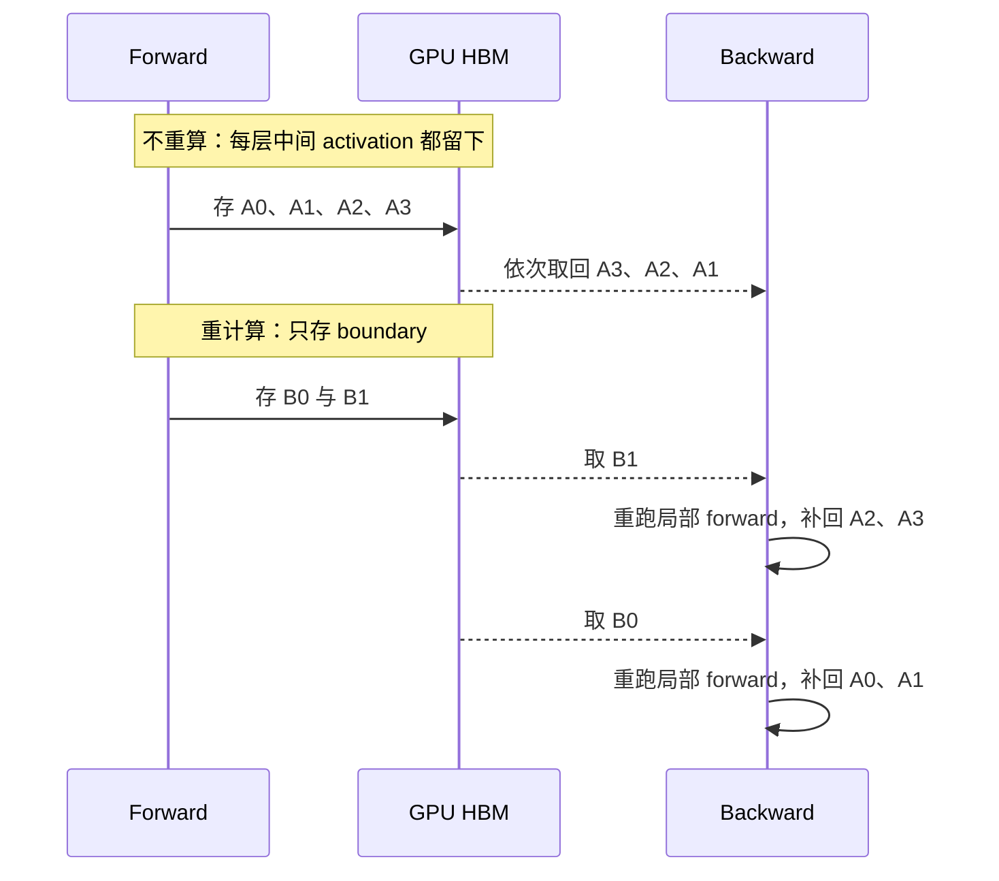
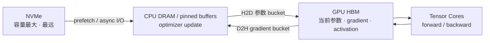
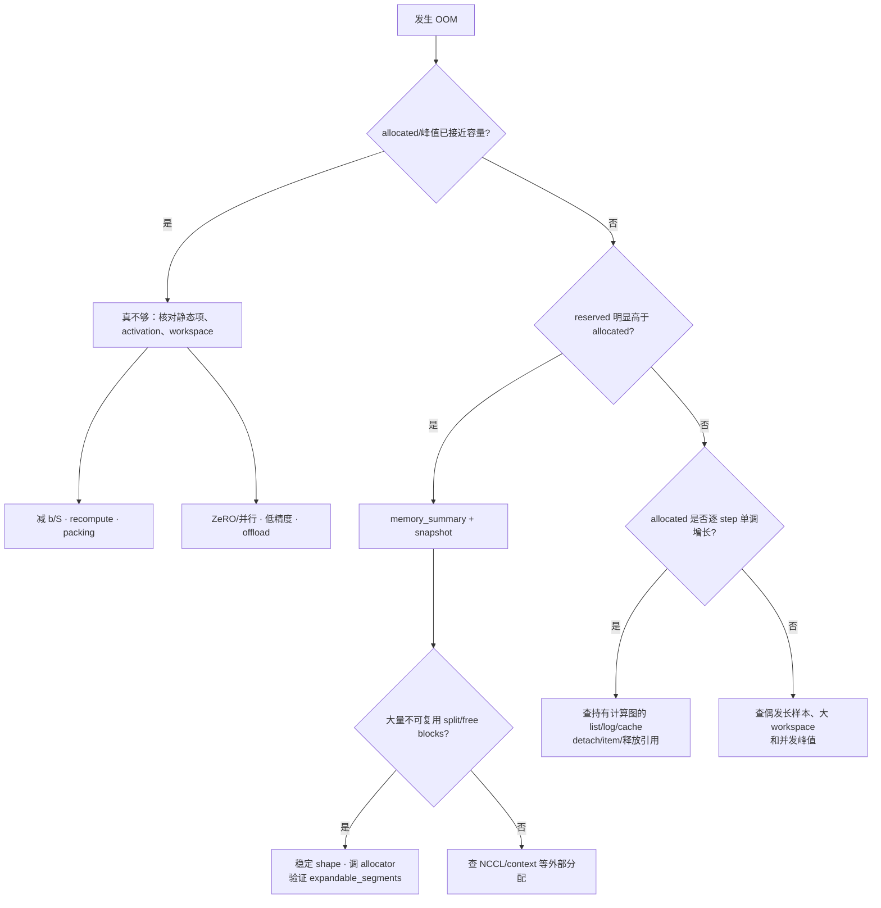

# L50 显存优化技术：少存、挪走与管好内存池

> [!abstract] 本课速览
> 读完你将能够：
> 1. 画出 gradient checkpointing 的存算时序，区分 full 与 selective recomputation；
> 2. 用 $6N\rightarrow8N$ 解释 full recomputation 的计算代价，并分清它对 MFU/HFU 的影响；
> 3. 用 70B、$S=8192$ 的教学账估算不重算、selective 与 full recomputation 的 activation 数量级；
> 4. 区分 offload 的驻留量与每 step 传输量，用 PCIe 带宽判断搬运能否藏在计算后面；
> 5. 从 `allocated`、`reserved`、memory summary 与 snapshot 区分真不够、碎片和泄漏；
> 6. 为资源充足或受限的集群组合 recomputation、ZeRO、offload、packing 与 allocator 工具。
>
> 前置：[[L40 训练显存全解剖]] · [[L21 GPU内存体系]] · 预计 60 分钟

## 论文里的这段话，你现在可能读不懂

> [!quote]
> “With **activation recomputation** (or **gradient checkpointing**), we retain **checkpoint boundaries** and rerun discarded forward operators during backward; **full recomputation** minimizes activation residency, whereas **selective recomputation** targets memory-heavy but relatively cheap subgraphs. **ZeRO-Offload** and **ZeRO-Infinity** tier model states across GPU, CPU, and NVMe, so throughput depends on whether transfers can be prefetched and overlapped rather than on offloaded residency alone. A large gap between memory **reserved** and **allocated** may indicate **caching allocator** fragmentation; **memory snapshots** and **expandable segments** help distinguish it from a true leak or capacity shortfall.”（改写自典型训练系统与 PyTorch 显存诊断表述）

这段话把三种长得都像“OOM”的病揉在了一起：活跃 tensor 真的装不下、数据装得下但放错了层级、总空闲不少却拼不出一次大申请。三种病的药分别是少存、挪走和整理内存池；药开错了，最常见的结果就是“显存数字变好看，step time 却崩了”。

## 一、重计算：forward 的中间草稿不必全留

### 1.1 checkpoint 不是故障恢复文件

[[L40 训练显存全解剖]] 已经算过：backward 要用 forward 的中间结果，所以 activation 会一直占着 HBM。**activation recomputation**（激活重计算）与 **gradient checkpointing**（梯度检查点）在训练框架里通常指同一家族：forward 只保存少量输入或边界 tensor，backward 走到该区域时，再跑一遍局部 forward 补回被丢掉的 activation。

这里的 **checkpoint boundary**（重计算边界）是计算图中的“存档点”，通常位于一层或一组层的输入处；它在本 step 的 HBM 中服务 backward，不是 [[L53 大规模训练可靠性]] 中写到存储、用于故障恢复的训练 checkpoint。就像解题时只抄每一大题的起点，回头需要中间式时再推一遍。



边界越稀，常驻 activation 越少，但重跑区间越长；边界越密，显存省得少，重跑也少。实际系统还要保存随机数状态等信息，保证 dropout 一类随机算子重跑时与原 forward 一致，否则“重算”会悄悄变成另一张计算图。

### 1.2 full 与 selective：按“省下的字节 / 重算 FLOPs”排序

**full recomputation**（完整重计算）在 Transformer 层边界保存输入，层内大多数 activation 都丢掉，backward 时把整层 forward 重跑一遍。它的优点是规则简单、显存降得狠；缺点是昂贵 GEMM 也要再做一次。

**selective recomputation**（选择性重计算）先问得更细：哪块 activation 占得多，但重新生成并不贵？Megatron 的 MLSys 2023 工作选择重算 self-attention 中 $QK^T$、softmax、dropout 与和 $V$ 相乘等内存占比高的子图，同时保留重算成本更高的线性层/MLP 结果。该论文在其 GPT-3 与 MT-NLG 教学配置中，分别以 2.7% 和 1.6% 的额外 FLOPs 省下 70% 和 65% activation；其 22B 单层实验中 selective 的执行时间开销为 7%，与 sequence parallelism 合用为 4%。这些是论文特定模型与系统的结果，不是“所有 selective 都小于 10%”的保证。[论文第 5–6 节](https://proceedings.mlsys.org/paper_files/paper/2023/hash/80083951326cf5b35e5100260d64ed81-Abstract-mlsys2023.html)

| 策略 | 保存什么 | backward 重跑什么 | 适合先解决什么 |
|---|---|---|---|
| 不重算 | backward 所需的大部分 activation | 基本不重跑 | 算力紧、HBM 余量足 |
| full recomputation | 层/分段边界 | 边界之间的大部分 forward | 容量最紧、愿意多付计算 |
| selective recomputation | 昂贵算子的必要输出与边界 | 占内存大、相对便宜的子图 | 追求更高“每 FLOP 省显存” |

> [!tip] FlashAttention 与 selective 不是两个互不相干的开关
> memory-efficient attention 本身就通过 tiling 与 backward 重算避免 $S^2$ 中间矩阵常驻。已经使用这类 kernel 时，哪些 tensor 还能被 selective 丢弃、公式中的常数还剩多少，必须按实际实现重算；不能把两项宣传数字直接相乘。

### 1.3 full 为什么常写成“多付约三分之一计算”

按 [[03 约定与符号]]，dense Transformer 每 token 的必要训练工作量近似为 $6N$ FLOPs：forward 约 $2N$，backward 约 $4N$。full recomputation 多跑一次 forward，因而变成

$$
6N+2N=8N,
$$

相对额外 FLOPs 为

$$
\frac{8N-6N}{6N}=\frac{1}{3}\approx33.3\%.
$$

这是 FLOPs 账，不是任意系统都精确慢 33.3% 的 wall-clock 定律：重跑可能命中不同 kernel，通信与数据输入也可能被覆盖。反过来，额外计算若挤压了通信 overlap，时间损失还可能更大。

这也闭环了 [[L22 算力度量与MFU]] 的 MFU/HFU。假设一个不重算作业的 MFU 为 $m$，full recomputation 后硬件执行效率不变，处理同样 token 的时间理想化地扩大为 $8/6=4/3$：

$$
\text{MFU}_{\text{full}}=\frac{6}{8}m=0.75m,
\qquad
\text{HFU}_{\text{full}}\approx m.
$$

若 $m=40\%$，表面上便是 MFU 降到 $30\%$，HFU 仍约 $40\%$。HFU 把额外 $2N$ 也算作“硬件做过的工作”，MFU 只认推进模型 token 所必需的 $6N$；==重算可以让卡更忙，却不会凭空增加有效 token 产出。==当然，若省下的显存允许更大 micro-batch、减少气泡并提高 tokens/s，最终 MFU 也可能回升，仍应以实测为准。

## 二、算一算：70B、$S=8192$ 的三档 activation 账

> [!example] 算一算：从约 1.90 TB 到 10.74 GB
> 为了隔离 recomputation 的效果，先设一个明确但**不能直接运行**的无模型并行教学场景：Llama-3-70B 的课内参数取自 [[03 约定与符号]]，$L=80,d=8192,h=64$；令 $S=8192,b=1$，容量按 SI 字节。真实 70B 训练必须叠加 TP/PP/CP/ZeRO，per-rank activation 还会随切分和流水线中同时驻留的 micro-batches 改变。
>
> 先算公共项：
>
> $$
> SbdL
> =8192\times1\times8192\times80
> =5{,}368{,}709{,}120.
> $$
>
> **第一档：朴素 attention、不重算。**沿用 [[L40 训练显存全解剖]] 的教学公式：
>
> $$
> 34+5\frac{hS}{d}
> =34+5\times\frac{64\times8192}{8192}
> =354,
> $$
>
> $$
> M_{\text{naive}}
> \approx354SbdL
> =1{,}900{,}523{,}028{,}480\ \text{B}
> \approx1{,}900.52\ \text{GB}.
> $$
>
> **第二档：移除 $S^2$ 常驻项。**使用 L40 的 memory-efficient attention / selective 教学式：
>
> $$
> M_{\text{linear}}
> \approx34SbdL
> =182{,}536{,}110{,}080\ \text{B}
> \approx182.54\ \text{GB}.
> $$
>
> **第三档：按每层输入做 full checkpoint。**若每个 boundary 只保留一份 BF16 层输入，边界账近似为：
>
> $$
> M_{\text{boundary}}
> \approx2SbdL
> =10{,}737{,}418{,}240\ \text{B}
> \approx10.74\ \text{GB}.
> $$
>
> 因此在这套统一教学口径下，full 相对第二档把 activation 再压约
>
> $$
> \frac{182.54}{10.74}\approx17\times,
> $$
>
> 代价则是把必要 $6N$ FLOPs 提到约 $8N$。这解释了为什么 recomputation 常是大模型训练默认工具：它能一次拿回数量级上的 HBM，但不是免费；真实峰值还要加 RNG 状态、临时 workspace、通信 buffer 与 allocator 碎片。

## 三、offload：容量搬家以后，带宽成为房租

### 3.1 ZeRO-Offload 与 ZeRO-Infinity 分别把什么挪走

**ZeRO-Offload**（ZeRO 卸载）把 ZeRO-2 切分后的 optimizer-related states 和 optimizer update 放到 CPU：GPU 留着高吞吐 forward/backward，CPU DRAM 承担更大的状态驻留，CPU 执行更新。关键不是“CPU 内存很多”，而是把每 step 必须经过 PCIe 的字节压到足够小，并用 buckets、pinned memory 与异步流水覆盖搬运。《[ZeRO-Offload: Democratizing Billion-Scale Model Training](https://www.usenix.org/conference/atc21/presentation/ren-jie)》发表于 USENIX ATC 2021。

**ZeRO-Infinity**（ZeRO Infinity）进一步结合 ZeRO-3，把完整模型状态分层放入 GPU、CPU DRAM 与 NVMe，并用 prefetch、overlap 和内存/参数 tiling 尽量连续喂给 GPU。**NVMe offload**（NVMe 卸载）容量更大，但比 CPU DRAM 离 GPU 更远；它解决的是“还能不能放下”，吞吐能否接受则取决于工作集、存储栈与预取是否命中。《[ZeRO-Infinity: Breaking the GPU Memory Wall for Extreme Scale Deep Learning](https://doi.org/10.1145/3458817.3476205)》发表于 SC 2021。



这里的 **PCIe bottleneck**（PCIe 瓶颈）是：HBM 省下来的数据若在关键路径上反复穿过 PCIe，总线速率先于 GPU 算力限制 step time。按 [[03 约定与符号]]，PCIe Gen5 x16 约 64 GB/s **单向**，而 H100 HBM 是 3.35 TB/s；“CPU 内存能装下”完全不等于“GPU 来得及取”。

### 3.2 第一条规矩：驻留量不等于传输量

> [!example] 算一算：70B、DP=8 的 ZeRO-Offload PCIe 账
> 仍用 [[03 约定与符号]] 的 $N=70\times10^9$ 与 BF16/FP32 字节口径。按设计稿的 ZeRO-Offload 教学模型，FP32 master weights 与 Adam $m,v$ 共 $12N$ B，经过 DP=8 切分后每个 rank 在 CPU **常驻**：
>
> $$
> M_{\text{CPU,resident/rank}}
> =\frac{12N}{8}
> =\frac{12\times70\times10^9}{8}
> =105\ \text{GB}.
> $$
>
> 这 105 GB 不是每 step 全部穿 PCIe。每 step 的主要跨层流量是 BF16 gradient shard 下行与更新后的 BF16 parameter shard 上行，各约 $2N/DP$：
>
> $$
> V_{\text{D2H}}=V_{\text{H2D}}
> =\frac{2N}{8}=17.5\ \text{GB},
> $$
>
> $$
> V_{\text{PCIe,total}}
> \approx\frac{4N}{8}=35\ \text{GB/step/rank}.
> $$
>
> 若保守地按两个方向依赖串行、并用 PCIe Gen5 x16 的 64 GB/s 单向课内口径做 payload-only 下界：
>
> $$
> T_{\text{copy,min}}
> =\frac{35\ \text{GB}}{64\ \text{GB/s}}
> \approx0.547\ \text{s}.
> $$
>
> 若原 GPU step 约 2 s，那么 0.547 s 不是自动增加到 step 尾部：分桶 pipeline 可以把 bucket $i$ 的 CPU update/H2D 与后续 GPU backward 重叠。但要做到“几乎不掉吞吐”，至少要让每个 bucket 的 copy 与 CPU optimizer 时间落进可用 overlap window；一旦预取晚到、CPU update 太慢、PCIe 被 NIC/其他 GPU 争用，或 bucket 太碎而固定开销显著，剩余时间就暴露在关键路径上。

把可行性写成一句参数式更稳：

$$
T_{\text{exposed}}
\approx
\max\left(0,T_{\text{copy}}+T_{\text{CPU-opt}}-T_{\text{overlap}}
\right).
$$

这是把 copy 与 CPU update 保守串行后的教学模型；bucket pipeline 可以改变有效关键阶段。当右边长期为正，offload 虽然让作业“能跑”，却会让吞吐下降；这就是“offload 不是免费仓库”。上式没有把 PCIe 全双工、协议效率或多设备竞争偷塞成固定常数，真实值必须 profiler 实测。

## 四、内存池治理：`reserved` 高不一定是真的没空间

### 4.1 caching allocator 为什么要 split block

[[L21 GPU内存体系]] 已介绍 **caching allocator**（缓存分配器）：PyTorch 不会为每个短命 tensor 都立刻向 CUDA 驱动申请/归还内存，而是取得较大的 segment，再把其中 block 分给 tensor；tensor 释放后 block 留在池中复用。这样省掉频繁 `cudaMalloc` 的同步和固定开销。

于是 **reserved vs allocated**（保留量与活跃分配量）必须分开读：

- `allocated`：当前活跃 tensor 占用的 block；
- `reserved`：allocator 从 CUDA 取得并管理的 segment 总量，包含 allocated 与池内空闲 block；
- 设备/驱动占用：还可能含 NCCL、CUDA context 等不经过 PyTorch allocator 的内存。

**fragmentation**（内存碎片）发生在 block 被不断 split、不同尺寸和生命周期的 tensor 交错后：空闲字节加起来够，但散在多个 segment 或不相邻 block 中，合不成当前申请所需的大块。动态 batch、可变序列长度和偶发大 workspace 很容易制造这种“仓库里还有空位，大箱子却进不了任何一个货架格”的局面。

### 4.2 summary 看体检表，snapshot 看案发录像

快速对账先看：

```python
import torch

print(torch.cuda.memory_summary())
print("allocated:", torch.cuda.memory_allocated())
print("reserved :", torch.cuda.memory_reserved())
```

若要知道“哪行代码何时申请、释放了哪个 block”，再录 **memory snapshot**（内存快照）：

```python
torch.cuda.memory._record_memory_history(max_entries=100_000)

run_one_or_more_steps()

torch.cuda.memory._dump_snapshot("oom_snapshot.pickle")
```

把文件拖进 [PyTorch Memory Visualizer](https://pytorch.org/memory_viz) 查看 active blocks、inactive blocks、segment 与 OOM 事件。`_record_memory_history` 和 `_dump_snapshot` 名字带下划线，使用前应按当前 PyTorch 文档核对；历史太长还会让 snapshot 自身变大。更重要的是，snapshot 默认只看 PyTorch allocator 管理的显存；若 `nvidia-smi`/驱动视角明显更高，要继续检查 NCCL 等外部分配。[PyTorch 官方 memory snapshot 指南](https://docs.pytorch.org/docs/stable/torch_cuda_memory.html)

**expandable segments**（可扩展内存段）让 allocator 为同一 stream 尽量使用可增长的 segment，减少 micro-batch 从 $b$ 变成 $b+1$ 时在许多既有 segments 尾部留下无法利用的小碎片。当前官方文档把它描述为实验性选项，适合“分配尺寸频繁小幅变化”的模式；可在兼容版本中通过 allocator 配置启用，例如：

```bash
PYTORCH_ALLOC_CONF=expandable_segments:True python train.py
```

它不会减少活跃 tensor 的理论总量，也治不了 Python 容器长期持有带计算图 tensor 的泄漏。先用 snapshot 证明是相应碎片模式，再做 A/B 测试；不要把环境变量当成免诊断的一行偏方。[PyTorch CUDA memory management 文档](https://docs.pytorch.org/docs/stable/notes/cuda.html#cuda-memory-management)

### 4.3 OOM 三问：真不够、碎了，还是泄漏了



`torch.cuda.empty_cache()` 只能把**完全空闲**的缓存 segments 还给 CUDA，不能释放仍被 tensor 引用的 allocated memory，也不会让同一进程凭空获得超过物理容量的空间。它可能帮助别的进程看到更多 free，或偶尔改变碎片布局，但不该放进每 step 当作显存优化算法。

## 五、三种容易漏掉的小杠杆

1. **sequence packing**（序列装箱）把多个短样本拼进同一个长度为 $S$ 的训练序列，并用 position/attention 边界阻止样本互相“偷看”。它消除 **padding waste**（padding 浪费）：若一个 batch 真 token 只占槽位的 60%，剩下 40% padding 仍会产生 activation 和大量算子工作；packing 提高的是有效 token 密度，不是压缩单个 token 的表示。
2. CPU activation offload 把 forward activation 暂存到 host DRAM，backward 前再取回。它与 recomputation 的选择题是“重算 FLOPs 便宜，还是 PCIe 往返便宜”；长序列、算子成本和 overlap window 都会改变答案。
3. 推理侧的 NVMe KV offload 把冷 KV blocks 分层放到 CPU/NVMe，以容量换 PCIe/存储流量。它与训练参数 offload 共用“驻留量 ≠ 传输量、预取必须命中”的判据，具体机制留到 [[L56 KV缓存与PagedAttention]]。

> [!warning] 三个常见误区
> 1. **“重计算免费省显存。”** full 多约 $1/3$ FLOPs，还会抬高含重算工作的 HFU；是否值得看 tokens/s、MFU 与容量能否同时改善。
> 2. **“offload 等于无限显存。”** 容量可以继续向 CPU/NVMe 扩，关键路径却受 PCIe、存储、CPU optimizer 与预取约束。
> 3. **“OOM 就开 recompute。”** `allocated` 不高而 `reserved` 很高时，应先用 summary/snapshot 判断碎片；逐 step 增长则先找泄漏。

## 六、把 L40 的解法地图打完勾

显存工具不是互斥按钮，而是按对象组合：静态模型状态用 ZeRO/并行/低精度/offload，activation 用 recomputation/sequence parallel/packing，运行时峰值再由 kernel 与 allocator 治理。

| 场景 | 优先组合 | 为什么 |
|---|---|---|
| 互联快、资源充足的 70B 类预训练 | ZeRO/TP/PP + selective recomputation；通常先不 offload | 让主路径尽量留在 GPU/NVLink 域，selective 只付高性价比重算 |
| GPU 少、CPU DRAM 足 | ZeRO-2/3 + ZeRO-Offload + full/selective 按容量补齐 | 先获得可运行性，再逐 bucket 检查 PCIe 与 CPU update 暴露时间 |
| HBM、DRAM 都不足但有本地 NVMe | ZeRO-Infinity / NVMe offload + aggressive prefetch | 容量优先；必须接受或优化更远存储层的带宽代价 |
| 长短样本混杂、OOM 偶发 | sequence packing + 动态 shape 治理 + snapshot | 先消除 padding 与峰值抖动，再判断是否真的需要更多计算/搬运 |
| `reserved` 高、`allocated` 尚可 | snapshot 定位 + 稳定 shape；按证据试 expandable segments | 这是 allocator 布局问题时，改模型/开 full recompute 可能是过度治疗 |

对 MLSys × 网络研究，这里有一片很肥的交叉地带：offload 不只是“穷人的并行”，也把参数、activation、KV cache 变成可调度的数据对象。多 GPU 争用 PCIe/NIC 时，bucket 顺序、带宽分配与 prefetch 决定尾部 stall；节点故障或弹性扩缩时，CPU/NVMe 中的副本又可能缩短迁移路径。这些问题会在 [[L66 弹性算力与资源效率]] 继续出现，但评价指标始终不变：容量、exposed transfer、tokens/s/MFU 与恢复代价要一起报告。

## 回到开头那段话

现在逐句回读：

1. “With activation recomputation ... full ... selective ...。”——gradient checkpointing 只保留 checkpoint boundaries；full 重跑边界间大部分 forward，activation 最省但约把 $6N$ 推到 $8N$；selective 按“省下的字节 / 重算 FLOPs”选择 attention 子图，保留昂贵输出。
2. “ZeRO-Offload and ZeRO-Infinity tier model states ...。”——offload 把 optimizer、参数等状态放进 CPU/NVMe 层级；性能不由静态驻留量直接决定，而由每 step 真正搬多少、能否 prefetch/overlap、CPU optimizer 是否暴露在关键路径决定。70B、DP=8 的教学账是 CPU 每 rank 常驻 105 GB，但 PCIe 流量约 35 GB/step，而不是 105 GB/step。
3. “A large gap between reserved and allocated ...。”——reserved 包含 allocator 缓存，allocated 才是活跃 tensor；二者差距大时用 memory summary/snapshot 找 split blocks 与调用栈。expandable segments 只帮助特定动态尺寸碎片，泄漏和真实容量不足仍需分别处理。

现在再看开场，不应只读成“开三个省显存开关”，而应读成三本可复算的系统账：==省了多少驻留、额外做了多少计算、关键路径多搬了多少字节。==

## 术语卡片

| 术语 | 中文 | 一句话解释 |
|---|---|---|
| activation recomputation | 激活重计算 | forward 少存中间 activation，backward 时重跑局部 forward 补回。 |
| gradient checkpointing | 梯度检查点 | activation recomputation 的常用同义名；checkpoint 保存的是计算边界，不是持久化梯度文件。 |
| full recomputation | 完整重计算 | 只存层/分段边界，在 backward 重跑边界间大部分 forward。 |
| selective recomputation | 选择性重计算 | 只重算占内存大、相对便宜的子图，保留重算昂贵的结果。 |
| checkpoint boundary | 重计算边界 | forward 中被保留下来、用于启动后续局部重算的输入或状态。 |
| ZeRO-Offload | ZeRO 卸载 | 将切分后的 optimizer memory/compute 等迁到 CPU 的 ZeRO 扩展。 |
| ZeRO-Infinity | ZeRO Infinity | 用 ZeRO-3、CPU/NVMe offload、prefetch 与 tiling 扩展异构内存容量。 |
| NVMe offload | NVMe 卸载 | 将参数、optimizer state 或其他冷数据显式分层放到 NVMe。 |
| PCIe bottleneck | PCIe 瓶颈 | offload 数据在关键路径上的搬运速率受 PCIe 限制。 |
| caching allocator | 缓存分配器 | 把 CUDA segments 切成 blocks 并缓存复用，避免频繁向驱动申请/释放。 |
| reserved vs allocated | 保留量与活跃分配量 | reserved 是 allocator 管理的总池，allocated 是活跃 tensor 所占 blocks。 |
| fragmentation | 内存碎片 | 空闲总量尚可，但分散的 blocks/segments 无法满足当前大块申请。 |
| expandable segments | 可扩展内存段 | 让 allocator 的 segment 可增长，以缓解动态尺寸在段尾制造的碎片。 |
| memory snapshot | 内存快照 | 记录 allocator segments、blocks、事件与调用栈，用于定位 OOM 来源。 |
| sequence packing | 序列装箱 | 把多个短样本安全拼入固定长度序列，提高真 token 的槽位占比。 |
| padding waste | padding 浪费 | padding 占用计算和 activation 槽位，却不贡献有效训练 token。 |

## 自测

1. gradient checkpointing 中的 checkpoint 与故障恢复 checkpoint 有什么不同？
2. full 与 selective recomputation 分别保存、重跑什么？为什么 selective 要按“省下的字节 / 重算 FLOPs”排序？
3. **计算题**：按 $6N$ 必要训练 FLOPs，full recomputation 多一次 $2N$ forward。若不重算 MFU 为 44%，且执行效率理想化不变，重算后的 MFU 与 HFU 各约多少？
4. **计算题**：70B、DP=8 的教学 offload 模型中，若 gradient shard 与 parameter shard 都是 BF16，各方向每 step 每 rank 搬多少 GB？按 PCIe Gen5 x16 64 GB/s 单向、保守串行时 payload-only 下界是多少？
5. 为什么“CPU 常驻 105 GB optimizer-related states”不能推出“每 step 跨 PCIe 105 GB”？
6. `allocated` 接近总容量、`reserved` 远大于 `allocated`、`allocated` 逐 step 增长，三种现象分别优先怀疑什么？
7. expandable segments 适合哪种分配模式？为什么它不能修复仍被 Python 引用的 tensor 泄漏？
8. 研究多 GPU 共享 PCIe root complex 的 offload 调度时，至少应同时报告哪四类指标？

> [!note]- 参考答案
> 1. gradient checkpointing 的 checkpoint 是本 step 计算图中保留的边界 tensor，用于 backward 重算；故障恢复 checkpoint 是跨 step 持久化到存储的模型/optimizer 快照。
> 2. full 只留层/分段边界，重跑边界间大部分 forward；selective 保留昂贵算子的必要输出，只重算占内存大而相对便宜的子图。排序是为了用尽量少的额外 FLOPs 换尽量多的 HBM。
> 3. full 把工作量从 $6N$ 变成 $8N$，同样有效 token 吞吐降为 $6/8$；$\text{MFU}\approx44\%\times0.75=33\%$。HFU 把额外重算也计入分子，在理想化“硬件执行效率不变”假设下仍约 44%。
> 4. 每个方向 $2N/DP=2\times70/8=17.5$ GB，总流量 35 GB；保守串行下界 $35/64\approx0.547$ s。真实关键路径还取决于双向并发、协议效率、CPU update、竞争与 overlap。
> 5. 105 GB 是跨 steps 保存在 CPU 的状态存量；每 step 只需把当前 gradient shard 送下去、把更新后的参数 shard 送回来，驻留量与流量是不同维度。
> 6. allocated 逼近容量先怀疑真不够；reserved 明显更高先查缓存/碎片及外部分配；allocated 逐 step 增长先查仍被引用的计算图、日志 list 或 cache 泄漏。
> 7. 它适合 batch/序列形状频繁小幅变化、导致多个 segments 尾部出现不可用碎片的模式；活跃 tensor 仍被引用时属于 allocated，allocator 不能擅自回收。
> 8. 至少报告 HBM/CPU/NVMe 驻留容量、各方向传输字节与带宽、exposed transfer/step time，以及 tokens/s 或 MFU；若研究弹性/故障，还应加恢复时间与 SLO/任务完成率。

## 延伸阅读

- [《Training Deep Nets with Sublinear Memory Cost》](https://arxiv.org/abs/1604.06174)（2016）：选读 $O(\sqrt{n})$ memory 的边界放置思想，理解“多一次 forward”如何换亚线性 activation memory。
- [《Reducing Activation Recomputation in Large Transformer Models》](https://proceedings.mlsys.org/paper_files/paper/2023/hash/80083951326cf5b35e5100260d64ed81-Abstract-mlsys2023.html)（MLSys 2023）：精读第 5 节 selective 策略和表 4 的 full/selective 时间差，不把特定结果泛化成常数。
- [《ZeRO-Offload: Democratizing Billion-Scale Model Training》](https://www.usenix.org/conference/atc21/presentation/ren-jie)（USENIX ATC 2021）与 [《ZeRO-Infinity: Breaking the GPU Memory Wall for Extreme Scale Deep Learning》](https://doi.org/10.1145/3458817.3476205)（SC 2021）：先读数据流图，逐箭头标注 residency、transfer volume 与 overlap window。
- [PyTorch CUDA memory management](https://docs.pytorch.org/docs/stable/notes/cuda.html#cuda-memory-management) 与 [memory snapshot 指南](https://docs.pytorch.org/docs/stable/torch_cuda_memory.html)：对照真实 OOM 练习从 summary 走到 snapshot，确认 allocator 能看见和看不见的内存。

---
上一课：[[L49 混合精度与FP8训练]] ← · → 下一课：[[L51 算子优化与FlashAttention]]
